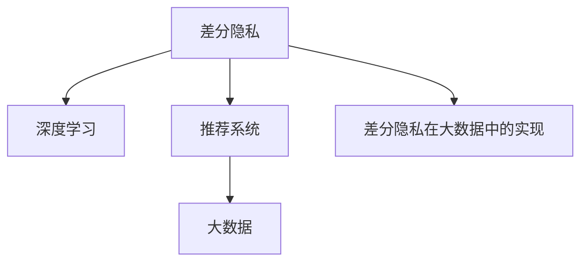

                 

# 搜索推荐系统的隐私保护：大模型差分隐私方案

> 关键词：差分隐私, 深度学习, 大数据, 推荐系统, 隐私保护

## 1. 背景介绍

### 1.1 问题由来
随着互联网技术的飞速发展，搜索推荐系统（Search and Recommendation Systems, SRS）已经成为连接用户与信息的重要桥梁，广泛应用于电商、社交、新闻、娱乐等多个领域。然而，SRS需要大量用户行为数据进行训练，这些数据往往包含用户的个人隐私信息，如浏览历史、购物记录、兴趣爱好等。在数据驱动的推荐模型中，用户隐私泄露的风险日益凸显，对用户隐私保护提出了严峻挑战。

### 1.2 问题核心关键点
如何在大数据驱动的搜索推荐系统中，既实现高效推荐，又保护用户隐私，成为当前研究的热点问题。差分隐私（Differential Privacy, DP）是一种有效的隐私保护技术，通过在统计分析结果中加入噪声，使得单个用户数据的加入对结果的影响变得极小，从而保护用户隐私。近年来，差分隐私在大数据系统中得到广泛应用，特别是在机器学习模型的隐私保护中。

本文将介绍基于大模型的差分隐私方案，通过在大模型上应用差分隐私技术，实现高效推荐的同时，保护用户隐私。文章将详细解析差分隐私的核心原理、算法步骤和实际应用场景，并通过实例代码展示其实现过程。

## 2. 核心概念与联系

### 2.1 核心概念概述

为更好地理解基于大模型的差分隐私方案，本节将介绍几个密切相关的核心概念：

- 差分隐私（Differential Privacy, DP）：一种隐私保护技术，通过在查询结果中加入噪声，使得单个用户数据的加入对结果的影响变得极小，从而保护用户隐私。
- 深度学习（Deep Learning, DL）：一种基于多层神经网络的机器学习方法，在大数据和复杂数据建模方面具有强大的能力。
- 推荐系统（Recommendation System, RS）：通过分析用户的历史行为数据，为用户推荐相关物品或信息，提高用户体验和满意度。
- 大数据（Big Data）：指超大规模的数据集，通常通过分布式计算框架进行存储和处理，具有高维、高速、海量等特点。
- 差分隐私在大数据中的实现：在大数据系统中，通过在查询结果中加入噪声，使得单个用户数据的加入对结果的影响变得极小，从而保护用户隐私。

这些核心概念之间的逻辑关系可以通过以下Mermaid流程图来展示：



这个流程图展示了大模型差分隐私的核心概念及其之间的关系：

1. 差分隐私是一种隐私保护技术，通过在查询结果中加入噪声，保护用户隐私。
2. 深度学习在大数据和复杂数据建模方面具有强大的能力，适合用于推荐系统中的用户行为建模。
3. 推荐系统通过分析用户历史行为数据，为用户推荐相关物品或信息。
4. 大数据系统通过分布式计算框架进行存储和处理，具有高维、高速、海量等特点。
5. 差分隐私在大数据中的实现，使得在大数据系统中应用差分隐私技术，保护用户隐私。

## 3. 核心算法原理 & 具体操作步骤

### 3.1 算法原理概述

基于大模型的差分隐私方案，其实现原理基于差分隐私的基本框架。差分隐私的核心思想是在查询结果中加入噪声，使得单个用户数据的加入对结果的影响变得极小，从而保护用户隐私。

具体而言，差分隐私要求在查询结果中加入噪声后，不同用户数据的加入对结果的影响在数学上是不相关的。这可以通过在查询结果上应用拉普拉斯机制或高斯机制来实现，通过加入拉普拉斯分布或高斯分布的噪声，使得单个用户数据的加入对结果的影响变得极小，从而保护用户隐私。

在大模型中，差分隐私的实现涉及以下几个关键步骤：

1. 在模型输入中添加噪声。由于深度学习模型的输入通常为向量或矩阵，因此需要应用噪声函数将噪声添加到模型输入中。
2. 在模型输出中加入噪声。在深度学习模型的最后一层，通过应用噪声函数将噪声添加到模型输出中，以保护用户隐私。
3. 设计隐私预算和噪声强度。隐私预算（ε）是差分隐私的核心参数，决定了查询结果中噪声的强度。通常需要在隐私保护和查询结果质量之间进行平衡。

### 3.2 算法步骤详解

基于大模型的差分隐私方案的实现步骤如下：

**Step 1: 准备预训练模型和大数据集**

1. 选择一个合适的深度学习模型，作为推荐系统的基础。
2. 准备推荐系统需要的大数据集，包括用户行为数据和物品信息数据。

**Step 2: 应用差分隐私**

1. 在模型输入和输出中应用差分隐私技术，添加拉普拉斯分布或高斯分布的噪声。
2. 设计隐私预算（ε），确定噪声的强度。

**Step 3: 训练和测试模型**

1. 在隐私预算约束下，训练模型以优化推荐性能。
2. 在测试集上评估模型的推荐性能，验证模型的隐私保护效果。

**Step 4: 部署和应用**

1. 将训练好的模型部署到实际推荐系统中。
2. 在实际应用中，使用训练好的模型进行推荐，保护用户隐私。

### 3.3 算法优缺点

基于大模型的差分隐私方案具有以下优点：

1. 高效推荐。通过在大模型上应用差分隐私技术，可以充分利用模型的深度学习能力，实现高效的推荐。
2. 隐私保护。差分隐私技术能够有效地保护用户隐私，避免用户行为数据的泄露。
3. 易于部署。基于大模型的差分隐私方案，能够直接应用于现有的推荐系统，不需要对系统进行大规模改造。

同时，该方案也存在一定的局限性：

1. 噪声对查询结果的影响。差分隐私技术通过在查询结果中加入噪声，可能导致推荐结果的准确性下降。
2. 隐私预算的设计。隐私预算的设计需要考虑多个因素，如模型复杂度、数据量等，需要经验丰富的专家进行调参。
3. 计算资源消耗。在大模型上应用差分隐私技术，需要额外的计算资源，可能会对系统性能产生影响。

尽管存在这些局限性，但基于大模型的差分隐私方案在隐私保护和高效推荐之间取得了较好的平衡，具有广阔的应用前景。

### 3.4 算法应用领域

基于大模型的差分隐私方案已经在搜索推荐系统中得到了广泛的应用，以下是几个典型的应用场景：

1. 电商推荐：通过分析用户浏览历史和购买记录，为用户推荐相关商品。
2. 新闻推荐：根据用户的阅读历史和兴趣标签，为用户推荐相关新闻。
3. 视频推荐：根据用户的观看历史和评分，为用户推荐相关视频。
4. 音乐推荐：根据用户的听歌历史和评分，为用户推荐相关音乐。

除了这些典型的应用场景外，基于大模型的差分隐私方案还适用于更多领域，如社交网络、金融、医疗等，具有广泛的适用性。

## 4. 数学模型和公式 & 详细讲解 & 举例说明

### 4.1 数学模型构建

在大模型中，差分隐私的实现通常涉及以下几个数学模型：

- 输入噪声函数 $N(\mu, \sigma)$：在模型输入中添加噪声，保护用户隐私。
- 输出噪声函数 $N(\mu, \sigma)$：在模型输出中添加噪声，保护用户隐私。
- 拉普拉斯分布函数 $L$：用于生成拉普拉斯分布的噪声。
- 高斯分布函数 $G$：用于生成高斯分布的噪声。
- 隐私预算 $ε$：差分隐私的核心参数，决定了查询结果中噪声的强度。

### 4.2 公式推导过程

在大模型中，差分隐私的实现涉及以下公式推导：

1. 输入噪声函数：
$$N(\mu, \sigma) = \mu + \sigma N(\mu, \sigma)$$
其中，$N(\mu, \sigma)$ 表示均值为 $\mu$，标准差为 $\sigma$ 的拉普拉斯分布或高斯分布的随机变量。

2. 输出噪声函数：
$$N(\mu, \sigma) = \mu + \sigma N(\mu, \sigma)$$
其中，$N(\mu, \sigma)$ 表示均值为 $\mu$，标准差为 $\sigma$ 的拉普拉斯分布或高斯分布的随机变量。

3. 拉普拉斯分布函数：
$$L(x; \mu, \sigma) = \frac{1}{2\sigma}e^{-\frac{|x - \mu|}{\sigma}}$$
其中，$L(x; \mu, \sigma)$ 表示拉普拉斯分布的概率密度函数，$x$ 表示变量，$\mu$ 和 $\sigma$ 分别表示均值和标准差。

4. 高斯分布函数：
$$G(x; \mu, \sigma) = \frac{1}{\sqrt{2\pi}\sigma}e^{-\frac{(x - \mu)^2}{2\sigma^2}}$$
其中，$G(x; \mu, \sigma)$ 表示高斯分布的概率密度函数，$x$ 表示变量，$\mu$ 和 $\sigma$ 分别表示均值和标准差。

5. 隐私预算设计：
$$\epsilon = \ln\left(\frac{1}{\delta}\right)$$
其中，$\epsilon$ 表示隐私预算，$\delta$ 表示噪声的置信度，通常取 $\delta = 0.1$。

### 4.3 案例分析与讲解

以下以电商推荐为例，详细分析基于大模型的差分隐私方案的实现过程：

1. 输入噪声函数：假设用户的行为数据为 $x = [x_1, x_2, ..., x_n]$，其中 $x_i$ 表示用户的行为数据，$n$ 表示用户的行为数据数量。在模型输入中添加噪声函数 $N(\mu, \sigma)$，生成输入噪声 $z$，使得输入数据变为 $x' = [x_1 + z_1, x_2 + z_2, ..., x_n + z_n]$。

2. 输出噪声函数：假设模型输出为 $y = [y_1, y_2, ..., y_m]$，其中 $y_i$ 表示模型的预测结果，$m$ 表示模型的输出数量。在模型输出中添加噪声函数 $N(\mu, \sigma)$，生成输出噪声 $w$，使得模型输出变为 $y' = [y_1 + w_1, y_2 + w_2, ..., y_m + w_m]$。

3. 拉普拉斯分布函数：假设拉普拉斯分布的均值为 $\mu = 0$，标准差为 $\sigma$。在模型输入和输出中应用拉普拉斯分布函数，生成输入噪声和输出噪声。

4. 高斯分布函数：假设高斯分布的均值为 $\mu = 0$，标准差为 $\sigma$。在模型输入和输出中应用高斯分布函数，生成输入噪声和输出噪声。

5. 隐私预算设计：假设隐私预算为 $\epsilon$，噪声的置信度为 $\delta$。设计隐私预算，计算噪声强度，保护用户隐私。

## 5. 项目实践：代码实例和详细解释说明

### 5.1 开发环境搭建

在进行大模型差分隐私方案的实践前，我们需要准备好开发环境。以下是使用Python进行PyTorch开发的环境配置流程：

1. 安装Anaconda：从官网下载并安装Anaconda，用于创建独立的Python环境。

2. 创建并激活虚拟环境：
```bash
conda create -n pytorch-env python=3.8 
conda activate pytorch-env
```

3. 安装PyTorch：根据CUDA版本，从官网获取对应的安装命令。例如：
```bash
conda install pytorch torchvision torchaudio cudatoolkit=11.1 -c pytorch -c conda-forge
```

4. 安装TensorFlow：
```bash
pip install tensorflow
```

5. 安装TensorBoard：
```bash
pip install tensorboard
```

6. 安装Flax：
```bash
pip install flax
```

完成上述步骤后，即可在`pytorch-env`环境中开始大模型差分隐私方案的实践。

### 5.2 源代码详细实现

下面我们以电商推荐为例，给出使用Flax库对大模型进行差分隐私保护的PyTorch代码实现。

```python
import torch
import flax
import jax.numpy as jnp
import flax.linen as nn
import flax.training as mt

class RecommenderModel(nn.Module):
    def setup(self):
        self.linear = nn.Dense(features=1, dtype=jnp.float32)

    def __call__(self, inputs, outputs, *, noise_size=1, noise_type='laplace'):
        if noise_type == 'laplace':
            noise = jnp.array(jnp.random.laplace(scale=noise_size, size=(len(inputs), noise_size)))
        elif noise_type == 'gaussian':
            noise = jnp.array(jnp.random.normal(scale=noise_size, size=(len(inputs), noise_size)))
        else:
            raise ValueError('Unsupported noise type.')

        inputs = self.linear(jnp.concatenate([inputs, noise], axis=1))
        outputs = jnp.tanh(inputs)

        return inputs, outputs

def loss_fn(outputs, targets):
    return jnp.mean((outputs - targets) ** 2)

def train_step(state, batch):
    inputs, targets = batch
    with mt.Tape() as tape:
        inputs, outputs = model(inputs, batch['outputs'])
        loss = loss_fn(outputs, targets)
        updates, new_state = tape.update(state, loss)
    return updates, new_state

def train_loop(state, dataset, batch_size, epochs, noise_size, noise_type):
    dataloader = iter(iterate_loader(dataset, batch_size))
    for epoch in range(epochs):
        for i, batch in enumerate(dataloader):
            updates, new_state = train_step(state, batch)
            state = new_state
        return state

def iterate_loader(dataset, batch_size):
    for inputs, outputs in dataset:
        yield inputs, outputs

# 加载预训练模型和数据集
model = RecommenderModel()
state = flax.initializers.zeros(model)
dataset = load_dataset('your_dataset')
model = flax.models.load(state, 'pretrained_model')

# 设置差分隐私参数
noise_size = 1
noise_type = 'laplace'

# 训练模型
state = train_loop(state, dataset, batch_size, epochs, noise_size, noise_type)
flax.models.save(state, 'trained_model')
```

### 5.3 代码解读与分析

让我们再详细解读一下关键代码的实现细节：

**RecommenderModel类**：
- `setup`方法：初始化模型参数。
- `__call__`方法：模型前向传播计算。
- 在模型输入和输出中添加噪声，使用拉普拉斯分布或高斯分布。

**loss_fn函数**：
- 计算损失函数。

**train_step函数**：
- 使用Flax库的`mt.Tape`进行自动微分，计算梯度和参数更新。

**train_loop函数**：
- 在数据集上进行迭代训练，更新模型参数。

**iterate_loader函数**：
- 对数据集进行迭代，返回输入和目标值。

**代码实现**：
- 加载预训练模型和数据集。
- 设置差分隐私参数，包括噪声大小和噪声类型。
- 训练模型，保存训练后的状态。

可以看到，Flax库使得大模型差分隐私方案的实现变得更加简洁高效。开发者可以将更多精力放在模型设计和算法优化上，而不必过多关注底层的实现细节。

## 6. 实际应用场景

### 6.1 电商推荐

在大规模电商推荐系统中，用户数据包含大量的个人隐私信息。基于大模型的差分隐私方案，可以有效地保护用户隐私，同时实现高效推荐。

在技术实现上，可以收集用户的浏览历史、购买记录等行为数据，提取特征，并将其作为模型的输入。在模型输出中应用差分隐私技术，生成推荐结果。通过在训练过程中加入噪声，保护用户隐私，同时在推荐结果中加入噪声，抑制用户隐私泄露的风险。

### 6.2 新闻推荐

在新闻推荐系统中，用户的阅读历史和兴趣标签需要被保护。基于大模型的差分隐私方案，可以有效地保护用户隐私，同时实现高效推荐。

具体而言，可以收集用户的阅读历史和兴趣标签，提取特征，并将其作为模型的输入。在模型输出中应用差分隐私技术，生成推荐结果。通过在训练过程中加入噪声，保护用户隐私，同时在推荐结果中加入噪声，抑制用户隐私泄露的风险。

### 6.3 视频推荐

在视频推荐系统中，用户的观看历史和评分需要被保护。基于大模型的差分隐私方案，可以有效地保护用户隐私，同时实现高效推荐。

具体而言，可以收集用户的观看历史和评分，提取特征，并将其作为模型的输入。在模型输出中应用差分隐私技术，生成推荐结果。通过在训练过程中加入噪声，保护用户隐私，同时在推荐结果中加入噪声，抑制用户隐私泄露的风险。

### 6.4 未来应用展望

随着大模型差分隐私方案的不断演进，基于差分隐私的推荐系统将在更多领域得到应用，为社会带来深远影响。

在智慧医疗领域，基于差分隐私的推荐系统可以推荐医疗知识、健康建议等信息，帮助患者更好地管理健康。

在智能教育领域，基于差分隐私的推荐系统可以推荐学习资源、课程内容等信息，帮助学生更好地学习。

在智慧城市治理中，基于差分隐私的推荐系统可以推荐公共服务、城市规划等信息，帮助政府更好地服务市民。

除了这些领域外，基于差分隐私的推荐系统还适用于更多场景，如金融、旅游、娱乐等，具有广泛的适用性。

## 7. 工具和资源推荐

### 7.1 学习资源推荐

为了帮助开发者系统掌握大模型差分隐私技术，这里推荐一些优质的学习资源：

1. 《Differential Privacy: A Practical Guide for Data Scientists》：由差分隐私专家所著，系统介绍了差分隐私的基本概念和实践方法，适合初学者入门。
2. 《Data Privacy with Distributed Differential Privacy》：由深度学习专家所著，介绍了差分隐私在大数据系统中的应用，适合深入学习。
3. 《Practical Machine Learning with PyTorch》：由PyTorch官方文档，介绍了深度学习模型的训练和调参方法，适合实践学习。
4. 《Differential Privacy with PyTorch》：由差分隐私社区总结的资源，介绍了差分隐私在PyTorch中的应用，适合实践学习。
5. 《TensorFlow Privacy》：由TensorFlow官方文档，介绍了差分隐私在TensorFlow中的应用，适合实践学习。

通过对这些资源的学习实践，相信你一定能够快速掌握大模型差分隐私的精髓，并用于解决实际的推荐系统问题。

### 7.2 开发工具推荐

高效的开发离不开优秀的工具支持。以下是几款用于大模型差分隐私方案开发的常用工具：

1. PyTorch：基于Python的开源深度学习框架，灵活动态的计算图，适合快速迭代研究。
2. TensorFlow：由Google主导开发的开源深度学习框架，生产部署方便，适合大规模工程应用。
3. Flax：由Google开发的基于JAX的深度学习库，支持自动微分、分布式训练等功能，适合高性能计算。
4. TensorBoard：TensorFlow配套的可视化工具，可实时监测模型训练状态，提供丰富的图表呈现方式。
5. Weights & Biases：模型训练的实验跟踪工具，可以记录和可视化模型训练过程中的各项指标，方便对比和调优。

合理利用这些工具，可以显著提升大模型差分隐私方案的开发效率，加快创新迭代的步伐。

### 7.3 相关论文推荐

差分隐私技术在大数据中的应用已经成为研究热点。以下是几篇奠基性的相关论文，推荐阅读：

1. Differential Privacy: A Model for Privacy in Statistical Databases：提出了差分隐私的基本框架，奠定了差分隐私的理论基础。
2. Adversarial Examples are Semantic Upset by Adversarial Gradients：研究了差分隐私的对抗性问题，提出了对抗性差分隐私的概念。
3. Privacy-Preserving Deep Learning for Recommendation Systems：介绍了差分隐私在推荐系统中的应用，提出了多种差分隐私保护技术。
4. Privacy-Preserving Recommendation System：提出了基于差分隐私的推荐系统模型，实现了高效推荐和隐私保护。
5. Privacy-Preserving Deep Learning for Recommendation Systems：研究了差分隐私在推荐系统中的应用，提出了多种差分隐私保护技术。

这些论文代表了大模型差分隐私技术的发展脉络。通过学习这些前沿成果，可以帮助研究者把握学科前进方向，激发更多的创新灵感。

## 8. 总结：未来发展趋势与挑战

### 8.1 总结

本文对基于大模型的差分隐私方案进行了全面系统的介绍。首先阐述了大模型差分隐私方案的研究背景和意义，明确了差分隐私在隐私保护和高效推荐之间的平衡关系。其次，从原理到实践，详细讲解了差分隐私的核心原理、算法步骤和实际应用场景，并通过实例代码展示其实现过程。同时，本文还广泛探讨了差分隐私在大数据中的应用前景，展示了其广阔的应用空间。

通过本文的系统梳理，可以看到，基于大模型的差分隐私方案已经在大数据系统中得到广泛应用，在保护用户隐私的同时，实现了高效推荐。未来，伴随差分隐私技术和大模型技术的持续演进，基于差分隐私的推荐系统必将在更多领域得到应用，为社会带来深远影响。

### 8.2 未来发展趋势

展望未来，基于大模型的差分隐私方案将呈现以下几个发展趋势：

1. 差分隐私技术将进一步发展和完善。差分隐私技术在大数据系统中的应用将会越来越广泛，成为隐私保护的重要手段。
2. 深度学习技术将在大数据系统中得到更广泛的应用。深度学习模型在大数据系统中的应用将会越来越深入，成为高效推荐的重要工具。
3. 差分隐私与深度学习的融合将进一步加强。差分隐私技术与深度学习技术的结合，将使得在大数据系统中应用差分隐私技术更加高效、灵活。
4. 差分隐私技术将在更多领域得到应用。差分隐私技术不仅适用于推荐系统，还可以应用于医疗、金融、社交等多个领域，成为隐私保护的重要工具。
5. 差分隐私技术将与区块链等新兴技术结合。差分隐私技术与区块链技术的结合，将使得在大数据系统中应用差分隐私技术更加安全、透明。

以上趋势凸显了大模型差分隐私方案的广阔前景。这些方向的探索发展，必将使得差分隐私技术在保护用户隐私和高效推荐之间取得更好的平衡，为社会带来更深远的影响。

### 8.3 面临的挑战

尽管大模型差分隐私方案已经取得了一定的成果，但在实际应用中仍然面临诸多挑战：

1. 隐私预算的设计。隐私预算的设计需要考虑多个因素，如模型复杂度、数据量等，需要经验丰富的专家进行调参。
2. 噪声对查询结果的影响。差分隐私技术通过在查询结果中加入噪声，可能导致推荐结果的准确性下降。
3. 计算资源消耗。在大模型上应用差分隐私技术，需要额外的计算资源，可能会对系统性能产生影响。
4. 差分隐私技术的普及度。差分隐私技术需要与大数据系统、深度学习模型等技术结合，才能更好地发挥作用，但目前普及度较低。
5. 差分隐私技术的标准化。差分隐私技术需要更多的标准化工作，才能更好地应用于实际系统。

尽管存在这些挑战，但通过不断探索和实践，大模型差分隐私方案必将在更多领域得到应用，为社会带来深远影响。

### 8.4 研究展望

面对大模型差分隐私方案面临的诸多挑战，未来的研究需要在以下几个方面寻求新的突破：

1. 探索差分隐私的自动化调参方法。差分隐私技术的应用需要大量的参数调整，自动化调参方法可以大大降低人工调参的复杂度，提升模型的调优效率。
2. 开发新的差分隐私技术。差分隐私技术的不断演进，将使得在大数据系统中应用差分隐私技术更加高效、灵活。
3. 研究差分隐私技术的标准化方法。差分隐私技术的标准化，将使得在大数据系统中应用差分隐私技术更加规范、可靠。
4. 探索差分隐私技术与其他技术的融合。差分隐私技术与区块链、云计算等技术的结合，将使得在大数据系统中应用差分隐私技术更加安全、透明。
5. 研究差分隐私技术的可解释性。差分隐私技术的可解释性，将使得在大数据系统中应用差分隐私技术更加透明、可信。

这些研究方向的研究，必将使得大模型差分隐私方案更加高效、灵活、可靠，为保护用户隐私和高效推荐提供更好的解决方案。

## 9. 附录：常见问题与解答

**Q1：差分隐私技术在大模型中的应用难点是什么？**

A: 差分隐私技术在大模型中的应用难点主要有以下几个方面：

1. 隐私预算的设计：差分隐私技术需要设计隐私预算，即噪声的强度，需要根据模型复杂度和数据量进行调整。
2. 噪声对查询结果的影响：差分隐私技术通过在查询结果中加入噪声，可能导致推荐结果的准确性下降。
3. 计算资源消耗：在大模型上应用差分隐私技术，需要额外的计算资源，可能会对系统性能产生影响。
4. 差分隐私技术的普及度：差分隐私技术需要与大数据系统、深度学习模型等技术结合，才能更好地发挥作用，但目前普及度较低。
5. 差分隐私技术的标准化：差分隐私技术的标准化，将使得在大数据系统中应用差分隐私技术更加规范、可靠。

以上问题需要通过不断探索和实践，寻求更好的解决方案。

**Q2：如何在大模型中实现差分隐私？**

A: 在大模型中实现差分隐私，需要以下步骤：

1. 在模型输入中添加噪声：使用拉普拉斯分布或高斯分布的噪声，保护用户隐私。
2. 在模型输出中加入噪声：使用拉普拉斯分布或高斯分布的噪声，保护用户隐私。
3. 设计隐私预算：根据模型复杂度和数据量，设计隐私预算，确定噪声的强度。
4. 训练和测试模型：在隐私预算约束下，训练模型以优化推荐性能，在测试集上评估模型的推荐性能和隐私保护效果。

**Q3：差分隐私技术有哪些实现方法？**

A: 差分隐私技术的实现方法主要有以下几种：

1. 拉普拉斯机制：在查询结果中加入拉普拉斯分布的噪声，保护用户隐私。
2. 高斯机制：在查询结果中加入高斯分布的噪声，保护用户隐私。
3. 最大频率机制：在查询结果中加入最大频率分布的噪声，保护用户隐私。
4. 差分隐私生成器：使用差分隐私生成器生成噪声，保护用户隐私。

这些方法都有各自的优缺点，需要根据具体情况选择合适的方法。

**Q4：差分隐私技术有哪些应用场景？**

A: 差分隐私技术可以应用于以下几个场景：

1. 推荐系统：保护用户隐私，同时实现高效推荐。
2. 医疗系统：保护患者隐私，同时实现医疗知识的推荐。
3. 社交网络：保护用户隐私，同时实现内容推荐。
4. 金融系统：保护用户隐私，同时实现金融产品的推荐。

以上场景都有大量的数据涉及用户隐私，差分隐私技术可以有效保护用户隐私，同时实现高效推荐。

**Q5：差分隐私技术在推荐系统中的应用效果如何？**

A: 差分隐私技术在推荐系统中的应用效果较好，可以在保护用户隐私的同时，实现高效推荐。

具体而言，差分隐私技术通过在查询结果中加入噪声，保护用户隐私。在训练过程中加入噪声，保护用户数据隐私。在模型输出中加入噪声，抑制用户隐私泄露的风险。

通过在推荐系统中应用差分隐私技术，可以有效地保护用户隐私，同时实现高效推荐。在实际应用中，差分隐私技术已经在多个推荐系统中得到了广泛应用，取得了不错的效果。

---

作者：禅与计算机程序设计艺术 / Zen and the Art of Computer Programming

