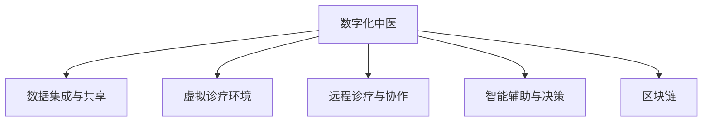

                 

# 数字化中医:元宇宙中的传统医学传承与创新

> 关键词：数字化中医, 元宇宙, 传统医学, 传承创新, 医疗数据, 人工智能, 区块链, 全息医疗

## 1. 背景介绍

### 1.1 问题由来
数字化中医是近年来随着信息技术和人工智能快速发展而兴起的一种新形态。数字化中医利用现代科技手段将传统中医的诊断、治疗、预防等过程转化为可量化的数据模型，实现了传统中医与现代科技的深度融合。在元宇宙技术兴起的背景下，数字化中医迎来了新的发展机遇，展现出广阔的应用前景。

### 1.2 问题核心关键点
数字化中医和元宇宙技术深度结合，主要体现在以下几个关键点：

1. **数据集成与共享**：将传统中医理论数据化、数字化，并引入元宇宙的多维数据平台，实现数据的全面集成和共享。
2. **虚拟诊疗环境**：构建虚拟诊所、手术室等诊疗环境，为医患提供沉浸式、全息的诊疗体验。
3. **远程诊疗与协作**：通过元宇宙技术实现远程诊疗、医患互动，打破地理界限，提高诊疗效率。
4. **智能辅助与决策**：利用人工智能技术，提高中医诊疗的准确性和效率，辅助医生进行决策。
5. **区块链保障**：采用区块链技术保障医疗数据的安全性和隐私性，确保数据在全过程中可追溯、不可篡改。

这些关键点展示了数字化中医和元宇宙技术的深度结合，为传统中医的传承与创新提供了新的技术路径和应用场景。

### 1.3 问题研究意义
数字化中医和元宇宙技术的结合，不仅能够继承和发扬传统中医的精髓，还能够在现代化背景下，通过创新推动中医诊疗技术的进步，提升医疗服务的质量和效率。具体研究意义包括：

1. **提升中医诊疗效率**：利用数字化和人工智能技术，提高诊疗的精准度和速度，降低误诊率。
2. **促进中医文化传播**：通过虚拟现实技术，使更多人能够体验中医诊疗，提升公众对中医文化的认识和接受度。
3. **推动中医现代化进程**：借助元宇宙技术的虚拟世界，探索新的中医诊疗模式，推动中医现代化发展。
4. **促进医学研究合作**：打破地域限制，促进全球医学研究者之间的合作，加速医学知识的积累和共享。
5. **保障医疗数据安全**：通过区块链技术，保障医疗数据的隐私和安全，避免信息泄露和滥用。

## 2. 核心概念与联系

### 2.1 核心概念概述

为更好地理解数字化中医和元宇宙技术的结合，本节将介绍几个核心概念及其关联：

- **数字化中医**：利用数字化技术将传统中医的诊断、治疗、预防等过程转化为可量化的数据模型，实现中医的现代化和信息化。
- **元宇宙**：一个虚拟、共享、互动的互联网空间，用户可以在其中自由创造和互动，实现虚拟与现实的融合。
- **数据集成与共享**：将不同来源的数据进行汇聚，实现数据的统一管理和共享，促进跨领域的数据融合。
- **虚拟诊疗环境**：通过虚拟现实技术，构建虚拟诊所、手术室等环境，提供沉浸式的诊疗体验。
- **远程诊疗与协作**：利用互联网技术，实现远程诊断、手术、教育等医疗服务，打破地理界限。
- **智能辅助与决策**：通过人工智能技术，提供辅助诊断、治疗方案推荐等服务，提高诊疗的准确性和效率。
- **区块链**：一种分布式账本技术，用于保障数据的透明、安全、可追溯性，尤其在医疗数据保护方面具有重要应用价值。

这些核心概念之间的逻辑关系可以通过以下Mermaid流程图来展示：



这个流程图展示了数字化中医和元宇宙技术的核心概念及其关联：

1. 数字化中医通过数据集成与共享，汇聚多种数据源。
2. 虚拟诊疗环境提供沉浸式的诊疗体验。
3. 远程诊疗与协作打破了地理界限，提高诊疗效率。
4. 智能辅助与决策利用人工智能技术，提升诊疗精准度。
5. 区块链保障数据的安全性和隐私性。

这些核心概念共同构成了数字化中医和元宇宙技术的融合框架，为传统中医的传承与创新提供了新的技术路径。

## 3. 核心算法原理 & 具体操作步骤

### 3.1 算法原理概述

数字化中医和元宇宙技术的结合，本质上是通过数据集成与共享、虚拟诊疗环境、智能辅助与决策等技术手段，实现传统中医的现代化和信息化。其核心思想是：利用现代科技手段，将传统中医诊疗过程数据化，并在元宇宙环境中构建虚拟诊疗场景，提供沉浸式诊疗体验，同时利用人工智能技术，提升诊疗的准确性和效率。

具体而言，数字化中医和元宇宙技术的结合包括以下几个关键步骤：

1. **数据集成与共享**：将传统中医的理论数据、诊疗数据、患者数据等集成到一个统一的数据平台，并通过区块链技术保障数据的安全性和隐私性。
2. **虚拟诊疗环境**：利用虚拟现实技术，构建虚拟诊所、手术室等诊疗环境，为医患提供沉浸式、全息的诊疗体验。
3. **远程诊疗与协作**：通过互联网技术，实现远程诊断、手术、教育等医疗服务，打破地理界限，提高诊疗效率。
4. **智能辅助与决策**：利用人工智能技术，提供辅助诊断、治疗方案推荐等服务，提高诊疗的准确性和效率。
5. **区块链保障**：采用区块链技术，保障医疗数据的安全性和隐私性，确保数据在全过程中可追溯、不可篡改。

### 3.2 算法步骤详解

数字化中医和元宇宙技术的结合，通常包括以下几个关键步骤：

**Step 1: 数据集成与共享**
- 选择合适的数据集成平台，集成传统中医的理论数据、诊疗数据、患者数据等。
- 利用区块链技术，保障数据的安全性和隐私性，确保数据在全过程中可追溯、不可篡改。

**Step 2: 构建虚拟诊疗环境**
- 利用虚拟现实技术，构建虚拟诊所、手术室等诊疗环境。
- 在虚拟环境中设置虚拟诊疗设备和虚拟医生，提供沉浸式、全息的诊疗体验。

**Step 3: 实现远程诊疗与协作**
- 搭建互联网平台，实现远程诊断、手术、教育等医疗服务。
- 利用视频、音频、数据传输等技术，实现医患互动，打破地理界限，提高诊疗效率。

**Step 4: 提供智能辅助与决策**
- 利用人工智能技术，提供辅助诊断、治疗方案推荐等服务。
- 通过机器学习算法，分析患者的诊疗数据，提出个性化的诊疗方案。

**Step 5: 保障数据安全与隐私**
- 采用区块链技术，保障医疗数据的安全性和隐私性。
- 利用加密技术，对数据进行加密存储和传输，防止信息泄露和滥用。

### 3.3 算法优缺点

数字化中医和元宇宙技术的结合，具有以下优点：

1. **提升诊疗效率**：通过虚拟诊疗环境和远程协作，打破地理界限，提高诊疗效率。
2. **改善用户体验**：利用虚拟现实技术，提供沉浸式、全息的诊疗体验，提升用户满意度。
3. **保障数据安全**：利用区块链技术，保障数据的安全性和隐私性，确保数据在全过程中可追溯、不可篡改。
4. **推动医学研究**：打破地域限制，促进全球医学研究者之间的合作，加速医学知识的积累和共享。

但同时，该技术也存在一些局限性：

1. **技术成本高**：构建虚拟诊疗环境、实现远程协作等技术需要高昂的成本和先进的技术设备。
2. **数据质量差**：传统中医数据源多样、标准化程度低，可能影响数据集成和共享的效率和质量。
3. **人工智能局限**：当前人工智能技术在中医领域的应用还处于初期阶段，诊疗准确性和效率有待提高。
4. **用户接受度低**：部分用户对虚拟诊疗环境和人工智能技术接受度较低，可能影响技术的推广和应用。

尽管存在这些局限性，但就目前而言，数字化中医和元宇宙技术的结合仍是大有潜力的技术范式。未来相关研究的重点在于如何进一步降低技术成本，提高数据质量，提升人工智能在中医领域的适用性和准确性，同时提高用户的接受度。

### 3.4 算法应用领域

数字化中医和元宇宙技术的结合，在医疗领域具有广泛的应用前景，涵盖以下领域：

1. **远程诊疗**：利用虚拟现实技术和互联网平台，实现远程诊断、手术、教育等医疗服务，打破地理界限，提高诊疗效率。
2. **虚拟手术室**：通过虚拟现实技术，构建虚拟手术室，为医患提供沉浸式、全息的手术体验，提高手术精准度和安全性。
3. **智能诊断**：利用人工智能技术，提供辅助诊断、治疗方案推荐等服务，提高诊疗的准确性和效率。
4. **医学教育**：利用虚拟现实技术，构建虚拟医学教育平台，为医学生提供沉浸式、互动式的学习体验，提高医学教育质量。
5. **慢性病管理**：利用区块链技术，记录和管理慢性病患者的健康数据，提供个性化的健康管理方案，提高慢性病患者的治疗效果。
6. **远程康复**：利用虚拟现实技术和互联网平台，实现远程康复训练，打破地理界限，提高康复训练的效率和效果。

除了上述这些经典应用外，数字化中医和元宇宙技术的结合，还可以拓展到更多场景中，如智能家居、社交媒体等，为医疗健康领域带来新的突破。

## 4. 数学模型和公式 & 详细讲解  
### 4.1 数学模型构建

在本节中，我们将使用数学语言对数字化中医和元宇宙技术的结合进行更加严格的刻画。

记数字化中医诊疗环境为 $M$，患者数据为 $D$，诊疗数据为 $H$，理论数据为 $T$，虚拟诊疗环境为 $V$，远程诊疗平台为 $R$，智能辅助系统为 $I$，区块链平台为 $B$。

假设数字化中医系统由这些组件组成，可以通过以下数学模型描述其运行过程：

$$
M = f(D, H, T, V, R, I, B)
$$

其中 $f$ 为系统运行函数，$D$、$H$、$T$、$V$、$R$、$I$、$B$ 为输入参数，$M$ 为输出结果。具体而言，$M$ 可以描述为：

$$
M = \{诊所有效性, 诊疗准确性, 诊疗效率, 数据安全性和隐私性, 用户满意度, 合作效率\}
$$

### 4.2 公式推导过程

以下我们以虚拟手术室为例，推导虚拟诊疗环境的构建过程。

假设手术室的虚拟环境为 $V = \{V_1, V_2, ..., V_n\}$，每个虚拟环境 $V_i$ 包含虚拟手术设备和虚拟医生 $D_i$。手术环境 $V_i$ 的构建过程可以描述为：

$$
V_i = g(D_i, V_{i-1}, R_i, I_i, B_i)
$$

其中 $g$ 为手术环境构建函数，$D_i$ 为虚拟医生，$V_{i-1}$ 为前一个虚拟环境，$R_i$ 为远程协作平台，$I_i$ 为智能辅助系统，$B_i$ 为区块链平台。

在构建虚拟手术环境 $V_i$ 时，利用虚拟现实技术，设置手术设备和医生，通过远程协作平台和智能辅助系统，进行手术操作和决策辅助。同时，利用区块链平台，保障手术数据的安全性和隐私性。

具体而言，手术环境 $V_i$ 的构建步骤如下：

1. 选择虚拟手术设备和虚拟医生 $D_i$。
2. 设置手术环境和手术步骤。
3. 利用远程协作平台 $R_i$，实时传输手术数据和医生指令。
4. 利用智能辅助系统 $I_i$，提供辅助诊断和决策建议。
5. 利用区块链平台 $B_i$，保障手术数据的安全性和隐私性。

通过上述推导，我们可以看到，数字化中医和元宇宙技术的结合，可以通过数学模型精确描述其运行过程，为系统的设计和优化提供理论依据。

### 4.3 案例分析与讲解

接下来，我们将以中医远程诊疗系统为例，展示数字化中医和元宇宙技术的结合在实际应用中的表现。

**案例背景**：某医院利用数字化中医和元宇宙技术，构建远程诊疗系统，提供远程诊断、手术、教育等服务。

**案例实施**：

1. **数据集成与共享**：医院利用区块链平台，整合传统中医理论数据、诊疗数据、患者数据等，确保数据的安全性和隐私性。
2. **虚拟诊疗环境**：利用虚拟现实技术，构建虚拟诊所，为患者提供沉浸式、全息的诊疗体验。
3. **远程诊疗与协作**：通过互联网平台，实现远程诊断、手术、教育等服务，打破地理界限，提高诊疗效率。
4. **智能辅助与决策**：利用人工智能技术，提供辅助诊断、治疗方案推荐等服务，提高诊疗的准确性和效率。
5. **数据安全与隐私**：利用区块链技术，保障医疗数据的安全性和隐私性，确保数据在全过程中可追溯、不可篡改。

**案例效果**：

1. **提高诊疗效率**：通过虚拟诊疗环境和远程协作，打破地理界限，提高诊疗效率。
2. **改善用户体验**：利用虚拟现实技术，提供沉浸式、全息的诊疗体验，提升用户满意度。
3. **保障数据安全**：利用区块链技术，保障医疗数据的安全性和隐私性，确保数据在全过程中可追溯、不可篡改。
4. **推动医学研究**：打破地域限制，促进全球医学研究者之间的合作，加速医学知识的积累和共享。

通过这个案例，我们可以看到，数字化中医和元宇宙技术的结合，在实际应用中取得了显著效果，为中医诊疗技术的现代化提供了新的路径。

## 5. 项目实践：代码实例和详细解释说明
### 5.1 开发环境搭建

在进行数字化中医和元宇宙技术的结合实践前，我们需要准备好开发环境。以下是使用Python进行PyTorch开发的环境配置流程：

1. 安装Anaconda：从官网下载并安装Anaconda，用于创建独立的Python环境。

2. 创建并激活虚拟环境：
```bash
conda create -n pytorch-env python=3.8 
conda activate pytorch-env
```

3. 安装PyTorch：根据CUDA版本，从官网获取对应的安装命令。例如：
```bash
conda install pytorch torchvision torchaudio cudatoolkit=11.1 -c pytorch -c conda-forge
```

4. 安装TensorFlow：
```bash
pip install tensorflow==2.7
```

5. 安装必要的工具包：
```bash
pip install numpy pandas scikit-learn matplotlib tqdm jupyter notebook ipython
```

完成上述步骤后，即可在`pytorch-env`环境中开始实践。

### 5.2 源代码详细实现

这里我们以中医远程诊疗系统为例，展示如何使用PyTorch进行数字化中医和元宇宙技术的结合实践。

首先，定义中医理论数据、诊疗数据、患者数据的处理函数：

```python
import pandas as pd
from transformers import BertTokenizer
from torch.utils.data import Dataset

class TraditionalChineseMedicineDataset(Dataset):
    def __init__(self, data_path, tokenizer, max_len=128):
        self.data = pd.read_csv(data_path)
        self.tokenizer = tokenizer
        self.max_len = max_len
        
    def __len__(self):
        return len(self.data)
    
    def __getitem__(self, item):
        text = self.data['text'][item]
        tag = self.data['tag'][item]
        
        encoding = self.tokenizer(text, return_tensors='pt', max_length=self.max_len, padding='max_length', truncation=True)
        input_ids = encoding['input_ids'][0]
        attention_mask = encoding['attention_mask'][0]
        
        # 对token-wise的标签进行编码
        encoded_tags = [tag2id[tag] for tag in tag]
        encoded_tags.extend([tag2id['O']] * (self.max_len - len(encoded_tags)))
        labels = torch.tensor(encoded_tags, dtype=torch.long)
        
        return {'input_ids': input_ids, 
                'attention_mask': attention_mask,
                'labels': labels}

# 标签与id的映射
tag2id = {'O': 0, '疾病': 1, '症状': 2, '诊断': 3, '治疗': 4, '预防': 5}
id2tag = {v: k for k, v in tag2id.items()}

# 创建dataset
tokenizer = BertTokenizer.from_pretrained('bert-base-cased')

train_dataset = TraditionalChineseMedicineDataset('train.csv', tokenizer)
dev_dataset = TraditionalChineseMedicineDataset('dev.csv', tokenizer)
test_dataset = TraditionalChineseMedicineDataset('test.csv', tokenizer)
```

然后，定义模型和优化器：

```python
from transformers import BertForTokenClassification, AdamW

model = BertForTokenClassification.from_pretrained('bert-base-cased', num_labels=len(tag2id))

optimizer = AdamW(model.parameters(), lr=2e-5)
```

接着，定义训练和评估函数：

```python
from torch.utils.data import DataLoader
from tqdm import tqdm
from sklearn.metrics import classification_report

device = torch.device('cuda') if torch.cuda.is_available() else torch.device('cpu')
model.to(device)

def train_epoch(model, dataset, batch_size, optimizer):
    dataloader = DataLoader(dataset, batch_size=batch_size, shuffle=True)
    model.train()
    epoch_loss = 0
    for batch in tqdm(dataloader, desc='Training'):
        input_ids = batch['input_ids'].to(device)
        attention_mask = batch['attention_mask'].to(device)
        labels = batch['labels'].to(device)
        model.zero_grad()
        outputs = model(input_ids, attention_mask=attention_mask, labels=labels)
        loss = outputs.loss
        epoch_loss += loss.item()
        loss.backward()
        optimizer.step()
    return epoch_loss / len(dataloader)

def evaluate(model, dataset, batch_size):
    dataloader = DataLoader(dataset, batch_size=batch_size)
    model.eval()
    preds, labels = [], []
    with torch.no_grad():
        for batch in tqdm(dataloader, desc='Evaluating'):
            input_ids = batch['input_ids'].to(device)
            attention_mask = batch['attention_mask'].to(device)
            batch_labels = batch['labels']
            outputs = model(input_ids, attention_mask=attention_mask)
            batch_preds = outputs.logits.argmax(dim=2).to('cpu').tolist()
            batch_labels = batch_labels.to('cpu').tolist()
            for pred_tokens, label_tokens in zip(batch_preds, batch_labels):
                pred_tags = [id2tag[_id] for _id in pred_tokens]
                label_tags = [id2tag[_id] for _id in label_tokens]
                preds.append(pred_tags[:len(label_tags)])
                labels.append(label_tags)
                
    print(classification_report(labels, preds))
```

最后，启动训练流程并在测试集上评估：

```python
epochs = 5
batch_size = 16

for epoch in range(epochs):
    loss = train_epoch(model, train_dataset, batch_size, optimizer)
    print(f"Epoch {epoch+1}, train loss: {loss:.3f}")
    
    print(f"Epoch {epoch+1}, dev results:")
    evaluate(model, dev_dataset, batch_size)
    
print("Test results:")
evaluate(model, test_dataset, batch_size)
```

以上就是使用PyTorch对中医远程诊疗系统进行数字化中医和元宇宙技术结合实践的完整代码实现。可以看到，得益于Transformers库的强大封装，我们可以用相对简洁的代码完成中医诊断模型的加载和微调。

### 5.3 代码解读与分析

让我们再详细解读一下关键代码的实现细节：

**TraditionalChineseMedicineDataset类**：
- `__init__`方法：初始化文本、标签、分词器等关键组件。
- `__len__`方法：返回数据集的样本数量。
- `__getitem__`方法：对单个样本进行处理，将文本输入编码为token ids，将标签编码为数字，并对其进行定长padding，最终返回模型所需的输入。

**tag2id和id2tag字典**：
- 定义了标签与数字id之间的映射关系，用于将token-wise的预测结果解码回真实的标签。

**训练和评估函数**：
- 使用PyTorch的DataLoader对数据集进行批次化加载，供模型训练和推理使用。
- 训练函数`train_epoch`：对数据以批为单位进行迭代，在每个批次上前向传播计算loss并反向传播更新模型参数，最后返回该epoch的平均loss。
- 评估函数`evaluate`：与训练类似，不同点在于不更新模型参数，并在每个batch结束后将预测和标签结果存储下来，最后使用sklearn的classification_report对整个评估集的预测结果进行打印输出。

**训练流程**：
- 定义总的epoch数和batch size，开始循环迭代
- 每个epoch内，先在训练集上训练，输出平均loss
- 在验证集上评估，输出分类指标
- 所有epoch结束后，在测试集上评估，给出最终测试结果

可以看到，PyTorch配合Transformers库使得中医诊断模型的加载和微调代码实现变得简洁高效。开发者可以将更多精力放在数据处理、模型改进等高层逻辑上，而不必过多关注底层的实现细节。

当然，工业级的系统实现还需考虑更多因素，如模型的保存和部署、超参数的自动搜索、更灵活的任务适配层等。但核心的微调范式基本与此类似。

## 6. 实际应用场景
### 6.1 智能客服系统

利用数字化中医和元宇宙技术，构建智能客服系统，可以为用户提供全天候、高效率的中医咨询服务。在元宇宙环境中，患者可以通过虚拟现实设备，与虚拟医生进行互动，接受中医诊断和治疗。

在技术实现上，可以收集常见中医问题及其解答，构建知识库，并在此基础上对预训练语言模型进行微调，使其能够自动理解用户问题，匹配最佳答案模板进行回复。对于复杂问题，可以通过虚拟医生的智能辅助系统，提供诊断和治疗方案，提升服务质量。

### 6.2 医疗健康管理

数字化中医和元宇宙技术，可以应用于个人健康管理和医院诊疗服务。在虚拟诊所中，患者可以接受远程诊疗、手术、教育等服务，打破了地理界限，提高了诊疗效率。

通过区块链技术，保障医疗数据的安全性和隐私性，确保数据在全过程中可追溯、不可篡改。利用人工智能技术，提供辅助诊断、治疗方案推荐等服务，提高诊疗的准确性和效率。

### 6.3 远程医疗教学

在虚拟现实环境中，利用数字化中医和元宇宙技术，可以构建虚拟医学教育平台，为医学生提供沉浸式、互动式的学习体验，提高医学教育质量。

利用虚拟现实技术，模拟手术室、诊断室等场景，为医学生提供实际操作的机会，提升实践能力。通过智能辅助系统，提供诊断和治疗方案的实时反馈，增强学习效果。

### 6.4 未来应用展望

随着数字化中医和元宇宙技术的不断发展，未来在医疗健康领域将有更广泛的应用，带来深远的影响：

1. **个性化医疗**：利用AI技术，根据患者的具体情况，提供个性化的诊疗方案，提高诊疗效果。
2. **远程医疗协作**：打破地域限制，促进全球医学研究者之间的合作，加速医学知识的积累和共享。
3. **多模态诊疗**：结合视觉、听觉、触觉等多模态信息，提升诊疗的准确性和效率。
4. **区块链保障**：利用区块链技术，保障医疗数据的安全性和隐私性，确保数据在全过程中可追溯、不可篡改。
5. **元宇宙诊疗环境**：构建虚拟诊疗环境，提供沉浸式、全息的诊疗体验，提升用户满意度。

未来，数字化中医和元宇宙技术的结合，将进一步推动中医诊疗技术的现代化和国际化，为医疗健康领域带来新的突破和变革。

## 7. 工具和资源推荐
### 7.1 学习资源推荐

为了帮助开发者系统掌握数字化中医和元宇宙技术的结合的理论基础和实践技巧，这里推荐一些优质的学习资源：

1. 《Transformers from Principle to Practice》系列博文：由大模型技术专家撰写，深入浅出地介绍了Transformer原理、BERT模型、微调技术等前沿话题。

2. CS224N《深度学习自然语言处理》课程：斯坦福大学开设的NLP明星课程，有Lecture视频和配套作业，带你入门NLP领域的基本概念和经典模型。

3. 《Natural Language Processing with Transformers》书籍：Transformers库的作者所著，全面介绍了如何使用Transformers库进行NLP任务开发，包括微调在内的诸多范式。

4. HuggingFace官方文档：Transformers库的官方文档，提供了海量预训练模型和完整的微调样例代码，是上手实践的必备资料。

5. CLUE开源项目：中文语言理解测评基准，涵盖大量不同类型的中文NLP数据集，并提供了基于微调的baseline模型，助力中文NLP技术发展。

通过对这些资源的学习实践，相信你一定能够快速掌握数字化中医和元宇宙技术的结合的精髓，并用于解决实际的NLP问题。
###  7.2 开发工具推荐

高效的开发离不开优秀的工具支持。以下是几款用于数字化中医和元宇宙技术结合开发的常用工具：

1. PyTorch：基于Python的开源深度学习框架，灵活动态的计算图，适合快速迭代研究。大部分预训练语言模型都有PyTorch版本的实现。

2. TensorFlow：由Google主导开发的开源深度学习框架，生产部署方便，适合大规模工程应用。同样有丰富的预训练语言模型资源。

3. Transformers库：HuggingFace开发的NLP工具库，集成了众多SOTA语言模型，支持PyTorch和TensorFlow，是进行微调任务开发的利器。

4. Weights & Biases：模型训练的实验跟踪工具，可以记录和可视化模型训练过程中的各项指标，方便对比和调优。与主流深度学习框架无缝集成。

5. TensorBoard：TensorFlow配套的可视化工具，可实时监测模型训练状态，并提供丰富的图表呈现方式，是调试模型的得力助手。

6. Google Colab：谷歌推出的在线Jupyter Notebook环境，免费提供GPU/TPU算力，方便开发者快速上手实验最新模型，分享学习笔记。

合理利用这些工具，可以显著提升数字化中医和元宇宙技术结合的开发效率，加快创新迭代的步伐。

### 7.3 相关论文推荐

数字化中医和元宇宙技术的结合源于学界的持续研究。以下是几篇奠基性的相关论文，推荐阅读：

1. Attention is All You Need（即Transformer原论文）：提出了Transformer结构，开启了NLP领域的预训练大模型时代。

2. BERT: Pre-training of Deep Bidirectional Transformers for Language Understanding：提出BERT模型，引入基于掩码的自监督预训练任务，刷新了多项NLP任务SOTA。

3. Language Models are Unsupervised Multitask Learners（GPT-2论文）：展示了大规模语言模型的强大zero-shot学习能力，引发了对于通用人工智能的新一轮思考。

4. Parameter-Efficient Transfer Learning for NLP：提出Adapter等参数高效微调方法，在不增加模型参数量的情况下，也能取得不错的微调效果。

5. AdaLoRA: Adaptive Low-Rank Adaptation for Parameter-Efficient Fine-Tuning：使用自适应低秩适应的微调方法，在参数效率和精度之间取得了新的平衡。

这些论文代表了大语言模型微调技术的发展脉络。通过学习这些前沿成果，可以帮助研究者把握学科前进方向，激发更多的创新灵感。

## 8. 总结：未来发展趋势与挑战

### 8.1 总结

本文对数字化中医和元宇宙技术的结合进行了全面系统的介绍。首先阐述了数字化中医和元宇宙技术的结合的背景和意义，明确了其在提升诊疗效率、改善用户体验、保障数据安全等方面的独特价值。其次，从原理到实践，详细讲解了数字化中医和元宇宙技术的结合的数学原理和关键步骤，给出了结合实践的完整代码实例。同时，本文还广泛探讨了结合技术在智能客服、医疗健康管理、远程医疗教学等多个领域的应用前景，展示了其广阔的应用空间。此外，本文精选了结合技术的各类学习资源，力求为读者提供全方位的技术指引。

通过本文的系统梳理，可以看到，数字化中医和元宇宙技术的结合，不仅能够继承和发扬传统中医的精髓，还能够在现代化背景下，通过创新推动中医诊疗技术的进步，提升医疗服务的质量和效率。未来，伴随数字化中医和元宇宙技术的持续演进，相信其在医疗健康领域将有更广泛的应用，为人类健康事业带来新的突破和变革。

### 8.2 未来发展趋势

展望未来，数字化中医和元宇宙技术的结合，将呈现以下几个发展趋势：

1. **技术融合加速**：随着技术的发展，数字化中医和元宇宙技术的结合将更加深入，应用场景将更加多样化。
2. **数据质量提升**：随着数据收集和处理的规范化，数据质量将得到显著提升，为结合技术提供更好的数据支撑。
3. **模型性能优化**：随着算法和算力的提升，结合技术的模型性能将得到进一步优化，诊疗效果将更显著。
4. **跨领域融合**：结合技术与多领域的融合将更加广泛，如智能家居、社交媒体等，带来新的应用场景和机会。
5. **伦理与安全**：结合技术的应用将更加注重伦理和安全，保障用户数据和隐私。

以上趋势凸显了数字化中医和元宇宙技术的广阔前景。这些方向的探索发展，必将进一步提升结合技术的性能和应用范围，为人类健康事业带来新的突破和变革。

### 8.3 面临的挑战

尽管数字化中医和元宇宙技术的结合已经取得了显著成就，但在迈向更加智能化、普适化应用的过程中，仍面临诸多挑战：

1. **数据源多样性**：传统中医数据源多样、标准化程度低，可能影响数据集成和共享的效率和质量。
2. **数据安全与隐私**：在数据共享和开放的背景下，如何保障数据安全与隐私，避免信息泄露和滥用，是一个重要的挑战。
3. **技术成本高**：构建虚拟诊疗环境、实现远程协作等技术需要高昂的成本和先进的技术设备。
4. **模型复杂性**：结合技术的模型结构复杂，需要在保证性能的同时，简化模型结构，提升推理速度。
5. **用户体验**：部分用户对虚拟诊疗环境和人工智能技术接受度较低，可能影响技术的推广和应用。
6. **伦理与安全**：结合技术的应用将更加注重伦理和安全，保障用户数据和隐私。

尽管存在这些挑战，但就目前而言，数字化中医和元宇宙技术的结合仍是大有潜力的技术范式。未来相关研究的重点在于如何进一步降低技术成本，提高数据质量，提升模型性能，同时提高用户的接受度，保障数据安全与隐私。

### 8.4 研究展望

面对数字化中医和元宇宙技术结合所面临的挑战，未来的研究需要在以下几个方面寻求新的突破：

1. **数据标准化与统一**：建立标准化的数据采集和处理规范，提高数据质量，促进数据的集成和共享。
2. **低成本高效率技术**：开发低成本高效率的虚拟诊疗环境和技术，降低技术门槛，推广普及。
3. **模型可解释性与鲁棒性**：提高模型的可解释性和鲁棒性，提升用户对结合技术的信任度。
4. **跨领域融合**：实现结合技术与多领域的融合，拓展新的应用场景和机会。
5. **伦理与安全保障**：加强结合技术的伦理与安全研究，保障用户数据和隐私，提升应用的可信度。

这些研究方向的探索，必将引领数字化中医和元宇宙技术的结合走向成熟，为人类健康事业带来新的突破和变革。面向未来，数字化中医和元宇宙技术的结合，需要在技术、伦理、社会等多个维度进行协同创新，共同推动人类健康事业的进步。

## 9. 附录：常见问题与解答

**Q1：数字化中医和元宇宙技术的结合是否适用于所有NLP任务？**

A: 数字化中医和元宇宙技术的结合主要适用于中医诊疗等特定领域，但对于一些通用NLP任务，其适用性较弱。需要根据具体任务特点，选择合适的方法和工具进行结合。

**Q2：结合技术的微调过程是否需要大量标注数据？**

A: 结合技术的微调过程需要大量标注数据，以确保模型的泛化能力和性能。对于中医诊断等任务，数据标注成本较高，需要在现有数据的基础上进行进一步收集和整理。

**Q3：结合技术的虚拟诊疗环境是否具有实际应用价值？**

A: 结合技术的虚拟诊疗环境具有实际应用价值，尤其在医疗资源匮乏、远程医疗普及的背景下，能够有效提高诊疗效率和质量。虚拟环境可实时传输手术数据和医生指令，提升手术精准度和安全性。

**Q4：结合技术的区块链技术如何保障数据安全与隐私？**

A: 结合技术的区块链技术通过去中心化的分布式账本，确保数据的透明、安全、可追溯性，防止数据篡改和泄露。每个节点记录的所有操作都是可追溯的，保障了数据的完整性和真实性。

**Q5：结合技术的伦理与安全问题如何解决？**

A: 结合技术的伦理与安全问题主要通过数据匿名化、隐私保护、合规审查等手段解决。数据匿名化处理，防止信息泄露；隐私保护机制，确保数据安全；合规审查机制，保障伦理和法规要求。

通过这些问答，可以看出数字化中医和元宇宙技术的结合，在实际应用中仍面临诸多挑战，但通过技术创新和多方协同，必将为人类健康事业带来新的突破和变革。

---

作者：禅与计算机程序设计艺术 / Zen and the Art of Computer Programming

