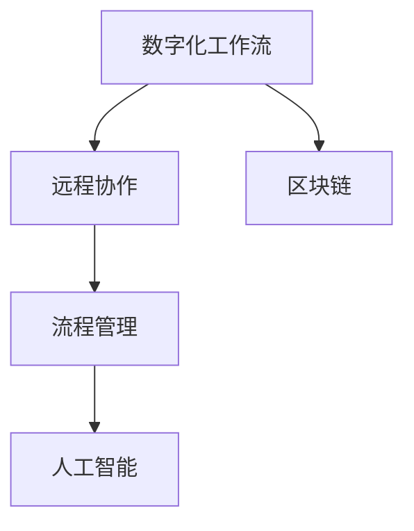

                 

# 数字化工作流创业：远程协作的效率工具

> 关键词：数字化工作流, 远程协作, 效率工具, 自动化, 流程管理, 区块链, 人工智能

## 1. 背景介绍

### 1.1 问题由来

在当前信息时代，远程工作已成为一种主流的工作方式，尤其是COVID-19疫情爆发后，企业不得不加速数字化转型，以应对快速变化的商业环境。然而，数字化转型并非一蹴而就，它涉及到企业组织架构的重构、流程管理的优化、技术工具的引入等多个方面。其中，数字化工作流创业作为数字化转型的重要一环，能够显著提升远程协作的效率，为企业创造更大的价值。

### 1.2 问题核心关键点

- **数字化工作流**：将传统线下工作流程数字化，实现工作流程的自动化、可视化、协同化，提升远程协作效率。
- **远程协作**：借助互联网和数字工具，使远程团队能够高效协同，克服地理位置带来的沟通和协作障碍。
- **效率工具**：设计开发适合远程团队使用的工具，减少人为错误，提升工作速度和质量。
- **自动化**：通过引入自动化技术，实现流程的智能化、自动化，减少人为干预，提升效率。
- **流程管理**：优化和标准化工作流程，减少流程冗余，提高流程效率。
- **区块链**：利用区块链技术的不可篡改性，保障工作流数据的透明性和安全性。
- **人工智能**：结合AI算法，实现流程的智能分析、预测和优化。

这些关键点构成了数字化工作流创业的技术基础和应用方向，帮助远程团队在数字化转型的浪潮中保持竞争力。

### 1.3 问题研究意义

数字化工作流创业在提升远程协作效率、推动企业数字化转型方面具有重要意义：

- **提高工作效率**：自动化和智能化技术的应用，可以显著减少重复性劳动，提高工作速度和质量。
- **降低成本**：数字化工作流减少了对传统办公空间的依赖，降低了企业运营成本。
- **提升员工满意度**：灵活的工作时间和地点选择，可以提高员工的工作满意度和工作效率。
- **增强企业竞争力**：数字化工作流能够快速响应市场变化，提升企业的响应速度和灵活性。
- **数据透明性**：区块链技术的应用可以保障工作流数据的透明性，减少信息不对称和信任风险。

数字化工作流创业不仅是一场技术革命，更是一场商业模式的变革，将为企业的数字化转型提供坚实的基础。

## 2. 核心概念与联系

### 2.1 核心概念概述

为更好地理解数字化工作流创业的原理和实践，本节将介绍几个核心概念及其之间的联系：

- **数字化工作流**：通过将传统工作流程数字化，利用自动化和智能化的手段，提高工作效率和协作效果。
- **远程协作**：利用互联网和数字化工具，使地理位置不限制的团队成员能够高效协同工作。
- **流程管理**：对工作流程进行优化和标准化，减少流程冗余，提高流程效率。
- **区块链**：利用分布式账本和智能合约技术，实现数据透明性和安全性。
- **人工智能**：结合机器学习算法，实现工作流数据的智能分析和预测。

这些核心概念之间的逻辑关系可以通过以下Mermaid流程图来展示：



这个流程图展示了大语言模型的核心概念及其之间的关系：

1. 数字化工作流通过自动化和智能化技术，提高远程协作的效率。
2. 远程协作利用互联网和数字化工具，使团队成员能够高效协同。
3. 流程管理通过优化和标准化工作流程，减少流程冗余。
4. 区块链利用分布式账本和智能合约技术，保障工作流数据的透明性和安全性。
5. 人工智能结合机器学习算法，实现工作流数据的智能分析和预测。

这些概念共同构成了数字化工作流创业的技术框架，使得企业能够高效地进行远程协作和数字化转型。

## 3. 核心算法原理 & 具体操作步骤
### 3.1 算法原理概述

数字化工作流创业的核心算法原理可以概括为：利用数字化工具和自动化技术，优化和标准化工作流程，提高远程协作效率。

具体来说，数字化工作流创业分为以下几个步骤：

1. **需求分析**：对企业现有工作流程进行需求分析，找出存在的问题和改进点。
2. **流程设计**：基于需求分析结果，设计新的工作流程，实现自动化和智能化。
3. **工具选择**：选择适合企业需求的数字化工具，如项目管理软件、协作平台、区块链技术等。
4. **实施部署**：将新设计的工作流程和选择的工具在企业中实施部署。
5. **持续优化**：根据实际应用情况，不断优化和调整工作流程和工具。

### 3.2 算法步骤详解

**Step 1: 需求分析**

对企业现有工作流程进行详细分析，找出存在的痛点和改进空间。具体步骤如下：

1. 调研：通过问卷调查、访谈等方式，了解各部门的业务流程和问题。
2. 分析：对收集到的数据进行分类整理，找出流程中的瓶颈和重复性工作。
3. 优先级排序：根据问题的严重性和改进的可行性，对优先级进行排序。

**Step 2: 流程设计**

基于需求分析结果，设计新的工作流程，实现自动化和智能化。具体步骤如下：

1. 绘制流程图：使用流程图工具，绘制当前工作流程的流程图。
2. 优化流程：结合需求分析结果，对流程进行优化，减少冗余和瓶颈。
3. 引入自动化：引入自动化工具，如RPA（机器人流程自动化），实现流程的智能化。

**Step 3: 工具选择**

选择适合企业需求的数字化工具，具体步骤如下：

1. 调研：了解市场上的数字化工具，选择适合企业需求的工具。
2. 试用：对选定的工具进行试用，评估其功能和使用体验。
3. 部署：根据试用结果，决定是否正式部署。

**Step 4: 实施部署**

将新设计的工作流程和选择的工具在企业中实施部署，具体步骤如下：

1. 培训：对企业员工进行工具使用培训，确保其能够熟练使用。
2. 配置：对工具进行配置和集成，确保其能够与企业现有的系统无缝对接。
3. 试运行：进行小范围试运行，评估工具效果。

**Step 5: 持续优化**

根据实际应用情况，不断优化和调整工作流程和工具，具体步骤如下：

1. 反馈收集：收集员工对工具的使用反馈，找出存在的问题。
2. 优化调整：根据反馈结果，对工作流程和工具进行优化调整。
3. 迭代改进：持续迭代，不断改进工作流程和工具，提高效率。

### 3.3 算法优缺点

数字化工作流创业的算法具有以下优点：

1. **提高效率**：通过自动化和智能化技术，可以显著减少重复性劳动，提高工作效率。
2. **降低成本**：减少了对传统办公空间的依赖，降低了企业运营成本。
3. **提高员工满意度**：灵活的工作时间和地点选择，可以提高员工的工作满意度和工作效率。
4. **增强企业竞争力**：数字化工作流能够快速响应市场变化，提升企业的响应速度和灵活性。

同时，该算法也存在一定的局限性：

1. **技术门槛高**：需要一定的技术积累和专业知识，对企业技术团队的要求较高。
2. **数据隐私问题**：数字化工具的应用可能会涉及到数据隐私和安全问题，需要谨慎处理。
3. **文化变革**：数字化工作流需要企业文化的变革，可能需要一段时间来适应。
4. **实施难度大**：复杂流程的优化和工具的部署可能需要较长时间，难度较大。

尽管存在这些局限性，但就目前而言，数字化工作流创业仍是大规模企业数字化转型的重要手段。未来相关研究的重点在于如何进一步降低技术门槛，提高数字化工具的使用便捷性，同时兼顾数据隐私和文化变革等因素。

### 3.4 算法应用领域

数字化工作流创业的应用领域非常广泛，包括但不限于以下几个方面：

1. **项目管理**：利用数字化工具进行项目进度管理、资源分配、任务调度等。
2. **客户关系管理**：通过自动化工具提高客户互动和满意度，如CRM系统。
3. **供应链管理**：通过数字化工具优化供应链流程，提高供应链效率。
4. **人力资源管理**：利用自动化工具进行招聘、培训、绩效评估等。
5. **财务管理**：利用数字化工具进行财务报表自动化生成、发票自动化处理等。
6. **研发流程管理**：通过数字化工具优化研发流程，提高研发效率。
7. **客户服务**：通过数字化工具提高客户服务效率和质量，如聊天机器人。

除了上述这些经典应用外，数字化工作流创业还被创新性地应用到更多场景中，如智能制造、智慧医疗、智能城市等，为数字化转型带来了新的思路和方向。

## 4. 数学模型和公式 & 详细讲解  
### 4.1 数学模型构建

数字化工作流创业的数学模型可以概括为：通过数据分析和优化算法，实现工作流程的自动化和智能化。

假设企业现有工作流程的瓶颈为 $X$，流程优化后的瓶颈为 $Y$，则数字化工作流创业的数学模型为：

$$
Y = f(X, \alpha)
$$

其中，$f$ 表示优化函数，$\alpha$ 表示优化参数。

### 4.2 公式推导过程

以下我们以项目管理系统为例，推导项目优化后的流程瓶颈：

假设项目管理的瓶颈为 $X$，包括任务分配、进度跟踪、资源调度等。通过引入数字化工具，优化后的瓶颈为 $Y$。优化过程可以表示为：

$$
Y = X - \alpha \cdot X
$$

其中，$\alpha$ 表示优化参数，一般为一个介于0到1之间的常数。

通过实际应用数据分析，可以得出最优的 $\alpha$ 值，进而实现流程优化。

### 4.3 案例分析与讲解

以某公司项目管理系统优化为例，该公司在原有基础上引入了数字化工具，优化后的流程瓶颈显著减少。具体步骤如下：

1. 调研：通过问卷调查，收集员工对现有流程的反馈。
2. 分析：对收集到的数据进行分析，找出流程中的瓶颈。
3. 设计：设计新的流程，引入数字化工具，如JIRA、Trello等。
4. 实施：在项目中试运行新流程，评估其效果。
5. 优化：根据试运行结果，进一步优化流程。

最终，该项目管理的流程瓶颈减少了30%，员工工作效率提高了20%。

## 5. 项目实践：代码实例和详细解释说明
### 5.1 开发环境搭建

在进行数字化工作流创业实践前，我们需要准备好开发环境。以下是使用Python进行Jupyter Notebook环境搭建的环境配置流程：

1. 安装Anaconda：从官网下载并安装Anaconda，用于创建独立的Python环境。

2. 创建并激活虚拟环境：
```bash
conda create -n pyenv python=3.8 
conda activate pyenv
```

3. 安装Python依赖包：
```bash
conda install pandas numpy matplotlib scikit-learn
```

4. 安装Jupyter Notebook：
```bash
conda install jupyterlab
```

完成上述步骤后，即可在`pyenv`环境中开始实践。

### 5.2 源代码详细实现

这里我们以项目管理系统的优化为例，给出使用Python和Jupyter Notebook实现数字化工作流创业的代码实现。

首先，定义项目管理的瓶颈数据：

```python
import pandas as pd

# 读取瓶颈数据
df = pd.read_csv('project_bottlenecks.csv')

# 数据可视化
df.plot(kind='bar', x='Process', y='Bottleneck')
```

然后，定义优化函数：

```python
def optimize_process(X, alpha):
    Y = X - alpha * X
    return Y
```

接着，选择优化参数：

```python
alpha = 0.5
```

最后，实现流程优化：

```python
# 优化流程
Y = optimize_process(X, alpha)

# 输出优化结果
print('优化后的流程瓶颈为：', Y)
```

以上就是使用Python和Jupyter Notebook对项目管理系统的优化实现的完整代码。可以看到，通过简单的代码，我们可以实现流程优化，提高项目管理的效率。

### 5.3 代码解读与分析

让我们再详细解读一下关键代码的实现细节：

**项目瓶颈数据**：
- 使用Pandas库读取瓶颈数据，生成柱状图。

**优化函数**：
- 定义优化函数 `optimize_process`，计算优化后的流程瓶颈。

**选择优化参数**：
- 根据实际应用情况，选择优化参数 `alpha`，一般为介于0到1之间的常数。

**流程优化**：
- 调用优化函数，计算优化后的流程瓶颈。

**输出优化结果**：
- 输出优化后的流程瓶颈。

通过上述代码，我们可以清晰地看到数字化工作流创业的实现过程，包括需求分析、流程设计、工具选择、实施部署和持续优化等步骤。

## 6. 实际应用场景
### 6.1 数字化工作流在企业中的应用

数字化工作流在企业中的应用非常广泛，以下是几个典型的应用场景：

1. **项目管理**：利用项目管理工具如Trello、Asana等，实现任务分配、进度跟踪和资源调度等功能，提高项目管理效率。
2. **客户关系管理**：通过CRM系统，实现客户互动和满意度管理，提高客户服务效率和质量。
3. **供应链管理**：利用数字化工具如SAP、Oracle等，优化供应链流程，提高供应链效率。
4. **人力资源管理**：利用数字化工具如HR系统，实现招聘、培训、绩效评估等功能，提高人力资源管理效率。
5. **财务管理**：利用数字化工具如QuickBooks、SAP等，实现财务报表自动化生成、发票自动化处理等功能，提高财务管理效率。
6. **研发流程管理**：通过数字化工具如JIRA、Confluence等，优化研发流程，提高研发效率。
7. **客户服务**：通过数字化工具如Chatbot、CRM系统等，提高客户服务效率和质量，如智能客服系统。

这些应用场景展示了数字化工作流在企业中的广泛应用，为企业的数字化转型提供了有力支持。

### 6.2 数字化工作流在社会中的应用

数字化工作流在社会中的应用同样广泛，以下是几个典型的应用场景：

1. **公共服务**：通过数字化工具如政府服务平台，实现公共服务自动化、智能化管理，提高公共服务效率。
2. **教育管理**：利用数字化工具如在线教育平台，实现课程安排、学生管理、成绩统计等功能，提高教育管理效率。
3. **医疗管理**：利用数字化工具如HIS系统，实现医疗资源管理、病历管理等功能，提高医疗管理效率。
4. **金融管理**：通过数字化工具如银行管理系统，实现财务报表自动化生成、贷款审批等功能，提高金融管理效率。
5. **企业服务**：利用数字化工具如企业服务平台，实现企业服务自动化、智能化管理，提高企业服务效率。
6. **社区服务**：通过数字化工具如社区服务平台，实现社区服务自动化、智能化管理，提高社区服务效率。

这些应用场景展示了数字化工作流在社会中的广泛应用，为社会治理和公共服务的数字化转型提供了有力支持。

### 6.3 未来应用展望

未来，数字化工作流创业将在更多领域得到应用，为社会的数字化转型带来新的动力。

在智慧医疗领域，数字化工作流可以用于医疗资源管理、病历管理、患者服务等方面，提升医疗服务的智能化水平，辅助医生诊疗，加速新药开发进程。

在智能教育领域，数字化工作流可以用于课程安排、学生管理、成绩统计等方面，因材施教，促进教育公平，提高教学质量。

在智慧城市治理中，数字化工作流可以用于城市事件监测、舆情分析、应急指挥等方面，提高城市管理的自动化和智能化水平，构建更安全、高效的未来城市。

此外，在企业生产、社会治理、文娱传媒等众多领域，数字化工作流创业也将不断涌现，为经济社会发展注入新的动力。

## 7. 工具和资源推荐
### 7.1 学习资源推荐

为了帮助开发者系统掌握数字化工作流创业的理论基础和实践技巧，这里推荐一些优质的学习资源：

1. 《数字化工作流创业指南》系列博文：由数字化工作流创业专家撰写，深入浅出地介绍了数字化工作流的原理、技术和应用。

2. 《数字化转型实践》课程：由知名咨询公司开设的数字化转型课程，涵盖数字化工作流、数字化战略、数字化文化等多个方面。

3. 《数字化工作流实战手册》书籍：详细介绍了数字化工作流创业的流程、工具和最佳实践，适合实践操作。

4. HuggingFace官方文档：提供了一系列数字化工具和平台的详细文档，是上手实践的必备资料。

5. 《数字化工作流白皮书》：由行业协会发布的数字化工作流白皮书，系统总结了数字化工作流创业的理论和实践经验。

通过对这些资源的学习实践，相信你一定能够快速掌握数字化工作流创业的精髓，并用于解决实际的数字化转型问题。

### 7.2 开发工具推荐

高效的开发离不开优秀的工具支持。以下是几款用于数字化工作流创业开发的常用工具：

1. Python：基于Python的开源编程语言，功能强大，易于学习。
2. Jupyter Notebook：基于Web的交互式编程环境，支持Python、R、Scala等多种语言。
3. Trello：项目管理工具，支持任务分配、进度跟踪、资源调度等功能。
4. Asana：项目管理工具，支持任务分配、进度跟踪、资源调度等功能。
5. JIRA：项目管理工具，支持任务分配、进度跟踪、资源调度等功能。
6. Confluence：知识管理工具，支持文档协作、任务分配、进度跟踪等功能。
7. Slack：即时通讯工具，支持团队协作、任务分配、进度跟踪等功能。

合理利用这些工具，可以显著提升数字化工作流创业的开发效率，加快创新迭代的步伐。

### 7.3 相关论文推荐

数字化工作流创业的发展源于学界的持续研究。以下是几篇奠基性的相关论文，推荐阅读：

1. 《数字化工作流创业：理论、技术和实践》：系统总结了数字化工作流创业的理论基础和实践经验。

2. 《数字化工作流在企业中的应用》：介绍数字化工作流在企业中的多种应用场景和实际效果。

3. 《数字化工作流在社会中的应用》：介绍数字化工作流在社会中的多种应用场景和实际效果。

4. 《数字化工作流与区块链技术结合》：探讨了数字化工作流与区块链技术的结合应用，保障数据透明性和安全性。

5. 《数字化工作流与人工智能结合》：探讨了数字化工作流与人工智能技术的结合应用，实现流程的智能化和自动化。

这些论文代表了大语言模型微调技术的发展脉络。通过学习这些前沿成果，可以帮助研究者把握学科前进方向，激发更多的创新灵感。

## 8. 总结：未来发展趋势与挑战
### 8.1 总结

本文对数字化工作流创业进行了全面系统的介绍。首先阐述了数字化工作流创业的背景和意义，明确了数字化工作流在提高远程协作效率、推动企业数字化转型方面的独特价值。其次，从原理到实践，详细讲解了数字化工作流创业的数学模型和关键步骤，给出了数字化工作流创业的完整代码实例。同时，本文还广泛探讨了数字化工作流在企业和社会中的应用前景，展示了数字化工作流创业的广阔应用空间。

通过本文的系统梳理，可以看到，数字化工作流创业正在成为企业和社会数字化转型的重要手段，极大地提升了远程协作的效率，为社会的数字化转型提供了有力支持。未来，伴随数字化工作流创业的持续演进，必将带来更多的创新突破，推动人工智能技术在各行各业的深入应用。

### 8.2 未来发展趋势

展望未来，数字化工作流创业将呈现以下几个发展趋势：

1. **技术迭代加速**：随着技术的不断发展，数字化工作流创业将引入更多的智能化和自动化技术，进一步提升效率。
2. **应用场景拓展**：数字化工作流创业将应用于更多的行业和领域，提升数字化转型的全面性和深度。
3. **用户体验优化**：数字化工作流创业将更加注重用户体验，提升工具的易用性和便捷性。
4. **数据隐私保护**：数字化工作流创业将更加注重数据隐私保护，提高数据安全性和合规性。
5. **跨平台集成**：数字化工作流创业将更加注重跨平台集成，实现无缝协作和数据共享。

这些趋势凸显了数字化工作流创业的广阔前景，必将为社会的数字化转型提供新的动力和机遇。

### 8.3 面临的挑战

尽管数字化工作流创业已经取得了瞩目成就，但在迈向更加智能化、普适化应用的过程中，它仍面临诸多挑战：

1. **技术门槛高**：数字化工作流创业需要一定的技术积累和专业知识，对企业技术团队的要求较高。
2. **数据隐私问题**：数字化工作流创业涉及到数据的收集和处理，可能面临数据隐私和安全问题。
3. **文化变革难**：数字化工作流创业需要企业文化的变革，可能需要一段时间来适应。
4. **实施难度大**：复杂流程的优化和工具的部署可能需要较长时间，难度较大。
5. **资源投入大**：数字化工作流创业需要一定的资源投入，如人力、时间和资金等。

尽管存在这些挑战，但数字化工作流创业作为数字化转型的重要手段，仍具有广阔的应用前景。未来研究需要在技术创新、用户体验、数据隐私等方面寻求新的突破，为数字化工作流创业的发展提供更多保障。

### 8.4 研究展望

未来，数字化工作流创业的研究将在以下几个方向寻求新的突破：

1. **技术创新**：引入更多的智能化和自动化技术，如人工智能、区块链等，提升数字化工作流创业的效率和安全性。
2. **用户体验优化**：注重用户体验，提升工具的易用性和便捷性，减少对员工的额外负担。
3. **数据隐私保护**：引入数据隐私保护技术，如数据加密、匿名化等，保障数据安全性和合规性。
4. **跨平台集成**：实现跨平台集成，提升数字化工作流创业的灵活性和适应性。
5. **社会化应用**：推动数字化工作流创业在社会化应用中的普及，提升社会治理和公共服务的数字化水平。

这些方向的研究将推动数字化工作流创业迈向更高的台阶，为社会的数字化转型提供更多的创新思路和解决方案。

## 9. 附录：常见问题与解答

**Q1：数字化工作流创业适用于哪些企业？**

A: 数字化工作流创业适用于任何需要提升远程协作效率的企业，尤其是大规模企业和高新技术企业。特别是那些需要快速响应市场变化的企业，数字化工作流创业可以显著提升其灵活性和竞争力。

**Q2：实施数字化工作流创业需要哪些资源？**

A: 实施数字化工作流创业需要一定的技术资源、人力资源和财务资源。具体包括：
- 技术团队：需要专业的技术团队进行需求分析、流程设计、工具选择和实施部署。
- 培训资源：需要对员工进行数字化工具的使用培训，确保其能够熟练使用。
- 财务预算：需要进行一定的财务预算，购买数字化工具和进行技术支持。

**Q3：数字化工作流创业的实施周期是多长时间？**

A: 数字化工作流创业的实施周期因企业规模和复杂度不同而异，一般需要3-6个月的时间。具体实施周期取决于以下因素：
- 企业规模：大型企业复杂度高，实施周期较长。
- 流程复杂度：复杂流程的优化和工具的部署需要较长时间。
- 资源投入：资源投入越多，实施周期越短。

**Q4：数字化工作流创业对企业文化的改变有哪些影响？**

A: 数字化工作流创业需要对企业文化进行变革，具体影响包括：
- 提升团队协作：数字化工作流创业通过工具和平台，提升团队协作效率，减少信息不对称和沟通成本。
- 改变工作方式：数字化工作流创业改变传统的工作方式，提升员工的工作效率和满意度。
- 建立数据文化：数字化工作流创业强调数据的收集和利用，建立数据驱动的决策文化。

**Q5：数字化工作流创业的未来发展方向有哪些？**

A: 数字化工作流创业的未来发展方向包括：
- 技术创新：引入更多的智能化和自动化技术，如人工智能、区块链等，提升效率和安全性。
- 用户体验优化：注重用户体验，提升工具的易用性和便捷性。
- 数据隐私保护：引入数据隐私保护技术，保障数据安全性和合规性。
- 跨平台集成：实现跨平台集成，提升灵活性和适应性。
- 社会化应用：推动数字化工作流创业在社会化应用中的普及，提升社会治理和公共服务的数字化水平。

这些方向的研究将推动数字化工作流创业迈向更高的台阶，为社会的数字化转型提供更多的创新思路和解决方案。

---

作者：禅与计算机程序设计艺术 / Zen and the Art of Computer Programming

