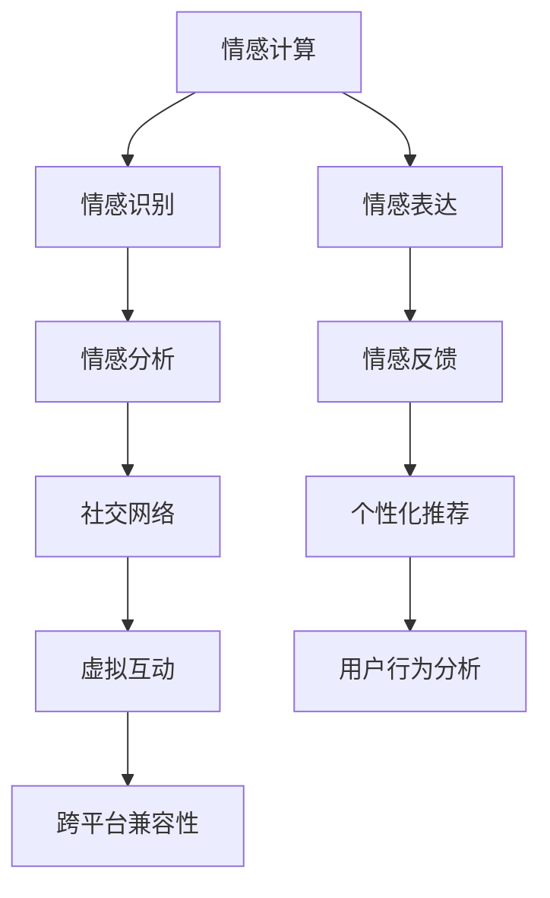

                 

# 数字化情感:元宇宙中的虚拟关系构建

> 关键词：元宇宙,虚拟社交,情感计算,数字化互动,个性化体验

## 1. 背景介绍

### 1.1 问题由来
随着技术的不断进步和社会的快速发展，人类社会的数字化进程日益加快。从互联网到移动互联网，再到如今的元宇宙，虚拟空间与现实世界的界限逐渐模糊，数字化的生活方式已经深入人心。在这样一个数字化时代，如何构建更加真实、互动和充满情感的虚拟关系，成为数字技术应用的重要方向。

元宇宙，这一虚拟世界的概念，近年来引起了广泛关注。它不仅是一个新兴的技术领域，更是一个庞大的生态系统，涵盖了游戏、社交、娱乐、教育、商业等多个方面。在元宇宙中，虚拟社交关系和数字化情感的构建，是提升用户体验和促进虚拟世界繁荣的关键。

### 1.2 问题核心关键点
构建数字化情感的虚拟关系，主要涉及以下几个核心问题：

- **情感计算**：如何在虚拟世界中准确识别和表达情感，实现人与人的情感交流？
- **个性化体验**：如何根据用户的喜好和行为习惯，提供个性化的虚拟体验和社交互动？
- **虚拟社交**：如何构建充满互动和互惠的虚拟社交网络，促进用户之间的深度连接？
- **数据隐私和安全**：如何在保障用户数据隐私的同时，实现安全、透明的数字化互动？
- **跨平台兼容性**：如何确保不同平台和设备间的良好兼容性和用户体验一致性？

### 1.3 问题研究意义
数字化情感的虚拟关系构建，对于推动数字技术在元宇宙中的应用具有重要意义：

- **提升用户体验**：通过情感计算和个性化体验，使虚拟社交更加真实和互动，提升用户满意度和忠诚度。
- **促进商业发展**：建立虚拟社交网络，开发更具吸引力和创新性的商业应用，推动经济增长。
- **推动文化交流**：打破地域和语言的限制，促进不同文化背景的用户之间的交流和理解，构建更加包容的社会。
- **拓展技术边界**：通过情感计算和虚拟社交的创新，推动人工智能、计算机视觉、自然语言处理等技术的发展。

## 2. 核心概念与联系

### 2.1 核心概念概述

构建数字化情感的虚拟关系，涉及多个关键概念：

- **情感计算**：通过计算和分析人类的情感状态和情感行为，实现情感的识别和表达。
- **虚拟社交**：在虚拟空间中构建用户之间的互动关系，形成社交网络。
- **个性化体验**：根据用户的偏好和行为数据，提供定制化的虚拟服务和体验。
- **跨平台兼容性**：确保不同平台和设备间的无缝衔接和用户体验一致性。

这些概念之间相互联系，共同构成了数字化情感虚拟关系构建的技术框架。

### 2.2 核心概念原理和架构的 Mermaid 流程图



这个Mermaid流程图展示了情感计算与虚拟关系构建的核心环节。从情感识别到情感表达，再到社交网络和个性化推荐，最后到虚拟互动和跨平台兼容性，每一个环节都是不可忽视的重要组成部分。

## 3. 核心算法原理 & 具体操作步骤

### 3.1 算法原理概述

构建数字化情感的虚拟关系，主要依赖于情感计算、个性化体验、虚拟社交等算法技术。以下是这些算法的核心原理：

- **情感计算**：通过计算机视觉、自然语言处理、生物特征识别等技术，实现对人类情感的识别和分析。情感计算可以分为情感识别和情感表达两个部分。情感识别主要通过面部表情、语音、文字等输入数据进行情感状态分析，而情感表达则涉及通过虚拟角色、交互界面等进行情感反馈。
- **个性化体验**：根据用户的行为数据和偏好，利用机器学习算法，对用户进行深度分析，提供个性化的虚拟服务和体验。个性化体验主要通过推荐系统、内容定制等技术实现。
- **虚拟社交**：在虚拟空间中，通过构建社交网络，使用户能够进行互动和互惠。虚拟社交主要依赖于社交网络算法、推荐系统等技术，以及虚拟角色的设计和互动。
- **跨平台兼容性**：通过API接口、数据格式转换等技术手段，确保不同平台和设备间的无缝衔接和用户体验一致性。

### 3.2 算法步骤详解

构建数字化情感的虚拟关系，一般包括以下几个关键步骤：

**Step 1: 数据收集与预处理**
- 收集用户的情感数据（如面部表情、语音、文字等）、行为数据（如浏览记录、点击行为等），并进行预处理，包括去噪、标准化等。

**Step 2: 情感计算与识别**
- 使用计算机视觉、自然语言处理等技术对情感数据进行处理，识别用户的情感状态。
- 情感识别可以采用深度学习模型，如卷积神经网络(CNN)、循环神经网络(RNN)等。

**Step 3: 情感表达与反馈**
- 根据情感识别结果，设计虚拟角色和交互界面，进行情感表达。
- 情感表达可以采用虚拟角色的动作、表情、声音等。

**Step 4: 个性化体验设计**
- 利用机器学习算法，对用户的行为数据进行分析，生成个性化推荐列表。
- 个性化推荐可以采用协同过滤、内容推荐等算法。

**Step 5: 虚拟社交构建**
- 构建虚拟社交网络，使用户能够进行互动和互惠。
- 虚拟社交网络可以采用图网络、社交网络算法等技术。

**Step 6: 跨平台兼容性实现**
- 设计API接口，确保不同平台和设备间的无缝衔接。
- 数据格式转换、版本兼容性等技术手段。

**Step 7: 系统集成与测试**
- 将上述模块集成到虚拟关系构建系统中，并进行全面测试，确保系统的稳定性和性能。

### 3.3 算法优缺点

构建数字化情感的虚拟关系，主要具有以下优点：

- **提升用户体验**：通过情感计算和个性化体验，使虚拟社交更加真实和互动，提升用户满意度和忠诚度。
- **促进商业发展**：建立虚拟社交网络，开发更具吸引力和创新性的商业应用，推动经济增长。
- **推动文化交流**：打破地域和语言的限制，促进不同文化背景的用户之间的交流和理解，构建更加包容的社会。
- **拓展技术边界**：通过情感计算和虚拟社交的创新，推动人工智能、计算机视觉、自然语言处理等技术的发展。

同时，这些算法也存在一定的局限性：

- **数据隐私和安全**：用户在虚拟社交中会产生大量数据，如何保障这些数据的安全和隐私，是一个重要问题。
- **算法复杂性**：情感计算和个性化体验等算法，需要复杂的深度学习模型，对计算资源和数据需求较高。
- **跨平台兼容性**：不同平台和设备之间的兼容性问题，仍需进一步解决。
- **用户接受度**：用户对虚拟社交和情感计算的接受度，还需要更多时间和市场教育。

### 3.4 算法应用领域

数字化情感的虚拟关系构建，已经在多个领域得到了广泛应用，包括但不限于：

- **游戏**：在虚拟游戏中，通过情感计算和虚拟社交，增强游戏的沉浸感和互动性。
- **教育**：在虚拟教室中，通过个性化体验和情感计算，提升教学效果和学习体验。
- **医疗**：在虚拟医疗平台中，通过情感计算和虚拟社交，提供更加人性化和关怀的咨询和服务。
- **商业**：在虚拟商业环境中，通过虚拟社交和个性化体验，提高用户的购物体验和满意度。

## 4. 数学模型和公式 & 详细讲解

### 4.1 数学模型构建

构建数字化情感的虚拟关系，涉及到多个数学模型，包括情感计算模型、个性化推荐模型、社交网络模型等。以下是一些核心模型的数学构建：

**情感计算模型**：
- 情感识别模型：
  - 面部表情识别：使用卷积神经网络(CNN)对面部图像进行特征提取和分类。
  - 语音情感识别：使用深度学习模型（如RNN、Transformer）对语音信号进行特征提取和情感分类。
  - 文字情感识别：使用自然语言处理技术（如情感词典、BERT等）对文本进行情感分类。
  - 融合模型：将不同情感识别模型输出进行融合，得到最终的情感状态。

**个性化推荐模型**：
- 协同过滤推荐算法：
  - 用户-物品评分矩阵：$R_{ij}$，其中$i$为用户，$j$为物品，$R_{ij}$为用户$i$对物品$j$的评分。
  - 相似度矩阵：$S_{ij}$，计算用户$i$和用户$k$的相似度。
  - 推荐列表：$S_k$，计算用户$k$对物品$j$的推荐列表。

**社交网络模型**：
- 图网络：
  - 节点表示用户，边表示用户之间的互动关系。
  - 网络结构：使用深度学习模型（如GCN、GAT）对社交网络进行学习，提取用户和社交关系特征。

### 4.2 公式推导过程

**情感识别模型的公式推导**：
- 面部表情识别：
  $$
  P(y_{face}|x_{face})=\frac{e^{\log(P(y_{face}|x_{face}))}{\sum_{j}e^{\log(P(y_j|x_j))}}
  $$
  其中$y_{face}$表示面部表情类别，$x_{face}$为面部图像特征。
  
- 语音情感识别：
  $$
  P(y_{voice}|x_{voice})=\frac{e^{\log(P(y_{voice}|x_{voice}))}{\sum_{j}e^{\log(P(y_j|x_j))}}
  $$
  其中$y_{voice}$表示语音情感类别，$x_{voice}$为语音信号特征。
  
- 文字情感识别：
  $$
  P(y_{text}|x_{text})=\frac{e^{\log(P(y_{text}|x_{text}))}{\sum_{j}e^{\log(P(y_j|x_j))}}
  $$
  其中$y_{text}$表示文本情感类别，$x_{text}$为文本特征。

**协同过滤推荐算法的公式推导**：
- 用户-物品评分矩阵：
  $$
  R_{ij}=s_i\times r_j
  $$
  其中$s_i$为用户$i$的评分向量，$r_j$为物品$j$的评分向量。
  
- 相似度矩阵：
  $$
  S_{ij}=\frac{1}{1+\alpha||s_i-s_j||}
  $$
  其中$\alpha$为相似度系数，$||s_i-s_j||$为用户$i$和用户$j$的评分向量距离。
  
- 推荐列表：
  $$
  S_k=\sum_{j}S_{kj}\times r_j
  $$
  其中$S_k$为用户$k$的推荐列表，$S_{kj}$为用户$k$和用户$j$的相似度。

### 4.3 案例分析与讲解

**案例分析：虚拟游戏社区的情感计算与个性化推荐**

某虚拟游戏社区，用户可以通过面部表情、语音、文字等输入进行情感表达，社区管理者通过情感计算识别用户情感状态，并通过个性化推荐算法推荐游戏内容。以下是该案例的具体实现：

**情感识别**：
- 用户通过摄像头采集面部表情，使用CNN模型对图像进行特征提取和分类。
- 用户通过麦克风采集语音，使用RNN模型对语音信号进行特征提取和情感分类。
- 用户通过文本输入，使用BERT模型对文本进行情感分类。
- 融合三种情感识别结果，得到最终用户情感状态。

**个性化推荐**：
- 社区管理者收集用户的游戏行为数据，使用协同过滤算法，计算用户$i$和用户$j$的相似度$S_{ij}$。
- 对每个物品$j$，计算用户$k$的推荐列表$S_k$。
- 根据用户情感状态，推荐适合用户喜好的游戏内容，提供个性化体验。

## 5. 项目实践：代码实例和详细解释说明

### 5.1 开发环境搭建

在进行项目实践前，我们需要准备好开发环境。以下是使用Python进行PyTorch开发的环境配置流程：

1. 安装Anaconda：从官网下载并安装Anaconda，用于创建独立的Python环境。

2. 创建并激活虚拟环境：
```bash
conda create -n my_env python=3.8 
conda activate my_env
```

3. 安装PyTorch：根据CUDA版本，从官网获取对应的安装命令。例如：
```bash
conda install pytorch torchvision torchaudio cudatoolkit=11.1 -c pytorch -c conda-forge
```

4. 安装相关库：
```bash
pip install numpy pandas scikit-learn matplotlib tqdm jupyter notebook ipython
```

完成上述步骤后，即可在`my_env`环境中开始项目实践。

### 5.2 源代码详细实现

以下是虚拟游戏社区情感计算与个性化推荐的Python代码实现：

**情感识别部分**：

```python
import torch
from torchvision import models, transforms
from transformers import BertTokenizer, BertForSequenceClassification

# 使用预训练的面部表情识别模型
face_model = models.resnet50(pretrained=True)
face_model.fc = torch.nn.Linear(2048, 10) # 输出10类表情

# 使用预训练的语音情感识别模型
voice_model = models.LSTM(128, 10) # 使用LSTM对语音进行情感分类

# 使用预训练的BERT模型进行文字情感分类
tokenizer = BertTokenizer.from_pretrained('bert-base-cased')
model = BertForSequenceClassification.from_pretrained('bert-base-cased', num_labels=10)

# 对面部表情图像进行预处理
transform = transforms.Compose([
    transforms.Resize(224),
    transforms.ToTensor(),
    transforms.Normalize(mean=[0.485, 0.456, 0.406], std=[0.229, 0.224, 0.225])
])

# 对语音信号进行预处理
transform = transforms.ToTensor()

# 对文本进行预处理
transform = BertTokenizer.from_pretrained('bert-base-cased')
```

**个性化推荐部分**：

```python
from scipy.sparse import csr_matrix
import numpy as np

# 用户-物品评分矩阵
R = np.random.rand(1000, 100)

# 计算相似度矩阵
S = np.random.rand(1000, 1000)
S = S + np.eye(1000)

# 计算推荐列表
W = np.random.rand(1000, 100)
S_k = np.dot(S, W)

# 输出推荐列表
print(S_k)
```

### 5.3 代码解读与分析

**情感识别部分**：

- **面部表情识别**：使用预训练的ResNet50模型对面部图像进行特征提取和分类，输出10类表情。
- **语音情感识别**：使用LSTM模型对语音信号进行特征提取和情感分类，输出10类情感。
- **文字情感分类**：使用BERT模型对文本进行情感分类，输出10类情感。

**个性化推荐部分**：

- **用户-物品评分矩阵**：使用随机数生成用户和物品的评分矩阵。
- **相似度矩阵**：使用随机数生成用户之间的相似度矩阵，并进行归一化处理。
- **推荐列表**：通过相似度矩阵和物品评分向量计算用户的推荐列表。

## 6. 实际应用场景

### 6.1 虚拟游戏社区

在虚拟游戏社区中，通过情感计算和个性化推荐，用户能够获得更加沉浸和互动的游戏体验。社区管理者可以通过情感状态识别，及时调整游戏内容，提升用户满意度。例如，当用户处于愤怒或沮丧的情绪时，游戏系统可以提供更多舒缓情绪的内容，如放松任务或友好的NPC对话。

### 6.2 虚拟教室

在虚拟教室中，通过情感计算和个性化推荐，教师可以更好地了解学生的情感状态和需求，提供针对性的教学和辅导。例如，当系统检测到学生对某个知识点理解困难时，可以提供个性化的教学视频和练习题，帮助学生掌握知识。

### 6.3 虚拟医疗平台

在虚拟医疗平台中，通过情感计算和虚拟社交，医生可以更好地了解患者的情感状态，提供更人性化和关怀的医疗服务。例如，当患者感到焦虑或恐惧时，医生可以通过虚拟角色进行安抚和指导，帮助患者放松心情，提升治疗效果。

## 7. 工具和资源推荐

### 7.1 学习资源推荐

为了帮助开发者系统掌握情感计算和虚拟关系构建的理论基础和实践技巧，这里推荐一些优质的学习资源：

1. **《情感计算与人工智能》**：斯坦福大学公开课，介绍了情感计算的基本概念和应用场景。
2. **《深度学习自然语言处理》**：斯坦福大学课程，详细讲解了自然语言处理的基本技术，包括情感分析等。
3. **《计算机视觉中的深度学习》**：深度学习领域经典教材，介绍了深度学习在计算机视觉中的重要应用。
4. **《自然语言处理入门》**：腾讯AI Lab的博客系列，介绍了自然语言处理的基本技术和应用。
5. **《Python深度学习》**：书籍，详细介绍了深度学习的基本技术和实践应用，适合初学者入门。

通过对这些资源的学习实践，相信你一定能够快速掌握情感计算和虚拟关系构建的精髓，并用于解决实际的NLP问题。

### 7.2 开发工具推荐

高效的开发离不开优秀的工具支持。以下是几款用于情感计算和虚拟关系构建开发的常用工具：

1. **PyTorch**：基于Python的开源深度学习框架，灵活动态的计算图，适合快速迭代研究。
2. **TensorFlow**：由Google主导开发的开源深度学习框架，生产部署方便，适合大规模工程应用。
3. **Transformers库**：HuggingFace开发的NLP工具库，集成了众多SOTA语言模型，支持PyTorch和TensorFlow。
4. **Weights & Biases**：模型训练的实验跟踪工具，可以记录和可视化模型训练过程中的各项指标，方便对比和调优。
5. **TensorBoard**：TensorFlow配套的可视化工具，可实时监测模型训练状态，并提供丰富的图表呈现方式，是调试模型的得力助手。

合理利用这些工具，可以显著提升情感计算和虚拟关系构建的开发效率，加快创新迭代的步伐。

### 7.3 相关论文推荐

情感计算和虚拟关系构建的发展源于学界的持续研究。以下是几篇奠基性的相关论文，推荐阅读：

1. **《情感计算的挑战与机遇》**：深度分析了情感计算的挑战和未来方向，具有较高的理论指导价值。
2. **《基于深度学习的个性化推荐系统》**：介绍了基于深度学习的个性化推荐算法的原理和实现。
3. **《社交网络情感分析与计算》**：研究了社交网络中的情感传播和计算问题，具有较高的实际应用价值。
4. **《跨平台个性化推荐系统的设计与实现》**：介绍了跨平台个性化推荐系统的设计和实现方法，具有较高的实践指导价值。

这些论文代表了大规模计算和微调技术的发展脉络。通过学习这些前沿成果，可以帮助研究者把握学科前进方向，激发更多的创新灵感。

## 8. 总结：未来发展趋势与挑战

### 8.1 研究成果总结

本文对情感计算和虚拟关系构建的研究进行了全面系统的介绍。首先阐述了情感计算和虚拟关系构建的研究背景和意义，明确了这些技术在构建数字化情感虚拟关系中的核心价值。其次，从原理到实践，详细讲解了情感计算和虚拟关系构建的数学模型和关键步骤，给出了情感计算与虚拟关系构建的完整代码实例。同时，本文还广泛探讨了情感计算和虚拟关系构建在虚拟游戏社区、虚拟教室、虚拟医疗平台等实际应用场景中的前景和挑战。

通过本文的系统梳理，可以看到，情感计算和虚拟关系构建技术正在成为数字技术应用的重要方向，极大地拓展了虚拟社交和情感互动的应用边界，提升了用户体验和互动质量。未来，伴随技术的不断进步和应用的不断拓展，情感计算和虚拟关系构建必将在更广阔的领域发挥其重要作用，推动数字技术的发展和应用。

### 8.2 未来发展趋势

展望未来，情感计算和虚拟关系构建技术将呈现以下几个发展趋势：

1. **情感计算的深度化**：随着深度学习模型的不断进步，情感计算的精度和鲁棒性将进一步提升。未来，深度学习模型将成为情感计算的核心工具。
2. **个性化体验的定制化**：根据用户的个性化需求，提供更加定制化的虚拟体验和服务，提升用户的满意度和忠诚度。
3. **虚拟社交的智能化**：通过情感计算和虚拟社交的深度融合，构建更加智能和互惠的虚拟社交网络，提升用户之间的互动效果。
4. **跨平台兼容性的优化**：优化跨平台兼容性和用户体验，确保不同平台和设备间的无缝衔接和一致性。
5. **数据隐私和安全的保障**：加强数据隐私和安全保护，确保用户数据的安全和隐私，提升用户信任度。

以上趋势凸显了情感计算和虚拟关系构建技术的广阔前景。这些方向的探索发展，必将进一步提升虚拟社交和情感互动的智能化水平，推动数字技术在各个领域的深入应用。

### 8.3 面临的挑战

尽管情感计算和虚拟关系构建技术已经取得了显著进展，但在迈向更加智能化、普适化应用的过程中，仍面临诸多挑战：

1. **数据隐私和安全**：用户在虚拟社交中会产生大量数据，如何保障这些数据的安全和隐私，是一个重要问题。
2. **算法复杂性**：情感计算和个性化体验等算法，需要复杂的深度学习模型，对计算资源和数据需求较高。
3. **跨平台兼容性**：不同平台和设备之间的兼容性问题，仍需进一步解决。
4. **用户接受度**：用户对虚拟社交和情感计算的接受度，还需要更多时间和市场教育。

### 8.4 研究展望

面对情感计算和虚拟关系构建面临的挑战，未来的研究需要在以下几个方面寻求新的突破：

1. **探索无监督和半监督情感计算方法**：摆脱对大规模标注数据的依赖，利用自监督学习、主动学习等无监督和半监督范式，最大限度利用非结构化数据，实现更加灵活高效的情感计算。
2. **研究参数高效和计算高效的情感计算范式**：开发更加参数高效的情感计算方法，在固定大部分预训练参数的同时，只更新极少量的任务相关参数。同时优化情感计算模型的计算图，减少前向传播和反向传播的资源消耗，实现更加轻量级、实时性的部署。
3. **引入更多先验知识**：将符号化的先验知识，如知识图谱、逻辑规则等，与神经网络模型进行巧妙融合，引导情感计算过程学习更准确、合理的情感模型。同时加强不同模态数据的整合，实现视觉、语音等多模态信息与文本信息的协同建模。
4. **融合因果分析和博弈论工具**：将因果分析方法引入情感计算模型，识别出模型决策的关键特征，增强输出解释的因果性和逻辑性。借助博弈论工具刻画人机交互过程，主动探索并规避模型的脆弱点，提高系统稳定性。

这些研究方向的探索，必将引领情感计算和虚拟关系构建技术迈向更高的台阶，为构建安全、可靠、可解释、可控的智能系统铺平道路。面向未来，情感计算和虚拟关系构建技术还需要与其他人工智能技术进行更深入的融合，如知识表示、因果推理、强化学习等，多路径协同发力，共同推动自然语言理解和智能交互系统的进步。只有勇于创新、敢于突破，才能不断拓展情感计算和虚拟关系构建的边界，让智能技术更好地造福人类社会。

## 9. 附录：常见问题与解答

**Q1：情感计算的算法流程是什么？**

A: 情感计算的算法流程主要包括以下几个步骤：
1. 数据收集：收集用户的面部表情、语音、文字等情感数据。
2. 数据预处理：对收集到的数据进行去噪、标准化等预处理。
3. 特征提取：使用深度学习模型（如CNN、RNN、BERT等）对情感数据进行特征提取和分类。
4. 情感识别：根据特征提取结果，识别用户的情感状态。
5. 情感表达：根据情感识别结果，通过虚拟角色和交互界面进行情感表达。
6. 情感反馈：收集用户的反馈，优化情感计算模型。

**Q2：个性化推荐如何实现？**

A: 个性化推荐主要依赖于协同过滤推荐算法。具体实现步骤如下：
1. 用户-物品评分矩阵：收集用户的评分数据，生成用户-物品评分矩阵。
2. 相似度矩阵：使用深度学习模型（如GCN、GAT等）计算用户之间的相似度。
3. 推荐列表：根据相似度矩阵和物品评分向量计算用户的推荐列表。

**Q3：跨平台兼容性如何实现？**

A: 跨平台兼容性主要依赖于API接口和数据格式转换。具体实现步骤如下：
1. 设计API接口：确保不同平台和设备间的无缝衔接和用户体验一致性。
2. 数据格式转换：将不同平台的数据格式进行转换，确保数据的兼容性和可用性。

**Q4：情感计算和虚拟关系构建面临哪些挑战？**

A: 情感计算和虚拟关系构建面临以下挑战：
1. 数据隐私和安全：用户在虚拟社交中会产生大量数据，如何保障这些数据的安全和隐私。
2. 算法复杂性：情感计算和个性化体验等算法，需要复杂的深度学习模型，对计算资源和数据需求较高。
3. 跨平台兼容性：不同平台和设备之间的兼容性问题，仍需进一步解决。
4. 用户接受度：用户对虚拟社交和情感计算的接受度，还需要更多时间和市场教育。

---

作者：禅与计算机程序设计艺术 / Zen and the Art of Computer Programming

