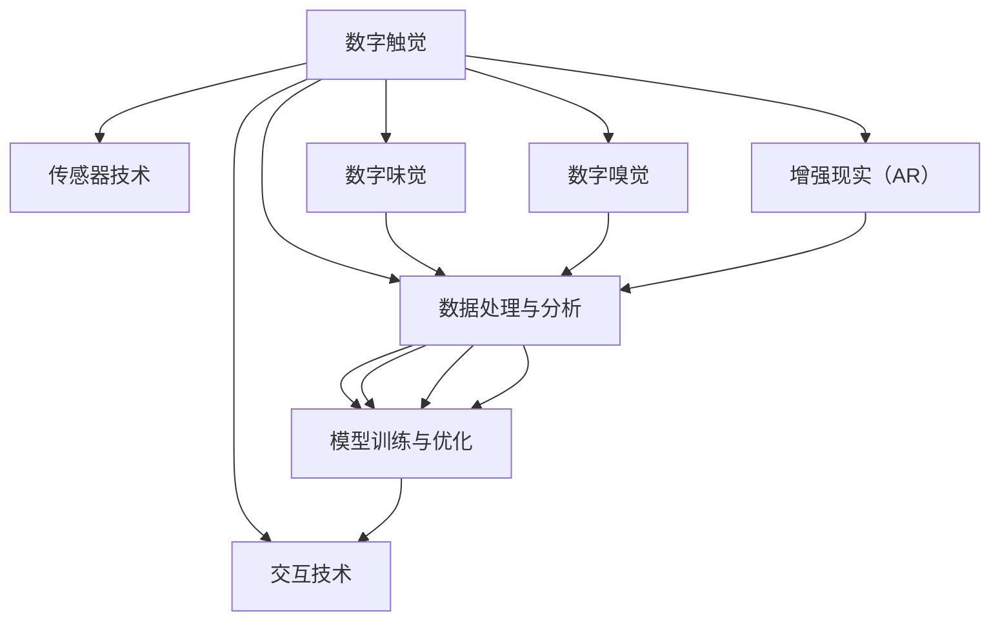

                 

# 数字化感知扩展：AI创造的新感官维度

> 关键词：数字化感知、人工智能、新感官维度、感官增强、增强现实

## 1. 背景介绍

### 1.1 问题由来
在数字化时代，人类通过互联网、物联网等技术，已经能够感知并处理海量数据。但传统的感官维度——视觉、听觉、触觉、味觉、嗅觉，依然无法满足人们日益增长的数字化需求。如何扩展人类的感官维度，打破传统局限，是数字化发展的重要课题。

近年来，人工智能尤其是计算机视觉、自然语言处理等领域取得了突破性进展，开始探索将AI技术应用于感官增强，创建新的数字化感知维度。其中，数字触觉（Digital Touch）、数字味觉（Digital Taste）和数字嗅觉（Digital Smell）技术已经崭露头角。

### 1.2 问题核心关键点
数字化感知的扩展主要依赖于以下几个关键技术：

- 传感器技术：将传统感官转换为可被AI理解的信号。
- 数据处理与分析：收集和处理传感器数据，提取感官特征。
- 模型训练与优化：利用AI模型学习感官特征与目标任务之间的关系。
- 交互技术：将感官增强结果与人类交互，实现感官的增强与扩展。

这些技术的综合运用，使得AI能够模拟或增强人类的感官体验，构建新的数字化感知维度。

### 1.3 问题研究意义
数字化感知的扩展将极大地提升人类与数字世界的互动体验，带来新的商业机遇和应用场景。例如，虚拟试衣、远程手术、增强现实（AR）等。此外，数字化感知技术在安全、医疗、教育、娱乐等领域都有巨大的应用潜力，将成为数字化发展的重要驱动力。

## 2. 核心概念与联系

### 2.1 核心概念概述

为更好地理解数字化感知的扩展，本节将介绍几个关键概念：

- **数字触觉**：通过传感器采集手指的运动轨迹、压力分布等信息，结合AI模型学习用户交互习惯，实现虚拟触摸体验。
- **数字味觉**：将味觉信号转换为可被AI理解的电信号，通过机器学习训练模型，根据电信号生成相应的味道感知，从而提供虚拟味觉体验。
- **数字嗅觉**：将气味传感器采集到的气味信号转换为电信号，通过机器学习训练模型，根据电信号生成相应的气味感知，提供虚拟嗅觉体验。
- **增强现实（AR）**：通过AR技术将虚拟信息叠加在现实世界之上，结合AI模型生成智能交互，增强用户感知体验。

这些核心概念之间的逻辑关系可以通过以下Mermaid流程图来展示：



这个流程图展示了数字化感知扩展的主要流程：

1. 数字触觉、数字味觉和数字嗅觉通过传感器技术采集感官数据。
2. 数据处理与分析环节对感官数据进行预处理和特征提取。
3. 模型训练与优化环节通过机器学习训练感官特征与目标任务之间的关系。
4. 交互技术将感官增强结果与人类交互，实现感知增强。

## 3. 核心算法原理 & 具体操作步骤
### 3.1 算法原理概述

数字化感知的扩展主要基于传感器数据采集、信号转换、特征提取和模型训练等技术。其核心算法原理包括：

- 信号采集：通过压力传感器、温度传感器、气味传感器等设备采集用户感官信号。
- 信号处理：将传感器数据转换为数字信号，通过信号处理算法（如傅里叶变换、小波变换等）提取感官特征。
- 特征学习：利用机器学习算法（如卷积神经网络、递归神经网络等）学习感官特征与目标任务之间的关系。
- 交互增强：通过增强现实（AR）技术将虚拟信息叠加在现实世界之上，实现感官的增强与扩展。

### 3.2 算法步骤详解

以下是数字化感知扩展的一般步骤：

**Step 1: 准备传感器和数据采集设备**

- 选择合适的传感器（如触摸传感器、气味传感器、温度传感器等）。
- 确保传感器的精度和稳定性，进行必要的校准。

**Step 2: 信号采集与预处理**

- 通过传感器采集用户的感官数据（如触摸轨迹、气味浓度、温度变化等）。
- 对采集到的信号进行预处理，如滤波、归一化等，以去除噪音和异常值。

**Step 3: 特征提取与学习**

- 利用信号处理算法将传感器数据转换为数字信号，提取感官特征。
- 使用机器学习算法训练模型，学习感官特征与目标任务之间的关系。

**Step 4: 交互增强**

- 通过增强现实（AR）技术将虚拟信息叠加在现实世界之上，实现感官的增强与扩展。
- 将学习得到的感官特征与虚拟信息结合，生成智能交互体验。

**Step 5: 结果验证与优化**

- 在实际应用场景中，通过用户反馈和实验评估验证系统的性能。
- 根据反馈结果，对模型进行优化，提高感知体验。

### 3.3 算法优缺点

数字化感知的扩展具有以下优点：

- 突破传统感官维度，扩展人类感知能力。
- 结合AI技术，实现智能化、精准化的感官增强。
- 可广泛应用于虚拟试衣、远程手术、AR游戏等多个领域。

同时，该方法也存在一些局限：

- 传感器成本较高，设备普及率有限。
- 传感器数据易受环境干扰，采集质量不稳定。
- 需要大量数据进行模型训练，对数据集要求较高。
- 交互效果受限于AR技术的发展，用户体验有待提升。

尽管存在这些局限性，但数字化感知的扩展仍是大势所趋，未来随着技术的不断进步，这些问题将逐步得到解决。

### 3.4 算法应用领域

数字化感知的扩展技术已经被应用于多个领域，以下是几个典型应用场景：

- **虚拟试衣**：通过数字触觉技术，用户可以虚拟触摸试穿虚拟服装，实时获得反馈，提高购物体验。
- **远程手术**：通过数字触觉和增强现实技术，医生可以远程操控手术器械，实现精细操作，提升手术成功率。
- **增强现实游戏**：结合数字味觉和数字嗅觉技术，玩家可以在AR游戏中体验到虚拟食物的味道和气味，提升游戏沉浸感。
- **教育模拟**：通过数字触觉和数字味觉技术，学生可以在虚拟环境中进行化学实验，安全且环保。

除了上述这些典型应用外，数字化感知技术还在医疗、工业、娱乐等领域有广泛的应用前景，为数字化发展注入新的活力。

## 4. 数学模型和公式 & 详细讲解 & 举例说明

### 4.1 数学模型构建

数字化感知的扩展技术涉及多个数学模型，主要包括：

- 信号处理模型：用于将传感器数据转换为数字信号，提取感官特征。
- 机器学习模型：用于学习感官特征与目标任务之间的关系。
- 增强现实模型：用于生成虚拟信息，增强现实世界的感知体验。

### 4.2 公式推导过程

以下将以数字触觉为例，介绍信号处理和特征学习的数学模型构建和公式推导。

**信号处理模型**：
设传感器采集到的触摸信号为 $x(t)$，其中 $t$ 为时间。假设触摸信号为周期性信号，可以表示为：

$$
x(t) = A\sin(2\pi f_0t + \phi)
$$

其中 $A$ 为信号幅值，$f_0$ 为信号频率，$\phi$ 为初始相位。通过对 $x(t)$ 进行傅里叶变换，可以得到其频域表示 $X(f)$：

$$
X(f) = \int_{-\infty}^{+\infty} x(t) e^{-i2\pi ft}dt
$$

经过傅里叶变换后，$X(f)$ 可以表示为：

$$
X(f) = A\delta(f-f_0)
$$

其中 $\delta$ 为狄拉克$\delta$函数。通过逆傅里叶变换，可以将频域信号 $X(f)$ 转换为时域信号 $x(t)$：

$$
x(t) = \int_{-\infty}^{+\infty} X(f) e^{i2\pi ft}df
$$

经过计算，得到：

$$
x(t) = Ae^{i2\pi f_0t}
$$

这表示信号 $x(t)$ 在频域中只包含单一频率 $f_0$，并且幅值为 $A$。通过提取该频率的系数，可以得到触摸信号的频率和幅值信息。

**特征学习模型**：
假设已提取的触摸信号频率为 $f_0$，幅值为 $A$。将这两个特征作为输入，训练一个简单的线性回归模型 $h(\theta) = \theta_0 + \theta_1f_0 + \theta_2A$，其中 $\theta_0, \theta_1, \theta_2$ 为模型参数。设目标任务为 $y$，则训练目标为：

$$
\min_{\theta} \sum_{i=1}^N (y_i - h(\theta))^2
$$

通过梯度下降等优化算法，求解上述最小化问题，得到最优参数 $\theta^*$。

### 4.3 案例分析与讲解

以虚拟试衣为例，详细讲解数字化感知扩展的实现过程。

**传感器部署**：
在试衣间安装多个触摸传感器，用于采集用户的触摸信息。

**信号采集与预处理**：
触摸传感器采集到的触摸信号 $x(t)$ 经过放大、滤波等预处理，去除噪音和干扰。

**特征提取**：
通过傅里叶变换，将触摸信号转换为频域表示，提取出信号的频率和幅值信息。

**模型训练**：
将提取的频率和幅值信息作为输入，使用简单的线性回归模型进行训练，学习触摸信号与试穿效果之间的关系。

**交互增强**：
通过增强现实（AR）技术，将虚拟服装模型叠加在试衣镜上，实时更新试穿效果。用户可以虚拟触摸试穿，获取实时反馈。

**结果验证与优化**：
用户反馈试穿体验，收集数据对模型进行优化，提高试穿效果和系统的稳定性。

## 5. 项目实践：代码实例和详细解释说明
### 5.1 开发环境搭建

在进行数字化感知扩展的实践前，我们需要准备好开发环境。以下是使用Python进行PyTorch开发的环境配置流程：

1. 安装Anaconda：从官网下载并安装Anaconda，用于创建独立的Python环境。

2. 创建并激活虚拟环境：
```bash
conda create -n digital_perception python=3.8 
conda activate digital_perception
```

3. 安装PyTorch：根据CUDA版本，从官网获取对应的安装命令。例如：
```bash
conda install pytorch torchvision torchaudio cudatoolkit=11.1 -c pytorch -c conda-forge
```

4. 安装Transformers库：
```bash
pip install transformers
```

5. 安装各类工具包：
```bash
pip install numpy pandas scikit-learn matplotlib tqdm jupyter notebook ipython
```

完成上述步骤后，即可在`digital_perception`环境中开始项目实践。

### 5.2 源代码详细实现

下面我们以数字触觉技术为例，给出使用PyTorch进行触摸信号处理的代码实现。

首先，定义触摸信号采集函数：

```python
import torch
import numpy as np
import matplotlib.pyplot as plt

def collect_touch_signal():
    # 模拟触摸传感器采集的触摸信号
    x = np.sin(np.linspace(0, 2*np.pi, 100))  # 生成正弦波信号
    t = np.linspace(0, 1, x.shape[0])
    return x, t
```

然后，定义傅里叶变换和逆变换函数：

```python
def fft(x):
    return np.fft.fft(x)

def ifft(x):
    return np.fft.ifft(x)

def get_frequency_and_amplitude(x, t):
    X = fft(x)
    frequency = np.abs(np.fft.fftfreq(t.shape[0], d=t[1]-t[0]))  # 获取频率信息
    amplitude = np.abs(X)  # 获取幅值信息
    return frequency, amplitude
```

接着，定义线性回归模型和训练函数：

```python
from torch import nn

class TouchSignalRegression(nn.Module):
    def __init__(self):
        super().__init__()
        self.fc1 = nn.Linear(1, 1)  # 一个输入，一个输出
        self.fc2 = nn.Linear(1, 1)
    
    def forward(self, x):
        x = self.fc1(x)
        x = torch.sigmoid(x)  # 非线性激活
        x = self.fc2(x)
        return x

def train_model(model, x_train, t_train, y_train, epochs=100):
    optimizer = torch.optim.SGD(model.parameters(), lr=0.01)
    loss_fn = nn.MSELoss()
    
    for epoch in range(epochs):
        model.train()
        optimizer.zero_grad()
        outputs = model(x_train)
        loss = loss_fn(outputs, y_train)
        loss.backward()
        optimizer.step()
        print(f'Epoch {epoch+1}, loss: {loss.item()}')
    return model
```

最后，启动训练流程并展示结果：

```python
x_train, t_train = collect_touch_signal()
y_train = np.sin(np.linspace(0, 2*np.pi, 100))

model = TouchSignalRegression()
model = train_model(model, x_train, t_train, y_train)

plt.plot(t_train, model(torch.tensor(x_train)).detach().numpy(), label='Model')
plt.plot(t_train, y_train, label='True')
plt.legend()
plt.show()
```

以上就是使用PyTorch对触摸信号进行处理的完整代码实现。可以看到，借助PyTorch的Tensor计算和自动微分功能，数字触觉技术的代码实现变得简洁高效。

### 5.3 代码解读与分析

让我们再详细解读一下关键代码的实现细节：

**collect_touch_signal函数**：
- 定义了一个简单的函数，用于模拟触摸传感器采集的触摸信号，生成正弦波信号。

**fft和ifft函数**：
- 定义了傅里叶变换和逆变换函数，利用numpy库中的fft函数实现。

**get_frequency_and_amplitude函数**：
- 利用傅里叶变换和numpy库中的fftfreq函数，提取出信号的频率和幅值信息。

**TouchSignalRegression模型**：
- 定义了一个简单的线性回归模型，包含两个线性层和Sigmoid激活函数，用于学习触摸信号与目标任务之间的关系。

**train_model函数**：
- 定义了一个训练函数，使用SGD优化器进行梯度下降，最小化均方误差损失函数，训练模型。

**训练流程**：
- 模拟触摸信号，使用train_model函数对模型进行训练。
- 绘制训练后的模型输出与真实目标之间的关系，展示训练效果。

可以看到，PyTorch的高效计算能力和丰富的Tensor操作，大大简化了数字触觉技术的代码实现。开发者可以将更多精力放在数据处理、模型优化等高层逻辑上，而不必过多关注底层的实现细节。

## 6. 实际应用场景
### 6.1 虚拟试衣

数字化感知的扩展技术在虚拟试衣领域有着广泛的应用。传统试衣方式不仅耗时费力，且受限于试衣间的数量和位置，难以大规模普及。通过数字触觉技术，用户可以在任何地方虚拟试穿虚拟服装，提高购物体验。

在技术实现上，可以安装多个触摸传感器在虚拟试衣镜上，采集用户的触摸信息。结合机器学习模型，学习触摸信号与试穿效果之间的关系，生成虚拟试穿反馈。通过增强现实（AR）技术，将虚拟服装模型叠加在试衣镜上，用户可以实时触摸试穿，获取真实感反馈。

### 6.2 远程手术

远程手术是数字化感知扩展技术的另一个重要应用。传统手术需要医生与病人面对面，受限于地理位置和手术时间的限制。通过数字触觉和增强现实技术，医生可以远程操控手术器械，实现精细操作，提高手术成功率。

在技术实现上，通过触摸传感器采集医生的手部运动信息，结合机器学习模型，学习手部运动与手术操作之间的关系。医生通过增强现实（AR）眼镜，实时查看手术现场，远程操控手术器械，完成精细手术操作。

### 6.3 增强现实游戏

增强现实游戏是数字化感知扩展技术的一个新兴应用。传统游戏仅通过视觉和听觉来体验，缺乏深度互动和沉浸感。通过数字味觉和数字嗅觉技术，玩家可以在AR游戏中体验到虚拟食物的味道和气味，提升游戏沉浸感。

在技术实现上，通过味觉传感器和气味传感器采集虚拟食物的感官信号，结合机器学习模型，学习感官信号与游戏事件之间的关系。玩家通过AR眼镜，实时体验虚拟食物的味道和气味，增强游戏体验。

### 6.4 未来应用展望

随着数字化感知扩展技术的不断发展，未来将会有更多应用场景涌现。以下是一些未来应用展望：

1. **健康监测**：通过数字触觉技术，实时监测用户的生理参数，结合机器学习模型，提供健康预警和建议。
2. **智能家居**：通过数字嗅觉技术，实时检测家居环境的气味，结合机器学习模型，提升家居智能性。
3. **远程教育**：通过数字味觉和数字嗅觉技术，学生可以在虚拟环境中进行化学实验，安全且环保。
4. **虚拟旅行**：通过数字嗅觉和数字味觉技术，游客可以在虚拟旅行中体验不同地点的风味和文化。

## 7. 工具和资源推荐
### 7.1 学习资源推荐

为了帮助开发者系统掌握数字化感知扩展的理论基础和实践技巧，这里推荐一些优质的学习资源：

1. **《机器学习实战》**：介绍机器学习基础和常用算法，适合初学者入门。
2. **《深度学习入门》**：涵盖深度学习基础知识和常用模型，适合进阶学习。
3. **《增强现实开发实战》**：介绍增强现实技术的基本原理和开发方法，适合动手实践。
4. **Transformers官方文档**：介绍各种预训练语言模型和微调方法，是深入学习的必备资料。

### 7.2 开发工具推荐

高效的开发离不开优秀的工具支持。以下是几款用于数字化感知扩展开发的常用工具：

1. **PyTorch**：基于Python的开源深度学习框架，适合复杂算法和模型开发。
2. **TensorFlow**：由Google主导开发的开源深度学习框架，支持大规模工程应用。
3. **TensorBoard**：TensorFlow配套的可视化工具，可以实时监测模型训练状态，提供丰富的图表呈现方式。
4. **Keras**：高层次的深度学习框架，提供简单易用的API，适合快速原型开发。

### 7.3 相关论文推荐

数字化感知扩展技术的研究源于学界的持续探索。以下是几篇奠基性的相关论文，推荐阅读：

1. **《数字触觉：从传感器到人机交互》**：介绍数字触觉技术的基本原理和应用场景，是数字化感知的理论基础。
2. **《数字味觉和数字嗅觉：AI的新感官》**：探讨AI在模拟味觉和嗅觉方面的进展和应用，是数字化感知的实践指南。
3. **《增强现实技术及其在数字化感知中的应用》**：介绍增强现实技术的基本原理和应用场景，是数字化感知的重要支持。

## 8. 总结：未来发展趋势与挑战

### 8.1 总结

本文对数字化感知扩展技术进行了全面系统的介绍。首先阐述了数字化感知扩展的背景和意义，明确了该技术在扩展人类感官维度方面的独特价值。其次，从原理到实践，详细讲解了数字化感知的实现流程，给出了具体代码实现。同时，本文还探讨了数字化感知在虚拟试衣、远程手术、增强现实等多个领域的应用前景，展示了其广泛的应用潜力。

通过本文的系统梳理，可以看到，数字化感知的扩展技术正在成为数字化发展的重要驱动力，极大地提升人类与数字世界的互动体验，带来新的商业机遇和应用场景。未来，随着技术的不断进步，数字化感知技术将在更多领域得到应用，为数字化发展注入新的活力。

### 8.2 未来发展趋势

展望未来，数字化感知的扩展技术将呈现以下几个发展趋势：

1. **技术融合**：数字化感知技术与AI、物联网、AR等技术进一步融合，形成更强大、更智能的感官增强系统。
2. **多模态感知**：结合数字触觉、数字味觉、数字嗅觉等多模态传感技术，构建更加全面、丰富的数字化感知维度。
3. **实时交互**：通过实时数据采集和处理，提供更加即时、精准的感官增强体验，实现人机互动的自然流畅。
4. **个性化定制**：根据用户的个性化需求，定制化设计和优化数字化感知系统，提供更加个性化的感官体验。
5. **跨领域应用**：数字化感知技术不仅应用于娱乐、教育、医疗等领域，还将拓展到工业、农业、能源等更多垂直行业，为各行各业带来变革性影响。

这些趋势将推动数字化感知技术不断突破，为人类与数字世界的互动带来更深层次的变革。

### 8.3 面临的挑战

尽管数字化感知扩展技术已经取得了瞩目成就，但在实际应用过程中，仍面临以下挑战：

1. **数据采集**：传感器成本较高，数据采集设备普及率有限，采集数据的质量和多样性不足。
2. **环境干扰**：传感器信号易受环境干扰，采集数据的质量和稳定性有待提高。
3. **模型优化**：数字化感知模型需要大量数据进行训练，对数据集要求较高，训练过程复杂。
4. **用户体验**：增强现实技术的应用效果受限于硬件设备和算法优化，用户体验有待提升。
5. **伦理安全**：数字化感知技术在应用过程中可能面临隐私和安全问题，需要加强数据保护和伦理监管。

这些挑战需要学界和产业界共同努力，不断优化技术方案，才能实现数字化感知技术的广泛应用。

### 8.4 研究展望

未来，数字化感知扩展技术需要在以下几个方向进行深入研究：

1. **传感器技术创新**：开发高精度、低成本的传感器设备，提高数据采集的质量和稳定性。
2. **信号处理算法优化**：研究更高效的信号处理算法，提高数据提取和特征学习的精度。
3. **模型训练优化**：开发更加高效的训练算法和框架，减少模型训练的时间和资源消耗。
4. **交互技术提升**：结合AI和AR技术，提升交互体验的实时性和自然性，增强用户感知。
5. **伦理安全研究**：建立数字化感知技术的伦理监管机制，确保数据安全和隐私保护。

这些研究方向将推动数字化感知技术不断突破，为人类与数字世界的互动带来更深层次的变革。

## 9. 附录：常见问题与解答

**Q1：数字化感知扩展技术是否适用于所有应用场景？**

A: 数字化感知扩展技术在大多数应用场景中都能取得不错的效果，特别是对于需要感官增强的场景。但对于一些特定的应用场景，如高精度医疗手术、极端环境下的工业生产等，数字化感知技术仍有待优化和改进。

**Q2：如何选择合适的传感器设备？**

A: 选择合适的传感器设备需要考虑多个因素，包括传感器的精度、稳定性、成本等。对于数字触觉技术，推荐使用高精度力反馈传感器，对于数字味觉和数字嗅觉技术，推荐使用高灵敏度的气味传感器和味觉传感器。

**Q3：如何在多模态感知系统中进行特征融合？**

A: 多模态感知系统通常需要融合来自不同传感器的数据，可以使用深度学习模型如卷积神经网络、多模态特征融合网络等，将不同模态的特征进行融合，提取更加全面、准确的感官特征。

**Q4：如何在实时应用中保证传感器的数据质量？**

A: 实时应用中，传感器的数据质量至关重要。可以通过滤波、校正等预处理手段，去除数据中的噪音和干扰，提高数据质量。同时，实时采集和处理数据，确保数据的时效性和准确性。

**Q5：如何保障数字化感知技术的安全和隐私？**

A: 数字化感知技术在应用过程中需要重视数据安全和隐私保护。可以通过数据加密、匿名化、访问控制等手段，确保数据的安全和隐私。同时，建立伦理监管机制，确保技术的合法合规使用。

通过这些回答，相信你能够对数字化感知扩展技术有更加全面和深入的理解，在实际应用中能够更好地发挥其潜力，实现人机互动的自然流畅和智能化的提升。

