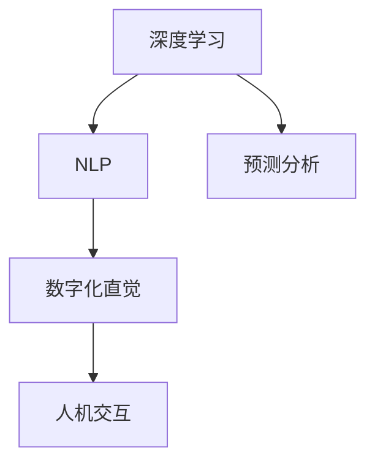

                 

# 数字化直觉：AI辅助的第六感

> 关键词：数字化直觉、AI辅助、第六感、预测分析、决策支持、人机交互、自然语言处理(NLP)

## 1. 背景介绍

### 1.1 问题由来
在当前信息爆炸的时代，人类面临大量复杂多变的数据和信息，单纯依赖人类直觉和经验进行决策的局限性越来越明显。如何高效地提取、整合和分析海量数据，辅助人类作出更加精准和明智的决策，成为许多行业和领域的迫切需求。人工智能技术的迅速发展，特别是深度学习、自然语言处理和大数据技术的结合，为解决这个问题提供了新的思路。

数字化直觉（Digital Intuition）即是一种基于人工智能技术的决策支持方法，旨在通过深度学习算法模拟和增强人类的直觉，提升决策的准确性和效率。这种技术不仅能够帮助企业在大数据环境下提高决策效率，还能在各种复杂的决策场景中，如医疗、金融、物流、市场营销等，提供强大的决策支持，成为企业和组织的"第六感"。

### 1.2 问题核心关键点
数字化直觉的核心在于利用人工智能技术，尤其是深度学习、自然语言处理和预测分析等方法，模拟和增强人类的直觉，辅助决策。其核心技术包括：
- 深度学习：通过神经网络模型学习大量数据，捕捉数据的潜在模式和规律。
- 自然语言处理(NLP)：理解和处理人类语言，提取关键信息，进行知识表示和推理。
- 预测分析：基于历史数据和模型预测未来趋势，提供基于数据的决策支持。
- 人机交互技术：增强用户界面和交互体验，提高系统的易用性和可用性。

数字化直觉的实现需要综合运用上述技术，通过数据驱动的方法，模拟和增强人类的直觉，辅助决策。这种技术不仅能够提升决策的准确性和效率，还能在各种复杂的决策场景中，如医疗、金融、物流、市场营销等，提供强大的决策支持。

### 1.3 问题研究意义
数字化直觉技术的应用，对于提升决策效率、减少决策偏差、优化决策过程、提高决策质量等方面具有重要意义：

1. **提升决策效率**：通过自动化处理大量数据，模拟人类直觉，加速决策过程，显著提升决策效率。
2. **减少决策偏差**：基于数据驱动的决策方式，能够减少主观偏见和经验局限，提高决策的客观性和公正性。
3. **优化决策过程**：数字化直觉技术能够提供实时的决策支持，帮助用户更好地理解数据、分析问题、制定策略。
4. **提高决策质量**：通过综合多源数据，结合人类直觉，提供更加全面、准确的决策依据。
5. **适应复杂决策场景**：在各种复杂多变的决策环境中，数字化直觉技术能够提供强大的支持，帮助用户做出最优决策。

## 2. 核心概念与联系

### 2.1 核心概念概述

为了更好地理解数字化直觉的实现方法，本节将介绍几个密切相关的核心概念：

- 深度学习（Deep Learning）：一种通过多层次神经网络模型学习数据表征的技术，能够捕捉数据的复杂模式和关系。
- 自然语言处理（NLP）：涉及对人类语言进行理解、处理和生成，旨在实现人机交互和信息获取。
- 预测分析（Predictive Analytics）：基于历史数据和统计模型，预测未来趋势，辅助决策过程。
- 数字化直觉（Digital Intuition）：通过深度学习、自然语言处理和预测分析等技术，模拟和增强人类的直觉，辅助决策。
- 人机交互（Human-Computer Interaction, HCI）：涉及计算机如何更好地与人类进行交互，提升用户体验和系统可用性。

这些核心概念之间的逻辑关系可以通过以下Mermaid流程图来展示：



这个流程图展示了大数字化直觉技术的核心概念及其之间的关系：

1. 深度学习模型从大量数据中学习模式和规律。
2. NLP技术处理和理解人类语言，提取关键信息。
3. 预测分析模型基于历史数据预测未来趋势。
4. 数字化直觉技术通过综合运用上述技术，模拟和增强人类的直觉，辅助决策。
5. 人机交互技术增强用户体验，提升系统易用性。

这些概念共同构成了数字化直觉技术的实现框架，使其能够更好地辅助人类决策。

## 3. 核心算法原理 & 具体操作步骤
### 3.1 算法原理概述

数字化直觉技术基于深度学习、自然语言处理和预测分析等技术，模拟和增强人类的直觉，辅助决策。其核心思想是：通过构建复杂的神经网络模型，学习大量数据中的模式和规律，理解人类语言，预测未来趋势，综合多源数据，模拟人类的直觉，辅助决策。

形式化地，数字化直觉技术可以表示为：

$$
\text{Digital Intuition} = \mathcal{F}(\text{Deep Learning}, \text{NLP}, \text{Predictive Analytics}, \text{Human-Computer Interaction})
$$

其中 $\mathcal{F}$ 表示复杂的函数映射关系，将深度学习、自然语言处理、预测分析和交互技术综合应用，形成数字化直觉。

### 3.2 算法步骤详解

数字化直觉技术的实现一般包括以下几个关键步骤：

**Step 1: 数据收集与预处理**
- 收集与决策相关的大量数据，包括结构化数据和非结构化数据。
- 对数据进行清洗和预处理，去除噪声和异常值，确保数据质量。

**Step 2: 特征工程**
- 设计合适的特征提取方法，将原始数据转换为模型能够理解的特征表示。
- 选择合适的特征组合方式，提升模型的表达能力和泛化能力。

**Step 3: 模型训练**
- 选择合适的深度学习模型，如卷积神经网络(CNN)、循环神经网络(RNN)、Transformer等。
- 使用训练数据训练模型，调整模型参数，使其能够捕捉数据的模式和规律。
- 通过交叉验证等方法评估模型性能，避免过拟合。

**Step 4: 自然语言处理**
- 使用NLP技术对人类语言进行理解和处理，提取关键信息。
- 构建知识图谱，进行知识表示和推理，辅助决策。

**Step 5: 预测分析**
- 基于历史数据和统计模型，进行趋势预测和因果分析。
- 使用预测模型提供基于数据的决策支持。

**Step 6: 数字化直觉**
- 综合深度学习、自然语言处理和预测分析的结果，模拟和增强人类的直觉，辅助决策。
- 结合人机交互技术，增强用户界面和交互体验。

**Step 7: 模型评估与部署**
- 使用测试数据评估模型性能，确保模型稳定性和可靠性。
- 将模型部署到实际应用中，提供决策支持。

以上是数字化直觉技术的实现流程。在实际应用中，还需要针对具体任务的特点，对各个环节进行优化设计，如改进数据收集和预处理方法、调整模型结构和训练策略、引入更多的交互技术等，以进一步提升模型性能。

### 3.3 算法优缺点

数字化直觉技术具有以下优点：
1. **高效处理大数据**：通过深度学习模型能够高效处理大量数据，捕捉复杂的模式和规律。
2. **多源数据融合**：结合自然语言处理和预测分析，能够综合多源数据，提升决策的全面性和准确性。
3. **用户友好性**：结合人机交互技术，提升用户界面和体验，使用户更容易理解和使用模型。
4. **实时决策支持**：通过实时数据处理和预测分析，能够提供实时的决策支持，提升决策效率。
5. **降低人为偏差**：基于数据驱动的决策方式，能够减少主观偏见和经验局限，提高决策的客观性和公正性。

同时，该技术也存在一定的局限性：
1. **模型复杂性**：深度学习模型通常较为复杂，需要大量的计算资源和专业知识。
2. **数据依赖性**：模型的性能很大程度上取决于数据的质量和多样性，高质量数据获取成本较高。
3. **可解释性不足**：深度学习模型往往具有"黑盒"特性，难以解释其内部工作机制。
4. **数据隐私和安全**：在处理敏感数据时，需要关注数据隐私和安全问题。
5. **算法偏见**：模型可能会学习到数据中的偏见，影响决策的公正性和准确性。

尽管存在这些局限性，但就目前而言，数字化直觉技术仍然是辅助决策的重要方法。未来相关研究的重点在于如何进一步降低模型复杂性，提升可解释性，解决数据隐私问题，以及减少算法偏见，从而更好地服务于实际决策场景。

### 3.4 算法应用领域

数字化直觉技术在多个领域具有广泛的应用前景，例如：

- 金融风险管理：通过深度学习模型分析市场数据，预测金融风险，辅助投资决策。
- 医疗诊断和治疗：利用自然语言处理技术解析医疗记录，结合预测分析模型辅助医生诊断和治疗。
- 物流和供应链管理：基于预测分析模型优化物流路径和库存管理，提升运营效率。
- 市场营销和客户管理：结合NLP技术和预测分析，优化营销策略，提升客户满意度。
- 智能客服和客户支持：通过自然语言处理和预测分析，提供实时的客户支持，提升客户体验。

此外，在智能交通、智能家居、智能制造等众多领域，数字化直觉技术也有着广阔的应用前景，为传统行业数字化转型升级提供新的技术路径。随着技术的不断进步，数字化直觉技术必将在更多行业领域得到广泛应用，带来显著的效益和变革。

## 4. 数学模型和公式 & 详细讲解  
### 4.1 数学模型构建

本节将使用数学语言对数字化直觉技术的实现方法进行更加严格的刻画。

记输入数据为 $\mathbf{x} \in \mathbb{R}^n$，目标变量为 $y \in \{0, 1\}$，其中 $n$ 为特征维度。假设深度学习模型为 $f_{\theta}(\mathbf{x})$，其中 $\theta$ 为模型参数。

定义损失函数 $\ell(y, f_{\theta}(\mathbf{x}))$，用于衡量模型预测与真实标签之间的差异。常用的损失函数包括交叉熵损失、均方误差损失等。

数字化直觉技术的形式化表示为：

$$
\hat{y} = \mathcal{F}(f_{\theta}(\mathbf{x}), \mathcal{N}(\mathbf{x}), \mathcal{P}(\mathbf{x}))
$$

其中 $\mathcal{F}$ 表示综合运用深度学习、NLP和预测分析等技术，模拟和增强人类的直觉。$\mathcal{N}$ 表示自然语言处理模块，用于理解人类语言，提取关键信息。$\mathcal{P}$ 表示预测分析模块，用于基于历史数据预测未来趋势。

### 4.2 公式推导过程

以下我们以金融风险管理为例，推导数字化直觉技术的数学模型和公式。

假设输入数据 $\mathbf{x}$ 包含历史市场数据、公司财务数据等，深度学习模型 $f_{\theta}$ 学习到输入数据的模式和规律。自然语言处理模块 $\mathcal{N}$ 解析新闻、公告等文本信息，提取关键事件和情感信息。预测分析模块 $\mathcal{P}$ 使用历史数据和统计模型，预测公司未来财务状况和市场风险。

综合这些信息，数字化直觉技术的输出 $\hat{y}$ 可以表示为：

$$
\hat{y} = \text{Softmax}(f_{\theta}(\mathbf{x}) + \mathcal{N}(\mathbf{x}) + \mathcal{P}(\mathbf{x}))
$$

其中 $\text{Softmax}$ 函数将输出映射到概率分布上，确保 $\hat{y} \in [0, 1]$。

在得到预测结果后，可以通过对比真实标签和预测标签，计算损失函数 $\ell$，并使用梯度下降等优化算法更新模型参数，最小化损失函数，得到最终决策结果。

## 5. 项目实践：代码实例和详细解释说明
### 5.1 开发环境搭建

在进行数字化直觉技术开发前，我们需要准备好开发环境。以下是使用Python进行TensorFlow开发的环境配置流程：

1. 安装Anaconda：从官网下载并安装Anaconda，用于创建独立的Python环境。

2. 创建并激活虚拟环境：
```bash
conda create -n tf-env python=3.8 
conda activate tf-env
```

3. 安装TensorFlow：从官网获取对应的安装命令。例如：
```bash
conda install tensorflow -c pytorch -c conda-forge
```

4. 安装相关的Python库：
```bash
pip install pandas numpy scikit-learn matplotlib tensorflow
```

完成上述步骤后，即可在`tf-env`环境中开始数字化直觉技术的开发实践。

### 5.2 源代码详细实现

下面以金融风险管理为例，给出使用TensorFlow实现数字化直觉技术的代码实现。

首先，定义数据处理函数：

```python
import pandas as pd
import tensorflow as tf
from tensorflow.keras.layers import Dense, Dropout, LSTM

def load_data(filename):
    data = pd.read_csv(filename)
    X = data[['open', 'high', 'low', 'close', 'volume']].values
    y = data['label'].values
    return X, y

# 数据加载
X, y = load_data('financial_data.csv')

# 将数据归一化
X = (X - X.mean()) / X.std()

# 将数据分为训练集和测试集
train_size = int(0.8 * len(X))
X_train, X_test, y_train, y_test = X[:train_size], X[train_size:], y[:train_size], y[train_size:]
```

然后，定义深度学习模型：

```python
model = tf.keras.Sequential([
    Dense(64, activation='relu', input_shape=(5,)),
    Dropout(0.2),
    LSTM(128),
    Dense(1, activation='sigmoid')
])
```

接着，定义训练和评估函数：

```python
# 训练函数
def train_model(model, X_train, y_train, X_test, y_test, epochs=100, batch_size=32):
    model.compile(loss='binary_crossentropy', optimizer='adam', metrics=['accuracy'])
    history = model.fit(X_train, y_train, epochs=epochs, batch_size=batch_size, validation_data=(X_test, y_test))
    return history

# 评估函数
def evaluate_model(model, X_test, y_test):
    _, accuracy = model.evaluate(X_test, y_test)
    print(f'Test accuracy: {accuracy:.2f}')
```

最后，启动训练流程并在测试集上评估：

```python
history = train_model(model, X_train, y_train, X_test, y_test)
evaluate_model(model, X_test, y_test)
```

以上就是使用TensorFlow进行金融风险管理的数字化直觉技术开发流程。可以看到，TensorFlow提供了强大的深度学习框架，能够方便地构建和训练各种神经网络模型，是数字化直觉技术实现的重要工具。

### 5.3 代码解读与分析

让我们再详细解读一下关键代码的实现细节：

**数据处理函数**：
- `load_data`函数：加载历史市场数据，并进行归一化处理。
- `X`和`y`变量：将数据分为输入特征和目标变量，便于模型训练。

**深度学习模型**：
- `Sequential`类：使用TensorFlow的高级API构建神经网络模型。
- `Dense`层：全连接层，用于捕捉数据的模式和规律。
- `Dropout`层：防止过拟合，随机丢弃一部分神经元。
- `LSTM`层：长短期记忆网络，用于处理时间序列数据。
- `Dense`层：输出层，使用sigmoid激活函数，输出二分类结果。

**训练和评估函数**：
- `train_model`函数：使用`compile`和`fit`方法训练模型，记录训练过程中的损失和准确率变化。
- `evaluate_model`函数：使用`evaluate`方法评估模型在测试集上的性能。

**训练流程**：
- `epochs`参数：定义训练的轮数。
- `batch_size`参数：定义每个批次的样本数量。
- `model.fit`方法：启动模型训练，记录训练过程中的损失和准确率变化。
- `model.evaluate`方法：在测试集上评估模型性能。

可以看到，TensorFlow提供了丰富的API和工具，能够方便地实现深度学习模型，并进行训练和评估。开发者可以基于这些工具，快速迭代和优化模型，实现高效的数字化直觉技术。

当然，实际应用中还需要更多考虑，如数据增强、正则化、超参数优化等，以进一步提升模型的性能。

## 6. 实际应用场景
### 6.1 金融风险管理

数字化直觉技术在金融风险管理中的应用，通过深度学习模型分析历史市场数据，结合自然语言处理模块解析新闻和公告，以及预测分析模块基于历史数据预测未来趋势，能够有效识别和评估金融风险，辅助投资者做出更加明智的决策。

在实际应用中，可以使用数字化直觉技术构建金融风险预警系统，实时监测市场动态，识别潜在的风险因素，提前预警和应对可能的风险事件，保护投资者利益。例如，基于数字化直觉技术构建的股票风险预警系统，能够通过分析股票历史价格和新闻公告，预测股票价格波动，及时预警潜在的风险事件，帮助投资者规避市场风险。

### 6.2 医疗诊断和治疗

数字化直觉技术在医疗诊断和治疗中的应用，通过自然语言处理技术解析医学文献和患者病历，结合预测分析模型基于历史数据预测疾病风险和治疗效果，能够提供实时的医疗建议和决策支持，辅助医生制定治疗方案。

在实际应用中，可以使用数字化直觉技术构建医疗决策支持系统，实时监测患者病情，分析病历和文献，预测疾病发展和治疗效果，提供实时的医疗建议。例如，基于数字化直觉技术构建的癌症早期预警系统，能够通过分析患者基因数据和病历记录，预测癌症发展风险，及时预警并建议进一步检查和治疗方案，提高癌症早期诊断率和治疗成功率。

### 6.3 物流和供应链管理

数字化直觉技术在物流和供应链管理中的应用，通过预测分析模型优化物流路径和库存管理，提升运营效率和成本效益，实现供应链的智能化和自动化。

在实际应用中，可以使用数字化直觉技术构建物流优化系统，实时监测供应链动态，预测市场需求和运输风险，优化物流路径和库存管理。例如，基于数字化直觉技术构建的物流路线优化系统，能够通过分析历史订单和市场数据，预测市场需求变化，优化物流路线和运输方案，提高物流效率和降低成本。

### 6.4 市场营销和客户管理

数字化直觉技术在市场营销和客户管理中的应用，通过自然语言处理技术解析客户反馈和市场数据，结合预测分析模型基于历史数据预测市场趋势和客户需求，能够提供实时的市场分析和客户洞察，辅助企业制定营销策略和提升客户满意度。

在实际应用中，可以使用数字化直觉技术构建市场营销分析系统，实时监测市场动态和客户反馈，预测市场趋势和客户需求，提供实时的市场分析和客户洞察。例如，基于数字化直觉技术构建的市场营销分析系统，能够通过分析客户反馈和市场数据，预测市场趋势和客户需求，制定精准的营销策略，提升客户满意度和市场份额。

### 6.5 未来应用展望

随着数字化直觉技术的不断发展，其在更多领域的应用前景将更加广阔。未来，数字化直觉技术有望在智能交通、智能家居、智能制造等众多领域得到广泛应用，为传统行业数字化转型升级提供新的技术路径。

在智能交通领域，数字化直觉技术能够通过分析交通数据和预测模型，优化交通流量和路线规划，提升交通效率和安全性。在智能家居领域，数字化直觉技术能够通过分析用户行为和预测模型，提供个性化的家居服务，提升用户体验和便利性。在智能制造领域，数字化直觉技术能够通过分析生产数据和预测模型，优化生产流程和资源配置，提升生产效率和产品质量。

总之，数字化直觉技术将在更多行业领域得到应用，为传统行业带来变革性影响。随着技术的不断进步，数字化直觉技术必将在构建人机协同的智能时代中扮演越来越重要的角色。

## 7. 工具和资源推荐
### 7.1 学习资源推荐

为了帮助开发者系统掌握数字化直觉技术的理论基础和实践技巧，这里推荐一些优质的学习资源：

1. 《深度学习》课程（Coursera）：斯坦福大学Andrew Ng教授开设的深度学习课程，涵盖了深度学习的基本概念、模型和应用，是学习数字化直觉技术的良好基础。

2. 《自然语言处理综论》书籍（Stanford）：斯坦福大学开设的NLP经典教材，全面介绍了自然语言处理的基本方法和应用，是学习数字化直觉技术的重要参考。

3. 《机器学习实战》书籍（O'Reilly）：Hands-On Machine Learning with Scikit-Learn, Keras, and TensorFlow，介绍了TensorFlow等深度学习框架的使用方法，是学习数字化直觉技术的实践指南。

4. TensorFlow官方文档：TensorFlow提供了丰富的API和工具，能够方便地实现各种深度学习模型，是学习数字化直觉技术的重要工具。

5. Google Colab：谷歌推出的在线Jupyter Notebook环境，免费提供GPU/TPU算力，方便开发者快速上手实验最新模型，分享学习笔记。

通过对这些资源的学习实践，相信你一定能够快速掌握数字化直觉技术的精髓，并用于解决实际的决策问题。

### 7.2 开发工具推荐

高效的开发离不开优秀的工具支持。以下是几款用于数字化直觉技术开发的常用工具：

1. TensorFlow：由Google主导开发的深度学习框架，生产部署方便，适合大规模工程应用。提供了丰富的API和工具，能够方便地实现各种深度学习模型。

2. PyTorch：Facebook开发的深度学习框架，灵活动态的计算图，适合快速迭代研究。提供了丰富的深度学习库和工具，是实现数字化直觉技术的重要工具。

3. Keras：Google开发的高级深度学习框架，提供了简单易用的API，能够方便地构建和训练各种深度学习模型。

4. scikit-learn：Python的机器学习库，提供了丰富的机器学习算法和工具，适合用于数据预处理和特征工程。

5. Jupyter Notebook：Python的交互式开发环境，支持多语言的编程，适合进行交互式编程和数据分析。

6. Weights & Biases：模型训练的实验跟踪工具，可以记录和可视化模型训练过程中的各项指标，方便对比和调优。

通过合理利用这些工具，可以显著提升数字化直觉技术的开发效率，加快创新迭代的步伐。

### 7.3 相关论文推荐

数字化直觉技术的发展源于学界的持续研究。以下是几篇奠基性的相关论文，推荐阅读：

1. Deep Learning（Goodfellow et al., 2016）：全面介绍了深度学习的原理和应用，是学习数字化直觉技术的良好基础。

2. Attention is All You Need（Vaswani et al., 2017）：提出了Transformer结构，开启了NLP领域的预训练大模型时代，是学习数字化直觉技术的重要参考。

3. Natural Language Processing with Transformers（Zhang et al., 2019）：介绍了使用Transformers进行NLP任务开发的实战方法，是学习数字化直觉技术的实践指南。

4. Predictive Analytics（Luck et al., 2016）：介绍了预测分析的基本方法和应用，是学习数字化直觉技术的重要参考。

5. Human-Computer Interaction（Buxton et al., 2007）：介绍了人机交互的基本方法和应用，是学习数字化直觉技术的重要参考。

这些论文代表了大数字化直觉技术的发展脉络。通过学习这些前沿成果，可以帮助研究者把握学科前进方向，激发更多的创新灵感。

## 8. 总结：未来发展趋势与挑战
### 8.1 总结

本文对数字化直觉技术的实现方法进行了全面系统的介绍。首先阐述了数字化直觉技术的研究背景和意义，明确了其辅助决策的核心思想和核心技术。其次，从原理到实践，详细讲解了数字化直觉技术的数学模型和具体实现步骤，给出了基于TensorFlow的代码实例。同时，本文还探讨了数字化直觉技术在金融风险管理、医疗诊断、物流管理等领域的实际应用场景，展示了其广阔的应用前景。最后，本文还提供了丰富的学习资源、开发工具和相关论文，力求为读者提供全方位的技术指引。

通过本文的系统梳理，可以看到，数字化直觉技术正在成为辅助决策的重要方法，其高效处理大数据、多源数据融合、用户友好性等特性，使其在各种复杂的决策环境中发挥了强大的支持作用。未来，随着技术的发展，数字化直觉技术将更加智能化、普适化，助力企业在数据驱动的环境中，作出更加精准和明智的决策。

### 8.2 未来发展趋势

展望未来，数字化直觉技术将呈现以下几个发展趋势：

1. **技术融合加速**：数字化直觉技术将与其他人工智能技术进行更深入的融合，如知识表示、因果推理、强化学习等，多路径协同发力，共同推动自然语言理解和智能交互系统的进步。

2. **多模态融合**：在数字化直觉技术中，引入视觉、语音等多模态数据，实现多模态信息的融合，提升语言模型对现实世界的理解和建模能力。

3. **实时决策支持**：通过实时数据处理和预测分析，数字化直觉技术能够提供实时的决策支持，提升决策效率和响应速度。

4. **可解释性增强**：通过引入因果分析和博弈论工具，增强数字化直觉技术输出解释的因果性和逻辑性，提高模型的可解释性。

5. **普适化增强**：通过不断优化算法和提高模型鲁棒性，增强数字化直觉技术在不同场景中的普适性和适用性，降低对特定场景的依赖。

6. **伦理和安全**：在数字化直觉技术中，引入伦理导向的评估指标，过滤和惩罚有偏见、有害的输出倾向，确保输出符合人类价值观和伦理道德。

以上趋势凸显了数字化直觉技术的广阔前景。这些方向的探索发展，必将进一步提升数字化直觉技术的性能和应用范围，为构建安全、可靠、可解释、可控的智能系统铺平道路。面向未来，数字化直觉技术还需要与其他人工智能技术进行更深入的融合，共同推动自然语言理解和智能交互系统的进步。只有勇于创新、敢于突破，才能不断拓展数字化直觉技术的边界，让智能技术更好地造福人类社会。

### 8.3 面临的挑战

尽管数字化直觉技术已经取得了瞩目成就，但在迈向更加智能化、普适化应用的过程中，它仍面临着诸多挑战：

1. **模型复杂性**：深度学习模型通常较为复杂，需要大量的计算资源和专业知识。如何简化模型结构，提升模型效率，是未来需要解决的重要问题。

2. **数据依赖性**：模型的性能很大程度上取决于数据的质量和多样性，高质量数据获取成本较高。如何在数据不足的情况下进行有效预测，是未来需要解决的重要问题。

3. **可解释性不足**：深度学习模型往往具有"黑盒"特性，难以解释其内部工作机制。如何赋予数字化直觉技术更强的可解释性，是未来需要解决的重要问题。

4. **数据隐私和安全**：在处理敏感数据时，需要关注数据隐私和安全问题。如何保护数据隐私，确保数据安全，是未来需要解决的重要问题。

5. **算法偏见**：模型可能会学习到数据中的偏见，影响决策的公正性和准确性。如何减少算法偏见，是未来需要解决的重要问题。

6. **实时性要求**：在实际应用中，数字化直觉技术需要具备较高的实时性，以支持实时决策。如何提升系统的实时响应能力，是未来需要解决的重要问题。

7. **用户接受度**：数字化直觉技术的复杂性和算法黑盒特性，可能会影响用户接受度。如何提高系统的易用性和用户体验，是未来需要解决的重要问题。

8. **成本和资源**：深度学习模型的训练和推理需要大量的计算资源和时间，如何降低成本和资源消耗，是未来需要解决的重要问题。

这些挑战凸显了数字化直觉技术在实际应用中的复杂性和复杂度，需要在技术、工程和伦理等多个层面进行持续优化和改进。唯有在数据、算法、工程、伦理等多个维度协同发力，才能真正实现数字化直觉技术的广泛应用和推广。

### 8.4 研究展望

面对数字化直觉技术所面临的挑战，未来的研究需要在以下几个方面寻求新的突破：

1. **算法优化**：通过简化模型结构，提升模型效率，降低对计算资源的依赖。

2. **数据增强**：通过数据增强和迁移学习等方法，提升模型在数据不足情况下的预测能力。

3. **模型可解释性**：通过引入因果分析和博弈论工具，增强数字化直觉技术输出解释的因果性和逻辑性，提高模型的可解释性。

4. **隐私保护**：通过差分隐私和联邦学习等方法，保护数据隐私，确保数据安全。

5. **偏见消除**：通过公平学习和对抗性训练等方法，减少算法偏见，提升决策的公正性和准确性。

6. **实时系统**：通过优化算法和数据结构，提升系统的实时响应能力，支持实时决策。

7. **用户体验**：通过增强用户界面和交互体验，提高系统的易用性和用户体验。

8. **资源优化**：通过模型裁剪、量化加速等方法，降低模型训练和推理的资源消耗。

这些研究方向将引领数字化直觉技术迈向更高的台阶，为构建安全、可靠、可解释、可控的智能系统铺平道路。面向未来，数字化直觉技术还需要与其他人工智能技术进行更深入的融合，共同推动自然语言理解和智能交互系统的进步。只有勇于创新、敢于突破，才能不断拓展数字化直觉技术的边界，让智能技术更好地造福人类社会。

## 9. 附录：常见问题与解答

**Q1：如何选择合适的深度学习模型？**

A: 选择深度学习模型需要考虑多方面因素，包括数据的规模和特性、任务的类型和目标、计算资源的可用性等。通常情况下，可以使用以下策略：

- 对于大规模数据和复杂任务，可以选择深度神经网络模型，如CNN、RNN、Transformer等。
- 对于小规模数据和简单任务，可以选择轻量级模型，如线性回归、决策树等。
- 对于实时性要求较高的场景，可以选择轻量级模型，并优化模型结构，降低计算复杂度。
- 对于多模态数据融合任务，可以选择融合视觉、语音等多种模态数据的模型，如多模态深度学习模型。

选择合适的模型需要综合考虑以上因素，并根据具体任务进行优化。

**Q2：如何进行特征工程？**

A: 特征工程是深度学习模型中的重要环节，需要结合具体任务和数据特点，设计合适的特征提取方法和特征组合方式。通常情况下，可以使用以下策略：

- 对于数值型数据，可以进行归一化、标准化等预处理，避免数据偏差和异常值的影响。
- 对于文本数据，可以使用词嵌入、TF-IDF等方法提取特征，并进行文本清洗和分词处理。
- 对于时间序列数据，可以使用滑动窗口、移动平均等方法提取特征，并进行时间序列处理。
- 对于图像数据，可以使用卷积神经网络提取特征，并进行数据增强和图像处理。

选择合适的特征提取方法，并结合具体任务进行优化，是提升模型性能的重要策略。

**Q3：如何评估数字化直觉技术的性能？**

A: 评估数字化直觉技术的性能需要结合具体任务和应用场景，使用适当的评估指标和方法。通常情况下，可以使用以下策略：

- 对于分类任务，可以使用准确率、召回率、F1-score等指标评估模型性能。
- 对于回归任务，可以使用均方误差、均方根误差等指标评估模型性能。
- 对于多分类任务，可以使用混淆矩阵、ROC曲线等方法评估模型性能。
- 对于实时决策支持系统，可以使用实时性、稳定性等指标评估系统性能。

选择合适的评估指标，并结合具体任务进行优化，是提升模型性能的重要策略。

**Q4：如何处理数据隐私和安全问题？**

A: 处理数据隐私和安全问题是数字化直觉技术应用中的重要挑战，需要结合具体场景和数据特点，设计合适的隐私保护和安全保障策略。通常情况下，可以使用以下策略：

- 对于敏感数据，可以进行数据脱敏、差分隐私等处理，保护数据隐私。
- 对于数据传输，可以使用加密技术，确保数据传输安全。
- 对于数据存储，可以使用安全存储和访问控制等策略，保护数据安全。
- 对于模型训练，可以使用联邦学习等方法，在本地数据上进行训练，避免数据泄露。

选择合适的隐私保护和安全保障策略，并结合具体场景进行优化，是保障数据隐私和安全的有效方法。

**Q5：如何优化模型的实时响应能力？**

A: 优化模型的实时响应能力是数字化直觉技术应用中的重要策略，需要结合具体任务和应用场景，设计合适的算法和数据结构。通常情况下，可以使用以下策略：

- 对于实时决策支持系统，可以使用基于流的深度学习模型，如TensorFlow Lite、TFLite等，进行模型优化。
- 对于分布式系统，可以使用分布式深度学习框架，如TensorFlow、PyTorch等，进行模型优化。
- 对于模型结构，可以使用轻量级模型和参数共享等方法，降低模型计算复杂度。
- 对于数据处理，可以使用数据流处理框架，如Apache Flink、Apache Kafka等，进行数据优化。

选择合适的算法和数据结构，并结合具体任务进行优化，是提升模型实时响应能力的重要策略。

---

作者：禅与计算机程序设计艺术 / Zen and the Art of Computer Programming

