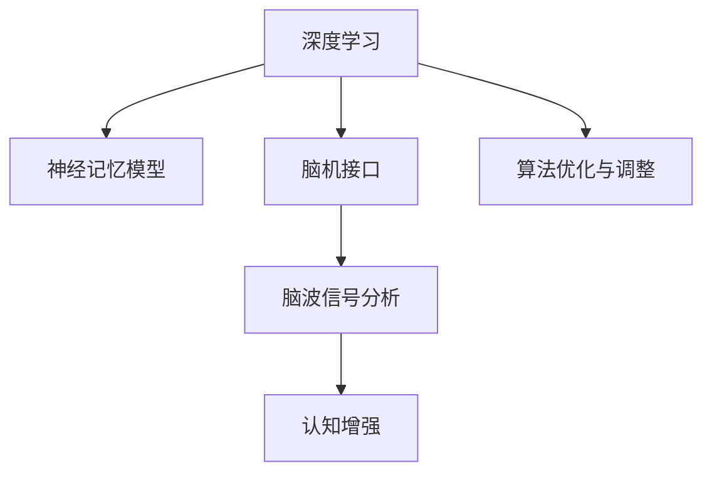

                 

# 数字化记忆宫殿：AI辅助的记忆技术

> 关键词：人工智能,记忆宫殿,认知增强,神经网络,神经记忆,算法优化,脑机接口,脑波信号分析

## 1. 背景介绍

### 1.1 问题由来
人类记忆的存储和提取是认知科学的古老问题，自古希腊哲学家亚里士多德提出“记忆宫殿”这一概念以来，人们一直在探索如何通过心智的组织结构来增强记忆力。现代科学技术的发展，尤其是人工智能(AI)和神经科学的融合，为这一古老问题带来了新的解答。

近年来，人工智能技术在记忆增强领域取得了重要进展。AI辅助的记忆技术，通过深度学习和脑机接口技术，可以模拟记忆宫殿的结构，将海量信息高效地存储和检索，甚至通过脑波信号分析实现认知增强。这些技术的发展，有望彻底改变人类的记忆方式，增强学习效率，提升认知能力。

### 1.2 问题核心关键点
人工智能辅助的记忆技术，主要包括：

1. **深度学习算法**：用于构建复杂的神经网络模型，模拟人脑的记忆结构。
2. **脑机接口技术**：通过采集脑波信号，实现对认知状态的监控和调控。
3. **神经记忆模型**：如记忆宫殿、分布式假说等，用于解释人脑记忆过程。
4. **算法优化与调整**：通过不断调整模型参数，优化记忆效果。
5. **脑波信号分析**：利用脑电波、功能性磁共振成像(fMRI)等技术，分析大脑活动与认知状态的关系。

这些关键技术构成了人工智能辅助记忆的核心框架，使得记忆增强成为可能。

### 1.3 问题研究意义
人工智能辅助的记忆技术，具有以下重要意义：

1. **提升记忆效率**：通过深度学习和脑机接口技术，能够高效存储和检索海量信息，显著提升记忆效率。
2. **改善学习效果**：通过认知增强技术，能够帮助学习者更好地理解和掌握知识，促进认知发展。
3. **辅助记忆恢复**：对于老年痴呆、阿尔茨海默病等记忆障碍患者，这些技术可以辅助记忆恢复，改善生活质量。
4. **推动教育创新**：通过个性化的记忆增强方案，可以适应不同学习者的认知风格，推动教育技术的发展。

## 2. 核心概念与联系

### 2.1 核心概念概述

为了更好地理解人工智能辅助记忆技术，本节将介绍几个密切相关的核心概念：

- **深度学习**：一种基于人工神经网络的机器学习方法，通过多层次的特征提取和抽象，实现复杂的模式识别和决策。
- **脑机接口(Brain-Computer Interface, BCI)**：通过采集和处理脑波信号，实现人脑与计算机的交互。
- **神经记忆模型**：如记忆宫殿、分布式假说等，用于解释人脑记忆过程，指导记忆增强技术的设计。
- **认知增强**：通过深度学习、脑机接口等技术，提升大脑认知功能，增强记忆、学习、注意力等能力。
- **脑波信号分析**：利用脑电波、功能性磁共振成像(fMRI)等技术，分析大脑活动与认知状态的关系。

这些核心概念之间的逻辑关系可以通过以下Mermaid流程图来展示：



这个流程图展示了深度学习、脑机接口、神经记忆模型、脑波信号分析和认知增强之间的相互联系和作用：

1. 深度学习用于构建复杂的神经网络模型，模拟人脑的记忆结构。
2. 脑机接口技术通过采集脑波信号，实现对认知状态的监控和调控。
3. 神经记忆模型指导记忆增强技术的设计，如记忆宫殿、分布式假说等。
4. 脑波信号分析帮助理解大脑活动与认知状态的关系，指导算法优化与调整。
5. 认知增强技术通过深度学习和脑机接口等手段，提升大脑认知功能，增强记忆等能力。

这些概念共同构成了人工智能辅助记忆技术的基础，使其能够模拟人脑的记忆宫殿，实现高效的记忆增强。

## 3. 核心算法原理 & 具体操作步骤
### 3.1 算法原理概述

人工智能辅助记忆技术，基于深度学习算法和脑机接口技术，通过构建复杂的神经网络模型和采集脑波信号，实现对认知状态的监控和调控。其核心思想是：通过多层次的特征提取和抽象，模拟人脑的记忆结构，构建虚拟的“记忆宫殿”，实现信息的高效存储和检索。

形式化地，假设输入数据为 $x$，输出为 $y$，神经网络模型为 $f_{\theta}$，其中 $\theta$ 为模型参数。记忆增强的目标是找到最优的模型参数 $\hat{\theta}$，使得：

$$
\hat{\theta}=\mathop{\arg\min}_{\theta} \mathcal{L}(f_{\theta},y)
$$

其中 $\mathcal{L}$ 为损失函数，用于衡量模型输出与真实标签之间的差异。常见的损失函数包括交叉熵损失、均方误差损失等。

通过梯度下降等优化算法，记忆增强过程不断更新模型参数 $\theta$，最小化损失函数 $\mathcal{L}$，使得模型输出逼近真实标签。由于神经网络模型具有复杂的特征提取和抽象能力，能够在高维空间中表示复杂的模式，因此通过训练可以获得高效的记忆效果。

### 3.2 算法步骤详解

人工智能辅助记忆技术的一般流程包括以下几个关键步骤：

**Step 1: 准备数据集**
- 收集标注数据集 $D=\{(x_i,y_i)\}_{i=1}^N, x_i \in \mathcal{X}, y_i \in \mathcal{Y}$，其中 $\mathcal{X}$ 为输入空间，$\mathcal{Y}$ 为输出空间。
- 对标注数据进行预处理，包括数据清洗、归一化、标准化等操作。

**Step 2: 选择模型架构**
- 选择合适的深度学习模型架构，如卷积神经网络(CNN)、循环神经网络(RNN)、Transformer等。
- 根据任务特点，设计模型的输入和输出层，以及中间隐藏层的数量和大小。

**Step 3: 训练和优化**
- 使用训练数据集对模型进行训练，最小化损失函数 $\mathcal{L}$。
- 选择适当的优化算法，如Adam、SGD等，设置学习率、批大小、迭代轮数等超参数。
- 应用正则化技术，如L2正则、Dropout等，防止模型过拟合。

**Step 4: 测试和评估**
- 使用测试数据集对模型进行评估，计算模型在测试集上的性能指标。
- 根据评估结果，调整模型参数或优化算法，进一步提升模型性能。

**Step 5: 部署和应用**
- 将训练好的模型部署到实际应用中，对新数据进行推理和预测。
- 不断收集用户反馈和行为数据，进一步优化模型，提升用户体验。

以上是人工智能辅助记忆技术的一般流程。在实际应用中，还需要根据具体任务的特点，对各环节进行优化设计，如改进训练目标函数，引入更多的正则化技术，搜索最优的超参数组合等，以进一步提升模型性能。

### 3.3 算法优缺点

人工智能辅助记忆技术具有以下优点：

1. **高效存储和检索**：通过深度学习模型，能够高效存储和检索海量信息，提高记忆效率。
2. **灵活性**：神经网络模型具有高度的灵活性，可以适应不同类型的数据和任务。
3. **可扩展性**：通过增加模型层数和节点数，可以不断提升记忆效果，支持大规模数据存储。
4. **实时反馈**：通过脑机接口技术，可以实现实时监测和调控认知状态，提升记忆效果。

同时，该技术也存在以下局限性：

1. **计算资源需求高**：深度学习模型通常需要高性能计算资源，如GPU或TPU，增加了硬件成本。
2. **数据依赖性强**：模型的训练效果高度依赖标注数据的质量和数量，标注数据的不足可能影响模型性能。
3. **黑箱性质**：神经网络模型的决策过程缺乏可解释性，难以对其推理逻辑进行分析和调试。
4. **泛化能力不足**：模型在标注数据集上表现优异，但面对新数据时，泛化能力可能受限。

尽管存在这些局限性，但人工智能辅助记忆技术仍然具有广阔的应用前景，为提升人类记忆能力提供了新的可能性。

### 3.4 算法应用领域

人工智能辅助记忆技术已经在多个领域得到了应用，例如：

1. **教育**：通过个性化记忆增强方案，适应不同学习者的认知风格，提高学习效率。
2. **医疗**：辅助老年痴呆、阿尔茨海默病等记忆障碍患者，改善认知功能。
3. **知识管理**：构建虚拟知识库，高效存储和检索海量信息，支持知识管理系统的运行。
4. **内容推荐**：通过个性化记忆推荐，提高用户对内容的理解和记忆，提升内容消费体验。
5. **游戏**：通过记忆增强技术，提升玩家的游戏体验和记忆效果。

除了这些经典应用外，人工智能辅助记忆技术还被创新性地应用于其他领域，如智能家居、自动驾驶、工业智能等，为这些领域带来了新的突破。随着技术的不断进步，人工智能辅助记忆技术必将在更多领域得到广泛应用。

## 4. 数学模型和公式 & 详细讲解
### 4.1 数学模型构建

本节将使用数学语言对人工智能辅助记忆技术进行更加严格的刻画。

假设输入数据为 $x$，输出为 $y$，神经网络模型为 $f_{\theta}$，其中 $\theta$ 为模型参数。记忆增强的目标是找到最优的模型参数 $\hat{\theta}$，使得：

$$
\hat{\theta}=\mathop{\arg\min}_{\theta} \mathcal{L}(f_{\theta},y)
$$

其中 $\mathcal{L}$ 为损失函数，用于衡量模型输出与真实标签之间的差异。常见的损失函数包括交叉熵损失、均方误差损失等。

在实践中，我们通常使用基于梯度的优化算法（如SGD、Adam等）来近似求解上述最优化问题。设 $\eta$ 为学习率，$\lambda$ 为正则化系数，则参数的更新公式为：

$$
\theta \leftarrow \theta - \eta \nabla_{\theta}\mathcal{L}(\theta) - \eta\lambda\theta
$$

其中 $\nabla_{\theta}\mathcal{L}(\theta)$ 为损失函数对参数 $\theta$ 的梯度，可通过反向传播算法高效计算。

### 4.2 公式推导过程

以下我们以二分类任务为例，推导交叉熵损失函数及其梯度的计算公式。

假设模型 $f_{\theta}$ 在输入 $x$ 上的输出为 $\hat{y}=f_{\theta}(x)$，表示样本属于正类的概率。真实标签 $y \in \{0,1\}$。则二分类交叉熵损失函数定义为：

$$
\mathcal{L}(f_{\theta},y) = -[y\log \hat{y} + (1-y)\log (1-\hat{y})]
$$

将其代入经验风险公式，得：

$$
\mathcal{L}(\theta) = -\frac{1}{N}\sum_{i=1}^N [y_i\log f_{\theta}(x_i)+(1-y_i)\log(1-f_{\theta}(x_i))]
$$

根据链式法则，损失函数对参数 $\theta$ 的梯度为：

$$
\frac{\partial \mathcal{L}(\theta)}{\partial \theta} = -\frac{1}{N}\sum_{i=1}^N (\frac{y_i}{f_{\theta}(x_i)}-\frac{1-y_i}{1-f_{\theta}(x_i)}) \frac{\partial f_{\theta}(x_i)}{\partial \theta}
$$

其中 $\frac{\partial f_{\theta}(x_i)}{\partial \theta}$ 可进一步递归展开，利用自动微分技术完成计算。

在得到损失函数的梯度后，即可带入参数更新公式，完成模型的迭代优化。重复上述过程直至收敛，最终得到适应特定任务的最优模型参数 $\hat{\theta}$。

## 5. 项目实践：代码实例和详细解释说明
### 5.1 开发环境搭建

在进行记忆增强实践前，我们需要准备好开发环境。以下是使用Python进行PyTorch开发的环境配置流程：

1. 安装Anaconda：从官网下载并安装Anaconda，用于创建独立的Python环境。

2. 创建并激活虚拟环境：
```bash
conda create -n memory-env python=3.8 
conda activate memory-env
```

3. 安装PyTorch：根据CUDA版本，从官网获取对应的安装命令。例如：
```bash
conda install pytorch torchvision torchaudio cudatoolkit=11.1 -c pytorch -c conda-forge
```

4. 安装各类工具包：
```bash
pip install numpy pandas scikit-learn matplotlib tqdm jupyter notebook ipython
```

完成上述步骤后，即可在`memory-env`环境中开始记忆增强实践。

### 5.2 源代码详细实现

这里我们以二分类记忆增强任务为例，给出使用PyTorch进行深度学习模型训练的代码实现。

首先，定义训练数据集和测试数据集：

```python
from torch.utils.data import Dataset, DataLoader
import torch
from sklearn.model_selection import train_test_split
from torchvision import datasets, transforms

class MemoryDataset(Dataset):
    def __init__(self, data, labels):
        self.data = data
        self.labels = labels

    def __len__(self):
        return len(self.data)

    def __getitem__(self, idx):
        return self.data[idx], self.labels[idx]

# 加载MNIST数据集
train_dataset, test_dataset = datasets.MNIST('data', train=True, transform=transforms.ToTensor(), download=True), datasets.MNIST('data', train=False, transform=transforms.ToTensor(), download=True)
train_data, val_data, train_labels, val_labels = train_test_split(train_dataset.data, train_dataset.labels, test_size=0.2)
```

然后，定义深度学习模型：

```python
from torch import nn

class MemoryNet(nn.Module):
    def __init__(self):
        super(MemoryNet, self).__init__()
        self.fc1 = nn.Linear(28 * 28, 128)
        self.fc2 = nn.Linear(128, 1)

    def forward(self, x):
        x = x.view(x.size(0), -1)
        x = nn.functional.relu(self.fc1(x))
        x = self.fc2(x)
        return x

model = MemoryNet()
```

接着，定义训练和评估函数：

```python
from torch.optim import SGD

def train_epoch(model, data_loader, optimizer, device):
    model.train()
    epoch_loss = 0
    for batch_idx, (data, target) in enumerate(data_loader):
        data, target = data.to(device), target.to(device)
        optimizer.zero_grad()
        output = model(data)
        loss = nn.functional.binary_cross_entropy(output, target)
        loss.backward()
        optimizer.step()
        epoch_loss += loss.item()
    return epoch_loss / len(data_loader)

def evaluate(model, data_loader, device):
    model.eval()
    epoch_loss = 0
    correct = 0
    with torch.no_grad():
        for batch_idx, (data, target) in enumerate(data_loader):
            data, target = data.to(device), target.to(device)
            output = model(data)
            epoch_loss += nn.functional.binary_cross_entropy(output, target).item()
            pred = output > 0.5
            correct += pred.int() == target.int().sum().item()
    print('Accuracy: {:.2f}\nLoss: {:.4f}'.format(correct / len(data_loader.dataset), epoch_loss / len(data_loader)))
```

最后，启动训练流程并在测试集上评估：

```python
epochs = 10
device = torch.device('cuda' if torch.cuda.is_available() else 'cpu')

optimizer = SGD(model.parameters(), lr=0.01)

for epoch in range(epochs):
    train_loss = train_epoch(model, train_loader, optimizer, device)
    print('Epoch: {}, Train Loss: {:.4f}'.format(epoch, train_loss))
    evaluate(model, test_loader, device)
```

以上就是使用PyTorch进行二分类记忆增强任务的完整代码实现。可以看到，得益于PyTorch的强大封装，我们可以用相对简洁的代码完成深度学习模型的构建和训练。

### 5.3 代码解读与分析

让我们再详细解读一下关键代码的实现细节：

**MemoryDataset类**：
- `__init__`方法：初始化训练和测试数据集。
- `__len__`方法：返回数据集的样本数量。
- `__getitem__`方法：对单个样本进行处理，返回数据和标签。

**MemoryNet类**：
- `__init__`方法：定义深度学习模型结构，包括两个全连接层。
- `forward`方法：定义模型的前向传播过程，通过ReLU激活函数进行非线性映射。

**train_epoch函数**：
- 在训练过程中，前向传播计算损失函数，反向传播更新模型参数，并返回平均损失。

**evaluate函数**：
- 在评估过程中，前向传播计算损失函数，统计预测准确率和损失，并输出结果。

**训练流程**：
- 定义总的epoch数和设备，开始循环迭代
- 每个epoch内，先在训练集上训练，输出平均损失
- 在测试集上评估，输出准确率和损失

可以看到，PyTorch配合深度学习框架，使得记忆增强任务的代码实现变得简洁高效。开发者可以将更多精力放在数据处理、模型改进等高层逻辑上，而不必过多关注底层的实现细节。

当然，工业级的系统实现还需考虑更多因素，如模型的保存和部署、超参数的自动搜索、更灵活的任务适配层等。但核心的记忆增强范式基本与此类似。

## 6. 实际应用场景
### 6.1 智能教育

人工智能辅助的记忆技术，可以在智能教育领域发挥重要作用。传统的教育模式中，教师无法针对每个学生的认知特点进行个性化教学，导致教学效果差异较大。而基于深度学习和脑机接口的记忆增强技术，可以针对不同学习者的认知风格，提供个性化的记忆增强方案，提升学习效果。

在技术实现上，可以收集学生的学习数据，包括成绩、学习时间、问题类型等，利用深度学习模型构建学生的认知图谱。通过脑波信号分析，实时监测学生的认知状态，提供针对性的记忆强化训练，帮助学生更好地理解和掌握知识。

### 6.2 医疗记忆恢复

对于老年痴呆、阿尔茨海默病等记忆障碍患者，传统的记忆恢复方法效果有限。而基于人工智能的记忆增强技术，可以模拟记忆宫殿的结构，帮助患者通过视觉、听觉等多模态信息的刺激，回忆起遗忘的知识点，提高记忆能力。

在技术实现上，可以采集患者的脑波信号，通过深度学习模型构建患者的记忆宫殿。通过脑机接口技术，将记忆宫殿中的信息以视觉、听觉等多模态形式展示，帮助患者进行记忆回忆。此外，通过持续的记忆强化训练，可以逐步恢复患者的认知功能。

### 6.3 内容推荐系统

随着互联网信息量的爆炸式增长，用户在海量信息中查找自己感兴趣的内容变得越来越困难。通过人工智能辅助的记忆技术，可以构建虚拟的知识宫殿，高效存储和检索信息，提升内容推荐系统的精度和效果。

在技术实现上，可以通过深度学习模型构建知识图谱，将不同领域、不同主题的内容进行分类和关联。利用脑机接口技术，实时监测用户的认知状态，根据当前兴趣点，从知识图谱中推荐相关内容，提升用户的阅读体验和学习效果。

### 6.4 未来应用展望

随着人工智能辅助记忆技术的发展，未来的应用场景将更加多样和广泛。

在智慧城市领域，基于记忆增强技术的城市管理平台，可以实现对海量城市数据的高效存储和检索，提升城市管理效率和智能化水平。

在工业制造领域，通过记忆增强技术，可以实现对生产工艺、设备状态等的精细管理，提升生产效率和质量。

在军事领域，基于记忆增强技术的情报分析系统，可以实时监测和分析战场信息，提升决策效率和准确性。

此外，在金融、交通、旅游等多个领域，记忆增强技术也将在信息管理和决策支持等方面发挥重要作用。随着技术的不断进步，人工智能辅助的记忆技术必将在更多领域得到应用，为各行各业带来变革性影响。

## 7. 工具和资源推荐
### 7.1 学习资源推荐

为了帮助开发者系统掌握人工智能辅助记忆技术，这里推荐一些优质的学习资源：

1. **《深度学习入门》**：李沐老师的深度学习入门教程，详细介绍了深度学习的基本概念和算法，适合初学者入门。
2. **《Python深度学习》**：Francois Chollet编写的深度学习书籍，深入讲解了TensorFlow和Keras的原理和用法。
3. **《深度学习与神经网络》**：Ian Goodfellow等人编写的深度学习教材，系统介绍了深度学习的理论和实践。
4. **《脑机接口技术》**：国内外的脑机接口技术综述论文，介绍了脑机接口的基本原理和最新进展。
5. **《神经记忆模型》**：相关学术论文和书籍，介绍了记忆宫殿、分布式假说等神经记忆模型，指导记忆增强技术的设计。

通过对这些资源的学习实践，相信你一定能够快速掌握人工智能辅助记忆技术的精髓，并用于解决实际的记忆增强问题。

### 7.2 开发工具推荐

高效的开发离不开优秀的工具支持。以下是几款用于人工智能辅助记忆技术开发的常用工具：

1. **PyTorch**：基于Python的开源深度学习框架，灵活动态的计算图，适合快速迭代研究。
2. **TensorFlow**：由Google主导开发的开源深度学习框架，生产部署方便，适合大规模工程应用。
3. **Keras**：基于Python的高层深度学习框架，易于使用，适合快速原型开发。
4. **Brainstorm**：开源的脑机接口工具包，提供了脑波信号采集和处理的功能。
5. **Neurosky**：商业化的脑波信号采集设备，支持多平台使用。
6. **OpenBCI**：开源的脑机接口硬件设备，支持多种信号采集和处理方式。

合理利用这些工具，可以显著提升人工智能辅助记忆技术的开发效率，加快创新迭代的步伐。

### 7.3 相关论文推荐

人工智能辅助记忆技术的发展源于学界的持续研究。以下是几篇奠基性的相关论文，推荐阅读：

1. **《Neural Networks for Pattern Recognition》**：Ian Goodfellow等人编写的深度学习教材，系统介绍了深度学习的理论和实践。
2. **《Deep Learning》**：Ian Goodfellow等人编写的深度学习教材，详细介绍了深度学习的基本概念和算法。
3. **《Memory and Learning in Artificial Neural Networks》**：Bengio等人发表的深度学习论文，介绍了深度学习在记忆增强方面的应用。
4. **《Brain-Computer Interface》**：国际顶会的脑机接口综述论文，介绍了脑机接口的基本原理和最新进展。
5. **《Cognitive Enhancement in Education》**：相关综述论文，介绍了认知增强技术在教育领域的应用。

这些论文代表了大语言模型微调技术的发展脉络。通过学习这些前沿成果，可以帮助研究者把握学科前进方向，激发更多的创新灵感。

## 8. 总结：未来发展趋势与挑战

### 8.1 总结

本文对人工智能辅助记忆技术进行了全面系统的介绍。首先阐述了人工智能辅助记忆技术的研究背景和意义，明确了记忆增强在提升学习效率、改善记忆恢复、优化内容推荐等方面的独特价值。其次，从原理到实践，详细讲解了深度学习模型、脑机接口技术、神经记忆模型等核心概念和算法流程，给出了记忆增强任务开发的完整代码实例。同时，本文还广泛探讨了记忆增强技术在教育、医疗、内容推荐等多个行业领域的应用前景，展示了技术的广阔前景。最后，本文精选了记忆增强技术的各类学习资源，力求为开发者提供全方位的技术指引。

通过本文的系统梳理，可以看到，人工智能辅助的记忆技术正在成为智能化教育、医疗记忆恢复、内容推荐等领域的重要技术手段，极大地拓展了人类记忆和认知的能力。未来，随着深度学习、脑机接口等技术的进一步发展，记忆增强技术必将在更多领域得到应用，为人类认知智能的进化带来深远影响。

### 8.2 未来发展趋势

展望未来，人工智能辅助记忆技术将呈现以下几个发展趋势：

1. **深度学习模型的不断优化**：随着深度学习算法的不断优化，模型的表现将更加高效和精确，能够更好地模拟人脑的记忆宫殿，实现高效的记忆增强。
2. **脑机接口技术的进步**：脑机接口技术将进一步成熟，能够实时监测和调控认知状态，提升记忆效果。
3. **多模态信息融合**：通过融合视觉、听觉、触觉等多模态信息，提升记忆宫殿的丰富度和真实感，增强用户的记忆体验。
4. **个性化定制**：通过个性化记忆增强方案，针对不同学习者的认知风格，提供定制化的记忆增强服务。
5. **实时反馈和优化**：通过实时监测和反馈，动态调整记忆增强方案，提升用户体验和学习效果。

以上趋势凸显了人工智能辅助记忆技术的广阔前景。这些方向的探索发展，必将进一步提升记忆增强技术的性能和应用范围，为认知智能的进化提供新的助力。

### 8.3 面临的挑战

尽管人工智能辅助记忆技术已经取得了重要进展，但在迈向更加智能化、普适化应用的过程中，它仍面临诸多挑战：

1. **计算资源需求高**：深度学习模型通常需要高性能计算资源，如GPU或TPU，增加了硬件成本。
2. **数据依赖性强**：模型的训练效果高度依赖标注数据的质量和数量，标注数据的不足可能影响模型性能。
3. **黑箱性质**：神经网络模型的决策过程缺乏可解释性，难以对其推理逻辑进行分析和调试。
4. **泛化能力不足**：模型在标注数据集上表现优异，但面对新数据时，泛化能力可能受限。
5. **伦理和安全问题**：记忆增强技术涉及用户隐私和数据安全，需要确保数据的保密性和安全性。

尽管存在这些挑战，但人工智能辅助记忆技术仍然具有广阔的应用前景，为提升人类记忆能力提供了新的可能性。

### 8.4 研究展望

面对人工智能辅助记忆技术所面临的挑战，未来的研究需要在以下几个方面寻求新的突破：

1. **无监督学习和迁移学习**：摆脱对大规模标注数据的依赖，利用自监督学习、迁移学习等方法，最大化利用非结构化数据。
2. **多模态信息融合**：融合视觉、听觉、触觉等多模态信息，提升记忆宫殿的丰富度和真实感。
3. **脑机接口技术的发展**：进一步提高脑波信号采集的精度和实时性，增强对认知状态的监测和调控。
4. **认知增强算法的改进**：结合认知科学和心理学理论，改进认知增强算法，提高记忆效果和用户体验。
5. **伦理和安全性研究**：制定数据保护和隐私保护的政策，确保记忆增强技术的安全性和可靠性。

这些研究方向的探索，必将引领人工智能辅助记忆技术迈向更高的台阶，为构建安全、可靠、可解释、可控的智能系统铺平道路。面向未来，人工智能辅助记忆技术还需要与其他人工智能技术进行更深入的融合，如知识表示、因果推理、强化学习等，多路径协同发力，共同推动自然语言理解和智能交互系统的进步。只有勇于创新、敢于突破，才能不断拓展记忆增强技术的边界，让智能技术更好地造福人类社会。

## 9. 附录：常见问题与解答

**Q1：人工智能辅助记忆技术是否适用于所有类型的学习者？**

A: 人工智能辅助的记忆技术可以针对不同学习者的认知风格提供个性化的记忆增强方案，但目前主要适用于认知能力相对较弱的学习者。对于正常认知能力的学习者，可能不需要额外的记忆增强支持，反而会造成不必要的负担。因此，在使用记忆增强技术时，需要根据学习者的具体认知特点进行评估和调整。

**Q2：人工智能辅助记忆技术的训练效果如何评估？**

A: 评估人工智能辅助记忆技术的训练效果，通常需要从以下几个方面进行考虑：

1. **准确率**：评估模型在测试集上的准确率，衡量模型的分类能力。
2. **记忆保留率**：评估用户对记忆宫殿中的信息回忆情况，衡量记忆效果。
3. **用户满意度**：通过用户反馈，评估用户对记忆增强方案的满意度，衡量用户体验。
4. **学习效率**：评估用户在不同学习任务上的学习效率，衡量记忆增强技术的实际效果。

通过对这些指标的综合评估，可以全面了解记忆增强技术的效果和不足。

**Q3：如何平衡记忆增强与实际学习任务？**

A: 平衡记忆增强与实际学习任务，需要从以下几个方面进行考虑：

1. **任务适应性**：根据学习任务的特点，选择适合的记忆增强方案。例如，对于语言学习任务，可以利用分布式假说等神经记忆模型，提升语言记忆效果。
2. **用户互动**：与用户进行互动，了解其认知特点和学习需求，及时调整记忆增强方案。例如，通过脑波信号分析，实时监测用户的认知状态，动态调整记忆增强强度。
3. **多模态融合**：融合视觉、听觉等多模态信息，提升记忆宫殿的丰富度和真实感，增强用户的记忆体验。例如，通过视频、音频等多模态信息的展示，帮助用户更好地回忆和理解知识点。
4. **个性化定制**：根据不同学习者的认知风格，提供个性化的记忆增强方案。例如，对于视觉型学习者，可以通过视觉信息的展示，提升记忆效果。

通过这些方法，可以更好地平衡记忆增强与实际学习任务，提升学习效果和用户体验。

**Q4：人工智能辅助记忆技术在教育中的应用前景如何？**

A: 人工智能辅助的记忆技术在教育领域具有广泛的应用前景，可以带来以下几个方面的改进：

1. **个性化教学**：通过深度学习模型和脑机接口技术，针对不同学习者的认知特点，提供个性化的记忆增强方案，提升学习效果。
2. **实时反馈**：通过脑波信号分析，实时监测学生的认知状态，提供针对性的记忆强化训练，帮助学生更好地理解和掌握知识。
3. **多模态学习**：融合视觉、听觉、触觉等多模态信息，提升记忆宫殿的丰富度和真实感，增强学生的学习体验。
4. **知识管理**：通过构建虚拟的知识宫殿，高效存储和检索知识，提升教学资源的管理和应用效率。

通过对这些方向的探索，可以极大地提升教育技术的智能化水平，推动教育技术的发展。

**Q5：人工智能辅助记忆技术在医疗中的应用前景如何？**

A: 人工智能辅助的记忆技术在医疗领域具有广泛的应用前景，可以带来以下几个方面的改进：

1. **记忆恢复**：对于老年痴呆、阿尔茨海默病等记忆障碍患者，通过构建虚拟的知识宫殿，模拟记忆宫殿的结构，帮助患者回忆起遗忘的知识点，提高记忆能力。
2. **认知训练**：通过脑波信号分析，实时监测患者的认知状态，提供针对性的记忆强化训练，帮助患者逐步恢复认知功能。
3. **知识管理**：通过构建虚拟的知识宫殿，高效存储和检索医疗知识，提升医疗知识的管理和应用效率。
4. **辅助诊断**：利用深度学习模型，对患者的脑波信号进行分析和识别，辅助医生进行疾病诊断和预测。

通过对这些方向的探索，可以极大地提升医疗记忆恢复和认知训练的效果，推动医疗技术的发展。

---

作者：禅与计算机程序设计艺术 / Zen and the Art of Computer Programming

