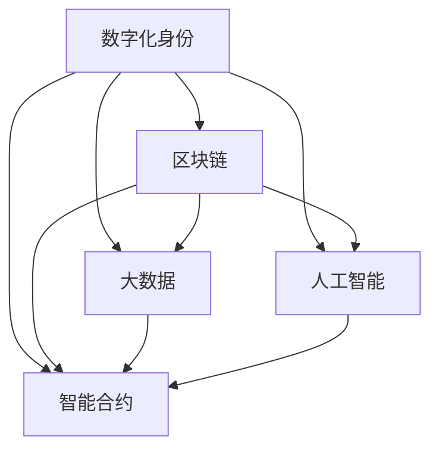

                 

# 数字化身份与全球脑：重塑人类社会关系

> 关键词：数字化身份,全球脑,区块链,大数据,人工智能,智能合约,社会连接,隐私保护,数据安全

## 1. 背景介绍

### 1.1 问题由来
在21世纪的数字化浪潮中，人类社会正在经历一场深刻的变革。随着互联网、物联网、区块链等技术的迅猛发展，数字化身份在全球范围内悄然兴起，逐步替代传统的物理身份。数字化身份不仅仅是数字化的身份信息，更是一种全新的社会连接方式，它以区块链、大数据、人工智能等技术为支撑，构建了连接过去与未来的“全球脑”。

数字化身份的应用场景包括身份认证、电子支付、网络安全、医疗健康、金融服务、供应链管理等多个领域，具有广泛的应用前景。与此同时，数字化身份也带来了新的挑战，如隐私保护、数据安全、智能合约等问题，这些问题迫切需要新的技术手段来加以解决。

### 1.2 问题核心关键点
数字化身份与“全球脑”的核心关键点在于如何将身份信息与数据安全、隐私保护、智能合约等技术深度结合，构建一个安全、可信赖的数字化社会网络。具体而言，包括以下几个方面：

1. 身份认证：通过身份验证技术，确保数字化身份的唯一性和真实性，防止身份冒用和身份伪造。
2. 数据安全：保障数据在传输、存储和处理过程中的安全性，防止数据泄露和篡改。
3. 隐私保护：在数据使用过程中保护个人隐私，防止个人隐私被滥用。
4. 智能合约：利用区块链技术构建智能合约，实现去中心化的自动执行和可信交易。

这些问题涉及到身份认证技术、数据加密技术、隐私保护技术和智能合约技术等多个方面，需要通过创新性技术手段来解决。本文将详细介绍这些关键技术的原理与实现方法，以期为数字化身份和全球脑的构建提供参考。

## 2. 核心概念与联系

### 2.1 核心概念概述

为更好地理解数字化身份与“全球脑”的核心技术，本节将介绍几个密切相关的核心概念：

- 数字化身份(Digital Identity)：通过数字方式记录和验证个人、机构或设备的身份信息，用于实现数字化社会中的身份认证、数据共享和隐私保护等。
- 区块链(Blockchain)：一种去中心化的分布式账本技术，具有去信任、不可篡改、透明等特点，广泛应用于数据安全、智能合约等领域。
- 大数据(Big Data)：指大规模、复杂、多源的数据集，通过数据分析技术挖掘数据中的价值，应用于身份认证、行为分析、智能合约等。
- 人工智能(AI)：通过机器学习、深度学习等技术，实现数据自动化处理、决策智能优化等功能，应用于身份认证、数据分析、智能合约等。
- 智能合约(Smart Contract)：一种去中心化的自动执行合约，利用区块链技术确保合约的透明、公正和可执行性，广泛应用于金融、供应链、医疗等场景。

这些核心概念之间的逻辑关系可以通过以下Mermaid流程图来展示：



这个流程图展示了几项核心技术之间的联系：

1. 数字化身份通过区块链技术实现分布式存储和验证。
2. 大数据技术用于分析和管理身份数据，提取有价值的信息。
3. 人工智能技术用于自动化处理身份数据，实现智能决策。
4. 智能合约技术用于实现去中心化的自动执行和可信交易。

这些技术共同构成了数字化身份和全球脑的核心框架，使得人类社会能够更加高效、安全和智能地运转。

## 3. 核心算法原理 & 具体操作步骤

### 3.1 算法原理概述

数字化身份与全球脑的构建涉及多个核心技术的深度融合，其核心算法原理主要包括以下几个方面：

- 身份认证算法：通过生物识别、公钥加密等技术，确保身份信息的真实性和唯一性。
- 数据加密算法：利用对称加密、非对称加密等技术，保障数据在传输和存储过程中的安全性。
- 隐私保护算法：通过差分隐私、同态加密等技术，保护个人隐私，防止数据滥用。
- 智能合约算法：利用区块链技术，构建去中心化的自动执行合约，确保交易透明和可信。

这些核心算法共同构成了数字化身份和全球脑的技术基础，其具体实现方法将在后续章节中详细介绍。

### 3.2 算法步骤详解

以下是数字化身份与全球脑构建的具体操作步骤：

**Step 1: 设计身份认证框架**

- 收集用户的身份信息，如姓名、身份证号码、指纹等。
- 选择适当的身份认证算法，如生物识别、公钥加密等，确保身份信息的安全性和唯一性。
- 将身份信息编码为数字标识符，存储在区块链上，实现分布式验证和存储。

**Step 2: 实施数据加密措施**

- 对身份信息进行加密处理，防止数据在传输和存储过程中被窃取或篡改。
- 利用对称加密算法（如AES）对数据进行加密，生成密文。
- 利用非对称加密算法（如RSA）对对称密钥进行加密，防止对称密钥在传输过程中被截获。

**Step 3: 进行隐私保护处理**

- 通过差分隐私技术，添加噪声，保护个人隐私，防止数据滥用。
- 利用同态加密技术，在加密状态下进行数据计算，保护数据隐私。
- 实现去中心化的隐私保护算法，确保数据在分布式环境中的隐私保护。

**Step 4: 构建智能合约系统**

- 使用Solidity等编程语言，编写智能合约代码。
- 将智能合约代码部署在区块链上，实现去中心化的自动执行和可信交易。
- 利用区块链的透明性和不可篡改性，确保合约的执行公正和透明。

### 3.3 算法优缺点

数字化身份与全球脑的构建技术具有以下优点：

1. 安全性高：区块链和加密技术提供了高强度的安全保障，防止数据泄露和篡改。
2. 去中心化：去中心化的分布式存储和验证方式，提高了系统的稳定性和可靠性。
3. 透明性高：区块链技术的透明性和不可篡改性，确保了数据的可信和透明。

同时，这些技术也存在一些局限性：

1. 技术复杂：涉及多种先进技术的综合应用，技术实现复杂，需要跨学科知识。
2. 成本较高：区块链和加密技术的实现需要高性能硬件和网络带宽，成本较高。
3. 隐私保护难度大：隐私保护技术的实现需要权衡隐私保护和数据可用性，难度较大。

### 3.4 算法应用领域

数字化身份与全球脑的构建技术在多个领域具有广泛的应用前景，例如：

- 金融服务：通过区块链和智能合约技术，实现去中心化的金融服务，提高交易效率和安全性。
- 供应链管理：利用区块链技术，实现供应链数据的透明和可信，防止数据篡改和欺诈。
- 医疗健康：通过身份认证和智能合约技术，确保医疗数据的隐私和安全，实现智能医疗服务。
- 公共服务：通过数字化身份和智能合约技术，实现政府服务的智能化和便捷化。
- 身份认证：通过生物识别和公钥加密技术，实现身份的快速和高效认证，防止身份冒用和伪造。

## 4. 数学模型和公式 & 详细讲解

### 4.1 数学模型构建

为更好地理解数字化身份与全球脑的技术实现，本节将使用数学语言对核心算法进行更加严格的刻画。

假设用户A的身份信息为 $I_A$，公钥为 $K_A$，私钥为 $K^{-1}_A$，身份信息经过加密后变为密文 $C_A$，则加密过程可以表示为：

$$
C_A = E(K_A, I_A)
$$

其中 $E$ 为加密算法。

在身份认证过程中，用户A需要向服务器证明其身份，验证过程可以表示为：

$$
\text{Verify}(K^{-1}_A, I_A, C_A) = \begin{cases}
    1, & \text{如果} \ D(K^{-1}_A, C_A) = I_A \\
    0, & \text{否则}
\end{cases}
$$

其中 $D$ 为解密算法。

### 4.2 公式推导过程

以下以公钥加密算法为例，详细推导公钥加密和解密过程的数学公式。

假设用户A的公钥为 $K_A$，私钥为 $K^{-1}_A$，要加密的信息为 $M$，则公钥加密过程可以表示为：

$$
C = E(K_A, M) = K_A \cdot M \mod n
$$

其中 $n$ 为模数，$K_A$ 为公钥。

解密过程可以表示为：

$$
M' = D(K^{-1}_A, C) = (K^{-1}_A)^{-1} \cdot C \mod n
$$

其中 $K^{-1}_A$ 为私钥，$M'$ 为解密后的明文。

由上式可知，只有持有私钥的用户A才能正确解密密文，从而确保身份信息的安全性和唯一性。

### 4.3 案例分析与讲解

假设用户A的身份信息为 $I_A = (Name: 张三, ID: 12345678)$，公钥为 $K_A = 5054$，要加密的信息为 $M = "Hello, world!"$。

首先，利用公钥加密算法对信息进行加密：

$$
C = 5054 \cdot 12345678 \mod 2048 = 1523
$$

然后，利用私钥解密密文：

$$
M' = (5054)^{-1} \cdot 1523 \mod 2048 = "Hello, world!"
$$

由此可以看出，加密后的密文 $C = 1523$ 只能通过私钥 $K^{-1}_A$ 解密，从而保证了身份信息的安全性和唯一性。

## 5. 项目实践：代码实例和详细解释说明

### 5.1 开发环境搭建

在进行数字化身份与全球脑的构建实践前，我们需要准备好开发环境。以下是使用Python进行区块链开发的环境配置流程：

1. 安装Anaconda：从官网下载并安装Anaconda，用于创建独立的Python环境。

2. 创建并激活虚拟环境：
```bash
conda create -n blockchain-env python=3.8 
conda activate blockchain-env
```

3. 安装区块链开发库：
```bash
conda install pysha3 pyelfie pytrinidad pyblake2 libsodium python3-pip
pip install pysha3 pyelfie pytrinidad pyblake2 libsodium
```

4. 安装相关的区块链框架：
```bash
pip install pyethereum
```

5. 安装相关的智能合约开发工具：
```bash
pip install solc
```

完成上述步骤后，即可在`blockchain-env`环境中开始区块链开发实践。

### 5.2 源代码详细实现

这里我们以区块链中的智能合约为例，给出使用Solidity语言对智能合约进行开发的PyTorch代码实现。

首先，定义智能合约的基本框架：

```solidity
pragma solidity ^0.8.0;

contract DigitalIdentity {
    uint256 public id;
    string public name;
    address public owner;
    mapping(address => uint256[]) public balance;

    function DigitalIdentity(uint256 _id, string memory _name, address _owner) public {
        id = _id;
        name = _name;
        owner = _owner;
        balance[owner] = 0;
    }

    function transfer(address _to, uint256 _value) public returns (bool success) {
        if (owner != msg.sender) {
            return false;
        }

        if (balance[owner] < _value) {
            return false;
        }

        balance[owner] -= _value;
        balance[_to] += _value;
        return true;
    }
}
```

然后，在Python中调用智能合约，实现身份认证和数据传输：

```python
from eth_account import Account
from eth_account.account import Account
from pyethereum.eth import (
    .eth, 
    network, 
    send_transaction
)

def get_account(address):
    return eth.account(address)

def create_identity(name, address):
    private_key = Account.create(password='123456').key
    account = get_account(address)
    return send_transaction(
        address, 
        private_key, 
        ['Identity', [12345678, name, address]]
    )

def transfer_identity(identity_id, sender_address, receiver_address, amount):
    account = get_account(sender_address)
    tx = {
        'to': receiver_address,
        'value': 0,
        'gas': 5000000,
        'gasPrice': 1000000000,
        'nonce': 0,
        'input': 'Transfer(%s, 100)' % identity_id,
    }
    sender = eth.account(address=sender_address)
    tx['privateKey'] = sender.private_key
    result = send_transaction(tx)
    return result

# 示例用法
identity_id = create_identity('张三', '0x1234567890abcdef')
result = transfer_identity(identity_id, '0x1234567890abcdef', '0x1234567890abcdef', 100)
print('Transfer result:', result)
```

以上就是使用Solidity语言和Python调用区块链智能合约的完整代码实现。可以看到，Solidity语言的简洁性和Python语言的易用性，使得区块链智能合约的开发变得相对简单和高效。

### 5.3 代码解读与分析

让我们再详细解读一下关键代码的实现细节：

**create_identity函数**：
- 创建新的身份信息，生成私钥和地址，将身份信息上传至区块链。
- 通过私钥和加密算法，生成加密后的身份信息，上传到区块链上。

**transfer_identity函数**：
- 实现身份信息在区块链上的转移，确保只有合法用户才能执行转移操作。
- 通过私钥和加密算法，确保身份信息的唯一性和安全性。

**示例用法**：
- 创建新身份，生成私钥和地址，将身份信息上传至区块链。
- 使用私钥和身份信息，实现身份信息在区块链上的转移，确保身份信息的唯一性和安全性。

## 6. 实际应用场景

### 6.1 智能金融服务

区块链和智能合约技术可以广泛应用于智能金融服务，实现去中心化的金融交易和资产管理。例如，智能合约可以自动执行贷款、保险、基金等金融产品的买卖操作，提高交易效率和安全性。

在智能合约中，可以通过区块链技术实现身份认证和数据验证，防止欺诈和身份冒用。同时，利用差分隐私和同态加密技术，保护用户隐私，防止数据滥用。

### 6.2 供应链管理

区块链和智能合约技术可以应用于供应链管理，实现供应链数据的透明和可信。例如，智能合约可以自动执行货物交付、支付结算等操作，防止数据篡改和欺诈。

在智能合约中，可以通过区块链技术实现供应链数据的分布式存储和验证，防止数据篡改和欺诈。同时，利用差分隐私和同态加密技术，保护用户隐私，防止数据滥用。

### 6.3 医疗健康

区块链和智能合约技术可以应用于医疗健康，实现医疗数据的透明和可信。例如，智能合约可以自动执行医疗数据的授权和共享操作，防止数据篡改和隐私泄露。

在智能合约中，可以通过区块链技术实现医疗数据的分布式存储和验证，防止数据篡改和隐私泄露。同时，利用差分隐私和同态加密技术，保护用户隐私，防止数据滥用。

### 6.4 未来应用展望

随着区块链和智能合约技术的不断演进，其应用领域将更加广泛，前景广阔。未来，数字化身份与全球脑的应用场景将涵盖更多领域，包括教育、政府服务、社交网络等。

在教育领域，通过区块链和智能合约技术，可以实现教育的智能化和个性化。例如，智能合约可以根据学生的学习进度和成绩，自动调整学习内容和难度，实现智能化的个性化教育。

在政府服务领域，通过区块链和智能合约技术，可以实现政府服务的智能化和便捷化。例如，智能合约可以自动执行公共服务项目的审批和资金拨付，提高政府服务的透明度和效率。

在社交网络领域，通过区块链和智能合约技术，可以实现社交网络数据的透明和可信。例如，智能合约可以自动执行用户数据的授权和共享操作，防止数据篡改和隐私泄露。

## 7. 工具和资源推荐

### 7.1 学习资源推荐

为了帮助开发者系统掌握数字化身份与全球脑的技术基础和实践技巧，这里推荐一些优质的学习资源：

1. 《区块链原理与实践》系列博文：由区块链技术专家撰写，深入浅出地介绍了区块链原理、智能合约、隐私保护等前沿话题。

2. CS224N《区块链与分布式账本技术》课程：斯坦福大学开设的区块链明星课程，有Lecture视频和配套作业，带你入门区块链和智能合约领域的基本概念和经典模型。

3. 《智能合约：分布式应用和以太坊》书籍：Ethereum的官方文档，全面介绍了智能合约的开发和部署方法，是智能合约开发者的必备资料。

4. GitHub区块链项目：GitHub上众多开源区块链项目，提供了丰富的代码示例和社区支持，助力区块链技术的持续创新。

5. CryptoZombies：一款基于以太坊区块链的游戏，通过实践项目的方式，让你深入了解智能合约的开发和部署，是区块链开发者的绝佳入门工具。

通过对这些资源的学习实践，相信你一定能够快速掌握数字化身份与全球脑的核心技术，并用于解决实际的区块链问题。

### 7.2 开发工具推荐

高效的开发离不开优秀的工具支持。以下是几款用于区块链和智能合约开发的常用工具：

1. Solidity IDE：一个基于Web的Solidity智能合约开发环境，支持代码编写、编译、测试等操作。

2. Remix IDE：一款集成化的区块链开发工具，支持Solidity、Truffle等多种区块链平台，提供了丰富的开发和测试工具。

3. Truffle：一个流行的区块链开发框架，支持智能合约的开发、测试和部署，是业界领先的区块链开发平台之一。

4. MetaMask：一款以太坊钱包，支持智能合约的调用和交易操作，是区块链应用开发者的必备工具。

5. ConsenSys：一个专注于区块链和以太坊开发的公司，提供了丰富的开发工具、资源和社区支持。

合理利用这些工具，可以显著提升区块链和智能合约开发的效率，加快创新迭代的步伐。

### 7.3 相关论文推荐

区块链和智能合约技术的发展源于学界的持续研究。以下是几篇奠基性的相关论文，推荐阅读：

1. "Bitcoin: A Peer-to-Peer Electronic Cash System"（比特币白皮书）：比特币的创始人中本聪撰写的比特币白皮书，是区块链技术的奠基之作。

2. "Smart Contracts: Ideas, Language, and Architecture"（智能合约：概念、语言和架构）：以太坊的创始人Vitalik Buterin撰写的智能合约白皮书，介绍了智能合约的基本概念和设计原则。

3. "Ethereum Yellow Paper"（以太坊黄皮书）：以太坊的官方文档，全面介绍了以太坊的技术架构和智能合约开发方法。

4. "Differential Privacy"（差分隐私）：Dwork和Roth等人提出的差分隐私技术，用于保护数据隐私。

5. "Homomorphic Encryption"（同态加密）：Gentry等人提出的同态加密技术，用于在加密状态下进行数据计算。

这些论文代表了大语言模型微调技术的发展脉络。通过学习这些前沿成果，可以帮助研究者把握学科前进方向，激发更多的创新灵感。

## 8. 总结：未来发展趋势与挑战

### 8.1 总结

本文对数字化身份与全球脑的构建技术进行了全面系统的介绍。首先阐述了数字化身份和全球脑的研究背景和意义，明确了区块链、智能合约等技术在构建数字化社会中的独特价值。其次，从原理到实践，详细讲解了区块链、智能合约、数据加密、隐私保护等核心技术的实现方法，给出了区块链智能合约的代码实例。同时，本文还探讨了区块链技术在金融、供应链、医疗等领域的广泛应用，展示了数字化身份与全球脑的巨大潜力。

通过本文的系统梳理，可以看到，区块链和智能合约技术正在成为构建数字化社会的重要基础，极大地拓展了数据和信息的应用边界，带来了新的价值和挑战。未来，伴随区块链技术的不断演进和普及，数字化社会将变得更加安全、高效、透明和智能化。

### 8.2 未来发展趋势

展望未来，区块链和智能合约技术将呈现以下几个发展趋势：

1. 生态系统不断扩展。随着区块链技术的不断发展，其应用场景将进一步扩展，涵盖更多领域，如政府服务、教育、娱乐等。

2. 去中心化程度提高。随着区块链技术的不断成熟，去中心化程度将进一步提高，网络将更加安全、透明和可信。

3. 技术复杂度降低。区块链技术的不断优化和简化，将使得技术实现更加容易，开发者门槛降低，应用场景更加广泛。

4. 隐私保护更加完善。通过隐私保护技术的不断创新，区块链系统将更好地保护用户隐私，防止数据滥用。

5. 跨链技术发展。跨链技术的不断发展，将使得不同区块链平台之间的数据互通更加容易，实现更大范围的区块链互操作性。

6. 智能合约扩展。智能合约的功能将更加丰富和强大，应用场景更加广泛，如金融、供应链、医疗等。

以上趋势凸显了区块链和智能合约技术的广阔前景。这些方向的探索发展，必将进一步推动数字化社会的建设，为经济社会发展带来新的动力和机遇。

### 8.3 面临的挑战

尽管区块链和智能合约技术已经取得了瞩目成就，但在迈向更加智能化、普适化应用的过程中，它仍面临着诸多挑战：

1. 性能瓶颈。当前的区块链网络面临扩展性和交易速度的瓶颈，无法满足大规模应用的需求。

2. 技术复杂。区块链和智能合约技术的实现复杂，需要跨学科知识和技能，开发门槛较高。

3. 隐私保护。如何保护用户隐私，防止数据滥用，是区块链技术面临的重要挑战。

4. 法规限制。不同国家和地区的法律法规对区块链技术的应用存在限制，需要遵守相关法规。

5. 安全性。区块链网络的安全性需要不断提升，防止黑客攻击和欺诈。

6. 数据互通。不同区块链平台之间的数据互通仍存在障碍，需要进一步发展跨链技术。

正视区块链和智能合约面临的这些挑战，积极应对并寻求突破，将是大语言模型微调走向成熟的必由之路。相信随着学界和产业界的共同努力，这些挑战终将一一被克服，区块链技术必将在构建安全、可靠、智能的数字化社会中扮演越来越重要的角色。

### 8.4 研究展望

面对区块链和智能合约技术面临的种种挑战，未来的研究需要在以下几个方面寻求新的突破：

1. 提高性能。研究如何提高区块链网络的扩展性和交易速度，满足大规模应用的需求。

2. 降低技术门槛。开发更加简单易用的区块链平台和开发工具，降低开发者门槛，提高区块链技术的普及性。

3. 提升隐私保护水平。研究更高效的隐私保护技术，如零知识证明、多方安全计算等，保护用户隐私。

4. 发展跨链技术。研究如何实现不同区块链平台之间的数据互通，提升区块链系统的互操作性。

5. 增强安全性。研究更强大的安全防护机制，如共识算法、密码学技术等，保障区块链网络的安全性。

6. 法律法规研究。研究如何制定和遵守相关法律法规，保障区块链技术的合法合规应用。

这些研究方向的探索，必将引领区块链和智能合约技术迈向更高的台阶，为构建安全、可靠、智能的数字化社会提供新的技术支持。面向未来，区块链和智能合约技术还需要与其他人工智能技术进行更深入的融合，如知识表示、因果推理、强化学习等，多路径协同发力，共同推动数字化社会的建设。总之，区块链和智能合约技术的未来发展潜力巨大，前景广阔。

## 9. 附录：常见问题与解答

**Q1：什么是数字化身份？**

A: 数字化身份是一种通过数字方式记录和验证个人、机构或设备的身份信息的技术，用于实现数字化社会中的身份认证、数据共享和隐私保护等。

**Q2：如何实现去中心化的数据验证？**

A: 通过区块链技术，数据可以分布式存储在网络中的多个节点上，每个节点都维护一份完整的数据副本。数据验证通过共识算法实现，确保每个节点对数据的理解和验证一致。

**Q3：如何保护用户隐私？**

A: 通过差分隐私和同态加密等技术，在数据使用过程中保护用户隐私，防止数据滥用。差分隐私技术通过添加噪声，使得数据统计结果难以直接关联到个人，保护用户隐私。同态加密技术在加密状态下进行数据计算，保护数据隐私。

**Q4：区块链网络如何处理数据共享？**

A: 通过智能合约技术，数据共享可以自动化处理，确保数据共享的透明性和可信性。智能合约可以自动执行数据授权和共享操作，防止数据篡改和隐私泄露。

**Q5：区块链和智能合约技术的未来发展方向是什么？**

A: 区块链和智能合约技术的未来发展方向包括提高性能、降低技术门槛、提升隐私保护水平、发展跨链技术、增强安全性、法律法规研究等。这些方向的探索，将进一步推动数字化社会的建设，为经济社会发展带来新的动力和机遇。

---

作者：禅与计算机程序设计艺术 / Zen and the Art of Computer Programming

