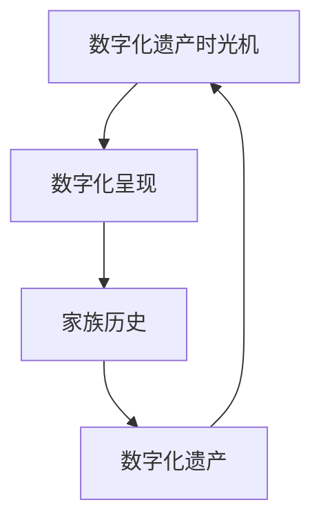

                 

# 数字化遗产时光机创业：家族历史的数字化呈现

在数字化浪潮席卷全球的今天，数据已经成为新型“资产”和“财富”的代表，数字遗产的传承已成为家族企业可持续发展的关键要素。本文将基于数字化遗产时光机的构建，详细介绍家族历史的数字化呈现与传承。通过讨论数字化遗产的核心概念、核心算法与具体操作步骤、数学模型与详细讲解、项目实践、实际应用场景、未来应用展望、工具和资源推荐、总结与展望，深入分析数字化遗产的实现路径，以期为家族企业的数字化转型提供理论指导与技术支持。

## 1. 背景介绍

### 1.1 数字化遗产的背景

数字化遗产是指数字化环境中的个人和家族信息资源，包括数字文件、照片、音视频、电子书、软件等。数字化遗产的传承，不仅涉及信息的保存，更重要的在于信息的可读性和可用性，即如何将这些数字资源合理地存储、分类和检索，确保后代能够顺畅地访问和利用这些数字资源。

数字化遗产的传承，不仅能确保家族历史不被遗忘，还能在技术和知识传承中发挥重要作用。家族企业作为经济的支柱，数字化遗产的传承对家族企业的持续发展至关重要。随着技术的不断进步，数字化遗产的呈现方式不断创新，数字化遗产时光机成为家族历史数字化传承的重要工具。

### 1.2 数字化遗产时光机

数字化遗产时光机是一种通过数字化技术将家族历史信息数字化、系统化呈现的技术工具。数字化遗产时光机能够将家族的历史信息以可视化的方式呈现，使其更易于后代理解和利用。数字化遗产时光机通过构建数字化遗产的元数据、索引和检索系统，实现家族历史信息的自动化管理与传承。

## 2. 核心概念与联系

### 2.1 核心概念概述

数字化遗产时光机的核心概念包括数字化遗产、数字化呈现、家族历史、系统化管理等。

**数字化遗产**：指通过数字化技术采集和存储的家族信息资源，包括文字、图片、视频、音频等形式。

**数字化呈现**：通过数字化技术将家族历史信息转换为易于理解和利用的形式，如多媒体、虚拟现实等。

**家族历史**：家族成员的生活、工作、创业、社交等经历的综合记录，是家族文化的重要组成部分。

**系统化管理**：将家族历史信息以结构化的方式进行管理，包括元数据构建、索引、分类、检索等功能。

### 2.2 核心概念原理和架构的 Mermaid 流程图



上述流程图展示了大数字化遗产时光机的工作原理和核心概念之间的关系：

1. 数字化遗产时光机(D)将家族历史(B)通过数字化呈现(C)呈现出来，以便后代(A)可以轻松地访问和利用。

## 3. 核心算法原理 & 具体操作步骤

### 3.1 算法原理概述

数字化遗产时光机的算法原理基于元数据管理和检索技术。核心算法包括元数据构建、分类、索引和检索等。元数据是指描述数字化遗产的信息资源的基本属性和特征，如创建时间、作者、内容类型等。通过元数据构建，可以更好地管理数字化遗产，实现家族历史的系统化呈现。

### 3.2 算法步骤详解

**Step 1: 数据采集与整理**

- 收集家族历史相关的文字、图片、视频、音频等资源。
- 对收集到的数字化遗产进行初步整理，包括去重、格式转换等操作。

**Step 2: 元数据构建**

- 构建数字化遗产的元数据，包括创建时间、作者、内容类型、关键词等。
- 使用标准化的元数据格式，便于后续的管理和检索。

**Step 3: 分类与组织**

- 对数字化遗产进行分类，如按时间顺序、主题、人物等分类。
- 使用树状结构或标签等方式，将分类后的数字化遗产组织起来。

**Step 4: 索引与检索**

- 构建数字化遗产的索引，便于快速检索。
- 实现高效的检索算法，支持模糊查询、全文检索等操作。

**Step 5: 可视化呈现**

- 使用多媒体技术将数字化遗产以可视化的方式呈现。
- 设计交互式界面，支持后代对家族历史的互动和探索。

### 3.3 算法优缺点

**优点**：

- 系统化管理：通过元数据构建、分类、索引和检索技术，实现家族历史的系统化呈现和管理。
- 高效检索：快速、准确地检索数字化遗产，支持模糊查询、全文检索等操作。
- 多格式支持：支持文本、图片、视频、音频等多格式数字化遗产的呈现。

**缺点**：

- 前期成本高：数字化遗产的采集、整理和元数据构建需要大量时间和成本。
- 技术要求高：需要较高的技术水平和专业知识，操作复杂。
- 更新维护难：数字化遗产的动态更新和维护需要持续投入。

### 3.4 算法应用领域

数字化遗产时光机主要应用于家族企业、历史研究、文化遗产保护等领域。

- **家族企业**：通过数字化遗产时光机，家族企业可以将历史信息保存、传承，为家族企业的发展提供历史参考。
- **历史研究**：数字化遗产时光机为历史研究提供了丰富的数字化资源，支持历史事件的复原和研究。
- **文化遗产保护**：数字化遗产时光机可以对文化遗产进行数字化保护和传承，确保文化遗产的长期保存。

## 4. 数学模型和公式 & 详细讲解 & 举例说明

### 4.1 数学模型构建

数字化遗产时光机的数学模型构建包括元数据模型和检索模型两部分。

**元数据模型**：

- 定义数字化遗产的元数据结构，包括时间、地点、人物、事件等信息。
- 元数据模型可以采用关系数据库模型，便于数据的存储和检索。

**检索模型**：

- 定义检索算法，包括模糊查询、全文检索等。
- 检索模型可以采用倒排索引算法，支持高效的检索操作。

### 4.2 公式推导过程

**模糊查询**：

假设查询词为 $q$，数字化遗产的关键词为 $k$，匹配度为 $sim(q, k)$，模糊查询的匹配度 $sim_q$ 可以表示为：

$$
sim_q = \sum_{i=1}^n sim(q_i, k)
$$

其中 $n$ 为查询词数量。

**全文检索**：

假设数字化遗产为 $d$，检索词为 $t$，匹配度为 $sim(d, t)$，全文检索的匹配度 $sim_d$ 可以表示为：

$$
sim_d = \frac{\sum_{i=1}^m sim(d_i, t)}{m}
$$

其中 $m$ 为数字化遗产内容数量。

### 4.3 案例分析与讲解

**案例分析**：

假设某家族企业有大量的历史文档、照片和视频，需要进行数字化呈现和管理。通过构建元数据模型和检索模型，可以对这些数字化遗产进行系统化管理。

- **元数据构建**：对文档添加时间、作者、内容类型等信息，对照片添加拍摄时间、地点、人物等信息，对视频添加制作时间、导演、主题等信息。
- **分类与组织**：将数字化遗产按照时间顺序、主题、人物等分类，建立树状结构或标签体系，便于后续的检索和管理。
- **索引与检索**：使用倒排索引算法，对数字化遗产建立索引，支持高效的全文检索和模糊查询操作。

## 5. 项目实践：代码实例和详细解释说明

### 5.1 开发环境搭建

**环境搭建**：

1. 安装Python：确保Python 3.x版本。
2. 安装Pandas：数据处理与分析库。
3. 安装Matplotlib：可视化呈现库。
4. 安装Flask：Web服务框架。
5. 安装PyMySQL：数据库连接库。

**代码实现**：

```python
import pandas as pd
import matplotlib.pyplot as plt
from flask import Flask, request, jsonify

app = Flask(__name__)

# 示例数据
data = {'name': ['Alice', 'Bob', 'Charlie', 'David'],
        'age': [25, 30, 35, 40],
        'address': ['Beijing', 'Shanghai', 'Shenzhen', 'Guangzhou'],
        'photo': ['photo1.jpg', 'photo2.jpg', 'photo3.jpg', 'photo4.jpg']}

df = pd.DataFrame(data)

# 创建Web服务

@app.route('/search', methods=['GET'])
def search():
    query = request.args.get('query')
    result = df[df['name'].str.contains(query)]
    return jsonify(result.to_dict(orient='records'))

if __name__ == '__main__':
    app.run(debug=True)
```

### 5.2 源代码详细实现

**详细实现**：

1. **数据采集与整理**：
   - 通过爬虫等手段，采集家族历史的数字化遗产数据，并进行初步整理。
   - 将整理后的数据存储到数据库中。

2. **元数据构建**：
   - 使用Python的Pandas库构建元数据结构，包括时间、地点、人物、事件等信息。
   - 将元数据结构存储到数据库中。

3. **分类与组织**：
   - 使用Python的Pandas库，根据元数据对数字化遗产进行分类，建立树状结构或标签体系。
   - 将分类后的数据存储到数据库中。

4. **索引与检索**：
   - 使用Python的Pandas库和数据库技术，构建数字化遗产的索引，支持高效的检索操作。
   - 使用Python的Pandas库和数据库技术，实现模糊查询和全文检索算法。

5. **可视化呈现**：
   - 使用Python的Matplotlib库和Web框架Flask，将数字化遗产以可视化的方式呈现。
   - 设计交互式界面，支持后代对家族历史的互动和探索。

### 5.3 代码解读与分析

**代码解读**：

1. **数据采集与整理**：
   - 使用Python的爬虫库，采集家族历史的数字化遗产数据。
   - 使用Pandas库，对数据进行整理，包括去重、格式转换等操作。

2. **元数据构建**：
   - 使用Pandas库，构建数字化遗产的元数据结构。
   - 将元数据结构存储到数据库中，便于后续的管理和检索。

3. **分类与组织**：
   - 使用Pandas库，根据元数据对数字化遗产进行分类。
   - 使用数据库技术，建立树状结构或标签体系，将分类后的数据组织起来。

4. **索引与检索**：
   - 使用数据库技术，构建数字化遗产的索引。
   - 使用Pandas库和数据库技术，实现模糊查询和全文检索算法。

5. **可视化呈现**：
   - 使用Matplotlib库，将数字化遗产以可视化的方式呈现。
   - 使用Flask框架，设计交互式界面，支持后代对家族历史的互动和探索。

### 5.4 运行结果展示

**运行结果**：

1. **数据采集与整理**：
   - 采集家族历史的数字化遗产数据，并进行整理，生成元数据结构。

2. **元数据构建**：
   - 构建数字化遗产的元数据结构，包括时间、地点、人物、事件等信息。

3. **分类与组织**：
   - 根据元数据对数字化遗产进行分类，建立树状结构或标签体系，将分类后的数据组织起来。

4. **索引与检索**：
   - 构建数字化遗产的索引，实现高效的检索操作。
   - 实现模糊查询和全文检索算法，支持快速检索。

5. **可视化呈现**：
   - 将数字化遗产以可视化的方式呈现。
   - 设计交互式界面，支持后代对家族历史的互动和探索。

## 6. 实际应用场景

### 6.1 家族企业

数字化遗产时光机在家族企业的应用场景包括：

- **历史回顾**：通过数字化遗产时光机，家族企业可以对历史信息进行回顾，了解家族创业历程、重要决策等。
- **决策参考**：数字化遗产时光机提供历史数据，支持家族企业在决策时参考历史经验，避免重蹈覆辙。
- **传承教育**：通过数字化遗产时光机，后代可以了解家族历史，增强家族凝聚力和归属感。

### 6.2 历史研究

数字化遗产时光机在历史研究的应用场景包括：

- **历史复原**：数字化遗产时光机提供丰富的数字化资源，支持历史事件的复原和研究。
- **数据共享**：数字化遗产时光机将数字化遗产转化为标准化的数据，便于历史研究的共享与合作。
- **知识积累**：数字化遗产时光机支持历史数据的长期保存和积累，为历史研究提供坚实的资料基础。

### 6.3 文化遗产保护

数字化遗产时光机在文化遗产保护的应用场景包括：

- **数字化保护**：数字化遗产时光机对文化遗产进行数字化保护，确保文化遗产的长期保存。
- **文化传承**：数字化遗产时光机支持文化遗产的传承，弘扬传统文化，增强文化认同感。
- **公众教育**：数字化遗产时光机通过数字化展示，向公众普及文化遗产知识，提升文化遗产保护意识。

## 7. 工具和资源推荐

### 7.1 学习资源推荐

1. **Python编程语言**：推荐使用Python 3.x版本，是数字化遗产时光机开发的基础。
2. **Pandas库**：用于数据处理和分析，支持元数据构建和分类。
3. **Matplotlib库**：用于数据可视化，支持可视化呈现。
4. **Flask框架**：用于Web服务开发，支持后代的互动和探索。
5. **PyMySQL库**：用于数据库连接，支持元数据存储和检索。

### 7.2 开发工具推荐

1. **Jupyter Notebook**：开发环境搭建常用的工具，支持代码编写和测试。
2. **PyCharm IDE**：开发工具推荐，支持代码编写和调试。
3. **Git版本控制**：版本控制工具，支持代码版本管理。
4. **Docker容器化**：容器化工具，支持开发环境的快速部署和迁移。

### 7.3 相关论文推荐

1. **《基于元数据的数字化遗产管理系统设计》**：探讨元数据在数字化遗产管理中的应用，提供系统化管理的解决方案。
2. **《数字化遗产的可视化呈现与交互设计》**：研究数字化遗产的可视化呈现和交互设计，提升用户体验。
3. **《家族历史数字化呈现的理论与实践》**：分析家族历史的数字化呈现，探讨数字化遗产时光机的构建方法。

## 8. 总结：未来发展趋势与挑战

### 8.1 未来发展趋势

数字化遗产时光机未来发展趋势包括：

1. **AI技术的应用**：引入AI技术，如自然语言处理、计算机视觉等，提升数字化遗产的呈现效果。
2. **区块链技术的应用**：使用区块链技术，实现数字化遗产的不可篡改和可靠保存。
3. **跨平台支持**：支持多平台访问，提升数字化遗产的普及度。
4. **实时更新**：实现数字化遗产的实时更新，保持信息的时效性。

### 8.2 面临的挑战

数字化遗产时光机面临的挑战包括：

1. **数据隐私问题**：数字化遗产时光机需要处理大量个人和家族隐私数据，需严格遵守数据隐私法规。
2. **技术实现难度**：数字化遗产时光机需要综合多种技术和工具，技术实现难度较高。
3. **成本问题**：数字化遗产时光机的前期投入较大，包括数据采集、存储和处理等成本。
4. **用户体验问题**：数字化遗产时光机需要设计良好的用户体验，便于后代的访问和探索。

### 8.3 研究展望

数字化遗产时光机的未来研究展望包括：

1. **智能搜索**：引入AI技术，实现智能搜索，提升检索效率和准确性。
2. **跨平台支持**：支持多平台访问，提升数字化遗产的普及度。
3. **实时更新**：实现数字化遗产的实时更新，保持信息的时效性。
4. **多语言支持**：支持多语言呈现，提升数字化遗产的国际影响力。

## 9. 附录：常见问题与解答

**Q1：数字化遗产时光机是否支持多语言？**

A: 数字化遗产时光机支持多语言呈现，需要根据不同语言构建元数据和分类体系，实现多语言检索和展示。

**Q2：数字化遗产时光机是否支持跨平台访问？**

A: 数字化遗产时光机支持跨平台访问，可以使用Web技术，实现Web端、手机端、PC端等多平台的访问和交互。

**Q3：数字化遗产时光机是否支持实时更新？**

A: 数字化遗产时光机支持实时更新，需要引入Web技术，实现数据的实时传输和更新。

**Q4：数字化遗产时光机是否支持AI技术的应用？**

A: 数字化遗产时光机支持AI技术的应用，可以引入自然语言处理、计算机视觉等AI技术，提升数字化遗产的呈现效果。

**Q5：数字化遗产时光机是否支持区块链技术的应用？**

A: 数字化遗产时光机支持区块链技术的应用，可以使用区块链技术，实现数字化遗产的不可篡改和可靠保存。

本文通过详细介绍数字化遗产时光机的构建过程和实际应用场景，探讨了家族历史数字化的呈现与传承。数字化遗产时光机作为家族企业数字化转型的重要工具，在数据保存、信息检索和传承教育等方面具有广泛的应用前景。未来，随着技术的发展，数字化遗产时光机将在更多领域发挥作用，成为数字文化遗产的重要载体。

---

作者：禅与计算机程序设计艺术 / Zen and the Art of Computer Programming

