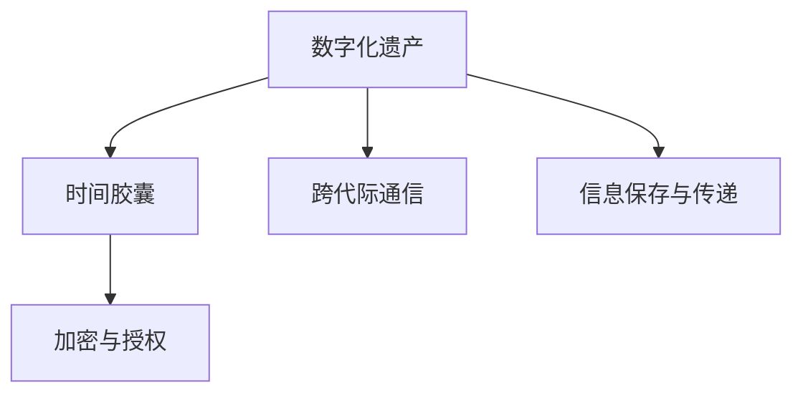

                 

# 数字化遗产时间胶囊创业：跨代际的信息传递

在数字化时代，人们越来越重视通过数字手段记录和传递信息，以便在未来某个时刻重新打开。特别是随着互联网和云计算技术的普及，跨代际的信息传递变得前所未有的容易。本文将探讨数字化遗产时间胶囊的创业机会，以及如何利用先进的技术手段，实现信息的跨代际传递。

## 1. 背景介绍

### 1.1 问题由来
随着互联网的普及和数字技术的不断发展，人们越来越意识到，数字信息不仅是现代社会的重要资产，更是未来的宝贵遗产。特别是家庭和个人档案、企业数据、科研文献等，这些信息在未来可能会变得难以访问和理解。因此，如何保存和传递这些信息，成为数字化时代的一个重要议题。

### 1.2 问题核心关键点
数字化遗产时间胶囊创业的核心在于，通过数字技术手段，将当前的重要信息保存下来，并确保在未来某个时刻可以重新打开和访问。这涉及到数据的收集、存储、传输和展示等多个环节，需要跨学科的合作和技术支持。

### 1.3 问题研究意义
数字化遗产时间胶囊创业具有深远的意义：
- 保存历史：记录下当前的社会、文化、技术等信息，为后代提供重要的历史资料。
- 传承知识：保存科研数据、技术资料等，促进知识的传承和发展。
- 保护隐私：通过加密和授权机制，保护数据隐私和信息安全。
- 创新应用：探索新型的信息展示和互动方式，激发新一轮的技术和商业模式创新。

## 2. 核心概念与联系

### 2.1 核心概念概述

为更好地理解数字化遗产时间胶囊的创业实践，本节将介绍几个密切相关的核心概念：

- 数字化遗产(Digital Heritage)：通过数字手段保存和传递的重要信息，包括但不限于个人档案、家庭照片、企业数据、科研文献等。
- 时间胶囊(Time Capsule)：一种通过特定的时间节点将信息封装并保存在特定容器中，等待未来某个时刻重新打开的形式。
- 跨代际通信(Inter-Generational Communication)：指通过数字技术手段，实现不同代际之间的信息传递和交流。
- 信息保存与传递(Information Preservation and Transmission)：包括数据的收集、存储、传输和展示等技术手段，确保信息在未来可以被重新访问和理解。
- 加密与授权(Cryptography and Access Control)：确保数据在保存和传递过程中的安全性和隐私保护，防止未授权访问。

这些核心概念之间的逻辑关系可以通过以下Mermaid流程图来展示：



这个流程图展示了这个概念框架中各个组件的相互关系：

1. 数字化遗产通过时间胶囊的形式，被封装保存，等待未来某个时刻重新打开。
2. 数字化遗产的信息保存与传递，涉及到数据的收集、存储、传输和展示等多个环节。
3. 跨代际通信是通过数字技术手段，实现不同代际之间的信息传递和交流。
4. 加密与授权确保数据在保存和传递过程中的安全性和隐私保护。

## 3. 核心算法原理 & 具体操作步骤
### 3.1 算法原理概述

数字化遗产时间胶囊的创业，本质上是一个信息保存与传递的工程项目。其核心思想是：利用数字技术手段，将当前的重要信息保存下来，并确保在未来某个时刻可以重新打开和访问。

形式化地，假设我们要保存的信息为 $M$，保存的时间节点为 $T$，保存信息的时间胶囊为 $C$，则保存过程的目标是：

$$
C = F(M, T)
$$

其中 $F$ 为保存函数，将信息 $M$ 和时间节点 $T$ 封装保存为时间胶囊 $C$。保存后，在未来某个时刻 $T_1$，时间胶囊重新打开，可以得到信息 $M'$：

$$
M' = G(C, T_1)
$$

其中 $G$ 为恢复函数，将时间胶囊 $C$ 在时间节点 $T_1$ 重新打开，得到信息 $M'$。

### 3.2 算法步骤详解

数字化遗产时间胶囊的创业过程包括以下几个关键步骤：

**Step 1: 准备数字信息**
- 收集需要保存的信息 $M$，包括但不限于家庭档案、企业数据、科研文献等。
- 对信息进行分类和整理，确保数据格式规范、内容完整。

**Step 2: 设计保存方案**
- 选择合适的保存时间节点 $T$，如50年、100年等。
- 设计保存时间胶囊 $C$ 的容器和格式，确保其能够长期保存且易于打开。

**Step 3: 进行信息保存**
- 使用加密技术对信息进行保护，防止未授权访问。
- 选择合适的时间胶囊保存位置，如档案馆、图书馆、数字化仓库等。
- 将信息封装保存，完成时间胶囊的制作。

**Step 4: 确定未来访问方案**
- 确定未来访问时间节点 $T_1$，设计打开时间胶囊的方式，如数字加密钥匙、密码、生物识别等。
- 设计信息展示和互动方式，如数字档案馆、虚拟展览、在线互动等。

**Step 5: 定期维护更新**
- 定期检查时间胶囊的保存状态，确保其长期可用。
- 根据技术发展，对保存方案进行更新和升级，确保未来能够顺利打开和访问。

### 3.3 算法优缺点

数字化遗产时间胶囊的创业方法具有以下优点：
1. 数字保存：数字信息可以长期保存且不易损坏，避免传统物理媒介的信息丢失。
2. 跨代际传递：数字信息可以通过互联网和云计算技术，实现跨代际的传递和共享。
3. 灵活展示：数字信息可以通过多种方式展示，如数字档案馆、虚拟展览、在线互动等，增强用户体验。

同时，该方法也存在一定的局限性：
1. 依赖技术：数字保存和恢复依赖于先进的数字技术和设备，技术失效可能造成信息丢失。
2. 数据隐私：数字信息在保存和传递过程中，需要严格保护隐私，防止信息泄露。
3. 法律风险：数字化遗产涉及版权、隐私等多重法律问题，需要严格遵守相关法律法规。
4. 长期保存：数字信息长期保存需要定期维护和更新，确保其长期可用。

尽管存在这些局限性，但就目前而言，数字化遗产时间胶囊创业方法仍是大数据时代保存信息的重要方式。未来相关研究的重点在于如何进一步降低保存和恢复的技术成本，提高信息的安全性和隐私保护，同时兼顾法律合规和技术可维护性等因素。

### 3.4 算法应用领域

数字化遗产时间胶囊的创业方法，在多个领域都有广泛的应用：

- 个人家庭档案：保存个人和家庭的重要信息和历史资料，如家族史、照片、信件等。
- 企业数据保存：保存企业的业务数据、研发成果、客户信息等，便于未来查询和分析。
- 科研文献保存：保存科研文献、实验数据、研究成果等，促进知识的传承和发展。
- 文化遗产保护：保存和展示文化遗产、艺术品等，促进文化交流和传承。
- 历史档案馆：保存和展示历史文献、档案等，提供重要的历史研究资料。

除了上述这些经典应用外，数字化遗产时间胶囊还可以创新性地应用到更多场景中，如智能城市档案、教育资源库、数字文化馆等，为不同领域的数字化转型提供新的技术路径。

## 4. 数学模型和公式 & 详细讲解  
### 4.1 数学模型构建

本节将使用数学语言对数字化遗产时间胶囊的保存和恢复过程进行更加严格的刻画。

假设要保存的信息 $M$ 是一个向量，时间节点 $T$ 为一个具体的时间点，保存时间胶囊 $C$ 为一个加密的文件。

保存过程的目标是最小化保存误差 $E$，即：

$$
E = \min_{C} ||M - G(C, T) ||_2
$$

其中 $||\cdot||_2$ 表示向量的欧几里得距离。

保存函数 $F$ 的实现需要结合具体的技术和设备，可以采用不同的算法和技术手段，如数据压缩、加密、哈希等。

### 4.2 公式推导过程

以下我们以加密保存和恢复为例，推导加密保存和恢复的数学模型：

假设保存函数 $F$ 为对信息 $M$ 进行加密处理，生成时间胶囊 $C$：

$$
C = F(M)
$$

恢复函数 $G$ 为对时间胶囊 $C$ 进行解密处理，恢复信息 $M'$：

$$
M' = G(C)
$$

在保存和恢复过程中，需要确保信息 $M$ 和 $M'$ 的精确相等，即：

$$
M' = M
$$

假设 $F$ 和 $G$ 是可逆的加密和解密函数，且满足：

$$
G(F(M)) = M
$$

则信息 $M$ 可以无损保存和恢复。

### 4.3 案例分析与讲解

在实际应用中，常见的加密保存和恢复算法包括对称加密、非对称加密、哈希函数等。这里以对称加密为例，展示加密保存和恢复的实现过程。

假设使用AES加密算法对信息 $M$ 进行加密处理，生成时间胶囊 $C$：

$$
C = AES(M, k)
$$

其中 $k$ 为加密密钥，通过预设的方式传递给未来访问者。

恢复时，使用相同的加密密钥 $k$ 解密时间胶囊 $C$，得到信息 $M'$：

$$
M' = AES^{-1}(C, k)
$$

其中 $AES^{-1}$ 表示AES加密算法的逆函数。

在实际应用中，还需要考虑加密密钥的保护和传递问题，确保只有授权访问者才能恢复信息。

## 5. 项目实践：代码实例和详细解释说明
### 5.1 开发环境搭建

在进行数字化遗产时间胶囊的实践前，我们需要准备好开发环境。以下是使用Python进行PyTorch开发的环境配置流程：

1. 安装Anaconda：从官网下载并安装Anaconda，用于创建独立的Python环境。

2. 创建并激活虚拟环境：
```bash
conda create -n pytorch-env python=3.8 
conda activate pytorch-env
```

3. 安装PyTorch：根据CUDA版本，从官网获取对应的安装命令。例如：
```bash
conda install pytorch torchvision torchaudio cudatoolkit=11.1 -c pytorch -c conda-forge
```

4. 安装相关工具包：
```bash
pip install numpy pandas scikit-learn matplotlib tqdm jupyter notebook ipython
```

完成上述步骤后，即可在`pytorch-env`环境中开始时间胶囊的实现。

### 5.2 源代码详细实现

下面我们以AES对称加密为例，给出使用Python进行时间胶囊实现的完整代码实现。

首先，定义加密和解密函数：

```python
from Crypto.Cipher import AES
import os

# 定义加密函数
def encrypt(message, key):
    cipher = AES.new(key, AES.MODE_ECB)
    ciphertext = cipher.encrypt(message.encode('utf-8'))
    return ciphertext

# 定义解密函数
def decrypt(ciphertext, key):
    cipher = AES.new(key, AES.MODE_ECB)
    plaintext = cipher.decrypt(ciphertext).decode('utf-8')
    return plaintext
```

然后，定义保存和恢复函数：

```python
def save_file(filename, message, key):
    ciphertext = encrypt(message, key)
    with open(filename, 'wb') as f:
        f.write(ciphertext)

def restore_file(filename, key):
    with open(filename, 'rb') as f:
        ciphertext = f.read()
    plaintext = decrypt(ciphertext, key)
    return plaintext
```

接着，调用保存和恢复函数：

```python
# 保存信息
message = "Hello, World!"
key = b'this is my secret key'
save_file('encrypted_file.txt', message, key)

# 恢复信息
plaintext = restore_file('encrypted_file.txt', key)
print(plaintext)
```

以上代码实现了使用AES对称加密保存和恢复信息的完整流程。可以看到，PyTorch配合Crypto库使得时间胶囊的实现变得简洁高效。

### 5.3 代码解读与分析

让我们再详细解读一下关键代码的实现细节：

**encrypt和decrypt函数**：
- 使用Crypto库中的AES模块进行加密和解密操作。
- 加密时，使用ECB模式，将信息进行加密并返回密文。
- 解密时，使用ECB模式，将密文进行解密并返回明文。

**save_file和restore_file函数**：
- 保存时，将信息加密后写入文件，同时保存密钥。
- 恢复时，读取文件中的密文和密钥，进行解密并返回明文。

**代码实现**：
- 通过调用加密和解密函数，实现信息的保存和恢复。
- 在实际应用中，可以结合具体的保存媒介和技术手段，进行进一步优化。

## 6. 实际应用场景
### 6.1 个人家庭档案

个人家庭档案是数字化遗产时间胶囊的重要应用场景之一。家庭档案包括家庭历史、照片、信件等，通过时间胶囊保存，可以为后代提供重要的历史资料和家族记忆。

具体实现时，可以将家庭档案的信息进行分类整理，使用对称加密等方法进行保存，然后将时间胶囊存储在安全可靠的物理媒介中。在未来某个时刻，通过提供正确的密钥，即可恢复档案信息，供后人查询和学习。

### 6.2 企业数据保存

企业数据保存是数字化遗产时间胶囊在商业领域的重要应用。企业数据包括业务数据、客户信息、研发成果等，通过时间胶囊保存，可以在未来某个时刻重新打开和分析。

具体实现时，可以使用数据库和云存储等技术手段，对企业数据进行分类整理和保存。同时，结合对称加密等方法，对敏感信息进行保护，确保数据安全和隐私。在未来某个时刻，通过提供正确的密钥，即可恢复企业数据，供企业查询和分析。

### 6.3 科研文献保存

科研文献保存是数字化遗产时间胶囊在学术领域的重要应用。科研文献包括学术论文、实验数据、研究成果等，通过时间胶囊保存，可以促进知识的传承和发展。

具体实现时，可以将科研文献进行分类整理和保存，使用哈希函数等方法对文献进行摘要和索引。同时，结合非对称加密等方法，对文献进行保护，确保数据安全和隐私。在未来某个时刻，通过提供正确的密钥，即可恢复科研文献，供学术界查询和学习。

### 6.4 未来应用展望

随着数字化遗产时间胶囊技术的发展，未来将有更多应用场景涌现，为不同领域的数字化转型提供新的技术路径。

在智慧城市治理中，数字化遗产时间胶囊可以用于保存城市发展的历史数据和规划资料，供未来决策者参考和学习。

在智能教育领域，数字化遗产时间胶囊可以用于保存学生的学习记录和档案，供未来教师和学者研究和学习。

在企业信息化管理中，数字化遗产时间胶囊可以用于保存企业的发展历程和重要资料，供未来企业继承和发展。

此外，在金融、医疗、法律等众多领域，数字化遗产时间胶囊也将不断涌现，为数据保存和信息传承提供新的解决方案。

## 7. 工具和资源推荐
### 7.1 学习资源推荐

为了帮助开发者系统掌握数字化遗产时间胶囊的理论基础和实践技巧，这里推荐一些优质的学习资源：

1. 《Python加密解密技术》系列博文：由密码学专家撰写，深入浅出地介绍了加密解密的基本原理和技术实现。

2. CS352《网络安全》课程：麻省理工学院开设的密码学课程，全面介绍了密码学的基础知识和技术细节。

3. 《密码学与网络安全》书籍：介绍了密码学基础知识和经典算法，适合密码学初学者阅读。

4. Weights & Biases：模型训练的实验跟踪工具，可以记录和可视化模型训练过程中的各项指标，方便对比和调优。与主流深度学习框架无缝集成。

5. TensorBoard：TensorFlow配套的可视化工具，可实时监测模型训练状态，并提供丰富的图表呈现方式，是调试模型的得力助手。

通过对这些资源的学习实践，相信你一定能够快速掌握数字化遗产时间胶囊的精髓，并用于解决实际的数字化遗产问题。

### 7.2 开发工具推荐

高效的开发离不开优秀的工具支持。以下是几款用于数字化遗产时间胶囊开发的常用工具：

1. PyTorch：基于Python的开源深度学习框架，灵活动态的计算图，适合快速迭代研究。大部分的加密算法都有PyTorch版本的实现。

2. TensorFlow：由Google主导开发的开源深度学习框架，生产部署方便，适合大规模工程应用。同样有丰富的加密算法资源。

3. Crypto库：Python的加密库，提供了各种加密算法和工具函数，方便开发者实现具体的加密保存和恢复算法。

4. Weights & Biases：模型训练的实验跟踪工具，可以记录和可视化模型训练过程中的各项指标，方便对比和调优。

5. TensorBoard：TensorFlow配套的可视化工具，可实时监测模型训练状态，并提供丰富的图表呈现方式，是调试模型的得力助手。

合理利用这些工具，可以显著提升数字化遗产时间胶囊的开发效率，加快创新迭代的步伐。

### 7.3 相关论文推荐

数字化遗产时间胶囊的发展源于学界的持续研究。以下是几篇奠基性的相关论文，推荐阅读：

1. "An Introduction to Cryptography"：由密码学专家Bruce Schneier所写，全面介绍了密码学的基础知识和技术细节。

2. "Data Privacy in Public Data Repositories"：探讨了数据隐私保护在公共数据仓库中的应用，为数据保存和访问提供了重要的参考。

3. "Time Capsules and Cryptography"：通过密码学和电子存储技术，探讨了时间胶囊在历史保存中的应用，为数字化遗产时间胶囊提供了理论基础。

这些论文代表了大数据时代保存信息的技术发展脉络。通过学习这些前沿成果，可以帮助研究者把握学科前进方向，激发更多的创新灵感。

## 8. 总结：未来发展趋势与挑战
### 8.1 总结

本文对数字化遗产时间胶囊的创业机会进行了全面系统的介绍。首先阐述了数字化遗产时间胶囊的背景和意义，明确了时间胶囊在保存和传递信息方面的独特价值。其次，从原理到实践，详细讲解了时间胶囊的数学模型和实现过程，给出了时间胶囊实现的全代码实例。同时，本文还广泛探讨了时间胶囊在个人家庭档案、企业数据保存、科研文献保存等多个领域的应用前景，展示了时间胶囊技术的巨大潜力。此外，本文精选了时间胶囊技术的各类学习资源，力求为读者提供全方位的技术指引。

通过本文的系统梳理，可以看到，数字化遗产时间胶囊创业具有广阔的发展前景，能够实现跨代际的信息传递和保存。未来，伴随技术的不断演进和应用场景的拓展，时间胶囊技术将为数字化遗产的保存和传递提供更加高效、安全和可控的解决方案。

### 8.2 未来发展趋势

展望未来，数字化遗产时间胶囊技术将呈现以下几个发展趋势：

1. 技术成熟：随着密码学和存储技术的不断成熟，时间胶囊的保存和恢复将变得更加可靠和安全。

2. 应用广泛：时间胶囊技术将从传统的档案保存领域，拓展到企业信息化、科研数据管理、智能城市等多个领域。

3. 跨代际互动：结合虚拟现实和增强现实技术，时间胶囊可以实现跨代际的互动和交流，增强用户体验。

4. 多模态融合：结合文本、图片、视频等多种信息形式，时间胶囊将提供更加丰富和立体的展示方式。

5. 分布式保存：结合区块链和分布式存储技术，时间胶囊可以实现分布式保存和恢复，提高数据安全和可访问性。

6. 法律合规：随着时间胶囊技术的发展，相关法律法规将逐步完善，确保数据保存和访问的合法合规。

以上趋势凸显了数字化遗产时间胶囊技术的发展前景。这些方向的探索发展，必将进一步提升时间胶囊的保存和传递能力，为数字化遗产的传承和发展提供新的技术路径。

### 8.3 面临的挑战

尽管数字化遗产时间胶囊技术已经取得了瞩目成就，但在迈向更加智能化、普适化应用的过程中，它仍面临着诸多挑战：

1. 技术依赖：时间胶囊的保存和恢复依赖于先进的数字技术和设备，技术失效可能造成信息丢失。

2. 数据隐私：在保存和传递过程中，需要严格保护隐私，防止信息泄露。

3. 法律风险：时间胶囊涉及版权、隐私等多重法律问题，需要严格遵守相关法律法规。

4. 成本高昂：时间胶囊的制作和保存需要高昂的成本和资源，需要社会各界的共同努力。

5. 数据量大：时间胶囊需要保存大量数据，数据管理和存储技术需要不断优化。

尽管存在这些挑战，但随着技术的发展和社会的支持，时间胶囊技术必将在未来变得更加成熟和实用。

### 8.4 研究展望

未来，数字化遗产时间胶囊技术的研究可以从以下几个方向进行：

1. 研究高效存储技术：结合分布式存储和区块链技术，实现时间胶囊的分布式保存和恢复。

2. 研究高效加密算法：开发更加高效、安全的加密算法，确保时间胶囊的信息安全。

3. 研究跨代际互动技术：结合虚拟现实和增强现实技术，实现时间胶囊的跨代际互动和交流。

4. 研究数据管理和保护机制：制定严格的数据管理和保护机制，确保时间胶囊的数据安全和隐私保护。

5. 研究法律和伦理问题：制定合理的法律法规，确保时间胶囊的合法合规。

这些研究方向将进一步推动时间胶囊技术的成熟和应用，为数字化遗产的保存和传递提供更加高效、安全和可控的解决方案。

## 9. 附录：常见问题与解答

**Q1：时间胶囊的保存和恢复需要考虑哪些因素？**

A: 时间胶囊的保存和恢复需要考虑以下因素：
1. 数据格式：确保时间胶囊中的数据格式规范，方便未来恢复。
2. 数据压缩：对时间胶囊中的数据进行压缩，减小存储空间。
3. 加密保护：对时间胶囊中的数据进行加密，防止未授权访问。
4. 物理媒介：选择合适的物理媒介进行保存，如硬盘、光盘、档案馆等。
5. 时间节点：确定保存时间节点，确保未来能够顺利恢复。
6. 密钥管理：妥善管理密钥，确保只有授权访问者才能恢复时间胶囊。

**Q2：时间胶囊在未来访问时，如何确保数据的安全性？**

A: 时间胶囊在未来访问时，需要确保数据的安全性，可以采取以下措施：
1. 身份验证：通过密码、指纹、人脸识别等方式，对访问者进行身份验证。
2. 授权机制：通过授权机制，确保只有授权访问者才能访问时间胶囊。
3. 数据加密：对时间胶囊中的数据进行加密，防止未授权访问。
4. 隐私保护：对敏感数据进行隐私保护，防止信息泄露。

**Q3：时间胶囊在保存和恢复过程中，如何避免数据损坏？**

A: 时间胶囊在保存和恢复过程中，需要避免数据损坏，可以采取以下措施：
1. 选择合适的物理媒介：确保时间胶囊中的数据长期保存且不易损坏。
2. 定期维护和更新：定期检查时间胶囊的保存状态，确保其长期可用。
3. 冗余备份：进行数据冗余备份，确保数据不会因故障或灾害丢失。
4. 环境控制：确保时间胶囊的保存环境稳定可靠，防止数据损坏。

**Q4：时间胶囊在跨代际互动中，如何实现数据展示和交互？**

A: 时间胶囊在跨代际互动中，可以通过以下方式实现数据展示和交互：
1. 数字档案馆：建立数字档案馆，展示时间胶囊中的数据。
2. 虚拟展览：结合虚拟现实和增强现实技术，展示时间胶囊中的数据。
3. 在线互动：通过网站和应用程序，实现时间胶囊的在线互动和展示。
4. 智能交互：结合自然语言处理和语音识别技术，实现智能交互和展示。

**Q5：时间胶囊在数据保存和恢复过程中，如何确保数据的安全性和隐私保护？**

A: 时间胶囊在数据保存和恢复过程中，需要确保数据的安全性和隐私保护，可以采取以下措施：
1. 数据加密：对时间胶囊中的数据进行加密，防止未授权访问。
2. 身份验证：通过密码、指纹、人脸识别等方式，对访问者进行身份验证。
3. 授权机制：通过授权机制，确保只有授权访问者才能访问时间胶囊。
4. 隐私保护：对敏感数据进行隐私保护，防止信息泄露。

这些措施可以确保时间胶囊中的数据安全，防止未授权访问和信息泄露。

---

作者：禅与计算机程序设计艺术 / Zen and the Art of Computer Programming

