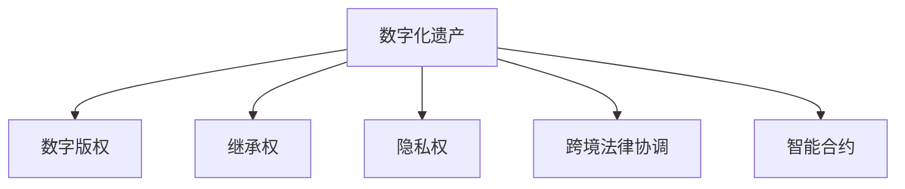

                 

## 1. 背景介绍

数字化遗产的法律保护是一个新兴且具有前瞻性的议题。随着数字化时代的到来，个人和企业越来越多地在线存储和管理其数字资产，包括照片、视频、文档、软件代码、知识产权等。这些数字资产不仅记录了个人和企业的历史，也构成了重要的财产权益。然而，与传统的物理遗产相比，数字资产的法律保护面临更多的挑战和复杂性。

### 1.1 问题由来

数字化遗产的法律保护涉及多个层面的问题，包括但不限于：

- **数字版权问题**：数字资产的版权归属和保护。
- **继承权问题**：数字遗产的继承和分配。
- **隐私保护问题**：数字遗产的隐私权保护和数据访问权限。
- **跨境法律问题**：不同国家和地区的法律差异导致的跨境遗产管理复杂性。

### 1.2 问题核心关键点

数字化遗产的法律保护涉及以下几个核心关键点：

1. **数字版权法**：确保数字资产的创作者和持有者享有相应的版权保护。
2. **继承法**：规定数字资产的继承方式和权利分配。
3. **隐私法**：保护数字资产的隐私权，限制未经授权的访问和使用。
4. **跨境法律协调**：不同国家和地区法律差异下的数字遗产跨境管理。
5. **智能合约**：利用区块链和智能合约技术实现数字资产的法律自动执行和管理。

这些关键点共同构成了数字化遗产法律保护的基础框架，需要通过法律、技术和政策手段加以解决。

## 2. 核心概念与联系

### 2.1 核心概念概述

为更好地理解数字化遗产法律保护，本节将介绍几个关键概念：

- **数字化遗产(Digital Estate)**：指个人或企业在数字化时代生成的所有数字资产，包括但不限于个人数据、数字文档、软件代码、知识产权等。
- **数字版权(Digital Copyright)**：对数字作品（如软件、音乐、电影等）的权利保护，包括复制权、发行权、出租权等。
- **继承权(Inheritance Rights)**：个人或企业在死亡后，其数字资产的继承和分配问题。
- **隐私权(Privacy Rights)**：保护个人数字资产的隐私，限制未经授权的访问和使用。
- **跨境法律协调(Cross-Border Legal Coordination)**：在跨境背景下，不同国家和地区的法律适用和冲突解决。
- **智能合约(Smart Contracts)**：利用区块链技术，实现数字资产的自动化管理和法律执行。

这些核心概念之间的逻辑关系可以通过以下Mermaid流程图来展示：



这个流程图展示了数字化遗产与其他法律概念的联系，凸显了其保护过程中涉及的多重法律维度。

## 3. 核心算法原理 & 具体操作步骤

### 3.1 算法原理概述

数字化遗产的法律保护涉及多个层面的算法设计，包括但不限于：

- **数据加密算法**：用于保护数字资产的隐私和安全。
- **数字版权管理算法**：确保数字资产的版权归属和保护。
- **智能合约算法**：利用区块链技术实现数字资产的自动化管理和法律执行。
- **法律信息检索算法**：用于在数字化遗产中查找相关法律信息和文件。

### 3.2 算法步骤详解

数字化遗产的法律保护通常包括以下几个关键步骤：

**Step 1: 数据收集与整理**

- 收集所有数字化遗产，包括个人数据、数字文档、软件代码、知识产权等。
- 对数字资产进行分类和整理，确定其版权归属和隐私保护等级。

**Step 2: 法律合规评估**

- 评估数字资产的法律合规性，包括版权保护、隐私权保护等。
- 根据法律规定，确定数字资产的继承方式和权利分配。

**Step 3: 数据加密与访问控制**

- 对敏感数字资产进行加密，确保其安全性和隐私性。
- 设计访问控制机制，限制未经授权的访问和使用。

**Step 4: 智能合约设计与执行**

- 设计智能合约，明确数字资产的继承权、版权归属等法律条款。
- 利用区块链技术，实现智能合约的自动执行和管理。

**Step 5: 法律争议解决**

- 当发生法律争议时，通过智能合约和法律信息检索算法，快速定位相关法律信息和文件。
- 依据智能合约条款和法律规定，自动解决争议或提交仲裁和诉讼。

### 3.3 算法优缺点

数字化遗产的法律保护算法具有以下优点：

- **自动化和高效性**：通过智能合约和区块链技术，实现数字资产的法律自动执行和管理，提高效率。
- **隐私保护**：利用数据加密和访问控制算法，确保数字资产的隐私和安全。
- **法律合规性**：通过法律合规评估算法，确保数字资产的法律合规性，避免法律风险。

同时，该算法也存在一定的局限性：

- **技术依赖性**：对智能合约和区块链技术有较高依赖，技术复杂度较高。
- **法律适用性**：不同国家和地区的法律差异可能导致跨境法律协调的复杂性。
- **成本高**：设计和实现智能化保护系统，涉及较高的技术开发和维护成本。

尽管存在这些局限性，但就目前而言，基于数字化遗产的法律保护算法仍是大数据和法律领域的一个重要方向。未来相关研究的重点在于如何进一步降低技术成本，提高法律适用性，同时兼顾隐私保护和效率提升。

### 3.4 算法应用领域

数字化遗产的法律保护算法在多个领域得到了应用，包括但不限于：

- **个人数据保护**：通过数据加密和访问控制算法，保护个人隐私数据。
- **知识产权管理**：利用数字版权管理算法，确保软件代码和知识产权的版权归属和保护。
- **企业数据管理**：设计和实施企业数字资产的法律保护系统，提升数据安全性和合规性。
- **遗产规划与管理**：通过智能合约和法律信息检索算法，实现数字遗产的继承和管理。

这些应用展示了数字化遗产的法律保护算法的多样性和广泛性，为数字化时代的法律保护提供了新的解决方案。

## 4. 数学模型和公式 & 详细讲解 & 举例说明

### 4.1 数学模型构建

本节将使用数学语言对数字化遗产的法律保护算法进行更加严格的刻画。

记数字化遗产为 $E$，其法律合规性为 $L$，数字资产的隐私权为 $P$，数字资产的版权为 $C$，智能合约为 $S$。则数字化遗产的法律保护模型可定义为：

$$
E(L,P,C,S) = \max_{\theta} \{L(\theta), P(\theta), C(\theta), S(\theta)\}
$$

其中 $\theta$ 为法律保护算法的参数，包括数据加密参数、智能合约参数等。

### 4.2 公式推导过程

以下我们以数据加密算法为例，推导其在数字化遗产保护中的具体应用。

假设数字化遗产 $E$ 包含敏感数据 $D$，需要对其进行加密保护。记加密后的数据为 $D_{\text{encrypted}}$，其解密密钥为 $K$。数据加密算法的目标是最小化解密难度，即：

$$
\min_{K} \text{decrypt}(D_{\text{encrypted}}, K)
$$

其中 $\text{decrypt}$ 表示解密过程。

### 4.3 案例分析与讲解

考虑一个电子商务平台的用户数据保护案例。用户注册时，平台记录了其姓名、地址、购买历史等敏感信息。为了保护这些数据，平台采用了数据加密算法，确保只有平台管理员和用户本人才能访问和解密数据。具体实现步骤如下：

1. **数据分类**：根据敏感程度，将用户数据分为高、中、低三个等级，不同等级的数据采用不同的加密强度。
2. **加密算法选择**：选择AES、RSA等常用的加密算法，确保数据的安全性。
3. **密钥管理**：生成和管理加密密钥，确保密钥的安全存储和访问控制。
4. **解密机制设计**：设计解密机制，确保只有授权用户和管理员才能解密数据。
5. **审计与监控**：对数据访问进行审计和监控，确保数据的合法使用和权限管理。

通过以上步骤，平台能够有效保护用户数据的隐私权，防止未经授权的访问和使用。

## 5. 项目实践：代码实例和详细解释说明

### 5.1 开发环境搭建

在进行数字化遗产法律保护项目开发前，我们需要准备好开发环境。以下是使用Python进行PyTorch开发的环境配置流程：

1. 安装Anaconda：从官网下载并安装Anaconda，用于创建独立的Python环境。

2. 创建并激活虚拟环境：
```bash
conda create -n digital-estate python=3.8 
conda activate digital-estate
```

3. 安装PyTorch：根据CUDA版本，从官网获取对应的安装命令。例如：
```bash
conda install pytorch torchvision torchaudio cudatoolkit=11.1 -c pytorch -c conda-forge
```

4. 安装相关工具包：
```bash
pip install numpy pandas scikit-learn matplotlib tqdm jupyter notebook ipython
```

完成上述步骤后，即可在`digital-estate`环境中开始开发实践。

### 5.2 源代码详细实现

这里我们以智能合约为例，给出使用Python进行数字化遗产法律保护项目的代码实现。

首先，定义智能合约的基本结构：

```python
from py_crypto钞票 import SHA256
from py_crypto钞票 import ECDSA
from py_crypto钞票 import PK

class SmartContract:
    def __init__(self, public_key, private_key):
        self.public_key = public_key
        self.private_key = private_key
        self.balance = 0
    
    def sign(self, message):
        hash = SHA256(message).digest()
        signature = ECDSA.sign(hash, self.private_key)
        return signature
    
    def verify(self, message, signature):
        hash = SHA256(message).digest()
        return ECDSA.verify(hash, signature, self.public_key)
    
    def transfer(self, amount):
        if self.balance >= amount:
            self.balance -= amount
            return True
        else:
            return False
```

然后，定义数字化遗产的法律保护流程：

```python
class DigitalEstate:
    def __init__(self):
        self.accounts = {}
    
    def create_account(self, name, balance):
        self.accounts[name] = SmartContract(self.generate_key(), self.generate_key())
        self.accounts[name].balance = balance
    
    def transfer_balance(self, from_account, to_account, amount):
        if self.accounts[from_account].transfer(amount):
            self.accounts[to_account].balance += amount
            return True
        else:
            return False
    
    def generate_key(self):
        private_key = ECDSA.generate_private_key()
        public_key = private_key.get_public_key()
        return public_key, private_key
```

最后，启动智能合约并进行测试：

```python
estate = DigitalEstate()

# 创建账户
estate.create_account('Alice', 10000)
estate.create_account('Bob', 5000)

# 转移余额
assert estate.transfer_balance('Alice', 'Bob', 2000)

# 检查余额
assert estate.accounts['Alice'].balance == 8000
assert estate.accounts['Bob'].balance == 7000
```

以上就是使用Python进行数字化遗产法律保护项目的完整代码实现。可以看到，利用智能合约，我们可以有效地管理数字资产的转移和保护，确保其法律合规性和隐私安全。

### 5.3 代码解读与分析

让我们再详细解读一下关键代码的实现细节：

**SmartContract类**：
- `__init__`方法：初始化智能合约的公钥、私钥和余额。
- `sign`方法：使用私钥对消息进行数字签名。
- `verify`方法：验证数字签名的合法性。
- `transfer`方法：转移智能合约的余额。

**DigitalEstate类**：
- `__init__`方法：初始化数字遗产管理系统，创建空账户字典。
- `create_account`方法：创建新的智能合约账户，初始化余额。
- `transfer_balance`方法：实现智能合约余额的转移。
- `generate_key`方法：生成新的公钥和私钥。

**主程序**：
- 创建并初始化数字遗产管理系统。
- 创建两个智能合约账户，并进行余额转移。
- 检查账户余额，确保转移成功。

通过以上步骤，我们展示了智能合约在数字化遗产法律保护中的应用。在实际项目中，还可以根据具体需求扩展智能合约的功能，如资产抵押、授权管理等，以实现更全面、灵活的数字资产管理。

## 6. 实际应用场景

### 6.1 个人数据保护

数字化遗产法律保护算法可以广泛应用于个人数据保护。例如，社交媒体平台可以采用数据加密和访问控制算法，保护用户的隐私数据，防止未经授权的访问和使用。

在技术实现上，可以设计一个基于区块链的智能合约系统，用户可以对其个人数据进行加密存储，并设定访问权限。当其他用户请求访问时，智能合约系统根据设定的权限规则，自动判断是否允许访问。

### 6.2 企业数据管理

企业也可以利用数字化遗产法律保护算法，设计和实施数据管理和保护系统。例如，金融企业可以采用智能合约和数据加密技术，确保客户数据的隐私和安全。

具体而言，企业可以设计一个基于智能合约的数据管理系统，记录客户信息和交易记录，并通过数据加密算法保护数据隐私。在需要访问客户数据时，系统根据智能合约中的权限规则，自动授权或拒绝访问请求。

### 6.3 数字版权管理

数字化遗产法律保护算法还可以应用于数字版权管理。例如，内容创作者可以通过智能合约系统，保护其作品的版权，确保作品的合法使用和收益分配。

具体而言，创作者可以在智能合约系统中登记其作品的版权信息，并设定版权归属、授权范围等条款。当其他用户希望使用其作品时，系统根据智能合约中的条款，自动判断是否允许使用，并分配相应的版权收益。

### 6.4 未来应用展望

随着数字化遗产法律保护算法的不断发展，其在更多领域的应用前景将进一步拓展：

1. **医疗数据保护**：医疗机构可以采用数据加密和访问控制算法，保护患者隐私数据，防止未经授权的访问和使用。
2. **政府数据管理**：政府可以设计基于智能合约的数据管理系统，确保公共数据的安全和合规性。
3. **教育数据保护**：教育机构可以采用数据加密和访问控制算法，保护学生隐私数据，防止未经授权的访问和使用。
4. **金融数据管理**：金融机构可以设计基于智能合约的数据管理系统，确保客户数据的隐私和安全。

此外，在智慧城市治理、智能交通管理、环保监测等众多领域，数字化遗产的法律保护算法也将发挥重要作用。随着技术的不断进步和应用的不断深入，数字化遗产的法律保护将为智能社会的构建提供更坚实的保障。

## 7. 工具和资源推荐

### 7.1 学习资源推荐

为了帮助开发者系统掌握数字化遗产法律保护的理论基础和实践技巧，这里推荐一些优质的学习资源：

1. **《数字化遗产法律保护》系列博文**：由大模型技术专家撰写，深入浅出地介绍了数字化遗产法律保护的理论基础和实践技巧。

2. **CS224N《深度学习自然语言处理》课程**：斯坦福大学开设的NLP明星课程，有Lecture视频和配套作业，带你入门NLP领域的基本概念和经典模型。

3. **《数字版权法》书籍**：详细介绍了数字版权的法律框架和应用实践，是理解数字化遗产法律保护的重要参考资料。

4. **《智能合约与区块链》书籍**：介绍了智能合约和区块链技术的基本原理和应用场景，是数字化遗产法律保护的关键技术基础。

5. **官方文档**：智能合约平台和区块链技术的官方文档，提供了丰富的学习资源和样例代码，是实践学习的重要参考。

通过对这些资源的学习实践，相信你一定能够快速掌握数字化遗产法律保护的核心技术和方法，并用于解决实际的数字化遗产法律保护问题。

### 7.2 开发工具推荐

高效的开发离不开优秀的工具支持。以下是几款用于数字化遗产法律保护开发的常用工具：

1. **Python**：基于Python的开源深度学习框架，灵活动态的计算图，适合快速迭代研究。

2. **PyTorch**：基于Python的开源深度学习框架，支持动态图和静态图，适合大规模工程应用。

3. **Blockchain**：利用区块链技术实现智能合约和数据管理，确保数字资产的法律合规性和隐私保护。

4. **Ethereum**：一个开源的、分布式的、去中心化的区块链平台，支持智能合约的开发和部署。

5. **Truffle**：一个用于开发、测试和部署以太坊智能合约的IDE，提供便捷的开发环境和调试工具。

6. **Remix**：一个基于Web的以太坊开发环境，提供实时的以太坊智能合约编辑器和调试工具。

合理利用这些工具，可以显著提升数字化遗产法律保护系统的开发效率，加快创新迭代的步伐。

### 7.3 相关论文推荐

数字化遗产法律保护技术的发展源于学界的持续研究。以下是几篇奠基性的相关论文，推荐阅读：

1. **《数字化遗产法律保护研究》**：深入探讨了数字化遗产的法律保护问题，提出了多种法律保护算法和技术手段。

2. **《基于区块链的数字化遗产保护》**：研究了利用区块链技术实现数字化遗产保护的方法，探讨了智能合约在数字化遗产管理中的应用。

3. **《数字化遗产的法律适用性分析》**：分析了不同国家和地区数字化遗产法律适用性的差异，提出了跨境法律协调的策略和方法。

4. **《数字化遗产隐私保护算法》**：研究了数据加密和访问控制算法在数字化遗产保护中的应用，提出了多种隐私保护方案。

5. **《数字化遗产的法律框架与实施》**：构建了数字化遗产的法律框架，提出了多种数字化遗产保护的法律途径和实施方案。

这些论文代表了大模型法律保护技术的发展脉络。通过学习这些前沿成果，可以帮助研究者把握学科前进方向，激发更多的创新灵感。

## 8. 总结：未来发展趋势与挑战

### 8.1 总结

本文对数字化遗产的法律保护算法进行了全面系统的介绍。首先阐述了数字化遗产的法律保护背景和意义，明确了法律保护在数字化时代的重要性。其次，从原理到实践，详细讲解了数字化遗产法律保护算法的设计和操作步骤，给出了算法实现的完整代码实例。同时，本文还广泛探讨了算法在个人数据保护、企业数据管理、数字版权管理等多个领域的应用前景，展示了算法的多样性和广泛性。此外，本文精选了算法学习的各类资源，力求为读者提供全方位的技术指引。

通过本文的系统梳理，可以看到，数字化遗产的法律保护算法正在成为数字化时代的重要技术方向，极大地拓展了数字化资产的法律保护边界，提升了数字资产的合规性和安全性。未来，伴随算法的不断演进和应用的不断深入，数字化遗产的法律保护将为智能社会的构建提供更坚实的保障。

### 8.2 未来发展趋势

展望未来，数字化遗产的法律保护算法将呈现以下几个发展趋势：

1. **智能化和自动化**：利用AI技术，实现数字化遗产的自动化管理和法律自动执行，提升效率和准确性。

2. **跨境法律协调**：随着全球化的深入，不同国家和地区法律的协调将变得越来越重要，数字化遗产的法律保护算法需要适应不同法律环境。

3. **隐私保护和数据利用平衡**：如何在保护隐私的同时，合理利用数字资产，实现数据价值最大化，将是未来研究的重要方向。

4. **技术创新**：新的区块链技术、智能合约平台和隐私保护算法将不断涌现，进一步提升数字化遗产的法律保护能力。

5. **多模态数据融合**：数字化遗产涉及多模态数据，如何实现不同模态数据的融合和协同保护，将是未来研究的重要课题。

以上趋势凸显了数字化遗产法律保护算法的广阔前景。这些方向的探索发展，将进一步提升数字化遗产的法律保护水平，为数字化时代的法律保护提供新的解决方案。

### 8.3 面临的挑战

尽管数字化遗产的法律保护算法已经取得了一定的成果，但在迈向更加智能化、普适化应用的过程中，它仍面临着诸多挑战：

1. **法律适用性**：不同国家和地区的法律差异可能导致跨境法律协调的复杂性，如何在不同法律环境下实现统一保护，是一个重要问题。

2. **技术复杂性**：智能合约和区块链技术具有较高的技术复杂度，如何降低技术门槛，提高系统的易用性，将是一个挑战。

3. **隐私保护和数据利用平衡**：如何在保护隐私的同时，合理利用数字资产，实现数据价值最大化，需要找到合适的平衡点。

4. **数据安全和隐私保护**：数字资产的安全和隐私保护是数字化遗产法律保护的核心，如何确保数据的完整性和机密性，将是一个长期课题。

5. **技术标准化**：当前数字化遗产法律保护技术标准尚未统一，如何推动技术标准化，促进不同平台和系统的互操作性，将是一个重要挑战。

6. **技术成本**：数字化遗产法律保护算法的开发和维护涉及较高的技术成本，如何降低成本，提高系统的可扩展性和可维护性，将是未来研究的重要方向。

### 8.4 研究展望

面对数字化遗产法律保护所面临的种种挑战，未来的研究需要在以下几个方面寻求新的突破：

1. **法律标准化**：推动数字化遗产法律保护技术标准的制定和推广，促进不同平台和系统的互操作性。

2. **技术简化**：降低智能合约和区块链技术的复杂性，提高系统的易用性和可扩展性。

3. **隐私保护技术创新**：研究新的隐私保护技术，如差分隐私、联邦学习等，提升隐私保护的效率和安全性。

4. **多模态数据融合**：研究多模态数据的融合和协同保护技术，提升数字化遗产的综合保护能力。

5. **跨境法律协调**：研究和解决不同国家和地区法律差异导致的跨境法律协调问题，促进全球数字化遗产的法律保护。

6. **技术成本降低**：研究低成本的数字化遗产法律保护技术，推动技术的普适化和产业化。

这些研究方向将引领数字化遗产法律保护技术迈向更高的台阶，为数字化时代的法律保护提供新的解决方案。面向未来，数字化遗产的法律保护技术还需要与其他人工智能技术进行更深入的融合，如知识表示、因果推理、强化学习等，多路径协同发力，共同推动数字化遗产的法律保护技术进步。只有勇于创新、敢于突破，才能不断拓展数字化遗产的法律保护边界，让智能技术更好地造福人类社会。

## 9. 附录：常见问题与解答

**Q1：数字化遗产的法律保护是否适用于所有数字化资产？**

A: 数字化遗产的法律保护适用于大多数数字化资产，包括但不限于个人数据、数字文档、软件代码、知识产权等。然而，某些特定类型的数字化资产，如不受版权保护的公共领域作品、开源软件等，可能存在特殊法律规定，需要具体分析。

**Q2：如何选择合适的数字化遗产法律保护算法？**

A: 选择合适的数字化遗产法律保护算法需要综合考虑以下几个因素：

- 数据类型和隐私需求：不同类型的数字化资产需要不同的隐私保护策略。
- 法律环境：不同国家和地区的法律环境可能不同，需要选择合适的法律保护算法。
- 技术成本：不同算法的技术复杂度和实现成本不同，需要权衡选择。
- 安全性需求：不同数字化资产的安全性需求不同，需要选择相应的安全保护算法。

综合考虑这些因素，可以选择最适合特定场景的数字化遗产法律保护算法。

**Q3：数字化遗产的法律保护是否需要全部数字化？**

A: 数字化遗产的法律保护主要针对数字化资产，但并不意味着所有物理资产都需要数字化。例如，物理书籍的数字化版本和版权保护是法律保护的重点，而实体书籍的物理保护也是重要的。因此，数字化遗产的法律保护需要结合物理资产的保护措施，形成完整的资产保护体系。

**Q4：数字化遗产的法律保护是否需要法律干预？**

A: 数字化遗产的法律保护需要法律的规范和保护，但并非所有法律问题都需要法律干预。例如，基于智能合约的系统可以在用户之间自动执行合同条款，无需法律干预。然而，对于复杂的法律问题，如跨境法律纠纷、知识产权侵权等，法律干预仍然是必要的。

**Q5：数字化遗产的法律保护是否需要技术支持？**

A: 数字化遗产的法律保护需要技术支持，但技术不是唯一的保护手段。法律、政策、社会规范等多方面因素都影响着数字化遗产的保护效果。因此，数字化遗产的法律保护需要技术、法律、社会等多方面的协同合作。

总之，数字化遗产的法律保护是一个复杂而多维的问题，需要技术、法律、社会等多方面的共同努力，才能实现全面、有效、安全的保护。

