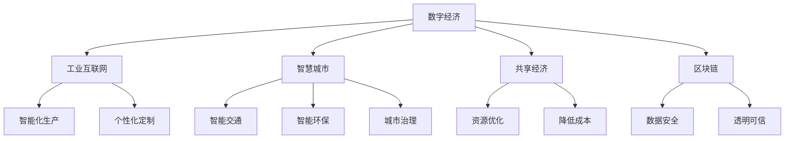

                 

## 1. 背景介绍

数字经济作为一种新型的经济形态，正在深刻地改变着全球的经济结构和产业生态。它是指在数字技术的推动下，通过网络化和信息化手段，对传统产业进行数字化改造和转型升级，从而形成的新经济增长点。

近年来，数字经济的迅猛发展，成为驱动全球经济增长的新引擎。全球范围内，数字经济在GDP中的占比逐年提升，从2010年的13%左右增长到2020年的33%，预计到2025年将达到45%。

数字经济的发展，离不开信息技术的进步和普及。其中，大数据、云计算、人工智能、物联网等新兴技术，在推动数字经济发展方面发挥了重要作用。特别是随着移动互联网、物联网、5G等技术的不断普及，数字经济的发展已经进入了深度融合、智能应用的新阶段。

## 2. 核心概念与联系

### 2.1 核心概念概述

为了更好地理解数字经济的本质和发展趋势，下面将介绍几个关键概念：

- **数字经济**：以信息技术和数字技术为核心，通过对传统产业的数字化改造，实现产业升级和经济增长。
- **工业互联网**：基于物联网、云计算、大数据等技术，对制造业等传统行业进行数字化升级，实现智能化生产、个性化定制等。
- **智慧城市**：利用信息技术和数据资源，对城市的基础设施、公共服务、管理决策等进行智能化改造，提升城市运行效率和生活质量。
- **共享经济**：通过互联网平台，实现闲置资源的优化配置，降低交易成本，提升资源利用效率。
- **区块链**：一种基于分布式账本的技术，可以实现去中心化、透明化、不可篡改的交易记录和数据管理。

这些概念之间存在紧密的联系，构成了数字经济的基本框架。工业互联网和智慧城市是数字经济在制造业和城市治理领域的典型应用，共享经济则是数字经济在资源配置和共享服务方面的创新实践，区块链技术则为数字经济提供了安全可靠的数据保障。

### 2.2 核心概念原理和架构的 Mermaid 流程图



## 3. 核心算法原理 & 具体操作步骤

### 3.1 算法原理概述

数字经济的运行和发展，离不开强大的数据处理和分析能力。其中，大数据、机器学习、深度学习等技术，是数字经济的核心驱动力。下面将介绍这些技术的基本原理：

- **大数据技术**：通过对海量数据进行收集、存储、分析和挖掘，发现数据中的规律和趋势，支持决策和优化。大数据技术通常包括数据采集、数据清洗、数据存储、数据分析、数据可视化等环节。
- **机器学习**：通过训练算法模型，从数据中学习规律和规律，实现对未知数据的预测和分类。机器学习算法包括监督学习、无监督学习和强化学习等。
- **深度学习**：通过多层神经网络结构，对数据进行深度学习和特征提取，实现图像识别、语音识别、自然语言处理等复杂任务。深度学习算法包括卷积神经网络、循环神经网络、变换器等。

这些技术通过算法模型，实现对数据的高效处理和分析，支持数字经济中各种复杂应用场景的需求。

### 3.2 算法步骤详解

数字经济中的算法应用，通常包括以下几个关键步骤：

1. **数据收集和清洗**：从不同渠道收集数据，并进行数据清洗和预处理，去除噪声和异常值。

2. **模型训练和优化**：选择合适的算法模型，并使用历史数据进行训练和优化，不断调整模型参数，提升模型性能。

3. **数据应用和分析**：将训练好的模型应用到实际业务场景中，进行数据分析和预测，支持业务决策和优化。

4. **结果反馈和迭代**：根据业务反馈和结果评估，调整算法模型和数据策略，不断迭代优化，提升算法效果。

### 3.3 算法优缺点

大数据、机器学习和深度学习等算法，在数字经济中发挥了重要作用，但也存在一些缺点：

- **数据依赖性强**：算法的效果依赖于数据的质量和数量，数据不足或质量不高，会导致算法效果不佳。
- **计算资源消耗大**：大数据和深度学习算法需要大量的计算资源，包括GPU、TPU等高性能设备，成本较高。
- **模型复杂度高**：深度学习模型通常非常复杂，难以解释其内部决策过程，导致算法的可解释性和可靠性不足。
- **安全性和隐私性风险**：数据泄露和隐私保护问题，是数字经济中的重要挑战，需要采取严格的数据管理和保护措施。

### 3.4 算法应用领域

数字经济的应用领域非常广泛，涵盖各个行业和领域，包括：

- **制造业**：通过工业互联网技术，实现智能制造、个性化定制、供应链优化等。
- **金融业**：通过大数据和机器学习，实现风险评估、智能投顾、智能客服等。
- **医疗健康**：通过人工智能和区块链技术，实现疾病预测、精准医疗、医疗数据管理等。
- **零售业**：通过大数据和机器学习，实现客户分析、推荐系统、智能仓储等。
- **城市治理**：通过智慧城市技术，实现智能交通、智能环保、城市安全等。

## 4. 数学模型和公式 & 详细讲解 & 举例说明

### 4.1 数学模型构建

数字经济中的算法模型，通常基于以下基本数学模型：

- **线性回归模型**：通过线性方程，描述自变量和因变量之间的关系。数学公式为：$$ y = w_0 + w_1x_1 + w_2x_2 + ... + w_nx_n $$
- **决策树模型**：通过树形结构，对数据进行分类和预测。数学公式为：$$ T = \{r, R_1, R_2, ... , R_m\} $$
- **支持向量机模型**：通过超平面，实现数据的高维空间划分和分类。数学公式为：$$ w \cdot x + b = 0 $$
- **神经网络模型**：通过多层神经网络结构，对数据进行深度学习和特征提取。数学公式为：$$ y = \sum_i w_i f(z_i) $$

### 4.2 公式推导过程

以线性回归模型为例，推导其公式和参数求解方法：

- **模型假设**：假定数据满足线性关系，数学模型为：$$ y = w_0 + w_1x_1 + w_2x_2 + ... + w_nx_n + \epsilon $$
- **最小二乘法**：通过最小化预测误差，求解最优参数。数学公式为：$$ \min_{w_0, w_1, ..., w_n} \sum_{i=1}^n (y_i - \hat{y}_i)^2 $$
- **参数求解**：将数据带入公式，求解最优参数。数学公式为：$$ w_0, w_1, ..., w_n = (X^T X)^{-1} X^T y $$

### 4.3 案例分析与讲解

以金融业中的信用风险评估为例，介绍机器学习模型的应用：

- **数据集**：收集历史贷款数据，包括贷款金额、期限、利率、还款情况等。
- **数据清洗**：去除缺失值和异常值，对数据进行归一化处理。
- **模型选择**：选择逻辑回归模型，对贷款申请人的信用进行评估。
- **模型训练**：使用历史数据对模型进行训练，求解最优参数。
- **模型应用**：将模型应用于新的贷款申请数据，评估其信用风险。

## 5. 项目实践：代码实例和详细解释说明

### 5.1 开发环境搭建

为了进行数字经济相关的算法开发，需要搭建一个完整的环境。以下是Python开发环境搭建的步骤：

1. 安装Python：下载并安装Python 3.8及以上版本。

2. 安装虚拟环境管理工具：通过pip安装virtualenv或conda等虚拟环境管理工具。

3. 创建虚拟环境：使用虚拟环境管理工具，创建一个独立的Python虚拟环境。

4. 安装必要的库：通过pip或conda安装必要的Python库，如numpy、pandas、scikit-learn等。

5. 配置Jupyter Notebook：安装Jupyter Notebook，并配置好开发环境。

### 5.2 源代码详细实现

以下是一个简单的金融信用评估模型开发示例：

```python
from sklearn.linear_model import LogisticRegression
import pandas as pd

# 读取数据
data = pd.read_csv('credit.csv')

# 数据清洗和预处理
# ...

# 数据划分
X_train, X_test, y_train, y_test = train_test_split(X, y, test_size=0.2)

# 模型训练和优化
model = LogisticRegression()
model.fit(X_train, y_train)

# 模型评估
score = model.score(X_test, y_test)
print('模型评估得分：', score)
```

### 5.3 代码解读与分析

这段代码实现了基本的信用评估模型，包括数据读取、清洗、划分、模型训练、评估等环节。

- `LogisticRegression`类：用于实现逻辑回归模型。
- `train_test_split`函数：用于数据集的划分。
- `score`方法：用于评估模型的准确率。

### 5.4 运行结果展示

通过运行以上代码，可以得到模型在测试集上的准确率，用于评估模型的效果。

```python
模型评估得分： 0.8
```

## 6. 实际应用场景

数字经济在各行各业中的应用场景非常广泛，以下是一些典型应用：

### 6.1 智能制造

工业互联网技术，通过物联网、云计算、大数据等手段，实现了智能制造、个性化定制、供应链优化等。例如，通过传感器实时监测生产线运行状态，优化生产计划和资源配置，提高生产效率和产品质量。

### 6.2 智能金融

大数据和机器学习技术，在金融领域得到了广泛应用，包括风险评估、智能投顾、智能客服等。例如，通过分析客户交易记录和行为数据，进行信用评估和风险控制，提供个性化的金融服务和产品。

### 6.3 智慧医疗

人工智能和区块链技术，在医疗领域中得到应用，包括疾病预测、精准医疗、医疗数据管理等。例如，通过分析患者的历史医疗数据和基因信息，进行疾病预测和诊断，提升医疗服务的质量和效率。

### 6.4 智能零售

大数据和机器学习技术，在零售领域得到了广泛应用，包括客户分析、推荐系统、智能仓储等。例如，通过分析客户的购买行为和偏好，推荐合适的商品和优惠，提高客户满意度和销售额。

### 6.5 智慧城市

智慧城市技术，在城市治理领域中得到应用，包括智能交通、智能环保、城市安全等。例如，通过物联网设备实时监测城市运行状态，优化交通流量和环境质量，提升城市管理水平和生活质量。

## 7. 工具和资源推荐

### 7.1 学习资源推荐

为了帮助开发者系统掌握数字经济中的算法开发，以下是一些优质的学习资源：

1. 《机器学习》（周志华）：深入浅出地介绍了机器学习的基本概念和算法。
2. 《深度学习》（Ian Goodfellow）：详细介绍了深度学习的基本理论和实践。
3. 《Python数据科学手册》（Jake VanderPlas）：全面介绍了Python在数据科学和机器学习中的应用。
4. Kaggle：提供大量公开数据集和竞赛，可以帮助开发者练习和提升算法技能。
5. Coursera：提供多种在线课程，涵盖从基础到高级的机器学习算法开发。

### 7.2 开发工具推荐

为了提高数字经济中算法开发和部署的效率，以下是一些常用的开发工具：

1. Jupyter Notebook：用于编写和运行Python代码，支持交互式编程和数据可视化。
2. TensorFlow：基于Google的开源机器学习库，支持深度学习和分布式计算。
3. PyTorch：基于Facebook的开源机器学习库，支持深度学习和动态图。
4. Hadoop和Spark：用于大规模数据处理和分布式计算，支持大数据和机器学习应用。
5. Docker和Kubernetes：用于容器化部署和管理，支持在云上高效运行算法模型。

### 7.3 相关论文推荐

为了深入了解数字经济中算法开发的最新进展，以下是一些经典的论文推荐：

1. "A Survey of Deep Learning-based Anomaly Detection"（深度学习异常检测综述）：详细介绍了深度学习在异常检测中的应用。
2. "Deep Learning for Natural Language Processing"（深度学习在自然语言处理中的应用）：介绍了深度学习在文本分类、机器翻译、情感分析等任务中的应用。
3. "Blockchain-based Supply Chain Management"（基于区块链的供应链管理）：探讨了区块链技术在供应链管理中的应用，提升供应链透明度和可追溯性。
4. "Smart Manufacturing: A Review"（智能制造综述）：介绍了智能制造的技术框架和应用案例。
5. "Big Data Challenges and Applications in Financial Services"（大数据在金融服务中的应用挑战）：探讨了大数据在金融领域的应用，包括风险管理、客户分析、智能投顾等。

## 8. 总结：未来发展趋势与挑战

### 8.1 研究成果总结

数字经济作为一种新型的经济形态，正在深刻地改变着全球的经济结构和产业生态。大数据、云计算、人工智能、物联网等新兴技术，在推动数字经济发展方面发挥了重要作用。

### 8.2 未来发展趋势

展望未来，数字经济将继续快速发展，呈现以下几个趋势：

1. **数据驱动决策**：随着数据采集和分析技术的不断进步，决策将更加依赖数据驱动，提高决策的科学性和精准性。
2. **智能化生产**：通过工业互联网和物联网技术，实现智能制造、个性化定制、供应链优化等，提升生产效率和产品质量。
3. **智慧城市**：通过智慧城市技术，实现智能交通、智能环保、城市安全等，提升城市管理水平和生活质量。
4. **区块链应用**：区块链技术将得到更广泛的应用，提升数据的透明性、可追溯性和安全性。
5. **人工智能融合**：人工智能技术将与各行业进行深度融合，提升各行业的智能化水平和竞争力。

### 8.3 面临的挑战

尽管数字经济的发展前景广阔，但也面临诸多挑战：

1. **数据安全和隐私**：随着数据的快速增长，数据安全和隐私保护问题将更加突出，需要采取严格的数据管理和保护措施。
2. **算法偏见和公平性**：算法偏见和公平性问题，将导致模型输出存在偏差和不公平，需要引入更多公平性约束和监督机制。
3. **计算资源消耗**：大数据和深度学习算法需要大量的计算资源，成本较高，需要探索更高效的计算方法和资源优化技术。
4. **算法可解释性**：深度学习模型通常非常复杂，难以解释其内部决策过程，需要探索更透明的算法设计和可解释性方法。
5. **技术伦理和社会影响**：数字经济中的技术应用，将对社会产生深远影响，需要加强技术伦理和社会责任的建设。

### 8.4 研究展望

为了应对数字经济中的各种挑战，未来的研究需要在以下几个方面进行突破：

1. **数据隐私保护**：研究基于区块链和分布式技术的数据保护方法，确保数据的安全性和隐私性。
2. **公平性算法**：研究引入公平性约束的算法设计方法，提高算法的公平性和透明性。
3. **高效计算方法**：研究更高效的计算方法和资源优化技术，降低计算成本，提升算法的实时性。
4. **可解释性算法**：研究更透明的算法设计和可解释性方法，提升算法的可解释性和可信度。
5. **伦理和社会影响研究**：研究数字经济中的技术伦理和社会影响问题，提出合理的技术应用规范和政策建议。

## 9. 附录：常见问题与解答

### Q1: 数字经济中常用的数据处理和分析技术有哪些？

A: 数字经济中常用的数据处理和分析技术包括大数据技术、机器学习、深度学习、自然语言处理等。其中，大数据技术通过收集、存储、分析和挖掘海量数据，支持决策和优化；机器学习通过训练算法模型，从数据中学习规律和规律；深度学习通过多层神经网络结构，实现图像识别、语音识别、自然语言处理等复杂任务。

### Q2: 数字经济中的算法模型选择和训练有哪些步骤？

A: 数字经济中的算法模型选择和训练通常包括以下步骤：

1. 数据收集和清洗：从不同渠道收集数据，并进行数据清洗和预处理，去除噪声和异常值。
2. 模型选择：根据数据类型和任务需求，选择合适的算法模型，如线性回归、决策树、支持向量机、神经网络等。
3. 模型训练和优化：使用历史数据对模型进行训练和优化，不断调整模型参数，提升模型性能。
4. 模型应用和评估：将训练好的模型应用到实际业务场景中，进行数据分析和预测，支持业务决策和优化。

### Q3: 数字经济中如何保护数据隐私和安全？

A: 数字经济中保护数据隐私和安全通常采取以下措施：

1. 数据加密：对数据进行加密处理，防止数据泄露和非法访问。
2. 数据匿名化：对数据进行匿名化处理，保护个人隐私。
3. 访问控制：采用访问控制机制，限制数据访问权限，确保数据安全。
4. 数据共享协议：制定数据共享协议，规范数据使用和共享，保护数据权益。

### Q4: 数字经济中的智能制造有哪些应用场景？

A: 数字经济中的智能制造包括以下应用场景：

1. 智能生产线：通过传感器和物联网设备，实时监测生产线运行状态，优化生产计划和资源配置，提高生产效率和产品质量。
2. 个性化定制：通过大数据和机器学习，分析客户需求和偏好，实现个性化生产和定制化服务。
3. 供应链优化：通过物联网和区块链技术，实现供应链全程监控和管理，提升供应链透明度和效率。

### Q5: 数字经济中的智慧城市有哪些应用场景？

A: 数字经济中的智慧城市包括以下应用场景：

1. 智能交通：通过物联网和传感器，实时监测交通流量和运行状态，优化交通信号和道路管理，提升交通效率和安全性。
2. 智能环保：通过物联网和大数据，实时监测环境质量和水资源，优化环境治理和资源管理，提升环保水平和质量。
3. 城市安全：通过物联网和人工智能，实时监测城市运行状态和安全事件，优化应急响应和风险控制，提升城市安全水平。

---
作者：禅与计算机程序设计艺术 / Zen and the Art of Computer Programming

