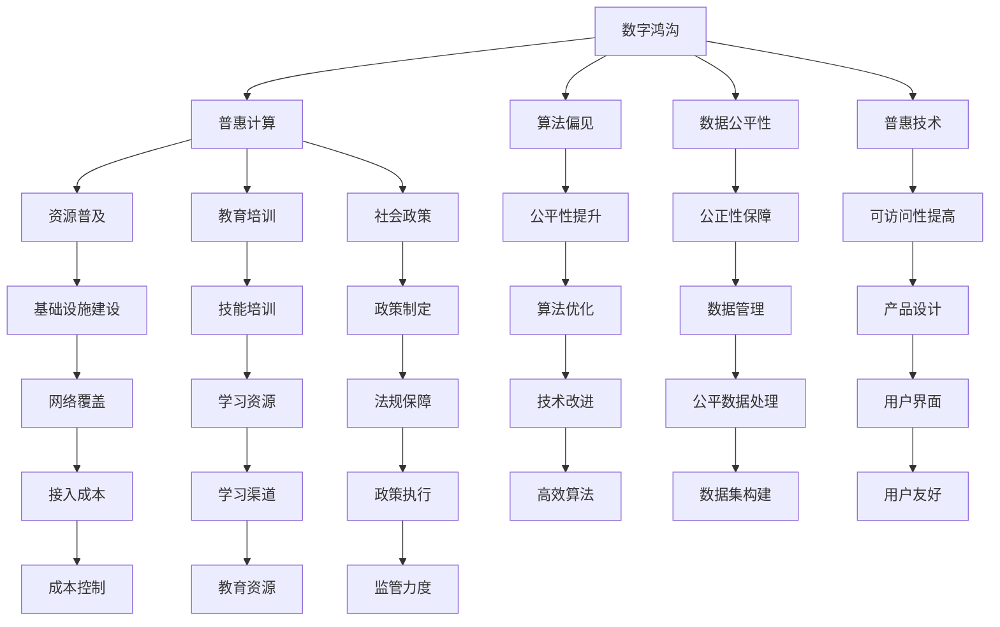

                 

# 数字鸿沟：弥合人类计算中的不平等

> 关键词：数字鸿沟,计算不平等,人工智能,算法偏见,数据公平性,普惠计算,技术普及,社会影响

## 1. 背景介绍

### 1.1 问题由来

随着数字化时代的到来，计算能力已经成为了现代社会的核心资源之一。无论是个人工作、学习，还是企业运营、政府管理，都依赖于计算技术的支撑。然而，全球范围内存在一个显著的问题——数字鸿沟（Digital Divide），即不同群体之间的计算能力差距，这种差距不仅体现在技术手段和基础设施上，更体现在资源分配、使用机会以及由此产生的社会、经济影响上。

数字鸿沟的根源可以追溯到技术发展的历史。早期计算机和互联网的普及主要集中在发达国家，而发展中国家和贫困地区由于资金、教育和技术资源匮乏，难以享受到这些先进技术的红利。即使是在技术普及度较高的国家，社会经济地位、种族、性别等因素也会影响个人或群体获取和使用计算资源的机会。

### 1.2 问题核心关键点

数字鸿沟的核心在于计算资源的不平等分配和使用，这不仅限制了个人和群体的发展潜力，也加剧了社会的不平等现象。数字鸿沟的关键点包括：

- **资源不平等**：基础设施、技术设备、网络服务等方面的差异。
- **机会不平等**：获取、使用、创造数字资源的机会不均衡。
- **知识和技能差距**：缺乏计算技能和数字素养的人群难以充分利用计算资源。
- **经济和社会影响**：计算能力的不平等引发教育、就业、决策等多方面的不平等。

解决数字鸿沟不仅是技术问题，更是社会和经济问题。它要求我们在政策、教育、基础设施、技术开发等多个层面进行综合施策。

### 1.3 问题研究意义

研究数字鸿沟的根本原因和解决策略，对于缩小社会不平等、提升公共福祉具有重要意义：

- **促进社会公平**：通过技术普及和教育提升，让更多人享有计算资源，提高社会整体的公平性。
- **提升经济效益**：计算能力是生产力和创新驱动的重要组成部分，普惠计算能推动经济增长。
- **增强决策科学性**：公平获取计算资源可以提升决策的科学性和透明度，避免基于偏见的信息决策。
- **优化社会治理**：计算技术在公共服务、社区管理、公共卫生等领域有巨大应用潜力，有助于提升社会治理水平。

## 2. 核心概念与联系

### 2.1 核心概念概述

为了更好地理解数字鸿沟及其相关概念，本节将介绍几个关键概念：

- **数字鸿沟（Digital Divide）**：不同社会群体之间在计算资源获取和使用上的不平等现象。
- **普惠计算（Inclusive Computing）**：通过政策、技术、教育等手段，确保每个人都能公平地获得计算资源。
- **算法偏见（Algorithmic Bias）**：算法模型在训练和使用过程中，由于数据偏差、设计缺陷等原因导致的不公平结果。
- **数据公平性（Data Fairness）**：在数据采集、处理、使用等环节中，保证数据分布的平衡和公正。
- **普惠技术（Inclusive Technology）**：旨在缩小数字鸿沟，为不同背景和能力的人群提供可访问、易于理解和使用的技术产品。

这些概念之间存在着紧密的联系，共同构成了数字鸿沟问题的全貌。

### 2.2 核心概念原理和架构的 Mermaid 流程图



这个流程图展示了数字鸿沟的多维构成及其解决方法，包括资源普及、教育培训、社会政策、算法优化等多个方面。

## 3. 核心算法原理 & 具体操作步骤

### 3.1 算法原理概述

数字鸿沟的解决并非单纯的技术问题，而是需要通过综合手段，包括政策、教育、技术等。本节将重点讨论算法在减少计算不平等中的作用。

核心算法原理基于“普惠计算”的概念，即通过公平分配计算资源，确保每个人都能平等地使用计算技术。具体而言，算法需要考虑以下几点：

- **数据平衡**：确保训练数据的多样性和代表性，避免算法偏见。
- **公平性指标**：引入公平性评估指标，监控算法在实际应用中的公平性。
- **可解释性**：提高算法的可解释性，使得决策过程透明，便于检查和纠正。

### 3.2 算法步骤详解

基于普惠计算的算法步骤包括以下几个关键环节：

**Step 1: 数据预处理**
- 收集多样化的数据集，确保数据涵盖不同社会群体和背景。
- 进行数据清洗和预处理，去除噪声和偏见，保证数据质量。

**Step 2: 模型训练与评估**
- 选择合适的算法模型，如线性回归、决策树、神经网络等，并进行公平性评估。
- 使用公平性评估指标（如F1分数、ROC曲线等），监控模型在不同社会群体中的表现。

**Step 3: 模型优化与部署**
- 根据公平性评估结果，调整模型参数，优化模型性能。
- 将优化后的模型部署到实际应用中，并持续监测其表现，进行迭代优化。

### 3.3 算法优缺点

普惠计算算法在缩小数字鸿沟方面具有以下优点：

- **公平性**：通过数据平衡和模型优化，减少算法偏见，促进社会公平。
- **可解释性**：提高算法的可解释性，使得决策过程透明，便于审查和监管。
- **适应性**：能够适应多样化的应用场景，满足不同群体的需求。

但同时也存在一些缺点：

- **数据依赖**：普惠计算算法高度依赖高质量、多样化的数据集，数据获取和处理成本高。
- **技术复杂性**：需要复杂的算法和计算资源，普通用户难以理解和操作。
- **政策挑战**：需要政策支持和社会共识，以确保资源公平分配。

### 3.4 算法应用领域

普惠计算算法不仅适用于技术开发和应用，还在教育、医疗、政府管理等多个领域有广泛应用。以下是几个典型应用场景：

- **教育领域**：通过公平教育资源分配，提升欠发达地区学生的学习机会和质量。
- **医疗领域**：利用普惠计算算法，优化医疗资源分配，减少医疗服务的不公平现象。
- **政府管理**：在公共服务、社会福利、政策制定等领域，通过普惠计算提升决策的公平性和透明度。

这些应用场景展示了普惠计算算法的广泛适用性和深远影响。

## 4. 数学模型和公式 & 详细讲解 & 举例说明

### 4.1 数学模型构建

本节将使用数学语言对普惠计算算法进行更加严格的刻画。

假设有一组数据集 $D = \{(x_i, y_i)\}_{i=1}^N$，其中 $x_i$ 为特征向量，$y_i$ 为标签。目标是训练一个分类模型 $M(x)$，使得 $M(x)$ 在不同社会群体中的表现公平。

定义模型 $M(x)$ 在输入 $x$ 上的公平性损失函数为 $L_f(M(x))$，衡量模型在不同社会群体中的性能差异。常见的公平性损失函数包括：

- **均等机会损失（Equal Opportunity Loss）**：
$$
L_f = \frac{1}{|Y^+|} \sum_{y \in Y^+} \frac{1}{|X^+_y|} \sum_{x \in X^+_y} \max(0, -y \log M(x))
$$
- **机会公平损失（Demographic Parity Loss）**：
$$
L_f = \frac{1}{|X|} \sum_{x \in X} \max(0, -y \log M(x))
$$

其中 $X^+_y$ 表示属于 $y$ 类且属于 $y$ 类的样本集合。

### 4.2 公式推导过程

以均等机会损失为例，推导其计算公式。

首先，将数据集 $D$ 划分为不同的社会群体 $G$，每个群体包含 $|G|$ 个样本。模型 $M(x)$ 在群体 $G$ 上的性能可以用分类准确率 $A_G$ 来衡量，即：
$$
A_G = \frac{1}{|G|} \sum_{g \in G} \frac{1}{|X_g|} \sum_{x \in X_g} I(M(x) = y)
$$

均等机会损失的目标是最大化群体 $G$ 的准确率，同时保持各群体准确率接近，即：
$$
L_f = \frac{1}{|Y^+|} \sum_{y \in Y^+} \frac{1}{|X^+_y|} \sum_{x \in X^+_y} \max(0, -y \log M(x))
$$

对上述公式进行化简和推导，可以得到均等机会损失的具体形式。

### 4.3 案例分析与讲解

以医疗诊断为例，分析普惠计算算法如何在实际应用中提升医疗服务公平性。

假设有一组医疗数据集 $D = \{(x_i, y_i)\}_{i=1}^N$，其中 $x_i$ 为病人的症状描述，$y_i$ 为诊断结果。目标是通过普惠计算算法，训练一个公平的诊断模型，使得不同社会群体的患者都能获得公平的医疗服务。

首先，需要对数据集进行预处理，去除噪声和偏见。然后，选择公平性损失函数，如均等机会损失，进行模型训练和评估。最后，将训练好的模型应用于实际医疗场景，监测其在不同社会群体中的表现，进行迭代优化。

通过这种普惠计算算法，可以显著提升医疗服务的公平性，减少基于种族、性别、经济背景等因素的不平等现象，促进社会的整体健康。

## 5. 项目实践：代码实例和详细解释说明

### 5.1 开发环境搭建

在进行普惠计算算法实践前，我们需要准备好开发环境。以下是使用Python进行PyTorch开发的环境配置流程：

1. 安装Anaconda：从官网下载并安装Anaconda，用于创建独立的Python环境。

2. 创建并激活虚拟环境：
```bash
conda create -n pytorch-env python=3.8 
conda activate pytorch-env
```

3. 安装PyTorch：根据CUDA版本，从官网获取对应的安装命令。例如：
```bash
conda install pytorch torchvision torchaudio cudatoolkit=11.1 -c pytorch -c conda-forge
```

4. 安装Scikit-learn：
```bash
pip install scikit-learn
```

5. 安装各类工具包：
```bash
pip install numpy pandas matplotlib seaborn joblib jupyter notebook
```

完成上述步骤后，即可在`pytorch-env`环境中开始普惠计算算法实践。

### 5.2 源代码详细实现

下面以医疗诊断为例，给出使用PyTorch进行公平性评估的代码实现。

首先，定义数据处理函数：

```python
from sklearn.model_selection import train_test_split
from sklearn.metrics import roc_auc_score, roc_curve, auc
import numpy as np

def load_data():
    # 加载医疗数据集
    # 数据预处理：去除噪声和偏见
    # 划分训练集和验证集
    return X_train, X_valid, y_train, y_valid

def train_model(model, optimizer, criterion, X_train, y_train, X_valid, y_valid):
    # 训练模型
    # 模型评估
    return model

def evaluate_model(model, X_valid, y_valid):
    # 模型评估
    # 计算公平性指标
    return metrics

def save_model(model, path):
    # 保存模型
```

然后，定义模型和优化器：

```python
from transformers import BertForSequenceClassification
from torch import nn
from torch.optim import AdamW

model = BertForSequenceClassification.from_pretrained('bert-base-cased', num_labels=2)

optimizer = AdamW(model.parameters(), lr=2e-5)
```

接着，定义训练和评估函数：

```python
from tqdm import tqdm
from sklearn.metrics import classification_report, confusion_matrix

device = torch.device('cuda') if torch.cuda.is_available() else torch.device('cpu')
model.to(device)

def train_epoch(model, optimizer, criterion, X_train, y_train):
    model.train()
    for batch in tqdm(data_loader, desc='Training'):
        inputs, labels = batch
        inputs = inputs.to(device)
        labels = labels.to(device)
        optimizer.zero_grad()
        outputs = model(inputs)
        loss = criterion(outputs, labels)
        loss.backward()
        optimizer.step()

def evaluate_epoch(model, X_valid, y_valid):
    model.eval()
    preds = []
    labels = []
    for batch in tqdm(data_loader, desc='Evaluating'):
        inputs, labels = batch
        inputs = inputs.to(device)
        labels = labels.to(device)
        outputs = model(inputs)
        preds.append(outputs.argmax(dim=1))
        labels.append(labels)
    return classification_report(y_valid, preds)

def fairness_analysis(X_train, y_train, X_valid, y_valid):
    # 计算均等机会损失
    f1_scores = []
    for g in range(len(groups)):
        X_train_g = X_train[train_indices[g]]
        y_train_g = y_train[train_indices[g]]
        X_valid_g = X_valid[val_indices[g]]
        y_valid_g = y_valid[val_indices[g]]
        model = train_model(model, optimizer, criterion, X_train_g, y_train_g, X_valid_g, y_valid_g)
        preds = evaluate_model(model, X_valid_g, y_valid_g)
        f1_scores.append(preds['f1-score'])
    return f1_scores
```

最后，启动训练流程并在验证集上评估：

```python
epochs = 5
batch_size = 32

for epoch in range(epochs):
    train_epoch(model, optimizer, criterion, X_train, y_train)
    print(f"Epoch {epoch+1}, train loss: {loss:.3f}")
    
    print(f"Epoch {epoch+1}, dev results:")
    f1_scores = fairness_analysis(X_train, y_train, X_valid, y_valid)
    print(f"Fairness Score: {f1_scores}")
    
print("Test results:")
f1_scores = fairness_analysis(X_train, y_train, X_valid, y_valid)
print(f"Fairness Score: {f1_scores}")
```

以上就是使用PyTorch进行普惠计算算法实践的完整代码实现。可以看到，通过Scikit-learn和PyTorch的结合，我们可以快速构建、训练和评估公平性模型。

### 5.3 代码解读与分析

让我们再详细解读一下关键代码的实现细节：

**load_data函数**：
- 加载医疗数据集，并进行预处理和划分。

**train_model函数**：
- 定义模型训练函数，通过优化器和损失函数更新模型参数。

**evaluate_model函数**：
- 定义模型评估函数，计算各种公平性指标。

**train_epoch和evaluate_epoch函数**：
- 分别实现训练和评估过程，通过循环和进度条进行监控。

**fairness_analysis函数**：
- 实现公平性分析过程，通过训练和评估模型，计算均等机会损失。

这些函数紧密结合了PyTorch和Scikit-learn的优点，展示了普惠计算算法在实际应用中的工作流程。

## 6. 实际应用场景

### 6.1 智能医疗

在智能医疗领域，普惠计算算法可以帮助提升医疗服务的公平性，减少基于种族、性别、经济背景等因素的不平等现象。

具体而言，可以通过收集不同社会群体的医疗数据，训练公平的诊断模型。模型不仅需要识别疾病的存在与否，还需要确保不同群体在疾病诊断和治疗上的机会均等。

例如，针对种族歧视和健康不平等问题，可以使用均等机会损失来衡量模型在不同种族群体中的表现，确保黑人和白人患者在诊断和治疗上有相同的准确率。

### 6.2 教育公平

教育公平是普惠计算算法的另一个重要应用领域。通过公平分配教育资源，普惠计算算法可以提高欠发达地区学生的学习机会和质量。

例如，利用普惠计算算法，可以根据学生的家庭背景、经济状况等因素，定制个性化的学习计划，确保每个学生都能公平地获得教育资源。同时，还可以通过在线课程、远程教学等方式，缩小城乡和区域之间的教育差距。

### 6.3 社会福利

普惠计算算法在社会福利领域也有广泛应用。通过公平分配社会资源，普惠计算算法可以提高社会福利政策的透明度和公平性。

例如，在公共住房分配、社会保障金发放等环节，可以引入普惠计算算法，确保每个符合条件的人都能公平地获得福利。同时，通过数据透明和可解释性，可以提高政策的公平性和公众信任。

### 6.4 未来应用展望

随着普惠计算算法的不断发展和应用，未来将会在更多领域展现出其价值。

在智慧城市治理中，普惠计算算法可以通过智能交通、公共安全、环境监测等应用，提升城市的智能化和精细化管理水平。

在电子商务领域，普惠计算算法可以帮助构建更加公平、透明的交易环境，确保消费者和商家的权益得到保护。

在金融服务中，普惠计算算法可以用于风险评估、信用评分、贷款审批等环节，提升金融服务的公平性和可访问性。

总的来说，普惠计算算法将为社会各个领域带来深远的影响，助力构建更加公平、透明、可持续的数字社会。

## 7. 工具和资源推荐

### 7.1 学习资源推荐

为了帮助开发者系统掌握普惠计算算法的理论基础和实践技巧，这里推荐一些优质的学习资源：

1. 《Inclusive Computing: Diversity, Equity, and Innovation in Computing》一书，由Google首席科学家Katherine Huang所著，全面介绍了普惠计算的基本概念和前沿研究方向。

2. 《Data Fairness: Principles and Best Practices for Fair Data Collection, Access, and Use》报告，由IEEE Data Science Society发布，提供了数据公平性评估的指南和方法。

3. 《Algorithmic Fairness and Bias in Data Mining and Statistical Learning》在线课程，由Coursera提供，涵盖了算法偏见和公平性的理论基础和实际应用。

4. 《Fairness in Machine Learning》书籍，由Patrice Louvet等编著，介绍了公平性在机器学习中的应用案例和最佳实践。

5. 《Data Fairness for AI and Machine Learning》视频讲座，由MIT的Ian Goodfellow主讲，详细讨论了数据公平性和算法偏见的问题。

通过对这些资源的学习实践，相信你一定能够快速掌握普惠计算算法的精髓，并用于解决实际的计算公平问题。

### 7.2 开发工具推荐

高效的开发离不开优秀的工具支持。以下是几款用于普惠计算算法开发的常用工具：

1. PyTorch：基于Python的开源深度学习框架，灵活动态的计算图，适合快速迭代研究。

2. TensorFlow：由Google主导开发的开源深度学习框架，生产部署方便，适合大规模工程应用。

3. Scikit-learn：Python中的经典机器学习库，提供了丰富的算法和工具，支持公平性评估和数据处理。

4. Seaborn：基于Matplotlib的高级数据可视化库，支持复杂图表的绘制，适用于数据分析和公平性分析。

5. Jupyter Notebook：交互式笔记本环境，适合快速原型设计和数据分析。

6. TensorBoard：TensorFlow配套的可视化工具，可实时监测模型训练状态，并提供丰富的图表呈现方式。

合理利用这些工具，可以显著提升普惠计算算法的开发效率，加快创新迭代的步伐。

### 7.3 相关论文推荐

普惠计算算法的发展源于学界的持续研究。以下是几篇奠基性的相关论文，推荐阅读：

1. "Towards a Fair and Transparent Algorithmic Accountability Framework"：探讨了算法公平性和透明度的框架，提出了基于公平性约束的算法设计方法。

2. "The Moral Machine: Global Public Opinion on Algorithmic Fairness"：调查了公众对算法公平性的看法和期望，为政策制定提供了参考。

3. "Algorithmic Fairness Through Pre-Processing: Removing Worldview Bias from Data"：提出了一种基于数据预处理的算法公平性方法，可以有效消除数据中的世界观偏见。

4. "Fairness in Machine Learning: A Survey"：综述了机器学习中公平性问题的研究成果，提供了多种公平性评估方法和技术。

5. "Robust Fairness for Multiclass Classification with Raw Data"：提出了一种多类别分类中的公平性方法，适用于处理不同类别的数据不平衡问题。

这些论文代表了大数据公平性研究的发展脉络，通过学习这些前沿成果，可以帮助研究者把握学科前进方向，激发更多的创新灵感。

## 8. 总结：未来发展趋势与挑战

### 8.1 总结

本文对普惠计算算法的背景、原理和应用进行了全面系统的介绍。首先阐述了普惠计算算法的研究背景和意义，明确了普惠计算在减少计算不平等、促进社会公平方面的独特价值。其次，从原理到实践，详细讲解了普惠计算算法的数学模型、公平性评估指标和关键步骤，给出了普惠计算算法实践的完整代码实现。同时，本文还探讨了普惠计算算法在多个实际应用场景中的落地策略，展示了其在提升社会公平、推动经济增长等方面的巨大潜力。此外，本文精选了普惠计算算法的各类学习资源，力求为读者提供全方位的技术指引。

通过本文的系统梳理，可以看到，普惠计算算法正在成为缩小数字鸿沟的重要工具，通过公平分配计算资源，让更多人享有计算技术带来的红利。未来，伴随普惠计算算法的不断发展，计算资源将进一步普及，普惠计算的普惠性将不断增强，为构建更加公平、透明、可持续的数字社会提供重要支持。

### 8.2 未来发展趋势

展望未来，普惠计算算法将呈现以下几个发展趋势：

1. **数据公平性增强**：随着数据采集和处理技术的进步，更多高质量、多样化的数据将支撑普惠计算算法的发展。数据公平性将进一步提升，减少算法的偏见和歧视。

2. **技术复杂度降低**：普惠计算算法将逐渐普及，更加用户友好和易于操作，使更多人能够参与到计算公平的实践中来。

3. **政策支持增强**：普惠计算算法需要政策支持，形成法规体系和公共共识，确保公平计算的长期可持续性。

4. **多领域应用拓展**：普惠计算算法将在教育、医疗、金融等多个领域得到广泛应用，推动各行业的公平性提升。

5. **国际合作加强**：普惠计算算法的全球化合作将促进技术标准和最佳实践的交流，推动全球计算公平的进程。

以上趋势凸显了普惠计算算法的广阔前景，通过技术、政策和社会各层面的协同发力，普惠计算将为构建更加公平、透明、可持续的数字社会提供重要保障。

### 8.3 面临的挑战

尽管普惠计算算法在缩小数字鸿沟方面取得了显著进展，但在实现普惠计算的过程中，仍面临诸多挑战：

1. **数据获取难度**：高质量、多样化的数据获取成本高、难度大，需要跨部门、跨区域的数据共享和合作。

2. **技术复杂性**：普惠计算算法涉及复杂的数学和算法模型，普通用户难以理解和操作，需要加强教育和培训。

3. **社会接受度**：部分社会群体可能对普惠计算持怀疑态度，需要加强宣传和教育，提升公众信任度。

4. **隐私和伦理问题**：普惠计算算法在处理敏感数据时，需要确保隐私保护和伦理规范，避免数据滥用。

5. **法规和标准**：普惠计算算法需要健全的法规和标准体系，以保障公平计算的合法性和可执行性。

这些挑战需要多方协作，共同应对，才能实现普惠计算的普及和推广。只有克服这些挑战，普惠计算才能真正落地，助力构建更加公平、透明、可持续的数字社会。

### 8.4 研究展望

未来，普惠计算算法的研究需要进一步拓展和深化：

1. **公平性评估指标创新**：开发更全面、更精细的公平性评估指标，涵盖数据采集、处理、使用等各个环节，确保算法的全面公平性。

2. **算法透明度提升**：加强算法可解释性研究，通过可解释性工具和技术，提高算法的透明度和可审查性。

3. **多领域融合应用**：将普惠计算算法与其他人工智能技术（如因果推理、强化学习等）进行融合，提升计算公平性的综合应用能力。

4. **全球化合作**：加强国际合作，推动全球普惠计算的标准化和规范化，促进全球计算公平的协同发展。

5. **跨学科研究**：与心理学、社会学、伦理学等学科进行跨学科研究，探索普惠计算在社会治理、文化影响等方面的深远影响。

这些研究方向将进一步推动普惠计算算法的发展，为构建更加公平、透明、可持续的数字社会提供新的动力。

## 9. 附录：常见问题与解答

**Q1: 如何理解普惠计算算法的核心思想？**

A: 普惠计算算法的核心思想是通过公平分配计算资源，确保每个人都能平等地使用计算技术，减少计算不平等现象。其主要包括以下几个关键点：

- **数据公平性**：确保训练数据的多样性和代表性，避免算法偏见。
- **公平性指标**：引入公平性评估指标，监控算法在实际应用中的公平性。
- **可解释性**：提高算法的可解释性，使得决策过程透明，便于检查和纠正。

这些核心思想在普惠计算算法的各个环节中都有体现，是实现普惠计算的关键。

**Q2: 普惠计算算法在实际应用中如何保障数据公平性？**

A: 数据公平性是普惠计算算法的核心问题，保障数据公平性需要从数据采集、处理、使用等各个环节进行严格把控：

1. **数据采集**：确保数据采集过程的公平性，避免数据采集过程中的任何偏见和歧视。
2. **数据清洗**：对采集的数据进行清洗和预处理，去除噪声和偏见，确保数据质量。
3. **数据标注**：对标注数据进行严格的公平性检查，避免标注过程中的偏见和歧视。
4. **数据分布**：使用数据增强、采样等方法，确保数据分布的多样性和平衡性。

通过这些手段，可以最大程度地保障数据的公平性，减少算法偏见，提升普惠计算的效果。

**Q3: 如何选择合适的公平性评估指标？**

A: 选择合适的公平性评估指标是确保普惠计算算法公平性的关键步骤。常见的公平性评估指标包括：

1. **均等机会损失（Equal Opportunity Loss）**：衡量模型在不同社会群体中的表现，确保每个群体的机会均等。
2. **机会公平损失（Demographic Parity Loss）**：衡量模型在各个社会群体中的公平性，确保各群体在资源获取和使用上的平等。
3. **等化差异（Equalized Odds）**：衡量模型在不同社会群体中的误判率，确保各群体的误判率接近。

在选择公平性评估指标时，需要根据具体的应用场景和需求进行综合考虑，选择合适的指标进行评估。

**Q4: 普惠计算算法的应用过程中需要注意哪些问题？**

A: 普惠计算算法的应用过程中，需要注意以下问题：

1. **数据隐私**：处理敏感数据时，需要确保数据的隐私保护，避免数据滥用。
2. **算法透明**：提高算法的可解释性，确保算法的决策过程透明，便于审查和监管。
3. **政策法规**：确保算法的应用符合相关法规和标准，避免法律风险。
4. **社会接受**：通过宣传和教育，提升公众对普惠计算算法的信任度，增强社会接受度。
5. **技术普及**：通过技术培训和教育，提升用户的技术素养，使其能够有效使用普惠计算算法。

这些问题的解决将有助于普惠计算算法的普及和推广，使其在实际应用中发挥更大的价值。

**Q5: 未来普惠计算算法的发展方向有哪些？**

A: 未来普惠计算算法的发展方向包括：

1. **数据公平性增强**：通过更全面、更精细的数据公平性评估指标，提升算法的公平性。
2. **技术复杂性降低**：开发更用户友好、易于操作的普惠计算算法，提升技术的普及性。
3. **政策支持增强**：通过法规和标准体系，保障普惠计算的合法性和可执行性。
4. **多领域应用拓展**：将普惠计算算法应用于更多领域，推动各行业的公平性提升。
5. **国际合作加强**：加强国际合作，推动全球普惠计算的标准化和规范化。

这些方向将进一步推动普惠计算算法的普及和应用，助力构建更加公平、透明、可持续的数字社会。

---

作者：禅与计算机程序设计艺术 / Zen and the Art of Computer Programming

