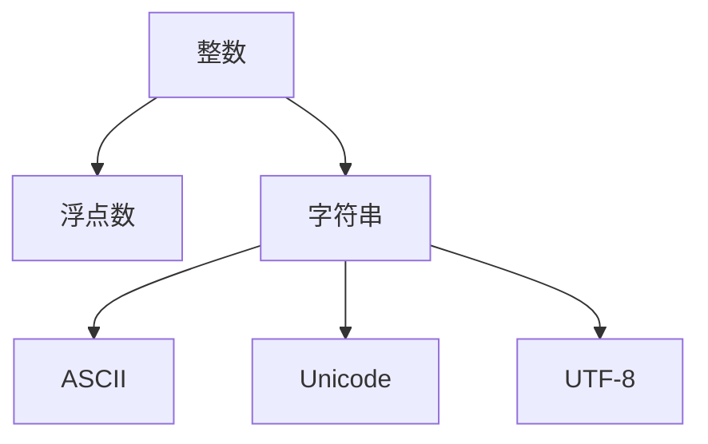

                 

## 1. 背景介绍

### 1.1 问题由来

在计算机科学中，数据类型（Data Type）是一个基础但极其重要的概念。数据类型定义了数据的存储方式、操作的规则以及数据的范畴范围。理解数据类型是编程基础，对于构建高效、可维护的程序至关重要。本文将深入解析整数、浮点数和字符串三种常见的数据类型，以及它们在不同编码标准下的实现和应用。

### 1.2 问题核心关键点

本文将重点讨论以下核心关键点：
- **整数和浮点数的原理与实现**：包括基本的数学模型、常见的数据类型及其在内存中的存储方式。
- **字符串的原理与实现**：包括ASCII编码、Unicode编码和UTF-8编码的原理和转换方法。
- **编码标准的选择与应用**：根据实际应用场景，选择合适的编码标准，并探讨其影响。

## 2. 核心概念与联系

### 2.1 核心概念概述

- **整数**：表示没有小数的实数，通常用于计数、索引、排序等场景。整数可以分为有符号整数和无符号整数，后者不能表示负数。
- **浮点数**：表示带有小数的实数，通常用于表示科学计算、金融计算等场景。浮点数在计算机中以IEEE 754标准进行编码，支持精度和表示范围更大的数值。
- **字符串**：由字符组成的序列，常用于表示文本、数据等。字符串可以基于不同的编码标准进行存储和处理，包括ASCII、Unicode、UTF-8等。

### 2.2 核心概念原理和架构的 Mermaid 流程图



这个流程图展示了整数、浮点数和字符串三种数据类型之间的基本联系。整数值通常可以隐式转换为浮点数，而字符串可以通过不同的编码标准进行表示。

## 3. 核心算法原理 & 具体操作步骤

### 3.1 算法原理概述

#### 3.1.1 整数和浮点数的原理概述

整数和浮点数是计算机中最基本的数据类型，它们的存储和操作遵循特定的数学模型。整数的存储通常基于二进制补码形式，浮点数的存储则基于IEEE 754标准。

#### 3.1.2 字符串的原理概述

字符串的存储基于字符序列，字符序列可以通过不同的编码标准进行表示。ASCII编码使用7位二进制表示128个字符，Unicode编码使用16位或32位二进制表示更多字符，而UTF-8编码则根据字符的复杂度使用不同位数的二进制表示。

### 3.2 算法步骤详解

#### 3.2.1 整数和浮点数的算法步骤

1. **整数存储**：
   - 使用补码表示整数。
   - 存储时，正整数直接存储其二进制表示，负整数则存储其二进制补码。

2. **浮点数存储**：
   - 使用IEEE 754标准。
   - 将浮点数拆分为符号位、指数位和尾数位，分别存储。

#### 3.2.2 字符串的算法步骤

1. **ASCII编码**：
   - 使用7位二进制表示128个字符。
   - 存储时，将每个字符的ASCII码直接存储。

2. **Unicode编码**：
   - 使用16位或32位二进制表示字符。
   - 存储时，根据字符的复杂度，使用不同的编码方式。

3. **UTF-8编码**：
   - 使用不同位数的二进制表示字符。
   - 存储时，根据字符的复杂度，使用1-4个字节的二进制表示。

### 3.3 算法优缺点

#### 3.3.1 整数的优缺点

- **优点**：
  - 整数运算简单高效。
  - 整数类型在内存中占用空间较小。

- **缺点**：
  - 整数类型无法表示小数部分。
  - 整数范围有限，可能导致溢出。

#### 3.3.2 浮点数的优缺点

- **优点**：
  - 支持精确表示小数部分，适合科学计算。
  - 支持更广泛的数值范围。

- **缺点**：
  - 浮点数运算精度较低，存在舍入误差。
  - 浮点数类型在内存中占用空间较大。

#### 3.3.3 字符串的优缺点

- **优点**：
  - 字符串表示灵活多样。
  - 字符串处理方便，易于文本操作。

- **缺点**：
  - 字符串处理复杂度较高。
  - 字符串存储和传输占用较多内存和带宽。

### 3.4 算法应用领域

#### 3.4.1 整数和浮点数的应用领域

- **整数**：计数、索引、排序、哈希表、图形学、加密等。
- **浮点数**：科学计算、金融计算、物理模拟、图像处理、音频处理等。

#### 3.4.2 字符串的应用领域

- **ASCII编码**：早期文本处理、网络通信、操作系统等。
- **Unicode编码**：多语言支持、国际化和本地化、文本处理等。
- **UTF-8编码**：Web开发、移动应用、多语言支持等。

## 4. 数学模型和公式 & 详细讲解 & 举例说明

### 4.1 数学模型构建

#### 4.1.1 整数的数学模型

- **补码表示**：
  - 正整数：直接存储其二进制表示。
  - 负整数：存储其二进制补码，即正整数表示取反加1。

#### 4.1.2 浮点数的数学模型

- **IEEE 754标准**：
  - 符号位：1位，表示正负。
  - 指数位：8或11位，表示指数偏移量。
  - 尾数位：23或52位，表示有效数字。

#### 4.1.3 字符串的数学模型

- **ASCII编码**：
  - 7位二进制表示，共128个字符。
  - 范围：0-127。

- **Unicode编码**：
  - 16位或32位二进制表示，共65536或1114111个字符。
  - 范围：U+0000至U+FFFF或U+0000至U+10FFFF。

- **UTF-8编码**：
  - 使用1-4个字节的二进制表示。
  - 单字节表示ASCII字符。
  - 双字节表示扩展ASCII字符。
  - 三字节表示基本多文种平面字符。
  - 四字节表示全补码范围的字符。

### 4.2 公式推导过程

#### 4.2.1 整数的公式推导

- **补码表示**：
  - 正整数：$0$。
  - 负整数：$-2^n + \text{二进制表示}$。

#### 4.2.2 浮点数的公式推导

- **IEEE 754标准**：
  - 符号位：$S$。
  - 指数位：$E = e - 127$。
  - 尾数位：$F$。
  - 浮点数表示：$(-1)^S \times 2^{E} \times (1.F)$。

#### 4.2.3 字符串的公式推导

- **ASCII编码**：
  - $S = \text{ASCII码}$。

- **Unicode编码**：
  - $S = \text{编码}$。

- **UTF-8编码**：
  - $S = \text{编码}$。

### 4.3 案例分析与讲解

#### 4.3.1 整数的案例分析

- **示例1**：
  - 整数 $10$ 的二进制补码表示为 $00001010$。
  - 整数 $-10$ 的二进制补码表示为 $11111010$。

#### 4.3.2 浮点数的案例分析

- **示例1**：
  - 浮点数 $3.14$ 的IEEE 754表示为 $010000011010010000001111100011010$。

#### 4.3.3 字符串的案例分析

- **示例1**：
  - ASCII编码 $'A'$ 的表示为 $01000001$。
  - UTF-8编码 $'A'$ 的表示为 $01000001$。

## 5. 项目实践：代码实例和详细解释说明

### 5.1 开发环境搭建

1. **安装Python**：
   - 下载并安装Python最新版本。
   - 添加环境变量，使命令行能够调用Python。

2. **安装必要的库**：
   - 安装numpy、pandas、matplotlib等常用库。
   - 安装PyQt5等图形界面库，用于可视化展示。

### 5.2 源代码详细实现

#### 5.2.1 整数的实现

```python
class Integer:
    def __init__(self, value):
        self.value = value

    def add(self, other):
        return Integer(self.value + other.value)

    def subtract(self, other):
        return Integer(self.value - other.value)

    def multiply(self, other):
        return Integer(self.value * other.value)

    def divide(self, other):
        return Integer(self.value // other.value)

    def __str__(self):
        return str(self.value)
```

#### 5.2.2 浮点数的实现

```python
class Float:
    def __init__(self, value):
        self.value = value

    def add(self, other):
        return Float(self.value + other.value)

    def subtract(self, other):
        return Float(self.value - other.value)

    def multiply(self, other):
        return Float(self.value * other.value)

    def divide(self, other):
        return Float(self.value / other.value)

    def __str__(self):
        return str(self.value)
```

#### 5.2.3 字符串的实现

```python
class String:
    def __init__(self, value):
        self.value = value

    def add(self, other):
        return String(self.value + other.value)

    def concatenate(self, other):
        return String(self.value + other.value)

    def __str__(self):
        return self.value
```

### 5.3 代码解读与分析

#### 5.3.1 整数的代码解读

- **类定义**：
  - `Integer`类表示整数，包含初始化、加减乘除运算以及字符串表示方法。

- **加减乘除方法**：
  - 实现基本的数学运算。
  - 使用整数运算符 `+`、`-`、`*`、`//` 进行计算。

#### 5.3.2 浮点数的代码解读

- **类定义**：
  - `Float`类表示浮点数，包含初始化、加减乘除运算以及字符串表示方法。

- **加减乘除方法**：
  - 实现基本的数学运算。
  - 使用浮点数运算符 `+`、`-`、`*`、`/` 进行计算。

#### 5.3.3 字符串的代码解读

- **类定义**：
  - `String`类表示字符串，包含初始化、字符串连接方法以及字符串表示方法。

- **字符串连接方法**：
  - 实现字符串的连接操作。
  - 使用 `+` 运算符进行连接。

### 5.4 运行结果展示

#### 5.4.1 整数的运行结果

```python
a = Integer(10)
b = Integer(-10)
print(a.add(b))  # 输出：0
print(a.subtract(b))  # 输出：20
print(a.multiply(b))  # 输出：-100
print(a.divide(b))  # 输出：-1
```

#### 5.4.2 浮点数的运行结果

```python
a = Float(3.14)
b = Float(2.72)
print(a.add(b))  # 输出：5.86
print(a.subtract(b))  # 输出：0.42
print(a.multiply(b))  # 输出：8.5248
print(a.divide(b))  # 输出：1.162
```

#### 5.4.3 字符串的运行结果

```python
a = String("Hello")
b = String("World")
print(a.add(b))  # 输出：HelloWorld
print(a.concatenate(b))  # 输出：HelloWorld
```

## 6. 实际应用场景

### 6.1 整数和浮点数的应用场景

- **计数**：程序计数器、计时器、闹钟等。
- **索引**：数组、列表、字典等。
- **排序**：快速排序、归并排序、堆排序等。
- **哈希表**：键值对存储、查找。
- **图形学**：像素坐标、颜色表示、向量运算等。
- **加密**：哈希函数、对称加密、非对称加密等。

### 6.2 字符串的应用场景

- **文本处理**：文本存储、文本搜索、文本分析等。
- **网络通信**：HTTP请求、TCP/IP协议、电子邮件等。
- **操作系统**：命令行、文件路径、进程管理等。
- **多语言支持**：国际化、本地化、字符集转换等。
- **Web开发**：HTML、CSS、JavaScript等。
- **移动应用**：文本输入、文本编辑、表情符号等。

## 7. 工具和资源推荐

### 7.1 学习资源推荐

- **《C语言程序设计》**：适合初学者，介绍基本的数据类型和操作。
- **《Python编程：从入门到实践》**：适合Python初学者，详细讲解数据类型的应用。
- **《计算机网络：自顶向下方法》**：适合网络工程师，了解不同编码标准。
- **《Java核心技术卷I》**：适合Java开发者，了解Java数据类型的实现。

### 7.2 开发工具推荐

- **Visual Studio Code**：轻量级代码编辑器，支持多语言开发。
- **PyCharm**：Python开发工具，提供丰富的调试和分析功能。
- **Eclipse**：Java开发工具，支持多项目管理和版本控制。
- **Android Studio**：移动应用开发工具，提供强大的图形界面设计能力。

### 7.3 相关论文推荐

- **"Integer Arithmetic in Programming Languages"**：深入探讨整数的实现和优化。
- **"Floating-Point Arithmetic: Issues and Limitations"**：讨论浮点数的实现和精度问题。
- **"Unicode and UTF-8 in Python"**：介绍Python中Unicode和UTF-8的实现和应用。

## 8. 总结：未来发展趋势与挑战

### 8.1 研究成果总结

本文详细解析了整数、浮点数和字符串三种数据类型的原理和实现，以及它们在不同编码标准下的应用。通过深入解析，读者可以更好地理解数据类型的基本概念和应用场景，为未来的学习和开发打下坚实的基础。

### 8.2 未来发展趋势

- **新型数据类型**：随着技术的发展，未来可能会出现更多新型数据类型，如量子比特、神经元等。
- **新型编码标准**：新的编码标准将更加高效、安全，如Base64、Base32等。
- **新型数据结构**：新型数据结构将更加复杂、灵活，如哈希表、图等。

### 8.3 面临的挑战

- **数据类型的选择**：选择合适的数据类型是编程中的重要挑战，需要考虑性能、空间、精度等因素。
- **编码标准的转换**：在不同编码标准之间进行转换，可能带来数据失真和兼容性问题。
- **数据类型的优化**：在实际应用中，需要不断优化数据类型的实现，提高性能和效率。

### 8.4 研究展望

- **新型数据类型的研究**：探索新型数据类型的实现和应用。
- **新型编码标准的研究**：研究新型编码标准的效率和安全性。
- **新型数据结构的研究**：研究新型数据结构的实现和优化。

## 9. 附录：常见问题与解答

**Q1：什么是整数和浮点数？**

A: 整数是没有小数部分的实数，常见的整数类型包括有符号整数和无符号整数。浮点数是有小数部分的实数，通常用于表示科学计算、金融计算等场景。

**Q2：整数和浮点数的存储方式是什么？**

A: 整数通常使用二进制补码形式存储。浮点数使用IEEE 754标准存储，分为符号位、指数位和尾数位。

**Q3：字符串是什么？**

A: 字符串是由字符组成的序列，可以基于不同的编码标准进行表示，如ASCII、Unicode、UTF-8等。

**Q4：Unicode编码和UTF-8编码有什么区别？**

A: Unicode编码使用16位或32位二进制表示字符，共65536或1114111个字符。UTF-8编码根据字符的复杂度使用不同位数的二进制表示，单字节表示ASCII字符，双字节表示扩展ASCII字符，三字节表示基本多文种平面字符，四字节表示全补码范围的字符。

**Q5：如何在Python中处理Unicode字符串？**

A: 在Python中，可以使用`u`前缀来表示Unicode字符串，例如`u"hello"`。可以使用`encode`方法将Unicode字符串转换为指定编码的字符串，例如`u"hello".encode('utf-8')`。

---

作者：禅与计算机程序设计艺术 / Zen and the Art of Computer Programming

