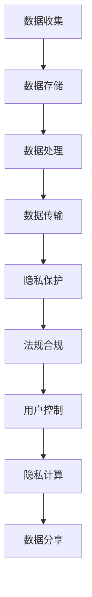

                 

# 数据隐私管理：在数字时代保护用户权益

> 关键词：数据隐私管理, 数字时代, 用户权益, 隐私保护, 法规合规, 隐私计算, 差分隐私, 数据匿名化, 用户控制

## 1. 背景介绍

### 1.1 问题由来
随着信息技术的发展，数字化、信息化已经成为现代社会的显著特征。人们在日常生活中，无论是教育、医疗、购物、社交，还是政治参与，都越来越依赖于数字技术。这种趋势既方便了人们的日常生活，同时也带来了数据隐私保护的严峻挑战。

近年来，全球范围内发生了一系列重大数据隐私泄露事件，如剑桥分析公司滥用用户数据操纵选情、比特币钱包发生大规模数据泄露等。这些事件不仅引起了公众对数据隐私的关注，也迫使各国政府和企业加强对数据隐私的保护。

数据隐私管理成为数字时代的重要课题。如何平衡数据流通与隐私保护，实现数据价值最大化与用户权益保护的双赢，已经成为当前各行业共同面临的难题。

### 1.2 问题核心关键点
数据隐私管理涉及的关键问题包括：
1. **数据收集与处理：**在数据收集、存储、处理、传输等过程中，如何确保数据的安全性和隐私性。
2. **隐私保护技术：**开发和应用隐私保护技术，如数据匿名化、差分隐私、隐私计算等，防止数据泄露。
3. **法规合规：**制定并遵守相关的隐私保护法规，如GDPR、CCPA等，确保数据处理的合规性。
4. **用户控制：**赋予用户对数据的知情权、选择权和控制权，使用户能够主动保护自己的隐私。
5. **隐私计算：**利用密码学技术，在数据不离开本地的条件下进行数据分析和共享，保障数据隐私。

这些问题需要从技术、法律和用户三个层面进行综合治理。本文将从数据隐私管理的核心概念、核心算法、具体实现和应用领域等方面进行深入探讨，旨在为数字时代的数据隐私保护提供指导。

## 2. 核心概念与联系

### 2.1 核心概念概述

数据隐私管理是关于如何收集、存储、使用和分享数据，同时保护个人隐私的概念和技术体系。其核心概念包括：

- **数据隐私（Data Privacy）**：指在数据处理过程中保护个人信息不被非法获取、使用或泄露的权利。
- **隐私保护（Privacy Protection）**：通过技术手段（如加密、匿名化等）和管理措施（如访问控制、法规合规等），保障数据隐私的安全。
- **用户权益（User Rights）**：用户对其个人信息的控制权、知情权、选择权和被遗忘权等。
- **法规合规（Regulatory Compliance）**：遵循《通用数据保护条例》（GDPR）、《加州消费者隐私法案》（CCPA）等隐私保护法规的要求。
- **隐私计算（Privacy Computing）**：在不共享原始数据的前提下，利用计算技术进行数据处理和分析，保护数据隐私。

这些概念之间相互联系，共同构成数据隐私管理的框架。理解这些概念及其联系，是开展数据隐私管理工作的基础。

### 2.2 核心概念原理和架构的 Mermaid 流程图



这个流程图展示了数据隐私管理的整体流程，从数据收集到隐私计算，每个环节都需注重隐私保护。

## 3. 核心算法原理 & 具体操作步骤

### 3.1 算法原理概述

数据隐私管理涉及多种算法和技术，主要包括：

- **数据匿名化（Data Anonymization）**：通过技术手段，如数据泛化、扰动、混淆等，使得数据无法关联到具体个人。
- **差分隐私（Differential Privacy）**：在数据分析过程中，加入随机噪声，确保个体数据无法被单独识别，从而保护数据隐私。
- **隐私计算（Privacy-Preserving Computing）**：通过密码学技术，在不共享原始数据的前提下，进行数据处理和分析。
- **访问控制（Access Control）**：基于角色访问控制（RBAC）等策略，限制对敏感数据的访问权限。
- **数据加密（Data Encryption）**：采用对称加密、非对称加密等技术，保护数据传输和存储的安全。

这些算法和技术各自有其独特的原理和实现方式，但共同目标都是为了在保障数据价值的前提下，保护数据隐私。

### 3.2 算法步骤详解

以下是数据隐私管理的基本操作步骤：

**Step 1: 数据收集与处理**

- **数据收集**：确保数据来源合法、透明，且已获得用户同意。
- **数据预处理**：清洗、归一化、标准化数据，准备用于后续处理。

**Step 2: 数据存储与传输**

- **数据存储**：使用加密技术存储数据，确保数据在存储过程中的安全。
- **数据传输**：采用端到端加密技术，保护数据在传输过程中的安全。

**Step 3: 隐私保护**

- **数据匿名化**：对敏感数据进行匿名化处理，如去除个人标识符。
- **差分隐私**：在数据分析过程中，加入随机噪声，保护个体隐私。
- **访问控制**：限制对敏感数据的访问权限，确保只有授权人员可以访问。

**Step 4: 法规合规**

- **法规合规性检查**：确保数据处理过程符合GDPR、CCPA等隐私保护法规。
- **数据使用记录**：记录数据使用的每一个步骤，便于审计和合规性检查。

**Step 5: 用户控制**

- **知情权**：确保用户对数据收集、处理和使用的知情权。
- **选择权**：赋予用户选择是否参与数据收集和使用。
- **控制权**：让用户能够随时撤回对数据的同意，行使被遗忘权。

**Step 6: 隐私计算**

- **计算协议**：设计隐私计算协议，如多方安全计算（MPC）、同态加密等。
- **结果分享**：在保护数据隐私的前提下，共享计算结果。

### 3.3 算法优缺点

数据隐私管理涉及的算法和技术各有优缺点，具体如下：

**数据匿名化**：
- **优点**：简单高效，适合数据量较大的场景。
- **缺点**：可能引入噪声，影响数据质量。

**差分隐私**：
- **优点**：严格保护个体隐私，适用于大数据分析。
- **缺点**：引入噪声后，数据精度下降。

**隐私计算**：
- **优点**：完全保护数据隐私，适用于需要多方协作的场景。
- **缺点**：技术复杂，实现难度大。

**访问控制**：
- **优点**：易于实现，适合中小企业应用。
- **缺点**：依赖于安全策略，容易被人为绕过。

**数据加密**：
- **优点**：确保数据传输和存储的安全。
- **缺点**：加密解密过程耗费计算资源。

选择适合的技术，根据具体场景进行综合应用，是实现数据隐私管理的核心。

### 3.4 算法应用领域

数据隐私管理的应用领域广泛，包括但不限于：

- **金融行业**：保护用户交易数据，防止欺诈行为。
- **医疗行业**：保护患者病历数据，确保医疗信息的隐私和安全。
- **社交媒体**：保护用户隐私，防止用户数据被滥用。
- **电子商务**：保护用户购物数据，防止恶意广告和欺诈。
- **公共安全**：保护敏感数据，防止数据被滥用于监控。

这些领域对数据隐私管理的需求不同，需要采取不同的技术手段进行保护。

## 4. 数学模型和公式 & 详细讲解 & 举例说明

### 4.1 数学模型构建

在数据隐私管理中，数学模型用于描述隐私保护算法的原理和效果。以下是几种常见的隐私保护数学模型：

- **差分隐私（Differential Privacy）**：
  - 定义：在查询结果中引入噪声，使得查询结果与查询数据集合的关系难以被单一数据点影响。
  - 数学公式：$\delta$-差分隐私模型的定义公式为：
    $$
    \mathcal{D}(\mathcal{L}(x)) = \sum_{x' \in \mathcal{X}} ||\mathcal{L}(x) - \mathcal{L}(x')|| \leq \exp(\epsilon)
    $$
    其中 $\mathcal{L}(x)$ 为查询结果，$x'$ 为查询数据集合中的任一数据点，$\epsilon$ 为隐私参数，$\delta$ 为隐私差错。

- **隐私计算（Privacy-Preserving Computing）**：
  - 定义：在不共享原始数据的前提下，通过加密技术进行数据处理和分析。
  - 数学公式：同态加密（Homomorphic Encryption）的计算过程可表示为：
    $$
    E(C(m)) = C(f(m))
    $$
    其中 $E$ 表示加密过程，$C$ 表示计算过程，$m$ 为原始数据，$f$ 为计算函数。

- **数据匿名化（Data Anonymization）**：
  - 定义：通过泛化、扰动、混淆等技术，将数据中可能泄露个人身份的信息进行处理。
  - 数学公式：K-匿名化（K-Anonymity）模型要求在相同泛化组中的记录不能被区分，可表示为：
    $$
    \forall x_1, x_2 \in X, K-Anonymity \text{ if } x_1 \sim x_2 \Rightarrow count(x_1) = count(x_2)
    $$
    其中 $X$ 为数据集合，$x_1$ 和 $x_2$ 为数据记录，$count$ 表示计数函数。

### 4.2 公式推导过程

以下是差分隐私和隐私计算模型的公式推导过程：

**差分隐私（Differential Privacy）**：

- **公式推导**：
  - 设 $\mathcal{D}(\mathcal{L}(x))$ 为查询结果的差分隐私定义，$\epsilon$ 为隐私参数，根据定义可知：
    $$
    \mathcal{D}(\mathcal{L}(x)) = \sum_{x' \in \mathcal{X}} ||\mathcal{L}(x) - \mathcal{L}(x')|| \leq \exp(\epsilon)
    $$
  - 假设查询结果为 $L(x)$，其中 $x$ 为数据记录，$x'$ 为查询数据集合中的任一数据点，$\epsilon$ 为隐私参数。根据差分隐私的定义，可以推导出：
    $$
    \mathcal{D}(\mathcal{L}(x)) \leq \exp(\epsilon)
    $$
    因此，可以通过控制隐私参数 $\epsilon$ 的值，来平衡数据隐私和查询结果的精度。

**隐私计算（Privacy-Preserving Computing）**：

- **公式推导**：
  - 同态加密（Homomorphic Encryption）是一种能够在加密状态下进行计算的加密技术，其基本原理为：
    $$
    E(C(m)) = C(f(m))
    $$
  - 其中 $E$ 表示加密过程，$C$ 表示计算过程，$m$ 为原始数据，$f$ 为计算函数。假设原始数据 $m$ 被加密后得到 $E(m)$，计算函数为 $f$，计算结果为 $C(m)$，则有：
    $$
    E(C(m)) = C(f(m))
    $$
  - 因此，通过同态加密，可以在不泄露原始数据的情况下，进行数据计算和分析。

### 4.3 案例分析与讲解

**案例一：银行客户数据保护**

银行需要收集客户的数据进行风险评估和贷款审批，但同时也需要保护客户隐私。

- **数据收集**：银行收集客户的身份证、住址、收入等信息。
- **数据存储与传输**：银行采用端到端加密技术，保护数据在传输过程中的安全。
- **隐私保护**：银行对客户数据进行差分隐私处理，确保单个客户的隐私不被泄露。
- **法规合规**：银行遵循GDPR法规，确保数据处理的合法性。
- **用户控制**：银行赋予客户对数据的知情权、选择权和控制权，客户可以随时撤回对数据的同意。

**案例二：医疗数据保护**

医院需要收集患者的病历数据进行疾病研究和诊断，但同时也需要保护患者的隐私。

- **数据收集**：医院收集患者的病历数据，包括姓名、年龄、病情等信息。
- **数据存储与传输**：医院采用加密技术存储数据，确保数据在存储过程中的安全。
- **隐私保护**：医院对病历数据进行匿名化处理，确保单个患者的隐私不被泄露。
- **法规合规**：医院遵循CCPA法规，确保数据处理的合法性。
- **用户控制**：患者对其病历数据有知情权、选择权和控制权，可以随时撤回对数据的同意。

## 5. 项目实践：代码实例和详细解释说明

### 5.1 开发环境搭建

在进行数据隐私管理实践前，需要先准备好开发环境。以下是使用Python进行PyTorch开发的环境配置流程：

1. 安装Anaconda：从官网下载并安装Anaconda，用于创建独立的Python环境。

2. 创建并激活虚拟环境：
```bash
conda create -n pytorch-env python=3.8 
conda activate pytorch-env
```

3. 安装PyTorch：根据CUDA版本，从官网获取对应的安装命令。例如：
```bash
conda install pytorch torchvision torchaudio cudatoolkit=11.1 -c pytorch -c conda-forge
```

4. 安装Keras：
```bash
pip install keras
```

5. 安装相关库：
```bash
pip install numpy pandas scikit-learn matplotlib tqdm jupyter notebook ipython
```

完成上述步骤后，即可在`pytorch-env`环境中开始数据隐私管理的实践。

### 5.2 源代码详细实现

下面我们以金融数据隐私保护为例，给出使用Keras进行差分隐私处理的PyTorch代码实现。

首先，定义差分隐私处理函数：

```python
import numpy as np
from keras import backend as K

def laplace机制（epsilon，delta）：
    lambda_ = 2 / epsilon
    sigma_ = np.sqrt(2 * np.log(2 / delta)) / lambda_
    return sigma_
```

然后，定义差分隐私处理的数据生成函数：

```python
def generate_data（n）：
    data = np.random.normal(0, 1, (n, 10))
    return data
```

接着，定义差分隐私处理的数据处理函数：

```python
def differential_privacy（data，epsilon，delta）：
    n = data.shape[0]
    sigma = laplace机制（epsilon，delta）
    noise = np.random.normal(0, sigma, n)
    return data + noise
```

最后，启动差分隐私处理流程并测试：

```python
epsilon = 1
delta = 0.01
data = generate_data（1000）
data_privacy = differential_privacy（data，epsilon，delta）
print（'原始数据形状'，data.shape）
print（'差分隐私处理后数据形状'，data_privacy.shape）
print（'差分隐私处理后数据'，data_privacy[:10]）
```

以上就是使用Keras对数据进行差分隐私处理的完整代码实现。可以看到，差分隐私处理过程非常简单，只需要定义好参数 epsilon 和 delta，即可对数据进行差分隐私处理。

### 5.3 代码解读与分析

让我们再详细解读一下关键代码的实现细节：

**laplace机制函数**：
- 该函数定义了Laplace机制的噪声生成方法，用于控制隐私参数 epsilon 和 delta。

**generate_data函数**：
- 该函数生成随机数据，用于测试差分隐私处理的效果。

**differential_privacy函数**：
- 该函数对数据进行差分隐私处理，引入噪声以保护数据隐私。
- 首先计算噪声标准差 sigma，然后通过随机噪声生成过程，将原始数据与噪声相加，得到差分隐私处理后的数据。

**测试代码**：
- 测试代码生成了1000个随机数据，进行差分隐私处理，并输出原始数据和差分隐私处理后的数据形状和部分数据内容。

## 6. 实际应用场景

### 6.1 智能客服系统

智能客服系统广泛应用在各行各业，通过自然语言处理（NLP）技术，实现智能问答和问题解决。然而，智能客服系统的数据隐私问题不容忽视。

- **数据收集**：智能客服系统需要收集用户的问题和反馈，用于训练和优化模型。
- **数据存储与传输**：智能客服系统采用端到端加密技术，保护用户数据在传输过程中的安全。
- **隐私保护**：智能客服系统对用户数据进行差分隐私处理，确保单个用户的隐私不被泄露。
- **法规合规**：智能客服系统遵循GDPR法规，确保数据处理的合法性。
- **用户控制**：用户对其数据有知情权、选择权和控制权，可以随时撤回对数据的同意。

**案例分析**：
- **场景一**：某电商平台智能客服系统收集用户购物反馈，用于改进产品和服务。
- **解决方案**：电商平台采用差分隐私处理技术，对用户反馈进行隐私化处理，确保用户隐私不被泄露。

### 6.2 医疗数据保护

医疗数据具有高度敏感性，其隐私保护问题尤为重要。医院需要对患者的病历数据进行差分隐私处理，以保护患者的隐私。

- **数据收集**：医院收集患者的病历数据，包括姓名、年龄、病情等信息。
- **数据存储与传输**：医院采用加密技术存储数据，确保数据在存储过程中的安全。
- **隐私保护**：医院对病历数据进行匿名化处理，确保单个患者的隐私不被泄露。
- **法规合规**：医院遵循CCPA法规，确保数据处理的合法性。
- **用户控制**：患者对其病历数据有知情权、选择权和控制权，可以随时撤回对数据的同意。

**案例分析**：
- **场景一**：某医院采用电子病历系统，收集患者的病历数据，用于疾病研究和诊断。
- **解决方案**：医院对病历数据进行匿名化处理，确保单个患者的隐私不被泄露。

### 6.3 金融数据保护

金融数据涉及个人隐私和财产安全，其隐私保护问题更为复杂。银行需要对客户的交易数据进行差分隐私处理，以保护客户的隐私。

- **数据收集**：银行收集客户的交易数据，包括账户余额、交易金额等信息。
- **数据存储与传输**：银行采用加密技术存储数据，确保数据在存储过程中的安全。
- **隐私保护**：银行对交易数据进行差分隐私处理，确保单个客户的隐私不被泄露。
- **法规合规**：银行遵循GDPR法规，确保数据处理的合法性。
- **用户控制**：客户对其交易数据有知情权、选择权和控制权，可以随时撤回对数据的同意。

**案例分析**：
- **场景一**：某银行采用智能理财系统，收集客户的交易数据，用于风险评估和投资建议。
- **解决方案**：银行对交易数据进行差分隐私处理，确保单个客户的隐私不被泄露。

## 7. 工具和资源推荐

### 7.1 学习资源推荐

为了帮助开发者系统掌握数据隐私管理的理论基础和实践技巧，这里推荐一些优质的学习资源：

1. 《数据隐私保护技术》：详细介绍了数据隐私保护的基本概念、技术原理和应用场景。
2. 《数据隐私保护法规》：介绍了GDPR、CCPA等隐私保护法规的详细内容和适用场景。
3. 《隐私计算基础》：介绍了隐私计算的基本原理、技术实现和应用案例。
4. 《差分隐私理论与实践》：介绍了差分隐私的理论基础和实际应用。
5. 《数据匿名化技术》：介绍了数据匿名化的基本原理和技术实现。

通过对这些资源的学习实践，相信你一定能够快速掌握数据隐私管理的精髓，并用于解决实际的隐私保护问题。

### 7.2 开发工具推荐

高效的开发离不开优秀的工具支持。以下是几款用于数据隐私管理开发的常用工具：

1. Apache Spark：开源的分布式计算框架，支持数据隐私计算和大数据处理。
2. TensorFlow Privacy：开源的隐私计算工具，支持差分隐私和隐私保护。
3. Keras：开源的深度学习框架，支持差分隐私和隐私计算。
4. PySyft：开源的隐私计算框架，支持差分隐私和联邦学习。
5. Cloud DLP：谷歌的云数据丢失预防服务，支持数据隐私保护和合规性检查。

合理利用这些工具，可以显著提升数据隐私管理的开发效率，加快创新迭代的步伐。

### 7.3 相关论文推荐

数据隐私管理的研究方向涉及多个前沿领域，以下是几篇奠基性的相关论文，推荐阅读：

1. "Differential Privacy" by C. Dwork, F. McSherry, A. Nissim and K. Smith：提出差分隐私的概念，奠定了差分隐私理论的基础。
2. "Homomorphic Encryption" by M. Juels and D. Boneh：提出同态加密的概念，是隐私计算领域的重要里程碑。
3. "Anonymization Techniques in the Age of Big Data" by S. Das, M. P. Pedersen and K. A. S. Kalra：详细介绍了数据匿名化的各种技术。
4. "Regulating Differential Privacy in AI" by J. Citrin, H. Havens and M. Javidi：探讨了差分隐私在AI领域的实际应用和合规性问题。
5. "Privacy-Preserving Data Mining" by M. Chaum and M. Simons：介绍了隐私计算的基本原理和技术实现。

这些论文代表了大数据隐私保护技术的发展脉络。通过学习这些前沿成果，可以帮助研究者把握学科前进方向，激发更多的创新灵感。

## 8. 总结：未来发展趋势与挑战

### 8.1 总结

本文对数据隐私管理的核心概念、核心算法和操作步骤进行了详细探讨。首先阐述了数据隐私管理的重要性和应用场景，明确了隐私保护技术在数字时代的重要性。其次，从算法原理和操作步骤方面，详细讲解了数据隐私管理的核心算法，包括数据匿名化、差分隐私、隐私计算等，并给出了具体的代码实现和测试方法。最后，从实际应用场景和未来展望方面，讨论了数据隐私管理在金融、医疗、智能客服等领域的实际应用，并提出了未来发展趋势和面临的挑战。

通过本文的系统梳理，可以看到，数据隐私管理在数字时代具有重要的意义和价值，是保障用户权益和数据安全的重要手段。未来，随着隐私保护技术的不断发展，数据隐私管理将更加全面、高效、智能，为数字时代的用户提供更好的隐私保护。

### 8.2 未来发展趋势

展望未来，数据隐私管理将呈现以下几个发展趋势：

1. **隐私计算技术的普及**：随着隐私计算技术的成熟和落地，隐私计算将在大数据、人工智能等领域广泛应用，为数据隐私保护提供新思路。
2. **差分隐私的优化**：差分隐私技术将继续发展和优化，更加灵活高效地应用于实际场景中，提高数据隐私保护的精度和可操作性。
3. **隐私保护技术的标准化**：隐私保护技术将逐步标准化，形成国际通用的隐私保护标准，为隐私保护技术的应用和推广提供有力支撑。
4. **隐私保护法规的完善**：隐私保护法规将不断完善，逐步覆盖更多的数据处理场景，保障用户的隐私权益。
5. **隐私计算与人工智能的融合**：隐私计算与人工智能技术的深度融合，将实现数据共享和协作，促进数据价值的最大化利用。

这些趋势将推动数据隐私管理的不断进步，为数字时代的数据安全和用户权益提供更强大的保障。

### 8.3 面临的挑战

尽管数据隐私管理已经取得了一定的进展，但在迈向更加智能化、普适化应用的过程中，它仍面临着诸多挑战：

1. **隐私保护技术的技术复杂性**：隐私保护技术涉及多个领域，包括密码学、分布式计算等，技术复杂度高，实现难度大。
2. **隐私保护法规的不完善**：不同国家和地区的隐私保护法规差异较大，缺乏统一的国际标准。
3. **隐私保护技术的应用推广**：隐私保护技术的应用推广需要大量的基础设施和资金投入，推广难度大。
4. **隐私保护与数据利用的平衡**：如何在保护隐私的同时，最大限度地利用数据价值，是隐私保护面临的重要难题。
5. **隐私保护的公平性**：隐私保护技术的应用可能会带来新的不公平，需要考虑如何在不同群体之间实现公平性。

正视隐私保护面临的这些挑战，积极应对并寻求突破，将是大数据隐私管理走向成熟的必由之路。相信随着学界和产业界的共同努力，这些挑战终将一一被克服，大数据隐私管理必将在构建人机协同的智能时代中扮演越来越重要的角色。

### 8.4 研究展望

面向未来，数据隐私管理需要从多个方面进行深入研究：

1. **隐私计算的多方协作**：研究多方安全计算（MPC）等隐私计算技术，实现多方协同计算，保护数据隐私。
2. **差分隐私的优化**：研究差分隐私的优化方法，提高差分隐私保护的效果和可操作性。
3. **隐私保护的标准化**：研究隐私保护技术标准化，形成统一的隐私保护标准，促进隐私保护技术的应用和推广。
4. **隐私保护与公平性**：研究隐私保护技术在实现数据共享的同时，保障不同群体之间的公平性。
5. **隐私保护的法规合规**：研究隐私保护法规的完善，逐步形成国际通用的隐私保护标准。

这些研究方向将引领数据隐私管理的不断进步，为数字时代的用户提供更好的隐私保护。

## 9. 附录：常见问题与解答

**Q1：数据隐私管理是否适用于所有数据场景？**

A: 数据隐私管理适用于涉及个人隐私的数据场景，如医疗、金融、智能客服等领域。对于公开数据和匿名数据，则无需进行隐私保护。

**Q2：隐私保护技术是否会影响数据质量？**

A: 隐私保护技术可能引入噪声，影响数据质量。但通过合理设计隐私保护算法，可以在保护隐私的同时，尽量减少对数据质量的影响。

**Q3：如何平衡隐私保护和数据利用？**

A: 在隐私保护和数据利用之间进行平衡，需要根据具体应用场景，选择合适的隐私保护技术，如差分隐私、隐私计算等。同时，也可以通过数据匿名化和数据加密等手段，保护数据隐私。

**Q4：隐私保护技术在实际应用中面临哪些挑战？**

A: 隐私保护技术在实际应用中面临技术复杂度高、法规不完善、推广难度大、公平性问题等挑战。需要从技术、法规和用户需求等多个方面进行综合治理。

**Q5：未来数据隐私管理的趋势是什么？**

A: 未来数据隐私管理将朝着隐私计算技术的普及、差分隐私的优化、隐私保护技术的标准化、隐私保护法规的完善和隐私计算与人工智能的融合等方向发展。

这些研究方向的探索，必将引领数据隐私管理的不断进步，为数字时代的用户提供更好的隐私保护。

---

作者：禅与计算机程序设计艺术 / Zen and the Art of Computer Programming

