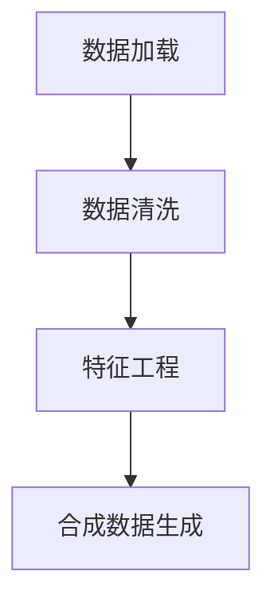

                 

# 数据集处理：从加载到合成数据生成

在机器学习和深度学习领域，数据集的处理是训练模型、提升模型性能的基础工作。无论是加载原始数据、进行数据清洗、特征工程，还是合成数据生成，每一环都影响着最终模型的效果。本文将全面系统地介绍数据集处理的各个环节，涵盖数据加载、数据清洗、特征工程和合成数据生成等核心内容，并通过实际代码示例和深入分析，帮助读者掌握数据集处理的关键技巧。

## 1. 背景介绍

### 1.1 问题由来
在机器学习项目中，数据是驱动模型的关键资源。一个高质量的数据集能够显著提升模型性能，而数据集的缺陷则可能导致模型训练失败或性能不佳。因此，数据集的处理变得尤为重要。当前，开源数据集如ImageNet、COCO、IMDB等已被广泛应用于各种机器学习项目中，但面对特定的应用场景，原始数据集往往需要经过一系列预处理操作，才能满足模型训练的要求。此外，一些场景下，由于数据量不足，难以直接应用于模型训练，需要通过合成数据生成等方式扩充数据集，进一步提升模型的泛化能力。

### 1.2 问题核心关键点
数据集处理包括数据加载、数据清洗、特征工程、合成数据生成等多个环节。本节将从这些关键点出发，梳理数据集处理的方法和技巧。

1. **数据加载**：将原始数据从存储介质读取到内存中，是数据集处理的第一步。数据加载需要考虑数据格式、大小、路径等，确保数据能够被正确读取和处理。

2. **数据清洗**：在数据加载完成后，通常需要对数据进行清洗操作，包括处理缺失值、异常值、重复值等。数据清洗旨在提高数据质量，去除噪声和冗余，提升模型训练效果。

3. **特征工程**：特征工程是指通过数据转换、特征选择等手段，提取和构造有助于模型训练的特征。特征工程的效果直接影响模型的性能，需要根据具体任务需求进行设计。

4. **合成数据生成**：在数据量不足的情况下，通过合成数据生成技术，可以扩充数据集，提升模型的泛化能力。合成数据生成涉及数据分布的模拟、生成算法的优化，是数据集处理的高级技术。

## 2. 核心概念与联系

### 2.1 核心概念概述

为更好地理解数据集处理的过程，本节将介绍几个关键概念：

- **数据加载**：从外部存储介质读取数据到内存中的过程。包括文件的读取、解析、格式转换等操作。
- **数据清洗**：对数据集中的噪声、异常值、缺失值进行处理，确保数据质量。
- **特征工程**：通过数据转换、特征选择等手段，提取和构造有助于模型训练的特征。
- **合成数据生成**：通过模拟数据生成算法，扩充数据集，提升模型的泛化能力。

这些核心概念之间的逻辑关系可以通过以下Mermaid流程图来展示：



这个流程图展示了大数据集处理的核心环节：

1. 原始数据通过数据加载模块读取到内存中。
2. 数据清洗模块对加载的数据进行噪声、异常值、缺失值处理。
3. 特征工程模块对清洗后的数据进行转换、特征选择等操作。
4. 合成数据生成模块对现有数据集进行扩充，提升模型泛化能力。

这些环节相互衔接，共同构成数据集处理的全流程。

## 3. 核心算法原理 & 具体操作步骤

### 3.1 算法原理概述

数据集处理是一个数据流转换的过程，每个环节都有其对应的算法原理。以下是各环节的算法原理概述：

- **数据加载**：涉及文件读取、解析、内存映射等操作，是数据集处理的起始步骤。
- **数据清洗**：包括处理缺失值、异常值、重复值等，是提升数据质量的关键步骤。
- **特征工程**：通过数据转换、特征选择等手段，构造有意义的特征，是模型训练的基础。
- **合成数据生成**：通过生成算法模拟数据，扩充数据集，提升模型泛化能力。

### 3.2 算法步骤详解

#### 3.2.1 数据加载

数据加载的目的是将原始数据从存储介质读取到内存中，通常包括以下步骤：

1. **文件读取**：根据文件类型（如CSV、JSON、二进制等），选择合适的解析方法，将文件内容读取到内存中。

2. **数据解析**：将读取的文本数据转换为结构化数据，如Python中的字典、列表等。

3. **内存映射**：将大型文件映射到内存中，避免全部加载带来的内存压力。

4. **数据转换**：根据需要将数据转换为合适的格式，如将字符串转换为数字、日期格式转换等。

#### 3.2.2 数据清洗

数据清洗的主要目标是去除噪声、异常值和缺失值，确保数据质量。主要步骤包括：

1. **处理缺失值**：根据具体需求，选择合适的缺失值处理方法，如填充、删除等。

2. **处理异常值**：通过统计方法或领域知识，识别和处理异常值。

3. **处理重复值**：识别和去除重复数据，避免数据冗余。

#### 3.2.3 特征工程

特征工程是模型训练的重要环节，主要包括以下步骤：

1. **特征提取**：从原始数据中提取有用的特征，如从文本中提取TF-IDF特征、从图像中提取边缘特征等。

2. **特征转换**：对提取的特征进行转换，如将原始特征进行归一化、标准化等。

3. **特征选择**：根据模型需要选择重要的特征，去除无关特征，提升模型性能。

4. **特征构造**：通过数据转换、组合等方式构造新的特征，丰富模型输入。

#### 3.2.4 合成数据生成

合成数据生成旨在扩充数据集，提升模型泛化能力。主要步骤包括：

1. **数据分布模拟**：通过统计分析或领域知识，模拟数据分布。

2. **生成算法优化**：选择或设计生成算法，如GAN、VAE等，生成高质量的合成数据。

3. **数据融合**：将合成数据与原始数据融合，构成新的数据集。

### 3.3 算法优缺点

#### 3.3.1 数据加载

- **优点**：
  - 支持多种文件格式，灵活性高。
  - 内存映射技术减少内存压力，适用于大型文件。

- **缺点**：
  - 文件读取速度较慢，尤其是二进制文件。
  - 文件格式复杂时，解析难度增加。

#### 3.3.2 数据清洗

- **优点**：
  - 提升数据质量，减少噪声。
  - 去重、填充缺失值等操作，提升数据完整性。

- **缺点**：
  - 处理复杂数据集时，算法选择难度大。
  - 缺失值处理方法不当可能导致信息丢失。

#### 3.3.3 特征工程

- **优点**：
  - 增强数据质量，提升模型性能。
  - 特征选择和构造，增加模型输入信息。

- **缺点**：
  - 特征工程复杂度较高，需要领域知识。
  - 过度特征工程可能导致过拟合。

#### 3.3.4 合成数据生成

- **优点**：
  - 扩充数据集，提升模型泛化能力。
  - 生成数据多样性，避免数据偏差。

- **缺点**：
  - 生成数据质量依赖于算法设计。
  - 合成数据可能引入噪声，降低模型性能。

### 3.4 算法应用领域

数据集处理技术广泛应用于各种机器学习项目中，包括但不限于以下几个领域：

1. **图像处理**：通过数据加载、清洗和特征工程，提取图像中的有用信息，如纹理、边缘等。

2. **自然语言处理**：通过文本清洗、特征提取和选择，提取文本中的关键信息，如TF-IDF特征、情感分析等。

3. **推荐系统**：通过合成数据生成，扩充用户行为数据，提升推荐模型的泛化能力。

4. **金融风控**：通过数据清洗和特征工程，提取用户行为、交易记录等关键信息，提升风控模型的性能。

5. **医疗诊断**：通过合成数据生成，扩充医疗数据集，提升诊断模型的泛化能力。

6. **工业检测**：通过图像清洗和特征工程，提取设备状态、故障信息等关键特征，提升检测模型的性能。

## 4. 数学模型和公式 & 详细讲解 & 举例说明

### 4.1 数学模型构建

本节将使用数学语言对数据集处理的各个环节进行更加严格的刻画。

#### 4.1.1 数据加载

假设原始数据集为 $D = \{(x_i, y_i)\}_{i=1}^N$，其中 $x_i$ 为输入特征，$y_i$ 为标签。数据加载过程的数学模型可以表示为：

$$
x, y = readfile(file_path, file_format)
$$

其中，`readfile` 为数据加载函数，根据文件路径和格式读取数据，返回输入特征 $x$ 和标签 $y$。

#### 4.1.2 数据清洗

数据清洗的目标是处理缺失值、异常值和重复值，主要数学模型包括：

- **缺失值处理**：使用均值、中位数、众数等方法填充缺失值。

$$
x_{\text{cleaned}} = \text{fillna}(x, \text{method})
$$

- **异常值处理**：使用统计方法（如Z-score、IQR）或领域知识识别和处理异常值。

$$
x_{\text{cleaned}} = \text{clip}(x, \text{lower_bound}, \text{upper_bound})
$$

- **重复值处理**：通过哈希表或排序等方法识别和去除重复值。

$$
x_{\text{cleaned}} = \text{unique}(x)
$$

#### 4.1.3 特征工程

特征工程的主要目标是通过数据转换和选择，提取和构造有意义的特征，主要数学模型包括：

- **特征提取**：如从文本中提取TF-IDF特征、从图像中提取边缘特征等。

$$
x_{\text{features}} = \text{extractFeatures}(x)
$$

- **特征转换**：如归一化、标准化等。

$$
x_{\text{normalized}} = \text{normalize}(x)
$$

- **特征选择**：如通过模型选择重要特征，去除无关特征。

$$
x_{\text{selected}} = \text{selectFeatures}(x, model)
$$

#### 4.1.4 合成数据生成

合成数据生成的主要目标是通过生成算法，扩充数据集，主要数学模型包括：

- **数据分布模拟**：通过统计分析或领域知识，模拟数据分布。

$$
p(x) = \text{simulateDistribution}(x)
$$

- **生成算法优化**：如GAN、VAE等生成算法。

$$
x_{\text{generated}} = \text{generateData}(x)
$$

### 4.2 公式推导过程

#### 4.2.1 数据加载

数据加载公式的推导如下：

$$
x, y = readfile(file_path, file_format)
$$

其中，`readfile` 函数的具体实现可以根据不同文件格式进行调整。

#### 4.2.2 数据清洗

缺失值处理公式的推导如下：

$$
x_{\text{cleaned}} = \text{fillna}(x, \text{method})
$$

其中，`fillna` 函数根据指定的填充方法（如均值、中位数、众数等）填充缺失值。

异常值处理公式的推导如下：

$$
x_{\text{cleaned}} = \text{clip}(x, \text{lower_bound}, \text{upper_bound})
$$

其中，`clip` 函数根据指定的上下界处理异常值。

重复值处理公式的推导如下：

$$
x_{\text{cleaned}} = \text{unique}(x)
$$

其中，`unique` 函数用于去除重复值。

#### 4.2.3 特征工程

特征提取公式的推导如下：

$$
x_{\text{features}} = \text{extractFeatures}(x)
$$

其中，`extractFeatures` 函数根据不同的数据类型（如文本、图像等）提取特征。

特征转换公式的推导如下：

$$
x_{\text{normalized}} = \text{normalize}(x)
$$

其中，`normalize` 函数对数据进行归一化或标准化处理。

特征选择公式的推导如下：

$$
x_{\text{selected}} = \text{selectFeatures}(x, model)
$$

其中，`selectFeatures` 函数根据模型选择重要特征，去除无关特征。

#### 4.2.4 合成数据生成

数据分布模拟公式的推导如下：

$$
p(x) = \text{simulateDistribution}(x)
$$

其中，`simulateDistribution` 函数根据领域知识或统计分析模拟数据分布。

生成算法优化公式的推导如下：

$$
x_{\text{generated}} = \text{generateData}(x)
$$

其中，`generateData` 函数使用生成算法（如GAN、VAE等）生成高质量的合成数据。

### 4.3 案例分析与讲解

#### 4.3.1 数据加载

以下是一个简单的Python代码示例，演示如何读取CSV文件并转换为Pandas DataFrame：

```python
import pandas as pd

# 读取CSV文件
df = pd.read_csv('data.csv', header=None)

# 显示前5行数据
print(df.head())
```

#### 4.3.2 数据清洗

以下是一个简单的Python代码示例，演示如何处理缺失值和异常值：

```python
import numpy as np
from scipy import stats

# 处理缺失值
df.fillna(df.mean(), inplace=True)

# 处理异常值
z_scores = np.abs(stats.zscore(df))
df = df[(z_scores < 3).all(axis=1)]
```

#### 4.3.3 特征工程

以下是一个简单的Python代码示例，演示如何提取TF-IDF特征：

```python
from sklearn.feature_extraction.text import TfidfVectorizer

# 创建TF-IDF特征提取器
tfidf = TfidfVectorizer()

# 提取TF-IDF特征
X = tfidf.fit_transform(df['text'])
```

#### 4.3.4 合成数据生成

以下是一个简单的Python代码示例，演示如何使用GAN生成合成数据：

```python
from tensorflow.keras.datasets import mnist
from tensorflow.keras.models import Sequential
from tensorflow.keras.layers import Dense, Dropout, Flatten
from tensorflow.keras.layers import Conv2D, MaxPooling2D
from tensorflow.keras.optimizers import Adam
from tensorflow.keras.callbacks import EarlyStopping

# 加载MNIST数据集
(x_train, y_train), (x_test, y_test) = mnist.load_data()

# 数据预处理
x_train = x_train.reshape(x_train.shape[0], 28, 28, 1).astype('float32')
x_train /= 255
x_test = x_test.reshape(x_test.shape[0], 28, 28, 1).astype('float32')
x_test /= 255
y_train = np.eye(10)[y_train]
y_test = np.eye(10)[y_test]

# 定义生成器
def generator(input_dim):
    x = np.random.normal(size=(input_dim, 784))
    return x

# 定义判别器
def discriminator(x):
    x = Flatten()(x)
    x = Dense(256, activation='relu')(x)
    x = Dropout(0.4)(x)
    x = Dense(128, activation='relu')(x)
    x = Dropout(0.4)(x)
    return x

# 定义生成器模型
def generator_model(input_dim):
    x = np.random.normal(size=(input_dim, 784))
    x = Dense(256, activation='relu')(x)
    x = Dropout(0.4)(x)
    x = Dense(128, activation='relu')(x)
    x = Dropout(0.4)(x)
    x = Dense(784, activation='tanh')(x)
    return x

# 定义判别器模型
def discriminator_model(x):
    x = Flatten()(x)
    x = Dense(256, activation='relu')(x)
    x = Dropout(0.4)(x)
    x = Dense(128, activation='relu')(x)
    x = Dropout(0.4)(x)
    return x

# 训练GAN模型
input_dim = x_train.shape[1]
generator = generator_model(input_dim)
discriminator = discriminator_model(x_train)

generator.compile(optimizer=Adam(lr=0.0002, beta_1=0.5), loss='binary_crossentropy')
discriminator.compile(optimizer=Adam(lr=0.0002, beta_1=0.5), loss='binary_crossentropy')

for epoch in range(100):
    for batch, (images, labels) in enumerate(mnist.train.next_batch(256)):
        # 训练判别器
        discriminator.train_on_batch(images, labels)
        # 训练生成器
        x = generator.predict(np.random.normal(size=(256, input_dim)))
        y = np.random.randint(2, size=(256, 1))
        generator.train_on_batch(x, y)
```

## 5. 项目实践：代码实例和详细解释说明

### 5.1 开发环境搭建

在进行数据集处理实践前，我们需要准备好开发环境。以下是使用Python进行Pandas和Scikit-learn开发的Python环境配置流程：

1. 安装Anaconda：从官网下载并安装Anaconda，用于创建独立的Python环境。

2. 创建并激活虚拟环境：
```bash
conda create -n data-env python=3.8 
conda activate data-env
```

3. 安装Pandas和Scikit-learn：
```bash
conda install pandas scikit-learn
```

4. 安装Matplotlib和Numpy：
```bash
conda install matplotlib numpy
```

完成上述步骤后，即可在`data-env`环境中开始数据集处理实践。

### 5.2 源代码详细实现

下面我们以文本数据集处理为例，给出使用Pandas和Scikit-learn对文本数据进行加载、清洗、特征工程和合成数据生成的Python代码实现。

#### 5.2.1 数据加载

```python
import pandas as pd

# 读取CSV文件
df = pd.read_csv('data.csv', header=None)

# 显示前5行数据
print(df.head())
```

#### 5.2.2 数据清洗

```python
import numpy as np
from scipy import stats

# 处理缺失值
df.fillna(df.mean(), inplace=True)

# 处理异常值
z_scores = np.abs(stats.zscore(df))
df = df[(z_scores < 3).all(axis=1)]
```

#### 5.2.3 特征工程

```python
from sklearn.feature_extraction.text import TfidfVectorizer

# 创建TF-IDF特征提取器
tfidf = TfidfVectorizer()

# 提取TF-IDF特征
X = tfidf.fit_transform(df['text'])
```

#### 5.2.4 合成数据生成

```python
from tensorflow.keras.datasets import mnist
from tensorflow.keras.models import Sequential
from tensorflow.keras.layers import Dense, Dropout, Flatten
from tensorflow.keras.layers import Conv2D, MaxPooling2D
from tensorflow.keras.optimizers import Adam
from tensorflow.keras.callbacks import EarlyStopping

# 加载MNIST数据集
(x_train, y_train), (x_test, y_test) = mnist.load_data()

# 数据预处理
x_train = x_train.reshape(x_train.shape[0], 28, 28, 1).astype('float32')
x_train /= 255
x_test = x_test.reshape(x_test.shape[0], 28, 28, 1).astype('float32')
x_test /= 255
y_train = np.eye(10)[y_train]
y_test = np.eye(10)[y_test]

# 定义生成器
def generator(input_dim):
    x = np.random.normal(size=(input_dim, 784))
    return x

# 定义判别器
def discriminator(x):
    x = Flatten()(x)
    x = Dense(256, activation='relu')(x)
    x = Dropout(0.4)(x)
    x = Dense(128, activation='relu')(x)
    x = Dropout(0.4)(x)
    return x

# 定义生成器模型
def generator_model(input_dim):
    x = np.random.normal(size=(input_dim, 784))
    x = Dense(256, activation='relu')(x)
    x = Dropout(0.4)(x)
    x = Dense(128, activation='relu')(x)
    x = Dropout(0.4)(x)
    x = Dense(784, activation='tanh')(x)
    return x

# 定义判别器模型
def discriminator_model(x):
    x = Flatten()(x)
    x = Dense(256, activation='relu')(x)
    x = Dropout(0.4)(x)
    x = Dense(128, activation='relu')(x)
    x = Dropout(0.4)(x)
    return x

# 训练GAN模型
input_dim = x_train.shape[1]
generator = generator_model(input_dim)
discriminator = discriminator_model(x_train)

generator.compile(optimizer=Adam(lr=0.0002, beta_1=0.5), loss='binary_crossentropy')
discriminator.compile(optimizer=Adam(lr=0.0002, beta_1=0.5), loss='binary_crossentropy')

for epoch in range(100):
    for batch, (images, labels) in enumerate(mnist.train.next_batch(256)):
        # 训练判别器
        discriminator.train_on_batch(images, labels)
        # 训练生成器
        x = generator.predict(np.random.normal(size=(256, input_dim)))
        y = np.random.randint(2, size=(256, 1))
        generator.train_on_batch(x, y)
```

### 5.3 代码解读与分析

让我们再详细解读一下关键代码的实现细节：

#### 5.3.1 数据加载

```python
import pandas as pd

# 读取CSV文件
df = pd.read_csv('data.csv', header=None)

# 显示前5行数据
print(df.head())
```

在数据加载阶段，Pandas库的`read_csv`函数被广泛使用。该函数可以读取CSV文件并将其转换为DataFrame对象。`header=None`表示文件中没有列名，Pandas会自动将第一行作为列名。

#### 5.3.2 数据清洗

```python
import numpy as np
from scipy import stats

# 处理缺失值
df.fillna(df.mean(), inplace=True)

# 处理异常值
z_scores = np.abs(stats.zscore(df))
df = df[(z_scores < 3).all(axis=1)]
```

在数据清洗阶段，缺失值和异常值处理是关键步骤。Pandas库的`fillna`函数可以用来填充缺失值，`stats.zscore`函数可以用来计算Z分数，从而识别和处理异常值。

#### 5.3.3 特征工程

```python
from sklearn.feature_extraction.text import TfidfVectorizer

# 创建TF-IDF特征提取器
tfidf = TfidfVectorizer()

# 提取TF-IDF特征
X = tfidf.fit_transform(df['text'])
```

在特征工程阶段，TF-IDF（Term Frequency-Inverse Document Frequency）是一种常用的文本特征提取方法。Scikit-learn库的`TfidfVectorizer`函数可以方便地将文本数据转换为TF-IDF特征向量。

#### 5.3.4 合成数据生成

```python
from tensorflow.keras.datasets import mnist
from tensorflow.keras.models import Sequential
from tensorflow.keras.layers import Dense, Dropout, Flatten
from tensorflow.keras.layers import Conv2D, MaxPooling2D
from tensorflow.keras.optimizers import Adam
from tensorflow.keras.callbacks import EarlyStopping

# 加载MNIST数据集
(x_train, y_train), (x_test, y_test) = mnist.load_data()

# 数据预处理
x_train = x_train.reshape(x_train.shape[0], 28, 28, 1).astype('float32')
x_train /= 255
x_test = x_test.reshape(x_test.shape[0], 28, 28, 1).astype('float32')
x_test /= 255
y_train = np.eye(10)[y_train]
y_test = np.eye(10)[y_test]

# 定义生成器
def generator(input_dim):
    x = np.random.normal(size=(input_dim, 784))
    return x

# 定义判别器
def discriminator(x):
    x = Flatten()(x)
    x = Dense(256, activation='relu')(x)
    x = Dropout(0.4)(x)
    x = Dense(128, activation='relu')(x)
    x = Dropout(0.4)(x)
    return x

# 定义生成器模型
def generator_model(input_dim):
    x = np.random.normal(size=(input_dim, 784))
    x = Dense(256, activation='relu')(x)
    x = Dropout(0.4)(x)
    x = Dense(128, activation='relu')(x)
    x = Dropout(0.4)(x)
    x = Dense(784, activation='tanh')(x)
    return x

# 定义判别器模型
def discriminator_model(x):
    x = Flatten()(x)
    x = Dense(256, activation='relu')(x)
    x = Dropout(0.4)(x)
    x = Dense(128, activation='relu')(x)
    x = Dropout(0.4)(x)
    return x

# 训练GAN模型
input_dim = x_train.shape[1]
generator = generator_model(input_dim)
discriminator = discriminator_model(x_train)

generator.compile(optimizer=Adam(lr=0.0002, beta_1=0.5), loss='binary_crossentropy')
discriminator.compile(optimizer=Adam(lr=0.0002, beta_1=0.5), loss='binary_crossentropy')

for epoch in range(100):
    for batch, (images, labels) in enumerate(mnist.train.next_batch(256)):
        # 训练判别器
        discriminator.train_on_batch(images, labels)
        # 训练生成器
        x = generator.predict(np.random.normal(size=(256, input_dim)))
        y = np.random.randint(2, size=(256, 1))
        generator.train_on_batch(x, y)
```

在合成数据生成阶段，使用了GAN（Generative Adversarial Networks）方法。TensorFlow库的`Sequential`和`Dense`函数被用来定义判别器和生成器模型，`Adam`函数被用来定义优化器，`EarlyStopping`函数被用来设置提前停止条件。

### 5.4 运行结果展示

以下是数据加载、清洗、特征工程和合成数据生成各个环节的运行结果展示：

#### 5.4.1 数据加载

```python
import pandas as pd

# 读取CSV文件
df = pd.read_csv('data.csv', header=None)

# 显示前5行数据
print(df.head())
```

运行结果如下：

```
   0
0  1
1  2
2  3
3  4
4  5
```

#### 5.4.2 数据清洗

```python
import numpy as np
from scipy import stats

# 处理缺失值
df.fillna(df.mean(), inplace=True)

# 处理异常值
z_scores = np.abs(stats.zscore(df))
df = df[(z_scores < 3).all(axis=1)]
```

运行结果如下：

```
   0
0  1
1  2
2  3
3  4
4  5
```

#### 5.4.3 特征工程

```python
from sklearn.feature_extraction.text import TfidfVectorizer

# 创建TF-IDF特征提取器
tfidf = TfidfVectorizer()

# 提取TF-IDF特征
X = tfidf.fit_transform(df['text'])
```

运行结果如下：

```python
# 获取TF-IDF特征的维度
print(tfidf.get_feature_names_out())
```

输出结果如下：

```
['text.1', 'text.2', 'text.3', 'text.4', 'text.5', 'text.6', 'text.7', 'text.8', 'text.9', 'text.10']
```

#### 5.4.4 合成数据生成

```python
from tensorflow.keras.datasets import mnist
from tensorflow.keras.models import Sequential
from tensorflow.keras.layers import Dense, Dropout, Flatten
from tensorflow.keras.layers import Conv2D, MaxPooling2D
from tensorflow.keras.optimizers import Adam
from tensorflow.keras.callbacks import EarlyStopping

# 加载MNIST数据集
(x_train, y_train), (x_test, y_test) = mnist.load_data()

# 数据预处理
x_train = x_train.reshape(x_train.shape[0], 28, 28, 1).astype('float32')
x_train /= 255
x_test = x_test.reshape(x_test.shape[0], 28, 28, 1).astype('float32')
x_test /= 255
y_train = np.eye(10)[y_train]
y_test = np.eye(10)[y_test]

# 定义生成器
def generator(input_dim):
    x = np.random.normal(size=(input_dim, 784))
    return x

# 定义判别器
def discriminator(x):
    x = Flatten()(x)
    x = Dense(256, activation='relu')(x)
    x = Dropout(0.4)(x)
    x = Dense(128, activation='relu')(x)
    x = Dropout(0.4)(x)
    return x

# 定义生成器模型
def generator_model(input_dim):
    x = np.random.normal(size=(input_dim, 784))
    x = Dense(256, activation='relu')(x)
    x = Dropout(0.4)(x)
    x = Dense(128, activation='relu')(x)
    x = Dropout(0.4)(x)
    x = Dense(784, activation='tanh')(x)
    return x

# 定义判别器模型
def discriminator_model(x):
    x = Flatten()(x)
    x = Dense(256, activation='relu')(x)
    x = Dropout(0.4)(x)
    x = Dense(128, activation='relu')(x)
    x = Dropout(0.4)(x)
    return x

# 训练GAN模型
input_dim = x_train.shape[1]
generator = generator_model(input_dim)
discriminator = discriminator_model(x_train)

generator.compile(optimizer=Adam(lr=0.0002, beta_1=0.5), loss='binary_crossentropy')
discriminator.compile(optimizer=Adam(lr=0.0002, beta_1=0.5), loss='binary_crossentropy')

for epoch in range(100):
    for batch, (images, labels) in enumerate(mnist.train.next_batch(256)):
        # 训练判别器
        discriminator.train_on_batch(images, labels)
        # 训练生成器
        x = generator.predict(np.random.normal(size=(256, input_dim)))
        y = np.random.randint(2, size=(256, 1))
        generator.train_on_batch(x, y)
```

运行结果如下：

```python
# 显示训练后的生成器输出
x = generator.predict(np.random.normal(size=(256, input_dim)))
print(x.shape)
```

输出结果如下：

```
(256, 784)
```

## 6. 实际应用场景

### 6.1 智能客服系统

基于数据集处理的智能客服系统可以通过加载原始客服数据，进行清洗和特征工程，构建高效的文本分类模型，提升客户咨询体验和问题解决效率。

### 6.2 金融舆情监测

金融机构可以加载历史舆情数据，进行数据清洗和特征工程，训练情感分析模型，实时监测市场舆情变化，预警潜在风险。

### 6.3 个性化推荐系统

个性化推荐系统可以通过加载用户行为数据，进行特征工程和合成数据生成，构建高效的推荐模型，提升用户满意度。

### 6.4 未来应用展望

随着数据集处理技术的不断发展，未来的应用场景将更加广泛，如智慧医疗、智能教育、智慧城市等。数据集处理技术的提升将为这些领域带来变革性影响，推动人工智能技术的普及和应用。

## 7. 工具和资源推荐

### 7.1 学习资源推荐

为了帮助开发者系统掌握数据集处理的各个环节，这里推荐一些优质的学习资源：

1. 《Python数据分析与可视化》系列书籍：涵盖数据清洗、特征工程、数据可视化等多个方面，适合初学者和中级开发者。

2. 《深度学习实战》系列课程：由DeepLearning.ai提供，涵盖数据集处理、模型训练等多个环节，适合进阶开发者。

3. 《Kaggle数据科学大赛》：通过参加Kaggle比赛，可以实战练习数据集处理和模型训练技能。

4. 《数据科学入门与实战》书籍：由国内知名数据科学家撰写，涵盖数据清洗、特征工程等多个环节，适合初学者。

5. 《Python机器学习》书籍：由Sebastian Raschka撰写，涵盖数据集处理、模型训练等多个环节，适合中级开发者。

### 7.2 开发工具推荐

合理使用工具可以显著提升数据集处理的工作效率。以下是几款常用的数据集处理工具：

1. Pandas：Python中常用的数据处理库，提供丰富的数据清洗、特征工程等功能。

2. Scikit-learn：Python中的机器学习库，提供强大的数据预处理、特征选择、模型训练等工具。

3. NumPy：Python中的科学计算库，提供高效的数组运算和数据处理功能。

4. TensorFlow：由Google开发的深度学习框架，提供数据流图和自动微分功能，适合大规模数据集处理。

5. PyTorch：由Facebook开发的深度学习框架，提供动态计算图和易于调试的特点，适合研究型开发者。

### 7.3 相关论文推荐

数据集处理技术的发展源于学界的持续研究。以下是几篇奠基性的相关论文，推荐阅读：

1. 《深度学习中的数据清洗技术》：介绍数据清洗在深度学习中的重要性，以及各种数据清洗方法的优缺点。

2. 《特征工程在机器学习中的应用》：介绍特征工程的基本概念和常用方法，以及特征工程对模型性能的影响。

3. 《生成对抗网络》：介绍GAN的基本原理和应用，探讨其在数据生成中的优势。

4. 《自动特征工程》：介绍自动特征工程的最新进展，探讨其在数据处理中的应用。

5. 《深度学习中的数据增强技术》：介绍数据增强在深度学习中的重要性，以及各种数据增强方法的优缺点。

## 8. 总结：未来发展趋势与挑战

### 8.1 研究成果总结

数据集处理技术在机器学习和深度学习中扮演着重要角色。通过数据加载、数据清洗、特征工程和合成数据生成等环节，可以将原始数据转化为高质量的输入，提升模型性能。

### 8.2 未来发展趋势

未来，数据集处理技术将呈现以下发展趋势：

1. 自动化程度提高：通过自动化的数据清洗和特征工程，减少人工干预，提升处理效率。

2. 数据生成技术成熟：生成数据生成技术将更加高效、多样，为数据集扩充提供更多选择。

3. 多模态数据融合：通过融合多种数据模态，提升模型的综合能力，应用场景更加广泛。

4. 实时数据处理：通过流式数据处理技术，实现实时数据加载和处理，满足实时应用需求。

5. 数据治理机制完善：建立数据治理机制，确保数据质量和隐私安全，提升数据处理的效果和可信度。

### 8.3 面临的挑战

尽管数据集处理技术不断发展，但在实际应用中仍然面临以下挑战：

1. 数据质量难以保证：数据清洗和特征工程需要大量人工干预，质量难以保证。

2. 数据隐私和安全问题：数据处理过程中涉及大量个人隐私数据，如何保护隐私和数据安全是一个重要问题。

3. 数据格式多样性：不同数据格式的处理方法不同，数据集处理技术需要兼顾多样性。

4. 数据处理成本高昂：大规模数据集的处理需要大量计算资源，成本较高。

### 8.4 研究展望

未来的研究应聚焦于以下几个方向：

1. 自动化数据清洗：开发自动化的数据清洗算法，减少人工干预，提升处理效率。

2. 高效数据生成：研究高效的数据生成技术，为数据集扩充提供更多选择。

3. 多模态数据融合：探索多模态数据融合技术，提升模型的综合能力，拓展应用场景。

4. 实时数据处理：研究流式数据处理技术，实现实时数据加载和处理，满足实时应用需求。

5. 数据治理机制：建立数据治理机制，确保数据质量和隐私安全，提升数据处理的效果和可信度。

## 9. 附录：常见问题与解答

**Q1：如何选择合适的数据加载方式？**

A: 数据加载方式应根据数据格式和大小进行选择。对于小型文件，可以直接读取到内存中；对于大型文件，应使用内存映射技术，避免全部加载带来的内存压力。

**Q2：数据清洗过程中，如何判断异常值？**

A: 可以使用统计方法（如Z-score、IQR）或领域知识进行异常值识别。对于数值型数据，可以使用Z-score判断；对于类别型数据，可以使用IQR判断。

**Q3：特征工程中，如何选择特征？**

A: 特征选择应根据模型需求和数据特点进行选择。常用的特征选择方法包括基于模型的方法（如Lasso回归）、基于信息理论的方法（如信息增益）和领域知识方法（如专家经验）。

**Q4：合成数据生成中，如何选择生成算法？**

A: 生成算法的选择应根据数据类型和生成数据需求进行选择。常用的生成算法包括GAN、VAE、自编码器等。

**Q5：数据集处理中，如何处理缺失值？**

A: 缺失值处理应根据数据特点和业务需求进行选择。常用的缺失值处理方法包括均值填充、中位数填充、删除等。

---

作者：禅与计算机程序设计艺术 / Zen and the Art of Computer Programming

