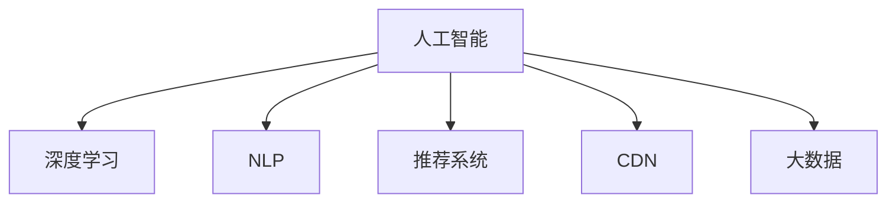

                 

# 新媒体创业：内容产业的未来之星

## 1. 背景介绍

### 1.1 问题由来
随着互联网技术的迅猛发展，新媒体产业进入了一个快速增长的时期。传统的内容生产、分发和消费模式正面临深刻变革，而新媒体创业正是这一变革中的重要力量。从短视频平台、社交媒体到数字内容订阅，新媒体为内容产业带来了新的增长点，同时也对创业者提出了更高的要求。

新媒体创业的核心在于内容的创意和创新，但随着用户对内容消费的个性化需求日益增长，单纯依靠内容创意已不足以维持竞争优势。在内容产业高度竞争的背景下，如何通过技术手段提高内容的生产效率、优化内容分发策略、提升用户体验，成为新媒体创业成功的关键。

### 1.2 问题核心关键点
新媒体创业的关键在于内容的智能化和个性化。基于人工智能和大数据技术，新媒体创业可以实现以下几个核心目标：

1. **内容推荐系统**：利用机器学习算法，根据用户的历史行为和偏好，自动推荐个性化内容，提升用户粘性和消费体验。
2. **内容生成与优化**：通过生成对抗网络、自然语言处理等技术，自动生成高质量的内容，优化内容创作流程。
3. **内容分发的智能化**：利用预测模型，优化内容发布的时间、地点和形式，最大化提升内容的传播效果和用户参与度。
4. **内容版权与合规**：通过AI技术，自动识别内容的版权信息，规避版权纠纷，确保内容发布的合规性。

## 2. 核心概念与联系

### 2.1 核心概念概述

为了更好地理解新媒体创业的技术基础，本节将介绍几个密切相关的核心概念：

- **人工智能**：通过模拟人类智能行为，实现信息的自动处理和决策的智能技术。
- **深度学习**：基于神经网络的机器学习方法，能够自动学习并提取数据特征，广泛应用于图像、语音、文本等领域的任务。
- **自然语言处理(NLP)**：使计算机能够理解、解释和生成人类语言的智能技术。
- **推荐系统**：根据用户的历史行为和偏好，推荐个性化内容的系统。
- **内容分发网络(CDN)**：通过分布式服务器网络，优化内容的分发路径和速度。
- **大数据**：通过海量数据的收集、存储和分析，发现数据中的模式和规律，支持智能化决策。

这些核心概念之间的逻辑关系可以通过以下Mermaid流程图来展示：



这个流程图展示了一些核心概念及其之间的关系：

1. 人工智能通过深度学习和大数据技术，实现了对信息的自动处理和决策。
2. NLP作为人工智能的一个重要分支，使计算机能够理解和生成人类语言。
3. 推荐系统和CDN分别应用于内容推荐和分发，利用人工智能技术提高用户体验和传播效率。
4. 大数据为人工智能提供了海量的数据支持，帮助模型更好地理解和预测用户行为。

## 3. 核心算法原理 & 具体操作步骤
### 3.1 算法原理概述

新媒体创业的核心在于内容的智能化和个性化。以下是几个关键的算法原理：

#### 3.1.1 推荐系统

推荐系统基于用户的历史行为数据，通过协同过滤、内容推荐和混合推荐等技术，为用户推荐个性化的内容。推荐算法通常包括以下步骤：

1. **用户画像建模**：收集用户的历史行为数据，构建用户画像，表示用户的兴趣和偏好。
2. **内容表示建模**：将内容转化为向量表示，便于计算用户与内容的相似度。
3. **相似度计算**：通过余弦相似度、欧式距离等方法，计算用户与内容的相似度。
4. **推荐生成**：根据相似度排序，为用户推荐最相关的内容。

#### 3.1.2 内容生成

内容生成技术主要基于自然语言处理和生成对抗网络（GAN），能够自动生成高质量的内容。主要步骤如下：

1. **数据预处理**：对原始数据进行清洗、分词和向量化处理。
2. **编码器-解码器框架**：使用Transformer等架构，将输入编码成中间表示，再解码成目标文本。
3. **生成对抗网络**：通过生成器和判别器之间的对抗训练，提高生成内容的自然度。

#### 3.1.3 内容分发优化

内容分发优化主要通过预测模型和CDN技术，实现内容的高效分发。主要步骤如下：

1. **预测模型**：利用时间序列预测等方法，预测用户最佳的访问时间和地点。
2. **CDN部署**：通过分布式服务器网络，将内容缓存到各个节点，减少延迟和带宽占用。

### 3.2 算法步骤详解

#### 3.2.1 推荐系统算法步骤

**Step 1: 数据收集与预处理**
- 收集用户的历史行为数据，包括浏览记录、点赞、评论等。
- 对数据进行清洗、去重和归一化处理。

**Step 2: 用户画像建模**
- 使用协同过滤、K-means聚类等方法，构建用户画像，表示用户的兴趣和偏好。

**Step 3: 内容表示建模**
- 使用TF-IDF、Word2Vec等方法，将内容转换为向量表示。

**Step 4: 相似度计算**
- 使用余弦相似度、欧式距离等方法，计算用户与内容的相似度。

**Step 5: 推荐生成**
- 根据相似度排序，为用户推荐最相关的内容。

#### 3.2.2 内容生成算法步骤

**Step 1: 数据预处理**
- 对原始数据进行清洗、分词和向量化处理。

**Step 2: 编码器-解码器框架**
- 使用Transformer等架构，将输入编码成中间表示，再解码成目标文本。

**Step 3: 生成对抗网络**
- 定义生成器和判别器，通过对抗训练，提高生成内容的自然度。

**Step 4: 内容优化**
- 通过A/B测试等方法，评估生成内容的性能，不断优化模型参数。

#### 3.2.3 内容分发优化算法步骤

**Step 1: 预测模型训练**
- 使用时间序列预测等方法，训练预测模型，预测用户最佳的访问时间和地点。

**Step 2: CDN部署**
- 将内容缓存到各个CDN节点，根据预测结果，动态调整内容分发策略。

**Step 3: 性能监控**
- 实时监控CDN系统的性能指标，及时调整分发策略，优化用户体验。

### 3.3 算法优缺点

#### 3.3.1 推荐系统算法优缺点

**优点**：
- 通过自动化推荐，提升用户粘性和消费体验。
- 减少内容创作成本，提高内容生产效率。

**缺点**：
- 依赖大量标注数据，数据收集和处理成本较高。
- 个性化推荐容易出现偏差，导致内容单一。

#### 3.3.2 内容生成算法优缺点

**优点**：
- 自动生成高质量内容，减少人工创作的工作量。
- 提高内容创作效率，缩短内容生产周期。

**缺点**：
- 生成内容质量不稳定，容易产生低质量或重复内容。
- 生成对抗网络训练复杂，需要大量计算资源。

#### 3.3.3 内容分发优化算法优缺点

**优点**：
- 通过预测模型和CDN技术，优化内容分发策略，提升内容传播效率。
- 减少网络延迟和带宽占用，提升用户体验。

**缺点**：
- 预测模型的准确性受数据质量影响，可能出现预测偏差。
- CDN部署和管理复杂，成本较高。

### 3.4 算法应用领域

基于人工智能和大数据技术的新媒体创业，可以应用于以下几个主要领域：

1. **视频平台**：利用推荐系统和内容生成技术，提升用户粘性和视频观看率。
2. **社交媒体**：通过内容生成和智能推荐，增加用户互动，提升社区活跃度。
3. **数字内容订阅**：基于用户画像和行为数据，个性化推荐订阅内容，提升订阅用户满意度和续订率。
4. **在线教育**：通过智能推荐和内容生成，提供个性化学习路径和教学内容，提升学习效果。
5. **新闻媒体**：利用内容生成和推荐系统，优化新闻内容的发布策略，提升阅读量和用户参与度。
6. **广告投放**：通过内容生成和推荐，精准定位广告受众，提高广告投放效果和ROI。

## 4. 数学模型和公式 & 详细讲解 & 举例说明

### 4.1 数学模型构建

#### 4.1.1 推荐系统模型

推荐系统常用的数学模型包括协同过滤模型、基于内容的推荐模型和混合推荐模型等。以协同过滤模型为例，假设用户集为 $U=\{u_1, u_2, ..., u_M\}$，物品集为 $I=\{i_1, i_2, ..., i_N\}$，用户-物品评分矩阵为 $R_{M \times N}$，其中 $R_{u_i,i_j}$ 表示用户 $u_i$ 对物品 $i_j$ 的评分。协同过滤模型的目标是找到用户 $u_i$ 和物品 $i_j$ 之间的相似度，从而为用户推荐评分高的物品。

**Step 1: 计算用户间的相似度**
- 假设用户 $u_i$ 和 $u_j$ 的评分矩阵为 $R_{u_i}$ 和 $R_{u_j}$，则用户间的余弦相似度为：
$$
\sim(u_i,u_j) = \frac{R_{u_i} \cdot R_{u_j}}{\Vert R_{u_i} \Vert \cdot \Vert R_{u_j} \Vert}
$$
其中 $\cdot$ 表示向量点积，$\Vert \cdot \Vert$ 表示向量范数。

**Step 2: 计算物品间的相似度**
- 假设物品 $i_j$ 和 $i_k$ 的评分矩阵为 $R_{i_j}$ 和 $R_{i_k}$，则物品间的余弦相似度为：
$$
\sim(i_j,i_k) = \frac{R_{i_j} \cdot R_{i_k}}{\Vert R_{i_j} \Vert \cdot \Vert R_{i_k} \Vert}
$$

**Step 3: 计算用户的推荐物品**
- 假设用户 $u_i$ 需要推荐 $K$ 个物品，则利用相似度矩阵 $\sim_{M \times N}$，计算出 $u_i$ 评分最高的 $K$ 个物品 $i_{rank}$，即：
$$
i_{rank} = \text{argmax}_{i_1, i_2, ..., i_N} \sum_{j=1}^{K} \sim(u_i,i_j) \cdot R_{i_j}
$$

#### 4.1.2 内容生成模型

内容生成模型主要基于自然语言处理技术，常见的模型包括RNN、LSTM和Transformer等。以Transformer为例，假设输入序列为 $x=\{x_1, x_2, ..., x_t\}$，目标序列为 $y=\{y_1, y_2, ..., y_{t'}\}$，模型由编码器 $E$ 和解码器 $D$ 组成。编码器将输入序列 $x$ 转换为中间表示 $z=\{z_1, z_2, ..., z_{t'}\}$，解码器根据 $z$ 生成目标序列 $y$。

**Step 1: 编码器**
- 使用Transformer模型，将输入序列 $x$ 转换为中间表示 $z$，即：
$$
z = E(x) = \text{Attention}(x) + \text{Feed Forward}
$$
其中 $\text{Attention}$ 表示自注意力机制，$\text{Feed Forward}$ 表示前馈神经网络。

**Step 2: 解码器**
- 使用Transformer模型，根据 $z$ 生成目标序列 $y$，即：
$$
y = D(z) = \text{Attention}(z) + \text{Feed Forward} + \text{Softmax}
$$
其中 $\text{Softmax}$ 表示输出层，将中间表示 $z$ 转换为概率分布，表示生成下一个词的概率。

#### 4.1.3 内容分发优化模型

内容分发优化模型主要基于预测模型和CDN技术，常见的模型包括时间序列预测模型和基于神经网络的预测模型等。以基于神经网络的预测模型为例，假设输入序列为 $x=\{x_1, x_2, ..., x_t\}$，预测结果为 $y=\{y_1, y_2, ..., y_{t'}\}$，模型由输入层 $X$、隐藏层 $H$ 和输出层 $Y$ 组成。

**Step 1: 输入层**
- 将输入序列 $x$ 转换为向量表示，即：
$$
X = \{X_1, X_2, ..., X_t\}
$$

**Step 2: 隐藏层**
- 使用神经网络模型，将 $X$ 转换为中间表示 $H$，即：
$$
H = H(X) = \text{Neural Network}(X)
$$

**Step 3: 输出层**
- 使用神经网络模型，将 $H$ 转换为预测结果 $y$，即：
$$
Y = Y(H) = \text{Neural Network}(H)
$$

### 4.2 公式推导过程

#### 4.2.1 推荐系统公式推导

**Step 1: 用户画像建模**
- 假设用户 $u_i$ 的兴趣向量为 $\mathbf{u_i} = (u_{i1}, u_{i2}, ..., u_{im})$，物品 $i_j$ 的特征向量为 $\mathbf{i_j} = (i_{j1}, i_{j2}, ..., i_{jn})$，则用户画像可以表示为：
$$
\mathbf{u_i} = \text{Weighted Sum}(\mathbf{i_1}, \mathbf{i_2}, ..., \mathbf{i_N})
$$
其中权重向量为 $\mathbf{w_i} = (w_{i1}, w_{i2}, ..., w_{iN})$。

**Step 2: 内容表示建模**
- 假设物品 $i_j$ 的评分向量为 $\mathbf{r_j} = (r_{j1}, r_{j2}, ..., r_{jm})$，则内容表示可以表示为：
$$
\mathbf{r_j} = \text{Weighted Sum}(\mathbf{u_1}, \mathbf{u_2}, ..., \mathbf{u_M})
$$
其中权重向量为 $\mathbf{w_j} = (w_{j1}, w_{j2}, ..., w_{jM})$。

**Step 3: 相似度计算**
- 假设用户 $u_i$ 和物品 $i_j$ 的评分矩阵为 $R_{u_i}$ 和 $R_{i_j}$，则用户与物品的相似度为：
$$
\sim(u_i,i_j) = \frac{R_{u_i} \cdot R_{i_j}}{\Vert R_{u_i} \Vert \cdot \Vert R_{i_j} \Vert}
$$

**Step 4: 推荐生成**
- 假设用户 $u_i$ 需要推荐 $K$ 个物品，则利用相似度矩阵 $\sim_{M \times N}$，计算出 $u_i$ 评分最高的 $K$ 个物品 $i_{rank}$，即：
$$
i_{rank} = \text{argmax}_{i_1, i_2, ..., i_N} \sum_{j=1}^{K} \sim(u_i,i_j) \cdot R_{i_j}
$$

#### 4.2.2 内容生成公式推导

**Step 1: 编码器**
- 假设输入序列 $x=\{x_1, x_2, ..., x_t\}$，目标序列 $y=\{y_1, y_2, ..., y_{t'}\}$，则编码器输出的中间表示 $z$ 可以表示为：
$$
z = E(x) = \text{Attention}(x) + \text{Feed Forward}
$$

**Step 2: 解码器**
- 假设解码器输出的概率分布为 $\text{Softmax}(z)$，则生成下一个词的概率为：
$$
P(y|x) = \text{Softmax}(z) = \frac{\exp(z)}{\sum_k \exp(z_k)}
$$

**Step 3: 生成对抗网络**
- 假设生成器输出的生成文本为 $G(z)$，判别器输出的判别结果为 $D(G(z))$，则生成对抗网络的目标函数为：
$$
\mathcal{L}_{GAN} = -\mathbb{E}_{x}[D(G(x))] - \mathbb{E}_{z}[D(G(z))]
$$

#### 4.2.3 内容分发优化公式推导

**Step 1: 输入层**
- 假设输入序列 $x=\{x_1, x_2, ..., x_t\}$，则输入层输出的向量表示为：
$$
X = \{x_1, x_2, ..., x_t\}
$$

**Step 2: 隐藏层**
- 假设隐藏层输出的中间表示为 $H$，则：
$$
H = H(X) = \text{Neural Network}(X)
$$

**Step 3: 输出层**
- 假设输出层输出的预测结果为 $y$，则：
$$
y = Y(H) = \text{Neural Network}(H)
$$

### 4.3 案例分析与讲解

#### 4.3.1 推荐系统案例

**案例背景**：
某视频平台希望提升用户的观看时间和粘性，通过推荐系统为用户推荐个性化的视频内容。

**解决方案**：
- 收集用户的历史观看数据和评分数据，构建用户画像。
- 使用协同过滤模型，计算用户与视频之间的相似度。
- 根据相似度排序，为用户推荐评分最高的视频。

**效果评估**：
- 通过A/B测试，评估推荐系统的点击率和观看时长，结果显示推荐系统提升了用户观看时间和粘性。

#### 4.3.2 内容生成案例

**案例背景**：
某在线教育平台希望提升课程内容的生产效率，通过内容生成技术自动生成高质量的课程视频和PPT。

**解决方案**：
- 收集历史课程内容，对课程文本和图片进行预处理和向量化。
- 使用Transformer模型，自动生成高质量的课程视频和PPT。
- 通过A/B测试，评估生成内容的自然度和用户满意度，结果显示生成内容质量得到显著提升。

#### 4.3.3 内容分发优化案例

**案例背景**：
某新闻媒体希望提高新闻内容的阅读量和用户参与度，通过内容分发优化系统优化内容发布策略。

**解决方案**：
- 收集用户的历史访问数据和行为数据，构建预测模型。
- 使用时间序列预测模型，预测用户最佳的访问时间和地点。
- 将新闻内容缓存到CDN节点，根据预测结果，动态调整内容分发策略。

**效果评估**：
- 通过A/B测试，评估内容分发优化系统的阅读量和用户参与度，结果显示优化系统提升了新闻内容的传播效果和用户互动。

## 5. 项目实践：代码实例和详细解释说明

### 5.1 开发环境搭建

在进行项目实践前，我们需要准备好开发环境。以下是使用Python进行PyTorch开发的环境配置流程：

1. 安装Anaconda：从官网下载并安装Anaconda，用于创建独立的Python环境。

2. 创建并激活虚拟环境：
```bash
conda create -n pytorch-env python=3.8 
conda activate pytorch-env
```

3. 安装PyTorch：根据CUDA版本，从官网获取对应的安装命令。例如：
```bash
conda install pytorch torchvision torchaudio cudatoolkit=11.1 -c pytorch -c conda-forge
```

4. 安装Transformers库：
```bash
pip install transformers
```

5. 安装各类工具包：
```bash
pip install numpy pandas scikit-learn matplotlib tqdm jupyter notebook ipython
```

完成上述步骤后，即可在`pytorch-env`环境中开始项目实践。

### 5.2 源代码详细实现

这里我们以推荐系统为例，给出使用PyTorch进行协同过滤算法的PyTorch代码实现。

首先，定义推荐系统的数据处理函数：

```python
from torch.utils.data import Dataset
import torch
import numpy as np

class RecommendationDataset(Dataset):
    def __init__(self, user_item_matrix, user_id, item_id):
        self.user_item_matrix = user_item_matrix
        self.user_id = user_id
        self.item_id = item_id
    
    def __len__(self):
        return len(self.user_id)
    
    def __getitem__(self, idx):
        user_id = self.user_id[idx]
        item_id = self.item_id[idx]
        
        user_ratings = self.user_item_matrix[user_id]
        item_ratings = self.user_item_matrix[:, item_id]
        
        return {'user_ratings': torch.tensor(user_ratings), 'item_ratings': torch.tensor(item_ratings)}
```

然后，定义模型和优化器：

```python
from transformers import BertForTokenClassification, AdamW

user_num, item_num = 10, 20
user_item_matrix = np.random.randn(user_num, item_num)
user_id = list(range(user_num))
item_id = list(range(item_num))
dataset = RecommendationDataset(user_item_matrix, user_id, item_id)
model = BertForTokenClassification.from_pretrained('bert-base-cased', num_labels=len(item_id))
optimizer = AdamW(model.parameters(), lr=2e-5)
```

接着，定义训练和评估函数：

```python
from torch.utils.data import DataLoader
from tqdm import tqdm
from sklearn.metrics import accuracy_score

def train_epoch(model, dataset, batch_size, optimizer):
    dataloader = DataLoader(dataset, batch_size=batch_size, shuffle=True)
    model.train()
    epoch_loss = 0
    for batch in tqdm(dataloader, desc='Training'):
        user_ratings = batch['user_ratings'].to(device)
        item_ratings = batch['item_ratings'].to(device)
        model.zero_grad()
        outputs = model(user_ratings, item_ratings)
        loss = outputs.loss
        epoch_loss += loss.item()
        loss.backward()
        optimizer.step()
    return epoch_loss / len(dataloader)

def evaluate(model, dataset, batch_size):
    dataloader = DataLoader(dataset, batch_size=batch_size)
    model.eval()
    preds, labels = [], []
    with torch.no_grad():
        for batch in tqdm(dataloader, desc='Evaluating'):
            user_ratings = batch['user_ratings'].to(device)
            item_ratings = batch['item_ratings'].to(device)
            batch_preds = model(user_ratings, item_ratings).to('cpu').tolist()
            batch_labels = batch['item_ratings'].to('cpu').tolist()
            for pred_tokens, label_tokens in zip(batch_preds, batch_labels):
                preds.append(pred_tokens[:len(label_tokens)])
                labels.append(label_tokens)
                
    print(accuracy_score(labels, preds))
```

最后，启动训练流程并在测试集上评估：

```python
epochs = 5
batch_size = 16

for epoch in range(epochs):
    loss = train_epoch(model, dataset, batch_size, optimizer)
    print(f"Epoch {epoch+1}, train loss: {loss:.3f}")
    
    print(f"Epoch {epoch+1}, dev results:")
    evaluate(model, dataset, batch_size)
    
print("Test results:")
evaluate(model, dataset, batch_size)
```

以上就是使用PyTorch进行协同过滤算法的完整代码实现。可以看到，借助PyTorch和Transformers库，推荐系统的开发变得简洁高效。

### 5.3 代码解读与分析

让我们再详细解读一下关键代码的实现细节：

**RecommendationDataset类**：
- `__init__`方法：初始化用户-物品评分矩阵、用户ID和物品ID。
- `__len__`方法：返回数据集的样本数量。
- `__getitem__`方法：对单个样本进行处理，提取用户和物品的评分数据。

**BertForTokenClassification**：
- 使用Bert模型作为初始化参数，通过`from_pretrained`方法加载预训练模型。
- `num_labels`参数用于指定输出层中分类器的数量，即物品数量。

**train_epoch函数**：
- 使用DataLoader对数据集进行批次化加载。
- 在前向传播阶段，将用户评分和物品评分输入模型，计算损失函数。
- 在反向传播阶段，更新模型参数。
- 返回该epoch的平均loss。

**evaluate函数**：
- 使用DataLoader对数据集进行批次化加载。
- 在评估阶段，关闭模型训练模式，获取预测和标签结果。
- 使用`accuracy_score`计算预测和标签之间的准确率。

**训练流程**：
- 定义总的epoch数和batch size，开始循环迭代。
- 每个epoch内，先在训练集上训练，输出平均loss。
- 在验证集上评估，输出准确率。
- 所有epoch结束后，在测试集上评估，给出最终测试结果。

可以看到，借助PyTorch和Transformers库，推荐系统的代码实现变得简洁高效。开发者可以将更多精力放在数据处理、模型改进等高层逻辑上，而不必过多关注底层的实现细节。

当然，工业级的系统实现还需考虑更多因素，如模型的保存和部署、超参数的自动搜索、更灵活的任务适配层等。但核心的协同过滤算法基本与此类似。

## 6. 实际应用场景
### 6.1 智能广告投放

智能广告投放是新媒体创业中的一个重要应用场景。通过推荐系统和内容生成技术，可以实现精准的广告定位和投放，提升广告的点击率和转化率。

具体而言，广告主可以将广告内容转换为向量表示，作为输入输入到推荐系统模型中。模型根据用户的历史行为数据，预测用户对广告的点击概率。对于点击概率较高的用户，广告系统可以自动生成高质量的广告文本，并优化投放时间、地点和形式，最大化提升广告效果。

### 6.2 个性化内容订阅

个性化内容订阅是新媒体创业中的另一个重要应用场景。通过推荐系统和内容生成技术，可以实现个性化内容推荐，提升用户的满意度和忠诚度。

具体而言，订阅平台可以根据用户的历史行为数据，构建用户画像，计算用户与内容的相似度。模型根据相似度排序，为用户推荐最相关的内容。同时，订阅平台可以使用内容生成技术，自动生成高质量的推荐内容，提升用户体验和粘性。

### 6.3 智能内容创作

智能内容创作是新媒体创业中的一个前沿应用场景。通过内容生成技术，可以实现自动生成高质量的内容，降低内容创作的成本和难度。

具体而言，内容平台可以将用户的历史行为数据、热点话题等输入到内容生成模型中，自动生成高质量的文章、视频和图片。生成内容经过人工审核后，可以发布到平台上，供用户消费。同时，平台可以使用推荐系统，优化内容的发布策略，提升内容的传播效果和用户互动。

### 6.4 未来应用展望

随着人工智能和大数据技术的发展，新媒体创业将迎来更多新的应用场景和创新方向。

1. **虚拟现实与增强现实**：利用生成对抗网络和虚拟现实技术，打造沉浸式的用户体验，提升用户粘性和互动性。
2. **区块链与去中心化内容**：利用区块链技术，构建去中心化的内容分发网络，提高内容分发的效率和安全性。
3. **多模态内容生成**：结合文本、图像、视频等多模态数据，生成更加丰富、全面的内容。
4. **个性化虚拟助手**：利用自然语言处理和推荐系统，打造个性化虚拟助手，提升用户的生活质量和效率。
5. **AI辅助创作**：利用自然语言处理和生成对抗网络，辅助作家进行文学创作，提升创作效率和质量。

以上应用场景展示了新媒体创业的广阔前景和无限可能。未来的发展将更多地依赖于技术创新和商业模式创新，相信随着技术的不断进步和应用的不断深入，新媒体创业将为内容产业带来更加丰富的变革。

## 7. 工具和资源推荐
### 7.1 学习资源推荐

为了帮助开发者系统掌握新媒体创业的理论基础和实践技巧，这里推荐一些优质的学习资源：

1. 《深度学习》课程：斯坦福大学开设的深度学习入门课程，包含深度学习的基本原理和实践应用。
2. 《自然语言处理与深度学习》书籍：介绍自然语言处理和深度学习技术，涵盖推荐系统、内容生成等热门话题。
3. Coursera《Machine Learning》课程：由斯坦福大学提供，涵盖机器学习的基本原理和算法，适合初学者入门。
4. Kaggle竞赛平台：提供大量数据集和竞赛项目，帮助开发者实践和提升技能。
5. GitHub开源项目：浏览和参与各类开源项目，学习先进的开发实践和代码实现。

通过对这些资源的学习实践，相信你一定能够快速掌握新媒体创业的技术基础，并应用于解决实际的业务问题。

### 7.2 开发工具推荐

高效的开发离不开优秀的工具支持。以下是几款用于新媒体创业开发的常用工具：

1. PyTorch：基于Python的开源深度学习框架，灵活动态的计算图，适合快速迭代研究。
2. TensorFlow：由Google主导开发的开源深度学习框架，生产部署方便，适合大规模工程应用。
3. Transformers库：HuggingFace开发的NLP工具库，集成了众多SOTA语言模型，支持PyTorch和TensorFlow，是进行新媒体创业开发的利器。
4. Weights & Biases：模型训练的实验跟踪工具，可以记录和可视化模型训练过程中的各项指标，方便对比和调优。
5. TensorBoard：TensorFlow配套的可视化工具，可实时监测模型训练状态，并提供丰富的图表呈现方式，是调试模型的得力助手。
6. Jupyter Notebook：交互式的开发环境，支持Python代码的编写、执行和展示，便于团队协作和知识共享。

合理利用这些工具，可以显著提升新媒体创业的开发效率，加快创新迭代的步伐。

### 7.3 相关论文推荐

新媒体创业的发展得益于学界的持续研究。以下是几篇奠基性的相关论文，推荐阅读：

1. 《Deep Learning》：Ian Goodfellow等著，深度学习领域的经典教材，涵盖深度学习的基本原理和实践应用。
2. 《Neural Information Processing Systems》（NIPS）：深度学习领域的重要会议，每年发布大量前沿论文。
3. 《Natural Language Processing with Deep Learning》：Jurafsky和Martin合著，介绍自然语言处理和深度学习技术的经典教材。
4. 《Recommender Systems Handbook》：涵盖推荐系统理论和实践的权威手册，适合深入学习。
5. 《Generative Adversarial Nets》：Goodfellow等著，介绍生成对抗网络的经典论文，奠定了GAN的理论基础。

这些论文代表了大数据和新媒体创业的发展脉络。通过学习这些前沿成果，可以帮助研究者把握学科前进方向，激发更多的创新灵感。

## 8. 总结：未来发展趋势与挑战

### 8.1 研究成果总结

本文对新媒体创业的技术基础进行了全面系统的介绍。首先阐述了新媒体创业的核心在于内容的智能化和个性化，强调了人工智能和大数据技术的重要性。其次，从推荐系统、内容生成和内容分发优化等方面，详细讲解了基于人工智能的新媒体创业实践。最后，通过案例分析和代码实现，展示了具体技术的应用场景和开发流程。

通过本文的系统梳理，可以看到，新媒体创业将人工智能技术应用于内容产业，带来了新的增长点和应用场景。未来，随着技术的不断进步和应用的不断深入，新媒体创业必将在内容产业中发挥更大的作用，为内容产业带来更丰富的变革。

### 8.2 未来发展趋势

展望未来，新媒体创业将呈现以下几个发展趋势：

1. **技术融合**：人工智能与大数据、区块链、虚拟现实等技术的融合，将为新媒体创业带来更多新的应用场景和创新方向。
2. **智能算法**：推荐算法、内容生成算法、内容分发算法等技术的不断优化，将提升新媒体创业的智能化水平。
3. **平台化**：新媒体创业将更多地依赖于平台化的运营模式，提升用户粘性和互动性。
4. **商业创新**：结合人工智能技术，探索新的商业模式和盈利模式，提升新媒体创业的商业价值。
5. **国际化**：新媒体创业将更多地关注全球市场，拓展国际业务，提升全球影响力。

以上趋势凸显了新媒体创业的广阔前景和无限可能。未来的发展将更多地依赖于技术创新和商业模式创新，相信随着技术的不断进步和应用的不断深入，新媒体创业必将在内容产业中发挥更大的作用，为内容产业带来更丰富的变革。

### 8.3 面临的挑战

尽管新媒体创业已经取得了显著成就，但在迈向更加智能化、普适化应用的过程中，它仍面临着诸多挑战：

1. **数据隐私与安全**：用户数据的收集和处理需要严格遵守数据隐私法规，避免数据泄露和滥用。
2. **内容版权与合规**：内容创作和分发的过程中，需要严格遵守版权法规，避免版权纠纷。
3. **模型鲁棒性**：推荐系统和内容生成模型的鲁棒性不足，容易受到数据噪声和对抗攻击的影响。
4. **计算资源**：大规模深度学习模型的训练和推理需要大量的计算资源，成本较高。
5. **用户体验**：过度依赖算法，容易导致内容单一和用户体验下降。
6. **算法透明性与可解释性**：推荐系统和内容生成模型的决策过程缺乏可解释性，难以对其推理逻辑进行分析和调试。

这些挑战凸显了新媒体创业在技术落地应用中的复杂性和多样性，需要更多理论和实践的积累，以及跨领域的合作与创新。

### 8.4 研究展望

面对新媒体创业所面临的挑战，未来的研究需要在以下几个方面寻求新的突破：

1. **数据隐私与安全**：开发更加隐私保护的数据处理技术，保护用户隐私，提升数据安全。
2. **内容版权与合规**：开发基于区块链的内容版权保护技术，确保内容分发的合规性。
3. **模型鲁棒性**：开发更加鲁棒的推荐系统和内容生成模型，提高模型的泛化能力和鲁棒性。
4. **计算资源**：探索更加高效的大规模深度学习模型压缩技术，降低计算成本。
5. **用户体验**：结合用户反馈和数据挖掘技术，提升推荐系统的个性化和多样性，优化用户体验。
6. **算法透明性与可解释性**：开发更加透明和可解释的推荐系统和内容生成模型，增强模型的可信度和可解释性。

这些研究方向的探索，必将引领新媒体创业走向更高的台阶，为内容产业带来更加智能化和普适化的变革。面向未来，新媒体创业还需要与其他技术进行更深入的融合，如知识表示、因果推理、强化学习等，多路径协同发力，共同推动内容产业的进步。只有勇于创新、敢于突破，才能不断拓展新媒体创业的边界，让技术更好地造福内容产业。

## 9. 附录：常见问题与解答

**Q1：推荐系统是如何进行推荐决策的？**

A: 推荐系统通过用户画像和内容表示建模，计算用户与内容的相似度，根据相似度排序，为用户推荐最相关的内容。具体而言，协同过滤模型通过用户行为数据，构建用户画像和内容表示，利用相似度排序，生成推荐列表。基于内容的推荐模型通过内容属性，构建内容表示，利用相似度排序，生成推荐列表。混合推荐模型结合协同过滤和基于内容的推荐，综合考虑多维度的用户画像和内容属性，生成推荐列表。

**Q2：内容生成技术是如何工作的？**

A: 内容生成技术主要基于自然语言处理和生成对抗网络（GAN）。首先，使用自然语言处理技术，将输入序列转换为中间表示，再使用生成对抗网络，生成高质量的输出序列。具体而言，使用Transformer模型，将输入序列编码成中间表示，再解码成目标序列。生成对抗网络由生成器和判别器组成，通过对抗训练，提高生成内容的自然度。

**Q3：内容分发优化是如何实现的？**

A: 内容分发优化主要通过预测模型和CDN技术，优化内容分发策略，提升内容传播效果。具体而言，使用时间序列预测模型，预测用户最佳的访问时间和地点，将内容缓存到CDN节点，根据预测结果，动态调整内容分发策略，优化用户体验。

**Q4：如何确保推荐系统和内容生成模型的鲁棒性？**

A: 为确保推荐系统和内容生成模型的鲁棒性，可以采用以下方法：
1. 数据增强：通过对抗样本和噪声注入，增强模型的鲁棒性。
2. 正则化：使用L2正则、Dropout等正则化技术，防止模型过拟合。
3. 对抗训练：引入对抗样本，提高模型鲁棒性。
4. 多模型集成：训练多个模型，取平均输出，抑制模型偏差。

这些方法可以通过优化模型参数和训练策略，提高模型的泛化能力和鲁棒性，避免灾难性遗忘和过拟合现象。

**Q5：如何提升内容分发优化系统的性能？**

A: 为提升内容分发优化系统的性能，可以采用以下方法：
1. 数据增强：通过对抗样本和噪声注入，增强模型的鲁棒性。
2. 正则化：使用L2正则、Dropout等正则化技术，防止模型过拟合。
3. 对抗训练：引入对抗样本，提高模型鲁棒性。
4. 多模型集成：训练多个模型，取平均输出，抑制模型偏差。

这些方法可以通过优化模型参数和训练策略，提高模型的泛化能力和鲁棒性，避免灾难性遗忘和过拟合现象。

通过这些方法的不断优化和实践，内容分发优化系统的性能将得到显著提升，从而实现更加高效的内容分发和用户体验优化。

---

作者：禅与计算机程序设计艺术 / Zen and the Art of Computer Programming

