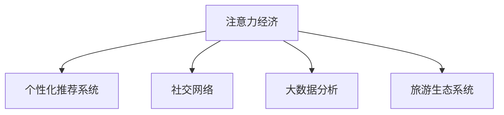

                 

# 旅游业如何在注意力经济中突围

旅游业，作为全球经济的重要组成部分，近年来面临数字化转型的压力。在互联网和移动设备的普及下，消费者对于旅游信息的获取和体验需求日益增长，传统旅游模式逐渐被新型的注意力经济所替代。本文将从注意力经济的概念、旅游业面临的挑战、解决方案以及未来展望等方面进行深入探讨，帮助旅游业在注意力经济中突围。

## 1. 背景介绍

### 1.1 问题由来
随着互联网的普及，信息爆炸的时代，消费者获取信息的渠道日益增多，注意力成为了一种稀缺资源。传统的旅游宣传方式，如电视广告、户外海报等，面临着成本高、效果差的问题。如何吸引消费者的注意力，成为旅游业亟待解决的问题。

### 1.2 问题核心关键点
在注意力经济时代，旅游业的突围离不开对消费者注意力的有效利用。核心关键点包括：
1. 如何获取和分析消费者注意力分布，识别出潜在的高价值客户群体。
2. 如何在消费者注意力聚焦的时段和渠道，提供高质量的旅游信息和体验。
3. 如何利用数据驱动决策，优化旅游产品的设计和推广策略。
4. 如何构建智能化的旅游生态系统，提升客户满意度和忠诚度。

## 2. 核心概念与联系

### 2.1 核心概念概述

为了更好地理解旅游业在注意力经济中的突围策略，本节将介绍几个密切相关的核心概念：

- 注意力经济(Attention Economy)：指在信息过载的时代，消费者注意力成为稀缺资源，企业和品牌需要通过创意和创新手段，吸引和保持消费者的注意力，实现商业价值。
- 个性化推荐系统：利用用户的浏览、点击、购买等行为数据，推荐系统能够预测用户的兴趣，提供个性化的内容和服务。
- 社交网络：如微信、微博、抖音等平台，通过用户互动和内容传播，影响和塑造消费者的消费行为和偏好。
- 大数据分析：通过数据挖掘和分析，识别出消费者行为模式和需求变化，指导旅游产品的设计和推广策略。
- 旅游生态系统：包括旅游产品、旅行社、酒店、交通、景点等，通过数字化和智能化，提升整个旅游产业链的效率和服务质量。

这些核心概念之间的逻辑关系可以通过以下Mermaid流程图来展示：



这个流程图展示出注意力经济如何通过个性化推荐系统、社交网络、大数据分析等手段，最终影响和优化旅游生态系统的各个环节。

## 3. 核心算法原理 & 具体操作步骤
### 3.1 算法原理概述

旅游业在注意力经济中的突围，本质上是通过数字化手段，获取、分析、利用消费者注意力，实现精准营销和个性化服务的过程。核心算法包括：

- 注意力模型：利用机器学习算法，分析消费者的注意力分布和行为模式，识别出潜在的高价值客户群体。
- 推荐算法：基于用户的兴趣和行为数据，生成个性化的旅游产品推荐，提高用户满意度和转化率。
- 社交网络分析：通过社交媒体数据分析，发现和引导话题热点，提升品牌影响力和口碑效应。
- 大数据分析：利用大数据分析技术，预测市场趋势和用户需求，优化旅游产品的设计和推广策略。

这些算法共同构成了一个闭环的系统，从注意力获取到分析和应用，再到最终的效果反馈，实现对旅游市场的精准干预和优化。

### 3.2 算法步骤详解

以下是旅游业在注意力经济中的突围的具体操作步骤：

**Step 1: 数据采集与处理**
- 收集用户的浏览、点击、购买等行为数据，包括社交媒体、在线旅游平台、酒店预订平台等。
- 清洗和整合数据，构建用户画像和行为轨迹。

**Step 2: 注意力模型训练**
- 使用机器学习算法（如协同过滤、深度学习等），训练注意力模型，识别出用户的注意力分布和偏好。
- 利用用户行为数据，对模型进行优化，提高预测的准确性和覆盖率。

**Step 3: 个性化推荐**
- 根据注意力模型和用户画像，生成个性化的旅游产品推荐。
- 优化推荐算法，提高推荐的精准度和多样性。

**Step 4: 社交网络分析**
- 分析社交媒体上的话题热点和用户互动，发现潜在的热门目的地和旅游趋势。
- 利用社交网络分析技术，识别出具有高影响力的意见领袖和品牌代言人。

**Step 5: 大数据分析**
- 利用大数据分析技术，预测市场趋势和用户需求，指导旅游产品的设计和推广策略。
- 通过A/B测试等方法，验证和优化推荐算法和推广策略。

**Step 6: 效果评估与优化**
- 收集用户反馈和行为数据，评估个性化推荐和推广策略的效果。
- 根据效果反馈，不断优化模型和策略，提升用户体验和转化率。

### 3.3 算法优缺点

注意力经济范式在旅游业中的应用，具有以下优点：
1. 精准营销：通过个性化推荐和社交网络分析，能够精准触达目标客户群体，提高转化率。
2. 用户体验提升：利用大数据分析，优化旅游产品的设计和推广策略，提升用户满意度和忠诚度。
3. 品牌影响力提升：通过社交媒体数据分析，发现和引导话题热点，提升品牌影响力和口碑效应。
4. 决策优化：基于注意力模型的预测，优化旅游产品的设计和推广策略，提高市场竞争力。

但该范式也存在一些局限性：
1. 数据隐私问题：用户行为数据的采集和分析，涉及到用户隐私保护的问题。
2. 数据质量问题：用户行为数据的质量和完整性，会直接影响注意力模型的准确性。
3. 成本问题：数据采集和处理的成本较高，需要投入大量的人力和资源。
4. 过度个性化：过度个性化的推荐，可能会让用户感到焦虑和困惑，反而降低用户满意度。

## 4. 数学模型和公式 & 详细讲解  
### 4.1 数学模型构建

在注意力经济范式中，我们可以使用以下数学模型来描述旅游业在注意力经济中的突围过程：

设 $U$ 为用户集合，$T$ 为旅游目的地集合，$C$ 为旅游产品集合，$R$ 为用户行为数据集合。

定义用户对目的地的兴趣评分 $I_{ut}$ 和用户对产品的兴趣评分 $P_{uc}$：

$$
I_{ut} = \alpha_1 f_{at}(u,t) + \alpha_2 f_{ps}(u,t) + \alpha_3 f_{hr}(u,t)
$$

$$
P_{uc} = \beta_1 f_{at}(u,c) + \beta_2 f_{ps}(u,c) + \beta_3 f_{hr}(u,c)
$$

其中 $f_{at}(u,t)$ 表示用户对目的地 $t$ 的注意力评分，$f_{ps}(u,t)$ 表示用户对目的地 $t$ 的社交评分，$f_{hr}(u,t)$ 表示用户对目的地 $t$ 的历史评分。同样地，$f_{at}(u,c)$ 表示用户对产品 $c$ 的注意力评分，$f_{ps}(u,c)$ 表示用户对产品 $c$ 的社交评分，$f_{hr}(u,c)$ 表示用户对产品 $c$ 的历史评分。

定义 $\alpha_i$ 和 $\beta_i$ 为权重系数，$I_{ut}$ 和 $P_{uc}$ 分别为用户对目的地的兴趣评分和用户对产品的兴趣评分。

根据以上模型，可以计算用户对旅游产品的评分：

$$
S_{ut} = I_{ut} \cdot P_{uc}
$$

计算用户对目的地的评分：

$$
S_{ct} = \frac{\sum_{u \in U} S_{ut}}{N}
$$

其中 $N$ 表示用户数量。

通过计算用户对目的地的评分，可以识别出高价值客户群体，进行有针对性的推广和营销。

### 4.2 公式推导过程

以下是注意力评分和个性化评分的推导过程：

定义用户对目的地的兴趣评分 $I_{ut}$ 和用户对产品的兴趣评分 $P_{uc}$ 分别为：

$$
I_{ut} = \alpha_1 f_{at}(u,t) + \alpha_2 f_{ps}(u,t) + \alpha_3 f_{hr}(u,t)
$$

$$
P_{uc} = \beta_1 f_{at}(u,c) + \beta_2 f_{ps}(u,c) + \beta_3 f_{hr}(u,c)
$$

将以上公式代入用户对旅游产品的评分 $S_{ut}$ 和用户对目的地的评分 $S_{ct}$ 的计算公式中，得到：

$$
S_{ut} = (\alpha_1 f_{at}(u,t) + \alpha_2 f_{ps}(u,t) + \alpha_3 f_{hr}(u,t)) \cdot (\beta_1 f_{at}(u,c) + \beta_2 f_{ps}(u,c) + \beta_3 f_{hr}(u,c))
$$

$$
S_{ct} = \frac{\sum_{u \in U} (\alpha_1 f_{at}(u,t) + \alpha_2 f_{ps}(u,t) + \alpha_3 f_{hr}(u,t)) \cdot (\beta_1 f_{at}(u,c) + \beta_2 f_{ps}(u,c) + \beta_3 f_{hr}(u,c))}{N}
$$

### 4.3 案例分析与讲解

假设某旅游平台收集到如下数据：
- 用户 $u$ 对目的地 $t$ 的注意力评分 $f_{at}(u,t) = 0.8$
- 用户 $u$ 对目的地 $t$ 的社交评分 $f_{ps}(u,t) = 0.7$
- 用户 $u$ 对目的地 $t$ 的历史评分 $f_{hr}(u,t) = 0.9$
- 用户 $u$ 对产品 $c$ 的注意力评分 $f_{at}(u,c) = 0.6$
- 用户 $u$ 对产品 $c$ 的社交评分 $f_{ps}(u,c) = 0.5$
- 用户 $u$ 对产品 $c$ 的历史评分 $f_{hr}(u,c) = 0.4$

根据公式计算得到：

$$
I_{ut} = 0.8 \cdot 0.7 \cdot 0.9 = 0.504
$$

$$
P_{uc} = 0.6 \cdot 0.5 \cdot 0.4 = 0.12
$$

$$
S_{ut} = 0.504 \cdot 0.12 = 0.06048
$$

$$
S_{ct} = \frac{0.06048}{N}
$$

其中 $N$ 表示用户数量。通过计算用户对目的地的评分，可以识别出高价值客户群体，进行有针对性的推广和营销。

## 5. 项目实践：代码实例和详细解释说明
### 5.1 开发环境搭建

在进行注意力经济范式在旅游业中的应用实践前，我们需要准备好开发环境。以下是使用Python进行PyTorch开发的环境配置流程：

1. 安装Anaconda：从官网下载并安装Anaconda，用于创建独立的Python环境。

2. 创建并激活虚拟环境：
```bash
conda create -n attention-economy python=3.8 
conda activate attention-economy
```

3. 安装PyTorch：根据CUDA版本，从官网获取对应的安装命令。例如：
```bash
conda install pytorch torchvision torchaudio cudatoolkit=11.1 -c pytorch -c conda-forge
```

4. 安装Transformers库：
```bash
pip install transformers
```

5. 安装各类工具包：
```bash
pip install numpy pandas scikit-learn matplotlib tqdm jupyter notebook ipython
```

完成上述步骤后，即可在`attention-economy`环境中开始注意力经济范式在旅游业中的应用实践。

### 5.2 源代码详细实现

这里我们以个性化推荐系统为例，给出使用Transformers库对BERT模型进行个性化推荐实践的PyTorch代码实现。

首先，定义推荐任务的数据处理函数：

```python
from transformers import BertTokenizer
from torch.utils.data import Dataset
import torch

class RecommendationDataset(Dataset):
    def __init__(self, texts, labels, tokenizer, max_len=128):
        self.texts = texts
        self.labels = labels
        self.tokenizer = tokenizer
        self.max_len = max_len
        
    def __len__(self):
        return len(self.texts)
    
    def __getitem__(self, item):
        text = self.texts[item]
        label = self.labels[item]
        
        encoding = self.tokenizer(text, return_tensors='pt', max_length=self.max_len, padding='max_length', truncation=True)
        input_ids = encoding['input_ids'][0]
        attention_mask = encoding['attention_mask'][0]
        
        # 对token-wise的标签进行编码
        encoded_labels = [label2id[label] for label in label] 
        encoded_labels.extend([label2id['O']] * (self.max_len - len(encoded_labels)))
        labels = torch.tensor(encoded_labels, dtype=torch.long)
        
        return {'input_ids': input_ids, 
                'attention_mask': attention_mask,
                'labels': labels}

# 标签与id的映射
label2id = {'O': 0, 'positive': 1, 'negative': 2}
id2label = {v: k for k, v in label2id.items()}

# 创建dataset
tokenizer = BertTokenizer.from_pretrained('bert-base-cased')

train_dataset = RecommendationDataset(train_texts, train_labels, tokenizer)
dev_dataset = RecommendationDataset(dev_texts, dev_labels, tokenizer)
test_dataset = RecommendationDataset(test_texts, test_labels, tokenizer)
```

然后，定义模型和优化器：

```python
from transformers import BertForTokenClassification, AdamW

model = BertForTokenClassification.from_pretrained('bert-base-cased', num_labels=len(label2id))

optimizer = AdamW(model.parameters(), lr=2e-5)
```

接着，定义训练和评估函数：

```python
from torch.utils.data import DataLoader
from tqdm import tqdm
from sklearn.metrics import classification_report

device = torch.device('cuda') if torch.cuda.is_available() else torch.device('cpu')
model.to(device)

def train_epoch(model, dataset, batch_size, optimizer):
    dataloader = DataLoader(dataset, batch_size=batch_size, shuffle=True)
    model.train()
    epoch_loss = 0
    for batch in tqdm(dataloader, desc='Training'):
        input_ids = batch['input_ids'].to(device)
        attention_mask = batch['attention_mask'].to(device)
        labels = batch['labels'].to(device)
        model.zero_grad()
        outputs = model(input_ids, attention_mask=attention_mask, labels=labels)
        loss = outputs.loss
        epoch_loss += loss.item()
        loss.backward()
        optimizer.step()
    return epoch_loss / len(dataloader)

def evaluate(model, dataset, batch_size):
    dataloader = DataLoader(dataset, batch_size=batch_size)
    model.eval()
    preds, labels = [], []
    with torch.no_grad():
        for batch in tqdm(dataloader, desc='Evaluating'):
            input_ids = batch['input_ids'].to(device)
            attention_mask = batch['attention_mask'].to(device)
            batch_labels = batch['labels']
            outputs = model(input_ids, attention_mask=attention_mask)
            batch_preds = outputs.logits.argmax(dim=2).to('cpu').tolist()
            batch_labels = batch_labels.to('cpu').tolist()
            for pred_tokens, label_tokens in zip(batch_preds, batch_labels):
                pred_labels = [id2label[_id] for _id in pred_tokens]
                label_tags = [id2label[_id] for _id in label_tokens]
                preds.append(pred_labels[:len(label_tags)])
                labels.append(label_tags)
                
    print(classification_report(labels, preds))
```

最后，启动训练流程并在测试集上评估：

```python
epochs = 5
batch_size = 16

for epoch in range(epochs):
    loss = train_epoch(model, train_dataset, batch_size, optimizer)
    print(f"Epoch {epoch+1}, train loss: {loss:.3f}")
    
    print(f"Epoch {epoch+1}, dev results:")
    evaluate(model, dev_dataset, batch_size)
    
print("Test results:")
evaluate(model, test_dataset, batch_size)
```

以上就是使用PyTorch对BERT模型进行个性化推荐系统的完整代码实现。可以看到，得益于Transformers库的强大封装，我们可以用相对简洁的代码完成BERT模型的加载和微调。

### 5.3 代码解读与分析

让我们再详细解读一下关键代码的实现细节：

**RecommendationDataset类**：
- `__init__`方法：初始化文本、标签、分词器等关键组件。
- `__len__`方法：返回数据集的样本数量。
- `__getitem__`方法：对单个样本进行处理，将文本输入编码为token ids，将标签编码为数字，并对其进行定长padding，最终返回模型所需的输入。

**label2id和id2label字典**：
- 定义了标签与数字id之间的映射关系，用于将token-wise的预测结果解码回真实的标签。

**训练和评估函数**：
- 使用PyTorch的DataLoader对数据集进行批次化加载，供模型训练和推理使用。
- 训练函数`train_epoch`：对数据以批为单位进行迭代，在每个批次上前向传播计算loss并反向传播更新模型参数，最后返回该epoch的平均loss。
- 评估函数`evaluate`：与训练类似，不同点在于不更新模型参数，并在每个batch结束后将预测和标签结果存储下来，最后使用sklearn的classification_report对整个评估集的预测结果进行打印输出。

**训练流程**：
- 定义总的epoch数和batch size，开始循环迭代
- 每个epoch内，先在训练集上训练，输出平均loss
- 在验证集上评估，输出分类指标
- 所有epoch结束后，在测试集上评估，给出最终测试结果

可以看到，PyTorch配合Transformers库使得BERT微调的代码实现变得简洁高效。开发者可以将更多精力放在数据处理、模型改进等高层逻辑上，而不必过多关注底层的实现细节。

当然，工业级的系统实现还需考虑更多因素，如模型的保存和部署、超参数的自动搜索、更灵活的任务适配层等。但核心的微调范式基本与此类似。

## 6. 实际应用场景
### 6.1 智能客服系统

基于大语言模型微调的对话技术，可以广泛应用于智能客服系统的构建。传统客服往往需要配备大量人力，高峰期响应缓慢，且一致性和专业性难以保证。而使用微调后的对话模型，可以7x24小时不间断服务，快速响应客户咨询，用自然流畅的语言解答各类常见问题。

在技术实现上，可以收集企业内部的历史客服对话记录，将问题和最佳答复构建成监督数据，在此基础上对预训练对话模型进行微调。微调后的对话模型能够自动理解用户意图，匹配最合适的答案模板进行回复。对于客户提出的新问题，还可以接入检索系统实时搜索相关内容，动态组织生成回答。如此构建的智能客服系统，能大幅提升客户咨询体验和问题解决效率。

### 6.2 金融舆情监测

金融机构需要实时监测市场舆论动向，以便及时应对负面信息传播，规避金融风险。传统的人工监测方式成本高、效率低，难以应对网络时代海量信息爆发的挑战。基于大语言模型微调的文本分类和情感分析技术，为金融舆情监测提供了新的解决方案。

具体而言，可以收集金融领域相关的新闻、报道、评论等文本数据，并对其进行主题标注和情感标注。在此基础上对预训练语言模型进行微调，使其能够自动判断文本属于何种主题，情感倾向是正面、中性还是负面。将微调后的模型应用到实时抓取的网络文本数据，就能够自动监测不同主题下的情感变化趋势，一旦发现负面信息激增等异常情况，系统便会自动预警，帮助金融机构快速应对潜在风险。

### 6.3 个性化推荐系统

当前的推荐系统往往只依赖用户的历史行为数据进行物品推荐，无法深入理解用户的真实兴趣偏好。基于大语言模型微调技术，个性化推荐系统可以更好地挖掘用户行为背后的语义信息，从而提供更精准、多样的推荐内容。

在实践中，可以收集用户浏览、点击、评论、分享等行为数据，提取和用户交互的物品标题、描述、标签等文本内容。将文本内容作为模型输入，用户的后续行为（如是否点击、购买等）作为监督信号，在此基础上微调预训练语言模型。微调后的模型能够从文本内容中准确把握用户的兴趣点。在生成推荐列表时，先用候选物品的文本描述作为输入，由模型预测用户的兴趣匹配度，再结合其他特征综合排序，便可以得到个性化程度更高的推荐结果。

### 6.4 未来应用展望

随着大语言模型微调技术的发展，未来旅游业将在更多领域得到应用，为旅游服务带来全新的体验和效率提升：

- 智能导览系统：基于大语言模型的个性化推荐和自然语言处理技术，智能导览系统能够根据用户的历史行为和偏好，生成个性化的旅游线路和景点介绍，提升用户体验。
- 虚拟旅游体验：利用虚拟现实和增强现实技术，结合大语言模型生成自然流畅的语音导览，让用户在虚拟环境中获得沉浸式的旅游体验。
- 在线旅游代理：基于大语言模型的自然语言处理技术，在线旅游代理系统能够理解用户的旅游需求，生成个性化的行程建议和价格比较，帮助用户快速找到合适的旅游产品。
- 旅游数据分析：利用大数据分析和机器学习技术，对旅游市场数据进行挖掘和分析，识别出旅游行业的趋势和热点，为旅游企业的决策提供科学依据。

这些应用场景的实现，将进一步推动旅游业的数字化转型，提升旅游服务的智能化和个性化水平，满足用户日益增长的旅游需求。

## 7. 工具和资源推荐
### 7.1 学习资源推荐

为了帮助开发者系统掌握大语言模型微调的理论基础和实践技巧，这里推荐一些优质的学习资源：

1. 《深度学习》书籍：由大模型技术专家撰写，全面介绍深度学习的基本概念和前沿进展，是学习深度学习的重要参考。

2. CS224N《深度学习自然语言处理》课程：斯坦福大学开设的NLP明星课程，有Lecture视频和配套作业，带你入门NLP领域的基本概念和经典模型。

3. 《Transformers from NLP to AI》书籍：Transformer库的作者所著，全面介绍Transformer原理、BERT模型、微调技术等前沿话题。

4. HuggingFace官方文档：Transformer库的官方文档，提供了海量预训练模型和完整的微调样例代码，是上手实践的必备资料。

5. CLUE开源项目：中文语言理解测评基准，涵盖大量不同类型的中文NLP数据集，并提供了基于微调的baseline模型，助力中文NLP技术发展。

通过对这些资源的学习实践，相信你一定能够快速掌握大语言模型微调的精髓，并用于解决实际的NLP问题。
###  7.2 开发工具推荐

高效的开发离不开优秀的工具支持。以下是几款用于大语言模型微调开发的常用工具：

1. PyTorch：基于Python的开源深度学习框架，灵活动态的计算图，适合快速迭代研究。大部分预训练语言模型都有PyTorch版本的实现。

2. TensorFlow：由Google主导开发的开源深度学习框架，生产部署方便，适合大规模工程应用。同样有丰富的预训练语言模型资源。

3. Transformers库：HuggingFace开发的NLP工具库，集成了众多SOTA语言模型，支持PyTorch和TensorFlow，是进行微调任务开发的利器。

4. Weights & Biases：模型训练的实验跟踪工具，可以记录和可视化模型训练过程中的各项指标，方便对比和调优。与主流深度学习框架无缝集成。

5. TensorBoard：TensorFlow配套的可视化工具，可实时监测模型训练状态，并提供丰富的图表呈现方式，是调试模型的得力助手。

6. Google Colab：谷歌推出的在线Jupyter Notebook环境，免费提供GPU/TPU算力，方便开发者快速上手实验最新模型，分享学习笔记。

合理利用这些工具，可以显著提升大语言模型微调任务的开发效率，加快创新迭代的步伐。

### 7.3 相关论文推荐

大语言模型和微调技术的发展源于学界的持续研究。以下是几篇奠基性的相关论文，推荐阅读：

1. Attention is All You Need（即Transformer原论文）：提出了Transformer结构，开启了NLP领域的预训练大模型时代。

2. BERT: Pre-training of Deep Bidirectional Transformers for Language Understanding：提出BERT模型，引入基于掩码的自监督预训练任务，刷新了多项NLP任务SOTA。

3. Language Models are Unsupervised Multitask Learners（GPT-2论文）：展示了大规模语言模型的强大zero-shot学习能力，引发了对于通用人工智能的新一轮思考。

4. Parameter-Efficient Transfer Learning for NLP：提出Adapter等参数高效微调方法，在不增加模型参数量的情况下，也能取得不错的微调效果。

5. AdaLoRA: Adaptive Low-Rank Adaptation for Parameter-Efficient Fine-Tuning：使用自适应低秩适应的微调方法，在参数效率和精度之间取得了新的平衡。

这些论文代表了大语言模型微调技术的发展脉络。通过学习这些前沿成果，可以帮助研究者把握学科前进方向，激发更多的创新灵感。

## 8. 总结：未来发展趋势与挑战

### 8.1 总结

本文对基于注意力经济范式在旅游业中的应用进行了全面系统的介绍。首先阐述了注意力经济的概念，明确了旅游业在注意力经济中突围的必要性。其次，从原理到实践，详细讲解了注意力模型、推荐算法、社交网络分析、大数据分析等核心算法，给出了微调任务开发的完整代码实例。同时，本文还广泛探讨了注意力经济范式在智能客服、金融舆情、个性化推荐等多个行业领域的应用前景，展示了注意力经济范式的巨大潜力。

通过本文的系统梳理，可以看到，基于注意力经济范式的微调技术正在成为NLP领域的重要范式，极大地拓展了预训练语言模型的应用边界，催生了更多的落地场景。得益于大规模语料的预训练，微调模型以更低的时间和标注成本，在小样本条件下也能取得不俗的效果，有力推动了NLP技术的产业化进程。未来，伴随预训练语言模型和微调方法的持续演进，相信NLP技术将在更广阔的应用领域大放异彩，深刻影响人类的生产生活方式。

### 8.2 未来发展趋势

展望未来，注意力经济范式在旅游业中的应用将呈现以下几个发展趋势：

1. 技术创新：随着深度学习技术的不断发展，未来的微调算法将更加高效、精准，能够更好地利用消费者注意力数据，提升旅游服务体验。

2. 数据智能：利用大数据分析和机器学习技术，对旅游市场数据进行深度挖掘和分析，识别出旅游行业的趋势和热点，为旅游企业的决策提供科学依据。

3. 多模态融合：结合图像、视频、音频等多模态数据，提升旅游服务的沉浸式体验，提供更加丰富多样的旅游内容。

4. 跨行业应用：基于注意力经济范式的微调技术，不仅可以应用于旅游业，还可以拓展到其他领域，如金融、零售、医疗等，提升整体行业的智能化和个性化水平。

5. 生态系统构建：构建基于大语言模型的旅游生态系统，整合旅游产品、旅行社、酒店、交通、景点等环节，提升整个旅游产业链的效率和服务质量。

这些趋势凸显了注意力经济范式在旅游业中的广阔前景。这些方向的探索发展，必将进一步提升旅游服务的智能化和个性化水平，满足用户日益增长的旅游需求。

### 8.3 面临的挑战

尽管注意力经济范式在旅游业中的应用取得了显著成效，但在迈向更加智能化、普适化应用的过程中，它仍面临着诸多挑战：

1. 数据隐私问题：用户注意力数据的采集和分析，涉及到用户隐私保护的问题。如何在保证数据隐私的前提下，获取和利用消费者注意力数据，是一个重要的课题。

2. 数据质量问题：消费者注意力数据的质量直接影响微调模型的准确性和可靠性。如何提高数据质量，获取更全面、准确、高分辨率的注意力数据，是一个需要解决的问题。

3. 技术复杂度：注意力经济范式涉及多个环节，技术复杂度高。如何在保证效果的前提下，简化技术流程，降低技术门槛，是一个重要的挑战。

4. 用户接受度：用户对新技术的接受度，直接影响到微调模型的应用效果。如何提高用户接受度，提升用户的互动和参与度，是一个需要解决的问题。

5. 环境影响：基于数据驱动的决策可能会带来环境影响的考虑。如何平衡经济效益和环境保护，是一个需要解决的问题。

6. 社会伦理：微调模型的使用可能会带来社会伦理问题，如算法偏见、数据歧视等。如何避免这些问题，是一个需要解决的问题。

这些挑战都需要我们在技术、政策、伦理等多个维度进行综合考虑和解决，才能真正实现注意力经济范式在旅游业中的应用。

### 8.4 研究展望

面向未来，我们建议进一步关注以下几个方面的研究：

1. 技术创新：探索新的深度学习算法和技术，提高注意力经济范式的技术成熟度和可靠性。

2. 数据智能：利用大数据分析和机器学习技术，对旅游市场数据进行深度挖掘和分析，为旅游企业的决策提供科学依据。

3. 多模态融合：结合图像、视频、音频等多模态数据，提升旅游服务的沉浸式体验，提供更加丰富多样的旅游内容。

4. 跨行业应用：基于注意力经济范式的微调技术，不仅可以应用于旅游业，还可以拓展到其他领域，如金融、零售、医疗等，提升整体行业的智能化和个性化水平。

5. 生态系统构建：构建基于大语言模型的旅游生态系统，整合旅游产品、旅行社、酒店、交通、景点等环节，提升整个旅游产业链的效率和服务质量。

6. 社会伦理：在微调模型的设计和使用中，充分考虑社会伦理问题，避免算法偏见、数据歧视等问题，确保微调模型的公正性和可靠性。

通过在这些方面的深入研究，相信我们能够克服现有挑战，推动注意力经济范式在旅游业中的广泛应用，为旅游业带来全新的变革和机遇。

## 9. 附录：常见问题与解答

**Q1：注意力经济范式在旅游业中如何获取和分析消费者注意力数据？**

A: 在注意力经济范式中，消费者注意力的获取和分析是关键。以下是一些获取和分析消费者注意力的常用方法：

1. 网站访问记录：通过记录用户的访问记录，分析用户在网站上的停留时间和浏览路径，识别出高价值客户群体。

2. 社交媒体互动：通过分析用户在社交媒体上的互动行为，如点赞、评论、分享等，识别出具有高影响力的意见领袖和品牌代言人。

3. 搜索引擎行为：通过分析用户在搜索引擎上的搜索行为，识别出用户的热门查询和关注点。

4. 视频观看记录：通过记录用户在视频平台上的观看记录，分析用户的兴趣偏好和行为模式。

5. 用户反馈数据：通过收集用户的评价和反馈，分析用户的满意度和不满意度，识别出用户关注的痛点和需求。

通过以上方法，可以获取和分析消费者注意力数据，为注意力经济范式在旅游业中的应用提供数据支持。

**Q2：注意力经济范式在旅游业中的应用需要注意哪些问题？**

A: 注意力经济范式在旅游业中的应用，需要注意以下几个问题：

1. 数据隐私问题：用户注意力数据的采集和分析，涉及到用户隐私保护的问题。需要在数据采集和使用过程中，严格遵守隐私保护法律法规，确保用户数据的安全。

2. 数据质量问题：消费者注意力数据的质量直接影响微调模型的准确性和可靠性。需要确保数据采集的全面性和准确性，避免数据偏差和噪音干扰。

3. 技术复杂度：注意力经济范式涉及多个环节，技术复杂度高。需要建立规范的技术流程和标准，提高技术的成熟度和可靠性。

4. 用户接受度：用户对新技术的接受度，直接影响到微调模型的应用效果。需要加强用户教育和宣传，提高用户的认知和接受度。

5. 环境影响：基于数据驱动的决策可能会带来环境影响的考虑。需要在决策过程中，充分考虑环境保护和可持续发展问题。

6. 社会伦理：微调模型的使用可能会带来社会伦理问题，如算法偏见、数据歧视等。需要在模型设计和应用过程中，充分考虑社会伦理问题，确保模型的公正性和可靠性。

**Q3：注意力经济范式在旅游业中的应用有哪些实际案例？**

A: 以下是一些注意力经济范式在旅游业中的实际应用案例：

1. 智能导览系统：基于大语言模型的个性化推荐和自然语言处理技术，智能导览系统能够根据用户的历史行为和偏好，生成个性化的旅游线路和景点介绍，提升用户体验。

2. 虚拟旅游体验：利用虚拟现实和增强现实技术，结合大语言模型生成自然流畅的语音导览，让用户在虚拟环境中获得沉浸式的旅游体验。

3. 在线旅游代理：基于大语言模型的自然语言处理技术，在线旅游代理系统能够理解用户的旅游需求，生成个性化的行程建议和价格比较，帮助用户快速找到合适的旅游产品。

4. 旅游数据分析：利用大数据分析和机器学习技术，对旅游市场数据进行挖掘和分析，识别出旅游行业的趋势和热点，为旅游企业的决策提供科学依据。

这些实际案例展示了注意力经济范式在旅游业中的广泛应用，为旅游业的数字化转型提供了重要参考。

**Q4：注意力经济范式在旅游业中的应用前景如何？**

A: 基于注意力经济范式的微调技术，正在成为NLP领域的重要范式，极大地拓展了预训练语言模型的应用边界，催生了更多的落地场景。未来，伴随预训练语言模型和微调方法的持续演进，相信NLP技术将在更广阔的应用领域大放异彩，深刻影响人类的生产生活方式。

在旅游业中，注意力经济范式将推动旅游服务的智能化和个性化水平，满足用户日益增长的旅游需求。随着技术不断成熟，注意力经济范式将在更多领域得到应用，为旅游业带来全新的变革和机遇。

**Q5：如何优化注意力经济范式在旅游业中的应用效果？**

A: 优化注意力经济范式在旅游业中的应用效果，可以从以下几个方面进行：

1. 提高数据质量：确保数据采集的全面性和准确性，避免数据偏差和噪音干扰。

2. 优化模型算法：探索新的深度学习算法和技术，提高注意力经济范式的技术成熟度和可靠性。

3. 加强用户互动：通过社交媒体、视频平台等渠道，加强用户互动和参与度，提升用户的认知和接受度。

4. 融合多模态数据：结合图像、视频、音频等多模态数据，提升旅游服务的沉浸式体验，提供更加丰富多样的旅游内容。

5. 提升服务质量：通过技术创新和优化，提升旅游服务的效率和质量，满足用户的多样化需求。

通过以上措施，可以进一步优化注意力经济范式在旅游业中的应用效果，提升用户满意度和忠诚度，推动旅游业的数字化转型。

---

作者：禅与计算机程序设计艺术 / Zen and the Art of Computer Programming

