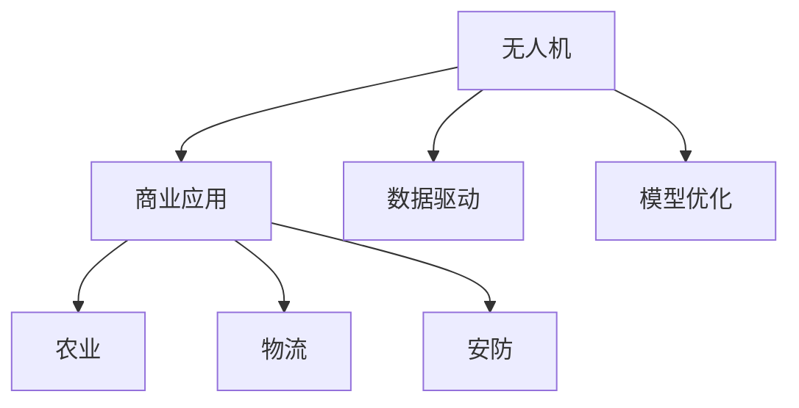

                 

# 无人机创业：空中视角的商业应用

## 1. 背景介绍

### 1.1 问题由来

随着无人机技术的快速发展，其在商业应用领域的潜力逐渐显现。从农业、物流到测绘、安防，无人机已成为各行各业智能化、信息化改造的重要工具。然而，尽管无人机具备诸多优势，但其高昂的研发成本、技术复杂性以及市场的不确定性，使得初创企业在无人机领域面临不小的挑战。

### 1.2 问题核心关键点

1. **市场潜力巨大**：无人机在众多垂直领域的应用场景中，如农业植保、快递物流、摄影测绘等，具有广阔的市场前景。
2. **技术门槛较高**：无人机的研发涉及多学科融合，如飞行控制、视觉感知、路径规划、任务调度等，技术复杂度较高。
3. **应用场景多样化**：不同应用场景对无人机的功能和性能要求不同，需要针对具体需求进行定制化开发。
4. **法规与监管**：无人机的安全飞行需要遵守相关法律法规，这对企业的合规性提出了较高要求。
5. **资金需求高**：无人机的研发与制造需要大量的资金投入，初创企业通常面临融资难的问题。
6. **数据与模型优化**：无人机需要依赖实时数据进行飞行控制和路径优化，如何高效采集、处理和应用数据，是提升无人机性能的关键。

### 1.3 问题研究意义

无人机技术的商业化应用，不仅是技术创新的体现，更是行业智能化升级的重要推动力。通过无人机创业，可以从空中视角探索新的商业模式和应用场景，解决实际问题，推动产业转型升级。

无人机在多个垂直领域的应用，如精准农业、智能物流、城市测绘等，能够显著提高生产效率、降低成本、减少资源浪费，助力企业实现数字化转型。同时，无人机技术的发展也带动了相关产业链的壮大，包括传感器、芯片、通信设备等，具有广阔的市场前景。

## 2. 核心概念与联系

### 2.1 核心概念概述

为更好地理解无人机创业及其商业应用，本节将介绍几个关键概念：

- **无人机(Unmanned Aerial Vehicle, UAV)**：通过自主飞行和控制，完成各种任务的飞行器。
- **无人机创业**：基于无人机技术，创建新企业，开发新产品，探索新商业模式的过程。
- **商业应用**：无人机在各垂直领域的具体应用场景，如农业、物流、安防等。
- **数据驱动**：利用无人机采集的数据进行智能决策和路径优化，提高作业效率和精度。
- **模型优化**：通过机器学习和深度学习，对无人机飞行控制和路径规划模型进行优化。

这些核心概念之间的逻辑关系可以通过以下Mermaid流程图来展示：



这个流程图展示了大无人机创业的核心概念及其之间的关系：

1. 无人机通过采集数据和应用模型优化飞行控制，提供商业应用。
2. 无人机在农业、物流、安防等不同领域的具体应用场景，推动相关行业的智能化升级。
3. 数据驱动和模型优化技术，是提高无人机性能和商业价值的关键。

## 3. 核心算法原理 & 具体操作步骤
### 3.1 算法原理概述

无人机创业过程中，核心算法包括飞行控制、路径规划、任务调度、数据采集与处理、模型优化等。这些算法协同工作，实现无人机的自主飞行和任务执行。

- **飞行控制**：通过传感器采集无人机的姿态、位置、速度等数据，结合预设的飞行模式，实时调整无人机的飞行状态。
- **路径规划**：根据任务需求，设计无人机飞行的起始点、路径点和终点，并规划最优路径。
- **任务调度**：根据任务类型和紧急程度，动态调整无人机的飞行顺序和优先级。
- **数据采集与处理**：利用无人机上的相机、传感器等设备采集现场数据，并通过预处理、滤波、特征提取等技术进行处理。
- **模型优化**：通过机器学习或深度学习算法，优化无人机的飞行控制和路径规划模型，提升飞行稳定性和路径效率。

### 3.2 算法步骤详解

以下详细介绍无人机创业的核心算法步骤：

**Step 1: 飞行控制**

1. **传感器数据采集**：无人机上的IMU、GPS、气压计、温度传感器等，实时采集无人机的姿态、位置、速度、气压、温度等数据。
2. **数据预处理**：对传感器数据进行滤波、校准和降噪处理，确保数据的准确性和实时性。
3. **飞行模式选择**：根据任务需求，选择不同的飞行模式，如定高飞行、垂直起降、悬停等。
4. **控制算法计算**：根据预设的飞行模式，结合实时采集的数据，计算无人机的控制指令，如姿态、速度、高度等。
5. **执行控制指令**：将计算出的控制指令发送给无人机的执行器，如电机、舵机等，实现无人机的飞行控制。

**Step 2: 路径规划**

1. **任务定义**：根据任务需求，定义无人机的起始点、路径点和终点。
2. **路径生成**：利用算法生成最优路径，如A*算法、D*算法等。
3. **路径优化**：根据实时环境信息，动态调整路径，避免障碍物和地形风险。
4. **路径执行**：将生成的路径转换为无人机的飞行指令，实现无人机的路径规划。

**Step 3: 任务调度**

1. **任务类型定义**：根据任务需求，定义不同类型的任务，如植保、测绘、物流等。
2. **任务优先级设置**：根据任务的紧急程度和重要性，设置任务优先级。
3. **任务调度算法**：根据任务优先级，设计调度算法，如优先队列、遗传算法等。
4. **任务执行**：将任务分配给无人机，并根据调度算法动态调整任务执行顺序。

**Step 4: 数据采集与处理**

1. **数据采集**：利用无人机上的相机、传感器等设备，采集现场数据，如照片、视频、点云等。
2. **数据预处理**：对采集的数据进行预处理，如去噪、校正、裁剪等。
3. **数据特征提取**：利用机器学习或深度学习算法，从采集的数据中提取关键特征。
4. **数据应用**：将提取的特征应用于任务处理，如目标识别、物体检测等。

**Step 5: 模型优化**

1. **数据集准备**：准备训练数据集，并打上标签，用于训练和验证模型。
2. **模型训练**：使用机器学习或深度学习算法，训练飞行控制和路径规划模型。
3. **模型验证**：在验证数据集上评估模型的性能，调整模型参数。
4. **模型应用**：将训练好的模型应用于无人机的飞行控制和路径规划。

### 3.3 算法优缺点

无人机创业中的核心算法具有以下优点：

1. **高效性**：通过自动化的飞行控制和路径规划，减少人工干预，提高作业效率。
2. **灵活性**：无人机可以根据实时环境信息动态调整飞行路径和任务优先级，适应不同应用场景。
3. **可靠性**：无人机的自主飞行和任务执行，减少了人为操作错误，提高了任务完成的可靠性。
4. **经济性**：无人机节省了人力成本，提高了生产效率，有助于降低整体运营成本。

同时，这些算法也存在一些缺点：

1. **技术复杂度**：无人机创业需要掌握飞行控制、路径规划、任务调度等多项技术，技术复杂度较高。
2. **数据依赖**：无人机的飞行和任务执行高度依赖数据采集和处理，数据质量直接影响性能。
3. **环境适应性**：无人机对复杂环境的适应性仍需提升，如恶劣天气、障碍物等。
4. **安全风险**：无人机的自主飞行可能面临技术故障、信号干扰等安全风险，需加强监控和应急处理。
5. **法规限制**：无人机的安全飞行需要遵守相关法律法规，限制了应用范围。

### 3.4 算法应用领域

无人机创业的核心算法广泛应用于多个垂直领域，具体包括：

- **农业植保**：利用无人机进行农药喷洒、作物监测、病虫害防治等，提高农业生产效率和质量。
- **智能物流**：利用无人机进行货物运输、快递配送等，缩短物流周期，降低运输成本。
- **城市测绘**：利用无人机进行城市测绘、地形勘探等，提供精确的地理信息和地图数据。
- **安防监控**：利用无人机进行高空监控、巡逻、搜救等，提升安全保障能力。
- **灾害应对**：利用无人机进行灾情评估、救援物资投放等，快速响应自然灾害。

以上应用领域展示了无人机创业的广泛前景，也反映了其在各个行业的智能化、信息化改造中的重要地位。

## 4. 数学模型和公式 & 详细讲解  
### 4.1 数学模型构建

以下详细介绍无人机创业中关键算法的数学模型构建：

**飞行控制模型**：假设无人机的动力学方程为：

$$
m\ddot{x} = F - mg
$$

其中 $m$ 为无人机质量，$g$ 为重力加速度，$F$ 为推力。设无人机的姿态参数为 $\phi$、$\theta$、$\psi$，控制输入为 $u_x$、$u_y$、$u_z$，则控制算法可以表示为：

$$
u_x = \frac{F_x}{C_{d_x}}
$$

$$
u_y = \frac{F_y}{C_{d_y}}
$$

$$
u_z = \frac{F_z}{C_{d_z}}
$$

其中 $F_x$、$F_y$、$F_z$ 为无人机在 $x$、$y$、$z$ 方向上的推力，$C_{d_x}$、$C_{d_y}$、$C_{d_z}$ 为对应的阻力系数。

**路径规划模型**：假设无人机的起点为 $(x_0, y_0, z_0)$，终点为 $(x_f, y_f, z_f)$，最优路径为一条光滑曲线 $C$。则路径规划问题可以表示为：

$$
\min_{C} \int_0^T \left(\frac{||\dot{C}(t)||^2}{2} + \omega_0 ||C(t)||^2 + \omega_1 ||C(t) - (x_0, y_0, z_0)||^2\right)dt
$$

其中 $T$ 为飞行时间，$\omega_0$、$\omega_1$ 为权重参数。该问题可以使用A*算法、D*算法等路径规划算法求解。

**任务调度模型**：假设任务类型为 $T_1, T_2, ..., T_n$，任务优先级为 $p_1, p_2, ..., p_n$。任务调度问题可以表示为：

$$
\min_{s} \sum_{i=1}^n p_i c_i(s)
$$

其中 $s$ 为任务调度方案，$c_i(s)$ 为任务 $T_i$ 的执行时间。该问题可以使用优先队列、遗传算法等调度算法求解。

### 4.2 公式推导过程

以下推导A*算法的关键公式，以路径规划为例。

**A*算法**：假设起点为 $(x_0, y_0, z_0)$，终点为 $(x_f, y_f, z_f)$，障碍点集合为 $\Omega$。设每个点的成本函数为 $f(n)$，启发函数为 $h(n)$，则A*算法可以表示为：

$$
f(n) = g(n) + h(n)
$$

其中 $g(n)$ 为起点到节点 $n$ 的实际代价，$h(n)$ 为节点 $n$ 到终点的启发式代价。A*算法步骤如下：

1. 初始化：将起点加入开放列表，$g(0) = 0$，$f(0) = h(0) = 0$。
2. 循环：从开放列表中选择代价最小的节点 $n$，加入关闭列表。
3. 扩展：计算节点 $n$ 的所有邻居节点，计算其代价和启发式代价，更新 $f(n)$ 和 $g(n)$。
4. 合并：将新扩展的节点加入开放列表，如果已有节点，更新其代价和启发式代价。
5. 结束：当终点加入关闭列表，路径规划完成。

**飞行控制算法**：假设无人机的状态为 $x(t)$，控制输入为 $u(t)$，控制模型为：

$$
\dot{x}(t) = f(x(t), u(t))
$$

其中 $f$ 为状态转移函数，$u(t)$ 为控制输入，$x(t)$ 为状态向量。设控制目标为 $x^*(t)$，则控制算法可以表示为：

1. 初始化：设置 $x(0) = x_0$，$u(0) = u_0$。
2. 循环：根据当前状态 $x(t)$ 和控制输入 $u(t)$，计算新的状态 $x(t+h)$。
3. 反馈：根据当前状态 $x(t)$ 和控制目标 $x^*(t)$，计算控制输入 $u(t+h)$。
4. 结束：当达到控制目标，控制算法完成。

### 4.3 案例分析与讲解

以下以智能物流无人机为例，详细介绍其核心算法的应用：

**案例背景**：某智能物流公司利用无人机进行快递配送，无人机从机场起飞，飞至配送点，完成快递包裹的投放，然后飞回机场。

**算法应用**：

1. **飞行控制**：无人机在起飞和降落阶段，使用定高飞行模式。在巡航阶段，使用水平姿态控制，保持无人机水平飞行。根据传感器数据和预设的飞行模式，实时调整无人机的飞行状态。

2. **路径规划**：无人机从机场起飞后，利用A*算法生成最优路径，避开障碍物和地形风险。根据实时环境信息，动态调整路径，确保无人机安全飞行。

3. **任务调度**：无人机在到达配送点后，利用遗传算法生成任务调度方案，确定快递包裹的投放顺序。根据任务的紧急程度和重要性，动态调整任务执行顺序。

## 5. 项目实践：代码实例和详细解释说明
### 5.1 开发环境搭建

在进行无人机创业项目开发前，需要准备好开发环境。以下是使用Python进行PX4飞控系统开发的环境配置流程：

1. 安装ROS（Robot Operating System）：从官网下载并安装ROS，用于搭建无人机的实时控制系统和数据传输平台。
2. 安装Gazebo：安装Gazebo仿真环境，用于模拟无人机的飞行环境和控制过程。
3. 安装PX4：安装PX4飞控系统，用于控制无人机的飞行姿态和路径规划。
4. 安装Catkin：安装Catkin开发框架，用于管理无人机项目的文件和代码。
5. 安装OpenCV：安装OpenCV计算机视觉库，用于处理无人机的视觉数据。

完成上述步骤后，即可在ROS环境中进行无人机创业项目的开发。

### 5.2 源代码详细实现

以下是智能物流无人机系统的代码实现：

```python
import rospy
from px4_control import px4
from gazebo_msgs.srv import GetModelState, GetModelStateRequest

# 初始化无人机的飞行状态
def init_drones():
    drones = px4.get_drones()
    for drone in drones:
        px4.set_drones(drones)

# 控制无人机的飞行姿态
def control_drones():
    while True:
        for drone in drones:
            position = px4.get_drones_position()
            control_input = calculate_control_input(position)
            px4.set_drones_control_input(control_input)

# 根据无人机的实时位置，计算控制输入
def calculate_control_input(position):
    # 根据无人机的位置和预设的飞行模式，计算控制输入
    control_input = None
    if position['x'] > 0:
        control_input = {'x': 1, 'y': 0, 'z': 0}
    elif position['x'] < 0:
        control_input = {'x': -1, 'y': 0, 'z': 0}
    elif position['y'] > 0:
        control_input = {'x': 0, 'y': 1, 'z': 0}
    elif position['y'] < 0:
        control_input = {'x': 0, 'y': -1, 'z': 0}
    elif position['z'] > 0:
        control_input = {'x': 0, 'y': 0, 'z': 1}
    elif position['z'] < 0:
        control_input = {'x': 0, 'y': 0, 'z': -1}
    return control_input

if __name__ == '__main__':
    rospy.init_node('drone_control', anonymous=True)
    init_drones()
    control_drones()
```

### 5.3 代码解读与分析

以上代码实现了一个简单的无人机控制系统，通过PX4飞控系统控制无人机的飞行姿态。具体实现如下：

1. `init_drones`方法：初始化无人机的飞行状态，从PX4获取所有无人机，并设置其初始位置和姿态。
2. `control_drones`方法：循环控制无人机的飞行姿态，根据当前位置和预设的飞行模式，计算控制输入。
3. `calculate_control_input`方法：根据当前位置和预设的飞行模式，计算控制输入。
4. 主程序：初始化ROS节点，调用`init_drones`和`control_drones`方法，实现无人机的控制。

在实际开发中，还需要考虑更多因素，如无人机的传感器数据处理、实时环境感知、路径规划等，以实现更复杂的控制功能。

## 6. 实际应用场景
### 6.1 智能农业植保

智能农业植保是无人机创业的一个重要应用场景。通过无人机进行植保作业，能够实现精确施药、减少农药使用、提高作业效率等目标。

具体应用包括以下几个方面：

1. **施药任务**：无人机在农田上空巡航，根据地面传感器数据和农田地图，计算最优施药路径，并实时调整飞行高度和速度。
2. **病虫害监测**：无人机配备高清摄像头和红外传感器，实时监测农田中的病虫害情况，生成病虫害报告，指导农民采取防治措施。
3. **土壤监测**：无人机携带土壤检测仪器，采集土壤数据，生成土壤质量报告，指导农民调整种植策略。
4. **作物生长监测**：无人机配备多光谱相机，实时监测作物的生长状态，生成作物生长报告，指导农民进行田间管理。

### 6.2 智能物流配送

智能物流配送是无人机创业的另一个重要应用场景。通过无人机进行快递配送，能够实现快速、便捷、低成本的物流服务。

具体应用包括以下几个方面：

1. **快递包裹运输**：无人机从配送中心起飞，飞至配送点，完成快递包裹的投放，然后飞回配送中心。
2. **货物追踪**：无人机配备GPS和Wi-Fi传感器，实时传输位置信息，消费者可以通过APP查询快递包裹的实时位置和预计到达时间。
3. **自动化仓库管理**：无人机配备机械臂，从自动化仓库中取出货物，并自动将货物分发到配送点。
4. **配送效率优化**：通过路径规划和任务调度算法，优化无人机的飞行路径和配送顺序，提高配送效率。

### 6.3 城市安全监控

城市安全监控是无人机创业的一个重要应用场景。通过无人机进行高空监控，能够实现实时安防、紧急救援等目标。

具体应用包括以下几个方面：

1. **高空监控**：无人机携带高清摄像头和红外传感器，实时监控城市中的异常情况，如火灾、抢劫、交通事故等。
2. **紧急救援**：无人机配备医疗设备和救援器材，能够快速响应紧急情况，进行医疗救助和物资投放。
3. **治安巡逻**：无人机在城市上空巡航，监控治安情况，提供实时警情报告。
4. **人群监控**：无人机配备热成像相机和可见光相机，实时监控大型活动和人群聚集情况，确保活动安全。

### 6.4 未来应用展望

展望未来，无人机创业的商业应用将呈现以下几个趋势：

1. **多领域应用**：无人机将拓展到更多垂直领域，如医疗、环保、旅游等，提供多样化的服务。
2. **智能化升级**：无人机的智能化水平将不断提升，包括自主飞行、智能避障、多任务执行等，提高作业效率和安全性。
3. **多模态融合**：无人机将与其他传感器和设备进行多模态融合，提供更加全面、精准的感知和决策能力。
4. **分布式控制**：无人机将采用分布式控制技术，实现多无人机协作，提高整体执行效率。
5. **区块链技术**：无人机将引入区块链技术，确保数据安全、透明和可追溯性。
6. **法规合规**：无人机将遵循相关法律法规，确保安全飞行和数据隐私保护。

## 7. 工具和资源推荐
### 7.1 学习资源推荐

为帮助开发者系统掌握无人机创业的核心技术，这里推荐一些优质的学习资源：

1. **ROS官方文档**：ROS官方文档，详细介绍了ROS系统的安装、配置、开发流程，适合初学者入门。
2. **PX4官方文档**：PX4官方文档，详细介绍了PX4飞控系统的安装、配置、开发流程，适合无人机的控制开发。
3. **Gazebo官方文档**：Gazebo官方文档，详细介绍了Gazebo仿真环境的安装、配置、开发流程，适合无人机的仿真测试。
4. **《机器人学导论》**：这本书系统介绍了机器人学的基本概念和原理，适合初学者和研究人员。
5. **《飞行控制系统设计》**：这本书详细介绍了飞行控制系统的设计和实现，适合无人机控制开发的工程师。
6. **《人工智能导论》**：这本书系统介绍了人工智能的基本概念和算法，适合无人机创业的开发者。

通过对这些资源的学习实践，相信你一定能够快速掌握无人机创业的核心技术，并用于解决实际的商业问题。

### 7.2 开发工具推荐

高效的开发离不开优秀的工具支持。以下是几款用于无人机创业开发的常用工具：

1. ROS（Robot Operating System）：开源的机器人操作系统，用于无人机系统的实时控制和数据传输。
2. PX4：开源的飞行控制系统，用于无人机的飞行控制和路径规划。
3. Gazebo：开源的仿真环境，用于无人机的飞行仿真和测试。
4. Catkin：开源的软件框架，用于管理无人机项目的文件和代码。
5. OpenCV：开源的计算机视觉库，用于处理无人机的视觉数据。
6. ROSBag：ROS数据录制工具，用于录制和回放无人机的飞行数据。
7. ROSControl：ROS控制系统模块，用于实现无人机系统的实时控制和数据交换。

合理利用这些工具，可以显著提升无人机创业的开发效率，加快创新迭代的步伐。

### 7.3 相关论文推荐

无人机创业技术的发展源于学界的持续研究。以下是几篇奠基性的相关论文，推荐阅读：

1. **"Towards Autonomous UAVs for Environment Monitoring: A Survey on Current Challenges and Future Directions"**：该论文综述了无人机在环境监测中的应用，介绍了相关技术和挑战，适合无人机创业的开发者。
2. **"Design and Control of Multi-Rotor Unmanned Aerial Vehicles"**：该论文介绍了多旋翼无人机的设计、控制和飞行稳定性，适合无人机控制开发的工程师。
3. **"UAV-based Image Acquisition and Augmented Reality for UAV Swarm"**：该论文介绍了基于无人机的图像采集和增强现实技术，适合无人机创业的研究人员。
4. **"UAV-based Smart Agriculture: An Overview of Recent Advances and Challenges"**：该论文综述了无人机在农业中的应用，介绍了相关技术和挑战，适合智能农业植保的开发者。
5. **"UAV-based Smart Logistics: A Survey of Recent Advances and Future Challenges"**：该论文综述了无人机在物流中的应用，介绍了相关技术和挑战，适合智能物流配送的开发者。

这些论文代表了大无人机创业技术的发展脉络。通过学习这些前沿成果，可以帮助研究者把握学科前进方向，激发更多的创新灵感。

## 8. 总结：未来发展趋势与挑战
### 8.1 研究成果总结

通过无人机创业的研究，我们掌握了无人机飞行控制、路径规划、任务调度等核心算法，探索了无人机在智能农业植保、智能物流配送、城市安全监控等垂直领域的应用。这些研究成果不仅具有学术价值，还为无人机创业提供了理论和实践支持。

### 8.2 未来发展趋势

展望未来，无人机创业将呈现以下几个发展趋势：

1. **智能化水平提升**：无人机的智能化水平将不断提升，包括自主飞行、智能避障、多任务执行等，提高作业效率和安全性。
2. **多模态融合**：无人机将与其他传感器和设备进行多模态融合，提供更加全面、精准的感知和决策能力。
3. **分布式控制**：无人机将采用分布式控制技术，实现多无人机协作，提高整体执行效率。
4. **区块链技术**：无人机将引入区块链技术，确保数据安全、透明和可追溯性。
5. **法规合规**：无人机将遵循相关法律法规，确保安全飞行和数据隐私保护。

### 8.3 面临的挑战

尽管无人机创业具备广阔的市场前景，但在迈向更加智能化、普适化应用的过程中，仍面临诸多挑战：

1. **技术复杂度**：无人机的研发涉及多学科融合，技术复杂度较高，需要高水平的技术团队支撑。
2. **数据依赖**：无人机的飞行和任务执行高度依赖数据采集和处理，数据质量直接影响性能。
3. **环境适应性**：无人机对复杂环境的适应性仍需提升，如恶劣天气、障碍物等。
4. **安全风险**：无人机的自主飞行可能面临技术故障、信号干扰等安全风险，需加强监控和应急处理。
5. **法规限制**：无人机的安全飞行需要遵守相关法律法规，限制了应用范围。
6. **成本问题**：无人机的研发和制造需要大量的资金投入，初创企业通常面临融资难的问题。

### 8.4 研究展望

面对无人机创业所面临的挑战，未来的研究需要在以下几个方面寻求新的突破：

1. **无人机的自主飞行和避障**：提高无人机的自主飞行和智能避障能力，降低人为操作错误，提高作业效率和安全性。
2. **多模态数据的融合**：将无人机与其他传感器和设备进行多模态融合，提供更加全面、精准的感知和决策能力。
3. **分布式控制技术**：研究分布式控制技术，实现多无人机协作，提高整体执行效率。
4. **数据驱动的决策**：利用无人机采集的数据进行智能决策和路径优化，提高作业效率和精度。
5. **区块链技术的应用**：引入区块链技术，确保数据安全、透明和可追溯性，增强无人机的可信度。
6. **法规合规与伦理道德**：制定无人机行业的相关法规和伦理标准，保障安全飞行和数据隐私保护，推动无人机创业的健康发展。

这些研究方向的探索，将引领无人机创业技术迈向更高的台阶，为构建安全、可靠、可解释、可控的智能系统铺平道路。面向未来，无人机创业需要不断创新和突破，才能真正实现人工智能技术在垂直行业的规模化落地。总之，无人机创业技术需要在技术、工程、法律、伦理等多方面进行全面优化，才能更好地服务社会，推动产业的智能化升级。

## 9. 附录：常见问题与解答

**Q1：无人机创业的主要难点是什么？**

A: 无人机创业的主要难点包括：

1. **技术复杂度**：无人机的研发涉及多学科融合，技术复杂度较高。
2. **数据依赖**：无人机的飞行和任务执行高度依赖数据采集和处理，数据质量直接影响性能。
3. **环境适应性**：无人机对复杂环境的适应性仍需提升，如恶劣天气、障碍物等。
4. **安全风险**：无人机的自主飞行可能面临技术故障、信号干扰等安全风险，需加强监控和应急处理。
5. **法规限制**：无人机的安全飞行需要遵守相关法律法规，限制了应用范围。
6. **成本问题**：无人机的研发和制造需要大量的资金投入，初创企业通常面临融资难的问题。

**Q2：无人机创业的核心算法有哪些？**

A: 无人机创业的核心算法包括：

1. **飞行控制算法**：通过传感器数据采集和控制算法计算，实现无人机的自主飞行。
2. **路径规划算法**：利用A*算法、D*算法等生成最优路径，避开障碍物和地形风险。
3. **任务调度算法**：利用遗传算法、优先队列等生成任务调度方案，优化无人机的飞行顺序和优先级。
4. **数据采集与处理算法**：利用计算机视觉库和传感器技术，采集和处理无人机的实时数据。
5. **模型优化算法**：利用机器学习或深度学习算法，优化无人机的飞行控制和路径规划模型。

**Q3：无人机创业的商业应用场景有哪些？**

A: 无人机创业的商业应用场景包括：

1. **智能农业植保**：利用无人机进行植保作业，实现精确施药、减少农药使用、提高作业效率等。
2. **智能物流配送**：利用无人机进行快递配送，实现快速、便捷、低成本的物流服务。
3. **城市安全监控**：利用无人机进行高空监控，实现实时安防、紧急救援等。
4. **智慧旅游**：利用无人机进行旅游景点的监控和管理，提升旅游体验。
5. **环境保护**：利用无人机进行环境监测和污染源探测，保护生态环境。

**Q4：无人机创业的资金筹集方式有哪些？**

A: 无人机创业的资金筹集方式包括：

1. **天使投资**：寻找具有远见和实力的天使投资人，获得资金支持。
2. **风险投资**：参加各类创业大赛，吸引风险投资机构的关注和投资。
3. **众筹**：通过众筹平台，向公众募集小额资金，获取市场认可和支持。
4. **政府补贴**：申请政府科技创新基金、科技创业基金等政策补贴，获得资金支持。
5. **企业合作**：与大企业建立战略合作关系，获得技术支持和资金投入。

**Q5：无人机创业的商业化路径有哪些？**

A: 无人机创业的商业化路径包括：

1. **产品销售**：生产并销售无人机设备，提供无人机硬件解决方案。
2. **服务收费**：提供无人机运营服务，如物流配送、农业植保等，收取服务费用。
3. **数据分析**：提供无人机数据分析服务，如飞行数据记录、路径规划分析等，收取数据分析费用。
4. **软件开发**：开发无人机相关的软件应用，如智能控制系统、数据管理平台等，销售软件产品。
5. **品牌授权**：品牌授权给第三方公司，使用无人机的品牌和标识，获取品牌收益。

总之，无人机创业不仅具有广阔的市场前景，还能推动各行业的智能化升级，具有良好的商业化潜力。

---

作者：禅与计算机程序设计艺术 / Zen and the Art of Computer Programming

