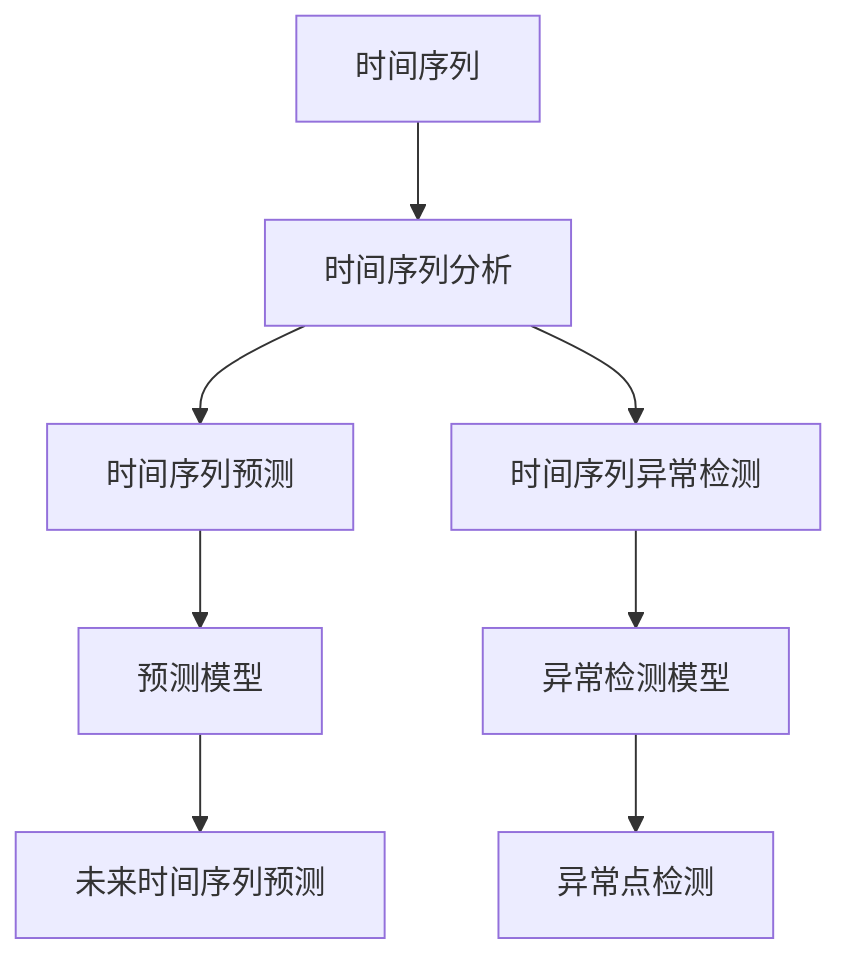
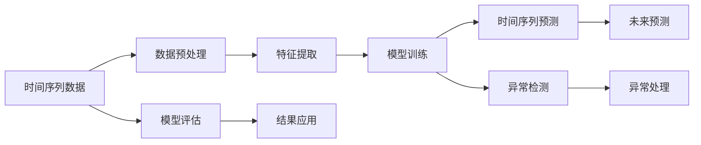

                 

# 时间序列分析：预测与异常检测技术

## 1. 背景介绍

时间序列分析是数据分析中的一种重要方法，广泛应用于金融、气象、交通、工业等多个领域。通过分析时间序列数据，可以预测未来的发展趋势、识别异常数据点、评估系统性能等。在深度学习迅速发展的背景下，基于神经网络的时间序列预测和异常检测技术逐渐成为主流。本文将系统介绍基于深度学习的时间序列分析技术，涵盖从原理到实践的各个方面。

## 2. 核心概念与联系

### 2.1 核心概念概述

本节将介绍时间序列分析中的几个核心概念：

- 时间序列：指按时间顺序排列的数据序列，通常用于表示某一现象随时间变化的情况。
- 时间序列分析：通过分析时间序列数据，揭示其内在规律和趋势，从而预测未来数据或检测异常。
- 时间序列预测：利用历史数据，建立模型预测未来的时间序列数据。
- 时间序列异常检测：识别时间序列中的异常点，如突发事件、数据错误等。
- 深度学习：通过多层神经网络进行特征提取和模式识别，适用于复杂非线性时间序列分析。

这些概念之间的联系可以通过以下Mermaid流程图来展示：



这个流程图展示了时间序列分析的流程和主要应用：

1. 通过对时间序列数据进行分析，可以构建时间序列预测和异常检测模型。
2. 预测模型通过学习历史数据，预测未来的时间序列值。
3. 异常检测模型通过识别数据中的异常点，辅助数据清洗和处理。
4. 预测和异常检测的结果，可以用于进一步的数据分析和决策支持。

### 2.2 核心概念原理和架构的 Mermaid 流程图



这个流程图展示了时间序列分析的核心步骤：

1. 时间序列数据需要进行预处理，包括去噪、归一化等操作。
2. 特征提取环节将时间序列转换为模型的输入。
3. 模型训练过程通过优化算法更新模型参数，使其能够拟合数据。
4. 时间序列预测模型对未来数据进行预测，输出预测值。
5. 异常检测模型识别数据中的异常点，并进行处理。
6. 模型评估环节通过对比预测值和实际值，评估模型性能。
7. 预测和异常检测的结果可以应用于业务决策，如金融风险控制、供应链管理等。

## 3. 核心算法原理 & 具体操作步骤

### 3.1 算法原理概述

基于深度学习的时间序列分析方法，主要通过以下步骤进行：

1. 数据预处理：对原始时间序列数据进行清洗、归一化、补全缺失值等操作。
2. 特征提取：将时间序列转换为模型可接受的输入格式，如时序段、差分序列等。
3. 模型构建：选择合适的深度学习模型，如RNN、LSTM、GRU等，进行训练。
4. 模型评估：使用测试数据集评估模型性能，选择最优模型。
5. 预测与检测：利用训练好的模型对新数据进行预测或异常检测。

### 3.2 算法步骤详解

以下是时间序列预测和异常检测的主要步骤：

#### 3.2.1 数据预处理

数据预处理是时间序列分析的基础，主要包括以下步骤：

1. 数据清洗：删除或修复缺失值、异常值、噪声等，确保数据质量。
2. 数据归一化：将不同尺度的数据转换为标准值，如Min-Max归一化、Z-score归一化等。
3. 数据补全：对于缺失数据，可以使用插值法、回归模型、神经网络等方法进行补全。
4. 数据分割：将时间序列数据分割成训练集和测试集，用于模型训练和评估。

#### 3.2.2 特征提取

特征提取是将时间序列数据转换为模型输入的过程，主要方法包括：

1. 时序段（Windowing）：将时间序列按固定时间间隔分割成多个时序段。
2. 差分序列（Differencing）：对时间序列进行一阶或多阶差分，生成平稳序列。
3. 傅里叶变换（Fourier Transform）：将时间序列转换为频域表示，提取频域特征。
4. 小波变换（Wavelet Transform）：将时间序列分解为不同尺度的时频图像，提取多尺度特征。
5. 特征组合：将不同方法提取的特征进行组合，提高模型性能。

#### 3.2.3 模型训练

模型训练是时间序列分析的核心，主要方法包括：

1. 传统模型：如ARIMA、SARIMA、VAR等，适用于线性时间序列分析。
2. 深度学习模型：如RNN、LSTM、GRU、CNN等，适用于复杂非线性时间序列分析。
3. 集成学习：如随机森林、XGBoost、Boosting等，通过组合多个模型提高预测精度。

#### 3.2.4 模型评估

模型评估是判断模型性能的重要步骤，主要方法包括：

1. 均方误差（MSE）：评估模型预测值与实际值之间的差异。
2. 平均绝对误差（MAE）：衡量预测值与实际值的平均误差。
3. 平均绝对百分比误差（MAPE）：评估预测误差与实际值的比例关系。
4. R-squared：衡量模型拟合数据的好坏，取值范围为0到1。
5. AIC、BIC：用于模型选择，考虑模型复杂度和预测精度。

#### 3.2.5 预测与检测

预测与检测是时间序列分析的主要应用，主要方法包括：

1. 时间序列预测：通过训练好的模型对未来数据进行预测。
2. 异常检测：识别时间序列中的异常点，如突发事件、数据错误等。
3. 实时检测：对实时数据进行预测或检测，如股票价格、交通流量等。

### 3.3 算法优缺点

基于深度学习的时间序列分析方法，具有以下优点：

1. 适用于复杂非线性数据：深度学习模型能够捕捉时间序列中的复杂关系和非线性特征。
2. 预测精度高：通过多层神经网络，深度学习模型可以提升预测精度和泛化能力。
3. 适应性强：深度学习模型可以适应各种类型的时间序列数据，如周期性、季节性等。

同时，该方法也存在一些局限性：

1. 数据量大：深度学习模型需要大量标注数据进行训练，数据量不足时效果可能不理想。
2. 模型复杂：深度学习模型参数较多，训练复杂度高，需要较强的计算资源。
3. 解释性差：深度学习模型的黑盒特性，使得其决策过程难以解释。
4. 过度拟合风险：深度学习模型容易过拟合，需要进行正则化处理。

### 3.4 算法应用领域

基于深度学习的时间序列分析方法，广泛应用于以下几个领域：

1. 金融市场：通过时间序列预测模型，预测股票价格、汇率、债券收益率等。
2. 气象预测：通过时间序列预测模型，预测天气变化、气候变化等。
3. 供应链管理：通过时间序列预测模型，预测库存水平、物流时间等。
4. 健康监测：通过时间序列预测模型，监测人体健康状况、疾病传播等。
5. 交通管理：通过时间序列预测模型，预测交通流量、出行时间等。

## 4. 数学模型和公式 & 详细讲解 & 举例说明

### 4.1 数学模型构建

时间序列分析的数学模型通常包括：

- 自回归模型（AR）：$X_t = \phi_1 X_{t-1} + ... + \phi_p X_{t-p} + \epsilon_t$
- 移动平均模型（MA）：$X_t = \mu + \theta_1 \epsilon_{t-1} + ... + \theta_q \epsilon_{t-q}$
- 自回归移动平均模型（ARMA）：$X_t = \phi_1 X_{t-1} + ... + \phi_p X_{t-p} + \theta_1 \epsilon_{t-1} + ... + \theta_q \epsilon_{t-q}$
- 自回归积分移动平均模型（ARIMA）：$X_t = \phi_1 X_{t-1} + ... + \phi_p X_{t-p} + \theta_1 \epsilon_{t-1} + ... + \theta_q \epsilon_{t-q}$
- 季节性自回归移动平均模型（SARIMA）：$X_t = \phi_1 X_{t-1} + ... + \phi_p X_{t-p} + \theta_1 \epsilon_{t-1} + ... + \theta_q \epsilon_{t-q} + \Pi_d(X_{t-D}) + \Theta_d(\epsilon_{t-D})$

其中，$X_t$ 表示时间序列中的第 $t$ 个观测值，$\epsilon_t$ 表示随机误差项，$\phi_i$、$\theta_i$ 表示模型的参数，$D$ 表示季节性周期。

### 4.2 公式推导过程

以自回归模型（AR）为例，推导其预测公式：

假设已知时间序列 $X_t = \phi_1 X_{t-1} + ... + \phi_p X_{t-p} + \epsilon_t$，其中 $X_t$ 为第 $t$ 个观测值，$\epsilon_t$ 为随机误差项，$\phi_i$ 为模型参数。

对于时间序列的 $t+1$ 个观测值，可以表示为：

$$X_{t+1} = \phi_1 X_t + ... + \phi_p X_{t-p+1} + \epsilon_{t+1}$$

通过迭代，可以推出时间序列的前 $p+1$ 个观测值之间的关系：

$$X_{t+1} = \phi_1 X_t + ... + \phi_p X_{t-p+1} + \epsilon_{t+1}$$
$$X_t = \phi_1 X_{t-1} + ... + \phi_p X_{t-p} + \epsilon_t$$
$$...$$
$$X_{t-p+1} = \phi_1 X_{t-p} + ... + \phi_p X_{t-2p+1} + \epsilon_{t-p+1}$$

将这些关系式带入 $X_{t+1}$ 的表达式，可以得到：

$$X_{t+1} = \phi_1 (\phi_1 X_{t-1} + ... + \phi_p X_{t-p}) + ... + \phi_p (\phi_1 X_{t-p+1} + ... + \phi_p X_{t-2p+1}) + \epsilon_{t+1}$$

整理得到时间序列的预测公式：

$$X_{t+1} = \phi_1 X_t + ... + \phi_p X_{t-p} + \epsilon_{t+1}$$

通过不断迭代，可以预测未来多个时间点的观测值。

### 4.3 案例分析与讲解

以股市价格预测为例，解释时间序列分析的具体应用。

假设我们要预测某支股票的未来价格，可以将该股票的历史价格作为时间序列数据。使用ARIMA模型，可以拟合出时间序列的线性关系和季节性变化，通过模型训练得到最优参数 $\phi_i$、$\theta_i$。

通过预测公式，可以计算出未来多个时间点的股票价格。例如，预测第 $t+1$ 个时间点的股票价格 $X_{t+1}$：

$$X_{t+1} = \phi_1 X_t + ... + \phi_p X_{t-p} + \epsilon_{t+1}$$

实际应用中，可以通过比较预测值和实际值，评估模型的预测精度。例如，使用均方误差（MSE）和平均绝对误差（MAE）来评估模型的预测效果：

$$MSE = \frac{1}{n} \sum_{i=1}^n (Y_i - \hat{Y}_i)^2$$
$$MAE = \frac{1}{n} \sum_{i=1}^n |Y_i - \hat{Y}_i|$$

其中 $Y_i$ 为实际价格，$\hat{Y}_i$ 为预测价格，$n$ 为时间序列的长度。

## 5. 项目实践：代码实例和详细解释说明

### 5.1 开发环境搭建

在开始项目实践前，需要搭建好开发环境。以下是使用Python进行TensorFlow进行时间序列分析的环境配置流程：

1. 安装Anaconda：从官网下载并安装Anaconda，用于创建独立的Python环境。

2. 创建并激活虚拟环境：
```bash
conda create -n tf-env python=3.8 
conda activate tf-env
```

3. 安装TensorFlow：从官网获取对应的安装命令，根据CUDA版本，选择相应的安装命令。例如：
```bash
conda install tensorflow==2.8
```

4. 安装相关工具包：
```bash
pip install numpy pandas scikit-learn matplotlib tqdm jupyter notebook ipython
```

完成上述步骤后，即可在`tf-env`环境中开始项目实践。

### 5.2 源代码详细实现

下面我们以时间序列预测为例，给出使用TensorFlow进行ARIMA模型训练的Python代码实现。

首先，导入必要的库和数据：

```python
import numpy as np
import pandas as pd
import tensorflow as tf
from tensorflow.keras import layers
from tensorflow.keras.models import Sequential
from sklearn.metrics import mean_squared_error

# 读取时间序列数据
data = pd.read_csv('time_series.csv', index_col='Date', parse_dates=True)
```

然后，进行数据预处理：

```python
# 数据归一化
scaler = MinMaxScaler()
data_scaled = scaler.fit_transform(data)

# 分割数据集
train_data = data_scaled[:'2018'].values
test_data = data_scaled['2018':].values
```

接下来，构建ARIMA模型：

```python
# 定义模型
model = Sequential()

# 添加LSTM层
model.add(layers.LSTM(64, input_shape=(train_data.shape[1], 1), return_sequences=True))

# 添加Dropout层
model.add(layers.Dropout(0.2))

# 添加LSTM层
model.add(layers.LSTM(32, return_sequences=True))

# 添加Dropout层
model.add(layers.Dropout(0.2))

# 添加LSTM层
model.add(layers.LSTM(16, return_sequences=True))

# 添加Dropout层
model.add(layers.Dropout(0.2))

# 添加LSTM层
model.add(layers.LSTM(8, return_sequences=True))

# 添加Dropout层
model.add(layers.Dropout(0.2))

# 添加LSTM层
model.add(layers.LSTM(4, return_sequences=True))

# 添加Dropout层
model.add(layers.Dropout(0.2))

# 添加LSTM层
model.add(layers.LSTM(2, return_sequences=True))

# 添加Dropout层
model.add(layers.Dropout(0.2))

# 添加全连接层
model.add(layers.Dense(1))

# 编译模型
model.compile(optimizer='adam', loss='mse')

# 训练模型
history = model.fit(train_data[:-1], train_data[1:], epochs=50, batch_size=32)
```

最后，评估模型：

```python
# 评估模型
test_pred = model.predict(test_data)
mse = mean_squared_error(test_data, test_pred)

print(f"MSE: {mse}")
```

以上就是使用TensorFlow进行ARIMA模型训练的完整代码实现。可以看到，通过TensorFlow的Keras API，可以很方便地构建和训练深度学习模型。

### 5.3 代码解读与分析

让我们再详细解读一下关键代码的实现细节：

**数据预处理**：
- 使用`MinMaxScaler`对时间序列数据进行归一化处理，确保模型训练的稳定性。
- 将数据集分割为训练集和测试集，分别用于模型训练和评估。

**模型构建**：
- 使用Keras API构建多层LSTM模型，其中每一层都添加了Dropout层，以避免过拟合。
- 每一层都设置了不同的神经元数量，以便更好地捕捉时间序列的复杂关系。

**模型训练**：
- 使用均方误差（MSE）作为损失函数，优化器为Adam。
- 训练50个epoch，batch size为32。
- 使用`model.fit`方法进行模型训练。

**模型评估**：
- 使用测试集对模型进行评估，计算预测值与实际值之间的均方误差。
- 使用`mean_squared_error`函数计算均方误差。

可以看到，TensorFlow的Keras API使得模型构建和训练变得非常简洁。开发者只需关注模型的结构设计和训练过程，其他细节由TensorFlow自动处理。

当然，工业级的系统实现还需考虑更多因素，如模型的保存和部署、超参数的自动搜索、更灵活的任务适配层等。但核心的时间序列分析流程基本与此类似。

## 6. 实际应用场景

### 6.1 金融市场

在金融市场中，时间序列分析应用广泛。通过时间序列预测模型，可以预测股票价格、汇率、债券收益率等。例如，使用ARIMA模型可以预测某只股票的未来价格，帮助投资者进行风险控制和资产配置。

### 6.2 气象预测

气象预测是时间序列分析的典型应用场景之一。通过时间序列预测模型，可以预测天气变化、气候变化等。例如，使用LSTM模型可以预测某地的温度变化，帮助气象部门进行灾害预警和气候分析。

### 6.3 供应链管理

在供应链管理中，时间序列预测可以预测库存水平、物流时间等。例如，使用ARIMA模型可以预测某公司的产品需求，帮助公司进行库存管理和供应链优化。

### 6.4 健康监测

在健康监测中，时间序列分析可以监测人体健康状况、疾病传播等。例如，使用LSTM模型可以预测某人的心率变化，帮助医生进行疾病预警和治疗。

### 6.5 交通管理

在交通管理中，时间序列预测可以预测交通流量、出行时间等。例如，使用ARIMA模型可以预测某条道路的交通流量，帮助交通部门进行流量控制和道路规划。

## 7. 工具和资源推荐

### 7.1 学习资源推荐

为了帮助开发者系统掌握时间序列分析的理论基础和实践技巧，这里推荐一些优质的学习资源：

1. 《深度学习》（Goodfellow等著）：详细介绍了深度学习的基本概念和原理，包括时间序列分析等。

2. 《统计学习方法》（李航著）：介绍了统计学习的基本方法和算法，包括ARIMA模型等。

3. 《Python时间序列分析》（Siddhartha Srivastava著）：介绍了Python中进行时间序列分析的常用工具和库。

4. Kaggle时间序列分析竞赛：参加Kaggle竞赛，可以实践时间序列预测和异常检测技术，提升实战能力。

5. Coursera《时间序列分析》课程：由Duke大学开设，涵盖时间序列分析的各个方面，适合初学者和进阶者。

通过对这些资源的学习实践，相信你一定能够快速掌握时间序列分析的精髓，并用于解决实际问题。

### 7.2 开发工具推荐

高效的开发离不开优秀的工具支持。以下是几款用于时间序列分析开发的常用工具：

1. Python：数据科学和机器学习的主流编程语言，拥有丰富的第三方库和工具。

2. TensorFlow：由Google主导开发的深度学习框架，适用于大规模模型训练。

3. Keras：基于TensorFlow的高级API，简化深度学习模型的构建和训练。

4. Matplotlib：用于绘制时间序列图和动态图，便于数据分析和可视化。

5. Pandas：数据处理和分析的常用工具，支持时间序列数据的处理和操作。

6. NumPy：用于科学计算和数值分析，支持高效的数值运算。

合理利用这些工具，可以显著提升时间序列分析的开发效率，加快创新迭代的步伐。

### 7.3 相关论文推荐

时间序列分析的研究源于学界的持续研究。以下是几篇奠基性的相关论文，推荐阅读：

1. Box, G. E. P., Jenkins, G. M., & Reinsel, G. C. (2015). Time Series Analysis: Forecasting and Control. John Wiley & Sons.

2. Hyndman, R. J., & Khandakar, Y. (2008). Automatic time series forecasting: The state space approach. International journal of forecasting, 24(3), 582-599.

3. Hamilton, J. D. (1994). Time series analysis. Princeton University Press.

4. Künsch, H. R., & Rutimann, U. (1991). On the measurement and testing of the long-run variances of time series models. The Annals of Statistics, 1991, 19(3), 1237-1266.

5. Lütkepohl, H. (2005). New Introduction to Multiple Time Series Analysis. Springer Science & Business Media.

这些论文代表了大时间序列分析的发展脉络。通过学习这些前沿成果，可以帮助研究者把握学科前进方向，激发更多的创新灵感。

## 8. 总结：未来发展趋势与挑战

### 8.1 总结

本文对基于深度学习的时间序列分析技术进行了全面系统的介绍。首先阐述了时间序列分析的背景和意义，明确了时间序列预测和异常检测在各个领域的重要作用。其次，从原理到实践，详细讲解了时间序列预测和异常检测的数学模型和算法步骤，给出了时间序列分析的完整代码实例。同时，本文还广泛探讨了时间序列分析在金融、气象、供应链、健康监测等众多领域的应用前景，展示了时间序列分析的广泛应用潜力。此外，本文精选了时间序列分析的学习资源、开发工具和相关论文，力求为读者提供全方位的技术指引。

通过本文的系统梳理，可以看到，基于深度学习的时间序列分析方法正在成为数据科学和工程领域的重要范式，极大地拓展了时间序列预测和异常检测的应用边界，为各个领域带来了新的解决方案。未来，伴随深度学习技术的不断演进，时间序列分析技术也将不断创新和优化，为数据驱动的决策支持提供更强大的工具。

### 8.2 未来发展趋势

展望未来，时间序列分析技术将呈现以下几个发展趋势：

1. 深度学习模型的不断优化：深度学习模型将继续演进，通过优化算法和架构设计，提升时间序列预测和异常检测的精度和效率。

2. 多模态数据的融合：将时间序列数据与其他类型的数据（如图像、文本、音频等）进行融合，形成多模态数据预测模型，提升系统的复杂性和鲁棒性。

3. 自监督学习和无监督学习的应用：通过自监督学习和无监督学习技术，进一步减少时间序列分析对标注数据的需求，提高模型的泛化能力。

4. 实时数据处理：通过流式计算和分布式系统，实现实时时间序列预测和异常检测，适应高速实时数据流的处理需求。

5. 集成学习和模型融合：通过集成学习和模型融合技术，结合多种模型预测和检测结果，提升系统的综合性能和鲁棒性。

### 8.3 面临的挑战

尽管时间序列分析技术已经取得了瞩目成就，但在迈向更加智能化、普适化应用的过程中，它仍面临着诸多挑战：

1. 数据处理难度大：时间序列数据往往存在缺失值、噪声等，需要进行复杂的预处理和清洗。

2. 模型训练复杂：深度学习模型参数较多，训练复杂度高，需要较强的计算资源和专业知识。

3. 模型解释性差：深度学习模型的黑盒特性，使得其决策过程难以解释，难以满足某些领域的需求。

4. 异常检测难度大：时间序列异常检测常常需要专业知识，模型的鲁棒性和准确性有待提高。

5. 数据多样性挑战：不同领域的时间序列数据具有不同的特性，需要针对性地设计模型和算法。

### 8.4 研究展望

面对时间序列分析所面临的种种挑战，未来的研究需要在以下几个方面寻求新的突破：

1. 探索无监督和半监督学习方法：摆脱对大规模标注数据的依赖，利用自监督学习、主动学习等方法，最大化利用非结构化数据。

2. 研究参数高效和计算高效的模型：开发更加参数高效和计算高效的模型，在减少模型复杂度的同时，提高预测精度。

3. 引入因果推断和对比学习：通过引入因果推断和对比学习技术，增强模型的鲁棒性和可解释性。

4. 融合多模态数据：将时间序列数据与其他类型的数据（如图像、文本、音频等）进行融合，形成多模态数据预测模型。

5. 结合因果分析和博弈论：通过因果分析和博弈论工具，提高模型的决策能力和稳定性。

这些研究方向的探索，必将引领时间序列分析技术迈向更高的台阶，为数据驱动的决策支持提供更强大的工具。面向未来，时间序列分析技术还需要与其他人工智能技术进行更深入的融合，如知识表示、因果推理、强化学习等，多路径协同发力，共同推动时间序列分析技术的进步。只有勇于创新、敢于突破，才能不断拓展时间序列分析的边界，让智能技术更好地服务于各个领域。

## 9. 附录：常见问题与解答

**Q1：时间序列分析中的数据预处理包括哪些步骤？**

A: 时间序列分析中的数据预处理主要包括：

1. 数据清洗：删除或修复缺失值、异常值、噪声等，确保数据质量。
2. 数据归一化：将不同尺度的数据转换为标准值，如Min-Max归一化、Z-score归一化等。
3. 数据补全：对于缺失数据，可以使用插值法、回归模型、神经网络等方法进行补全。
4. 数据分割：将时间序列数据分割成训练集和测试集，用于模型训练和评估。

**Q2：如何选择合适的时间序列模型？**

A: 选择合适的时间序列模型主要考虑以下几个因素：

1. 数据类型：根据数据类型（如平稳性、季节性等）选择不同的方法，如ARIMA、SARIMA、LSTM等。
2. 数据长度：对于长序列数据，可以使用LSTM等深度学习模型，而对于短序列数据，可以使用传统统计方法，如ARIMA。
3. 数据特点：对于周期性、趋势性、噪声等特点，选择不同的模型，如ARIMA、SARIMA、LSTM等。
4. 预测精度：根据预测精度的要求，选择不同的模型，如ARIMA、LSTM、RNN等。

**Q3：时间序列分析中的模型评估指标有哪些？**

A: 时间序列分析中的模型评估指标主要包括：

1. 均方误差（MSE）：评估模型预测值与实际值之间的差异。
2. 平均绝对误差（MAE）：衡量预测值与实际值的平均误差。
3. 平均绝对百分比误差（MAPE）：评估预测误差与实际值的比例关系。
4. R-squared：衡量模型拟合数据的好坏，取值范围为0到1。
5. AIC、BIC：用于模型选择，考虑模型复杂度和预测精度。

这些指标可以帮助评估模型的预测精度和泛化能力，选择合适的模型。

**Q4：时间序列预测中的模型参数如何调优？**

A: 时间序列预测中的模型参数调优主要包括以下步骤：

1. 网格搜索：在一定范围内进行搜索，寻找最优的参数组合。
2. 随机搜索：在一定范围内随机采样，寻找最优的参数组合。
3. 贝叶斯优化：利用贝叶斯方法，高效搜索最优参数组合。
4. 交叉验证：通过交叉验证，评估模型的泛化能力，选择最优的参数组合。

这些方法可以帮助找到最优的模型参数，提升预测精度。

**Q5：时间序列异常检测的常见方法有哪些？**

A: 时间序列异常检测的常见方法主要包括：

1. 统计方法：如Z-score、Grubbs' test、IQR等，适用于分布正常的情况。
2. 机器学习方法：如KNN、SVM、GBDT等，适用于分布异常的情况。
3. 深度学习方法：如LSTM、RNN、CNN等，适用于复杂非线性情况。
4. 自编码器方法：如VAE、GAN等，适用于重构异常检测。

这些方法可以灵活选择，根据数据特点和任务需求进行应用。

---

作者：禅与计算机程序设计艺术 / Zen and the Art of Computer Programming

