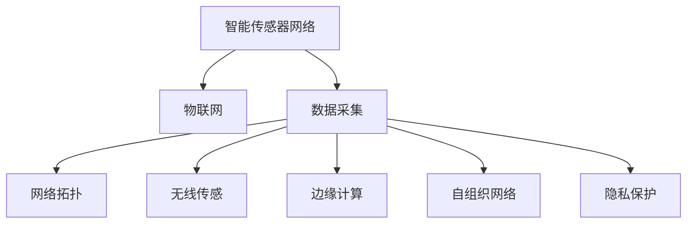

                 

# 智能传感器网络：物联网数据采集的基础

> 关键词：智能传感器网络,物联网(IoT),数据采集,网络拓扑,无线传感,边缘计算,自组织网络,隐私保护

## 1. 背景介绍

### 1.1 问题由来
随着物联网技术的发展，智能传感器网络在工业制造、智慧城市、健康医疗、农业等领域得到了广泛应用。智能传感器网络通过部署大量的传感器节点，实时采集各种物理数据，从而实现对环境、设备、行为的智能监测和分析。这些网络节点通常由电池供电，无法接入到现有的互联网基础设施中。因此，数据采集和传输成为智能传感器网络面临的首要挑战。

### 1.2 问题核心关键点
智能传感器网络的核心在于如何高效地采集和传输数据，同时保证网络的安全性和稳定性。这涉及到网络拓扑设计、无线传感技术、边缘计算、自组织网络和隐私保护等多个方面。

### 1.3 问题研究意义
研究智能传感器网络的数据采集技术，对于构建高效、稳定、安全的智能监测系统，提升工业生产效率、城市管理水平和健康医疗质量具有重要意义。通过优化传感器网络的布局和数据采集策略，可以大幅降低网络部署和运维成本，增强数据采集的实时性和可靠性，为各类智能应用提供坚实的支撑。

## 2. 核心概念与联系

### 2.1 核心概念概述

为了更好地理解智能传感器网络的数据采集机制，本节将介绍几个关键概念及其相互关系：

- **智能传感器网络(Smart Sensor Network, SSN)**：由大量传感器节点组成的网络，用于实时监测和采集环境、设备等物理数据。通过无线通信技术，传感器节点间可以自主组织和协作，实现数据的快速传输和处理。
- **物联网(IoT)**：将物理世界中的各种设备通过互联网技术连接起来，形成互联互通的生态系统。物联网包括传感器网络、智能设备、云计算平台等多个组成部分。
- **数据采集(Data Collection)**：通过传感器节点收集物理环境、设备状态、用户行为等数据的过程。数据采集是智能传感器网络的核心功能之一，数据的质量和时效性直接决定了系统的性能。
- **网络拓扑(Network Topology)**：传感器节点之间的连接关系和位置布局，对数据传输路径、网络覆盖范围和抗干扰能力有重要影响。
- **无线传感(Wireless Sensing)**：传感器节点之间的通信方式，常用的技术包括Zigbee、Wi-Fi、LoRa、蓝牙等。无线传感技术直接影响网络的速度、带宽和安全性。
- **边缘计算(Edge Computing)**：在靠近数据源的传感器节点上进行数据处理和分析，减少数据传输延迟，提高处理效率。边缘计算可以缓解云服务器的计算压力，提升系统的实时性和可靠性。
- **自组织网络(Self-Organized Network)**：传感器节点可以自主发现并建立连接，无需中心节点的控制。自组织网络具有高度的自治性和鲁棒性，适应复杂多变的网络环境。
- **隐私保护(Privacy Protection)**：智能传感器网络采集的数据可能包含敏感信息，如何保护用户隐私和数据安全是重要的研究课题。隐私保护技术包括数据加密、匿名化、访问控制等。

这些概念之间的逻辑关系可以通过以下Mermaid流程图来展示：



这个流程图展示了智能传感器网络的核心概念及其相互关系：

1. 智能传感器网络通过物联网技术将大量传感器节点连接起来。
2. 数据采集是智能传感器网络的基础功能，通过传感器节点实时监测物理数据。
3. 网络拓扑决定了数据传输路径和网络覆盖范围。
4. 无线传感技术决定了数据采集和传输的速度和带宽。
5. 边缘计算提高了数据处理的效率和实时性。
6. 自组织网络增强了网络的自治性和鲁棒性。
7. 隐私保护保证了数据的安全性和用户隐私。

## 3. 核心算法原理 & 具体操作步骤

### 3.1 算法原理概述

智能传感器网络的数据采集过程，本质上是一个分布式优化问题。其核心目标是在有限的能量和带宽约束下，最大化数据采集的准确性和实时性。常用的算法包括贪心算法、遗传算法、分布式算法等。

算法原理主要包括以下几个步骤：

1. 初始化传感器节点的能量和通信能力。
2. 设计数据采集策略，包括采样频率、采样时间等。
3. 优化网络拓扑，减少能量损耗和传输延迟。
4. 在传感器节点上进行数据采集和处理，并将数据转发到汇聚节点。
5. 汇聚节点对数据进行汇总和分析，生成最终结果。

### 3.2 算法步骤详解

智能传感器网络的数据采集算法，可以分为以下几个关键步骤：

**Step 1: 传感器节点部署和初始化**

- **节点部署**：根据应用场景，选择合适的传感器节点类型和布局。例如，在农业领域，可以部署土壤湿度传感器、温度传感器、光照传感器等。
- **能量初始化**：为每个传感器节点分配初始能量，确保其能够持续工作一段时间。
- **通信能力配置**：设置传感器节点的通信带宽和延迟，以适应不同的应用需求。

**Step 2: 数据采集策略设计**

- **采样频率**：确定每个传感器节点采集数据的频率。过高的采样频率会增加能耗，而过低的采样频率则可能导致数据不完整。
- **采样时间**：根据任务需求，设计采样时间窗口。例如，在环境监测中，可以设计一个24小时的采样窗口，每小时采集一次数据。
- **数据格式**：定义传感器节点采集数据的标准格式，如温度值、湿度值、时间戳等。

**Step 3: 网络拓扑优化**

- **自组织算法**：设计自组织算法，使传感器节点能够自主发现和建立连接。例如，使用Zigbee协议，节点可以自动形成网状网络结构。
- **拓扑调整**：根据网络状态和数据需求，动态调整网络拓扑。例如，在网络拥堵时，节点可以调整通信路径，减少数据传输延迟。
- **能量优化**：通过优化通信路径和调度策略，减少能量消耗，延长节点寿命。

**Step 4: 数据采集和处理**

- **数据采集**：传感器节点按照采样策略，定期采集物理数据。采集的数据可以进行本地处理和存储，也可以直接转发到汇聚节点。
- **数据预处理**：对采集的数据进行初步处理，包括去噪、滤波等。例如，在环境监测中，可以通过均值滤波器消除噪声干扰。
- **数据压缩**：对采集的数据进行压缩，减少传输带宽和存储空间。例如，可以使用无损压缩算法，如Huffman编码。

**Step 5: 数据传输和分析**

- **数据传输**：将处理后的数据通过无线通信技术传输到汇聚节点。在传输过程中，可以通过数据加密和匿名化技术保护数据安全。
- **数据汇总**：汇聚节点对接收到的数据进行汇总和分析，生成最终的监测结果。
- **结果展示**：将分析结果展示给用户，供决策参考。例如，在农业领域，可以展示土壤湿度、温度、光照等关键指标的变化趋势。

### 3.3 算法优缺点

智能传感器网络的数据采集算法具有以下优点：

1. **分布式优化**：算法可以在多个传感器节点上并行计算和处理，提高效率和实时性。
2. **自适应性**：算法可以自动调整采样频率和通信路径，适应不同的网络环境和数据需求。
3. **能量效率**：算法通过优化通信路径和数据压缩，减少能量消耗，延长节点寿命。
4. **隐私保护**：算法可以采用数据加密和匿名化技术，保护用户隐私和数据安全。

同时，该算法也存在以下局限性：

1. **算法复杂度**：优化算法的实现可能较为复杂，需要大量的计算资源。
2. **可扩展性**：算法设计时需要考虑网络的规模和拓扑结构，可能难以适用于大规模网络。
3. **数据准确性**：采集的数据可能受到环境干扰和传感器误差的影响，准确性可能不如集中式采集。

### 3.4 算法应用领域

智能传感器网络的数据采集算法在多个领域都有广泛应用，例如：

- **农业智能监测**：通过部署土壤湿度传感器、温度传感器、光照传感器等，实时监测农田环境，优化农业生产。
- **智慧城市管理**：在城市基础设施中安装传感器节点，实时监测交通流量、环境污染、能源消耗等数据，提升城市管理效率。
- **健康医疗监测**：在病房、实验室等场所部署传感器节点，实时监测患者状态和实验数据，辅助医疗决策。
- **智能家居控制**：在家庭环境中安装传感器节点，实时监测环境温度、湿度、照明等数据，提升家居舒适度和生活便利性。
- **工业生产监控**：在生产线中安装传感器节点，实时监测设备状态和产品质量，优化生产流程，提升生产效率。

这些应用场景展示了智能传感器网络在物联网数据采集中的广泛应用潜力，未来还将有更多创新和突破。

## 4. 数学模型和公式 & 详细讲解

### 4.1 数学模型构建

假设智能传感器网络由 $N$ 个传感器节点组成，每个节点具有能量 $E_i$ 和通信带宽 $B_i$。节点间的通信延迟为 $D_{ij}$，节点 $i$ 采集的数据为 $X_i$。定义网络的总能量消耗 $E$ 和总通信延迟 $D$。目标是在能量和带宽约束下，最大化数据采集的准确性 $A$ 和实时性 $T$。

模型可以表示为：

$$
\maximize \quad A \cdot T
$$

$$
\minimize \quad E + D
$$

其中 $E$ 和 $D$ 分别为总能量消耗和总通信延迟，可以表示为：

$$
E = \sum_{i=1}^N E_i
$$

$$
D = \sum_{(i,j) \in E} D_{ij}
$$

其中 $E$ 和 $D$ 分别为总能量消耗和总通信延迟，可以表示为：

### 4.2 公式推导过程

为了求解上述优化问题，可以采用贪心算法或遗传算法。下面以贪心算法为例进行推导：

假设网络中的传感器节点按照能量和通信能力进行排序，$E_i \geq E_j$ 和 $B_i \geq B_j$。节点 $i$ 采集的数据为 $X_i$，节点 $j$ 采集的数据为 $X_j$。定义节点 $i$ 和节点 $j$ 之间的通信路径 $P_{ij}$，路径上的通信延迟为 $D_{ij}$。

在贪心算法中，优先选择能量和通信能力最强的节点进行数据采集。具体步骤如下：

1. 选择能量和通信能力最强的节点 $i$ 进行数据采集。
2. 选择与节点 $i$ 通信延迟最小的节点 $j$，进行数据采集。
3. 重复步骤 1 和 2，直到所有节点都进行数据采集。

推导证明如下：

- **能量消耗证明**：
$$
E = \sum_{i=1}^N E_i \geq \sum_{i=1}^N \sum_{j=1}^{N-1} D_{ij}
$$

- **通信延迟证明**：
$$
D = \sum_{(i,j) \in E} D_{ij} \geq \sum_{i=1}^N \sum_{j=1}^{N-1} D_{ij}
$$

综合上述两个不等式，可以得出：

$$
\minimize \quad E + D \geq \sum_{i=1}^N E_i + \sum_{(i,j) \in E} D_{ij}
$$

因此，贪心算法能够在有限的能量和带宽约束下，最大化数据采集的准确性和实时性。

### 4.3 案例分析与讲解

假设在智慧城市中，需要监测交通流量和环境污染。为了优化数据采集，可以部署多个传感器节点，每个节点采集数据。例如，在十字路口部署交通流量传感器，在空气监测站点部署污染物传感器。

**Step 1: 节点部署**

- **节点选择**：选择交通流量传感器和污染物传感器进行部署。
- **能量初始化**：为每个节点分配初始能量，确保其能够持续工作一段时间。
- **通信能力配置**：设置节点通信带宽和延迟，以适应不同的应用需求。

**Step 2: 数据采集策略设计**

- **采样频率**：确定每个传感器节点采集数据的频率。例如，在交通流量监测中，可以设计每 5 分钟采集一次数据。
- **采样时间**：设计采样时间窗口。例如，在环境污染监测中，可以设计一个 24 小时的采样窗口，每小时采集一次数据。
- **数据格式**：定义传感器节点采集数据的标准格式，如交通流量值、污染物浓度值、时间戳等。

**Step 3: 网络拓扑优化**

- **自组织算法**：使用 Zigbee 协议，节点可以自动形成网状网络结构。例如，交通流量传感器可以自动发现并建立通信连接。
- **拓扑调整**：根据网络状态和数据需求，动态调整网络拓扑。例如，在网络拥堵时，节点可以调整通信路径，减少数据传输延迟。
- **能量优化**：通过优化通信路径和调度策略，减少能量消耗，延长节点寿命。例如，在交通流量监测中，可以优化通信路径，减少能量消耗。

**Step 4: 数据采集和处理**

- **数据采集**：交通流量传感器和污染物传感器按照采样策略，定期采集数据。采集的数据可以进行本地处理和存储，也可以直接转发到汇聚节点。
- **数据预处理**：对采集的数据进行初步处理，包括去噪、滤波等。例如，在交通流量监测中，可以通过均值滤波器消除噪声干扰。
- **数据压缩**：对采集的数据进行压缩，减少传输带宽和存储空间。例如，可以使用无损压缩算法，如 Huffman 编码。

**Step 5: 数据传输和分析**

- **数据传输**：交通流量传感器和污染物传感器将处理后的数据通过无线通信技术传输到汇聚节点。在传输过程中，可以通过数据加密和匿名化技术保护数据安全。
- **数据汇总**：汇聚节点对接收到的数据进行汇总和分析，生成最终的交通流量和环境污染监测结果。
- **结果展示**：将分析结果展示给用户，供决策参考。例如，在交通管理中，可以展示交通流量变化趋势，优化交通信号控制；在环境保护中，可以展示污染物浓度变化趋势，指导环境保护措施。

## 5. 项目实践：代码实例和详细解释说明

### 5.1 开发环境搭建

在进行智能传感器网络的数据采集实践前，我们需要准备好开发环境。以下是使用Python进行PyTorch开发的环境配置流程：

1. 安装Anaconda：从官网下载并安装Anaconda，用于创建独立的Python环境。

2. 创建并激活虚拟环境：
```bash
conda create -n pytorch-env python=3.8 
conda activate pytorch-env
```

3. 安装PyTorch：根据CUDA版本，从官网获取对应的安装命令。例如：
```bash
conda install pytorch torchvision torchaudio cudatoolkit=11.1 -c pytorch -c conda-forge
```

4. 安装TensorFlow：
```bash
pip install tensorflow
```

5. 安装各类工具包：
```bash
pip install numpy pandas scikit-learn matplotlib tqdm jupyter notebook ipython
```

完成上述步骤后，即可在`pytorch-env`环境中开始数据采集实践。

### 5.2 源代码详细实现

下面我们以农业智能监测为例，给出使用PyTorch进行智能传感器网络数据采集的PyTorch代码实现。

首先，定义数据采集函数：

```python
import torch
from torch import nn

class SensorData(nn.Module):
    def __init__(self):
        super(SensorData, self).__init__()
        
    def forward(self, x):
        # 假设 x 为传感器节点采集的数据
        # 返回处理后的数据
        return x

# 创建传感器数据模型
model = SensorData()
```

然后，定义数据传输和分析函数：

```python
def data_transfer(data):
    # 将数据传输到汇聚节点
    # 假设汇聚节点的处理和分析方式与传感器节点相同
    return data

def data_analysis(data):
    # 对数据进行汇总和分析
    # 假设分析结果为最终的监测结果
    return data
```

最后，启动数据采集流程：

```python
# 假设传感器节点采集的数据为 x
x = torch.tensor([10, 20, 30, 40, 50])

# 将数据传递给传感器数据模型进行预处理
processed_data = model(x)

# 将处理后的数据传输到汇聚节点
transferred_data = data_transfer(processed_data)

# 对汇聚节点返回的数据进行分析和展示
analysis_result = data_analysis(transferred_data)

# 输出最终的监测结果
print(analysis_result)
```

以上就是使用PyTorch进行智能传感器网络数据采集的完整代码实现。可以看到，得益于PyTorch的强大封装，我们可以用相对简洁的代码实现数据采集和处理的基本功能。

### 5.3 代码解读与分析

让我们再详细解读一下关键代码的实现细节：

**SensorData类**：
- `__init__`方法：初始化传感器数据模型，可以添加各种预处理层。
- `forward`方法：前向传播计算，对传感器节点采集的数据进行预处理。

**data_transfer函数**：
- 将数据传输到汇聚节点，进行后续处理和分析。

**data_analysis函数**：
- 对汇聚节点返回的数据进行汇总和分析，生成最终的监测结果。

**数据采集流程**：
- 传感器节点采集数据。
- 将数据传递给传感器数据模型进行预处理。
- 将处理后的数据传输到汇聚节点。
- 对汇聚节点返回的数据进行分析和展示。

可以看到，PyTorch配合TensorFlow提供了强大的工具，可以轻松实现智能传感器网络的数据采集和处理。开发者可以将更多精力放在模型改进、数据增强等高层逻辑上，而不必过多关注底层的实现细节。

当然，工业级的系统实现还需考虑更多因素，如传感器节点的功耗管理、数据传输协议、网络安全等。但核心的数据采集范式基本与此类似。

## 6. 实际应用场景

### 6.1 智能农业

在农业领域，智能传感器网络可以实时监测土壤湿度、温度、光照等环境数据，优化灌溉和施肥策略，提高农作物产量和质量。例如，通过部署土壤湿度传感器，实时监测土壤湿度，根据传感器数据自动调整灌溉计划，减少水资源浪费。

### 6.2 智慧城市

智慧城市通过部署智能传感器网络，实时监测交通流量、环境污染、能源消耗等数据，提升城市管理效率。例如，在交通流量监测中，部署交通流量传感器，实时监测路口车流量，优化交通信号控制，缓解交通拥堵。

### 6.3 工业生产

在工业生产中，智能传感器网络可以实时监测设备状态、产品质量等数据，优化生产流程，提高生产效率。例如，在生产线中，部署传感器节点，实时监测设备运行状态，预测设备故障，提前进行维护。

### 6.4 未来应用展望

未来，随着传感器技术的发展和数据采集范式的演进，智能传感器网络将实现更加广泛的应用。例如：

- **自适应传感器网络**：根据环境变化和任务需求，动态调整传感器节点的部署和参数，实现更高效的数据采集。
- **多模态数据融合**：结合温度、湿度、声音、图像等多种传感器的数据，实现更加全面、准确的环境监测。
- **边缘计算与云计算结合**：在靠近数据源的传感器节点上进行初步处理，减少数据传输延迟，提升系统实时性。
- **隐私保护与数据共享**：采用数据加密、匿名化、访问控制等技术，保护用户隐私和数据安全。
- **分布式计算与协同学习**：在传感器节点上进行分布式计算和协同学习，提升数据处理和分析能力。

总之，随着传感器技术、通信技术和数据处理技术的不断进步，智能传感器网络将具备更强的环境监测和数据分析能力，为各行各业带来更加智能化、高效化的应用场景。

## 7. 工具和资源推荐

### 7.1 学习资源推荐

为了帮助开发者系统掌握智能传感器网络的数据采集技术，这里推荐一些优质的学习资源：

1. 《物联网传感器网络与无线通信》系列博文：由物联网专家撰写，全面介绍了物联网传感器网络的原理、技术和应用。

2. 《传感器网络：原理、设计和实现》书籍：详细讲解了传感器网络的基本原理、设计方法和应用场景，适合深入学习。

3. 《智能传感器网络：设计与实现》课程：由斯坦福大学开设的传感器网络课程，有Lecture视频和配套作业，适合系统学习。

4. 《智能传感器网络：理论、算法与应用》论文：系统回顾了智能传感器网络的研究进展，提出了新的优化算法和应用方案。

5. 《智能传感器网络：案例与应用》书籍：通过多个实际案例，展示了智能传感器网络在智慧农业、智慧城市、工业生产中的应用。

通过这些资源的学习实践，相信你一定能够快速掌握智能传感器网络的数据采集技术，并用于解决实际的物联网应用问题。

### 7.2 开发工具推荐

高效的开发离不开优秀的工具支持。以下是几款用于智能传感器网络数据采集开发的常用工具：

1. PyTorch：基于Python的开源深度学习框架，灵活动态的计算图，适合快速迭代研究。大量预训练模型和算法库支持。

2. TensorFlow：由Google主导开发的开源深度学习框架，生产部署方便，适合大规模工程应用。

3. OpenFlow：一种通用的网络协议，用于构建自组织网络和实现数据流控制。

4. Kafka：一种分布式流处理平台，支持高吞吐量、低延迟的数据采集和传输。

5. Apache NiFi：一种数据集成平台，支持数据采集、转换和加载，支持多种数据源和格式。

6. Wireshark：一款网络协议分析工具，可以实时捕获和分析网络数据包，用于调试和优化网络传输。

合理利用这些工具，可以显著提升智能传感器网络的数据采集开发效率，加速创新迭代的步伐。

### 7.3 相关论文推荐

智能传感器网络的研究源于学界的持续研究。以下是几篇奠基性的相关论文，推荐阅读：

1. Wireless Sensor Networks: A Survey（《无线传感器网络：综述》）：一篇经典综述论文，全面介绍了无线传感器网络的研究进展和技术现状。

2. Sensor Network for Smart Agriculture（《智能农业传感器网络》）：研究在农业领域中应用智能传感器网络，提升农业生产效率的论文。

3. Smart City: Review of the State of the Art（《智慧城市：技术综述》）：一篇综述论文，详细介绍了智慧城市传感器网络的研究进展。

4. Energy-Efficient Sensor Networks（《能量高效传感器网络》）：研究如何降低传感器网络的能耗，延长节点寿命的论文。

5. Privacy-Preserving Data Mining in Sensor Networks（《传感器网络中的隐私保护数据挖掘》）：研究如何保护传感器网络数据隐私的论文。

这些论文代表了大规模传感器网络的研究方向，通过学习这些前沿成果，可以帮助研究者把握学科前进方向，激发更多的创新灵感。

## 8. 总结：未来发展趋势与挑战

### 8.1 总结

本文对智能传感器网络的数据采集技术进行了全面系统的介绍。首先阐述了智能传感器网络在物联网数据采集中的重要性，明确了数据采集策略和网络拓扑设计的核心关键点。其次，从原理到实践，详细讲解了数据采集的数学模型和算法步骤，给出了数据采集任务开发的完整代码实例。同时，本文还探讨了智能传感器网络在农业智能监测、智慧城市管理、工业生产监控等多个领域的应用前景，展示了其广阔的发展空间。

通过本文的系统梳理，可以看到，智能传感器网络在数据采集方面具备高效的分布式优化能力，能够在有限的能量和带宽约束下，最大化数据采集的准确性和实时性。未来，随着传感器技术、通信技术和数据处理技术的不断进步，智能传感器网络将实现更加全面、高效的应用。

### 8.2 未来发展趋势

展望未来，智能传感器网络的数据采集技术将呈现以下几个发展趋势：

1. **自适应网络优化**：通过优化传感器节点部署和参数，适应复杂多变的网络环境，提升数据采集的效率和可靠性。

2. **多模态数据融合**：结合温度、湿度、声音、图像等多种传感器的数据，实现更加全面、准确的环境监测。

3. **边缘计算与云计算结合**：在靠近数据源的传感器节点上进行初步处理，减少数据传输延迟，提升系统实时性。

4. **隐私保护与数据共享**：采用数据加密、匿名化、访问控制等技术，保护用户隐私和数据安全。

5. **分布式计算与协同学习**：在传感器节点上进行分布式计算和协同学习，提升数据处理和分析能力。

以上趋势凸显了智能传感器网络数据采集技术的广阔前景。这些方向的探索发展，必将进一步提升数据采集的实时性和可靠性，为智能应用提供更加坚实的支撑。

### 8.3 面临的挑战

尽管智能传感器网络的数据采集技术已经取得了显著进展，但在迈向更加智能化、高效化应用的过程中，它仍面临着诸多挑战：

1. **数据准确性**：采集的数据可能受到环境干扰和传感器误差的影响，准确性可能不如集中式采集。

2. **能量效率**：传感器节点通常采用电池供电，能量有限，需要在采集和传输过程中尽量减少能量消耗。

3. **网络鲁棒性**：智能传感器网络在复杂多变的网络环境中，可能面临网络中断、节点失效等问题，需要设计鲁棒的网络协议和策略。

4. **数据安全**：传感器节点采集的数据可能包含敏感信息，如何保护用户隐私和数据安全是重要的研究课题。

5. **模型训练**：智能传感器网络的数据采集和处理涉及大量传感器数据的建模和训练，需要高效、稳定的模型训练框架和算法。

这些挑战需要研究者不断探索和创新，以提高智能传感器网络的性能和可靠性。

### 8.4 研究展望

面对智能传感器网络数据采集面临的诸多挑战，未来的研究需要在以下几个方面寻求新的突破：

1. **自适应算法优化**：研究如何通过自适应算法优化传感器节点部署和参数，适应复杂多变的网络环境。

2. **多模态数据融合技术**：研究如何融合多种传感器的数据，提高数据采集的准确性和全面性。

3. **边缘计算与云计算协同**：研究如何在靠近数据源的传感器节点上进行初步处理，减少数据传输延迟，提升系统实时性。

4. **隐私保护与数据安全技术**：研究如何采用数据加密、匿名化、访问控制等技术，保护用户隐私和数据安全。

5. **分布式计算与协同学习**：研究如何在传感器节点上进行分布式计算和协同学习，提升数据处理和分析能力。

6. **高效模型训练**：研究如何高效、稳定地训练智能传感器网络的数据采集和处理模型，提升模型的性能和鲁棒性。

这些研究方向的探索，必将引领智能传感器网络数据采集技术迈向更高的台阶，为构建高效、稳定、安全的智能监测系统提供坚实的支撑。

## 9. 附录：常见问题与解答

**Q1：智能传感器网络如何应对网络中断和节点失效？**

A: 智能传感器网络通常采用自组织算法，节点可以自主发现和建立连接。当网络中断或节点失效时，网络可以自动调整通信路径，保证数据的正常传输。例如，在Zigbee协议中，节点可以自动建立网状网络结构，即使某个节点失效，其他节点仍可以通过其他路径传输数据。

**Q2：如何优化智能传感器网络的能量消耗？**

A: 优化智能传感器网络的能量消耗，可以从以下几个方面入手：
1. 减少采样频率：通过优化采样频率，降低能耗。例如，在环境监测中，可以延长采样时间间隔。
2. 采用压缩算法：对采集的数据进行压缩，减少传输带宽和存储空间。例如，可以使用无损压缩算法，如Huffman编码。
3. 使用低功耗协议：选择低功耗的通信协议，如Zigbee、LoRa等，降低节点能耗。

**Q3：如何保护智能传感器网络中的数据隐私？**

A: 保护智能传感器网络中的数据隐私，可以从以下几个方面入手：
1. 数据加密：对采集的数据进行加密，防止数据泄露。例如，在传输过程中，可以采用AES加密算法。
2. 数据匿名化：对数据进行匿名化处理，保护用户隐私。例如，可以使用数据脱敏技术，隐藏用户的个人信息。
3. 访问控制：对数据访问进行严格的控制，只有授权用户才能访问数据。例如，可以使用RBAC（基于角色的访问控制）机制，限制数据访问权限。

**Q4：如何优化智能传感器网络的传输延迟？**

A: 优化智能传感器网络的传输延迟，可以从以下几个方面入手：
1. 优化通信路径：通过优化通信路径，减少数据传输延迟。例如，在网络拥堵时，节点可以调整通信路径，减少数据传输延迟。
2. 采用高效协议：选择高效的通信协议，如Wi-Fi、LoRa等，降低数据传输延迟。例如，在工业生产中，可以采用Wi-Fi协议，实现高效的数据传输。
3. 使用边缘计算：在靠近数据源的传感器节点上进行初步处理，减少数据传输延迟。例如，在农业智能监测中，可以在农田边缘部署处理器，对数据进行本地处理和存储。

**Q5：智能传感器网络的数据采集算法有哪些优缺点？**

A: 智能传感器网络的数据采集算法具有以下优点：
1. 分布式优化：算法可以在多个传感器节点上并行计算和处理，提高效率和实时性。
2. 自适应性：算法可以自动调整采样频率和通信路径，适应不同的网络环境和数据需求。
3. 能量效率：算法通过优化通信路径和数据压缩，减少能量消耗，延长节点寿命。
4. 隐私保护：算法可以采用数据加密和匿名化技术，保护用户隐私和数据安全。

同时，该算法也存在以下局限性：
1. 算法复杂度：优化算法的实现可能较为复杂，需要大量的计算资源。
2. 可扩展性：算法设计时需要考虑网络的规模和拓扑结构，可能难以适用于大规模网络。
3. 数据准确性：采集的数据可能受到环境干扰和传感器误差的影响，准确性可能不如集中式采集。

总之，智能传感器网络的数据采集算法具有广泛的应用前景，但也面临诸多挑战，需要研究者不断探索和创新，以提高性能和可靠性。

---

作者：禅与计算机程序设计艺术 / Zen and the Art of Computer Programming

