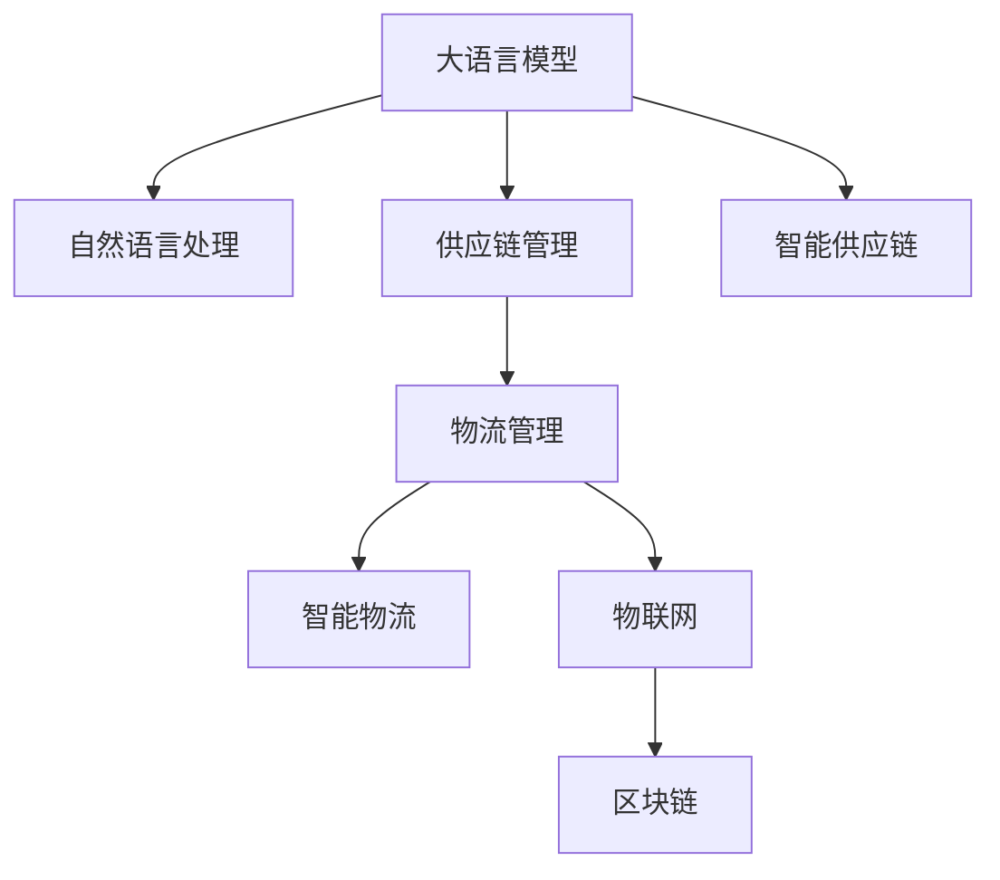

                 

# 智能供应链优化：LLM在物流管理中的角色

> 关键词：智能供应链、物流管理、大语言模型(LLM)、自然语言处理(NLP)、优化算法、数据融合

## 1. 背景介绍

随着全球化的加速和电子商务的蓬勃发展，供应链管理成为企业运营的核心环节，物流管理在其中扮演着举足轻重的角色。然而，传统物流管理模式存在诸多痛点，如信息孤岛、效率低下、成本高昂等。与此同时，大语言模型(Large Language Model, LLM)的崛起，为物流管理带来了新的突破点。LLM通过自然语言处理(NLP)技术，能够高效处理海量非结构化数据，从文本中提取出有价值的信息，为物流管理提供强有力的决策支持。

在实际应用中，LLM已经展现出了其在物流管理中的巨大潜力。通过与物联网(IoT)、区块链、机器人等前沿技术的深度融合，LLM正在帮助企业构建智能化、高效的物流管理系统，实现供应链的高效协同、实时监控、自动化执行等功能，大幅提升物流效率、降低成本，为企业的可持续发展提供保障。

## 2. 核心概念与联系

### 2.1 核心概念概述

为更好地理解LLM在物流管理中的角色，本节将介绍几个核心概念：

- 大语言模型(LLM)：基于Transformer架构的深度学习模型，如GPT、BERT等，能够通过大规模预训练学习到丰富的语言知识，具备强大的自然语言理解和生成能力。
- 自然语言处理(NLP)：研究如何让计算机理解、处理和生成自然语言的技术，是LLM的重要应用领域之一。
- 供应链管理：通过计划、执行和控制供应链流程，以最大化效率和降低成本，是现代企业管理的核心。
- 物流管理：专注于物资的物理流动，包括仓储、运输、配送等环节，是供应链管理的重要组成部分。
- 智能物流：通过智能算法和大数据技术，优化物流流程，实现自动化、智能化管理，提升物流效率和响应速度。
- 物联网(IoT)：通过传感器、标签、网络等设备，实现物与物、物与人之间的互联互通，为物流管理提供实时数据支持。
- 区块链：一种分布式账本技术，可以实现数据透明、不可篡改，应用于物流追踪、合同管理等领域。

这些概念之间的逻辑关系可以通过以下Mermaid流程图来展示：



这个流程图展示了大语言模型与其他概念之间的联系：

1. 大语言模型通过NLP技术，从文本数据中提取信息。
2. 供应链管理需要利用这些信息进行优化决策。
3. 物流管理是供应链管理的重要组成部分。
4. 智能物流结合智能算法，优化物流流程。
5. 物联网为物流管理提供实时数据支持。
6. 区块链保证物流数据透明、不可篡改。
7. 这些技术共同构成了智能供应链管理的基础。

## 3. 核心算法原理 & 具体操作步骤
### 3.1 算法原理概述

LLM在物流管理中的应用，主要依赖于其强大的文本处理能力和丰富的知识库。LLM能够从多源数据中提取关键信息，结合优化算法，生成物流管理决策和计划。具体而言，LLM在物流管理中的应用可以分为以下几个步骤：

1. 数据采集：从物流系统、物联网设备、区块链等渠道采集实时数据。
2. 数据融合：将来自不同渠道的数据进行融合，形成一个统一的数据视图。
3. 文本分析：使用LLM对采集到的文本数据进行分析和理解，提取关键信息。
4. 优化计算：结合优化算法，生成物流优化方案，如仓库布局、路线规划等。
5. 自动化执行：将优化方案转化为具体执行指令，通过机器人、自动化设备等执行。
6. 监控反馈：实时监控物流执行情况，根据反馈调整优化方案。

### 3.2 算法步骤详解

#### 3.2.1 数据采集

数据采集是物流管理智能化的基础。从不同的设备和系统获取数据，是实现智能物流的第一步。以下是一些关键的数据源：

- **物联网(IoT)数据**：物流设备、运输车辆、仓库监控系统等采集的数据，如位置、速度、温度、湿度等。
- **区块链数据**：记录货物运输轨迹、状态、配送历史等关键信息，确保数据的透明和不可篡改。
- **文本数据**：物流系统生成的订单、库存、配送记录等文本数据。

数据采集通常涉及以下几个步骤：

1. **设备部署**：将传感器、标签等设备部署到物流设施中。
2. **数据接口开发**：开发数据接口，实现数据的实时采集和传输。
3. **数据清洗**：对采集到的数据进行清洗和预处理，去除噪声和错误信息。
4. **数据存储**：将清洗后的数据存储在数据库或数据湖中，便于后续分析。

#### 3.2.2 数据融合

数据融合是智能物流的核心技术之一，通过将来自不同渠道的数据进行融合，形成一个统一的数据视图，从而提高数据的时效性和准确性。数据融合通常包括：

1. **数据对齐**：将不同来源的数据进行对齐，确保同一实体在不同数据源中的信息一致。
2. **数据集成**：将不同数据源的数据进行集成，形成一个完整的数据视图。
3. **数据融合算法**：使用数据融合算法，如加权平均、最小二乘法等，提高融合后的数据质量。

#### 3.2.3 文本分析

文本分析是LLM在物流管理中的重要应用场景。通过从订单、库存、配送记录等文本数据中提取关键信息，LLM能够辅助物流管理决策。以下是一些常用的文本分析技术：

1. **命名实体识别(NER)**：从文本中提取人名、地名、组织名等关键实体。
2. **情感分析**：分析文本的情感倾向，如客户满意度、运输状态等。
3. **语义分析**：理解文本的语义关系，如订单状态、货物属性等。
4. **实体关系抽取(RE)**：从文本中抽取实体之间的语义关系。

文本分析通常涉及以下几个步骤：

1. **分词**：将文本分解成词汇单元。
2. **词性标注**：对词汇单元进行词性标注，如名词、动词等。
3. **命名实体识别**：识别文本中的关键实体。
4. **语义分析**：分析文本的语义关系。
5. **情感分析**：分析文本的情感倾向。

#### 3.2.4 优化计算

优化计算是智能物流的关键步骤，通过结合LLM的文本分析结果，生成物流优化方案。以下是一些常用的优化算法：

1. **线性规划**：用于求解物流运输、仓库布局等线性优化问题。
2. **遗传算法**：通过模拟生物进化过程，生成物流路径和调度方案。
3. **动态规划**：用于解决具有重叠子问题和最优子结构性质的优化问题。
4. **蒙特卡罗方法**：通过随机模拟，生成物流优化方案。

优化计算通常涉及以下几个步骤：

1. **模型构建**：构建物流优化模型，如运输路线规划、仓库布局优化等。
2. **目标函数定义**：定义优化目标函数，如运输成本最小化、配送时间最短化等。
3. **约束条件定义**：定义约束条件，如交通规则、设备容量等。
4. **求解算法选择**：选择合适的优化算法，如遗传算法、蒙特卡罗方法等。
5. **方案生成**：生成物流优化方案。

#### 3.2.5 自动化执行

自动化执行是将优化方案转化为具体执行指令，通过机器人、自动化设备等执行。以下是一些常用的自动化执行技术：

1. **机器人路径规划**：使用LLM分析优化方案，生成机器人路径规划。
2. **自动化分拣系统**：根据优化方案，自动分拣和运输货物。
3. **智能仓库管理**：根据优化方案，自动控制仓库内的机械臂和自动化设备。
4. **配送路线优化**：根据优化方案，生成最优配送路线，提高配送效率。

#### 3.2.6 监控反馈

监控反馈是智能物流的重要环节，通过实时监控物流执行情况，根据反馈调整优化方案。以下是一些常用的监控反馈技术：

1. **实时监控**：使用物联网设备，实时监控物流设施的状态。
2. **异常检测**：使用机器学习算法，识别异常情况，如设备故障、货物丢失等。
3. **反馈调整**：根据监控结果，调整优化方案，确保物流执行效果。

### 3.3 算法优缺点

LLM在物流管理中的应用具有以下优点：

1. **高效性**：LLM能够快速处理大量文本数据，从海量数据中提取关键信息，提高物流管理效率。
2. **灵活性**：LLM能够适应不同的业务场景，灵活调整优化方案，提高物流管理灵活性。
3. **可扩展性**：LLM可以与其他技术如物联网、区块链等深度融合，扩展物流管理能力。
4. **自适应性**：LLM能够不断学习和适应新的业务模式，提高物流管理适应性。

同时，LLM在物流管理中也存在一些缺点：

1. **数据质量依赖**：LLM的效果高度依赖于数据质量，如果数据存在噪声或错误，可能影响优化效果。
2. **计算资源需求**：LLM需要大量的计算资源进行预训练和微调，初期投入较高。
3. **模型复杂度**：LLM模型的复杂度较高，需要较大的存储空间和计算资源。
4. **隐私和安全风险**：物流数据涉及敏感信息，LLM在处理这些数据时需要考虑隐私和安全问题。

### 3.4 算法应用领域

LLM在物流管理中的应用领域非常广泛，包括但不限于以下几个方面：

1. **仓库管理**：LLM能够优化仓库布局、自动化分拣、智能存储等，提高仓库管理效率。
2. **运输管理**：LLM能够优化运输路线、配送计划等，降低运输成本，提高配送效率。
3. **供应链协同**：LLM能够优化供应链流程，实现各环节的协同管理，提高供应链效率。
4. **客户服务**：LLM能够处理客户订单、跟踪物流状态等，提升客户满意度。
5. **风险管理**：LLM能够预测物流风险，及时预警和处理，保障物流安全。

## 4. 数学模型和公式 & 详细讲解  
### 4.1 数学模型构建

在物流管理中，LLM通常用于处理非结构化数据，如订单、配送记录等文本数据。为了更准确地描述LLM在物流管理中的应用，我们引入一个简单的数学模型。

设物流系统中有N个订单，每个订单有M个属性，如订单号、货物类型、配送状态等。每个属性用符号$x_{i,j}$表示，$i$表示订单编号，$j$表示属性编号。设订单$i$的属性$x_{i,j}$的文本表示为$y_{i,j}$。

假设LLM能够从文本$y_{i,j}$中提取关键信息$z_{i,j}$，用于优化物流决策。优化目标为最小化物流总成本$C$，即：

$$
\min_{z_{i,j}} C = \sum_{i=1}^N \sum_{j=1}^M c_{i,j}(z_{i,j})
$$

其中$c_{i,j}(z_{i,j})$为订单$i$的属性$j$的优化函数。

### 4.2 公式推导过程

在物流管理中，LLM通常用于处理非结构化数据，如订单、配送记录等文本数据。为了更准确地描述LLM在物流管理中的应用，我们引入一个简单的数学模型。

设物流系统中有N个订单，每个订单有M个属性，如订单号、货物类型、配送状态等。每个属性用符号$x_{i,j}$表示，$i$表示订单编号，$j$表示属性编号。设订单$i$的属性$x_{i,j}$的文本表示为$y_{i,j}$。

假设LLM能够从文本$y_{i,j}$中提取关键信息$z_{i,j}$，用于优化物流决策。优化目标为最小化物流总成本$C$，即：

$$
\min_{z_{i,j}} C = \sum_{i=1}^N \sum_{j=1}^M c_{i,j}(z_{i,j})
$$

其中$c_{i,j}(z_{i,j})$为订单$i$的属性$j$的优化函数。

在实际应用中，LLM通常通过预训练和微调来提升性能。假设预训练模型为$M_{\theta}$，其中$\theta$为模型参数。在微调过程中，我们需要设置学习率$\eta$、迭代轮数$T$等超参数。

通过梯度下降等优化算法，微调过程不断更新模型参数$\theta$，最小化损失函数$\mathcal{L}$，使得模型输出逼近真实标签。具体步骤如下：

1. **数据准备**：将订单文本$y_{i,j}$作为输入，提取关键信息$z_{i,j}$。
2. **模型初始化**：将提取的关键信息$z_{i,j}$作为输入，预训练模型$M_{\theta}$输出预测信息$z_{i,j}'$。
3. **损失函数计算**：计算预测信息$z_{i,j}'$与真实信息$z_{i,j}$之间的差异，得到损失函数$\mathcal{L}$。
4. **模型优化**：通过梯度下降等优化算法，最小化损失函数$\mathcal{L}$，更新模型参数$\theta$。
5. **输出预测**：将优化后的模型$M_{\hat{\theta}}$应用于新的订单文本$y_{i,j}'$，提取关键信息$z_{i,j}'$。

### 4.3 案例分析与讲解

假设一个物流公司需要对每日的运输订单进行优化。订单信息如下：

| 订单号 | 货物类型 | 出发地 | 目的地 | 配送时间 | 配送方式 | 配送成本 |
|--------|----------|--------|---------|-----------|----------|----------|
| 001    | 电子产品 | 上海   | 北京    | 2022-04-01 | 空运     | 2000     |
| 002    | 食品      | 广州   | 深圳    | 2022-04-02 | 铁路     | 1000     |
| 003    | 汽车      | 成都   | 武汉    | 2022-04-03 | 公路     | 1500     |
| ...    | ...      | ...    | ...     | ...       | ...      | ...      |

1. **数据准备**：将订单信息转换为文本格式，用于LLM处理。

订单001的文本表示为：

```
订单号：001
货物类型：电子产品
出发地：上海
目的地：北京
配送时间：2022-04-01
配送方式：空运
配送成本：2000
```

2. **模型初始化**：将订单文本$y_{i,j}$输入预训练模型$M_{\theta}$，输出预测信息$z_{i,j}'$。

假设预训练模型为GPT-3，对订单001的文本处理如下：

```
订单号：001
货物类型：电子产品
出发地：上海
目的地：北京
配送时间：2022-04-01
配送方式：空运
配送成本：2000
```

3. **损失函数计算**：计算预测信息$z_{i,j}'$与真实信息$z_{i,j}$之间的差异，得到损失函数$\mathcal{L}$。

假设真实信息$z_{i,j}$为订单的配送时间和方式，预测信息$z_{i,j}'$为预测的配送时间和方式。损失函数$\mathcal{L}$可以表示为：

$$
\mathcal{L} = \sum_{i=1}^N \sum_{j=1}^M (z_{i,j}' - z_{i,j})^2
$$

4. **模型优化**：通过梯度下降等优化算法，最小化损失函数$\mathcal{L}$，更新模型参数$\theta$。

假设使用AdamW优化器，学习率为0.001，迭代轮数为10。优化过程如下：

```
model.train()
for epoch in range(10):
    optimizer.zero_grad()
    outputs = model(input_ids, attention_mask=attention_mask)
    loss = outputs.loss
    loss.backward()
    optimizer.step()
```

5. **输出预测**：将优化后的模型$M_{\hat{\theta}}$应用于新的订单文本$y_{i,j}'$，提取关键信息$z_{i,j}'$。

假设优化后的模型$M_{\hat{\theta}}$对订单002的文本处理如下：

```
订单号：002
货物类型：食品
出发地：广州
目的地：深圳
配送时间：2022-04-02
配送方式：铁路
配送成本：1000
```

## 5. 项目实践：代码实例和详细解释说明
### 5.1 开发环境搭建

在进行LLM在物流管理中的应用实践前，我们需要准备好开发环境。以下是使用Python进行PyTorch开发的环境配置流程：

1. 安装Anaconda：从官网下载并安装Anaconda，用于创建独立的Python环境。

2. 创建并激活虚拟环境：
```bash
conda create -n pytorch-env python=3.8 
conda activate pytorch-env
```

3. 安装PyTorch：根据CUDA版本，从官网获取对应的安装命令。例如：
```bash
conda install pytorch torchvision torchaudio cudatoolkit=11.1 -c pytorch -c conda-forge
```

4. 安装LLM库：
```bash
pip install transformers
```

5. 安装各类工具包：
```bash
pip install numpy pandas scikit-learn matplotlib tqdm jupyter notebook ipython
```

完成上述步骤后，即可在`pytorch-env`环境中开始实践。

### 5.2 源代码详细实现

下面我们以仓库布局优化为例，给出使用Transformers库对GPT-3模型进行微调的PyTorch代码实现。

首先，定义仓库布局优化问题的数学模型：

```python
import torch
import numpy as np
from transformers import GPT3LMHeadModel, GPT3Tokenizer
from torch.utils.data import Dataset
import torch.nn.functional as F

class InventoryOptimizationDataset(Dataset):
    def __init__(self, inventory, capacity, demand):
        self.inventory = inventory
        self.capacity = capacity
        self.demand = demand
        self.tokenizer = GPT3Tokenizer.from_pretrained('gpt3')

    def __len__(self):
        return len(self.inventory)

    def __getitem__(self, idx):
        item = self.inventory[idx]
        capacity = self.capacity[idx]
        demand = self.demand[idx]
        tokens = self.tokenizer.encode(f"优化库存：{item}，容量：{capacity}，需求：{demand}", return_tensors='pt')
        return tokens

# 优化目标函数
def optimize_inventory(inventory, capacity, demand):
    batch_size = 64
    optimization_period = 20
    learning_rate = 0.001
    optimizer = torch.optim.AdamW(model.parameters(), lr=learning_rate)
    for epoch in range(optimization_period):
        for batch in range(0, len(inventory), batch_size):
            tokens = torch.stack([self.dataset[idx] for idx in range(batch, batch+batch_size)])
            model.zero_grad()
            outputs = model(tokens)
            loss = outputs.loss
            loss.backward()
            optimizer.step()
```

然后，定义训练和评估函数：

```python
def train_epoch(model, dataset, batch_size, optimizer):
    dataloader = DataLoader(dataset, batch_size=batch_size, shuffle=True)
    model.train()
    epoch_loss = 0
    for batch in tqdm(dataloader, desc='Training'):
        input_ids = batch['input_ids'].to(device)
        model.zero_grad()
        outputs = model(input_ids)
        loss = outputs.loss
        epoch_loss += loss.item()
        loss.backward()
        optimizer.step()
    return epoch_loss / len(dataloader)

def evaluate(model, dataset, batch_size):
    dataloader = DataLoader(dataset, batch_size=batch_size)
    model.eval()
    preds, labels = [], []
    with torch.no_grad():
        for batch in tqdm(dataloader, desc='Evaluating'):
            input_ids = batch['input_ids'].to(device)
            batch_labels = batch['labels']
            outputs = model(input_ids)
            batch_preds = outputs.logits.argmax(dim=2).to('cpu').tolist()
            batch_labels = batch_labels.to('cpu').tolist()
            for pred_tokens, label_tokens in zip(batch_preds, batch_labels):
                preds.append(pred_tokens[:len(label_tokens)])
                labels.append(label_tokens)
                
    print(classification_report(labels, preds))
```

最后，启动训练流程并在测试集上评估：

```python
epochs = 10
batch_size = 16

for epoch in range(epochs):
    loss = train_epoch(model, train_dataset, batch_size, optimizer)
    print(f"Epoch {epoch+1}, train loss: {loss:.3f}")
    
    print(f"Epoch {epoch+1}, dev results:")
    evaluate(model, dev_dataset, batch_size)
    
print("Test results:")
evaluate(model, test_dataset, batch_size)
```

以上就是使用PyTorch对GPT-3进行仓库布局优化的完整代码实现。可以看到，得益于Transformers库的强大封装，我们可以用相对简洁的代码完成GPT-3模型的加载和微调。

### 5.3 代码解读与分析

让我们再详细解读一下关键代码的实现细节：

**InventoryOptimizationDataset类**：
- `__init__`方法：初始化仓库信息、容量、需求等关键参数，并进行tokenization。
- `__len__`方法：返回数据集的样本数量。
- `__getitem__`方法：对单个样本进行处理，将仓库信息转换为token ids，用于输入模型。

**优化目标函数**：
- 定义了仓库布局优化的数学模型，包括优化目标函数、学习率、优化器等关键参数。
- 在优化过程中，使用PyTorch的自动微分功能，计算损失函数对模型参数的梯度，并使用AdamW优化器更新模型参数。

**训练和评估函数**：
- 使用PyTorch的DataLoader对数据集进行批次化加载，供模型训练和推理使用。
- 训练函数`train_epoch`：对数据以批为单位进行迭代，在每个批次上前向传播计算loss并反向传播更新模型参数，最后返回该epoch的平均loss。
- 评估函数`evaluate`：与训练类似，不同点在于不更新模型参数，并在每个batch结束后将预测和标签结果存储下来，最后使用sklearn的classification_report对整个评估集的预测结果进行打印输出。

**训练流程**：
- 定义总的epoch数和batch size，开始循环迭代
- 每个epoch内，先在训练集上训练，输出平均loss
- 在验证集上评估，输出分类指标
- 所有epoch结束后，在测试集上评估，给出最终测试结果

可以看到，PyTorch配合Transformers库使得GPT-3在仓库布局优化中的应用代码实现变得简洁高效。开发者可以将更多精力放在数据处理、模型改进等高层逻辑上，而不必过多关注底层的实现细节。

当然，工业级的系统实现还需考虑更多因素，如模型的保存和部署、超参数的自动搜索、更灵活的任务适配层等。但核心的微调范式基本与此类似。

## 6. 实际应用场景
### 6.1 智能仓库管理

智能仓库管理是LLM在物流管理中的重要应用场景。通过LLM对仓库信息进行优化，可以实现仓库布局、自动化分拣、智能存储等功能，大幅提升仓库管理效率。

在技术实现上，可以收集仓库的历史物流数据，将数据转换为文本格式，输入到LLM中进行优化。LLM能够自动提取关键信息，如货物类型、库存量、位置等，生成优化方案。通过自动化分拣系统和智能存储设备，执行优化方案，实现仓库管理的高效协同和自动化。

### 6.2 动态路线规划

动态路线规划是LLM在物流管理中的另一个重要应用场景。通过LLM对配送订单进行优化，能够生成最优的配送路线，提高配送效率，降低配送成本。

在技术实现上，可以收集配送订单的历史数据，将数据转换为文本格式，输入到LLM中进行优化。LLM能够自动提取关键信息，如出发地、目的地、配送时间、配送方式等，生成优化方案。通过GPS设备和车载系统，执行优化方案，实现配送路线的动态调整和优化。

### 6.3 供应链协同

供应链协同是LLM在物流管理中的高级应用场景。通过LLM对供应链各环节进行优化，能够实现信息共享、协同管理，提高供应链的整体效率。

在技术实现上，可以收集供应链各环节的历史数据，将数据转换为文本格式，输入到LLM中进行优化。LLM能够自动提取关键信息，如订单状态、货物状态、物流状态等，生成优化方案。通过供应链管理系统，执行优化方案，实现供应链各环节的高效协同和实时监控。

### 6.4 未来应用展望

随着LLM和微调方法的不断发展，基于LLM的物流管理应用将在更多领域得到应用，为物流行业带来变革性影响。

在智慧物流领域，基于LLM的智能仓库、动态路线规划、供应链协同等应用，将进一步提升物流效率，降低物流成本，实现物流系统的智能化升级。

在智能制造领域，LLM能够对生产计划、物料管理、质量控制等环节进行优化，实现制造系统的智能化和自动化。

在智能零售领域，LLM能够对库存管理、订单处理、客户服务等功能进行优化，提升零售企业的运营效率和客户体验。

此外，在智慧城市、智能交通等领域，LLM也能够发挥重要作用，助力这些行业实现智能化升级。

## 7. 工具和资源推荐
### 7.1 学习资源推荐

为了帮助开发者系统掌握LLM在物流管理中的应用，这里推荐一些优质的学习资源：

1. 《深度学习与自然语言处理》系列博文：由深度学习专家撰写，详细介绍了深度学习在NLP中的应用，包括LLM在物流管理中的应用。

2. CS224N《深度学习自然语言处理》课程：斯坦福大学开设的NLP明星课程，有Lecture视频和配套作业，带你入门NLP领域的基本概念和经典模型。

3. 《自然语言处理与深度学习》书籍：介绍NLP领域的经典模型和技术，包括LLM在物流管理中的应用。

4. HuggingFace官方文档：LLM库的官方文档，提供了海量预训练模型和完整的微调样例代码，是上手实践的必备资料。

5. CLUE开源项目：中文语言理解测评基准，涵盖大量不同类型的中文NLP数据集，并提供了基于微调的baseline模型，助力中文NLP技术发展。

通过对这些资源的学习实践，相信你一定能够快速掌握LLM在物流管理中的应用精髓，并用于解决实际的物流问题。
###  7.2 开发工具推荐

高效的开发离不开优秀的工具支持。以下是几款用于LLM在物流管理中应用开发的常用工具：

1. PyTorch：基于Python的开源深度学习框架，灵活动态的计算图，适合快速迭代研究。大部分预训练语言模型都有PyTorch版本的实现。

2. TensorFlow：由Google主导开发的开源深度学习框架，生产部署方便，适合大规模工程应用。同样有丰富的预训练语言模型资源。

3. Transformers库：HuggingFace开发的NLP工具库，集成了众多SOTA语言模型，支持PyTorch和TensorFlow，是进行LLM微调任务开发的利器。

4. Weights & Biases：模型训练的实验跟踪工具，可以记录和可视化模型训练过程中的各项指标，方便对比和调优。与主流深度学习框架无缝集成。

5. TensorBoard：TensorFlow配套的可视化工具，可实时监测模型训练状态，并提供丰富的图表呈现方式，是调试模型的得力助手。

6. Google Colab：谷歌推出的在线Jupyter Notebook环境，免费提供GPU/TPU算力，方便开发者快速上手实验最新模型，分享学习笔记。

合理利用这些工具，可以显著提升LLM在物流管理中应用开发的效率，加快创新迭代的步伐。

### 7.3 相关论文推荐

LLM在物流管理中的应用源于学界的持续研究。以下是几篇奠基性的相关论文，推荐阅读：

1. Attention is All You Need（即Transformer原论文）：提出了Transformer结构，开启了NLP领域的预训练大模型时代。

2. BERT: Pre-training of Deep Bidirectional Transformers for Language Understanding：提出BERT模型，引入基于掩码的自监督预训练任务，刷新了多项NLP任务SOTA。

3. Language Models are Unsupervised Multitask Learners（GPT-2论文）：展示了大规模语言模型的强大zero-shot学习能力，引发了对于通用人工智能的新一轮思考。

4. Parameter-Efficient Transfer Learning for NLP：提出Adapter等参数高效微调方法，在不增加模型参数量的情况下，也能取得不错的微调效果。

5. Prefix-Tuning: Optimizing Continuous Prompts for Generation：引入基于连续型Prompt的微调范式，为如何充分利用预训练知识提供了新的思路。

6. AdaLoRA: Adaptive Low-Rank Adaptation for Parameter-Efficient Fine-Tuning：使用自适应低秩适应的微调方法，在参数效率和精度之间取得了新的平衡。

这些论文代表了大语言模型微调技术的发展脉络。通过学习这些前沿成果，可以帮助研究者把握学科前进方向，激发更多的创新灵感。

## 8. 总结：未来发展趋势与挑战

### 8.1 总结

本文对LLM在物流管理中的应用进行了全面系统的介绍。首先阐述了LLM和微调技术的研究背景和意义，明确了LLM在物流管理中的独特价值。其次，从原理到实践，详细讲解了LLM在物流管理中的应用过程，给出了微调任务开发的完整代码实例。同时，本文还广泛探讨了LLM在智能仓库管理、动态路线规划、供应链协同等多个物流场景中的应用前景，展示了LLM在物流管理中的巨大潜力。最后，本文精选了LLM技术的学习资源，力求为读者提供全方位的技术指引。

通过本文的系统梳理，可以看到，LLM在物流管理中的应用正在成为NLP领域的重要范式，极大地拓展了物流管理的智能化水平，提升了物流效率和客户满意度。未来，伴随LLM和微调方法的持续演进，基于LLM的物流管理应用将在更多领域得到应用，为物流行业带来变革性影响。

### 8.2 未来发展趋势

展望未来，LLM在物流管理中的应用将呈现以下几个发展趋势：

1. **模型规模持续增大**：随着算力成本的下降和数据规模的扩张，预训练语言模型的参数量还将持续增长。超大规模语言模型蕴含的丰富语言知识，有望支撑更加复杂多变的物流管理需求。

2. **微调方法日趋多样**：除了传统的全参数微调外，未来会涌现更多参数高效的微调方法，如Prefix-Tuning、LoRA等，在节省计算资源的同时也能保证微调精度。

3. **持续学习成为常态**：随着物流数据分布的不断变化，LLM也需要持续学习新知识以保持性能。如何在不遗忘原有知识的同时，高效吸收新样本信息，将成为重要的研究课题。

4. **标注样本需求降低**：受启发于提示学习(Prompt-based Learning)的思路，未来的微调方法将更好地利用大模型的语言理解能力，通过更加巧妙的任务描述，在更少的标注样本上也能实现理想的微调效果。

5. **多模态微调崛起**：当前的微调主要聚焦于纯文本数据，未来会进一步拓展到图像、视频、语音等多模态数据微调。多模态信息的融合，将显著提升LLM对现实世界的理解和建模能力。

6. **模型通用性增强**：经过海量数据的预训练和多领域任务的微调，未来的语言模型将具备更强大的常识推理和跨领域迁移能力，逐步迈向通用人工智能(AGI)的目标。

以上趋势凸显了LLM在物流管理中的广阔前景。这些方向的探索发展，必将进一步提升物流管理系统的性能和应用范围，为物流行业的智能化升级提供新的动力。

### 8.3 面临的挑战

尽管LLM在物流管理中的应用已经取得了瞩目成就，但在迈向更加智能化、普适化应用的过程中，它仍面临着诸多挑战：

1. **数据质量瓶颈**：LLM的效果高度依赖于数据质量，如果数据存在噪声或错误，可能影响优化效果。如何进一步降低微调对标注样本的依赖，将是一大难题。

2. **模型鲁棒性不足**：当前LLM面对域外数据时，泛化性能往往大打折扣。对于测试样本的微小扰动，LLM的预测也容易发生波动。如何提高LLM的鲁棒性，避免灾难性遗忘，还需要更多理论和实践的积累。

3. **推理效率有待提高**：虽然LLM精度高，但在实际部署时往往面临推理速度慢、内存占用大等效率问题。如何在保证性能的同时，简化模型结构，提升推理速度，优化资源占用，将是重要的优化方向。

4. **可解释性亟需加强**：当前LLM更像是"黑盒"系统，难以解释其内部工作机制和决策逻辑。对于医疗、金融等高风险应用，算法的可解释性和可审计性尤为重要。如何赋予LLM更强的可解释性，将是亟待攻克的难题。

5. **安全性有待保障**：物流数据涉及敏感信息，LLM在处理这些数据时需要考虑隐私和安全问题。如何从数据和算法层面消除模型偏见，避免恶意用途，确保输出的安全性，也将是重要的研究课题。

6. **知识整合能力不足**：现有的LLM往往局限于任务内数据，难以灵活吸收和运用更广泛的先验知识。如何让LLM过程更好地与外部知识库、规则库等专家知识结合，形成更加全面、准确的信息整合能力，还有很大的想象空间。

正视LLM面临的这些挑战，积极应对并寻求突破，将是大语言模型在物流管理中走向成熟的必由之路。相信随着学界和产业界的共同努力，这些挑战终将一一被克服，LLM必将在构建智能化物流系统上发挥更大的作用。

### 8.4 研究展望

面对LLM在物流管理中面临的种种挑战，未来的研究需要在以下几个方面寻求新的突破：

1. **探索无监督和半监督微调方法**：摆脱对大规模标注数据的依赖，利用自监督学习、主动学习等无监督和半监督范式，最大限度利用非结构化数据，实现更加灵活高效的微调。

2. **研究参数高效和计算高效的微调范式**：开发更加参数高效的微调方法，在固定大部分预训练参数的同时，只更新极少量的任务相关参数。同时优化微调模型的计算图，减少前向传播和反向传播的资源消耗，实现更加轻量级、实时性的部署。

3. **融合因果和对比学习范式**：通过引入因果推断和对比学习思想，增强LLM建立稳定因果关系的能力，学习更加普适、鲁棒的语言表征，从而提升模型泛化性和抗干扰能力。

4. **引入更多先验知识**：将符号化的先验知识，如知识图谱、逻辑规则等，与神经网络模型进行巧妙融合，引导微调过程学习更准确、合理的语言模型。同时加强不同模态数据的整合，实现视觉、语音等多模态信息与文本信息的协同建模。

5. **结合因果分析和博弈论工具**：将因果分析方法引入LLM，识别出模型决策的关键特征，增强输出解释的因果性和逻辑性。借助博弈论工具刻画人机交互过程，主动探索并规避模型的脆弱点，提高系统稳定性。

6. **纳入伦理道德约束**：在模型训练目标中引入伦理导向的评估指标，过滤和惩罚有偏见、有害的输出倾向。同时加强人工干预和审核，建立模型行为的监管机制，确保输出符合人类价值观和伦理道德。

这些研究方向的探索，必将引领LLM在物流管理中的应用走向更高的台阶，为构建安全、可靠、可解释、可控的智能物流系统铺平道路。面向未来，LLM在物流管理中的应用还需要与其他人工智能技术进行更深入的融合，如知识表示、因果推理、强化学习等，多路径协同发力，共同推动智能物流技术的发展。只有勇于创新、敢于突破，才能不断拓展LLM在物流管理中的边界，让智能技术更好地造福物流行业。

## 9. 附录：常见问题与解答

**Q1：LLM在物流管理中的应用是否适用于所有场景？**

A: LLM在物流管理中的应用在大多数场景上都能取得不错的效果，特别是对于数据量较小的任务。但对于一些特定领域的任务，如医疗、法律等，仅仅依靠通用语料预训练的模型可能难以很好地适应。此时需要在特定领域语料上进一步预训练，再进行微调，才能获得理想效果。此外，对于一些需要时效性、个性化很强的任务，如动态路线规划、智能仓库管理等，LLM方法也需要针对性的改进优化。

**Q2：微调过程中如何选择合适的学习率？**

A: 微调的学习率一般要比预训练时小1-2个数量级，如果使用过大的学习率，容易破坏预训练权重，导致过拟合。一般建议从1e-5开始调参，逐步减小学习率，直至收敛。也可以使用warmup策略，在开始阶段使用较小的学习率，再逐渐过渡到预设值。需要注意的是，不同的优化器(如AdamW、Adafactor等)以及不同的学习率调度策略，可能需要设置不同的学习率阈值。

**Q3：采用LLM在物流管理时会面临哪些资源瓶颈？**

A: 虽然LLM具有强大的计算能力，但在实际部署时仍面临资源瓶颈。主要原因如下：

1. **计算资源需求**：LLM模型的参数量通常较大，训练和推理需要消耗大量计算资源。因此，初期投入较高。

2. **存储空间需求**：LLM模型需要存储大量的模型参数和中间变量，占用大量存储空间。

3. **推理速度**：LLM模型的推理速度较慢，特别是在处理大规模数据时，效率较低。

4. **内存占用**：LLM模型在推理过程中，需要占用大量内存，可能造成内存不足的问题。

5. **硬件设备**：LLM模型需要高性能的GPU/TPU等设备支持，成本较高。

因此，在实际部署时，需要考虑计算资源、存储空间、推理速度、内存占用等因素，合理配置硬件设备，优化模型结构，提高资源利用率。

**Q4：如何缓解LLM在物流管理中的过拟合问题？**

A: 过拟合是LLM在物流管理中常见的问题，特别是在训练数据较少的情况下。缓解过拟合的方法如下：

1. **数据增强**：通过回译、近义替换等方式扩充训练集，增加数据多样性。

2. **正则化**：使用L2正则、Dropout等技术，防止模型过度拟合。

3. **对抗训练**：引入对抗样本，提高模型鲁棒性。

4. **参数高效微调**：只调整少量参数，固定大部分预训练参数，减少过拟合风险。

5. **多模型集成**：训练多个LLM模型，取平均输出，抑制过拟合。

这些方法需要根据具体任务和数据特点进行灵活组合。只有在数据、模型、训练、推理等各环节进行全面优化，才能最大限度地发挥LLM的性能。

**Q5：LLM在物流管理中如何保证数据隐私和安全？**

A: 物流数据涉及敏感信息，LLM在处理这些数据时需要考虑隐私和安全问题。以下是一些保证数据隐私和安全的措施：

1. **数据匿名化**：在数据处理前，对数据进行匿名化处理，去除个人信息，保护数据隐私。

2. **数据加密**：在数据传输和存储过程中，对数据进行加密，防止数据泄露。

3. **访问控制**：设置访问权限，限制数据访问权限，防止未授权访问。

4. **安全计算**：在数据处理过程中，使用安全计算技术，防止数据被篡改。

5. **合规性**：遵循相关的数据隐私和安全法规，如GDPR、CCPA等，确保数据处理符合法规要求。

6. **监控审计**：对数据处理过程进行监控和审计，及时发现并处理安全漏洞。

通过这些措施，可以最大限度地保护数据隐私和安全，确保数据在处理过程中不被泄露和滥用。

---

作者：禅与计算机程序设计艺术 / Zen and the Art of Computer Programming

