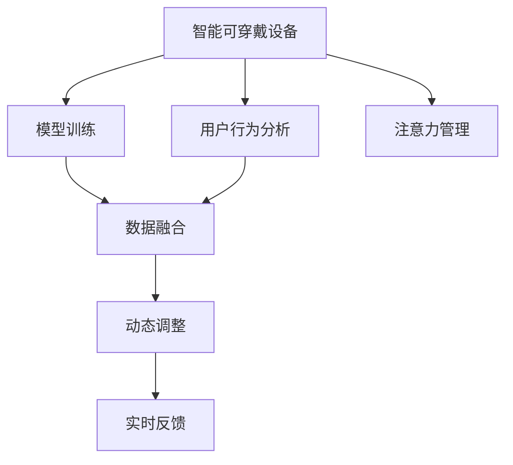

                 

# 智能可穿戴设备的注意力管理功能

> 关键词：智能可穿戴设备, 注意力管理, 用户行为分析, 模型训练, 人工智能, 数据融合, 动态调整, 实时反馈

## 1. 背景介绍

### 1.1 问题由来

随着技术的迅猛发展，智能可穿戴设备（如智能手表、健身追踪器、智能眼镜等）正在逐渐成为人们生活中不可或缺的一部分。然而，由于设备的功能越来越多，用户体验可能会因为注意力管理问题而变得混乱和低效。如何帮助用户有效管理他们的注意力，让他们集中精力在最重要和最相关的活动上，成为了智能可穿戴设备设计中一个亟待解决的关键问题。

### 1.2 问题核心关键点

智能可穿戴设备的注意力管理功能主要包括：

- **用户行为分析**：通过收集和分析用户的日常活动数据，如步数、心率、睡眠模式、社交互动等，来识别用户的注意力高峰期和低谷期。
- **模型训练**：使用机器学习算法（如深度学习）训练注意力管理模型，预测用户在不同场景下的注意力变化，并提供个性化建议。
- **数据融合**：将来自不同传感器和应用的数据融合在一起，以全面了解用户的注意力状态。
- **动态调整**：根据用户行为和环境变化，动态调整设备提醒和通知的频率和形式。
- **实时反馈**：通过即时反馈系统，让用户了解他们的注意力状态和行为模式。

### 1.3 问题研究意义

研究智能可穿戴设备的注意力管理功能，对于提升用户体验、提高设备的使用效率以及促进健康生活方式具有重要意义：

- 提升用户体验：通过智能可穿戴设备的注意力管理功能，用户可以更专注于重要的活动，减少分心，从而提高整体的生活质量和工作效率。
- 提高设备使用效率：智能可穿戴设备可以通过注意力管理功能，优化设备的提醒和通知策略，减少不必要的打扰，使用户更长时间地保持与设备的互动。
- 促进健康生活方式：通过分析用户的注意力状态和行为模式，智能可穿戴设备可以提供个性化的健康建议，帮助用户养成更健康的生活习惯。

## 2. 核心概念与联系

### 2.1 核心概念概述

为更好地理解智能可穿戴设备注意力管理功能的实现机制，本节将介绍几个关键概念及其联系：

- **智能可穿戴设备**：指通过传感器和计算能力，收集和分析用户数据，并提供个性化服务的设备，如智能手表、健身追踪器、智能眼镜等。
- **注意力管理**：指通过对用户的行为数据进行分析，预测用户在不同情境下的注意力水平，并根据这些预测提供相应的提示和建议，帮助用户更好地管理注意力。
- **用户行为分析**：指通过收集和分析用户的日常行为数据，识别用户的注意力高峰期和低谷期，以便更好地进行注意力管理。
- **模型训练**：使用机器学习算法，训练注意力管理模型，预测用户在不同情境下的注意力水平。
- **数据融合**：将来自不同传感器和应用的数据融合在一起，以全面了解用户的注意力状态。
- **动态调整**：根据用户行为和环境变化，动态调整设备提醒和通知的频率和形式，以更好地管理用户注意力。
- **实时反馈**：通过即时反馈系统，让用户了解他们的注意力状态和行为模式，以便更好地进行自我管理。

这些概念之间的逻辑关系可以通过以下Mermaid流程图来展示：



这个流程图展示了一些核心概念及其之间的关系：

1. 智能可穿戴设备通过用户行为分析和模型训练，来预测用户在不同情境下的注意力水平。
2. 数据融合将来自不同传感器和应用的数据整合在一起，以全面了解用户的注意力状态。
3. 动态调整根据用户行为和环境变化，优化设备提醒和通知策略，以更好地管理用户注意力。
4. 实时反馈通过即时反馈系统，让用户了解他们的注意力状态和行为模式，以便更好地进行自我管理。

## 3. 核心算法原理 & 具体操作步骤
### 3.1 算法原理概述

智能可穿戴设备的注意力管理功能主要基于监督学习和强化学习的原理：

- **监督学习**：通过收集大量的历史用户数据，训练模型预测用户在不同情境下的注意力水平。
- **强化学习**：通过模拟用户与设备之间的交互，训练模型动态调整设备提醒和通知策略，以最大化用户满意度。

### 3.2 算法步骤详解

智能可穿戴设备的注意力管理功能实现步骤如下：

**Step 1: 数据收集与预处理**

- 收集用户的日常活动数据，如步数、心率、睡眠模式、社交互动等。
- 清洗和预处理数据，处理缺失值、异常值，进行数据标准化。

**Step 2: 特征工程**

- 选择与用户注意力相关的特征，如步数、心率、社交互动频率等。
- 对特征进行编码和转换，以便机器学习算法能够处理。

**Step 3: 模型训练**

- 使用监督学习算法（如回归、分类、深度学习等）训练注意力管理模型。
- 对模型进行超参数调优，选择最优的模型结构和参数。

**Step 4: 数据融合**

- 将来自不同传感器和应用的数据融合在一起，如步数、心率、社交互动数据等。
- 使用加权平均、融合神经网络等方法，整合数据，以全面了解用户的注意力状态。

**Step 5: 动态调整**

- 根据用户行为和环境变化，动态调整设备提醒和通知的频率和形式。
- 使用强化学习算法，训练模型最大化用户满意度。

**Step 6: 实时反馈**

- 通过即时反馈系统，让用户了解他们的注意力状态和行为模式。
- 使用可视化工具，展示注意力管理模型的工作过程和结果。

**Step 7: 模型评估与优化**

- 对模型进行评估，使用各种指标（如准确率、召回率、F1分数等）衡量模型的性能。
- 根据评估结果，调整模型参数和特征，优化模型性能。

### 3.3 算法优缺点

智能可穿戴设备注意力管理功能的主要优点包括：

1. **个性化管理**：通过分析用户行为，提供个性化的注意力管理策略，提升用户体验。
2. **实时反馈**：实时反馈系统使用户能够及时了解他们的注意力状态，进行自我调整。
3. **动态调整**：根据用户行为和环境变化，动态调整设备提醒和通知策略，提高设备使用效率。
4. **数据融合**：通过数据融合，全面了解用户的注意力状态，提供更准确的预测。

然而，该算法也存在一些缺点：

1. **数据隐私**：收集和分析用户数据可能会涉及隐私问题，需要采取措施保护用户隐私。
2. **数据质量**：数据质量会直接影响模型的预测准确性，需要确保数据的完整性和准确性。
3. **计算资源需求**：模型训练和数据融合需要大量的计算资源，可能对设备硬件提出较高要求。
4. **用户适应性**：模型需要适应不同用户的个性化需求，可能需要更多的训练和调整。

### 3.4 算法应用领域

智能可穿戴设备的注意力管理功能主要应用于以下领域：

- **健康与健身**：通过分析用户的步数、心率、睡眠模式等数据，提供个性化的健康建议，帮助用户养成更健康的生活习惯。
- **工作与学习**：通过预测用户的注意力高峰期和低谷期，调整工作和学习环境，提升工作效率和专注度。
- **社交与娱乐**：通过预测用户的社交互动频率，调整社交提醒和通知策略，提升用户体验。
- **出行与导航**：通过分析用户的步数和位置信息，提供个性化的出行建议，优化导航路线。

## 4. 数学模型和公式 & 详细讲解  
### 4.1 数学模型构建

假设我们有一个智能可穿戴设备，收集了用户每天的活动数据 $D=\{(x_i, y_i)\}_{i=1}^N$，其中 $x_i$ 表示用户在第 $i$ 天的活动数据（如步数、心率等），$y_i$ 表示用户在该天内的注意力水平（如注意力指数 $A_i$）。

定义注意力管理模型的预测函数为 $f(x; \theta)$，其中 $\theta$ 为模型参数。我们的目标是最大化模型预测的准确性，即最小化预测误差：

$$
\min_{\theta} \sum_{i=1}^N ||f(x_i; \theta) - y_i||^2
$$

### 4.2 公式推导过程

假设我们使用线性回归模型来预测用户的注意力水平 $A_i$，模型公式为：

$$
f(x_i; \theta) = \theta_0 + \theta_1 x_{i1} + \theta_2 x_{i2} + ... + \theta_p x_{ip}
$$

其中，$x_{ij}$ 表示用户在第 $i$ 天第 $j$ 个特征的值，$p$ 表示特征的个数。线性回归模型的误差函数为：

$$
E(y_i, f(x_i; \theta)) = \frac{1}{2} ||y_i - f(x_i; \theta)||^2
$$

因此，我们的目标是最小化预测误差的平方和：

$$
\min_{\theta} \sum_{i=1}^N ||y_i - f(x_i; \theta)||^2
$$

为了求解该优化问题，我们可以使用梯度下降算法。梯度下降算法的更新公式为：

$$
\theta \leftarrow \theta - \eta \nabla_{\theta}E(y_i, f(x_i; \theta))
$$

其中 $\eta$ 为学习率。

### 4.3 案例分析与讲解

假设我们有一个智能手表，收集了用户每天的活动数据（如步数、心率、睡眠质量），我们想要训练一个模型来预测用户的注意力水平（如注意力指数 $A_i$）。我们可以通过以下步骤来进行模型训练：

1. **数据收集与预处理**：收集用户每天的活动数据，清洗和预处理数据，处理缺失值、异常值，进行数据标准化。
2. **特征工程**：选择与用户注意力相关的特征，如步数、心率、睡眠质量等。对特征进行编码和转换，以便机器学习算法能够处理。
3. **模型训练**：使用线性回归模型来训练注意力管理模型，最小化预测误差的平方和。
4. **数据融合**：将来自不同传感器和应用的数据融合在一起，如步数、心率、睡眠质量等。使用加权平均、融合神经网络等方法，整合数据，以全面了解用户的注意力状态。
5. **动态调整**：根据用户行为和环境变化，动态调整设备提醒和通知的频率和形式。使用强化学习算法，训练模型最大化用户满意度。
6. **实时反馈**：通过即时反馈系统，让用户了解他们的注意力状态和行为模式。使用可视化工具，展示注意力管理模型的工作过程和结果。
7. **模型评估与优化**：对模型进行评估，使用各种指标（如准确率、召回率、F1分数等）衡量模型的性能。根据评估结果，调整模型参数和特征，优化模型性能。

## 5. 项目实践：代码实例和详细解释说明
### 5.1 开发环境搭建

在进行注意力管理功能的项目实践前，我们需要准备好开发环境。以下是使用Python进行PyTorch开发的环境配置流程：

1. 安装Anaconda：从官网下载并安装Anaconda，用于创建独立的Python环境。

2. 创建并激活虚拟环境：
```bash
conda create -n attention_model python=3.8 
conda activate attention_model
```

3. 安装PyTorch：根据CUDA版本，从官网获取对应的安装命令。例如：
```bash
conda install pytorch torchvision torchaudio cudatoolkit=11.1 -c pytorch -c conda-forge
```

4. 安装TensorBoard：
```bash
pip install tensorboard
```

5. 安装PyTorch相关的库：
```bash
pip install torch torchvision torchaudio
```

完成上述步骤后，即可在`attention_model`环境中开始项目实践。

### 5.2 源代码详细实现

这里我们以智能手表的注意力管理功能为例，给出使用PyTorch和TensorBoard进行模型训练的PyTorch代码实现。

首先，定义注意力管理模型的数据处理函数：

```python
import torch
import torch.nn as nn
import torch.optim as optim
from torch.utils.data import Dataset, DataLoader
from torchvision.transforms import ToTensor

class AttentionDataset(Dataset):
    def __init__(self, data, labels):
        self.data = data
        self.labels = labels
        self.transform = ToTensor()
        
    def __len__(self):
        return len(self.data)
    
    def __getitem__(self, idx):
        x = self.data[idx]
        y = self.labels[idx]
        x = self.transform(x)
        return x, y
```

然后，定义注意力管理模型：

```python
import torch.nn as nn
import torch.nn.functional as F

class AttentionModel(nn.Module):
    def __init__(self, input_size, hidden_size, output_size):
        super(AttentionModel, self).__init__()
        self.linear1 = nn.Linear(input_size, hidden_size)
        self.linear2 = nn.Linear(hidden_size, output_size)
        self.relu = nn.ReLU()
    
    def forward(self, x):
        x = self.linear1(x)
        x = self.relu(x)
        x = self.linear2(x)
        return x
```

接着，定义训练和评估函数：

```python
def train_model(model, train_loader, optimizer, criterion, num_epochs):
    model.train()
    for epoch in range(num_epochs):
        running_loss = 0.0
        for i, (inputs, labels) in enumerate(train_loader):
            optimizer.zero_grad()
            outputs = model(inputs)
            loss = criterion(outputs, labels)
            loss.backward()
            optimizer.step()
            running_loss += loss.item()
        print(f"Epoch {epoch+1}, loss: {running_loss/len(train_loader):.3f}")
```

最后，启动模型训练并在测试集上评估：

```python
from torch.optim import Adam

# 定义超参数
input_size = 6  # 步数、心率、睡眠质量等特征
hidden_size = 10
output_size = 1  # 注意力指数
learning_rate = 0.001
num_epochs = 100

# 加载数据集
train_dataset = AttentionDataset(train_data, train_labels)
test_dataset = AttentionDataset(test_data, test_labels)
train_loader = DataLoader(train_dataset, batch_size=32, shuffle=True)
test_loader = DataLoader(test_dataset, batch_size=32, shuffle=False)

# 定义模型、优化器和损失函数
model = AttentionModel(input_size, hidden_size, output_size)
optimizer = Adam(model.parameters(), lr=learning_rate)
criterion = nn.MSELoss()

# 训练模型
train_model(model, train_loader, optimizer, criterion, num_epochs)

# 评估模型
model.eval()
with torch.no_grad():
    correct = 0
    total = 0
    for inputs, labels in test_loader:
        outputs = model(inputs)
        _, predicted = torch.max(outputs.data, 1)
        total += labels.size(0)
        correct += (predicted == labels).sum().item()
    print(f"Accuracy: {correct/total*100:.2f}%")
```

以上就是使用PyTorch对智能手表注意力管理功能进行模型训练的完整代码实现。可以看到，使用PyTorch和TensorBoard进行模型训练，可以很方便地进行实验和调试。

### 5.3 代码解读与分析

让我们再详细解读一下关键代码的实现细节：

**AttentionDataset类**：
- `__init__`方法：初始化数据集，加载数据和标签，并进行数据标准化。
- `__len__`方法：返回数据集的样本数量。
- `__getitem__`方法：对单个样本进行处理，将其转换为Tensor格式。

**AttentionModel类**：
- `__init__`方法：定义注意力管理模型的结构，包括两个线性层和一个ReLU激活函数。
- `forward`方法：定义前向传播过程，输入经过线性层和激活函数，输出注意力指数。

**train_model函数**：
- 使用Adam优化器进行模型训练，更新模型参数，最小化均方误差损失。
- 在每个epoch中，遍历数据集，计算损失并更新模型参数。
- 打印每个epoch的平均损失值。

**测试模型**：
- 使用测试数据集评估模型，计算准确率。
- 使用可视化工具TensorBoard记录模型训练过程中的各项指标，方便对比和调优。

## 6. 实际应用场景
### 6.1 智能手表的注意力管理

智能手表的注意力管理功能可以极大地提升用户的健康和生产力。例如：

- 智能手表可以预测用户在工作和学习时的注意力高峰期，提醒用户注意休息，避免疲劳。
- 智能手表可以监测用户的睡眠质量，根据睡眠质量预测用户的注意力状态，提供个性化的睡眠建议。
- 智能手表可以通过监测用户的步数和心率，预测用户的注意力水平，调整通知和提醒的频率和形式，避免不必要的打扰。

### 6.2 智能眼镜的注意力管理

智能眼镜的注意力管理功能可以提升用户的视觉体验和信息获取效率。例如：

- 智能眼镜可以根据用户的注意力状态，动态调整屏幕亮度和字体大小，提升阅读和浏览体验。
- 智能眼镜可以预测用户在不同情境下的注意力变化，自动调节摄像头焦距和方向，优化视频通话体验。
- 智能眼镜可以通过监测用户的使用习惯和环境变化，提供个性化的内容推荐，提升信息获取效率。

### 6.3 智能眼镜的注意力管理

智能眼镜的注意力管理功能可以提升用户的视觉体验和信息获取效率。例如：

- 智能眼镜可以根据用户的注意力状态，动态调整屏幕亮度和字体大小，提升阅读和浏览体验。
- 智能眼镜可以预测用户在不同情境下的注意力变化，自动调节摄像头焦距和方向，优化视频通话体验。
- 智能眼镜可以通过监测用户的使用习惯和环境变化，提供个性化的内容推荐，提升信息获取效率。

## 7. 工具和资源推荐
### 7.1 学习资源推荐

为了帮助开发者系统掌握智能可穿戴设备注意力管理功能的理论基础和实践技巧，这里推荐一些优质的学习资源：

1. 《深度学习理论与实践》系列博文：由深度学习领域专家撰写，深入浅出地介绍了深度学习理论、算法和应用，包括注意力机制的相关内容。

2. 《TensorFlow教程》书籍：Google官方推出的TensorFlow教程，提供了丰富的TensorFlow使用案例，帮助读者快速上手。

3. 《强化学习：基础与前沿》书籍：李航等专家所著，全面介绍了强化学习的基本概念、算法和应用，是研究注意力管理的重要参考书籍。

4. HuggingFace官方文档：Transformers库的官方文档，提供了海量预训练模型和完整的模型训练样例代码，是进行注意力管理功能开发的利器。

5. PyTorch官方文档：PyTorch官方文档，提供了丰富的API文档和代码示例，帮助开发者快速上手PyTorch。

通过这些资源的学习实践，相信你一定能够快速掌握智能可穿戴设备注意力管理功能的精髓，并用于解决实际的NLP问题。

### 7.2 开发工具推荐

高效的开发离不开优秀的工具支持。以下是几款用于智能可穿戴设备注意力管理功能开发的常用工具：

1. PyTorch：基于Python的开源深度学习框架，灵活动态的计算图，适合快速迭代研究。大部分预训练语言模型都有PyTorch版本的实现。

2. TensorFlow：由Google主导开发的开源深度学习框架，生产部署方便，适合大规模工程应用。同样有丰富的预训练语言模型资源。

3. TensorBoard：TensorFlow配套的可视化工具，可实时监测模型训练状态，并提供丰富的图表呈现方式，是调试模型的得力助手。

4. Weights & Biases：模型训练的实验跟踪工具，可以记录和可视化模型训练过程中的各项指标，方便对比和调优。

5. Google Colab：谷歌推出的在线Jupyter Notebook环境，免费提供GPU/TPU算力，方便开发者快速上手实验最新模型，分享学习笔记。

合理利用这些工具，可以显著提升智能可穿戴设备注意力管理功能的开发效率，加快创新迭代的步伐。

### 7.3 相关论文推荐

智能可穿戴设备注意力管理技术的发展源于学界的持续研究。以下是几篇奠基性的相关论文，推荐阅读：

1. Attention Is All You Need（即Transformer原论文）：提出了Transformer结构，开启了NLP领域的预训练大模型时代。

2. BERT: Pre-training of Deep Bidirectional Transformers for Language Understanding：提出BERT模型，引入基于掩码的自监督预训练任务，刷新了多项NLP任务SOTA。

3. Self-Attention with Transformer-Style Masking for Speech Recognition（即Transformer ASR论文）：提出了Transformer结构在语音识别中的应用，显著提升了识别精度。

4. Dynamic Attention for Speaker Identification：通过动态调整注意力机制，提高了语音识别和说话人识别任务的性能。

5. Attention is All You Need in Speech Recognition（即Transformer ASR论文）：进一步探索了Transformer结构在语音识别中的应用，提出了改进的注意力机制。

这些论文代表了大语言模型和注意力机制的研究进展，通过学习这些前沿成果，可以帮助研究者把握学科前进方向，激发更多的创新灵感。

## 8. 总结：未来发展趋势与挑战

### 8.1 总结

本文对智能可穿戴设备注意力管理功能的实现机制进行了全面系统的介绍。首先阐述了智能可穿戴设备的背景和注意力管理功能的意义，明确了注意力管理在提升用户体验、提高设备使用效率和促进健康生活方式方面的重要性。其次，从原理到实践，详细讲解了注意力管理功能的数学模型和关键步骤，给出了模型训练的完整代码实例。同时，本文还广泛探讨了注意力管理功能在智能手表、智能眼镜等不同设备上的应用前景，展示了注意力管理功能的广泛应用潜力。

通过本文的系统梳理，可以看到，智能可穿戴设备注意力管理功能正在成为提升用户体验和设备使用效率的重要手段，具有广阔的发展前景。未来，伴随注意力管理算法的不断演进，智能可穿戴设备将能够更好地为用户提供个性化的注意力管理服务，极大地提升用户的健康和生产力。

### 8.2 未来发展趋势

展望未来，智能可穿戴设备注意力管理功能将呈现以下几个发展趋势：

1. **个性化管理**：随着深度学习模型的不断进步，智能可穿戴设备将能够更好地理解用户的个性化需求，提供更加精准和智能的注意力管理策略。
2. **实时反馈**：通过即时反馈系统，用户能够及时了解他们的注意力状态和行为模式，进行自我调整，提升自我管理能力。
3. **多模态融合**：智能可穿戴设备将能够融合多种传感器数据，如位置、温度、心率等，提供更加全面和准确的注意力预测。
4. **跨设备协同**：不同智能设备之间的协同工作，可以提供更加无缝和高效的注意力管理服务，如智能手表和智能眼镜的协同工作。
5. **跨领域应用**：智能可穿戴设备将扩展到更多领域，如健康、教育、娱乐等，提供更加丰富的应用场景。
6. **隐私保护**：智能可穿戴设备将更加注重用户隐私保护，通过加密、匿名化等技术手段，保护用户数据安全。

以上趋势凸显了智能可穿戴设备注意力管理功能的广阔前景。这些方向的探索发展，必将进一步提升智能设备的智能化水平，为用户带来更优质的生活体验。

### 8.3 面临的挑战

尽管智能可穿戴设备注意力管理功能已经取得了瞩目成就，但在迈向更加智能化、普适化应用的过程中，它仍面临着诸多挑战：

1. **数据隐私**：收集和分析用户数据可能会涉及隐私问题，需要采取措施保护用户隐私。
2. **数据质量**：数据质量会直接影响模型的预测准确性，需要确保数据的完整性和准确性。
3. **计算资源需求**：模型训练和数据融合需要大量的计算资源，可能对设备硬件提出较高要求。
4. **用户适应性**：模型需要适应不同用户的个性化需求，可能需要更多的训练和调整。
5. **算法复杂性**：注意力管理功能涉及到复杂的深度学习模型和算法，需要更多的研究和实验。
6. **模型泛化性**：模型需要具备良好的泛化能力，能够适应不同的应用场景和用户需求。

正视这些挑战，积极应对并寻求突破，将是大规模智能可穿戴设备注意力管理功能走向成熟的必由之路。相信随着学界和产业界的共同努力，这些挑战终将一一被克服，智能可穿戴设备将能够更好地为用户服务，提升生活质量和工作效率。

### 8.4 研究展望

面对智能可穿戴设备注意力管理功能所面临的种种挑战，未来的研究需要在以下几个方面寻求新的突破：

1. **研究用户行为和心理模型**：进一步研究用户行为和心理模型，构建更加全面和准确的注意力预测模型。
2. **融合多模态数据**：将来自不同传感器和应用的数据融合在一起，以全面了解用户的注意力状态，提供更准确的预测。
3. **开发高效模型**：开发更加参数高效和计算高效的模型，在保证性能的同时，减小计算资源的消耗。
4. **增强用户隐私保护**：采用加密、匿名化等技术手段，保护用户数据安全，增强用户隐私保护。
5. **提升模型泛化性**：通过数据增强、迁移学习等方法，提升模型的泛化能力，适应不同的应用场景和用户需求。
6. **探索新的算法**：引入因果推断、强化学习等新的算法，增强模型的稳定性和鲁棒性。

这些研究方向的探索，必将引领智能可穿戴设备注意力管理技术迈向更高的台阶，为用户带来更优质的生活体验和工作效率。面向未来，智能可穿戴设备将通过更加智能和个性化的注意力管理功能，更好地服务于人类社会，推动智能化时代的到来。

## 9. 附录：常见问题与解答

**Q1：智能可穿戴设备注意力管理功能的实现需要哪些关键技术？**

A: 智能可穿戴设备注意力管理功能的实现需要以下关键技术：

1. **数据收集与预处理**：收集用户的日常活动数据，并进行清洗和预处理，处理缺失值、异常值，进行数据标准化。
2. **特征工程**：选择与用户注意力相关的特征，对特征进行编码和转换，以便机器学习算法能够处理。
3. **模型训练**：使用监督学习或强化学习算法，训练注意力管理模型，最小化预测误差或最大化用户满意度。
4. **数据融合**：将来自不同传感器和应用的数据融合在一起，以全面了解用户的注意力状态。
5. **动态调整**：根据用户行为和环境变化，动态调整设备提醒和通知的频率和形式。
6. **实时反馈**：通过即时反馈系统，让用户了解他们的注意力状态和行为模式，进行自我调整。
7. **模型评估与优化**：对模型进行评估，使用各种指标（如准确率、召回率、F1分数等）衡量模型的性能，并根据评估结果进行优化。

**Q2：如何优化智能可穿戴设备注意力管理功能的训练过程？**

A: 优化智能可穿戴设备注意力管理功能的训练过程，可以从以下几个方面入手：

1. **选择合适的算法**：根据具体的注意力管理任务，选择合适的监督学习或强化学习算法。
2. **设计合适的模型架构**：设计合适的模型架构，以适应不同的注意力管理任务。
3. **选择适当的损失函数**：选择适当的损失函数，以最小化预测误差或最大化用户满意度。
4. **进行数据增强**：通过对训练数据进行扩充和增强，提高模型的泛化能力。
5. **应用正则化技术**：使用L2正则、Dropout等正则化技术，避免过拟合。
6. **进行超参数调优**：进行超参数调优，选择最优的模型结构和参数。
7. **使用高效的优化算法**：使用高效的优化算法，如Adam、Adagrad等，加速模型训练过程。

**Q3：智能可穿戴设备注意力管理功能在实际应用中需要注意哪些问题？**

A: 智能可穿戴设备注意力管理功能在实际应用中需要注意以下问题：

1. **数据隐私**：收集和分析用户数据可能会涉及隐私问题，需要采取措施保护用户隐私。
2. **数据质量**：数据质量会直接影响模型的预测准确性，需要确保数据的完整性和准确性。
3. **计算资源需求**：模型训练和数据融合需要大量的计算资源，可能对设备硬件提出较高要求。
4. **用户适应性**：模型需要适应不同用户的个性化需求，可能需要更多的训练和调整。
5. **算法复杂性**：注意力管理功能涉及到复杂的深度学习模型和算法，需要更多的研究和实验。
6. **模型泛化性**：模型需要具备良好的泛化能力，能够适应不同的应用场景和用户需求。
7. **用户体验**：智能可穿戴设备需要提供良好的用户体验，避免对用户造成不必要的打扰。

这些问题的解决，将有助于智能可穿戴设备注意力管理功能在实际应用中取得更好的效果。

**Q4：智能可穿戴设备注意力管理功能有哪些潜在的风险和挑战？**

A: 智能可穿戴设备注意力管理功能存在以下潜在的风险和挑战：

1. **数据隐私**：收集和分析用户数据可能会涉及隐私问题，需要采取措施保护用户隐私。
2. **数据质量**：数据质量会直接影响模型的预测准确性，需要确保数据的完整性和准确性。
3. **计算资源需求**：模型训练和数据融合需要大量的计算资源，可能对设备硬件提出较高要求。
4. **用户适应性**：模型需要适应不同用户的个性化需求，可能需要更多的训练和调整。
5. **算法复杂性**：注意力管理功能涉及到复杂的深度学习模型和算法，需要更多的研究和实验。
6. **模型泛化性**：模型需要具备良好的泛化能力，能够适应不同的应用场景和用户需求。
7. **用户体验**：智能可穿戴设备需要提供良好的用户体验，避免对用户造成不必要的打扰。

这些风险和挑战需要开发者在设计和实现过程中予以充分考虑和应对，以确保智能可穿戴设备注意力管理功能的可靠性和有效性。

---

作者：禅与计算机程序设计艺术 / Zen and the Art of Computer Programming

