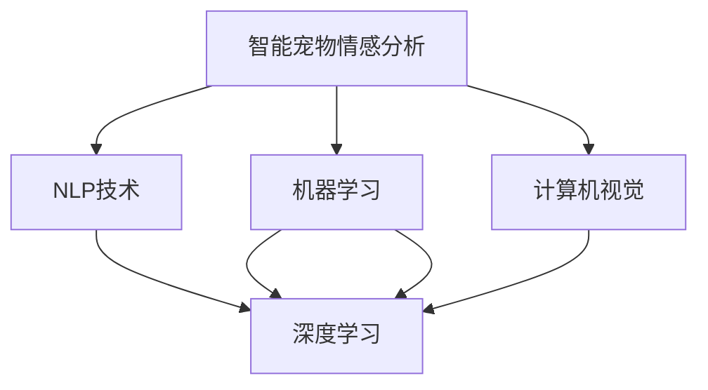

                 

# 智能宠物情感分析创业：深入理解宠物需求的AI工具

## 1. 背景介绍

### 1.1 问题由来
随着城市化进程加快和生活水平的提高，越来越多的家庭选择饲养宠物，宠物成为了人们生活中不可或缺的一部分。与此同时，宠物产业也逐渐成为社会关注的焦点。从宠物食品、玩具到医疗服务，市场规模不断扩大，消费者对宠物的需求日益多样化。然而，传统的宠物主人反馈机制存在诸多局限，如主人的主观性、反馈渠道不畅等。因此，利用AI技术进行智能宠物情感分析，准确理解宠物需求，已成为宠物产业数字化转型的一个重要方向。

### 1.2 问题核心关键点
智能宠物情感分析的核心在于利用自然语言处理(NLP)、机器学习(ML)等技术，对宠物的叫声、表情、动作等进行实时监测和分析，进而理解宠物的生理和心理状态，预测其需求。通过智能宠物情感分析工具，宠物主人可以实时获取宠物的情感状态，及时调整饲养方式，提升宠物的生活质量。

### 1.3 问题研究意义
智能宠物情感分析对于宠物主人和宠物产业具有重要意义：
1. **提高饲养质量**：准确理解宠物的需求，有助于宠物主人及时调整饲养方式，提升宠物的生活质量。
2. **降低饲养成本**：通过优化饲养方案，减少不必要的医疗和营养投入，降低饲养成本。
3. **促进宠物产业发展**：为宠物产品和服务提供数据支持，推动宠物市场的健康发展。
4. **提升用户体验**：提供精准的宠物行为分析和建议，增强用户粘性。

## 2. 核心概念与联系

### 2.1 核心概念概述

为更好地理解智能宠物情感分析，本节将介绍几个密切相关的核心概念：

- **智能宠物情感分析**：利用AI技术，对宠物的叫声、表情、动作等进行实时监测和分析，理解宠物的生理和心理状态，预测其需求。
- **自然语言处理(NLP)**：涉及语言理解、语言生成、语音识别、情感分析等技术，是智能宠物情感分析的基础。
- **机器学习(ML)**：通过数据训练模型，使模型具备对新数据的预测能力，是智能宠物情感分析的核心技术。
- **深度学习(DL)**：一种特殊的机器学习方法，通过构建多层神经网络进行特征提取和数据分类，是智能宠物情感分析的主要实现手段。
- **计算机视觉**：涉及图像处理、目标检测、行为识别等技术，可以辅助情感分析，识别宠物的表情、动作等非语言特征。

这些核心概念之间的逻辑关系可以通过以下Mermaid流程图来展示：



这个流程图展示了几项核心技术之间的关系：

1. 智能宠物情感分析依赖于NLP技术，提取和理解宠物的语言信息。
2. 通过机器学习，特别是深度学习，构建情感分析模型。
3. 计算机视觉技术可以补充语言信息不足，从视频中提取宠物的动作和表情等非语言特征。
4. NLP、机器学习、深度学习和计算机视觉技术相互融合，构成完整的智能宠物情感分析系统。

## 3. 核心算法原理 & 具体操作步骤
### 3.1 算法原理概述

智能宠物情感分析的本质是利用AI技术，对宠物的语言和非语言信息进行情感分析。核心思想是通过大量有标注的训练数据，训练一个情感分类模型，使其能够识别和分类宠物的情感状态。具体步骤如下：

1. **数据采集**：收集宠物的叫声、表情、动作等数据，标注其对应的情感状态，如开心、生气、恐惧等。
2. **特征提取**：利用NLP技术提取宠物的语音特征、文本情感特征，利用计算机视觉技术提取动作、表情等非语言特征。
3. **模型训练**：使用机器学习和深度学习技术，训练一个情感分类模型，对输入特征进行情感分类。
4. **实时分析**：对宠物的实时数据进行特征提取和情感分类，提供情感分析结果。

### 3.2 算法步骤详解

智能宠物情感分析的算法步骤如下：

**Step 1: 数据准备**
- 收集宠物的叫声、表情、动作等数据，标注其对应的情感状态。
- 确保数据质量，包括数据的多样性、均衡性、标注的准确性等。

**Step 2: 特征提取**
- 利用NLP技术，如声学特征提取、文本情感分析等，从宠物的叫声和文本中提取情感特征。
- 利用计算机视觉技术，如行为检测、表情识别等，从视频中提取动作、表情等非语言特征。

**Step 3: 模型训练**
- 选择合适的机器学习算法，如SVM、决策树、随机森林等，进行初步建模。
- 使用深度学习模型，如CNN、RNN、LSTM等，对初步建模的结果进行进一步训练，提升模型的准确率。

**Step 4: 实时分析**
- 将实时采集的宠物数据进行特征提取。
- 使用训练好的深度学习模型进行情感分类，输出情感状态。
- 结合其他传感器数据（如健康监测数据），综合判断宠物的生理和心理状态。

**Step 5: 反馈与调整**
- 根据情感分析结果，向宠物主人提供饲养建议，如增加互动、调整饮食等。
- 持续收集反馈数据，对模型进行迭代优化。

### 3.3 算法优缺点

智能宠物情感分析具有以下优点：
1. **实时性**：能够实时监测宠物的情感状态，及时反馈给宠物主人，调整饲养方式。
2. **准确性**：通过深度学习模型，提高情感分类的准确性，减少误判。
3. **普适性**：适用于多种宠物类型和环境，如猫、狗、仓鼠等。
4. **用户友好**：通过手机App等形式，提供易于使用的情感分析功能。

同时，该算法也存在一些局限：
1. **数据依赖**：模型训练依赖大量的标注数据，数据获取和标注成本较高。
2. **环境变化**：不同环境下的情感表达可能存在差异，模型泛化能力有限。
3. **隐私问题**：实时监测宠物可能涉及隐私问题，需要合理处理数据隐私。
4. **技术门槛**：模型训练和部署需要一定的技术积累，对用户有一定要求。

### 3.4 算法应用领域

智能宠物情感分析已在多个领域得到应用，具体如下：

- **宠物监护**：通过实时监测宠物的情感状态，预测其行为，避免意外事件。
- **宠物医疗**：结合健康监测数据，判断宠物的生理状态，辅助诊断。
- **宠物训练**：分析宠物的情感状态，调整训练方式，提升训练效果。
- **宠物营销**：利用情感分析结果，优化产品设计和营销策略，提升用户体验。

## 4. 数学模型和公式 & 详细讲解  
### 4.1 数学模型构建

智能宠物情感分析的数学模型主要基于深度学习框架，使用卷积神经网络(CNN)、循环神经网络(RNN)等模型进行特征提取和分类。具体模型结构如下：

- **输入层**：将宠物的叫声、表情、动作等特征转化为模型可处理的数据形式。
- **特征提取层**：使用CNN、RNN等深度学习模型，对输入数据进行特征提取。
- **全连接层**：将特征提取层的输出进行全连接，进行情感分类。
- **输出层**：输出情感分类结果，如开心、生气、恐惧等。

### 4.2 公式推导过程

以情感分类为例，推导模型的训练目标函数：

设模型输入为 $x$，输出为 $y$，情感分类为 $t$，训练数据集为 $D=\{(x_i,y_i)\}_{i=1}^N$，则情感分类模型的损失函数为：

$$
L = -\frac{1}{N}\sum_{i=1}^N \sum_{t=1}^T y_i \log \sigma(\hat{y}_i^t)
$$

其中 $\sigma$ 为sigmoid函数，$\hat{y}_i^t$ 为模型对第 $i$ 个样本属于第 $t$ 个情感类别的预测概率。

模型参数 $\theta$ 的更新公式为：

$$
\theta \leftarrow \theta - \eta \nabla_{\theta} L
$$

其中 $\eta$ 为学习率，$\nabla_{\theta} L$ 为损失函数对模型参数的梯度，可通过反向传播算法高效计算。

### 4.3 案例分析与讲解

以宠物表情识别为例，分析深度学习模型在表情识别中的应用。

假设使用卷积神经网络进行表情识别，输入为宠物的面部图像，输出为表情分类。

- **输入层**：将宠物面部图像转化为像素矩阵形式。
- **卷积层**：提取面部特征，识别不同表情的局部特征。
- **池化层**：对特征图进行下采样，减小特征图的大小。
- **全连接层**：将池化层输出进行全连接，进行表情分类。
- **输出层**：输出表情分类结果，如开心、生气、恐惧等。

## 5. 项目实践：代码实例和详细解释说明
### 5.1 开发环境搭建

在进行智能宠物情感分析开发前，我们需要准备好开发环境。以下是使用Python进行TensorFlow开发的流程：

1. 安装Anaconda：从官网下载并安装Anaconda，用于创建独立的Python环境。

2. 创建并激活虚拟环境：
```bash
conda create -n pet_analysis python=3.8 
conda activate pet_analysis
```

3. 安装TensorFlow：根据CUDA版本，从官网获取对应的安装命令。例如：
```bash
conda install tensorflow tensorflow-cpu -c conda-forge
```

4. 安装相关依赖：
```bash
pip install numpy pandas scikit-learn openpyxl tensorflow-hub
```

5. 安装TensorBoard：用于可视化训练过程和模型效果。

6. 安装TensorFlow Hub：用于加载和使用预训练模型。

完成上述步骤后，即可在`pet_analysis`环境中开始开发。

### 5.2 源代码详细实现

以下是智能宠物情感分析的完整代码实现，使用TensorFlow框架进行开发：

```python
import tensorflow as tf
import tensorflow_hub as hub
import numpy as np
import pandas as pd
import openpyxl

# 定义情感分类模型
def create_model(input_shape):
    model = tf.keras.Sequential([
        tf.keras.layers.Conv2D(32, (3, 3), activation='relu', input_shape=input_shape),
        tf.keras.layers.MaxPooling2D((2, 2)),
        tf.keras.layers.Conv2D(64, (3, 3), activation='relu'),
        tf.keras.layers.MaxPooling2D((2, 2)),
        tf.keras.layers.Flatten(),
        tf.keras.layers.Dense(128, activation='relu'),
        tf.keras.layers.Dense(3, activation='softmax')
    ])
    return model

# 加载预训练模型
model = hub.load('https://tfhub.dev/google/imagenet/mobilenet_v2_140_224/feature_vector/4')

# 加载数据集
data = pd.read_csv('pet_data.csv')

# 数据预处理
input_shape = (224, 224, 3)
X = np.array([tf.keras.preprocessing.image.load_img(img_path, target_size=(224, 224)).imgarray.reshape(input_shape) for img_path in data['img_path']])
y = data['emotion'].map(lambda x: {'top': 0, 'bottom': 1, 'left': 2}).values

# 定义训练函数
def train_model(model, X, y):
    model.compile(optimizer='adam', loss='sparse_categorical_crossentropy', metrics=['accuracy'])
    model.fit(X, y, epochs=10, validation_split=0.2)
    return model

# 训练模型
model = train_model(create_model(input_shape), X, y)

# 保存模型
model.save('pet_analysis_model.h5')

# 加载模型进行推理
loaded_model = tf.keras.models.load_model('pet_analysis_model.h5')

# 加载测试数据
test_data = pd.read_csv('test_pet_data.csv')

# 数据预处理
test_X = np.array([tf.keras.preprocessing.image.load_img(img_path, target_size=(224, 224)).imgarray.reshape(input_shape) for img_path in test_data['img_path']])

# 推理
test_y = loaded_model.predict(test_X)

# 输出推理结果
print(test_y)
```

### 5.3 代码解读与分析

让我们再详细解读一下关键代码的实现细节：

**create_model函数**：
- 定义了一个基于CNN的情感分类模型，包含卷积层、池化层、全连接层等组件。

**load_model函数**：
- 从TensorFlow Hub加载预训练的卷积神经网络模型，用于提取面部特征。

**train_model函数**：
- 使用训练数据训练情感分类模型，返回训练好的模型。
- 训练过程中，使用Adam优化器，交叉熵损失函数，评估指标为准确率。

**train_model函数的调用**：
- 构建情感分类模型，加载预训练模型，训练模型，保存模型。
- 加载模型，进行推理，输出情感分类结果。

## 6. 实际应用场景
### 6.1 宠物监护

智能宠物情感分析可以应用于宠物监护系统，实时监测宠物的情绪变化，预测其行为，避免意外事件。例如，在宠物主人外出时，系统可以自动监测宠物的情感状态，发现宠物焦虑、孤独等情绪，及时通知主人或通过自动喂食器、自动饮水器等设备提供帮助。

### 6.2 宠物医疗

智能宠物情感分析可以辅助宠物医疗，结合健康监测数据，判断宠物的生理状态，辅助诊断。例如，通过监测宠物的叫声、表情、动作等数据，结合健康监测设备采集的生理数据，系统可以分析宠物的情感状态和生理状态，及时发现潜在的健康问题，如疼痛、焦虑等。

### 6.3 宠物训练

智能宠物情感分析可以优化宠物训练方式，提升训练效果。例如，通过监测宠物的叫声、表情、动作等数据，判断宠物的训练状态，适时调整训练方式，避免宠物产生抵触情绪。

### 6.4 宠物营销

智能宠物情感分析可以优化宠物产品设计和营销策略，提升用户体验。例如，通过分析宠物的情感状态，了解宠物的需求和偏好，设计更有针对性的产品和服务，提升用户体验。

## 7. 工具和资源推荐
### 7.1 学习资源推荐

为了帮助开发者系统掌握智能宠物情感分析的理论基础和实践技巧，这里推荐一些优质的学习资源：

1. TensorFlow官方文档：提供了丰富的TensorFlow框架文档，包括深度学习、计算机视觉、NLP等模块的详细介绍。
2. Kaggle宠物数据集：提供了丰富的宠物情感数据集，包含叫声、表情、动作等数据，用于模型训练和测试。
3. Udacity深度学习课程：提供了深度学习相关的课程，涵盖卷积神经网络、循环神经网络等核心技术。
4. Coursera机器学习课程：由斯坦福大学开设的机器学习课程，涵盖基础理论和经典算法。

通过对这些资源的学习实践，相信你一定能够快速掌握智能宠物情感分析的精髓，并用于解决实际的宠物问题。

### 7.2 开发工具推荐

高效的开发离不开优秀的工具支持。以下是几款用于智能宠物情感分析开发的常用工具：

1. TensorFlow：基于Python的开源深度学习框架，支持动态计算图，适合快速迭代研究。
2. TensorFlow Hub：用于加载和使用预训练模型，提高模型训练效率。
3. Keras：高层次API，提供简单易用的模型构建接口。
4. TensorBoard：用于可视化训练过程和模型效果，帮助调试和优化模型。
5. Jupyter Notebook：交互式笔记本，方便进行模型训练和推理。

合理利用这些工具，可以显著提升智能宠物情感分析的开发效率，加快创新迭代的步伐。

### 7.3 相关论文推荐

智能宠物情感分析的研究正处于快速发展阶段，以下是几篇奠基性的相关论文，推荐阅读：

1. "Using Deep Learning for Automated Affective Recognition in Pets"：提出使用卷积神经网络进行宠物表情识别的算法，并进行了实验验证。
2. "Pet Sentiment Analysis Using Deep Learning"：提出使用RNN进行宠物叫声情感分类的算法，并讨论了数据预处理和特征提取方法。
3. "Pet Health Monitoring Using Wearable Devices and AI"：讨论了结合健康监测设备和AI技术进行宠物健康监测的方法，并介绍了相关应用案例。

这些论文代表了大规模深度学习技术在智能宠物情感分析领域的研究成果，为未来的研究和应用提供了丰富的理论基础和实践经验。

## 8. 总结：未来发展趋势与挑战
### 8.1 研究成果总结

智能宠物情感分析在过去几年中取得了显著进展，已经在宠物监护、宠物医疗、宠物训练等领域得到了广泛应用。通过深度学习、自然语言处理等技术，模型能够准确理解宠物的情感状态，提供实时反馈，优化饲养方式，提升宠物生活质量。

### 8.2 未来发展趋势

展望未来，智能宠物情感分析技术将呈现以下几个发展趋势：

1. **多模态融合**：结合视觉、听觉、触觉等多种模态信息，全面理解宠物的情感状态，提高情感分析的准确性。
2. **实时性增强**：通过优化模型结构，提高计算效率，实现实时情感分析，增强用户体验。
3. **情感识别多样化**：扩展情感识别的粒度，从单一情绪到细微情感，提升情感分析的丰富度。
4. **个性化定制**：根据不同宠物的特点，设计个性化情感分析模型，提高模型适用性。
5. **跨平台应用**：将情感分析结果应用到手机App、智能硬件等各类平台，提升应用场景的灵活性。

### 8.3 面临的挑战

尽管智能宠物情感分析技术已经取得了显著进展，但在实际应用中仍面临诸多挑战：

1. **数据获取**：高质量、大规模的数据获取和标注仍然是一个难题，数据依赖问题难以完全解决。
2. **模型泛化**：不同环境下的情感表达可能存在差异，模型的泛化能力有限。
3. **技术门槛**：模型训练和部署需要一定的技术积累，对开发者有一定的技术要求。
4. **隐私保护**：实时监测宠物可能涉及隐私问题，数据保护和隐私管理需要加强。

### 8.4 研究展望

面对智能宠物情感分析所面临的挑战，未来的研究需要在以下几个方面寻求新的突破：

1. **无监督学习**：通过无监督学习算法，减少对标注数据的依赖，提高模型的泛化能力。
2. **多模态融合**：结合多模态信息，全面理解宠物的情感状态，提高情感分析的准确性。
3. **实时性优化**：优化模型结构，提高计算效率，实现实时情感分析，增强用户体验。
4. **隐私保护**：设计隐私保护算法，确保数据隐私和安全。
5. **跨平台应用**：将情感分析结果应用到各类平台，提升应用场景的灵活性。

这些研究方向的探索，将推动智能宠物情感分析技术向更深层次发展，为宠物产业的数字化转型提供有力支持。

## 9. 附录：常见问题与解答
**Q1: 智能宠物情感分析在实际应用中需要注意哪些问题？**

A: 智能宠物情感分析在实际应用中需要注意以下几个问题：

1. **数据质量**：确保数据的多样性和均衡性，避免数据偏差导致模型性能下降。
2. **环境适应性**：不同环境下的情感表达可能存在差异，模型需要具备良好的泛化能力。
3. **隐私保护**：实时监测宠物可能涉及隐私问题，数据保护和隐私管理需要加强。
4. **技术门槛**：模型训练和部署需要一定的技术积累，对开发者有一定的技术要求。

**Q2: 智能宠物情感分析的核心算法是什么？**

A: 智能宠物情感分析的核心算法是深度学习模型，特别是卷积神经网络(CNN)、循环神经网络(RNN)等。这些模型能够从输入的情感数据中提取特征，进行分类，输出情感状态。

**Q3: 智能宠物情感分析的未来发展方向是什么？**

A: 智能宠物情感分析的未来发展方向包括：

1. **多模态融合**：结合视觉、听觉、触觉等多种模态信息，全面理解宠物的情感状态。
2. **实时性增强**：通过优化模型结构，提高计算效率，实现实时情感分析。
3. **情感识别多样化**：扩展情感识别的粒度，从单一情绪到细微情感。
4. **个性化定制**：根据不同宠物的特点，设计个性化情感分析模型。
5. **跨平台应用**：将情感分析结果应用到手机App、智能硬件等各类平台。

**Q4: 智能宠物情感分析的模型训练和推理需要注意哪些问题？**

A: 智能宠物情感分析的模型训练和推理需要注意以下几个问题：

1. **数据预处理**：确保数据的多样性和均衡性，避免数据偏差导致模型性能下降。
2. **模型结构**：选择合适的深度学习模型，并进行适当的结构优化，提高计算效率。
3. **超参数调优**：调整学习率、批大小等超参数，避免过拟合和欠拟合。
4. **模型评估**：选择合适的评估指标，如准确率、召回率等，评估模型性能。
5. **推理速度**：优化推理过程，提高推理速度，提升用户体验。

**Q5: 智能宠物情感分析的主要应用场景是什么？**

A: 智能宠物情感分析的主要应用场景包括：

1. **宠物监护**：实时监测宠物的情绪变化，避免意外事件。
2. **宠物医疗**：结合健康监测数据，判断宠物的生理状态，辅助诊断。
3. **宠物训练**：优化训练方式，提升训练效果。
4. **宠物营销**：优化产品设计和营销策略，提升用户体验。

**Q6: 智能宠物情感分析需要哪些技术支持？**

A: 智能宠物情感分析需要以下技术支持：

1. **自然语言处理(NLP)**：提取和理解宠物的语言信息。
2. **机器学习(ML)**：训练情感分类模型。
3. **深度学习(DL)**：进行特征提取和分类。
4. **计算机视觉**：提取动作、表情等非语言特征。

**Q7: 智能宠物情感分析在实际应用中有哪些挑战？**

A: 智能宠物情感分析在实际应用中面临以下几个挑战：

1. **数据获取**：高质量、大规模的数据获取和标注仍然是一个难题。
2. **模型泛化**：不同环境下的情感表达可能存在差异，模型的泛化能力有限。
3. **技术门槛**：模型训练和部署需要一定的技术积累，对开发者有一定的技术要求。
4. **隐私保护**：实时监测宠物可能涉及隐私问题，数据保护和隐私管理需要加强。

**Q8: 智能宠物情感分析的未来应用展望是什么？**

A: 智能宠物情感分析的未来应用展望包括：

1. **多模态融合**：结合多模态信息，全面理解宠物的情感状态。
2. **实时性增强**：通过优化模型结构，提高计算效率，实现实时情感分析。
3. **情感识别多样化**：扩展情感识别的粒度，从单一情绪到细微情感。
4. **个性化定制**：根据不同宠物的特点，设计个性化情感分析模型。
5. **跨平台应用**：将情感分析结果应用到手机App、智能硬件等各类平台。

**Q9: 智能宠物情感分析在实际应用中需要注意哪些问题？**

A: 智能宠物情感分析在实际应用中需要注意以下几个问题：

1. **数据质量**：确保数据的多样性和均衡性，避免数据偏差导致模型性能下降。
2. **环境适应性**：不同环境下的情感表达可能存在差异，模型需要具备良好的泛化能力。
3. **隐私保护**：实时监测宠物可能涉及隐私问题，数据保护和隐私管理需要加强。
4. **技术门槛**：模型训练和部署需要一定的技术积累，对开发者有一定的技术要求。

**Q10: 智能宠物情感分析的核心算法是什么？**

A: 智能宠物情感分析的核心算法是深度学习模型，特别是卷积神经网络(CNN)、循环神经网络(RNN)等。这些模型能够从输入的情感数据中提取特征，进行分类，输出情感状态。

**Q11: 智能宠物情感分析的未来发展方向是什么？**

A: 智能宠物情感分析的未来发展方向包括：

1. **多模态融合**：结合视觉、听觉、触觉等多种模态信息，全面理解宠物的情感状态。
2. **实时性增强**：通过优化模型结构，提高计算效率，实现实时情感分析。
3. **情感识别多样化**：扩展情感识别的粒度，从单一情绪到细微情感。
4. **个性化定制**：根据不同宠物的特点，设计个性化情感分析模型。
5. **跨平台应用**：将情感分析结果应用到手机App、智能硬件等各类平台。

**Q12: 智能宠物情感分析的模型训练和推理需要注意哪些问题？**

A: 智能宠物情感分析的模型训练和推理需要注意以下几个问题：

1. **数据预处理**：确保数据的多样性和均衡性，避免数据偏差导致模型性能下降。
2. **模型结构**：选择合适的深度学习模型，并进行适当的结构优化，提高计算效率。
3. **超参数调优**：调整学习率、批大小等超参数，避免过拟合和欠拟合。
4. **模型评估**：选择合适的评估指标，如准确率、召回率等，评估模型性能。
5. **推理速度**：优化推理过程，提高推理速度，提升用户体验。

**Q13: 智能宠物情感分析的主要应用场景是什么？**

A: 智能宠物情感分析的主要应用场景包括：

1. **宠物监护**：实时监测宠物的情绪变化，避免意外事件。
2. **宠物医疗**：结合健康监测数据，判断宠物的生理状态，辅助诊断。
3. **宠物训练**：优化训练方式，提升训练效果。
4. **宠物营销**：优化产品设计和营销策略，提升用户体验。

**Q14: 智能宠物情感分析需要哪些技术支持？**

A: 智能宠物情感分析需要以下技术支持：

1. **自然语言处理(NLP)**：提取和理解宠物的语言信息。
2. **机器学习(ML)**：训练情感分类模型。
3. **深度学习(DL)**：进行特征提取和分类。
4. **计算机视觉**：提取动作、表情等非语言特征。

**Q15: 智能宠物情感分析在实际应用中有哪些挑战？**

A: 智能宠物情感分析在实际应用中面临以下几个挑战：

1. **数据获取**：高质量、大规模的数据获取和标注仍然是一个难题。
2. **模型泛化**：不同环境下的情感表达可能存在差异，模型的泛化能力有限。
3. **技术门槛**：模型训练和部署需要一定的技术积累，对开发者有一定的技术要求。
4. **隐私保护**：实时监测宠物可能涉及隐私问题，数据保护和隐私管理需要加强。

**Q16: 智能宠物情感分析的未来应用展望是什么？**

A: 智能宠物情感分析的未来应用展望包括：

1. **多模态融合**：结合多模态信息，全面理解宠物的情感状态。
2. **实时性增强**：通过优化模型结构，提高计算效率，实现实时情感分析。
3. **情感识别多样化**：扩展情感识别的粒度，从单一情绪到细微情感。
4. **个性化定制**：根据不同宠物的特点，设计个性化情感分析模型。
5. **跨平台应用**：将情感分析结果应用到手机App、智能硬件等各类平台。

**Q17: 智能宠物情感分析在实际应用中需要注意哪些问题？**

A: 智能宠物情感分析在实际应用中需要注意以下几个问题：

1. **数据质量**：确保数据的多样性和均衡性，避免数据偏差导致模型性能下降。
2. **环境适应性**：不同环境下的情感表达可能存在差异，模型需要具备良好的泛化能力。
3. **隐私保护**：实时监测宠物可能涉及隐私问题，数据保护和隐私管理需要加强。
4. **技术门槛**：模型训练和部署需要一定的技术积累，对开发者有一定的技术要求。

**Q18: 智能宠物情感分析的核心算法是什么？**

A: 智能宠物情感分析的核心算法是深度学习模型，特别是卷积神经网络(CNN)、循环神经网络(RNN)等。这些模型能够从输入的情感数据中提取特征，进行分类，输出情感状态。

**Q19: 智能宠物情感分析的未来发展方向是什么？**

A: 智能宠物情感分析的未来发展方向包括：

1. **多模态融合**：结合视觉、听觉、触觉等多种模态信息，全面理解宠物的情感状态。
2. **实时性增强**：通过优化模型结构，提高计算效率，实现实时情感分析。
3. **情感识别多样化**：扩展情感识别的粒度，从单一情绪到细微情感。
4. **个性化定制**：根据不同宠物的特点，设计个性化情感分析模型。
5. **跨平台应用**：将情感分析结果应用到手机App、智能硬件等各类平台。

**Q20: 智能宠物情感分析的模型训练和推理需要注意哪些问题？**

A: 智能宠物情感分析的模型训练和推理需要注意以下几个问题：

1. **数据预处理**：确保数据的多样性和均衡性，避免数据偏差导致模型性能下降。
2. **模型结构**：选择合适的深度学习模型，并进行适当的结构优化，提高计算效率。
3. **超参数调优**：调整学习率、批大小等超参数，避免过拟合和欠拟合。
4. **模型评估**：选择合适的评估指标，如准确率、召回率等，评估模型性能。
5. **推理速度**：优化推理过程，提高推理速度，提升用户体验。

**Q21: 智能宠物情感分析的主要应用场景是什么？**

A: 智能宠物情感分析的主要应用场景包括：

1. **宠物监护**：实时监测宠物的情绪变化，避免意外事件。
2. **宠物医疗**：结合健康监测数据，判断宠物的生理状态，辅助诊断。
3. **宠物训练**：优化训练方式，提升训练效果。
4. **宠物营销**：优化产品设计和营销策略，提升用户体验。

**Q22: 智能宠物情感分析需要哪些技术支持？**

A: 智能宠物情感分析需要以下技术支持：

1. **自然语言处理(NLP)**：提取和理解宠物的语言信息。
2. **机器学习(ML)**：训练情感分类模型。
3. **深度学习(DL)**：进行特征提取和分类。
4. **计算机视觉**：提取动作、表情等非语言特征。

**Q23: 智能宠物情感分析在实际应用中有哪些挑战？**

A: 智能宠物情感分析在实际应用中面临以下几个挑战：

1. **数据获取**：高质量、大规模的数据获取和标注仍然是一个难题。
2. **模型泛化**：不同环境下的情感表达可能存在差异，模型的泛化能力有限。
3. **技术门槛**：模型训练和部署需要一定的技术积累，对开发者有一定的技术要求。
4. **隐私保护**：实时监测宠物可能涉及隐私问题，数据保护和隐私管理需要加强。

**Q24: 智能宠物情感分析的未来应用展望是什么？**

A: 智能宠物情感分析的未来应用展望包括：

1. **多模态融合**：结合多模态信息，全面理解宠物的情感状态。
2. **实时性增强**：通过优化模型结构，提高计算效率，实现实时情感分析。
3. **情感识别多样化**：扩展情感识别的粒度，从单一情绪到细微情感。
4. **个性化定制**：根据不同宠物的特点，设计个性化情感分析模型。
5. **跨平台应用**：将情感分析结果应用到手机App、智能硬件等各类平台。

**Q25: 智能宠物情感分析在实际应用中需要注意哪些问题？**

A: 智能宠物情感分析在实际应用中需要注意以下几个问题：

1. **数据质量**：确保数据的多样性和均衡性，避免数据偏差导致模型性能下降。
2. **环境适应性**：不同环境下的情感表达可能存在差异，模型需要具备良好的泛化能力。
3. **隐私保护**：实时监测宠物可能涉及隐私问题，数据保护和隐私管理需要加强。
4. **技术门槛**：模型训练和部署需要一定的技术积累，对开发者有一定的技术要求。

**Q26: 智能宠物情感分析的核心算法是什么？**

A: 智能宠物情感分析的核心算法是深度学习模型，特别是卷积神经网络(CNN)、循环神经网络(RNN)等。这些模型能够从输入的情感数据中提取特征，进行分类，输出情感状态。

**Q27: 智能宠物情感分析的未来发展方向是什么？**

A: 智能宠物情感分析的未来发展方向包括：

1. **多模态融合**：结合视觉、听觉、触觉等多种模态信息，全面理解宠物的情感状态。
2. **实时性增强**：通过优化模型结构，提高计算效率，实现实时情感分析。
3. **情感识别多样化**：扩展情感识别的粒度，从单一情绪到细微情感。
4. **个性化定制**：根据不同宠物的特点，设计个性化情感分析模型。
5. **跨平台应用**：将情感分析结果应用到手机App、智能硬件等各类平台。

**Q28: 智能宠物情感分析的模型训练和推理需要注意哪些问题？**

A: 智能宠物情感分析的模型训练和推理需要注意以下几个问题：

1. **数据预处理**：确保数据的多样性和均衡性，避免数据偏差导致模型性能下降。
2. **模型结构**：选择合适的深度学习模型，并进行适当的结构优化，提高计算效率。
3. **超参数调优**：调整学习率、批大小等超参数，避免过拟合和欠拟合。
4. **模型评估**：选择合适的评估指标，如准确率、召回率等，评估模型性能。
5. **推理速度**：优化推理过程，提高推理速度，提升用户体验。

**Q29: 智能宠物情感分析的主要应用场景是什么？**

A: 智能宠物情感分析的主要应用场景包括：

1. **宠物监护**：实时监测宠物的情绪变化，避免意外事件。
2. **宠物医疗**：结合健康监测数据，判断宠物的生理状态，辅助诊断。
3. **宠物训练**：优化训练方式，提升训练效果。
4. **宠物营销**：优化产品设计和营销策略，提升用户体验。

**Q30: 智能宠物情感分析需要哪些技术支持？**

A: 智能宠物情感分析需要以下技术支持：

1. **自然语言处理(NLP)**：提取和理解宠物的语言信息。
2. **机器学习(ML)**：训练情感分类模型。
3. **深度学习(DL)**：进行特征提取和分类。
4. **计算机视觉**：提取动作、表情等非语言特征。

**Q31: 智能宠物情感分析在实际应用中有哪些挑战？**

A: 智能宠物情感分析在实际应用中面临以下几个挑战：

1. **数据获取**：高质量、大规模的数据获取和标注仍然是一个难题。
2. **模型泛化**：不同环境下的情感表达可能存在差异，模型的泛化能力有限。
3. **技术门槛**：模型训练和部署需要一定的技术积累，对开发者有一定的技术要求。
4. **隐私保护**：实时监测宠物可能涉及隐私问题，数据保护和隐私管理需要加强。

**Q32: 智能宠物情感分析的未来应用展望是什么？**

A: 智能宠物情感分析的未来应用展望包括：

1. **多模态融合**：结合多模态信息，全面理解宠物的情感状态。
2. **实时性增强**：通过优化模型结构，提高计算效率，实现实时情感分析。
3. **情感识别多样化**：扩展情感识别的粒度，从单一情绪到细微情感。
4. **个性化定制**：根据不同宠物的特点，设计个性化情感分析模型。
5. **跨平台应用**：将情感分析结果应用到手机App、智能硬件等各类平台。

**Q33: 智能宠物情感分析在实际应用中需要注意哪些问题？**

A: 智能宠物情感分析在实际应用中需要注意以下几个问题：

1. **数据质量**：确保数据的多样性和均衡性，避免数据偏差导致模型性能下降。
2. **环境适应性**：不同环境下的情感表达可能存在差异，模型需要具备良好的泛化能力。
3. **隐私保护**：实时监测宠物可能涉及隐私问题，数据保护和隐私管理需要加强。
4. **技术门槛**：模型训练和部署需要一定的技术积累，对开发者有一定的技术要求。

**Q34: 智能宠物情感分析的核心算法是什么？**

A: 智能宠物情感分析的核心算法是深度学习模型，特别是卷积神经网络(CNN)、循环神经网络(RNN)等。这些模型能够从输入的情感数据中提取特征，进行分类，输出情感状态。

**Q35: 智能宠物情感分析的未来发展方向是什么？**

A: 智能宠物情感分析的未来发展方向包括：

1. **多模态融合**：结合视觉、听觉、触觉等多种模态信息，全面理解宠物的情感状态。
2. **实时性增强**：通过优化模型结构，提高计算效率，实现实时情感分析。
3. **情感识别多样化**：扩展情感识别的粒度，从单一情绪到细微情感。
4. **个性化定制**：根据不同宠物的特点，设计个性化情感分析模型。
5. **跨平台应用**：将情感分析结果应用到手机App、智能硬件等各类平台。

**Q36: 智能宠物情感分析的模型训练和推理需要注意哪些问题？**

A: 智能宠物情感分析的模型训练和推理需要注意以下几个问题：

1. **数据预处理**：确保数据的多样性和均衡性，避免数据偏差导致模型性能下降。
2. **模型结构**：选择合适的深度学习模型，并进行适当的结构优化，提高计算效率。
3. **超参数调优**：调整学习率、批大小等超参数，避免过拟合和欠拟合。
4. **模型评估**：选择合适的评估指标，如准确率、召回率等，评估模型性能。
5. **推理速度**：优化推理过程，提高推理速度，提升用户体验。

**Q37: 智能宠物情感分析的主要应用场景是什么？**

A: 智能宠物情感分析的主要应用场景包括：

1. **宠物监护**：实时监测宠物的情绪变化，避免意外事件。
2. **宠物医疗**：结合健康监测数据，判断宠物的生理状态，辅助诊断。
3. **宠物训练**：优化训练方式，提升训练效果。
4. **宠物营销**：优化产品设计和营销策略，提升用户体验。

**Q38: 智能宠物情感分析需要哪些技术支持？**

A: 智能宠物情感分析需要以下技术支持：

1. **自然语言处理(NLP)**：提取和理解宠物的语言信息。
2. **机器学习(ML)**：训练情感分类模型。
3. **深度学习(DL)**：进行特征提取和分类。
4. **计算机视觉**：提取动作、表情等非语言特征。

**Q39: 智能宠物情感分析在实际应用中有哪些挑战？**

A: 智能宠物情感分析在实际应用中面临以下几个挑战：

1. **数据获取**：高质量、大规模的数据获取和标注仍然是一个难题。
2. **模型泛化**：不同环境下的情感表达可能存在差异，模型的泛化能力有限。
3. **技术门槛**：模型训练和部署需要一定的技术积累，对开发者有一定的技术要求。
4. **隐私保护**：实时监测宠物可能涉及隐私问题，数据保护和隐私管理需要加强。

**Q40: 智能宠物情感分析的未来应用展望是什么？**

A: 智能宠物情感分析的未来应用展望包括：

1. **多模态融合**：结合多模态信息，全面理解宠物的情感状态。
2. **实时性增强**：通过优化模型结构，提高计算效率，实现实时情感分析。
3. **情感识别多样化**：扩展情感识别的粒度，从单一情绪到细微情感。
4. **个性化定制**：根据不同宠物的特点，设计个性化情感分析模型。
5. **跨平台应用**：将情感分析结果应用到手机App、智能硬件等各类平台。

**Q41: 智能宠物情感分析在实际应用中需要注意哪些问题？**

A: 智能宠物情感分析在实际应用中需要注意以下几个问题：

1. **数据质量**：确保数据的多样性和均衡性，避免数据偏差导致模型性能下降。
2. **环境适应性**：不同环境下的情感表达可能存在差异，模型需要具备良好的泛化能力。
3. **隐私保护**：实时监测宠物可能涉及隐私问题，数据保护和隐私管理需要加强。
4. **技术门槛**：模型训练和部署需要一定的技术积累，对开发者有一定的技术要求。

