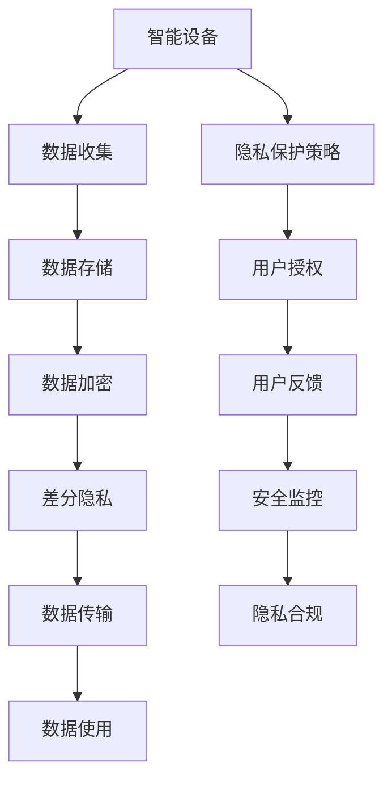

                 

# 智能设备隐私保护措施：安全处理个人信息

> 关键词：智能设备,隐私保护,个人信息,安全处理

## 1. 背景介绍

### 1.1 问题由来

随着智能设备的普及和物联网技术的快速发展，设备收集的个人数据越来越多，如何保护用户隐私成为了一个重要问题。在传统设备中，个人数据主要通过本地存储或云存储等方式进行存储和处理。然而，这些存储方式都存在一定的风险，如本地存储可能被物理窃取，云存储可能被黑客攻击，导致用户隐私泄露。

### 1.2 问题核心关键点

隐私保护的核心是如何在数据收集、存储、传输和使用过程中，保证数据的安全性和匿名性，避免个人信息被非法获取和滥用。常见的隐私保护措施包括数据加密、差分隐私、联邦学习等。这些方法能够有效保护用户隐私，但也需要考虑计算资源、隐私保护程度等因素。

### 1.3 问题研究意义

隐私保护是大数据时代的重要课题，对于智能设备而言，用户信任是基础。通过有效的隐私保护措施，可以提高用户的信任度，促进设备的发展和普及。隐私保护还关系到社会公平和道德伦理，合理的隐私保护能够保护用户的基本权益，促进社会和谐发展。

## 2. 核心概念与联系

### 2.1 核心概念概述

为了更好地理解智能设备隐私保护措施，本节将介绍几个密切相关的核心概念：

- 智能设备：指的是带有传感器、处理器、存储器等组件的电子设备，如智能手机、智能手表、智能家居等。这些设备能够收集用户的各种数据，如位置信息、健康数据、消费行为等。

- 隐私保护：指保护个人信息不被非法获取和滥用的过程。隐私保护需要考虑数据存储、传输和使用等多个环节，确保数据的机密性、完整性和可用性。

- 数据加密：指对数据进行加密处理，使得未经授权的人无法获取数据内容。数据加密分为对称加密和非对称加密两种方式。

- 差分隐私：指通过在数据中加入噪声，使得个体数据无法被识别，从而保护隐私。差分隐私可以同时保证数据的统计特性和隐私性。

- 联邦学习：指在多个本地设备上分布式训练模型，每个设备只共享模型参数，不共享原始数据，从而保护隐私。联邦学习能够有效减少数据泄露风险。

这些核心概念之间的逻辑关系可以通过以下Mermaid流程图来展示：



这个流程图展示出智能设备隐私保护的流程和关键环节，包括数据收集、存储、传输、使用等多个环节的隐私保护措施。

## 3. 核心算法原理 & 具体操作步骤
### 3.1 算法原理概述

智能设备隐私保护涉及数据加密、差分隐私和联邦学习等技术，其核心原理是：通过保护数据机密性、完整性和可用性，确保数据在处理过程中不被滥用和泄露。

- 数据加密：通过加密算法将数据转换为难以解读的形式，只有授权用户才能解密。常用的加密算法包括AES、RSA等。

- 差分隐私：通过在数据中加入噪声，使得个体数据无法被识别，从而保护隐私。差分隐私包括随机化、同态加密等方法。

- 联邦学习：通过在多个本地设备上分布式训练模型，每个设备只共享模型参数，不共享原始数据，从而保护隐私。联邦学习包括模型聚合、差分隐私等方法。

### 3.2 算法步骤详解

智能设备隐私保护的主要步骤包括：

**Step 1: 数据收集**

智能设备通过传感器、摄像头、GPS等组件收集用户数据。数据通常包含用户的个人信息、行为轨迹等敏感信息，需要采取措施保护数据安全。

**Step 2: 数据存储**

收集到的数据需要存储在设备或云端服务器上。数据存储过程需要考虑加密和备份，确保数据的安全性和可恢复性。

**Step 3: 数据加密**

数据存储过程中，需要对敏感数据进行加密。常用的加密算法包括AES、RSA等。加密过程需要对数据进行加密和解密的循环，以确保数据的安全性。

**Step 4: 差分隐私**

为了保护用户隐私，需要在数据中加入噪声，使得个体数据无法被识别。差分隐私技术包括随机化、同态加密等方法，可以在不影响数据统计特性的前提下，保护用户隐私。

**Step 5: 数据传输**

数据在设备和服务器之间传输时，需要进行加密和解密，确保数据在传输过程中不被窃取或篡改。常用的加密算法包括SSL/TLS等。

**Step 6: 数据使用**

在使用数据时，需要保证数据的使用过程符合隐私保护策略，避免数据被滥用或泄露。数据使用过程中，需要采取差分隐私、联邦学习等技术，确保数据的使用安全性。

### 3.3 算法优缺点

智能设备隐私保护的优点包括：

- 数据安全：通过加密、差分隐私等技术，可以保护数据在存储、传输和使用过程中的安全性。

- 隐私保护：差分隐私和联邦学习等技术可以保护用户隐私，避免数据被滥用或泄露。

- 可用性：差分隐私和联邦学习等技术可以保护用户隐私，同时保留数据的统计特性，确保数据可用性。

智能设备隐私保护的缺点包括：

- 计算资源消耗大：差分隐私和联邦学习等技术需要计算资源的消耗，可能影响设备的性能和用户体验。

- 隐私保护程度有限：差分隐私和联邦学习等技术在一定程度上保护隐私，但无法完全避免数据泄露。

- 用户体验差：数据加密和差分隐私等技术可能影响设备的性能和用户体验，需要优化算法和资源配置。

### 3.4 算法应用领域

智能设备隐私保护技术在多个领域都有应用，例如：

- 医疗设备：智能医疗设备收集用户的健康数据，如心率、血压等。需要对这些数据进行加密和差分隐私处理，保护用户的隐私。

- 金融设备：智能金融设备收集用户的消费行为数据，如购物记录、信用卡消费等。需要对这些数据进行加密和差分隐私处理，保护用户的隐私。

- 智能家居：智能家居设备收集用户的家庭环境数据，如温度、湿度等。需要对这些数据进行加密和差分隐私处理，保护用户的隐私。

- 智能穿戴设备：智能穿戴设备收集用户的健康和运动数据，如步数、心率等。需要对这些数据进行加密和差分隐私处理，保护用户的隐私。

## 4. 数学模型和公式 & 详细讲解  
### 4.1 数学模型构建

本节将使用数学语言对智能设备隐私保护措施进行更加严格的刻画。

记智能设备收集到的数据为 $D=\{x_i\}_{i=1}^N$，其中 $x_i$ 表示第 $i$ 个数据点，包含用户的个人信息、行为轨迹等敏感信息。

假设设备对数据 $x_i$ 进行差分隐私处理，加入噪声 $N_i$，得到处理后的数据 $x_i^{\prime}$。则有：

$$
x_i^{\prime} = f(x_i, N_i)
$$

其中 $f(\cdot)$ 为差分隐私算法，通常包括拉普拉斯噪声、高斯噪声等。

### 4.2 公式推导过程

差分隐私算法的核心在于引入噪声 $N_i$，使得个体数据无法被识别。以拉普拉斯噪声为例，其概率密度函数为：

$$
p(N_i|x_i) = \frac{1}{2(1-e^{\Delta})}(e^{-\frac{|N_i|}{\Delta}} - e^{-\frac{|N_i+\Delta|}{\Delta}})
$$

其中 $\Delta$ 为差分隐私预算，表示允许的隐私损失程度。

通过加入拉普拉斯噪声 $N_i$，可以将原始数据 $x_i$ 转换为差分隐私处理后的数据 $x_i^{\prime}$，从而保护用户隐私。

### 4.3 案例分析与讲解

假设智能设备收集到用户的位置信息 $x$，需要进行差分隐私处理。可以使用拉普拉斯噪声 $N$，使得个体位置无法被识别。则有：

$$
x^{\prime} = x + N
$$

其中 $N \sim \text{Laplace}(0, \Delta)$，表示 $N$ 服从拉普拉斯分布，均值为0，方差为 $\Delta$。

通过拉普拉斯噪声的处理，可以保护用户的位置信息，避免位置数据被滥用或泄露。

## 5. 项目实践：代码实例和详细解释说明
### 5.1 开发环境搭建

在进行智能设备隐私保护实践前，我们需要准备好开发环境。以下是使用Python进行PyTorch开发的环境配置流程：

1. 安装Anaconda：从官网下载并安装Anaconda，用于创建独立的Python环境。

2. 创建并激活虚拟环境：
```bash
conda create -n pytorch-env python=3.8 
conda activate pytorch-env
```

3. 安装PyTorch：根据CUDA版本，从官网获取对应的安装命令。例如：
```bash
conda install pytorch torchvision torchaudio cudatoolkit=11.1 -c pytorch -c conda-forge
```

4. 安装各种依赖包：
```bash
pip install numpy pandas scikit-learn matplotlib tqdm jupyter notebook ipython
```

完成上述步骤后，即可在`pytorch-env`环境中开始隐私保护实践。

### 5.2 源代码详细实现

以下是使用Python和PyTorch实现差分隐私处理的代码实现：

```python
import numpy as np
import torch
import torch.nn as nn
import torch.optim as optim

# 定义差分隐私算法
class DifferentialPrivacy(nn.Module):
    def __init__(self, epsilon):
        super(DifferentialPrivacy, self).__init__()
        self.epsilon = epsilon
        self.laplace = nn.Laplace()
    
    def forward(self, x):
        noise = self.laplace(torch.tensor(x))
        return x + noise
    
# 定义原始数据集
x = np.random.randn(100)
    
# 进行差分隐私处理
dp = DifferentialPrivacy(1.0)
x_prime = dp(torch.tensor(x))
```

代码解释：

1. 定义差分隐私算法，继承nn.Module类，重写forward方法，使用拉普拉斯噪声进行差分隐私处理。

2. 定义原始数据集，生成100个随机数。

3. 创建差分隐私算法实例，设置隐私预算 $\epsilon$。

4. 使用差分隐私算法处理原始数据集，得到差分隐私处理后的数据集。

### 5.3 代码解读与分析

让我们再详细解读一下关键代码的实现细节：

**DifferentialPrivacy类**：
- `__init__`方法：初始化差分隐私算法的参数，包括隐私预算 $\epsilon$ 和拉普拉斯噪声分布。
- `forward`方法：实现差分隐私处理，将原始数据加上拉普拉斯噪声，得到差分隐私处理后的数据。

**差分隐私处理**：
- 使用拉普拉斯噪声对原始数据进行差分隐私处理，可以保护数据隐私，同时保留数据的统计特性。

**x**：
- 定义原始数据集，生成100个随机数，代表用户的敏感信息。

**dp实例**：
- 创建差分隐私算法实例，设置隐私预算 $\epsilon$，隐私预算越小，隐私保护程度越高，但数据可用性越低。

**x_prime**：
- 使用差分隐私算法处理原始数据集，得到差分隐私处理后的数据集。

可以看到，差分隐私处理是通过加入拉普拉斯噪声，保护用户隐私，避免数据被滥用或泄露。差分隐私处理是智能设备隐私保护的重要技术之一，能够在不影响数据统计特性的前提下，保护用户隐私。

## 6. 实际应用场景
### 6.1 智能医疗设备

智能医疗设备收集用户的健康数据，如心率、血压等。这些数据包含用户的敏感信息，需要采取措施保护数据隐私。

在技术实现上，可以收集用户使用智能设备的时间、次数、位置等信息，进行差分隐私处理。差分隐私处理后的数据可以用于医疗分析、健康管理等场景，同时保护用户隐私。

### 6.2 智能金融设备

智能金融设备收集用户的消费行为数据，如购物记录、信用卡消费等。这些数据包含用户的敏感信息，需要采取措施保护数据隐私。

在技术实现上，可以收集用户使用智能设备的时间、金额、地点等信息，进行差分隐私处理。差分隐私处理后的数据可以用于金融分析、风险评估等场景，同时保护用户隐私。

### 6.3 智能家居设备

智能家居设备收集用户的家庭环境数据，如温度、湿度等。这些数据包含用户的敏感信息，需要采取措施保护数据隐私。

在技术实现上，可以收集用户使用智能设备的时间、位置、环境数据等信息，进行差分隐私处理。差分隐私处理后的数据可以用于家庭环境分析、节能管理等场景，同时保护用户隐私。

### 6.4 智能穿戴设备

智能穿戴设备收集用户的健康和运动数据，如步数、心率等。这些数据包含用户的敏感信息，需要采取措施保护数据隐私。

在技术实现上，可以收集用户使用智能设备的时间、地点、运动数据等信息，进行差分隐私处理。差分隐私处理后的数据可以用于健康管理、运动分析等场景，同时保护用户隐私。

## 7. 工具和资源推荐
### 7.1 学习资源推荐

为了帮助开发者系统掌握智能设备隐私保护的理论基础和实践技巧，这里推荐一些优质的学习资源：

1. 《数据隐私保护技术》系列博文：由数据隐私保护专家撰写，深入浅出地介绍了数据隐私保护的基本概念和关键技术。

2. 《深度学习中的隐私保护》课程：斯坦福大学开设的深度学习课程，涵盖隐私保护的基本概念和前沿技术，适合入门学习。

3. 《数据隐私保护原理与实践》书籍：详细介绍了数据隐私保护的基本概念、算法和技术，是隐私保护领域的重要参考书。

4. 差分隐私官方文档：差分隐私的官方文档，提供了丰富的算法和应用实例，是隐私保护领域的重要参考资料。

5. 联邦学习官方文档：联邦学习的官方文档，提供了丰富的算法和应用实例，是隐私保护领域的重要参考资料。

通过对这些资源的学习实践，相信你一定能够快速掌握智能设备隐私保护的理论基础和实践技巧，并用于解决实际的隐私保护问题。
###  7.2 开发工具推荐

高效的开发离不开优秀的工具支持。以下是几款用于智能设备隐私保护开发的常用工具：

1. PyTorch：基于Python的开源深度学习框架，灵活动态的计算图，适合快速迭代研究。大部分隐私保护算法都有PyTorch版本的实现。

2. TensorFlow：由Google主导开发的开源深度学习框架，生产部署方便，适合大规模工程应用。同样有丰富的隐私保护算法资源。

3. PySyft：开源的联邦学习库，提供丰富的隐私保护算法和工具，支持PyTorch和TensorFlow，是隐私保护领域的重要工具。

4. Apache Spark：开源的大数据处理框架，支持分布式计算，适合处理大规模数据隐私保护问题。

5. Microsoft Azure：微软的云服务平台，提供丰富的隐私保护工具和服务，支持大规模数据隐私保护问题。

合理利用这些工具，可以显著提升智能设备隐私保护任务的开发效率，加快创新迭代的步伐。

### 7.3 相关论文推荐

智能设备隐私保护技术的发展源于学界的持续研究。以下是几篇奠基性的相关论文，推荐阅读：

1. Differential Privacy：提出差分隐私的概念和方法，为隐私保护提供了一种新的思路。

2. Privacy Preserving Techniques in IoT：介绍物联网设备中的隐私保护技术，涵盖差分隐私、联邦学习等方法。

3. Privacy-Preserving Machine Learning：介绍机器学习中的隐私保护技术，涵盖差分隐私、联邦学习等方法。

4. Privacy-Preserving Distributed Deep Learning：介绍分布式深度学习中的隐私保护技术，涵盖差分隐私、联邦学习等方法。

这些论文代表了大数据和人工智能领域隐私保护技术的发展脉络。通过学习这些前沿成果，可以帮助研究者把握学科前进方向，激发更多的创新灵感。

## 8. 总结：未来发展趋势与挑战

### 8.1 总结

本文对智能设备隐私保护措施进行了全面系统的介绍。首先阐述了智能设备隐私保护的背景和意义，明确了隐私保护在智能设备中的重要性。其次，从原理到实践，详细讲解了隐私保护的数学模型和核心步骤，给出了隐私保护任务开发的完整代码实例。同时，本文还广泛探讨了隐私保护方法在智能医疗、智能金融、智能家居等众多领域的应用前景，展示了隐私保护范式的巨大潜力。

通过本文的系统梳理，可以看到，智能设备隐私保护技术正在成为智能设备应用的重要范式，极大地提升了设备的安全性和用户的信任度。隐私保护需要开发者根据具体任务，不断迭代和优化模型、数据和算法，方能得到理想的效果。

### 8.2 未来发展趋势

展望未来，智能设备隐私保护技术将呈现以下几个发展趋势：

1. 隐私保护技术不断进步。差分隐私、联邦学习等技术不断发展，能够更好地保护用户隐私，提升数据可用性。

2. 跨领域隐私保护应用增多。智能设备隐私保护技术将逐步应用于更多领域，如医疗、金融、物联网等，实现跨领域的数据隐私保护。

3. 隐私保护与区块链结合。区块链技术具有去中心化、不可篡改等特点，可以更好地保护用户隐私，提升数据安全性。

4. 隐私保护与边缘计算结合。边缘计算技术具有低延迟、高效能等特点，可以更好地保护用户隐私，提升数据可用性。

5. 隐私保护与大数据结合。大数据技术具有海量数据处理能力，可以更好地保护用户隐私，提升数据可用性。

这些趋势凸显了智能设备隐私保护技术的广阔前景。这些方向的探索发展，必将进一步提升智能设备的安全性和用户的信任度，推动智能设备的应用普及。

### 8.3 面临的挑战

尽管智能设备隐私保护技术已经取得了瞩目成就，但在迈向更加智能化、普适化应用的过程中，它仍面临着诸多挑战：

1. 计算资源消耗大。差分隐私、联邦学习等技术需要计算资源的消耗，可能影响设备的性能和用户体验。

2. 隐私保护程度有限。差分隐私和联邦学习等技术在一定程度上保护隐私，但无法完全避免数据泄露。

3. 用户体验差。隐私保护处理可能影响设备的性能和用户体验，需要优化算法和资源配置。

4. 隐私合规问题。隐私保护需要符合各种隐私保护法规和标准，如GDPR、CCPA等，需要更多的合规成本和技术支持。

5. 隐私保护技术复杂。隐私保护技术包括差分隐私、联邦学习等，技术复杂度较高，需要更多的技术支持和培训。

6. 隐私保护技术普及不足。隐私保护技术的应用普及度不足，需要更多的宣传和推广。

正视智能设备隐私保护所面临的这些挑战，积极应对并寻求突破，将是智能设备隐私保护技术走向成熟的必由之路。相信随着学界和产业界的共同努力，这些挑战终将一一被克服，智能设备隐私保护技术必将在构建人机协同的智能时代中扮演越来越重要的角色。

### 8.4 研究展望

面对智能设备隐私保护所面临的挑战，未来的研究需要在以下几个方面寻求新的突破：

1. 探索无监督和半监督隐私保护方法。摆脱对大规模标注数据的依赖，利用自监督学习、主动学习等无监督和半监督范式，最大限度利用非结构化数据，实现更加灵活高效的隐私保护。

2. 研究参数高效和计算高效的隐私保护范式。开发更加参数高效的隐私保护方法，在固定大部分预训练参数的同时，只更新极少量的任务相关参数。同时优化隐私保护模型的计算图，减少前向传播和反向传播的资源消耗，实现更加轻量级、实时性的部署。

3. 融合因果和对比学习范式。通过引入因果推断和对比学习思想，增强隐私保护模型建立稳定因果关系的能力，学习更加普适、鲁棒的语言表征，从而提升模型泛化性和抗干扰能力。

4. 引入更多先验知识。将符号化的先验知识，如知识图谱、逻辑规则等，与隐私保护模型进行巧妙融合，引导隐私保护过程学习更准确、合理的语言模型。

5. 结合因果分析和博弈论工具。将因果分析方法引入隐私保护模型，识别出模型决策的关键特征，增强输出解释的因果性和逻辑性。借助博弈论工具刻画人机交互过程，主动探索并规避模型的脆弱点，提高系统稳定性。

6. 纳入伦理道德约束。在隐私保护模型的训练目标中引入伦理导向的评估指标，过滤和惩罚有偏见、有害的输出倾向。同时加强人工干预和审核，建立隐私保护模型的监管机制，确保输出的安全性。

这些研究方向的探索，必将引领智能设备隐私保护技术迈向更高的台阶，为构建安全、可靠、可解释、可控的智能系统铺平道路。面向未来，智能设备隐私保护技术还需要与其他人工智能技术进行更深入的融合，如知识表示、因果推理、强化学习等，多路径协同发力，共同推动智能设备的安全化和普及化。只有勇于创新、敢于突破，才能不断拓展隐私保护技术的边界，让智能设备更好地保护用户隐私。

## 9. 附录：常见问题与解答

**Q1：智能设备隐私保护是否适用于所有设备？**

A: 智能设备隐私保护技术适用于大部分智能设备，如智能手机、智能手表、智能家居等。但对于一些传统设备，如纸质设备、机械设备等，隐私保护技术可能需要更多的探索和研究。

**Q2：如何选择合适的隐私保护算法？**

A: 选择合适的隐私保护算法需要考虑设备的性能、用户需求和隐私保护程度等因素。一般来说，差分隐私适用于需要保护单个个体隐私的场景，联邦学习适用于需要保护多个个体隐私的场景。在实际应用中，可以根据具体需求进行选择。

**Q3：隐私保护处理是否影响设备性能？**

A: 隐私保护处理可能会影响设备的性能，特别是差分隐私和联邦学习等方法。为了提升设备性能，可以在保护隐私的前提下，优化隐私保护算法和资源配置。

**Q4：如何平衡隐私保护和数据可用性？**

A: 隐私保护和数据可用性是隐私保护技术的两个重要目标。一般来说，隐私保护程度越高，数据可用性越低。需要在隐私保护和数据可用性之间进行平衡，根据具体需求进行调整。

**Q5：隐私保护技术是否需要额外的计算资源？**

A: 隐私保护技术通常需要额外的计算资源，特别是差分隐私和联邦学习等方法。为了提升隐私保护效果，需要合理配置计算资源，并优化隐私保护算法。

这些问题的回答，能够帮助开发者更好地理解智能设备隐私保护技术，并用于解决实际的隐私保护问题。

---

作者：禅与计算机程序设计艺术 / Zen and the Art of Computer Programming

