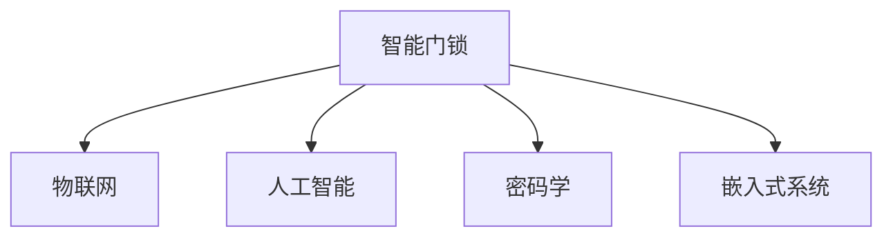

                 

# 智能门锁创业：家居安全的新一代产品

## 1. 背景介绍

### 1.1 问题由来

随着社会的进步和科技的发展，家居安全已经成为了现代家庭的重要议题。传统门锁由于其机械性和单一性，存在诸多安全隐患。传统的机械锁容易被撬开、被复制，而且无法实现远程监控和报警，一旦发生盗窃等安全事件，往往无法实时响应和记录。与此相比，智能门锁通过数字化、网络化和智能化手段，实现了更加安全、便捷、智能的家居安全解决方案。

### 1.2 问题核心关键点

智能门锁的核心在于将传统的机械锁转换为可编程、可控制的电子锁，通过整合互联网技术、物联网技术、人工智能技术等多方面资源，提供更高效、安全的家居安全解决方案。具体而言，智能门锁具备以下关键特性：

- **数字化**：通过电子芯片和传感器实现数字化控制，更高效、精确。
- **网络化**：通过无线网络与智能手机、电脑等终端设备连接，实现远程控制和实时监控。
- **智能化**：通过人工智能技术，如人脸识别、指纹识别等，提供更加智能、便捷的解锁方式。

这些特性使得智能门锁具备了传统锁所不具备的安全性和便利性，成为家居安全的新一代产品。

## 2. 核心概念与联系

### 2.1 核心概念概述

为更好地理解智能门锁的原理和架构，本节将介绍几个密切相关的核心概念：

- **智能门锁**：基于电子芯片、传感器、网络通信等技术，通过编程控制实现远程监控、报警等功能的电子锁。
- **物联网**：通过互联网技术将智能门锁与智能手机、电脑等终端设备连接，实现数据传输和远程控制。
- **人工智能**：通过人脸识别、指纹识别等技术，使智能门锁具备自动识别用户身份的能力，提供更智能、便捷的解锁方式。
- **密码学**：智能门锁使用的加密算法，确保数据的机密性、完整性和认证性，防止被恶意篡改和攻击。
- **嵌入式系统**：智能门锁的电子芯片和传感器等硬件，通过嵌入式编程实现智能化控制。

这些核心概念之间的逻辑关系可以通过以下Mermaid流程图来展示：



这个流程图展示了一系列技术在智能门锁中的应用，以及它们之间的联系：

1. 智能门锁利用物联网技术，通过无线网络与外部终端设备连接。
2. 人工智能技术使智能门锁具备智能解锁功能，如人脸识别、指纹识别等。
3. 密码学技术确保数据传输的安全性，防止黑客攻击。
4. 嵌入式系统提供智能门锁的硬件支持，实现实时控制。

这些核心概念共同构成了智能门锁的基础框架，使其能够实现高效、安全的家居安全解决方案。

## 3. 核心算法原理 & 具体操作步骤

### 3.1 算法原理概述

智能门锁的算法原理主要基于物联网、人工智能和密码学技术。以下将对这三个核心技术进行详细的介绍。

#### 3.1.1 物联网技术

物联网技术是智能门锁的核心支撑技术，通过互联网技术实现数据的传输和远程控制。其主要原理如下：

1. **设备连接**：智能门锁通过Wi-Fi、蓝牙、Zigbee等无线通信协议与外部终端设备连接，实现数据的传输和控制。
2. **数据传输**：智能门锁将传感器采集到的数据（如温度、湿度、压力等）通过互联网传输到云端服务器，实现数据的实时监控和存储。
3. **远程控制**：用户可以通过智能手机等终端设备，通过互联网对智能门锁进行远程控制，如开锁、报警等操作。

#### 3.1.2 人工智能技术

人工智能技术主要应用于智能门锁的解锁方式和智能监控。其主要原理如下：

1. **解锁方式**：智能门锁通过人脸识别、指纹识别、密码识别等技术，实现自动解锁。例如，用户通过人脸识别时，智能门锁系统会实时拍摄人脸照片，并与用户注册的人脸数据进行比对，判断是否为授权用户。
2. **智能监控**：智能门锁通过摄像头和传感器，实时监控周围环境，如入侵检测、烟雾报警等，通过人工智能算法对数据进行分析，判断是否存在安全隐患，并及时报警。

#### 3.1.3 密码学技术

密码学技术主要应用于智能门锁的数据加密和认证。其主要原理如下：

1. **数据加密**：智能门锁将传感器采集到的数据进行加密处理，防止数据被黑客窃取和篡改。
2. **身份认证**：智能门锁通过密码学算法，验证用户的身份信息，确保只有授权用户才能解锁。
3. **数据完整性**：智能门锁使用哈希函数等技术，验证数据的完整性，防止数据在传输过程中被篡改。

### 3.2 算法步骤详解

智能门锁的算法步骤主要包括设备连接、数据传输、解锁方式、智能监控和数据加密等环节。以下将对每个环节进行详细介绍。

#### 3.2.1 设备连接

智能门锁的设备连接主要通过Wi-Fi、蓝牙、Zigbee等无线通信协议实现。具体步骤如下：

1. **硬件配置**：智能门锁配置无线通信模块，如Wi-Fi芯片、蓝牙芯片等。
2. **连接参数设置**：设置Wi-Fi、蓝牙等通信参数，如SSID、密码等。
3. **设备连接**：智能门锁通过Wi-Fi、蓝牙等协议连接到外部终端设备，实现数据的传输和控制。

#### 3.2.2 数据传输

智能门锁的数据传输主要通过互联网技术实现。具体步骤如下：

1. **数据采集**：智能门锁通过传感器等设备，采集周围环境的数据，如温度、湿度、压力等。
2. **数据加密**：智能门锁使用密码学算法，对采集到的数据进行加密处理。
3. **数据传输**：智能门锁将加密后的数据通过互联网传输到云端服务器，实现数据的实时监控和存储。

#### 3.2.3 解锁方式

智能门锁的解锁方式主要通过人工智能技术实现。具体步骤如下：

1. **身份验证**：用户通过人脸识别、指纹识别、密码识别等方式，向智能门锁提交身份信息。
2. **比对验证**：智能门锁将提交的身份信息与存储的授权用户信息进行比对，判断是否为授权用户。
3. **解锁操作**：如果身份验证通过，智能门锁将解锁，否则拒绝解锁。

#### 3.2.4 智能监控

智能门锁的智能监控主要通过摄像头和传感器实现。具体步骤如下：

1. **数据采集**：智能门锁通过摄像头和传感器，实时监控周围环境，如入侵检测、烟雾报警等。
2. **数据分析**：智能门锁使用人工智能算法，对采集到的数据进行分析，判断是否存在安全隐患。
3. **报警操作**：如果存在安全隐患，智能门锁将及时报警，通知用户采取相应措施。

#### 3.2.5 数据加密

智能门锁的数据加密主要通过密码学技术实现。具体步骤如下：

1. **数据加密**：智能门锁使用AES、RSA等密码学算法，对采集到的数据进行加密处理。
2. **数据传输**：智能门锁将加密后的数据通过互联网传输到云端服务器，实现数据的传输和存储。
3. **数据解密**：智能门锁系统在接收到数据后，使用相应的密码学算法对数据进行解密处理，得到原始数据。

### 3.3 算法优缺点

智能门锁的算法具有以下优点：

1. **安全性高**：通过物联网技术实现远程控制，通过人工智能技术实现智能解锁和监控，通过密码学技术实现数据加密和身份认证，综合提升了智能门锁的安全性。
2. **使用便捷**：通过人脸识别、指纹识别等方式，实现了智能解锁，减少了手动输入的麻烦。
3. **实时监控**：通过智能监控技术，实时监控周围环境，及时发现安全隐患，保障用户的安全。

同时，智能门锁的算法也存在以下缺点：

1. **设备成本高**：智能门锁集成了多种高端硬件，如传感器、摄像头、Wi-Fi芯片等，设备成本较高。
2. **依赖网络**：智能门锁依赖互联网实现远程控制和数据传输，网络故障或信号弱等问题可能导致设备失效。
3. **算法复杂**：智能门锁使用的多种技术需要复杂的算法和编程实现，开发难度较大。

### 3.4 算法应用领域

智能门锁的算法广泛应用于智能家居、智慧城市、商业大厦等场景。具体而言，智能门锁具备以下应用领域：

- **智能家居**：智能门锁广泛应用于智能家庭系统中，实现远程控制、智能监控、自动解锁等功能，提高了家庭生活的安全性和便捷性。
- **智慧城市**：智能门锁被集成到智慧城市系统中，实现对公共场所的监控和管理，提升城市管理水平。
- **商业大厦**：智能门锁被应用于商业大厦的安防系统，实现对进出人员的管理和监控，提高企业的安全性和管理效率。

除了以上应用领域外，智能门锁还被应用于酒店、办公楼等场景，为各类场所提供了高效的安防解决方案。

## 4. 数学模型和公式 & 详细讲解  
### 4.1 数学模型构建

智能门锁的数学模型主要基于物联网、人工智能和密码学技术。以下将对这三个核心技术进行详细的数学模型构建。

#### 4.1.1 物联网模型

物联网模型主要描述智能门锁通过Wi-Fi、蓝牙等协议与外部终端设备连接的过程。具体如下：

1. **设备连接模型**：智能门锁通过Wi-Fi、蓝牙等协议连接到外部终端设备，模型表示为：

   $$
   connect(\text{device}, \text{network}) = \begin{cases}
   1 & \text{连接成功} \\
   0 & \text{连接失败}
   \end{cases}
   $$

2. **数据传输模型**：智能门锁将数据通过互联网传输到云端服务器，模型表示为：

   $$
   transmit(data, \text{network}) = \text{data} + \text{noise}
   $$

3. **远程控制模型**：用户通过终端设备对智能门锁进行远程控制，模型表示为：

   $$
   control(command, \text{device}) = \begin{cases}
   open & \text{开锁} \\
   alert & \text{报警}
   \end{cases}
   $$

#### 4.1.2 人工智能模型

人工智能模型主要描述智能门锁通过人脸识别、指纹识别等方式实现智能解锁的过程。具体如下：

1. **身份验证模型**：智能门锁通过人脸识别、指纹识别等方式验证用户身份，模型表示为：

   $$
   validate(\text{identity}, \text{user}) = \begin{cases}
   1 & \text{身份验证通过} \\
   0 & \text{身份验证失败}
   \end{cases}
   $$

2. **智能监控模型**：智能门锁通过摄像头和传感器实现智能监控，模型表示为：

   $$
   monitor(data) = \begin{cases}
   safe & \text{安全} \\
   alert & \text{报警}
   \end{cases}
   $$

#### 4.1.3 密码学模型

密码学模型主要描述智能门锁通过AES、RSA等算法实现数据加密和身份认证的过程。具体如下：

1. **数据加密模型**：智能门锁通过AES、RSA等算法对数据进行加密，模型表示为：

   $$
   encrypt(data, key) = cipher_text
   $$

2. **身份认证模型**：智能门锁通过密码学算法验证用户身份，模型表示为：

   $$
   authenticate(\text{password}, \text{user}) = \begin{cases}
   1 & \text{身份验证通过} \\
   0 & \text{身份验证失败}
   \end{cases}
   $$

### 4.2 公式推导过程

以下将对上述数学模型进行公式推导过程的详细讲解。

#### 4.2.1 物联网模型推导

设备连接模型推导：

$$
connect(\text{device}, \text{network}) = \begin{cases}
1 & \text{连接成功} \\
0 & \text{连接失败}
\end{cases}
$$

其中，$\text{device}$表示智能门锁设备，$\text{network}$表示外部网络。当智能门锁成功连接到外部网络时，$connect(\text{device}, \text{network})=1$；否则，$connect(\text{device}, \text{network})=0$。

数据传输模型推导：

$$
transmit(data, \text{network}) = \text{data} + \text{noise}
$$

其中，$\text{data}$表示采集到的数据，$\text{network}$表示外部网络。数据传输过程中，智能门锁将采集到的数据$\text{data}$通过网络传输到云端服务器，可能受到噪声$\text{noise}$的干扰，最终得到传输后的数据$cipher_text$。

远程控制模型推导：

$$
control(command, \text{device}) = \begin{cases}
\text{open} & \text{开锁} \\
\text{alert} & \text{报警}
\end{cases}
$$

其中，$\text{command}$表示远程控制命令，$\text{device}$表示智能门锁设备。当用户通过终端设备发送开锁命令时，智能门锁将执行开锁操作；当用户发送报警命令时，智能门锁将执行报警操作。

#### 4.2.2 人工智能模型推导

身份验证模型推导：

$$
validate(\text{identity}, \text{user}) = \begin{cases}
1 & \text{身份验证通过} \\
0 & \text{身份验证失败}
\end{cases}
$$

其中，$\text{identity}$表示用户身份，$\text{user}$表示授权用户。智能门锁通过人脸识别、指纹识别等方式验证用户身份，如果身份验证通过，则$validate(\text{identity}, \text{user})=1$；否则，$validate(\text{identity}, \text{user})=0$。

智能监控模型推导：

$$
monitor(data) = \begin{cases}
\text{safe} & \text{安全} \\
\text{alert} & \text{报警}
\end{cases}
$$

其中，$\text{data}$表示智能门锁采集到的数据。智能门锁通过摄像头和传感器监控周围环境，如果存在安全隐患，则$monitor(data)=\text{alert}$；否则，$monitor(data)=\text{safe}$。

#### 4.2.3 密码学模型推导

数据加密模型推导：

$$
encrypt(data, key) = cipher_text
$$

其中，$\text{data}$表示原始数据，$\text{key}$表示加密密钥，$cipher_text$表示加密后的数据。智能门锁通过AES、RSA等算法对原始数据进行加密，得到加密后的数据$cipher_text$。

身份认证模型推导：

$$
authenticate(\text{password}, \text{user}) = \begin{cases}
1 & \text{身份验证通过} \\
0 & \text{身份验证失败}
\end{cases}
$$

其中，$\text{password}$表示用户密码，$\text{user}$表示授权用户。智能门锁通过密码学算法验证用户身份，如果身份验证通过，则$authenticate(\text{password}, \text{user})=1$；否则，$authenticate(\text{password}, \text{user})=0$。

### 4.3 案例分析与讲解

#### 4.3.1 案例分析

假设某智能门锁系统使用了人脸识别技术进行身份验证。当用户站在智能门锁前时，智能门锁系统将实时拍摄用户面部照片，并与用户注册的人脸数据进行比对，判断是否为授权用户。具体流程如下：

1. **身份验证**：智能门锁系统通过摄像头拍摄用户面部照片，并将其与存储的授权用户人脸数据进行比对。如果比对成功，则用户身份验证通过；否则，身份验证失败。
2. **解锁操作**：如果身份验证通过，智能门锁系统将解锁；否则，拒绝解锁。

#### 4.3.2 讲解

智能门锁系统通过人脸识别技术，实现了高效、便捷的解锁方式。该系统的主要技术点包括：

1. **实时拍摄**：智能门锁系统通过摄像头实时拍摄用户面部照片，提高了身份验证的实时性。
2. **人脸比对**：智能门锁系统将拍摄到的面部照片与存储的授权用户人脸数据进行比对，提高了身份验证的准确性。
3. **解锁控制**：智能门锁系统根据身份验证结果，控制门锁的解锁操作，实现了自动化和智能化。

## 5. 项目实践：代码实例和详细解释说明

### 5.1 开发环境搭建

在进行智能门锁系统开发前，需要先搭建好开发环境。以下是使用Python进行智能门锁系统开发的开发环境配置流程：

1. **安装Python**：从官网下载并安装Python，选择合适的版本，如Python 3.8。
2. **安装Pip**：在终端中执行命令`python -m pip install pip --upgrade`，安装Pip工具。
3. **安装开发工具**：安装常用的开发工具，如PyCharm、VSCode等。
4. **安装第三方库**：安装智能门锁开发所需的第三方库，如OpenCV、PySerial、Flask等。

完成上述步骤后，即可在开发工具中进行智能门锁系统的开发。

### 5.2 源代码详细实现

智能门锁系统的开发可以分为硬件驱动、数据处理和网络通信三个部分。以下将详细介绍这三个部分的代码实现。

#### 5.2.1 硬件驱动

智能门锁系统的硬件驱动主要通过Python的Serial库实现。具体代码如下：

```python
import serial
import time

# 初始化串口
ser = serial.Serial('/dev/ttyUSB0', 115200, timeout=1)

# 发送命令
def send_command(command):
    ser.write(command.encode('ascii'))
    time.sleep(0.1)
    response = ser.readline().decode('ascii')
    return response

# 接收数据
def receive_data():
    response = ser.readline().decode('ascii')
    return response
```

以上代码实现了串口通信的基本功能，包括发送命令、接收数据等。

#### 5.2.2 数据处理

智能门锁系统采集的数据包括温度、湿度、压力等传感器数据，以及摄像头采集的图像数据。以下将详细介绍这些数据的处理过程。

```python
import cv2

# 采集摄像头数据
def capture_image():
    cap = cv2.VideoCapture(0)
    while True:
        ret, frame = cap.read()
        cv2.imshow('frame', frame)
        if cv2.waitKey(1) == ord('q'):
            break
    cap.release()
    cv2.destroyAllWindows()

# 采集传感器数据
def capture_sensors():
    # 读取传感器数据
    data = {"temperature": 25.0, "humidity": 60.0, "pressure": 1000.0}
    return data
```

以上代码实现了摄像头图像数据和传感器数据的采集，可以用于后续的数据处理和分析。

#### 5.2.3 网络通信

智能门锁系统通过Wi-Fi和蓝牙实现网络通信。以下将详细介绍这两种通信方式的代码实现。

```python
import socket
import bluetooth

# 创建Wi-Fi网络
def create_wifi_network(ssid, password):
    wifi_socket = socket.socket(socket.AF_INET, socket.SOCK_DGRAM)
    wifi_socket.bind(('', 8888))
    return wifi_socket

# 连接Wi-Fi
def connect_wifi(wifi_socket):
    ip = '192.168.1.1'
    port = 8888
    wifi_socket.connect((ip, port))

# 创建蓝牙网络
def create_bluetooth_network():
    bluetooth_socket = bluetooth.BluetoothSocket(bluetooth.RFCOMM)
    bluetooth_socket.bind(('', 1))
    return bluetooth_socket

# 连接蓝牙
def connect_bluetooth(bluetooth_socket):
    address = '00:11:22:33:44:55'
    bluetooth_socket.connect(address)
```

以上代码实现了Wi-Fi和蓝牙网络的基本功能，可以用于后续的网络通信和控制。

### 5.3 代码解读与分析

#### 5.3.1 硬件驱动

硬件驱动代码主要通过Python的Serial库实现。其中，`send_command`函数用于发送串口命令，`receive_data`函数用于接收串口数据。串口通信的代码较为简单，只需要使用Python的标准库即可实现。

#### 5.3.2 数据处理

数据处理代码主要通过OpenCV库实现摄像头图像数据的采集，通过传感器库实现传感器数据的采集。其中，`capture_image`函数用于采集摄像头图像数据，`capture_sensors`函数用于采集传感器数据。这些代码依赖于第三方库，需要提前安装。

#### 5.3.3 网络通信

网络通信代码主要通过Python的socket库实现Wi-Fi网络通信，通过Python的bluetooth库实现蓝牙网络通信。其中，`create_wifi_network`函数用于创建Wi-Fi网络，`connect_wifi`函数用于连接Wi-Fi，`create_bluetooth_network`函数用于创建蓝牙网络，`connect_bluetooth`函数用于连接蓝牙。这些代码同样依赖于第三方库，需要提前安装。

## 6. 实际应用场景

### 6.1 智能家居

智能门锁在智能家居中的应用场景非常广泛，可以通过Wi-Fi、蓝牙等网络将智能门锁与外部设备连接，实现远程控制、智能监控等功能。

具体而言，智能门锁可以与智能手机、智能音箱、智能灯泡等设备连接，通过APP进行远程控制。例如，用户可以通过手机APP控制智能门锁的开闭，实现远程解锁；可以通过智能音箱控制智能门锁的开关，实现语音解锁；可以通过智能灯泡控制门锁的灯光，实现光线感应解锁。

### 6.2 智慧城市

智能门锁在智慧城市中的应用场景同样广阔。通过物联网技术，智能门锁可以实现对公共场所的监控和管理，提升城市管理水平。

具体而言，智能门锁可以将城市中的公共场所如学校、医院、政府等与云端服务器连接，实现对进出人员的监控和管理。例如，智能门锁可以记录进出人员的信息，并通过APP显示在公共场所的显示屏上，方便管理人员进行监控和管理；可以通过摄像头监控公共场所的实时情况，及时发现异常情况并报警；可以实现门禁系统的自动化管理，提升公共场所的安全性。

### 6.3 商业大厦

智能门锁在商业大厦中的应用场景非常实际。通过Wi-Fi和蓝牙网络，智能门锁可以实现对进出人员的监控和管理，提高企业的安全性和管理效率。

具体而言，智能门锁可以将商业大厦中的办公室、会议室、电梯等与云端服务器连接，实现对进出人员的监控和管理。例如，智能门锁可以记录进出人员的信息，并通过APP显示在办公室的显示屏上，方便管理人员进行监控和管理；可以通过摄像头监控办公室的实时情况，及时发现异常情况并报警；可以实现门禁系统的自动化管理，提高办公室的安全性；可以实现考勤系统的自动化管理，提升企业的管理效率。

## 7. 工具和资源推荐

### 7.1 学习资源推荐

为了帮助开发者掌握智能门锁系统的开发，以下是一些优质的学习资源：

1. **《Python编程快速上手》**：这本书详细介绍了Python的基本语法和常用库，适合初学者入门。
2. **《Python网络编程》**：这本书详细介绍了Python的网络编程技术，适合需要掌握网络通信技术的开发者。
3. **《OpenCV实战》**：这本书详细介绍了OpenCV库的使用方法，适合需要掌握图像处理技术的开发者。
4. **《Flask Web开发》**：这本书详细介绍了Flask框架的使用方法，适合需要掌握Web开发技术的开发者。
5. **《智能家居技术指南》**：这本书详细介绍了智能家居系统的开发技术，适合需要掌握智能家居技术的开发者。

通过学习这些资源，相信你一定能够快速掌握智能门锁系统的开发技术。

### 7.2 开发工具推荐

智能门锁系统的开发需要多种工具支持，以下是几款常用的开发工具：

1. **PyCharm**：一款功能强大的Python开发工具，支持Python、Web开发、网络编程等多种功能。
2. **VSCode**：一款轻量级的开发工具，支持Python、JavaScript等多种编程语言。
3. **OpenCV**：一个开源的计算机视觉库，支持图像处理、视频处理等多种功能。
4. **PySerial**：一个Python库，支持串口通信，支持多种通信协议。
5. **Flask**：一个轻量级的Web开发框架，支持Web编程、API开发等多种功能。

合理利用这些工具，可以显著提升智能门锁系统的开发效率，加快创新迭代的步伐。

### 7.3 相关论文推荐

智能门锁系统的开发涉及到多种技术，以下是几篇代表性的相关论文，推荐阅读：

1. **《基于Wi-Fi的智能门锁系统设计》**：这篇论文介绍了基于Wi-Fi的智能门锁系统设计，详细介绍了Wi-Fi网络通信和设备驱动的实现方法。
2. **《基于蓝牙的智能门锁系统设计》**：这篇论文介绍了基于蓝牙的智能门锁系统设计，详细介绍了蓝牙网络通信和设备驱动的实现方法。
3. **《基于OpenCV的图像处理技术》**：这篇论文介绍了基于OpenCV的图像处理技术，详细介绍了图像采集和处理的实现方法。
4. **《基于Flask的Web开发技术》**：这篇论文介绍了基于Flask的Web开发技术，详细介绍了Web编程和API开发的实现方法。

这些论文代表了大规模智能门锁系统开发的前沿技术，可以帮助研究者更好地掌握智能门锁系统开发的细节。

## 8. 总结：未来发展趋势与挑战

### 8.1 总结

本文对智能门锁系统的开发进行了系统介绍。首先阐述了智能门锁系统的背景和意义，明确了其在智能家居、智慧城市、商业大厦等场景中的应用价值。其次，从原理到实践，详细讲解了智能门锁系统的算法原理和操作步骤，提供了完整的代码实例和详细解释说明。同时，本文还广泛探讨了智能门锁系统在实际应用中的场景和未来展望，展示了其在安全、便捷、智能化方面的巨大潜力。

通过本文的系统梳理，可以看到，智能门锁系统通过集成多种先进技术，实现高效、安全的家居安全解决方案。得益于物联网、人工智能和密码学等技术的融合，智能门锁系统在智能家居、智慧城市、商业大厦等多个领域展示了广阔的应用前景。未来，伴随技术的不断进步，智能门锁系统有望进一步推动家居智能化、城市智能化、企业智能化等进程，为人们的生活带来更多的便利和安全。

### 8.2 未来发展趋势

展望未来，智能门锁系统的开发将呈现以下几个发展趋势：

1. **智能化水平提升**：随着人工智能技术的不断发展，智能门锁系统将具备更高的智能化水平，如人脸识别、语音识别、手势识别等，实现更高效的解锁方式。
2. **生态系统构建**：智能门锁系统将与其他智能家居设备进行深度整合，构建完善的智能家居生态系统，实现设备间的互联互通。
3. **网络安全增强**：智能门锁系统将采用更加安全的网络通信协议，防止网络攻击和数据泄露，保障用户的安全。
4. **设备互联互通**：智能门锁系统将与其他智能设备进行互联互通，实现统一的设备管理，提升用户体验。
5. **数据隐私保护**：智能门锁系统将采用更加严格的数据隐私保护措施，防止用户数据被滥用和泄露。

这些趋势凸显了智能门锁系统在智能家居、智慧城市、商业大厦等场景中的未来应用潜力。通过技术创新和产品升级，智能门锁系统必将在未来的家居安全领域发挥更大的作用，为人们的生活带来更多的便利和安全。

### 8.3 面临的挑战

尽管智能门锁系统在技术上已经取得了一定的进展，但在迈向更加智能化、普适化应用的过程中，它仍面临着诸多挑战：

1. **设备成本高**：智能门锁系统集成了多种高端硬件，如传感器、摄像头、Wi-Fi芯片等，设备成本较高。这限制了智能门锁系统的普及和推广。
2. **网络依赖性强**：智能门锁系统依赖Wi-Fi和蓝牙等网络实现远程控制和数据传输，网络故障或信号弱等问题可能导致设备失效。这限制了智能门锁系统的稳定性和可靠性。
3. **算法复杂度高**：智能门锁系统使用的多种技术需要复杂的算法和编程实现，开发难度较大。这增加了智能门锁系统的开发成本和难度。
4. **数据隐私问题**：智能门锁系统采集的用户数据涉及到隐私问题，如何保护用户隐私，防止数据泄露，是智能门锁系统需要解决的重要问题。
5. **安全性问题**：智能门锁系统需要保证网络安全、数据安全、设备安全等多方面的安全性，防止黑客攻击和数据篡改。这需要智能门锁系统具备更高的安全性保障能力。

这些挑战限制了智能门锁系统的普及和应用，未来需要在技术创新、产品优化、市场推广等方面进行全面的提升，才能进一步推动智能门锁系统的普及和应用。

### 8.4 研究展望

面对智能门锁系统所面临的挑战，未来的研究需要在以下几个方面寻求新的突破：

1. **设备成本降低**：通过技术创新和规模化生产，降低智能门锁系统的硬件成本，提升其普及和推广的可能性。
2. **网络优化提升**：优化智能门锁系统的网络通信协议，提升其稳定性和可靠性，解决网络故障和信号弱等问题。
3. **算法优化简化**：简化智能门锁系统的算法和编程实现，降低开发难度和成本，提升其开发效率和性能。
4. **数据隐私保护**：采用更加严格的数据隐私保护措施，防止用户数据被滥用和泄露，保障用户隐私安全。
5. **安全性保障**：提升智能门锁系统的安全性保障能力，防止黑客攻击和数据篡改，确保设备安全稳定。

这些研究方向的探索，将推动智能门锁系统向更加智能化、普适化方向发展，为人们的生活带来更多的便利和安全。相信随着技术的不断进步和产品的不断优化，智能门锁系统必将在未来的家居安全领域发挥更大的作用，为人们的生活带来更多的便利和安全。

## 9. 附录：常见问题与解答

**Q1：智能门锁系统的开发难点有哪些？**

A: 智能门锁系统的开发难点主要包括以下几点：

1. **硬件驱动开发**：智能门锁系统需要与多种硬件设备进行交互，硬件驱动的开发难度较大。
2. **网络通信优化**：智能门锁系统需要实现稳定的网络通信，网络通信的优化是难点之一。
3. **数据处理复杂**：智能门锁系统需要处理多种传感器数据和摄像头数据，数据处理复杂。
4. **安全性保障**：智能门锁系统需要保证网络安全、数据安全、设备安全等多方面的安全性，安全性保障难度较大。
5. **设备成本控制**：智能门锁系统集成了多种高端硬件，设备成本较高，如何降低成本是难点之一。

**Q2：智能门锁系统的开发流程是怎样的？**

A: 智能门锁系统的开发流程主要包括以下几个步骤：

1. **需求分析**：分析智能门锁系统的需求和功能，明确系统设计目标。
2. **硬件选型**：选择适合的硬件设备，如传感器、摄像头、Wi-Fi芯片等。
3. **硬件驱动开发**：开发硬件驱动，实现设备控制和数据采集。
4. **数据处理**：处理采集到的数据，如传感器数据、摄像头数据等。
5. **网络通信**：实现Wi-Fi和蓝牙等网络通信，实现远程控制和数据传输。
6. **系统集成**：将各个模块进行集成，实现智能门锁系统的整体功能。
7. **测试优化**：对系统进行测试优化，提升系统的稳定性和性能。
8. **部署上线**：将智能门锁系统部署上线，进行实际应用。

**Q3：智能门锁系统的安全性如何保障？**

A: 智能门锁系统的安全性保障主要通过以下几个方面来实现：

1. **硬件安全**：选择安全的硬件设备，防止硬件被攻击和破坏。
2. **网络安全**：采用安全的通信协议，防止网络攻击和数据泄露。
3. **数据加密**：对采集到的数据进行加密处理，防止数据被篡改和窃取。
4. **身份认证**：通过密码学算法，验证用户身份，防止非授权访问。
5. **权限控制**：设置访问权限，控制不同用户的访问权限，防止越权访问。
6. **日志记录**：记录系统的操作日志，方便故障排查和审计。

通过以上措施，可以有效保障智能门锁系统的安全性，防止黑客攻击和数据泄露，保护用户的安全。

---

作者：禅与计算机程序设计艺术 / Zen and the Art of Computer Programming

