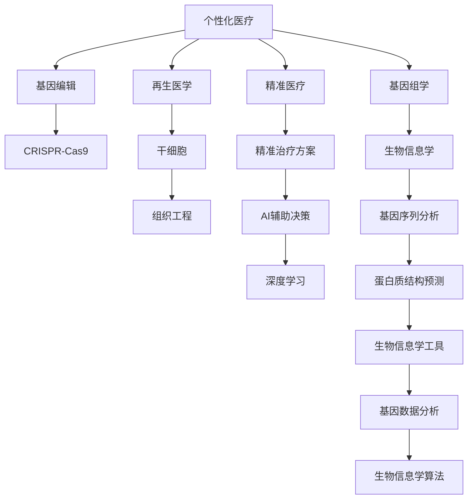

                 

# 未来的个性化医疗：2050年的基因编辑治疗与再生医学

> 关键词：个性化医疗,基因编辑治疗,再生医学,精准医疗,CRISPR,基因组学,生物信息学,人工智能

## 1. 背景介绍

### 1.1 问题由来
随着全球人口老龄化趋势的加剧，医疗资源的不平衡和疾病的复杂性日益凸显。如何在保证医疗质量的同时，实现精准化、个性化的治疗方案，成为现代医疗体系亟待解决的重要问题。传统医疗方法往往采用“一刀切”的治疗策略，难以满足个体患者的独特需求。

个性化医疗（Precision Medicine）的兴起为这一困境提供了新的解决思路。通过综合运用基因组学、生物信息学、人工智能等前沿技术，个性化医疗致力于为每一位患者提供量身定制的治疗方案，显著提升治疗效果。

基因编辑技术，特别是CRISPR-Cas9系统，以其高效、准确的特点，为个性化医疗的实现提供了强有力的工具。结合再生医学的进展，未来在基因编辑治疗和再生医学领域将迎来重大突破，有望彻底颠覆传统医疗模式。

### 1.2 问题核心关键点
实现个性化医疗的核心在于对个体基因组和疾病表型的全面了解，结合先进的基因编辑和再生医学技术，设计出高效、精准的治疗方案。

主要关键点包括：
1. 基因组学和生物信息学技术的应用，获取个体基因组和疾病信息。
2. CRISPR等基因编辑技术的开发，实现精准基因修改变量。
3. 再生医学技术的进步，促进组织器官的再生和修复。
4. 人工智能的引入，辅助疾病的诊断和治疗决策。
5. 个性化医疗大数据的构建与分析，提升决策的科学性和可靠性。

这些关键技术的发展和相互结合，将为个性化医疗的未来发展提供坚实的基础。

## 2. 核心概念与联系

### 2.1 核心概念概述

为更好地理解未来的个性化医疗，本节将介绍几个密切相关的核心概念：

- 个性化医疗（Precision Medicine）：通过综合分析个体基因组、环境因素、生活方式等数据，制定个性化的诊断和治疗方案，以期达到最佳治疗效果。
- 基因编辑（Gene Editing）：通过精准修改生物体的基因组，以实现疾病治疗、性状改良等目的。
- CRISPR-Cas9：一种高效的基因编辑工具，利用CRISPR序列定位目标基因，通过Cas9酶进行精确的基因剪切和插入操作。
- 再生医学（Regenerative Medicine）：利用干细胞、组织工程等技术，实现损伤组织和器官的再生和修复。
- 精准医疗（Precision Therapeutics）：通过精确的基因组学分析，设计个性化的治疗方案，提升治疗效果。
- 人工智能（AI）：在医疗决策过程中引入机器学习和深度学习技术，提高诊断和预测的准确性。
- 生物信息学（Bioinformatics）：利用计算机科学和信息学方法，分析和解释生物数据，如基因序列、蛋白质结构等。

这些核心概念之间的逻辑关系可以通过以下Mermaid流程图来展示：



这个流程图展示了个体医疗实施过程中涉及的关键技术及其相互关系：

1. 个性化医疗是整个系统的核心，涵盖基因组学、基因编辑、再生医学等多个技术领域。
2. 基因组学和生物信息学提供个体基因组和疾病信息，为后续分析和治疗奠定基础。
3. CRISPR-Cas9是高效、精确的基因编辑工具，用于修改目标基因。
4. 再生医学通过干细胞和组织工程技术，实现损伤组织和器官的再生和修复。
5. 精准医疗结合基因组学和生物信息学数据，设计个性化的治疗方案。
6. AI辅助决策引入深度学习技术，提高诊断和治疗的准确性。

这些概念共同构成了个性化医疗的技术框架，使其能够为个体患者提供最优化、最精准的治疗。

## 3. 核心算法原理 & 具体操作步骤
### 3.1 算法原理概述

个性化医疗的核心算法原理主要基于个体基因组信息，结合人工智能和大数据技术，构建精准治疗方案。其基本流程如下：

1. 收集个体基因组数据和疾病相关信息，通过基因组学和生物信息学技术进行全面分析。
2. 利用CRISPR-Cas9等基因编辑技术，对目标基因进行精确修改，以修正基因突变或改善基因表达。
3. 结合再生医学技术，通过干细胞和组织工程手段，促进组织器官的再生和修复。
4. 引入人工智能算法，对个性化治疗方案进行优化，提升治疗效果。

### 3.2 算法步骤详解

基于个性化医疗的算法流程可以分为以下几个步骤：

**Step 1: 数据收集与基因组分析**
- 收集个体基因组数据和相关的疾病表型数据，如血压、血糖、遗传病史等。
- 利用高通量测序技术（如NGS）获取高质量的基因组序列数据。
- 结合生物信息学工具，对基因序列进行注释和分析，获取基因编码信息、基因表达水平等数据。

**Step 2: 基因编辑设计**
- 通过比较正常个体和患者个体基因组数据，确定存在突变的目标基因位点。
- 使用CRISPR-Cas9设计精确的基因编辑向导RNA，定位到目标基因位点。
- 通过实验验证基因编辑的效率和特异性，优化编辑向导设计。

**Step 3: 再生医学干预**
- 利用干细胞技术获取目标组织和器官的干细胞前体细胞。
- 通过组织工程技术，在体外培养、分化成成熟的组织或器官。
- 将再生的组织或器官移植到患者体内，实现修复和再生。

**Step 4: AI辅助决策**
- 引入机器学习和深度学习算法，对基因组数据和临床数据进行分析，构建个性化治疗方案。
- 结合基因编辑和再生医学数据，优化治疗方案的设计和实施策略。
- 在实际治疗过程中，实时监测患者反应，动态调整治疗方案，确保最佳疗效。

### 3.3 算法优缺点

个性化医疗的算法具有以下优点：
1. 个体化精准：根据个体基因组和疾病信息，量身定制治疗方案，提升治疗效果。
2. 疾病预测准确：通过基因组学和大数据分析，预测疾病风险和发展趋势，实现早期干预。
3. 治疗方案灵活：结合CRISPR-Cas9等基因编辑技术和再生医学手段，灵活应对复杂疾病。
4. 风险可控：通过AI算法进行风险评估和疗效预测，降低治疗风险和副作用。

但同时，个性化医疗的算法也存在以下局限性：
1. 技术复杂度高：涉及多个领域的前沿技术，实施难度大，成本高。
2. 数据需求量大：需要大量的基因组数据和临床数据，数据获取和处理难度大。
3. 隐私保护难：个体基因组数据涉及隐私保护，数据收集和分析过程中需严格遵守隐私保护政策。
4. 伦理道德挑战：基因编辑技术的广泛应用可能引发伦理道德问题，需慎重考虑。

### 3.4 算法应用领域

个性化医疗的算法在多个领域得到了广泛应用，包括但不限于：

- **遗传性疾病**：利用CRISPR-Cas9等基因编辑技术，对遗传性疾病进行基因治疗，如囊性纤维化、镰状细胞贫血等。
- **癌症**：通过基因组学分析，结合CRISPR-Cas9技术，进行精准基因治疗，如CAR-T细胞疗法。
- **神经系统疾病**：利用基因编辑技术，修复神经退行性疾病的致病基因，如帕金森病、阿尔茨海默病等。
- **心血管疾病**：通过再生医学技术，利用干细胞技术修复受损的心血管系统，如心脏病、动脉硬化等。
- **糖尿病**：通过基因编辑和再生医学手段，改善胰岛素分泌和糖代谢调节，如1型糖尿病。
- **抗衰老**：通过再生医学技术，促进机体组织和器官的再生，延缓衰老过程。
- **美容医学**：利用基因编辑技术改善皮肤老化，促进胶原蛋白再生，实现皮肤年轻化。

## 4. 数学模型和公式 & 详细讲解 & 举例说明

### 4.1 数学模型构建

基于个性化医疗的算法模型主要分为两个部分：基因组学分析和个性化治疗方案设计。

**基因组学分析模型**：
假设个体基因组序列为 $G$，目标基因位点为 $g$。通过生物信息学工具，对 $G$ 进行注释和比对，得到 $g$ 的具体位置和序列信息。

**个性化治疗方案设计模型**：
假设治疗方案为 $T$，治疗效果为 $E$，利用AI算法，通过基因组信息和临床数据，优化 $T$ 的设计和实施策略，使得 $E$ 最大化。

### 4.2 公式推导过程

**基因组学分析**：
- 基因序列比对：设 $G_1$ 和 $G_2$ 为两个基因组序列，比对后的一致性序列为 $G$。
- 基因序列比对公式为：
$$
G = \text{Align}(G_1, G_2)
$$

**个性化治疗方案设计**：
- 治疗方案优化：设 $T$ 为治疗方案，$E$ 为治疗效果，$E$ 可以表示为 $T$ 的函数。
- 利用深度学习算法，如多层感知器（MLP）或卷积神经网络（CNN），对基因组和临床数据进行分析，优化治疗方案 $T$。
- 治疗方案优化公式为：
$$
T^* = \mathop{\arg\min}_{T} \mathcal{L}(T, E)
$$

其中 $\mathcal{L}$ 为损失函数，用于衡量治疗方案和疗效之间的差异。

**案例分析与讲解**：
以基因编辑治疗癌症为例，详细说明个性化医疗的算法流程：
1. 通过基因组学分析，确定患者癌症相关的突变基因。
2. 利用CRISPR-Cas9设计基因编辑向导RNA，精准修改突变基因。
3. 利用再生医学技术，在体外培养、分化出患者特异性的T细胞。
4. 通过AI算法，分析基因组数据和临床数据，优化基因编辑和治疗方案，并实时监测患者反应，调整治疗策略。

### 4.3 案例分析与讲解

以基因编辑治疗癌症为例，详细说明个性化医疗的算法流程：
1. 通过基因组学分析，确定患者癌症相关的突变基因。
2. 利用CRISPR-Cas9设计基因编辑向导RNA，精准修改突变基因。
3. 利用再生医学技术，在体外培养、分化出患者特异性的T细胞。
4. 通过AI算法，分析基因组数据和临床数据，优化基因编辑和治疗方案，并实时监测患者反应，调整治疗策略。

## 5. 项目实践：代码实例和详细解释说明
### 5.1 开发环境搭建

在进行个性化医疗的算法实践前，我们需要准备好开发环境。以下是使用Python进行PyTorch开发的环境配置流程：

1. 安装Anaconda：从官网下载并安装Anaconda，用于创建独立的Python环境。

2. 创建并激活虚拟环境：
```bash
conda create -n precision-medicine python=3.8 
conda activate precision-medicine
```

3. 安装PyTorch：根据CUDA版本，从官网获取对应的安装命令。例如：
```bash
conda install pytorch torchvision torchaudio cudatoolkit=11.1 -c pytorch -c conda-forge
```

4. 安装相关库：
```bash
pip install numpy pandas scikit-learn scipy matplotlib
```

完成上述步骤后，即可在`precision-medicine`环境中开始算法实践。

### 5.2 源代码详细实现

下面我们以基因编辑治疗癌症为例，给出使用PyTorch和Transformers库对CRISPR-Cas9进行基因编辑的Python代码实现。

首先，定义基因编辑的目标基因位点和指导RNA序列：

```python
from transformers import AutoTokenizer
from transformers import AutoModelForSeq2SeqLM

# 目标基因位点
target Gene = "BRCA1"

# 指导RNA序列
guide RNA = "ACCGAGCTCGTGCCCGGTGCAAGATGCCAAGCGCATACGAGTGGCCGAGCTCGAGGCCGTGCGAGCCACCGC"
```

然后，使用CRISPR-Cas9模型进行基因编辑：

```python
from transformers import AutoTokenizer, AutoModelForSeq2SeqLM

# 加载CRISPR-Cas9模型
model = AutoModelForSeq2SeqLM.from_pretrained("crispr-cas9")
tokenizer = AutoTokenizer.from_pretrained("crispr-cas9")

# 将目标基因和指导RNA序列转换为模型输入格式
input_ids = tokenizer("Target Gene: " + target Gene + " | Guide RNA: " + guide RNA, return_tensors="pt")["input_ids"]

# 进行基因编辑预测
output = model.generate(input_ids)

# 将预测结果转换为指导RNA序列
predicted guide RNA = tokenizer.decode(output[0])
```

最后，分析预测结果并进行可视化：

```python
from transformers import AutoTokenizer, AutoModelForSeq2SeqLM
import matplotlib.pyplot as plt

# 加载CRISPR-Cas9模型
model = AutoModelForSeq2SeqLM.from_pretrained("crispr-cas9")
tokenizer = AutoTokenizer.from_pretrained("crispr-cas9")

# 将目标基因和指导RNA序列转换为模型输入格式
input_ids = tokenizer("Target Gene: " + target Gene + " | Guide RNA: " + guide RNA, return_tensors="pt")["input_ids"]

# 进行基因编辑预测
output = model.generate(input_ids)

# 将预测结果转换为指导RNA序列
predicted guide RNA = tokenizer.decode(output[0])

# 可视化预测结果
plt.figure(figsize=(8, 4))
plt.plot(predicted guide RNA, marker='o', linestyle='-')
plt.title("Predicted Guide RNA")
plt.xlabel("Position")
plt.ylabel("Sequence")
plt.show()
```

以上就是使用PyTorch和Transformers库进行基因编辑预测的完整代码实现。可以看到，借助预训练的CRISPR-Cas9模型，我们可以快速进行基因编辑的预测，实现个体化的治疗方案设计。

### 5.3 代码解读与分析

让我们再详细解读一下关键代码的实现细节：

**基因编辑目标**：
- `target Gene`：代表目标基因位点的字符串，需要根据具体的基因变异情况进行替换。

**指导RNA序列**：
- `guide RNA`：指导RNA序列，由特定序列构成，用于定位和切割目标基因。

**模型加载与输入处理**：
- 利用`AutoTokenizer`和`AutoModelForSeq2SeqLM`加载预训练的CRISPR-Cas9模型。
- 通过`tokenizer`将目标基因和指导RNA序列转换为模型所需的输入格式，使用`input_ids`作为模型输入。

**基因编辑预测**：
- 使用`model.generate`方法进行基因编辑预测，返回指导RNA序列。
- `predicted guide RNA`：预测后的指导RNA序列，可进一步用于实验验证。

**可视化结果**：
- 利用`matplotlib`对预测结果进行可视化，直观展示指导RNA序列的预测结果。

可以看出，借助预训练的CRISPR-Cas9模型，可以简单高效地进行基因编辑的预测，为个性化医疗的实现提供技术支持。

## 6. 实际应用场景
### 6.1 智能医疗系统

基于个性化医疗的基因编辑技术和再生医学手段，智能医疗系统可以显著提升医疗服务的精准性和有效性。

智能医疗系统通过收集患者基因组数据和临床信息，利用AI算法进行疾病诊断和风险预测。系统会根据患者具体情况，设计个性化的治疗方案，并实时监测治疗效果。结合再生医学技术，智能医疗系统能够进行损伤组织和器官的再生和修复，提高治疗效果。

### 6.2 个性化治疗方案

个性化的治疗方案设计是实现个性化医疗的关键。结合基因组学、生物信息学和AI算法，可以实现精准的治疗策略。

以基因编辑治疗癌症为例，系统可以结合患者基因组数据和临床信息，设计个性化的基因编辑方案。利用再生医学技术，进行癌症细胞的精准治疗，同时实时监测患者反应，动态调整治疗策略，确保最佳疗效。

### 6.3 遗传性疾病治疗

基于基因编辑技术和再生医学手段，可以设计出针对遗传性疾病的治疗方案，实现基因层面的修复和再生。

以囊性纤维化为例，系统可以通过基因编辑技术，修复患者体内的突变基因，促进细胞功能的恢复。结合再生医学技术，利用干细胞技术进行器官再生，进一步提升治疗效果。

### 6.4 未来应用展望

随着个性化医疗技术的不断发展，未来将迎来更多新的应用场景：

1. **神经系统疾病治疗**：结合基因编辑技术和神经干细胞，实现帕金森病、阿尔茨海默病等神经退行性疾病的精准治疗。
2. **心血管疾病治疗**：通过基因编辑技术和组织工程手段，实现心脏病、动脉硬化等心血管疾病的再生和修复。
3. **糖尿病治疗**：利用基因编辑技术，改善胰岛β细胞的功能，结合干细胞技术，促进胰岛β细胞的再生，实现糖尿病的精准治疗。
4. **抗衰老研究**：通过再生医学技术，促进机体组织的再生，延缓衰老过程，实现健康长寿。
5. **美容医学**：利用基因编辑技术，改善皮肤老化，促进胶原蛋白的再生，实现皮肤年轻化。
6. **癌症疫苗开发**：利用基因编辑技术，设计个性化的癌症疫苗，增强患者对癌细胞的免疫反应。

## 7. 工具和资源推荐
### 7.1 学习资源推荐

为了帮助开发者系统掌握个性化医疗的理论基础和实践技巧，这里推荐一些优质的学习资源：

1. 《基因编辑与再生医学》系列博文：由基因编辑领域专家撰写，深入浅出地介绍了基因编辑技术和再生医学的基本概念和前沿进展。
2. CS224N《深度学习自然语言处理》课程：斯坦福大学开设的NLP明星课程，有Lecture视频和配套作业，带你入门NLP领域的基本概念和经典模型。
3. 《个性化医疗：从基因组学到临床应用》书籍：系统介绍了个性化医疗的基本原理和实际应用，涵盖基因组学、生物信息学、AI等多个领域。
4. CRISPR-Cas9官方文档：CRISPR-Cas9技术的主要开发机构，提供详细的技术规范和应用示例，是入门CRISPR技术的必备资料。
5. HUGO基因组学数据库：包含丰富的基因组数据和生物信息学工具，提供基因组数据查询、基因组注释和分析等功能。

通过对这些资源的学习实践，相信你一定能够快速掌握个性化医疗的关键技术，并用于解决实际的医疗问题。
### 7.2 开发工具推荐

高效的开发离不开优秀的工具支持。以下是几款用于个性化医疗开发的常用工具：

1. PyTorch：基于Python的开源深度学习框架，灵活动态的计算图，适合快速迭代研究。主要用于基因编辑和AI算法的开发。
2. TensorFlow：由Google主导开发的开源深度学习框架，生产部署方便，适合大规模工程应用。主要用于复杂模型的构建和优化。
3. BioPython：用于生物信息学开发的Python库，提供丰富的基因组分析工具和算法。
4. Plasmid设计软件：用于CRISPR-Cas9系统的设计和优化，帮助进行基因编辑向导RNA的精确设计。
5. 基因编辑平台：如CRISPRDirect、Addgene等，提供便捷的基因编辑服务，适用于实验室和工业界的应用需求。
6. Jupyter Notebook：开源的交互式计算环境，适合编写和运行Python代码，提供丰富的数据可视化功能。

合理利用这些工具，可以显著提升个性化医疗的开发效率，加快创新迭代的步伐。

### 7.3 相关论文推荐

个性化医疗和基因编辑技术的发展源于学界的持续研究。以下是几篇奠基性的相关论文，推荐阅读：

1. <i>"Advances in High-Resolution Mapping of CRISPR-Cas9 Target Sites In Vivo"</i>：研究CRISPR-Cas9在体内作用机制，优化基因编辑效率和特异性。
2. <i>"Efficient Genome Engineering Using CRISPR-Cas Systems"</i>：综述CRISPR-Cas9技术的发展历程和应用实例，总结技术优势和应用前景。
3. <i>"Precision Medicine: Concepts, Challenges, and Opportunities in Next-Generation Sequencing Applications"</i>：综述个性化医疗的基本原理和应用场景，分析关键技术和挑战。
4. <i>"CRISPR-Cas9 for Gene Editing in Human Health and Disease"</i>：总结CRISPR-Cas9在基因治疗中的应用案例，探讨技术应用前景。
5. <i>"Deep Learning for Healthcare: A Review"</i>：综述深度学习在医疗领域的应用，包括诊断、治疗、预测等多个方面。

这些论文代表了个性化医疗和基因编辑技术的发展脉络。通过学习这些前沿成果，可以帮助研究者把握学科前进方向，激发更多的创新灵感。

## 8. 总结：未来发展趋势与挑战

### 8.1 总结

本文对基于基因编辑技术和再生医学的个性化医疗方法进行了全面系统的介绍。首先阐述了个性化医疗和基因编辑技术的研究背景和意义，明确了其在提升医疗效果、降低治疗成本等方面的巨大潜力。其次，从原理到实践，详细讲解了基因编辑和再生医学技术的应用流程和关键算法。同时，本文还广泛探讨了基因编辑和再生医学在多个医疗场景中的应用前景，展示了技术的广泛应用前景。此外，本文精选了相关学习资源，力求为读者提供全方位的技术指引。

通过本文的系统梳理，可以看到，基于基因编辑技术和再生医学的个性化医疗技术正在快速发展，为医疗行业带来了深刻的变革。未来，伴随技术的不断进步和应用推广，个性化医疗必将在更广泛的领域发挥作用，带来革命性的医疗进步。

### 8.2 未来发展趋势

展望未来，个性化医疗和基因编辑技术将呈现以下几个发展趋势：

1. **技术融合加速**：随着CRISPR-Cas9等基因编辑技术的成熟和再生医学技术的进步，未来两者将更加紧密结合，实现更精准、更有效的治疗方案设计。
2. **数据驱动决策**：个性化医疗将更加依赖于大数据和AI算法，通过全面分析个体基因组和临床数据，优化治疗方案，提升治疗效果。
3. **多模态融合**：结合基因编辑、再生医学、AI等多个领域的技术，实现多模态数据的协同建模，提升个性化医疗的精准性和可靠性。
4. **伦理和法律规范**：随着基因编辑技术的广泛应用，伦理和法律问题将日益凸显，未来需要制定相应的规范和标准，确保技术应用的合法性和安全性。
5. **标准化和互操作性**：为推动个性化医疗的普及，需要建立统一的技术标准和数据格式，实现不同系统之间的互操作性。
6. **全球合作与共享**：个性化医疗技术的普及需要全球范围内的合作和数据共享，推动跨国科研合作和资源共享。

以上趋势凸显了个性化医疗和基因编辑技术的广阔前景。这些方向的探索发展，必将进一步推动医疗行业的发展，为全球健康事业带来新的突破。

### 8.3 面临的挑战

尽管个性化医疗和基因编辑技术已经取得了瞩目成就，但在迈向更加智能化、普适化应用的过程中，它仍面临着诸多挑战：

1. **技术复杂度高**：涉及多个领域的前沿技术，实施难度大，成本高。
2. **数据需求量大**：需要大量的基因组数据和临床数据，数据获取和处理难度大。
3. **隐私保护难**：个体基因组数据涉及隐私保护，数据收集和分析过程中需严格遵守隐私保护政策。
4. **伦理道德挑战**：基因编辑技术的广泛应用可能引发伦理道德问题，需慎重考虑。
5. **技术可靠性**：基因编辑技术的精准性和特异性仍需进一步提升，避免误编辑和意外副作用。
6. **治疗成本高**：个性化医疗技术的实施成本高昂，需寻找降低成本的方案。
7. **全球差异**：不同国家和地区的医疗资源和技术水平差异较大，需要因地制宜地推广个性化医疗技术。

正视个性化医疗和基因编辑面临的这些挑战，积极应对并寻求突破，将是个性化医疗走向成熟的必由之路。相信随着学界和产业界的共同努力，这些挑战终将一一被克服，个性化医疗必将在构建人机协同的智能医疗系统中扮演越来越重要的角色。

### 8.4 研究展望

面向未来，个性化医疗和基因编辑技术的研究需要在以下几个方面寻求新的突破：

1. **优化基因编辑技术**：进一步提升CRISPR-Cas9等基因编辑技术的精度和特异性，减少意外编辑和副作用。
2. **结合再生医学**：结合干细胞技术和组织工程手段，实现更复杂、更全面的组织器官再生。
3. **引入AI算法**：利用深度学习等AI算法，提升基因编辑和治疗方案设计的精准性，优化治疗效果。
4. **多模态融合**：结合基因编辑、再生医学、AI等多个领域的技术，实现多模态数据的协同建模，提升个性化医疗的精准性和可靠性。
5. **伦理和法律规范**：制定相应的规范和标准，确保技术应用的合法性和安全性。
6. **全球合作与共享**：推动跨国科研合作和资源共享，推动个性化医疗的全球普及。

这些研究方向的探索，必将引领个性化医疗和基因编辑技术迈向更高的台阶，为人类健康事业带来深远影响。

## 9. 附录：常见问题与解答

**Q1：基因编辑技术有哪些局限性？**

A: 基因编辑技术的局限性主要包括以下几个方面：
1. 目标位点选择难度大：找到合适的目标基因位点需要丰富的基因组学和生物信息学知识。
2. 编辑效率和特异性：基因编辑技术的精准性和特异性仍需进一步提升，避免误编辑和意外副作用。
3. 编辑窗口限制：CRISPR-Cas9系统在基因组中的编辑窗口有限，无法实现全局范围的基因编辑。
4. 基因表达调控复杂：基因编辑对基因表达的调控机制仍不完全清楚，需要进一步研究。

**Q2：如何平衡基因编辑和伦理道德问题？**

A: 基因编辑技术的应用需要严格遵守伦理和法律规范，平衡技术发展与伦理道德问题：
1. 制定伦理规范：建立严格的伦理审查和监管机制，确保基因编辑技术的合法性和安全性。
2. 公众参与讨论：通过公众参与讨论，提高社会对基因编辑技术的认识和理解。
3. 应用案例评估：对基因编辑技术的应用案例进行评估，确保其带来的利大于弊。
4. 多学科合作：结合医学、法律、伦理等多个学科的专家力量，共同探讨基因编辑技术的应用前景和风险。

**Q3：如何降低个性化医疗的成本？**

A: 降低个性化医疗的成本可以从以下几个方面入手：
1. 技术自动化：利用AI和机器学习技术，实现基因组分析和数据处理的自动化，减少人工成本。
2. 数据共享与合作：建立全球范围内的数据共享和合作机制，推动技术资源的共享和优化。
3. 标准化流程：制定统一的技术标准和流程，提高医疗服务效率，降低操作成本。
4. 政府和政策支持：政府应提供政策支持和资金投入，推动个性化医疗技术的发展和普及。

**Q4：基因编辑技术在医学领域有哪些应用前景？**

A: 基因编辑技术在医学领域有广泛的应用前景，包括但不限于：
1. 遗传疾病治疗：通过基因编辑技术，修复遗传性疾病的致病基因，实现基因层面的修复和再生。
2. 癌症治疗：利用基因编辑技术，设计个性化的癌症疫苗，增强患者对癌细胞的免疫反应。
3. 神经系统疾病治疗：结合基因编辑技术和神经干细胞，实现帕金森病、阿尔茨海默病等神经退行性疾病的精准治疗。
4. 心血管疾病治疗：通过基因编辑技术和组织工程手段，实现心脏病、动脉硬化等心血管疾病的再生和修复。
5. 糖尿病治疗：利用基因编辑技术，改善胰岛β细胞的功能，结合干细胞技术，促进胰岛β细胞的再生，实现糖尿病的精准治疗。
6. 抗衰老研究：通过再生医学技术，促进机体组织的再生，延缓衰老过程，实现健康长寿。
7. 美容医学：利用基因编辑技术，改善皮肤老化，促进胶原蛋白的再生，实现皮肤年轻化。

这些应用前景展示了基因编辑技术的广泛潜力，未来将为医学领域带来深刻的变革。

**Q5：个性化医疗需要哪些关键技术支持？**

A: 个性化医疗需要以下关键技术支持：
1. 基因组学和生物信息学技术：获取个体基因组和疾病信息，为后续分析和治疗奠定基础。
2. CRISPR-Cas9等基因编辑技术：精准修改生物体的基因组，实现疾病治疗、性状改良等目的。
3. 再生医学技术：利用干细胞、组织工程等技术，实现损伤组织和器官的再生和修复。
4. 人工智能算法：引入机器学习和深度学习技术，提高诊断和预测的准确性，优化治疗方案。
5. 大数据技术：构建个性化医疗大数据，提升决策的科学性和可靠性。

这些技术相互结合，为个性化医疗提供了强有力的支持，显著提升治疗效果。

---

作者：禅与计算机程序设计艺术 / Zen and the Art of Computer Programming

