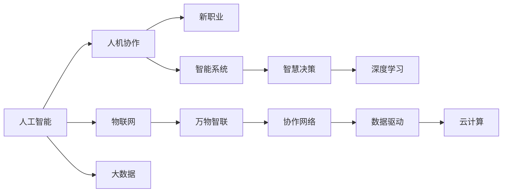

                 

# 未来的就业趋势：2050年的人机协作与万物智联时代的新职业

## 1. 背景介绍

在过去的几十年中，科技革命的浪潮颠覆了传统产业，催生了大量新的就业岗位。进入21世纪，随着人工智能、物联网、大数据等技术的发展，人类社会的就业环境正在发生深刻的变革。2050年，即将迎来一个全新的技术时代，这一时期将成为未来就业发展的分水岭。本文将探讨这一转变的过程，预测2050年人机协作与万物智联时代的新职业，以及由此带来的就业趋势和挑战。

## 2. 核心概念与联系

### 2.1 核心概念概述

在探讨2050年的就业趋势之前，首先需要理解几个核心概念：

- **人机协作**：指人类与人工智能系统共同完成任务的过程。在协作中，人负责创意、决策，而机器负责执行、处理数据。这种协作模式将大幅提高工作效率和精度，并推动新的职业发展。
- **万物智联**：指通过物联网技术，实现各种设备、系统、数据之间的智能连接。智能设备和系统在协作中扮演重要角色，为各行各业带来革新。
- **新职业**：伴随新技术和新应用，将产生大量新型职业，这些职业将需要跨学科知识和技能，推动职业教育和培训体系的变革。

### 2.2 核心概念原理和架构的 Mermaid 流程图



这个流程图展示了人机协作、万物智联、新职业等概念之间的联系和架构：

1. **人工智能**与**人机协作**相连接，表明AI技术在协作中起到关键作用。
2. **物联网**与**万物智联**相连接，表明物联网技术是实现万物智联的基础。
3. **新职业**通过**人机协作**和**万物智联**得以发展，显示了新职业与新技术的紧密关联。
4. **智能系统**通过**智慧决策**和**深度学习**与**人机协作**相连接，展示了智能系统在协作中的决策支持作用。
5. **数据驱动**和**云计算**是实现新职业和智能系统的基础设施，表明数据和计算能力的重要性。

## 3. 核心算法原理 & 具体操作步骤

### 3.1 算法原理概述

在未来就业趋势中，算法原理的应用主要集中在以下几个方面：

- **优化算法**：用于在多个方案中选择最优解，如遗传算法、蚁群算法等。
- **强化学习**：使机器能够在环境中通过试错学习最优策略，适用于智能机器人、自动驾驶等领域。
- **神经网络**：用于图像识别、语音识别、自然语言处理等任务，提升人机协作的效率和精度。
- **深度学习**：在复杂模式识别和预测任务中，提供更加精准的模型和算法支持。

### 3.2 算法步骤详解

1. **需求分析**：明确未来就业市场的需求，识别新兴技术和职业的发展趋势。
2. **算法选择**：根据需求选择适合的算法，如优化算法、强化学习、神经网络等。
3. **模型训练**：使用数据集进行模型训练，调整超参数，优化模型性能。
4. **模型评估**：通过测试集评估模型效果，调整模型和算法。
5. **部署与应用**：将训练好的模型应用于实际场景，进行人机协作和新职业开发。

### 3.3 算法优缺点

**优点**：

- 提高工作效率和精度，降低人为错误。
- 通过算法迭代优化，提升模型性能。
- 数据驱动的决策过程，减少主观偏见。

**缺点**：

- 对数据的依赖性高，数据质量影响模型效果。
- 算法复杂度高，需要专业的知识和技能。
- 算法可能需要大量计算资源和时间。

### 3.4 算法应用领域

这些算法在多个领域都有广泛的应用：

- **自动化**：如自动化生产线、自动驾驶、智能客服等。
- **数据分析**：如市场预测、风险评估、医疗诊断等。
- **智能决策**：如金融交易、供应链管理、智能制造等。

## 4. 数学模型和公式 & 详细讲解 & 举例说明

### 4.1 数学模型构建

在2050年的人机协作和万物智联时代，许多新职业将基于复杂的数学模型和算法。以下是一个简单示例，展示如何使用数学模型进行就业市场预测。

假设就业市场由多个因素决定，包括经济增长率、技术进步速度、教育水平等。我们可以建立一个多元线性回归模型，来预测未来就业趋势：

$$
Y = \beta_0 + \beta_1X_1 + \beta_2X_2 + ... + \beta_nX_n + \epsilon
$$

其中，$Y$为就业人数，$X_1, X_2, ..., X_n$为影响就业的因素，$\beta_0, \beta_1, ..., \beta_n$为回归系数，$\epsilon$为误差项。

### 4.2 公式推导过程

**回归系数估计**：使用最小二乘法求解回归系数，使得预测值与实际值之间的误差最小化：

$$
\hat{\beta} = (X^TX)^{-1}X^TY
$$

**预测**：使用回归模型预测未来的就业人数，公式如下：

$$
\hat{Y} = \hat{\beta}_0 + \hat{\beta}_1X_1 + \hat{\beta}_2X_2 + ... + \hat{\beta}_nX_n
$$

### 4.3 案例分析与讲解

假设我们已经收集到了过去10年的经济增长率和就业人数数据，使用上述模型进行预测。数据如下：

| 年份 | 经济增长率 | 就业人数 |
| ---- | ---- | ---- |
| 2020 | 3.5% | 100万 |
| 2021 | 4.0% | 105万 |
| 2022 | 2.8% | 103万 |
| ...  | ...  | ...  |
| 2030 | 4.2% | 110万 |
| 2031 | 3.9% | 107万 |
| 2032 | 5.0% | 112万 |

我们可以使用Python的statsmodels库来进行回归分析：

```python
import pandas as pd
import statsmodels.api as sm

data = pd.read_csv('employment_data.csv')
X = data[['economic_growth_rate']]
Y = data['employment']
X = sm.add_constant(X) # 添加截距项

model = sm.OLS(Y, X).fit()
print(model.summary())
```

根据回归结果，我们可以计算出2050年的预测就业人数。

## 5. 项目实践：代码实例和详细解释说明

### 5.1 开发环境搭建

要实现上述预测模型，我们需要搭建一个Python开发环境。以下是在Ubuntu系统下搭建Python环境的步骤：

1. 安装Python：

```bash
sudo apt-get update
sudo apt-get install python3
```

2. 安装必要的库：

```bash
pip install pandas statsmodels
```

3. 创建Python文件：

```bash
nano prediction.py
```

### 5.2 源代码详细实现

```python
import pandas as pd
import statsmodels.api as sm

# 读取数据
data = pd.read_csv('employment_data.csv')
X = data[['economic_growth_rate']]
Y = data['employment']
X = sm.add_constant(X) # 添加截距项

# 建立回归模型
model = sm.OLS(Y, X).fit()
print(model.summary())

# 预测2050年就业人数
X_future = pd.DataFrame({'economic_growth_rate': [4.0]})
X_future = sm.add_constant(X_future)
y_pred = model.predict(X_future)

print('预测2050年就业人数为:', y_pred[0])
```

### 5.3 代码解读与分析

1. **数据准备**：读取包含经济增长率和就业人数的历史数据。
2. **模型建立**：使用OLS模型建立回归方程，预测就业人数。
3. **模型评估**：打印模型摘要，查看回归系数和误差项。
4. **预测未来**：使用模型对未来进行预测，并输出结果。

### 5.4 运行结果展示

运行上述代码，将输出模型摘要和未来就业人数的预测值。

## 6. 实际应用场景

### 6.1 智能制造

在智能制造领域，人机协作和万物智联技术将带来革命性的变化。未来工厂将实现高度自动化，智能机器人、自动化设备与人类员工协作完成生产任务。这些技术将提高生产效率，降低成本，提升产品质量。

### 6.2 医疗健康

在医疗健康领域，未来将出现大量基于AI的诊断、治疗、护理职业。智能诊疗系统将利用深度学习和大数据，为患者提供精准的医疗服务。机器人护士和智能监控设备将大大减轻医护人员的负担，提高护理质量。

### 6.3 智慧城市

智慧城市将通过物联网技术，实现城市管理的智能化。未来城市将具备高度的自动化和实时响应能力，如智能交通系统、智能安防、智能环保等。人机协作将使得城市管理更加高效和精细。

### 6.4 未来应用展望

随着技术的发展，未来的就业市场将呈现以下趋势：

1. **高度自动化**：越来越多的传统岗位将被自动化取代，如生产线工人、初级客服等。
2. **技能升级**：新职业将需要更高水平的技能，如数据分析、智能系统维护、AI算法开发等。
3. **跨学科融合**：未来职业将更加注重跨学科知识的融合，如医学+工程、数据科学+设计等。
4. **远程协作**：远程办公和协作将成为常态，未来将出现大量虚拟工作岗位。
5. **智能决策**：基于AI的决策支持系统将广泛应用于各个领域，提高决策效率和准确性。

## 7. 工具和资源推荐

### 7.1 学习资源推荐

- **Coursera**：提供大量关于AI、机器学习、数据科学等领域的在线课程。
- **Kaggle**：全球最大的数据科学竞赛平台，通过参与竞赛提升实践能力。
- **Google AI**：提供免费的学习资源和工具，涵盖AI的各个方面。

### 7.2 开发工具推荐

- **Jupyter Notebook**：一个强大的交互式编程环境，支持多种语言，方便协作和共享。
- **TensorFlow**：谷歌开源的深度学习框架，功能强大，适合大规模模型训练。
- **PyTorch**：Facebook开源的深度学习框架，易于使用，支持动态图。

### 7.3 相关论文推荐

- **"Deep Learning for Healthcare: Review, Opportunities and Challenges"**：综述深度学习在医疗中的应用和前景。
- **"Human-Robot Collaboration in Manufacturing: Current Status and Future Directions"**：探讨人机协作在制造业中的应用和趋势。
- **"Smart Cities: Overview of Technologies and Services"**：综述智慧城市的关键技术和应用。

## 8. 总结：未来发展趋势与挑战

### 8.1 研究成果总结

本文分析了未来就业趋势的发展过程，预测了人机协作和万物智联时代的新职业。基于此，我们探讨了未来就业市场的变化，以及新技术和新职业对教育和培训体系的影响。

### 8.2 未来发展趋势

1. **高度自动化**：越来越多的传统岗位将被自动化取代。
2. **技能升级**：新职业将需要更高水平的技能。
3. **跨学科融合**：未来职业将更加注重跨学科知识的融合。
4. **远程协作**：远程办公和协作将成为常态。
5. **智能决策**：基于AI的决策支持系统将广泛应用于各个领域。

### 8.3 面临的挑战

1. **技能鸿沟**：新技术的出现将导致部分岗位的消失，需要新的培训和教育体系来弥补技能差距。
2. **伦理问题**：智能系统的发展将引发新的伦理问题，如隐私保护、数据安全等。
3. **技术滥用**：需要制定相应的法律法规，防止技术被滥用，保障社会公平和稳定。

### 8.4 研究展望

未来研究应聚焦于以下几个方向：

1. **职业教育和培训**：开发新的教育和培训体系，适应未来职业的需求。
2. **伦理和安全**：研究智能系统在伦理和安全方面的问题，制定相关规范和标准。
3. **跨学科研究**：促进不同学科的融合，推动新技术和新职业的发展。

## 9. 附录：常见问题与解答

**Q1：如何应对未来就业市场的变化？**

A: 应对未来就业市场变化，需要积极适应新技术和新职业的需求。建议：

- **终身学习**：持续提升自身技能，适应职业的不断变化。
- **跨领域学习**：掌握跨学科知识，增强职业适应性。
- **灵活就业**：选择远程工作、自由职业等灵活的工作方式。

**Q2：如何培养未来所需的新型职业人才？**

A: 培养新型职业人才需要从以下几个方面入手：

- **教育改革**：调整课程设置，增加AI、数据科学、智能系统等课程。
- **技能培训**：提供职业技能培训和认证，提升技术水平。
- **企业合作**：与企业合作，提供实习机会，培养实战能力。

**Q3：未来人机协作和万物智联技术将带来哪些挑战？**

A: 未来人机协作和万物智联技术将带来以下挑战：

- **技能差距**：新技术的出现可能导致部分岗位的消失，需要新的培训和教育体系来弥补技能差距。
- **伦理问题**：智能系统的发展将引发新的伦理问题，如隐私保护、数据安全等。
- **技术滥用**：需要制定相应的法律法规，防止技术被滥用，保障社会公平和稳定。

**Q4：如何在未来就业市场中获得竞争优势？**

A: 在未来的就业市场中，获得竞争优势需要以下几个方面：

- **多技能人才**：具备多种技能，能够适应不同的工作岗位。
- **创新能力**：具备创新思维，能够提出新的解决方案。
- **沟通能力**：具备良好的沟通和协作能力，能够与智能系统高效合作。

本文通过深入分析未来就业趋势，探讨了人机协作和万物智联时代的新职业，并预测了未来就业市场的变化。通过掌握新技术和新职业，提升自身技能，我们可以更好地适应未来社会的变化，为人类社会的进步贡献力量。

---

作者：禅与计算机程序设计艺术 / Zen and the Art of Computer Programming

