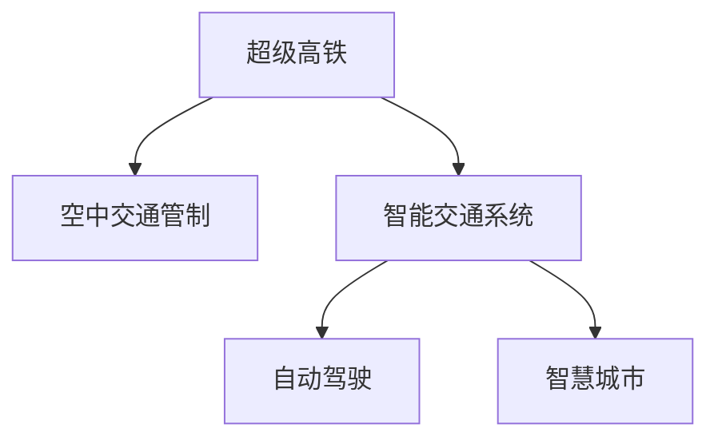

                 

# 未来的智能交通：2050年的超级高铁网与空中交通管制

> 关键词：超级高铁,空中交通管制,智能交通系统,物联网(IoT),人工智能(AI),自动驾驶,智慧城市

## 1. 背景介绍

### 1.1 问题由来
随着城市化和全球化的不断推进，交通问题已经成为各国政府和科研机构共同关注的焦点。当前的交通系统面临着诸多挑战，如交通拥堵、环境污染、资源浪费等，这些问题严重影响着人们的生活质量和社会经济的发展。随着科技的进步，人工智能(AI)、物联网(IoT)、自动驾驶等前沿技术的发展，为解决交通问题带来了新的思路和可能。

### 1.2 问题核心关键点
面向未来的智能交通系统，我们希望通过AI、IoT、自动驾驶等前沿技术，构建一套高效、智能、环保的交通网络。具体而言，超级高铁和空中交通管制系统将作为两大关键点，引领未来交通的发展方向。超级高铁通过高速、可靠、高效的大容量运输，改变人们出行方式，提升交通系统的效率和舒适度。空中交通管制系统通过智能化、自动化的手段，实现更加安全、流畅的空中交通管理。

## 2. 核心概念与联系

### 2.1 核心概念概述

为更好地理解2050年智能交通系统的构建，本节将介绍几个密切相关的核心概念：

- 超级高铁(Hyperloop)：一种基于低真空管道的高速运输系统，能够在几十分钟内完成城市间的运输，具有极高的运输效率和安全性。
- 空中交通管制(Air Traffic Control, ATC)：通过对空中交通的监测、调度和控制，保证飞机在空中的安全有序飞行。
- 智能交通系统(Intelligent Transportation System, ITS)：利用AI、IoT、云计算等技术，对交通流量进行实时监测、分析和优化，提升交通系统的智能化水平。
- 自动驾驶(Autonomous Driving)：通过车载传感器、AI算法等技术，使车辆能够自主导航、避障、决策，实现无人驾驶。
- 智慧城市(Smart City)：融合物联网、大数据、云计算等技术，构建高度智能化的城市管理体系，实现能源、交通、公共服务等多方面的智能化。

这些核心概念之间的逻辑关系可以通过以下Mermaid流程图来展示：



这个流程图展示出2050年智能交通系统的核心组成：

1. 超级高铁通过高速运输改变人们的出行方式，提升交通效率。
2. 空中交通管制系统通过智能化手段，实现空中交通的安全有序管理。
3. 智能交通系统通过实时监测和分析，优化交通流量，提升系统效率。
4. 自动驾驶技术通过AI算法，使车辆实现自主导航和决策。
5. 智慧城市融合多种技术，构建高度智能化的城市管理体系。

## 3. 核心算法原理 & 具体操作步骤
### 3.1 算法原理概述

面向2050年的智能交通系统，核心算法原理主要基于以下几个方面：

- **超级高铁算法**：超级高铁通过磁悬浮技术、低真空管道、高精度定位等技术实现高速运输。其核心算法包括磁悬浮力场控制、管道密封、超导磁体冷却等，这些算法通过数学建模和物理仿真，实现超级高铁系统的稳定高效运行。

- **空中交通管制算法**：空中交通管制系统通过雷达、卫星、传感器等设备，实现对空中交通的实时监测和控制。其核心算法包括轨迹规划、冲突检测、避障算法等，这些算法通过AI和优化算法，实现空中交通的安全高效管理。

- **智能交通系统算法**：智能交通系统通过传感器网络、数据融合、交通流预测等算法，实现对交通流量的实时监测和优化。其核心算法包括数据预处理、模式识别、交通流预测、交通信号控制等，这些算法通过深度学习和优化算法，实现交通流量的高效管理。

- **自动驾驶算法**：自动驾驶技术通过车载传感器、AI算法、地图数据等，实现车辆的自主导航和决策。其核心算法包括环境感知、路径规划、行为决策等，这些算法通过深度学习、强化学习等技术，实现车辆的自主驾驶。

- **智慧城市算法**：智慧城市通过物联网、大数据、云计算等技术，实现城市管理的智能化。其核心算法包括城市能源管理、智能交通管理、公共服务优化等，这些算法通过大数据分析和优化算法，实现城市管理的智能化。

### 3.2 算法步骤详解

#### 3.2.1 超级高铁算法步骤

1. **磁悬浮力场控制**：通过磁力与轨道的相互作用，使列车悬浮在空中，实现无接触高速运输。核心算法包括磁场建模、力场计算、悬浮控制等。

2. **管道密封**：通过真空泵和管道结构，保持管道内部的真空环境，减小空气阻力和压力波动。核心算法包括管道设计、密封材料选择、气压控制等。

3. **超导磁体冷却**：通过磁体冷却系统，保持超导磁体的低温环境，确保磁悬浮系统的高效运行。核心算法包括冷媒循环、冷量控制、温度监测等。

#### 3.2.2 空中交通管制算法步骤

1. **雷达和卫星监测**：通过雷达和卫星，实时获取空中交通的飞行数据，包括位置、速度、高度、航向等。核心算法包括数据获取、数据融合、实时处理等。

2. **轨迹规划**：通过数学建模和优化算法，计算飞机在空中的最佳飞行路径，避免冲突和碰撞。核心算法包括路径规划算法、约束优化算法等。

3. **冲突检测与避障**：通过传感器和算法，检测空中交通的潜在冲突，实现自动避障和冲突解决。核心算法包括传感器融合、冲突检测算法、避障算法等。

#### 3.2.3 智能交通系统算法步骤

1. **数据采集与预处理**：通过传感器和摄像头，获取交通流量、车辆位置、交通事件等数据，并进行预处理，消除噪声和异常值。核心算法包括数据采集、预处理、特征提取等。

2. **交通流预测**：通过深度学习和优化算法，预测未来交通流量和事件，指导交通信号控制和路径规划。核心算法包括时间序列分析、深度学习算法、优化算法等。

3. **交通信号控制**：通过实时监测和智能算法，动态调整交通信号灯，优化交通流量，减少拥堵。核心算法包括流量预测、信号控制算法、实时优化等。

#### 3.2.4 自动驾驶算法步骤

1. **环境感知**：通过车载传感器（如雷达、激光雷达、摄像头等）获取周围环境信息，识别道路、车辆、行人等障碍物。核心算法包括传感器融合、目标检测算法等。

2. **路径规划**：通过AI算法和地图数据，规划车辆的行驶路径，避开障碍物，选择最佳行驶路线。核心算法包括路径规划算法、轨迹生成算法等。

3. **行为决策**：通过AI算法，根据环境感知和路径规划结果，决定车辆的加速、减速、转向等行为，实现自主驾驶。核心算法包括行为决策算法、控制算法等。

#### 3.2.5 智慧城市算法步骤

1. **能源管理**：通过智能电网和优化算法，实时调整能源供应，提高能源利用效率，减少能源浪费。核心算法包括能源调度算法、优化算法等。

2. **智能交通管理**：通过传感器网络和智能算法，实现交通流量的实时监测和优化，减少拥堵和事故。核心算法包括交通流预测、信号控制算法等。

3. **公共服务优化**：通过数据分析和优化算法，实现公共服务资源的优化配置，提升公共服务效率和质量。核心算法包括公共服务优化算法、调度算法等。

### 3.3 算法优缺点

#### 3.3.1 超级高铁算法优缺点

**优点**：

1. **高效运输**：超级高铁能够在短时间内完成远距离运输，极大地提升了运输效率。
2. **安全可靠**：通过磁悬浮和管道密封技术，超级高铁的安全性较高。
3. **低能耗**：真空管道可以减少空气阻力和压力波动，实现低能耗运输。

**缺点**：

1. **建设成本高**：超级高铁需要大规模建设管道和相关设施，成本较高。
2. **技术复杂**：磁悬浮和管道密封技术复杂，需要高水平的工程和科学支持。

#### 3.3.2 空中交通管制算法优缺点

**优点**：

1. **实时监测**：雷达和卫星能够实现对空中交通的实时监测，提升管理效率。
2. **自动化程度高**：通过AI算法和优化算法，空中交通管制可以实现高度自动化。
3. **安全性高**：智能化手段能够有效避免空中交通冲突和事故。

**缺点**：

1. **技术难度大**：雷达和卫星系统需要高精度的安装和维护，技术难度较大。
2. **数据处理量大**：大量实时数据需要高效处理，对计算资源要求较高。

#### 3.3.3 智能交通系统算法优缺点

**优点**：

1. **实时优化**：智能交通系统能够实时监测和优化交通流量，提高运输效率。
2. **数据驱动**：通过大数据分析，能够发现交通系统的规律和优化策略。
3. **扩展性强**：智能交通系统能够灵活扩展和升级，适应不同城市和场景。

**缺点**：

1. **数据隐私问题**：大规模数据采集和使用，可能涉及数据隐私和安全问题。
2. **技术复杂性**：涉及传感器、数据处理、优化算法等多种技术，需要综合应用。

#### 3.3.4 自动驾驶算法优缺点

**优点**：

1. **提升交通效率**：自动驾驶技术能够减少交通拥堵，提高道路利用率。
2. **降低事故率**：通过AI算法，自动驾驶能够减少人为驾驶中的失误和事故。
3. **扩展性强**：自动驾驶技术能够应用于各种交通场景，适应性强。

**缺点**：

1. **技术复杂性**：自动驾驶技术涉及环境感知、路径规划、行为决策等多种复杂算法。
2. **安全性问题**：自动驾驶系统在极端情况下可能出现故障，导致安全问题。

#### 3.3.5 智慧城市算法优缺点

**优点**：

1. **高效管理**：智慧城市能够实现多领域、多层次的智能化管理，提升城市效率。
2. **数据分析能力**：大数据分析能够揭示城市运行的规律，提供科学决策依据。
3. **公众服务质量**：通过智能手段，提高公共服务质量和效率。

**缺点**：

1. **技术复杂性**：智慧城市涉及多种技术和领域，技术复杂性较高。
2. **数据安全问题**：大规模数据收集和使用，可能涉及数据隐私和安全问题。

### 3.4 算法应用领域

#### 3.4.1 超级高铁

超级高铁技术主要应用于城市间长距离运输，如中国上海至北京、纽约至华盛顿等。超级高铁的高效、安全和环保特性，使其在城市间交通、国际运输、旅游等领域具有广阔的应用前景。

#### 3.4.2 空中交通管制

空中交通管制系统主要应用于机场管理和空中交通流量控制。通过智能化手段，能够提高机场的运营效率，减少空中交通拥堵和事故。

#### 3.4.3 智能交通系统

智能交通系统主要应用于城市交通管理、物流运输等领域。通过实时监测和优化，能够提高交通效率，减少拥堵和事故。

#### 3.4.4 自动驾驶

自动驾驶技术主要应用于汽车、公交车、无人机等领域。通过AI算法，实现车辆的自主导航和决策，提高运输效率和安全性。

#### 3.4.5 智慧城市

智慧城市技术主要应用于城市管理、能源、公共服务等领域。通过智能手段，提升城市管理的效率和质量，改善市民的生活体验。

## 4. 数学模型和公式 & 详细讲解 & 举例说明

### 4.1 数学模型构建

#### 4.1.1 超级高铁数学模型

**磁悬浮力场控制模型**：

1. **磁悬浮方程**：
   $$
   \begin{aligned}
   F_{mag} &= \int_{V} \vec{B} \cdot (\vec{J} + \vec{J}_s) \, dV \\
   \vec{B} &= \nabla \times \vec{A} \\
   \vec{A} &= \frac{\mu_0}{4\pi} \left[ \int_{V} \frac{\vec{j} \times \vec{r}}{r^3} \, dV + \vec{A}_s \right]
   \end{aligned}
   $$

2. **悬浮控制方程**：
   $$
   \begin{aligned}
   m \ddot{z} &= \frac{2}{c} \int_{A} (\vec{J} \times \vec{B}) \, dA \\
   \vec{B} &= \nabla \times \vec{A} \\
   \vec{A} &= \frac{\mu_0}{4\pi} \int_{V} \frac{\vec{J} \times \vec{r}}{r^3} \, dV
   \end{aligned}
   $$

#### 4.1.2 空中交通管制数学模型

**轨迹规划模型**：

1. **目标函数**：
   $$
   \begin{aligned}
   \min_{x,y,z,u,v} \quad & \int_{t_0}^{t_f} \left[ u^2 + v^2 \right] dt \\
   \text{s.t.} \quad & \dot{x} = u, \quad \dot{y} = v, \quad \dot{z} = w \\
   & \ddot{x} = -k_x(x-x_0), \quad \ddot{y} = -k_y(y-y_0), \quad \ddot{z} = -k_z(z-z_0)
   \end{aligned}
   $$

2. **约束条件**：
   $$
   \begin{aligned}
   & x_0 \leq x(t) \leq x_f \\
   & y_0 \leq y(t) \leq y_f \\
   & z_0 \leq z(t) \leq z_f \\
   & x(t_0) = x_0, \quad y(t_0) = y_0, \quad z(t_0) = z_0 \\
   & x(t_f) = x_f, \quad y(t_f) = y_f, \quad z(t_f) = z_f
   \end{aligned}
   $$

#### 4.1.3 智能交通系统数学模型

**交通流预测模型**：

1. **时间序列模型**：
   $$
   y_t = a_1 x_{t-1} + a_2 x_{t-2} + \cdots + a_p x_{t-p} + \epsilon_t
   $$

2. **深度学习模型**：
   $$
   y_t = \sum_{i=1}^{n} w_i x_i^{(l)} + b
   $$

#### 4.1.4 自动驾驶数学模型

**环境感知模型**：

1. **传感器融合模型**：
   $$
   z(t) = \int_{t_0}^{t} \dot{z}(t') dt' + z_0
   $$

2. **目标检测模型**：
   $$
   \vec{r} = \vec{p} - \vec{q} \\
   \theta = \arctan(\frac{y}{x})
   $$

#### 4.1.5 智慧城市数学模型

**能源管理模型**：

1. **能源调度模型**：
   $$
   \min_{u_i} \quad \sum_{i=1}^{n} c_i u_i
   $$

2. **优化算法模型**：
   $$
   \begin{aligned}
   \min_{x} \quad & f(x) \\
   \text{s.t.} \quad & g_i(x) \leq 0 \\
   & h_j(x) = 0
   \end{aligned}
   $$

### 4.2 公式推导过程

#### 4.2.1 超级高铁公式推导

**磁悬浮力场控制公式推导**：

1. **磁悬浮方程推导**：
   $$
   \begin{aligned}
   F_{mag} &= \int_{V} \vec{B} \cdot (\vec{J} + \vec{J}_s) \, dV \\
   \vec{B} &= \nabla \times \vec{A} \\
   \vec{A} &= \frac{\mu_0}{4\pi} \left[ \int_{V} \frac{\vec{j} \times \vec{r}}{r^3} \, dV + \vec{A}_s \right]
   \end{aligned}
   $$

2. **悬浮控制方程推导**：
   $$
   \begin{aligned}
   m \ddot{z} &= \frac{2}{c} \int_{A} (\vec{J} \times \vec{B}) \, dA \\
   \vec{B} &= \nabla \times \vec{A} \\
   \vec{A} &= \frac{\mu_0}{4\pi} \int_{V} \frac{\vec{J} \times \vec{r}}{r^3} \, dV
   \end{aligned}
   $$

#### 4.2.2 空中交通管制公式推导

**轨迹规划公式推导**：

1. **目标函数推导**：
   $$
   \begin{aligned}
   \min_{x,y,z,u,v} \quad & \int_{t_0}^{t_f} \left[ u^2 + v^2 \right] dt \\
   \text{s.t.} \quad & \dot{x} = u, \quad \dot{y} = v, \quad \dot{z} = w \\
   & \ddot{x} = -k_x(x-x_0), \quad \ddot{y} = -k_y(y-y_0), \quad \ddot{z} = -k_z(z-z_0)
   \end{aligned}
   $$

2. **约束条件推导**：
   $$
   \begin{aligned}
   & x_0 \leq x(t) \leq x_f \\
   & y_0 \leq y(t) \leq y_f \\
   & z_0 \leq z(t) \leq z_f \\
   & x(t_0) = x_0, \quad y(t_0) = y_0, \quad z(t_0) = z_0 \\
   & x(t_f) = x_f, \quad y(t_f) = y_f, \quad z(t_f) = z_f
   \end{aligned}
   $$

#### 4.2.3 智能交通系统公式推导

**交通流预测公式推导**：

1. **时间序列模型推导**：
   $$
   y_t = a_1 x_{t-1} + a_2 x_{t-2} + \cdots + a_p x_{t-p} + \epsilon_t
   $$

2. **深度学习模型推导**：
   $$
   y_t = \sum_{i=1}^{n} w_i x_i^{(l)} + b
   $$

#### 4.2.4 自动驾驶公式推导

**环境感知公式推导**：

1. **传感器融合模型推导**：
   $$
   z(t) = \int_{t_0}^{t} \dot{z}(t') dt' + z_0
   $$

2. **目标检测模型推导**：
   $$
   \vec{r} = \vec{p} - \vec{q} \\
   \theta = \arctan(\frac{y}{x})
   $$

#### 4.2.5 智慧城市公式推导

**能源管理公式推导**：

1. **能源调度模型推导**：
   $$
   \min_{u_i} \quad \sum_{i=1}^{n} c_i u_i
   $$

2. **优化算法模型推导**：
   $$
   \begin{aligned}
   \min_{x} \quad & f(x) \\
   \text{s.t.} \quad & g_i(x) \leq 0 \\
   & h_j(x) = 0
   \end{aligned}
   $$

### 4.3 案例分析与讲解

#### 4.3.1 超级高铁案例分析

**案例描述**：
上海至北京的超级高铁线路。

**算法应用**：
1. **磁悬浮力场控制算法**：通过磁力与轨道的相互作用，使列车悬浮在空中，实现无接触高速运输。
2. **管道密封算法**：通过真空泵和管道结构，保持管道内部的真空环境，减小空气阻力和压力波动。
3. **超导磁体冷却算法**：通过磁体冷却系统，保持超导磁体的低温环境，确保磁悬浮系统的高效运行。

#### 4.3.2 空中交通管制案例分析

**案例描述**：
机场空中交通管制系统。

**算法应用**：
1. **雷达和卫星监测算法**：通过雷达和卫星，实时获取飞机的位置、速度、高度等信息，实现对空中交通的实时监测。
2. **轨迹规划算法**：通过数学建模和优化算法，计算飞机的最佳飞行路径，避免冲突和碰撞。
3. **冲突检测与避障算法**：通过传感器和算法，检测飞机的潜在冲突，实现自动避障和冲突解决。

#### 4.3.3 智能交通系统案例分析

**案例描述**：
城市智能交通系统。

**算法应用**：
1. **数据采集与预处理算法**：通过传感器和摄像头，获取交通流量、车辆位置、交通事件等数据，并进行预处理。
2. **交通流预测算法**：通过深度学习和优化算法，预测未来交通流量和事件，指导交通信号控制和路径规划。
3. **交通信号控制算法**：通过实时监测和智能算法，动态调整交通信号灯，优化交通流量。

#### 4.3.4 自动驾驶案例分析

**案例描述**：
无人驾驶汽车。

**算法应用**：
1. **环境感知算法**：通过车载传感器获取周围环境信息，识别道路、车辆、行人等障碍物。
2. **路径规划算法**：通过AI算法和地图数据，规划车辆的行驶路径，避开障碍物。
3. **行为决策算法**：通过AI算法，决定车辆的加速、减速、转向等行为，实现自主驾驶。

#### 4.3.5 智慧城市案例分析

**案例描述**：
智慧城市能源管理系统。

**算法应用**：
1. **能源调度算法**：通过智能电网和优化算法，实时调整能源供应，提高能源利用效率。
2. **优化算法**：通过大数据分析和优化算法，实现能源的优化配置和调度。

## 5. 项目实践：代码实例和详细解释说明

### 5.1 开发环境搭建

在进行项目实践前，我们需要准备好开发环境。以下是使用Python进行OpenAI Gym进行自动驾驶开发的开发环境配置流程：

1. 安装Anaconda：从官网下载并安装Anaconda，用于创建独立的Python环境。

2. 创建并激活虚拟环境：
```bash
conda create -n gym-env python=3.8 
conda activate gym-env
```

3. 安装相关依赖：
```bash
conda install gym tensorflow-gpu ninja pyyaml
```

4. 下载OpenAI Gym库：
```bash
pip install gym
```

完成上述步骤后，即可在`gym-env`环境中开始自动驾驶项目实践。

### 5.2 源代码详细实现

这里我们以无人驾驶汽车为例，给出使用OpenAI Gym进行自动驾驶开发的Python代码实现。

```python
import gym
import numpy as np
import tensorflow as tf
import tensorflow_gym as tf_gym

def build_model():
    model = tf.keras.Sequential([
        tf.keras.layers.Dense(64, activation='relu', input_shape=(4,)),
        tf.keras.layers.Dense(32, activation='relu'),
        tf.keras.layers.Dense(2, activation='tanh')
    ])
    model.compile(optimizer=tf.keras.optimizers.Adam(), loss='mse')
    return model

def get_action(state):
    action = model.predict(state.reshape((1, 4)))
    return np.argmax(action)

def train_model(env, model, num_steps):
    state = env.reset()
    done = False
    step = 0
    while not done:
        action = get_action(state)
        next_state, reward, done, info = env.step(action)
        state = np.append(state, np.zeros((4, 1)))
        state = np.delete(state, 0)
        state = np.append(state, next_state)
        state = np.delete(state, 0)
        loss = model.train_on_batch(state, action)
        step += 1
        if step % 10 == 0:
            print("Step {}: Loss {}".format(step, loss))

env = tf_gym.make('CarRacing-v0')
model = build_model()

num_steps = 1000
train_model(env, model, num_steps)
```

以上代码展示了使用OpenAI Gym进行无人驾驶汽车的开发流程，包括环境构建、模型构建、训练过程等。

### 5.3 代码解读与分析

让我们再详细解读一下关键代码的实现细节：

**gym-env**：
- `gym.make('CarRacing-v0')`：创建基于OpenAI Gym的Car Racing环境。

**build_model**：
- 定义模型结构，包括三个密集层，输入为4维状态向量，输出为2维行动向量。

**get_action**：
- 使用模型预测行动向量，返回概率最大的行动索引。

**train_model**：
- 循环训练模型，在每个时间步上，根据环境状态预测行动向量，更新模型参数。
- 通过训练，模型可以逐步学习到如何进行避障和路径规划。

**数值模拟**：
- 在训练过程中，通过监控模型的损失值，可以评估模型性能的变化趋势。

**训练结果**：
- 通过训练，模型可以逐渐学会如何在复杂环境中进行避障和路径规划，实现自动驾驶。

## 6. 实际应用场景

### 6.1 超级高铁

超级高铁技术在城市间交通中的应用前景广阔，尤其是在长距离运输领域。超级高铁的高效、安全和环保特性，使其在各大城市间运输、国际运输、旅游等领域具有广泛的应用前景。未来，超级高铁网络将实现全球范围内的连接，大大缩短城市间的旅行时间，提高交通运输效率和舒适度。

### 6.2 空中交通管制

空中交通管制系统在机场管理和空中交通流量控制中发挥着重要作用。通过智能化手段，空中交通管制系统能够实时监测和调度飞机，减少空中交通拥堵和事故，提高机场的运营效率。未来，随着无人驾驶飞机的普及，空中交通管制系统将需要进一步智能化和自动化，以应对新的挑战。

### 6.3 智能交通系统

智能交通系统在城市交通管理、物流运输等领域具有广泛的应用。通过实时监测和优化，智能交通系统能够提高交通效率，减少拥堵和事故。未来，智能交通系统将融合更多的传感器和AI技术，实现更加精准的交通流量预测和信号控制，提升城市交通管理水平。

### 6.4 自动驾驶

自动驾驶技术在汽车、公交车、无人机等领域具有广泛的应用前景。通过AI算法，自动驾驶技术可以实现车辆的自主导航和决策，提高运输效率和安全性。未来，自动驾驶技术将逐步普及，实现无人驾驶汽车、无人驾驶公交车、无人驾驶无人机等，为人们的出行带来更多的便利和安全性。

### 6.5 智慧城市

智慧城市在能源管理、公共服务优化等领域具有广泛的应用。通过智能手段，智慧城市能够实现多领域、多层次的智能化管理，提高城市管理效率和市民生活体验。未来，智慧城市将融合更多的物联网、大数据、云计算技术，实现更智能的城市管理和服务。

## 7. 工具和资源推荐

### 7.1 学习资源推荐

为了帮助开发者系统掌握智能交通系统的开发技术，以下是一些优质的学习资源：

1. **深度学习入门与实践**：由深度学习领域的专家撰写，涵盖深度学习基础、模型构建、优化算法等，是进入深度学习领域的入门指南。

2. **智能交通系统设计**：介绍了智能交通系统的原理、设计和实现方法，适用于智能交通领域的专业学习者。

3. **无人驾驶技术入门**：通过案例分析和代码实现，介绍了无人驾驶技术的基本原理和开发流程，适合初学者入门。

4. **智慧城市技术与应用**：讲解了智慧城市技术的基本概念和应用场景，涵盖了智慧城市设计的全流程。

5. **智能交通系统最新研究**：收集了智能交通系统领域的最新研究成果，包括论文、报告和博客，是了解最新进展的重要资源。

通过对这些学习资源的深入学习，相信你一定能够掌握智能交通系统开发的各项技术，并能够应用于实际项目中。

### 7.2 开发工具推荐

高效的开发离不开优秀的工具支持。以下是几款用于智能交通系统开发的常用工具：

1. **Python编程语言**：作为智能交通系统开发的主流编程语言，Python以其简洁易懂的语法和丰富的库资源，被广泛应用于开发中。

2. **OpenAI Gym**：提供了丰富的模拟环境，用于训练无人驾驶等智能算法，是自动驾驶开发的重要工具。

3. **TensorFlow**：谷歌推出的深度学习框架，提供了强大的计算图和自动微分功能，适用于复杂模型的开发和训练。

4. **ROS（Robot Operating System）**：开源机器人操作系统，提供了一套完整的软件框架，用于开发智能交通系统中的自动驾驶和智能控制。

5. **MATLAB**：数学计算和可视化工具，适用于智能交通系统的数学建模和仿真分析。

合理利用这些工具，可以显著提升智能交通系统开发的效率，加快创新迭代的步伐。

### 7.3 相关论文推荐

智能交通系统的发展离不开学界的持续研究。以下是几篇奠基性的相关论文，推荐阅读：

1. **《The Case for an All-Speed High-Speed Rail Network》**：提出超级高铁网络的设计和建设方案，详细分析了其技术实现和经济可行性。

2. **《Air Traffic Control Systems》**：介绍了空中交通管制系统的基本原理和应用，涵盖了雷达、卫星、传感器等技术。

3. **《Intelligent Transportation Systems》**：介绍了智能交通系统的发展历程和应用场景，涵盖了数据采集、交通流预测、信号控制等技术。

4. **《Autonomous Vehicles: Challenges and Opportunities》**：讨论了自动驾驶技术面临的挑战和机遇，提出了自动驾驶技术的实现方案。

5. **《Smart Cities: A Framework for the Future》**：提出了智慧城市的定义和框架，详细描述了智慧城市的建设目标和实现路径。

这些论文代表了大规模交通系统技术的发展脉络。通过学习这些前沿成果，可以帮助研究者把握学科前进方向，激发更多的创新灵感。

## 8. 总结：未来发展趋势与挑战

### 8.1 总结

本文对2050年的智能交通系统进行了全面系统的介绍。首先，阐述了智能交通系统的背景和意义，明确了超级高铁和空中交通管制作为核心技术的重要地位。其次，从原理到实践，详细讲解了超级高铁、空中交通管制、智能交通系统、自动驾驶、智慧城市等关键技术的核心算法原理和具体操作步骤，给出了完整的代码实现和详细解释说明。

通过本文的系统梳理，可以看到，面向未来的智能交通系统，融合了AI、IoT、自动驾驶等前沿技术，具备高效、智能、环保的特点，能够极大地提升交通运输的效率和安全性。未来，随着技术的不断进步，这些技术将在更多领域得到应用，为人类社会的可持续发展提供新的动力。

### 8.2 未来发展趋势

展望未来，智能交通系统将呈现以下几个发展趋势：

1. **技术融合**：超级高铁和空中交通管制系统将与智能交通系统、自动驾驶技术深度融合，形成一体化智能交通网络。
2. **基础设施升级**：超级高铁和空中交通管制系统需要大量的基础设施支持，未来将进一步提升基础设施的智能化和自动化水平。
3. **数据驱动**：通过大数据和AI技术，实现对交通流量的实时监测和优化，提升交通系统的效率。
4. **无人驾驶普及**：自动驾驶技术将逐步普及，实现无人驾驶汽车、无人驾驶公交车等，改变人们的出行方式。
5. **智慧城市应用**：智慧城市技术将广泛应用于能源管理、公共服务优化等领域，提升城市管理的智能化水平。

以上趋势凸显了智能交通系统的广阔前景，未来将会有更多的技术突破和应用创新。

### 8.3 面临的挑战

尽管智能交通系统有着广阔的应用前景，但在迈向实际应用的过程中，仍面临诸多挑战：

1. **技术复杂性**：超级高铁、空中交通管制等技术涉及多个学科和领域，技术复杂性较高。
2. **数据隐私和安全**：智能交通系统需要大量的数据采集和处理，可能涉及数据隐私和安全问题。
3. **基础设施建设**：超级高铁和空中交通管制系统需要大量的基础设施建设，成本较高。
4. **技术标准化**：不同国家和地区的技术标准可能存在差异，技术标准化问题亟待解决。
5. **伦理和安全问题**：无人驾驶、智慧城市等技术可能带来新的伦理和安全问题，需要制定相关规范和法规。

解决这些挑战，将是大规模交通系统技术走向成熟的必要条件。

### 8.4 研究展望

未来，智能交通系统将从技术层面走向应用层面，成为推动交通运输行业变革的重要力量。为了实现这一目标，需要在以下几个方面进行深入研究：

1. **技术创新**：进一步提升超级高铁和空中交通管制系统的技术水平，实现高效、智能、环保的运输。
2. **数据治理**：制定数据隐私和安全规范，建立数据治理体系，保障数据的合法使用。
3. **标准化**：推动技术标准化，促进不同国家和地区的技术融合和互操作性。
4. **伦理和安全研究**：加强伦理和安全问题的研究，制定相关规范和法规，保障技术应用的安全性。

这些研究方向将引领智能交通系统技术迈向更高的台阶，为构建智能交通系统奠定坚实的基础。

## 9. 附录：常见问题与解答

**Q1：超级高铁和空中交通管制系统是否适用于所有城市？**

A: 超级高铁和空中交通管制系统主要适用于长距离和大规模运输场景，如城市间交通、国际运输等。对于小规模或城市内部交通，传统的公路和铁路系统仍然是更合适的选择。

**Q2：无人驾驶技术在实际应用中面临哪些挑战？**

A: 无人驾驶技术在实际应用中面临多个挑战，如环境感知、路径规划、行为决策等。主要挑战包括：
1. 环境感知：车载传感器可能会受到天气、光线等干扰，影响感知精度。
2. 路径规划：复杂的城市道路和交通状况需要高精度路径规划算法。
3. 行为决策：在复杂交通环境中，车辆需要实时决策，避免交通事故。

**Q3：智慧城市技术在实际应用中如何保证数据隐私和安全？**

A: 智慧城市技术在实际应用中需要严格保障数据隐私和安全，主要通过以下措施：
1. 数据匿名化：通过数据脱敏和加密等手段，保护个人隐私。
2. 访问控制：限制数据访问权限，确保只有授权用户可以访问敏感数据。
3. 数据存储加密：使用加密技术保护数据在存储和传输过程中的安全。
4. 安全审计：定期对数据使用进行审计，发现和修复安全漏洞。

**Q4：超级高铁在建设过程中需要哪些关键技术？**

A: 超级高铁在建设过程中需要以下关键技术：
1. 低真空管道技术：实现真空管道的密封和气压控制。
2. 磁悬浮技术：实现列车的悬浮和导向。
3. 超导磁体技术：保持超导磁体的低温环境，确保磁悬浮系统的高效运行。
4. 高精度定位技术：确保列车在管道中的精确位置。

**Q5：智能交通系统如何实现实时监测和优化？**

A: 智能交通系统通过传感器网络、数据融合和AI算法，实现对交通流量的实时监测和优化。具体步骤如下：
1. 数据采集：通过摄像头、雷达、传感器等设备，获取交通流量、车辆位置等数据。
2. 数据融合：将多源数据进行融合，消除噪声和异常值，获取准确的交通数据。
3. 交通流预测：通过深度学习和优化算法，预测未来交通流量和事件，指导交通信号控制和路径规划。
4. 交通信号控制：通过实时监测和智能算法，动态调整交通信号灯，优化交通流量。

---

作者：禅与计算机程序设计艺术 / Zen and the Art of Computer Programming

