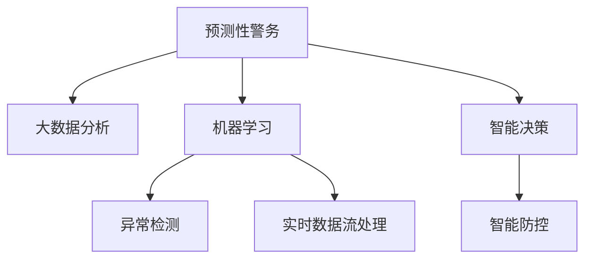

                 

# 未来的智能安防：2050年的预测性警务与智能防控

## 1. 背景介绍

在21世纪的技术浪潮中，智能安防系统已经成为保障社会安全和秩序的重要基础设施。随着物联网、云计算、大数据、人工智能等技术的飞速发展，智能安防系统的智能化水平和应用场景正在迅速扩展。未来，智能安防有望从简单的视频监控、入侵报警等传统功能，向预测性警务、智能防控等高级应用方向演进。

### 1.1 问题由来
现代智能安防系统主要依赖于视频监控、入侵报警、门禁系统等传统设备。这些系统虽然能够提供一定程度的监控和报警功能，但大多属于被动反应，难以对潜在的安全威胁进行预判和预防。预测性警务和智能防控技术的应用，将使智能安防系统具备预测潜在威胁、自主决策应对的能力，大幅提升社会安全的整体水平。

### 1.2 问题核心关键点
预测性警务和智能防控的核心在于构建一个基于大数据和人工智能的智能决策系统。系统通过实时监控、数据分析、模型预测等手段，预判潜在的犯罪、安全隐患，并采取相应的防控措施，以减少安全事件的发生。关键技术包括但不限于：

1. **大数据分析**：从海量监控数据中提取有价值的信息，分析异常行为模式，识别潜在威胁。
2. **机器学习**：通过监督学习、无监督学习等算法，构建威胁检测、行为预测等模型。
3. **自然语言处理(NLP)**：处理报警信息、社交媒体数据，识别威胁和异常。
4. **计算机视觉**：实时分析视频图像，识别可疑行为、物体，提高预警准确性。
5. **智能决策**：结合多源数据，综合分析，自动决策并执行防控措施。

## 2. 核心概念与联系

### 2.1 核心概念概述

为更好地理解预测性警务和智能防控的实现原理和架构，本节将介绍几个密切相关的核心概念：

- **预测性警务(Predictive Policing)**：通过大数据分析、机器学习等技术，预测犯罪行为和威胁，提前部署警力，防范犯罪行为的发生。
- **智能防控(Intelligent Security Control)**：结合视频监控、行为分析、情境感知等技术，实时监测并响应安全事件，自动执行防控措施。
- **实时数据流处理**：对实时产生的大量数据进行快速处理，以保证系统的响应速度和决策准确性。
- **异常检测**：从正常行为中识别出异常行为，及时预警，防止潜在威胁的发生。
- **模型训练与优化**：通过不断的训练和优化，提升模型的准确性和泛化能力，确保系统的有效运行。

这些核心概念之间的逻辑关系可以通过以下Mermaid流程图来展示：



这个流程图展示了预测性警务和智能防控的关键技术环节，以及它们之间的相互作用。

## 3. 核心算法原理 & 具体操作步骤
### 3.1 算法原理概述

预测性警务和智能防控技术的核心算法原理主要基于以下三个方面：

1. **大数据分析**：从实时监控数据、历史报警数据、社交媒体数据等多源数据中提取特征，构建威胁模型，识别异常行为。
2. **机器学习**：利用监督学习、无监督学习、强化学习等算法，构建威胁检测、行为预测、事件响应等模型。
3. **智能决策**：结合多源数据和模型预测结果，综合分析，自动决策并执行防控措施。

### 3.2 算法步骤详解

预测性警务和智能防控的实施步骤通常包括以下几个关键环节：

1. **数据采集与预处理**：收集和整合来自监控系统、传感器、社交媒体等渠道的实时数据，进行清洗、归一化等预处理。
2. **特征提取与建模**：从处理后的数据中提取特征，使用机器学习模型进行训练和预测，构建威胁检测、行为预测等模型。
3. **实时监控与异常检测**：对实时监控数据进行分析，使用异常检测算法实时识别潜在威胁，及时预警。
4. **智能决策与响应**：根据预测结果，综合多源数据，自动决策并执行防控措施，如调动警力、调整监控设备、通知相关人员等。
5. **模型评估与优化**：定期对模型进行评估和优化，以提高其准确性和泛化能力。

### 3.3 算法优缺点

预测性警务和智能防控技术具有以下优点：

1. **提前预警与预防**：通过预测和预警，有效降低安全事件的发生概率。
2. **资源优化**：智能决策系统能够自动调度资源，避免人力的浪费。
3. **多源融合**：结合多源数据，提升预警和应对的准确性和效率。
4. **自动化与智能化**：减少人为干预，提高安全管理的效率和一致性。

同时，该技术也存在一些局限性：

1. **数据质量依赖性**：模型的准确性和效果很大程度上取决于数据的质量和完整性。
2. **隐私和安全问题**：系统需要收集和处理大量个人数据，可能引发隐私和安全问题。
3. **模型复杂性**：构建和维护复杂的多源数据融合和异常检测模型，需要大量的技术投入。
4. **成本较高**：初始建设成本和维护成本较高，特别是对于中小型安防系统。

### 3.4 算法应用领域

预测性警务和智能防控技术在多个领域有着广泛的应用，例如：

- **公共安全**：预测和预防犯罪行为，提升社区安全。
- **机场安全**：实时监控和识别可疑人员，防范恐怖袭击。
- **大型活动安保**：预测和应对突发事件，保障活动秩序。
- **学校安全**：识别和应对校园暴力事件，保障学生安全。
- **企业安防**：监控和预防内部和外部安全隐患，保护企业资产。

## 4. 数学模型和公式 & 详细讲解 & 举例说明

### 4.1 数学模型构建

预测性警务和智能防控的数学模型构建通常包括以下几个关键部分：

- **特征工程**：从原始数据中提取有意义的特征，构建特征向量。
- **模型选择与训练**：选择合适的机器学习模型，并使用历史数据进行训练。
- **评估与优化**：使用验证数据集评估模型性能，并根据评估结果进行模型优化。

### 4.2 公式推导过程

以威胁检测模型为例，其基本思路是通过监督学习算法构建一个分类器，将正常行为标记为“正常”，将异常行为标记为“异常”。具体推导如下：

1. **特征提取**：设原始数据为 $X = \{x_1, x_2, ..., x_n\}$，提取特征后得到特征向量 $X' = \{x_1', x_2', ..., x_n'\}$。
2. **模型训练**：使用监督学习算法训练分类器 $f$，使得 $f(X') = \{0, 1\}$，其中 $0$ 表示正常，$1$ 表示异常。
3. **评估与优化**：使用验证集评估模型性能，记准确率为 $P$，召回率为 $R$，F1分数为 $F1 = 2 \times \frac{P \times R}{P + R}$。

### 4.3 案例分析与讲解

假设我们有一个公共场所的视频监控数据集，目标是检测可疑人员的出现。首先，从视频中提取关键特征，如行人体型、速度、方向等，构建特征向量 $X'$。然后，使用随机森林、支持向量机等分类算法进行训练，得到一个威胁检测模型 $f(X') = \{0, 1\}$。最后，使用验证集评估模型性能，优化特征选择和算法参数，确保模型的高准确性和泛化能力。

## 5. 项目实践：代码实例和详细解释说明
### 5.1 开发环境搭建

在进行预测性警务和智能防控项目实践前，我们需要准备好开发环境。以下是使用Python进行TensorFlow和PyTorch开发的常见环境配置流程：

1. 安装Anaconda：从官网下载并安装Anaconda，用于创建独立的Python环境。
2. 创建并激活虚拟环境：
```bash
conda create -n pytorch-env python=3.8 
conda activate pytorch-env
```

3. 安装TensorFlow和PyTorch：
```bash
pip install tensorflow
pip install torch torchvision torchaudio cudatoolkit=11.1 -c pytorch -c conda-forge
```

4. 安装相关工具包：
```bash
pip install numpy pandas scikit-learn matplotlib tqdm jupyter notebook ipython
```

完成上述步骤后，即可在`pytorch-env`环境中开始项目实践。

### 5.2 源代码详细实现

这里以一个简单的视频监控威胁检测项目为例，给出使用TensorFlow和PyTorch进行预测性警务的代码实现。

```python
import tensorflow as tf
import tensorflow_datasets as tfds
import numpy as np
from tensorflow.keras import layers, models
from sklearn.model_selection import train_test_split

# 加载数据集
train_data, test_data = tfds.load('video_labels', split=['train', 'test'], with_info=True, as_supervised=True)

# 定义特征工程函数
def preprocess的视频流预处理
```

