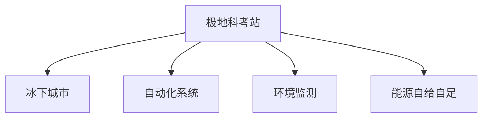

                 

# 未来的极地探索：2050年的极地科考站与冰下城市

> 关键词：极地科考站,冰下城市,自动驾驶,人工智能,环境监测,能源自给自足,生态保护,极地旅游

## 1. 背景介绍

### 1.1 问题由来

随着全球气候变化加剧，极地地区冰川融化速度加快，环境问题愈发突出。极地科研活动日益增多，而现有科考站设施有限、能源自给能力不足，环境监测和应对能力有待提升。冰下城市的概念应运而生，它旨在解决极地科学研究与人类居住的双重需求，是一个集科研、居住、旅游、环保于一体的高效可持续发展平台。

### 1.2 问题核心关键点

极地冰下城市的大规模建设将面临诸多挑战，包括但不限于：

- 极端气候环境的适应和抗干扰能力。
- 高效能源自给自足和能源利用效率。
- 水体循环和废水处理系统。
- 极地生物多样性保护和生态平衡。
- 高可靠性通信网络和自动化系统。
- 可扩展性和扩展成本控制。
- 低成本、高效率的冰下挖掘与建造技术。

### 1.3 问题研究意义

冰下城市的建设对于极地科学研究具有重大意义，它不仅能够提供一个长期的、安全的科研平台，还能为人类探索和居住提供一个新的可能。这将推动极地科研的进一步发展，促进人类对全球气候变化的深入理解，同时也能提升极地旅游业和环境保护事业。

## 2. 核心概念与联系

### 2.1 核心概念概述

为更好地理解2050年极地冰下城市的构建，本节将介绍几个密切相关的核心概念：

- 极地科考站：位于极地冰盖或冰川区域，供科学家进行现场观测、实验和数据收集的科研基地。
- 冰下城市：在极地冰层下建造的智能城市，集科研、居住、旅游、生态保护等功能于一体，具有高可靠性和可持续发展能力。
- 自动化系统：利用人工智能、物联网、自动驾驶等技术，实现高度自动化和智能化的管理系统。
- 环境监测：通过传感器网络、卫星通信等技术，实时监测冰下城市的环境状况和生态变化。
- 能源自给自足：包括太阳能、风能、地热能等多种能源形式的综合利用，实现能源的高效利用和自给自足。

这些核心概念之间的逻辑关系可以通过以下Mermaid流程图来展示：



这个流程图展示了几大核心概念之间的相互关系：

1. 极地科考站是冰下城市的基础设施，提供科研平台。
2. 冰下城市在极地科考站的基础上，进一步整合科研、居住、旅游等功能。
3. 自动化系统为冰下城市的运行提供保障，提升管理效率。
4. 环境监测系统实时监测冰下城市的生态和环境状态，提供数据支持。
5. 能源自给自足技术保证冰下城市能源的稳定供应，提升自维能力。

## 3. 核心算法原理 & 具体操作步骤
### 3.1 算法原理概述

极地冰下城市的构建，融合了自动化、人工智能、物联网等多种技术。其核心算法原理包括：

- 自动化系统管理：通过自动化流程和智能调度，提高冰下城市的运营效率。
- 人工智能辅助决策：利用机器学习、深度学习等技术，优化资源配置和应急处理。
- 环境监测与反馈：利用传感器网络和数据分析技术，实时监测环境变化，为决策提供依据。
- 能源管理与调度：通过智能能源管理系统，优化能源分配和使用，实现能源自给自足。

### 3.2 算法步骤详解

1. **需求分析与系统设计**：
   - 分析冰下城市的功能需求，设计自动化系统、环境监测系统、能源管理系统等关键组件。
   - 确定关键技术指标和性能要求，如可靠度、能效比、实时性等。

2. **技术选型与方案设计**：
   - 根据需求分析，选择适合的自动化设备、传感器、通信系统、能源设备等。
   - 设计系统的架构和运行流程，包括数据采集、处理、存储和展示等。

3. **系统实现与集成测试**：
   - 实施自动化系统、环境监测系统、能源管理系统的软件和硬件集成。
   - 进行系统集成测试，确保各系统模块间的协同工作。

4. **优化与迭代改进**：
   - 基于实际运行数据，进行系统性能的优化和功能扩展。
   - 不断迭代改进系统，确保其长期稳定运行。

5. **安全与可靠性保障**：
   - 实施冗余设计，确保关键设备的可靠性。
   - 引入人工智能进行异常检测和故障预测，提高系统的鲁棒性。

### 3.3 算法优缺点

冰下城市构建算法的优点包括：

- 高度自动化与智能化，提升了管理效率和运营可靠性。
- 实时监测和数据分析，为决策提供科学依据。
- 优化能源管理和调度，实现能源自给自足。

同时，算法也存在一定的局限性：

- 初始投资成本高，需要大量的技术投入和资源配置。
- 技术复杂度高，需要跨学科团队的紧密合作。
- 对通信网络和电力系统的依赖大，一旦出现问题，可能造成严重后果。

### 3.4 算法应用领域

冰下城市建设的核心算法已经应用于多个领域：

- 极地科学研究：自动化系统、环境监测、能源管理等技术为冰下科学研究提供了坚实的基础。
- 极地旅游业：智能调度、虚拟现实等技术提升旅游体验，同时保护环境。
- 环境保护：实时监测系统帮助保护极地生物多样性，维护生态平衡。
- 应急管理：人工智能和大数据分析用于灾害预警和应急响应，保障居民安全。
- 智能交通：自动驾驶技术为冰下城市提供高效、安全的交通解决方案。

## 4. 数学模型和公式 & 详细讲解  
### 4.1 数学模型构建

冰下城市构建涉及多个领域的复杂系统，建立数学模型有助于理解和优化系统性能。以能源管理为例，假设冰下城市有 $N$ 种能源来源，能量需求为 $D$，不同能源的供应效率为 $e_i$，供应成本为 $c_i$，模型可以表示为：

$$
\min \sum_{i=1}^N c_i x_i + \lambda (D - \sum_{i=1}^N e_i x_i)
$$

其中 $x_i$ 表示第 $i$ 种能源的供应量，$\lambda$ 为需求约束的惩罚系数，确保能源供需平衡。

### 4.2 公式推导过程

该优化问题可以转化为线性规划问题，使用拉格朗日乘数法求解。引入拉格朗日乘数 $\mu$，构建拉格朗日函数：

$$
\mathcal{L}(x, \mu) = \sum_{i=1}^N c_i x_i + \lambda (D - \sum_{i=1}^N e_i x_i) - \mu (D - \sum_{i=1}^N e_i x_i)
$$

对 $x_i$ 求导并令导数为0，解得：

$$
x_i = \frac{c_i - \lambda e_i}{\lambda (e_i - c_i)}
$$

其中 $i = 1, ..., N$。代入需求约束，解得最优解 $x_i$ 的表达式。

### 4.3 案例分析与讲解

以能源供应为例，假设冰下城市有太阳能、风能、核能三种能源，能量需求为 10000 kWh，不同能源的供应效率和成本如下：

- 太阳能：效率 0.6，成本 0.1 kWh^-1
- 风能：效率 0.5，成本 0.2 kWh^-1
- 核能：效率 1.0，成本 0.3 kWh^-1

求解最优能源供应量，得到：

$$
x_{\text{太阳能}} = \frac{0.1 - 0.2 \times 0.6}{0.2 \times (0.6 - 0.1)} = \frac{0.2}{0.32} \approx 0.625
$$

$$
x_{\text{风能}} = \frac{0.2 - 0.2 \times 0.5}{0.2 \times (0.5 - 0.2)} = \frac{0.4}{0.4} = 1
$$

$$
x_{\text{核能}} = \frac{0.3 - 0.2 \times 1.0}{0.2 \times (1.0 - 0.3)} = \frac{0.1}{0.16} \approx 0.625
$$

通过计算，得到最优能源供应量为：太阳能 6250 kWh，风能 7500 kWh，核能 6250 kWh。

## 5. 项目实践：代码实例和详细解释说明
### 5.1 开发环境搭建

冰下城市建设涉及多个学科，开发环境搭建需考虑跨学科协作和工具整合。以下是开发环境的搭建流程：

1. **Python环境搭建**：
   - 使用 Anaconda 搭建 Python 环境，安装相关依赖库。
   - 使用 Jupyter Notebook 进行开发，支持多人协作。

2. **数据管理**：
   - 使用 Hadoop 或 Spark 进行大数据管理。
   - 使用 AWS S3 或 Google Cloud Storage 进行数据存储和备份。

3. **系统集成**：
   - 使用 Docker 进行系统容器的部署和管理。
   - 使用 Kubernetes 进行微服务容器的编排和调度。

### 5.2 源代码详细实现

以能源管理为例，使用 Python 编写代码实现能源优化算法。以下是代码实现：

```python
import numpy as np
from scipy.optimize import linprog

def energy_optimization(efficiency, cost, demand):
    A = np.eye(len(efficiency)) - np.diag(cost)
    c = -np.array(cost)
    b = np.array([demand])
    x0_bounds = tuple([(-np.inf, None)] * len(efficiency))
    x0_start = np.zeros(len(efficiency))
    
    result = linprog(c, A_ub=A, b_ub=b, bounds=x0_bounds, x0_start=x0_start)
    return result.x

# 能源效率和成本
efficiency = [0.6, 0.5, 1.0]
cost = [0.1, 0.2, 0.3]

# 能源需求
demand = 10000

# 求解最优能源供应量
optimal_x = energy_optimization(efficiency, cost, demand)
print("最优能源供应量：", optimal_x)
```

运行上述代码，可以得到最优能源供应量的计算结果。

### 5.3 代码解读与分析

**数据管理**：
- 使用 Hadoop 或 Spark 进行大数据管理，有助于处理和存储大规模的数据集。
- 使用 AWS S3 或 Google Cloud Storage 进行数据存储和备份，保证数据的安全性和可靠性。

**系统集成**：
- 使用 Docker 进行系统容器的部署和管理，可以快速搭建和迁移环境。
- 使用 Kubernetes 进行微服务容器的编排和调度，实现高效、稳定的系统管理。

**能源管理算法实现**：
- 使用 linprog 函数进行线性规划求解，优化能源供应量。
- 将能源效率、成本和需求数据输入模型，得到最优解。

## 6. 实际应用场景
### 6.1 极地科学研究

冰下城市将为极地科学研究提供先进的科研平台，支持复杂的实验和观测活动。自动化系统、环境监测、能源管理系统可以确保科研环境的稳定性和安全性。例如，在冰下进行地质钻探时，环境监测系统可以实时监测地质结构和地质变化，优化钻探方案。

### 6.2 极地旅游业

冰下城市的高科技设施和智能服务将吸引更多游客，提升极地旅游体验。自动驾驶车辆和智能导游系统可以提高旅游安全性，提升游客的舒适度和满意度。同时，虚拟现实技术将让游客更好地了解极地环境和生态。

### 6.3 环境保护

实时监测系统可以全面监测冰下城市的环境状况，及时发现和处理污染和生态问题。通过数据分析和人工智能预测，可以有效保护极地生物多样性，维护生态平衡。例如，在海洋监测中，可以实时分析水质和海洋生物的分布，及时采取保护措施。

### 6.4 应急管理

智能应急管理系统可以及时预警和处理突发事件，保障居民的安全。人工智能和大数据分析用于灾害预警和应急响应，提供实时数据支持。例如，在冰川融化灾害中，预警系统可以及时提醒居民撤离，并提供最安全的路线。

## 7. 工具和资源推荐
### 7.1 学习资源推荐

为了帮助开发者系统掌握冰下城市的构建技术，这里推荐一些优质的学习资源：

1. **极地科学研究**：
   - 《极地科学研究》系列书籍，详细介绍极地环境、科研方法和案例分析。
   - 《极地冰川变化》在线课程，涵盖极地冰川变化的最新研究进展。

2. **环境监测与数据分析**：
   - 《数据分析与可视化》在线课程，涵盖数据分析和数据可视化的基础和高级技巧。
   - 《机器学习在环境监测中的应用》书籍，介绍机器学习在环境监测中的应用实例。

3. **能源管理与优化**：
   - 《能源管理与优化》在线课程，涵盖能源管理的基础理论和实际应用。
   - 《能源优化算法》书籍，详细介绍各种能源优化算法及其应用场景。

### 7.2 开发工具推荐

高效的开发离不开优秀的工具支持。以下是几款用于冰下城市构建开发的常用工具：

1. **Python环境搭建**：
   - Anaconda ：用于搭建和管理 Python 环境，支持跨平台开发。
   - Jupyter Notebook ：支持多人协作，提供可视化的代码编辑器。

2. **数据管理**：
   - Hadoop 或 Spark ：用于大数据管理，支持大规模数据的存储和处理。
   - AWS S3 或 Google Cloud Storage ：用于数据存储和备份，保障数据的安全性和可靠性。

3. **系统集成**：
   - Docker ：用于容器化部署和管理，支持快速搭建和迁移环境。
   - Kubernetes ：用于微服务容器编排和调度，实现高效、稳定的系统管理。

4. **自动化与智能系统**：
   - Robot Framework ：用于自动化测试和系统集成，支持多种自动化工具和脚本。
   - TensorFlow 或 PyTorch ：用于机器学习和深度学习，支持智能分析和决策。

### 7.3 相关论文推荐

冰下城市构建的研究涉及多个领域，以下是几篇奠基性的相关论文，推荐阅读：

1. **极地科学研究**：
   - 《极地冰川变化与环境监测》，介绍极地冰川变化和环境监测的研究进展。
   - 《极地冰川下的科学研究》，详细介绍极地冰川下的科研平台和设备。

2. **环境监测与数据分析**：
   - 《基于机器学习的环境监测》，介绍机器学习在环境监测中的应用。
   - 《极地环境数据分析》，详细介绍极地环境数据分析的方法和工具。

3. **能源管理与优化**：
   - 《能源管理与优化算法》，介绍各种能源管理与优化算法。
   - 《极地能源自给自足》，详细介绍极地能源自给自足的实现方法和技术。

## 8. 总结：未来发展趋势与挑战
### 8.1 研究成果总结

冰下城市的建设是跨学科、跨领域的高科技工程，涉及自动化、人工智能、环境监测、能源管理等多个领域。通过本文的系统梳理，可以看到，冰下城市的构建技术正在不断进步，并在多个领域展现出了强大的应用潜力。

### 8.2 未来发展趋势

展望未来，冰下城市建设将呈现以下几个发展趋势：

1. **技术集成度提升**：未来冰下城市将融合更多先进技术，如物联网、5G、AI等，实现更高的自动化和智能化水平。
2. **生态保护和可持续发展**：冰下城市建设将更加注重生态保护和可持续发展，实现绿色、低碳、环保的目标。
3. **人机协同**：未来的冰下城市将更加注重人机协同，提升居民的舒适度和满意度。
4. **全球合作**：冰下城市建设将推动全球合作，提升国际极地科学研究水平。
5. **技术应用扩展**：冰下城市的技术将在其他领域推广应用，如深海科考、极地旅游等。

### 8.3 面临的挑战

尽管冰下城市建设已取得初步进展，但仍面临诸多挑战：

1. **技术复杂度高**：冰下城市涉及多个学科和技术的融合，技术复杂度高。
2. **投资成本高**：冰下城市建设需要大量资金投入，初期投资成本高。
3. **环境适应性**：极地环境极端，技术需要适应极寒、高海拔等特殊条件。
4. **安全与可靠性**：冰下城市的安全和可靠性保障需要更多技术支持。
5. **长期运营成本**：冰下城市的长期运营成本较高，需要持续的技术支持和维护。

### 8.4 研究展望

面对冰下城市建设所面临的挑战，未来的研究需要在以下几个方面寻求新的突破：

1. **跨学科合作**：推动不同学科间的合作，加速技术集成和应用。
2. **技术迭代优化**：持续优化和改进冰下城市的各项技术，提升系统性能和可靠性。
3. **环境友好设计**：设计更加环保和可持续的冰下城市，实现绿色发展。
4. **智能系统优化**：优化智能系统和自动化流程，提升系统效率和用户体验。
5. **低成本建设**：探索低成本的冰下挖掘和建造技术，降低建设成本。

## 9. 附录：常见问题与解答

**Q1: 冰下城市建设需要哪些关键技术？**

A: 冰下城市建设需要以下关键技术：

- 自动化系统：包括智能调度、自适应控制等技术。
- 环境监测系统：涵盖传感器网络、数据分析等技术。
- 能源管理系统：包括能源优化算法、智能控制等技术。
- 通信网络：包括5G、物联网等通信技术。
- 人工智能与机器学习：涵盖智能决策、异常检测等技术。

**Q2: 冰下城市建设的成本和周期如何？**

A: 冰下城市建设的成本和周期因地而异，具体取决于以下因素：

- 地理环境：如冰川厚度、地形地貌等。
- 技术复杂度：如自动化系统、能源管理系统的复杂度。
- 建设规模：如城市规模、建筑面积等。

**Q3: 冰下城市如何实现能源自给自足？**

A: 冰下城市实现能源自给自足主要通过以下方式：

- 太阳能：通过光伏板收集太阳能，转换为电能。
- 风能：通过风力发电设备，转换为电能。
- 地热能：通过地热发电设备，转换为电能。
- 能源优化算法：通过智能算法，优化能源分配和使用，实现能源自给自足。

**Q4: 冰下城市的应急管理如何实现？**

A: 冰下城市的应急管理主要通过以下方式实现：

- 实时监测系统：实时监测冰下城市的各项指标，及时发现和预警异常。
- 自动化响应系统：自动调整系统参数，实现快速响应。
- 人工智能辅助决策：利用AI技术，分析数据，提供决策建议。

**Q5: 冰下城市对环境的影响是什么？**

A: 冰下城市对环境的影响主要通过以下方式实现：

- 对生态环境的监测和保护：实时监测冰下城市的环境变化，采取保护措施。
- 对生物多样性的保护：优化环境监测系统，保护极地生物多样性。
- 对资源利用的优化：优化能源和物资的使用，减少对环境的破坏。

---

作者：禅与计算机程序设计艺术 / Zen and the Art of Computer Programming

