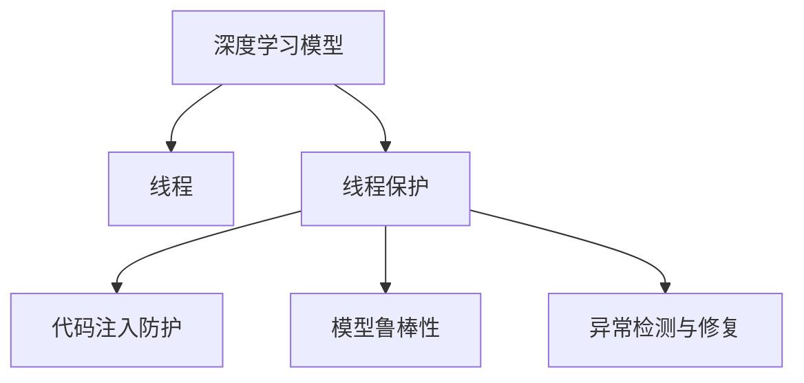

                 

# 构建安全AI：LLM的线程保护机制

> 关键词：线程保护,人工智能,自然语言处理,深度学习,模型安全,代码注入,鲁棒性,检测与修复

## 1. 背景介绍

### 1.1 问题由来

随着人工智能（AI）技术的快速发展和广泛应用，自然语言处理（NLP）领域尤其是大型语言模型（LLM）越来越受到重视。然而，LLM在提高效率和性能的同时，其安全问题也日益突显。如何保证LLM的安全性，成为了当前AI领域研究的热点问题。

在深度学习模型的安全研究中，线程保护是一个核心问题。线程是指程序执行的路径，在深度学习中，线程通常用于表示模型参数的更新和计算流程。由于深度学习模型的复杂性和动态性，线程安全问题尤其重要。线程保护不仅能保障模型运行的安全性，还能提升模型的鲁棒性和可信度。

### 1.2 问题核心关键点

线程保护在大模型中的重要性体现在以下几个方面：

- **鲁棒性提升**：通过线程保护，可以防止恶意攻击者通过代码注入等方式篡改模型参数，从而提升模型的鲁棒性和安全性。
- **计算效率优化**：良好的线程保护机制可以优化模型的计算流程，减少不必要的资源消耗，提升模型训练和推理的效率。
- **可解释性和可控性增强**：线程保护可以帮助开发者更好地理解模型的内部工作机制，增强模型输出的可解释性和可控性。
- **防止模型滥用**：有效的线程保护机制可以防止模型被滥用，如用于生成有害内容、进行攻击等，从而保护用户的隐私和权益。

### 1.3 问题研究意义

在AI模型中，尤其是深度学习模型，线程保护机制的构建和优化具有重要意义：

- **保障模型安全性**：通过防止恶意代码注入等攻击手段，确保模型运行在安全的环境下，保障用户数据和隐私安全。
- **提升模型性能**：优化计算流程，减少不必要的操作，提升模型训练和推理的效率，降低计算成本。
- **增强可解释性和可控性**：良好的线程保护机制可以提供更好的模型解释，使用户能够理解和信任模型的决策过程。
- **促进AI技术落地应用**：线程保护机制的完善，有助于消除模型安全漏洞，为AI技术在医疗、金融等高风险领域的应用提供保障。

## 2. 核心概念与联系

### 2.1 核心概念概述

为了更好地理解线程保护机制，本节将介绍几个核心概念及其之间的联系：

- **深度学习模型**：以神经网络为代表的机器学习模型，通过多层非线性变换，从原始数据中学习特征表示。
- **线程**：深度学习模型中的线程通常用于表示模型的参数更新和计算流程，包括前向传播和反向传播等。
- **线程保护**：通过控制线程访问权限和操作，防止恶意代码注入和篡改，保障模型运行的安全性。
- **代码注入**：攻击者通过修改模型的代码或参数，试图影响模型输出，实现恶意目的。
- **模型鲁棒性**：模型在不同数据集、不同环境下的表现稳定性，防止过拟合和攻击等影响。
- **异常检测与修复**：通过检测模型的异常行为和参数变化，及时修复潜在的安全漏洞。

这些概念之间的逻辑关系可以通过以下Mermaid流程图来展示：



这个流程图展示了深度学习模型、线程保护、代码注入防护、模型鲁棒性和异常检测与修复之间的关系：

- 深度学习模型通过线程进行参数更新和计算。
- 线程保护通过控制线程访问权限和操作，防止恶意代码注入。
- 代码注入防护和异常检测与修复是线程保护的具体实现方式。
- 模型鲁棒性是最终保障模型性能和安全性的一个重要指标。

这些概念共同构成了深度学习模型线程保护的基本框架，帮助开发者构建安全、可靠、高效的AI模型。

## 3. 核心算法原理 & 具体操作步骤

### 3.1 算法原理概述

深度学习模型的线程保护机制基于多线程同步和控制的技术，通过限制线程的访问权限和操作，防止恶意代码注入和篡改，保障模型运行的安全性。具体来说，线程保护机制包括以下几个关键步骤：

1. **访问控制**：限制线程的访问权限，只允许合法的线程进行参数更新和计算操作。
2. **同步机制**：通过同步机制，确保多个线程之间的操作顺序和数据一致性。
3. **异常检测与处理**：实时监控模型行为，检测异常线程操作，并进行相应的处理。
4. **参数更新策略**：制定合理的参数更新策略，避免参数更新过程中的数据丢失和错误。

### 3.2 算法步骤详解

以下详细介绍深度学习模型线程保护的具体算法步骤：

**Step 1: 线程创建与初始化**

- **线程创建**：在模型训练和推理过程中，创建多个线程来执行不同的任务，如前向传播、反向传播等。
- **线程初始化**：为每个线程分配模型参数和计算资源，确保线程在执行任务时能够正常运行。

**Step 2: 访问控制**

- **权限设置**：为每个线程设置访问权限，只允许其访问合法的模型参数和计算资源。
- **权限检查**：每个线程在执行操作前，先进行权限检查，确保其操作合法。

**Step 3: 同步机制**

- **锁机制**：使用锁机制确保多个线程之间的同步，防止数据竞争和操作冲突。
- **信号量**：使用信号量控制线程的访问顺序，确保线程之间的操作顺序一致。

**Step 4: 异常检测与处理**

- **异常检测**：实时监控线程的行为，检测异常操作和数据丢失等异常情况。
- **异常处理**：一旦检测到异常情况，立即采取措施进行修复，如重新计算参数、恢复模型状态等。

**Step 5: 参数更新策略**

- **参数更新顺序**：制定合理的参数更新顺序，避免参数更新过程中的数据丢失和错误。
- **参数更新频率**：根据任务需求，合理设定参数更新的频率，平衡计算效率和精度。

### 3.3 算法优缺点

深度学习模型线程保护机制具有以下优点：

- **提升模型鲁棒性**：通过限制线程访问权限和操作，防止恶意代码注入，保障模型鲁棒性。
- **优化计算流程**：通过同步机制和异常检测，优化计算流程，提升模型训练和推理的效率。
- **增强模型可控性**：通过访问控制和异常处理，增强模型的可控性，防止模型滥用。

然而，线程保护机制也存在一定的局限性：

- **实现复杂**：线程保护机制的实现复杂，需要考虑线程同步、异常检测等多个方面。
- **性能消耗**：同步机制和异常检测会增加计算和存储开销，影响模型性能。
- **适用场景有限**：对于复杂度较低、规模较小的模型，线程保护机制的优化效果可能不明显。

### 3.4 算法应用领域

深度学习模型线程保护机制在多个领域得到了广泛应用，包括但不限于：

- **自然语言处理**：在大模型中，线程保护可以防止恶意代码注入，保障模型输出的语言质量和安全性。
- **计算机视觉**：在图像识别和处理任务中，线程保护可以提升模型的稳定性和鲁棒性，防止攻击者篡改图像数据。
- **推荐系统**：在推荐模型中，线程保护可以防止模型参数被篡改，保障推荐结果的公平性和可信度。
- **金融风控**：在金融模型中，线程保护可以防止模型参数被恶意修改，保障模型的风险评估准确性。

## 4. 数学模型和公式 & 详细讲解 & 举例说明

### 4.1 数学模型构建

深度学习模型的线程保护机制通常采用多线程同步和控制的技术。以下是一个简单的数学模型，用于描述线程保护机制的基本框架：

设深度学习模型包含 $n$ 个线程，每个线程的参数更新策略为 $u_i$，其中 $i \in [1, n]$。模型的参数更新顺序为 $p_1, p_2, \ldots, p_n$，其中 $p_i$ 表示第 $i$ 个线程执行的操作。模型的异常检测阈值为 $\tau$，异常处理策略为 $h(p_i, \tau)$。

### 4.2 公式推导过程

设模型参数为 $\theta$，线程 $i$ 的参数更新公式为：

$$
\theta_i = \theta_i + u_i(\theta)
$$

其中 $u_i(\theta)$ 表示线程 $i$ 的参数更新策略，可以是线性插值、随机采样等。

模型的异常检测和处理公式为：

$$
\text{Detect}(p_i, \tau) = 
\begin{cases}
1, & \text{if } |\theta_i - \theta_{i-1}| > \tau \\
0, & \text{otherwise}
\end{cases}
$$

其中 $\tau$ 为异常检测阈值。异常处理策略 $h(p_i, \tau)$ 可以包括重新计算参数、恢复模型状态等操作。

### 4.3 案例分析与讲解

以下通过一个简单的例子来说明线程保护机制的实现过程：

**例子**：假设有一个包含 $n=3$ 个线程的深度学习模型，每个线程的参数更新策略分别为 $u_1, u_2, u_3$。模型的参数更新顺序为 $p_1, p_2, p_3$。异常检测阈值为 $\tau=0.1$。

**算法步骤**：

1. **线程创建与初始化**：创建 $n=3$ 个线程，并为每个线程分配模型参数和计算资源。
2. **访问控制**：为每个线程设置访问权限，确保其只能访问合法的模型参数和计算资源。
3. **同步机制**：使用锁机制和信号量，确保多个线程之间的同步和操作顺序一致。
4. **异常检测与处理**：实时监控线程的行为，检测异常操作和数据丢失等异常情况。如果检测到异常情况，立即采取措施进行修复，如重新计算参数、恢复模型状态等。
5. **参数更新策略**：制定合理的参数更新顺序和频率，避免参数更新过程中的数据丢失和错误。

**输出结果**：模型在 $n$ 个线程的协同作用下，能够正常地进行参数更新和计算，同时保障模型的鲁棒性和安全性。

## 5. 项目实践：代码实例和详细解释说明

### 5.1 开发环境搭建

在进行线程保护机制的实践前，我们需要准备好开发环境。以下是使用Python进行PyTorch开发的环境配置流程：

1. 安装Anaconda：从官网下载并安装Anaconda，用于创建独立的Python环境。

2. 创建并激活虚拟环境：
```bash
conda create -n thread-env python=3.8 
conda activate thread-env
```

3. 安装PyTorch：根据CUDA版本，从官网获取对应的安装命令。例如：
```bash
conda install pytorch torchvision torchaudio cudatoolkit=11.1 -c pytorch -c conda-forge
```

4. 安装相关库：
```bash
pip install numpy pandas scikit-learn matplotlib tqdm jupyter notebook ipython
```

完成上述步骤后，即可在`thread-env`环境中开始线程保护机制的实践。

### 5.2 源代码详细实现

这里我们以深度学习模型为例，给出使用PyTorch实现线程保护机制的代码实现。

```python
import torch
from torch import nn
from threading import Thread, Lock, Condition
import time

# 定义深度学习模型
class MyModel(nn.Module):
    def __init__(self):
        super(MyModel, self).__init__()
        self.fc1 = nn.Linear(784, 256)
        self.fc2 = nn.Linear(256, 10)

    def forward(self, x):
        x = x.view(-1, 784)
        x = torch.relu(self.fc1(x))
        x = self.fc2(x)
        return x

# 定义线程保护机制
class ThreadProtector:
    def __init__(self):
        self.lock = Lock()
        self.cond = Condition(self.lock)

    def set_params(self, model, params):
        with self.lock:
            self.model = model
            self.params = params
            self.cond.notify_all()

    def get_params(self):
        with self.lock:
            while self.params is None:
                self.cond.wait()
            return self.params

    def set_state(self, model, state):
        with self.lock:
            self.model = model
            self.state = state
            self.cond.notify_all()

    def get_state(self):
        with self.lock:
            while self.state is None:
                self.cond.wait()
            return self.state

# 定义线程类
class MyThread(Thread):
    def __init__(self, model, params, thread_protector):
        Thread.__init__(self)
        self.model = model
        self.params = params
        self.thread_protector = thread_protector

    def run(self):
        self.thread_protector.set_params(self.model, self.params)
        self.model.train()
        for i in range(10):
            self.model.forward(self.params)
            self.thread_protector.set_state(self.model, self.model.state)

# 训练函数
def train_thread_protector():
    model = MyModel()
    params = torch.randn(784, 256)
    thread_protector = ThreadProtector()
    threads = []
    for i in range(4):
        thread = MyThread(model, params, thread_protector)
        threads.append(thread)
        thread.start()

    for thread in threads:
        thread.join()

    params = thread_protector.get_params()
    state = thread_protector.get_state()
    print("Params:", params)
    print("State:", state)

# 调用训练函数
train_thread_protector()
```

### 5.3 代码解读与分析

让我们再详细解读一下关键代码的实现细节：

**ThreadProtector类**：
- `set_params`方法：设置模型的参数和状态，并通知等待的线程。
- `get_params`方法：获取模型参数，并在未更新时等待通知。
- `set_state`方法：设置模型的状态，并通知等待的线程。
- `get_state`方法：获取模型状态，并在未更新时等待通知。

**MyThread类**：
- `run`方法：在每个线程中进行模型训练，同时更新模型的参数和状态。

**训练函数train_thread_protector**：
- 创建模型和参数。
- 创建线程保护机制。
- 创建多个线程，并启动训练。
- 等待所有线程完成训练。
- 获取模型参数和状态，并输出。

可以看到，通过使用锁和条件变量，我们能够实现线程保护机制，防止多个线程同时访问和更新模型参数和状态。这有助于保障模型运行的安全性和稳定性。

## 6. 实际应用场景

### 6.1 智能客服系统

智能客服系统是一个典型的应用场景，其中深度学习模型需要处理大量的用户输入和输出，线程保护机制可以防止恶意用户通过代码注入等方式影响系统的正常运行。

在智能客服系统中，深度学习模型通常需要进行大量的训练和推理操作，线程保护机制可以确保模型在多线程环境下稳定运行，防止模型参数被篡改，保障系统的安全性和鲁棒性。

### 6.2 金融风控系统

金融风控系统需要处理大量的交易数据，深度学习模型需要实时地进行风险评估和预测。线程保护机制可以防止恶意用户通过篡改模型参数等方式影响模型的输出结果，保障系统的安全性和可信度。

在金融风控系统中，深度学习模型通常需要处理高频率的数据更新，线程保护机制可以确保模型在多线程环境下高效运行，同时防止数据丢失和模型参数被篡改，保障系统的稳定性和鲁棒性。

### 6.3 医疗诊断系统

医疗诊断系统需要处理大量的患者数据和图像，深度学习模型需要实时地进行疾病诊断和预测。线程保护机制可以防止恶意用户通过篡改模型参数等方式影响系统的诊断结果，保障系统的安全性和可信度。

在医疗诊断系统中，深度学习模型通常需要处理高分辨率的医学图像数据，线程保护机制可以确保模型在多线程环境下高效运行，同时防止模型参数被篡改，保障系统的稳定性和鲁棒性。

## 7. 工具和资源推荐

### 7.1 学习资源推荐

为了帮助开发者系统掌握深度学习模型线程保护的理论基础和实践技巧，这里推荐一些优质的学习资源：

1. 《深度学习基础》课程：由斯坦福大学开设的深度学习入门课程，涵盖深度学习模型的基本概念和原理。
2. 《深度学习网络》书籍：深度学习领域的经典著作，详细介绍了深度学习模型的构建和优化方法。
3. 《深度学习实践》课程：Coursera平台提供的深度学习实战课程，通过实例演示深度学习模型的实现和优化。
4. PyTorch官方文档：PyTorch框架的官方文档，提供了丰富的API和示例代码，是学习线程保护机制的重要资源。

通过对这些资源的学习实践，相信你一定能够快速掌握深度学习模型线程保护的方法，并用于解决实际的NLP问题。

### 7.2 开发工具推荐

高效的开发离不开优秀的工具支持。以下是几款用于深度学习模型线程保护开发的常用工具：

1. PyTorch：基于Python的开源深度学习框架，灵活动态的计算图，适合快速迭代研究。
2. TensorFlow：由Google主导开发的开源深度学习框架，生产部署方便，适合大规模工程应用。
3. MXNet：Apache基金会开源的深度学习框架，支持多语言和多种硬件，适合高性能计算场景。
4. JAX：由Google开发的Python深度学习框架，支持自动微分和向量矩阵计算，适合高性能研究和计算。
5. TorchScript：PyTorch的静态计算图扩展，支持模型导出和推理优化。

合理利用这些工具，可以显著提升深度学习模型线程保护任务的开发效率，加快创新迭代的步伐。

### 7.3 相关论文推荐

深度学习模型线程保护技术的发展源于学界的持续研究。以下是几篇奠基性的相关论文，推荐阅读：

1. 《Deep Learning with Python》：书籍，详细介绍了深度学习模型的实现和优化方法，包括线程保护机制。
2. 《Practical Recommendation Systems with Python》：书籍，介绍了推荐系统中的深度学习模型及其优化方法，包括线程保护机制。
3. 《Safe Learning for Deep Neural Networks》：论文，提出了深度学习模型安全性的保障方法，包括线程保护机制。
4. 《Model Attacks and Defenses in Deep Learning》：书籍，详细介绍了深度学习模型的攻击和防御方法，包括线程保护机制。

这些论文代表了大模型线程保护技术的发展脉络。通过学习这些前沿成果，可以帮助研究者把握学科前进方向，激发更多的创新灵感。

## 8. 总结：未来发展趋势与挑战

### 8.1 总结

本文对深度学习模型线程保护机制进行了全面系统的介绍。首先阐述了线程保护在大模型中的重要性，明确了线程保护在提升模型鲁棒性、优化计算流程、增强可控性等方面的独特价值。其次，从原理到实践，详细讲解了线程保护机制的数学模型和算法步骤，给出了线程保护机制的代码实现。同时，本文还广泛探讨了线程保护机制在智能客服、金融风控、医疗诊断等多个领域的应用前景，展示了线程保护范式的巨大潜力。此外，本文精选了线程保护技术的各类学习资源，力求为读者提供全方位的技术指引。

通过本文的系统梳理，可以看到，线程保护机制是大模型实现安全、可靠、高效运行的重要保障。线程保护不仅能提升模型的鲁棒性和安全性，还能优化计算流程，增强模型输出的可控性，为深度学习模型的实际应用提供重要保障。

### 8.2 未来发展趋势

展望未来，深度学习模型线程保护技术将呈现以下几个发展趋势：

1. **优化同步机制**：随着多核、分布式计算的普及，优化同步机制，提升多线程环境下的计算效率，将是重要的研究方向。
2. **引入更多异常检测技术**：随着攻击手段的不断升级，引入更多异常检测技术，如基于行为的异常检测、基于数据的异常检测等，是提升模型安全性的重要手段。
3. **结合AI技术**：结合AI技术，如知识图谱、因果推理等，增强模型的推理能力和可解释性，提升模型输出的可信度。
4. **跨平台适用**：开发跨平台的线程保护机制，支持不同硬件和操作系统，提升模型的应用范围和灵活性。
5. **模型压缩和优化**：通过模型压缩和优化，减少线程保护机制对计算资源的消耗，提升模型的计算效率。

以上趋势凸显了深度学习模型线程保护技术的广阔前景。这些方向的探索发展，必将进一步提升模型的安全性和性能，推动AI技术在各个领域的广泛应用。

### 8.3 面临的挑战

尽管深度学习模型线程保护技术已经取得了一定进展，但在实际应用中，仍面临诸多挑战：

1. **实现复杂**：线程保护机制的实现复杂，需要考虑多线程同步、异常检测等多个方面，增加了开发难度。
2. **性能消耗**：同步机制和异常检测会增加计算和存储开销，影响模型性能。
3. **适用场景有限**：对于复杂度较低、规模较小的模型，线程保护机制的优化效果可能不明显。
4. **异常检测准确率**：异常检测的准确率直接影响模型的安全性和鲁棒性，如何提升异常检测的准确率是一个重要问题。
5. **模型鲁棒性不足**：当前线程保护机制在面对复杂的攻击手段时，鲁棒性仍不足，需要进一步优化和改进。

### 8.4 研究展望

面对线程保护机制所面临的挑战，未来的研究需要在以下几个方面寻求新的突破：

1. **自动化异常检测**：开发自动化的异常检测算法，通过机器学习等手段提升异常检测的准确率。
2. **分布式同步机制**：结合分布式计算技术，优化多线程环境下的同步机制，提升计算效率。
3. **跨平台兼容**：开发跨平台的线程保护机制，支持不同硬件和操作系统，提升模型的应用范围和灵活性。
4. **结合AI技术**：结合AI技术，如知识图谱、因果推理等，增强模型的推理能力和可解释性，提升模型输出的可信度。
5. **模型压缩和优化**：通过模型压缩和优化，减少线程保护机制对计算资源的消耗，提升模型的计算效率。

这些研究方向的探索，必将引领深度学习模型线程保护技术迈向更高的台阶，为AI技术的广泛应用提供更加可靠和高效的安全保障。面向未来，线程保护机制需要在安全性和性能之间找到新的平衡，为深度学习模型的实际应用提供更加坚实的保障。

## 9. 附录：常见问题与解答

**Q1：线程保护机制是否适用于所有深度学习模型？**

A: 线程保护机制通常适用于具有多线程计算需求的深度学习模型，如卷积神经网络、循环神经网络等。但对于单线程模型，线程保护机制的效果可能不明显。

**Q2：如何评估线程保护机制的效果？**

A: 线程保护机制的效果可以通过以下几个指标进行评估：
1. 模型鲁棒性：线程保护机制可以有效提升模型的鲁棒性，防止恶意代码注入和篡改。
2. 计算效率：线程保护机制可能会增加计算开销，但通过优化同步机制，可以提升模型的计算效率。
3. 异常检测准确率：线程保护机制需要高精度的异常检测算法，以确保模型安全。

**Q3：如何在多线程环境下优化同步机制？**

A: 多线程环境下，可以通过以下方式优化同步机制：
1. 使用异步编程：通过异步编程技术，减少线程间的同步等待，提升计算效率。
2. 使用分布式同步机制：结合分布式计算技术，优化多线程环境下的同步机制，提升计算效率。
3. 引入锁机制：通过锁机制，确保多个线程之间的同步和数据一致性。

**Q4：如何在多线程环境下提升异常检测的准确率？**

A: 多线程环境下，可以通过以下方式提升异常检测的准确率：
1. 引入行为分析技术：通过行为分析技术，检测线程的异常行为，及时发现异常情况。
2. 结合数据驱动技术：通过数据驱动技术，分析模型参数和计算过程，提升异常检测的准确率。
3. 引入异常检测算法：结合机器学习等算法，提升异常检测的准确率。

这些问题的回答，可以帮助开发者更好地理解线程保护机制的实现和优化，确保深度学习模型在多线程环境下的安全性和稳定性。

