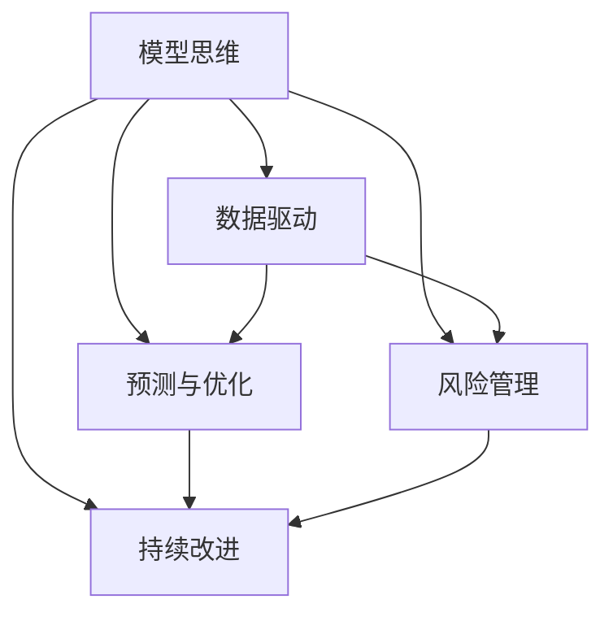

                 

# 模型思维与管理效率的优化

> 关键词：模型思维, 管理效率, 优化算法, 数据驱动, 机器学习, 项目管理, 工程实践, 持续改进

## 1. 背景介绍

### 1.1 问题由来

在现代企业中，管理效率的高低直接决定了公司的核心竞争力。随着数字化转型的不断深入，传统的管理模式已经无法适应当前复杂多变的环境。因此，如何通过高效的管理方法提升企业运营效率，成为了当前管理理论与实践的热点话题。其中，数据驱动、机器学习等新兴技术手段的引入，提供了全新的思路和方法。

尤其是在项目管理、流程优化、质量控制等场景中，传统的依靠人工经验和直觉的方法，已经被基于模型的方法所取代。这种基于模型的方法，通过构建数据驱动的模型，利用机器学习算法，对历史数据进行拟合与预测，从而提升管理决策的准确性和效率。本文将围绕模型思维在项目管理中的应用，探讨如何通过模型思维优化管理效率，为企业带来新的价值。

### 1.2 问题核心关键点

模型思维在管理中的应用，主要体现在以下几个方面：

1. **数据驱动决策**：通过对企业运营数据进行建模和分析，识别出关键影响因素，从而支持数据驱动的决策。
2. **预测与优化**：利用机器学习模型，对未来的运营状态进行预测，并据此优化资源配置和流程安排。
3. **风险管理**：通过建立风险评估模型，量化风险影响，并制定应对策略。
4. **持续改进**：利用模型持续监控运营状态，及时发现偏差，进行实时调整。

这些关键点，构成了模型思维在项目管理中的应用框架，使其能够在各种场景下发挥强大的管理优化作用。

## 2. 核心概念与联系

### 2.1 核心概念概述

为更好地理解模型思维在管理中的应用，本节将介绍几个密切相关的核心概念：

- **模型思维（Model Thinking）**：通过构建和应用数学或统计模型，对复杂系统进行建模和分析，以提升决策的准确性和效率。

- **机器学习（Machine Learning）**：利用算法和统计模型，让计算机系统从数据中学习规律，实现预测、分类、聚类等功能。

- **项目管理（Project Management）**：规划、执行和控制项目活动，以确保项目在预算、时间、质量等约束条件下成功完成。

- **数据驱动决策（Data-Driven Decision Making）**：基于数据和模型分析，而非直觉或经验，做出管理决策。

- **预测与优化（Forecasting and Optimization）**：利用模型预测未来状态，并据此进行优化调整。

- **风险管理（Risk Management）**：通过模型量化风险，评估风险影响，制定风险应对策略。

- **持续改进（Continuous Improvement）**：利用模型持续监控和分析，及时发现偏差，进行实时调整。

这些核心概念之间的逻辑关系可以通过以下Mermaid流程图来展示：



这个流程图展示了几大核心概念之间的联系：

1. 模型思维通过数据驱动、预测与优化、风险管理、持续改进等手段，全面提升项目管理效率。
2. 数据驱动和预测与优化，通过模型对历史数据进行分析和预测，支持科学决策。
3. 风险管理，利用模型量化风险，制定有效的风险应对策略。
4. 持续改进，通过模型持续监控运营状态，及时发现偏差，进行实时调整。

## 3. 核心算法原理 & 具体操作步骤

### 3.1 算法原理概述

模型思维在管理中的应用，本质上是将管理问题转化为数学或统计问题，通过模型求解得到最优解。常见的模型包括线性回归、决策树、随机森林、神经网络等。

以预测与优化为例，假设企业需要预测下季度的销售额，以优化库存管理。可以通过建立线性回归模型，以历史销售数据、季节性因素、市场趋势等因素为自变量，预测下季度销售额。根据预测结果，企业可以调整库存量，以实现最优的库存管理。

### 3.2 算法步骤详解

基于模型思维的管理优化，一般包括以下几个关键步骤：

**Step 1: 数据准备**
- 收集企业历史数据，包括业务运营数据、市场数据、财务数据等。
- 数据清洗和预处理，确保数据的准确性和完整性。
- 数据划分，分为训练集、验证集和测试集。

**Step 2: 模型选择**
- 根据管理目标和数据特点，选择合适的模型。
- 常用的模型包括线性回归、逻辑回归、决策树、随机森林、神经网络等。
- 考虑模型的复杂度和预测能力，选择合适的模型。

**Step 3: 模型训练**
- 在训练集上训练模型，调整模型参数，使得模型能够准确预测目标值。
- 使用交叉验证等方法，评估模型性能。
- 选择合适的超参数，如学习率、正则化系数等。

**Step 4: 模型评估与优化**
- 在验证集上评估模型性能，选择最优模型。
- 在测试集上评估模型泛化能力，确保模型的可靠性。
- 利用模型进行预测，优化决策过程。

**Step 5: 风险管理**
- 建立风险评估模型，量化风险影响。
- 利用模型评估风险，制定风险应对策略。
- 持续监控风险状态，实时调整风险管理措施。

**Step 6: 持续改进**
- 利用模型持续监控运营状态，及时发现偏差。
- 根据模型分析结果，进行实时调整。
- 定期重新训练模型，确保模型始终处于最佳状态。

以上是基于模型思维的管理优化的一般流程。在实际应用中，还需要针对具体任务，对模型进行优化设计和调试，以进一步提升模型性能。

### 3.3 算法优缺点

基于模型思维的管理优化方法具有以下优点：
1. 科学决策。通过模型分析数据，提升决策的准确性和效率。
2. 预测与优化。模型可以预测未来状态，优化资源配置和流程安排。
3. 风险管理。模型可以量化风险，制定有效的风险应对策略。
4. 持续改进。模型持续监控运营状态，及时发现偏差，进行实时调整。

同时，该方法也存在一定的局限性：
1. 数据依赖。模型性能很大程度上取决于数据的质量和数量，数据获取和处理成本较高。
2. 模型复杂。模型构建和训练复杂，需要专业知识。
3. 动态变化。管理环境复杂多变，模型需要定期更新，维护成本高。
4. 可解释性不足。模型的决策过程通常缺乏可解释性，难以对其推理逻辑进行分析和调试。

尽管存在这些局限性，但就目前而言，基于模型思维的管理优化方法仍是一种高效、科学的管理手段。未来相关研究的重点在于如何进一步降低模型对数据的要求，提高模型的少样本学习和跨领域迁移能力，同时兼顾可解释性和伦理安全性等因素。

### 3.4 算法应用领域

基于模型思维的管理优化方法，在项目管理中已经得到了广泛的应用，覆盖了几乎所有常见任务，例如：

- 项目进度管理：利用预测模型，对项目进度进行预测，优化资源配置。
- 成本管理：通过建立成本预测模型，预测项目成本，控制成本预算。
- 风险管理：利用风险评估模型，量化风险影响，制定风险应对策略。
- 质量控制：建立质量评估模型，实时监控项目质量，及时发现和纠正问题。
- 绩效评估：利用模型评估团队绩效，制定绩效激励机制。

除了上述这些经典任务外，模型思维还被创新性地应用到更多场景中，如项目组合管理、客户满意度预测、供应链优化等，为项目管理带来了全新的突破。随着模型思维方法的不断进步，相信项目管理技术将在更广阔的应用领域大放异彩。

## 4. 数学模型和公式 & 详细讲解 & 举例说明

### 4.1 数学模型构建

本节将使用数学语言对基于模型思维的管理优化过程进行更加严格的刻画。

假设企业管理一个项目，需要对项目进度进行预测，以优化资源配置。设项目总进度为 $T$，当前进度为 $t$，所需资源为 $R$，项目已完成工作量为 $W$，未完成工作量为 $U$，历史数据为 $D=\{(t_i, W_i, R_i)\}_{i=1}^N$。则项目进度预测模型可以表示为：

$$
T = f(t, R, W, U; \theta)
$$

其中 $\theta$ 为模型的参数，包括历史数据、模型结构等。

通过最小化预测误差，求解上述模型的参数 $\theta$，可以得到最优的进度预测模型。具体而言，可以利用回归模型、决策树模型、神经网络模型等进行预测。

### 4.2 公式推导过程

以下我们以线性回归模型为例，推导项目进度预测的公式及其求解步骤。

假设采用线性回归模型进行进度预测，模型的线性形式为：

$$
\hat{T} = \beta_0 + \beta_1 t + \beta_2 R + \beta_3 W + \beta_4 U
$$

其中 $\hat{T}$ 为预测进度，$\beta_i$ 为回归系数。通过最小化预测误差 $E(T - \hat{T})$，求解 $\beta_i$：

$$
\min_{\beta_i} E(T - \hat{T}) = \min_{\beta_i} \sum_{i=1}^N (T_i - \beta_0 - \beta_1 t_i - \beta_2 R_i - \beta_3 W_i - \beta_4 U_i)^2
$$

使用最小二乘法求解上述目标函数，得到：

$$
\beta_i = \frac{\sum_{i=1}^N (t_i W_i R_i U_i - \bar{t} \bar{W} \bar{R} \bar{U}) / \sum_{i=1}^N (t_i^2 R_i^2 W_i^2 U_i^2 - \bar{t}^2 \bar{W}^2 \bar{R}^2 \bar{U}^2)}
$$

其中 $\bar{t}$、$\bar{W}$、$\bar{R}$、$\bar{U}$ 分别为 $t$、$W$、$R$、$U$ 的均值。

### 4.3 案例分析与讲解

以某企业的项目进度管理为例，我们利用线性回归模型进行进度预测，具体步骤如下：

**Step 1: 数据准备**
- 收集项目历史数据，包括项目进度、所需资源、已完成工作量、未完成工作量等。
- 数据清洗和预处理，确保数据的准确性和完整性。
- 数据划分，分为训练集、验证集和测试集。

**Step 2: 模型训练**
- 在训练集上训练线性回归模型，调整回归系数 $\beta_i$。
- 使用交叉验证等方法，评估模型性能。
- 选择合适的超参数，如学习率、正则化系数等。

**Step 3: 模型评估与优化**
- 在验证集上评估模型性能，选择最优模型。
- 在测试集上评估模型泛化能力，确保模型的可靠性。
- 利用模型进行预测，优化项目进度管理。

通过以上步骤，企业可以基于线性回归模型，对项目进度进行预测，及时发现偏差，进行实时调整，优化资源配置，提升管理效率。

## 5. 项目实践：代码实例和详细解释说明

### 5.1 开发环境搭建

在进行模型思维实践前，我们需要准备好开发环境。以下是使用Python进行Scikit-learn开发的环境配置流程：

1. 安装Anaconda：从官网下载并安装Anaconda，用于创建独立的Python环境。

2. 创建并激活虚拟环境：
```bash
conda create -n sklearn-env python=3.8 
conda activate sklearn-env
```

3. 安装Scikit-learn：
```bash
conda install scikit-learn
```

4. 安装各类工具包：
```bash
pip install numpy pandas scikit-learn matplotlib tqdm jupyter notebook ipython
```

完成上述步骤后，即可在`sklearn-env`环境中开始模型思维实践。

### 5.2 源代码详细实现

下面我们以项目进度预测为例，给出使用Scikit-learn进行线性回归模型训练的Python代码实现。

首先，定义数据处理函数：

```python
from sklearn.model_selection import train_test_split
from sklearn.linear_model import LinearRegression
import pandas as pd
import numpy as np

def prepare_data(df, target):
    X = df.drop(target, axis=1)
    y = df[target]
    return X, y

# 加载数据
data = pd.read_csv('project_data.csv')
X, y = prepare_data(data, 'progress')
X_train, X_test, y_train, y_test = train_test_split(X, y, test_size=0.3, random_state=42)
```

然后，定义模型训练函数：

```python
from sklearn.metrics import mean_squared_error
from sklearn.linear_model import LinearRegression

def train_model(X_train, y_train):
    model = LinearRegression()
    model.fit(X_train, y_train)
    return model

# 训练模型
model = train_model(X_train, y_train)
```

接着，定义模型评估函数：

```python
def evaluate_model(model, X_test, y_test):
    y_pred = model.predict(X_test)
    mse = mean_squared_error(y_test, y_pred)
    rmse = np.sqrt(mse)
    print(f"RMSE: {rmse:.3f}")
```

最后，启动模型训练和评估流程：

```python
# 评估模型
evaluate_model(model, X_test, y_test)

# 使用模型进行预测
new_data = pd.DataFrame({'current_time': [np.max(X_test['time']) + 1],
                        'resource': [100],
                        'work_done': [1000],
                        'uncompleted_work': [2000]})
new_data['predicted_time'] = model.predict(new_data)
print(new_data)
```

以上就是使用Scikit-learn进行线性回归模型训练的完整代码实现。可以看到，利用Scikit-learn进行线性回归模型训练非常简单，只需几行代码即可实现。

### 5.3 代码解读与分析

让我们再详细解读一下关键代码的实现细节：

**prepare_data函数**：
- 定义数据处理函数，将数据集分为特征矩阵和目标变量。
- 使用Scikit-learn的train_test_split函数，将数据划分为训练集和测试集。

**train_model函数**：
- 定义模型训练函数，使用Scikit-learn的LinearRegression类进行线性回归模型训练。
- 模型训练后返回训练好的模型。

**evaluate_model函数**：
- 定义模型评估函数，计算预测值与真实值之间的均方误差和根均方误差，并输出评估结果。
- 使用Scikit-learn的mean_squared_error函数计算均方误差。

**启动模型训练和评估流程**：
- 在训练集上训练线性回归模型，并评估模型性能。
- 在测试集上评估模型泛化能力。
- 使用模型对新数据进行预测，输出预测结果。

可以看到，利用Scikit-learn进行线性回归模型训练和评估非常简单，代码实现也非常简洁。这得益于Scikit-learn的强大封装和丰富的模型库，使得模型思维的实现变得高效快捷。

当然，工业级的系统实现还需考虑更多因素，如模型的保存和部署、超参数的自动搜索、更灵活的任务适配层等。但核心的模型思维方法基本与此类似。

## 6. 实际应用场景

### 6.1 智能制造

基于模型思维的智能制造管理系统，可以显著提升制造流程的效率和质量。传统制造管理系统通常依赖人工经验和直觉，难以适应复杂多变的生产环境。而利用模型思维构建的智能制造系统，能够根据历史数据和实时数据，进行实时预测和优化，实现精确的生产计划和库存管理。

在技术实现上，可以收集生产设备的历史运行数据、维护数据、故障数据等，构建预测模型，对设备故障进行预测和维护。同时，利用优化模型，对生产计划和库存进行动态调整，从而提高生产效率和产品质量。

### 6.2 智慧医疗

智慧医疗领域，基于模型思维的管理系统可以显著提升医疗服务的效率和质量。传统医疗管理系统通常依赖人工调度，难以应对大量病患的需求。而利用模型思维构建的智慧医疗管理系统，能够根据历史数据和实时数据，进行实时预测和优化，实现精确的病人调度和资源配置。

在技术实现上，可以收集医院的历史病患数据、治疗数据、药品数据等，构建预测模型，对病人的需求进行预测和调度。同时，利用优化模型，对医疗资源进行动态调整，从而提高医疗服务的效率和质量。

### 6.3 电子商务

电子商务领域，基于模型思维的管理系统可以显著提升销售额和用户体验。传统电子商务管理系统通常依赖人工经验和直觉，难以适应市场变化。而利用模型思维构建的电子商务管理系统，能够根据历史数据和实时数据，进行实时预测和优化，实现精确的市场预测和促销策略。

在技术实现上，可以收集电商平台的销售数据、用户行为数据、市场数据等，构建预测模型，对市场趋势进行预测和分析。同时，利用优化模型，对促销策略和商品推荐进行动态调整，从而提高销售额和用户体验。

### 6.4 未来应用展望

随着模型思维方法的发展，基于模型思维的管理系统将在更多领域得到应用，为传统行业带来变革性影响。

在智慧农业领域，基于模型思维的管理系统可以显著提升农作物的产量和质量。利用模型思维构建的智慧农业管理系统，能够根据历史数据和实时数据，进行实时预测和优化，实现精确的农艺管理和种植策略。

在智慧物流领域，基于模型思维的管理系统可以显著提升物流效率和降低运营成本。利用模型思维构建的智慧物流管理系统，能够根据历史数据和实时数据，进行实时预测和优化，实现精确的物流规划和配送管理。

在智慧城市领域，基于模型思维的管理系统可以显著提升城市管理的效率和质量。利用模型思维构建的智慧城市管理系统，能够根据历史数据和实时数据，进行实时预测和优化，实现精确的城市规划和资源配置。

此外，在金融、教育、能源等众多领域，基于模型思维的管理系统也将不断涌现，为各行各业带来新的机遇和挑战。相信随着模型思维方法的发展和应用的深入，企业管理将迈向更加科学、高效、智能的全新阶段。

## 7. 工具和资源推荐

### 7.1 学习资源推荐

为了帮助开发者系统掌握模型思维的理论基础和实践技巧，这里推荐一些优质的学习资源：

1. 《机器学习》系列书籍：由斯坦福大学教授Andrew Ng所著，全面介绍了机器学习的基本概念和算法，是入门的必读书籍。

2. 《Python数据科学手册》：介绍了使用Python进行数据分析和机器学习的实践技巧，涵盖Pandas、NumPy、Scikit-learn等工具的使用。

3. Kaggle在线竞赛平台：提供了丰富的机器学习竞赛项目，涵盖数据处理、模型构建、模型评估等环节，是实践学习的好地方。

4. GitHub开源项目：GitHub上有很多优秀的机器学习项目，如TensorFlow、Scikit-learn、Keras等，通过阅读和参与开源项目，可以快速积累实践经验。

5. Coursera和edX在线课程：提供了丰富的机器学习课程，涵盖从入门到高级的各种主题，适合不同层次的学习者。

通过对这些资源的学习实践，相信你一定能够快速掌握模型思维的精髓，并用于解决实际的管理问题。

### 7.2 开发工具推荐

高效的开发离不开优秀的工具支持。以下是几款用于模型思维开发的常用工具：

1. Scikit-learn：基于Python的开源机器学习库，提供了丰富的模型选择和评估工具，适合快速迭代研究。

2. TensorFlow：由Google主导开发的开源深度学习框架，生产部署方便，适合大规模工程应用。

3. Keras：基于TensorFlow的高级神经网络API，提供了简单易用的接口，适合快速开发原型。

4. Jupyter Notebook：免费的开源笔记本环境，支持Python代码的实时执行，适合交互式开发和调试。

5. PyCharm：优秀的Python开发IDE，提供了丰富的代码高亮、自动补全、版本控制等功能，适合代码开发和调试。

合理利用这些工具，可以显著提升模型思维的开发效率，加快创新迭代的步伐。

### 7.3 相关论文推荐

模型思维的发展源于学界的持续研究。以下是几篇奠基性的相关论文，推荐阅读：

1. 《机器学习》（Machine Learning）：由Tom Mitchell所著，介绍了机器学习的基本概念和算法，是经典教材。

2. 《深度学习》（Deep Learning）：由Ian Goodfellow、Yoshua Bengio、Aaron Courville所著，全面介绍了深度学习的基本概念和算法。

3. 《统计学习方法》（Statistical Learning Methods）：由李航所著，介绍了常用的统计学习算法及其应用。

4. 《机器学习实战》（Hands-On Machine Learning with Scikit-Learn and TensorFlow）：由Aurélien Géron所著，介绍了使用Scikit-learn和TensorFlow进行机器学习的实践技巧。

5. 《Python数据科学手册》（Python Data Science Handbook）：由Jake VanderPlas所著，介绍了使用Python进行数据分析和机器学习的实践技巧。

这些论文代表了大模型思维的发展脉络。通过学习这些前沿成果，可以帮助研究者把握学科前进方向，激发更多的创新灵感。

## 8. 总结：未来发展趋势与挑战

### 8.1 总结

本文对基于模型思维的管理优化方法进行了全面系统的介绍。首先阐述了模型思维在项目管理中的应用，明确了模型思维在提升管理效率、优化资源配置等方面的独特价值。其次，从原理到实践，详细讲解了模型构建和应用的一般流程，给出了模型思维任务开发的完整代码实例。同时，本文还广泛探讨了模型思维在智能制造、智慧医疗、电子商务等多个行业领域的应用前景，展示了模型思维的巨大潜力。此外，本文精选了模型思维技术的各类学习资源，力求为读者提供全方位的技术指引。

通过本文的系统梳理，可以看到，基于模型思维的管理优化方法正在成为项目管理的重要范式，极大地拓展了项目管理的应用边界，催生了更多的落地场景。受益于数据驱动、机器学习等新兴技术手段的引入，项目管理技术将在更广阔的应用领域大放异彩。未来，伴随模型思维方法的不断进步，相信项目管理技术将在数字化转型中发挥越来越重要的作用。

### 8.2 未来发展趋势

展望未来，模型思维在管理中的应用将呈现以下几个发展趋势：

1. 模型复杂度增加。随着数据量的增加，模型的复杂度将进一步提升，能够处理更加复杂的管理问题。
2. 动态优化能力增强。利用模型进行动态调整，实时优化资源配置和流程安排。
3. 多模态融合。将图像、视频、声音等多模态数据与文本数据融合，提升模型的综合能力。
4. 自适应学习。通过模型自适应学习，能够不断从新数据中学习，提升模型的泛化能力。
5. 跨领域应用。模型思维将在更多领域得到应用，如智慧农业、智慧物流、智慧城市等，推动各行各业的数字化转型。

这些趋势凸显了模型思维在管理中的广阔前景。这些方向的探索发展，必将进一步提升项目管理系统的性能和应用范围，为企业的数字化转型提供新的动力。

### 8.3 面临的挑战

尽管模型思维在管理中的应用已经取得了瞩目成就，但在迈向更加智能化、普适化应用的过程中，它仍面临着诸多挑战：

1. 数据依赖。模型性能很大程度上取决于数据的质量和数量，数据获取和处理成本较高。
2. 模型复杂。模型构建和训练复杂，需要专业知识。
3. 动态变化。管理环境复杂多变，模型需要定期更新，维护成本高。
4. 可解释性不足。模型的决策过程通常缺乏可解释性，难以对其推理逻辑进行分析和调试。
5. 安全性有待保障。模型可能学习到有偏见、有害的信息，需要通过数据和算法层面进行过滤和优化。

尽管存在这些挑战，但未来的研究需要在以下几个方面寻求新的突破：

1. 探索无监督和半监督模型思维方法。摆脱对大规模标注数据的依赖，利用自监督学习、主动学习等无监督和半监督范式，最大限度利用非结构化数据，实现更加灵活高效的模型思维。
2. 研究模型思维的多模态融合能力。将图像、视频、声音等多模态数据与文本数据融合，提升模型的综合能力。
3. 引入因果推断和博弈论工具。通过引入因果推断和博弈论思想，增强模型思维建立稳定因果关系的能力，学习更加普适、鲁棒的管理知识。
4. 结合符号化知识进行优化。将符号化的先验知识，如知识图谱、逻辑规则等，与神经网络模型进行融合，引导模型思维过程学习更准确、合理的管理知识。
5. 加强模型可解释性和安全性。在模型训练目标中引入伦理导向的评估指标，过滤和惩罚有偏见、有害的输出倾向。同时加强人工干预和审核，建立模型行为的监管机制，确保输出符合人类价值观和伦理道德。

这些研究方向的探索，必将引领模型思维方法迈向更高的台阶，为构建科学、高效、智能的管理系统铺平道路。面向未来，模型思维还需要与其他人工智能技术进行更深入的融合，如知识表示、因果推理、强化学习等，多路径协同发力，共同推动企业管理技术的进步。只有勇于创新、敢于突破，才能不断拓展模型思维的边界，让管理技术更好地服务于人类社会的可持续发展。

## 9. 附录：常见问题与解答

**Q1：模型思维在项目管理中的应用有什么优势？**

A: 模型思维在项目管理中的应用，主要体现在以下几个方面：
1. 数据驱动决策：通过模型分析数据，提升决策的准确性和效率。
2. 预测与优化：模型可以预测未来状态，优化资源配置和流程安排。
3. 风险管理：模型可以量化风险，制定有效的风险应对策略。
4. 持续改进：模型持续监控运营状态，及时发现偏差，进行实时调整。

这些优势使得模型思维在项目管理中，能够快速、准确地支持管理决策，提高运营效率和质量。

**Q2：如何选择合适的模型进行预测与优化？**

A: 选择合适的模型进行预测与优化，主要取决于数据的特点和管理目标。常见的模型包括线性回归、逻辑回归、决策树、随机森林、神经网络等。具体选择如下：
1. 数据线性可预测：选择线性回归模型。
2. 数据非线性可预测：选择决策树、随机森林等模型。
3. 数据高度非线性可预测：选择神经网络模型。

同时，还需要考虑模型的复杂度、泛化能力、训练时间等因素，综合评估选择最优模型。

**Q3：模型思维在实际应用中需要注意哪些问题？**

A: 模型思维在实际应用中需要注意以下问题：
1. 数据质量：确保数据的准确性和完整性，避免数据噪声影响模型性能。
2. 数据隐私：保护数据隐私和安全，避免敏感信息泄露。
3. 模型可解释性：提高模型的可解释性，便于理解和调试。
4. 模型维护：定期更新模型，确保模型始终处于最佳状态。
5. 模型可扩展性：确保模型能够适应变化，具备良好的可扩展性。

合理处理这些问题，才能充分发挥模型思维的优势，提升管理效率和质量。

**Q4：如何评估模型思维的效果？**

A: 模型思维的效果评估，主要通过以下指标：
1. 准确性：模型的预测结果与真实结果的匹配程度。
2. 泛化能力：模型在测试集上的表现。
3. 效率：模型的训练和推理速度。
4. 可解释性：模型的推理过程是否可理解、可信。
5. 成本效益：模型的应用成本与收益比。

通过综合评估这些指标，可以全面评估模型思维的效果，并指导模型的改进和优化。

---

作者：禅与计算机程序设计艺术 / Zen and the Art of Computer Programming

