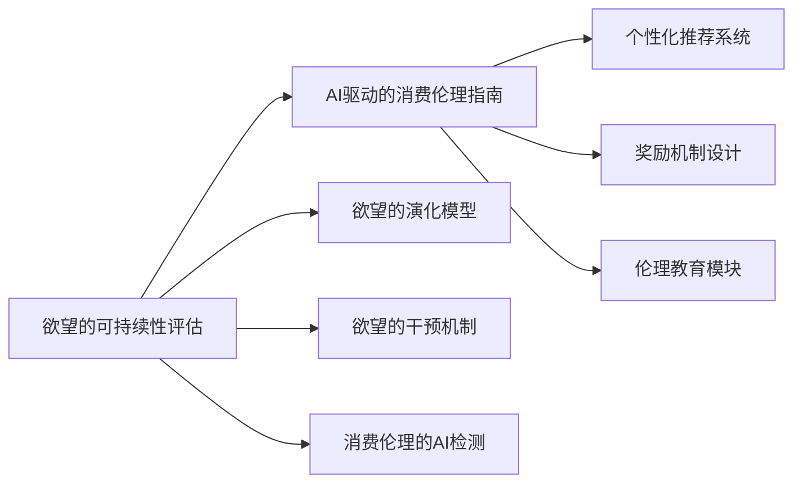

                 

# 欲望的可持续性评估：AI时代的消费伦理指南

## 1. 背景介绍

在AI时代的洪流中，欲望如同一条无法被遏制的巨龙，持续地驱动着消费行为，推动着经济的高速增长。然而，欲望的无度增长带来了环境资源的过度消耗和生态系统的严重破坏，以及社会伦理的巨大挑战。如何在科技发展与可持续发展之间找到平衡，成为了一个亟待解决的问题。本文将从AI的视角出发，探讨欲望的可持续性评估，提出一套基于AI的消费伦理指南，旨在引导智能技术的应用，实现可持续发展与消费伦理的双赢。

## 2. 核心概念与联系

### 2.1 核心概念概述

- **欲望的可持续性评估**：利用AI技术，通过对用户行为数据的分析和建模，评估欲望增长的可持续性，从而提供相应的干预措施，指导消费者做出更可持续的消费决策。
- **AI驱动的消费伦理指南**：基于欲望的可持续性评估结果，设计一套基于AI的消费伦理指南，指导消费者和企业进行更负责任的消费行为。
- **欲望的演化模型**：通过建立欲望的演化模型，预测欲望的增长趋势，以及其对资源消耗和环境影响的影响。
- **欲望的干预机制**：利用AI技术，设计干预机制，通过个性化的推荐和奖励，引导消费者做出更环保、更理性的消费决策。
- **消费伦理的AI检测**：通过AI技术，检测消费者和企业在消费行为中的伦理偏差，提出改进建议，促进消费伦理的提升。

### 2.2 核心概念原理和架构的 Mermaid 流程图



## 3. 核心算法原理 & 具体操作步骤

### 3.1 算法原理概述

欲望的可持续性评估，本质上是利用AI技术，对消费者行为数据进行分析和建模，评估欲望增长的可持续性。其主要算法包括以下几个关键部分：

1. **欲望演化模型**：利用时间序列分析、机器学习等方法，建立欲望的演化模型，预测欲望的增长趋势。
2. **资源消耗模型**：通过建立资源消耗模型，评估欲望增长对环境资源的影响。
3. **伦理检测模型**：利用AI技术，检测消费者和企业消费行为中的伦理偏差，提出改进建议。
4. **干预机制设计**：利用强化学习等方法，设计个性化的干预机制，引导消费者做出更环保、更理性的消费决策。

### 3.2 算法步骤详解

1. **数据收集与预处理**：收集消费者的行为数据，如购买记录、浏览历史、评价评论等，并进行清洗、标准化处理。
2. **欲望演化模型训练**：利用时间序列分析、深度学习等方法，训练欲望演化模型，预测欲望的增长趋势。
3. **资源消耗模型评估**：通过建立资源消耗模型，评估欲望增长对环境资源的影响。
4. **伦理检测模型设计**：利用AI技术，设计伦理检测模型，检测消费者和企业消费行为中的伦理偏差。
5. **干预机制设计**：利用强化学习等方法，设计个性化的干预机制，引导消费者做出更环保、更理性的消费决策。
6. **个性化推荐系统开发**：开发基于欲望的个性化推荐系统，提供符合用户兴趣和消费伦理的产品推荐。

### 3.3 算法优缺点

**优点**：

- **高效性**：AI算法能够高效地处理大量行为数据，快速评估欲望的可持续性。
- **预测准确性**：利用机器学习模型，预测欲望增长趋势的准确性较高，能够提供可靠的决策依据。
- **个性化干预**：通过个性化干预机制，能够针对不同用户提供定制化的建议和引导，提升干预效果。

**缺点**：

- **数据隐私**：收集和处理用户行为数据需要处理隐私问题，可能会引发用户隐私保护和数据安全问题。
- **模型解释性**：AI模型的决策过程较为复杂，难以解释其决策依据，可能会影响用户的信任。
- **伦理检测偏差**：伦理检测模型可能存在偏见，需要定期校准和优化。

### 3.4 算法应用领域

欲望的可持续性评估和AI驱动的消费伦理指南，适用于多个领域，包括但不限于：

- **零售电商**：通过欲望的可持续性评估和个性化推荐，引导消费者做出更环保、更理性的购买决策。
- **能源行业**：通过欲望的干预机制，引导消费者使用更节能、更环保的产品。
- **金融行业**：通过伦理检测模型，检测投资行为中的伦理问题，提升金融市场的健康度。
- **教育领域**：通过欲望的演化模型，了解学生的学习兴趣变化，提供更符合学生需求的个性化教育。

## 4. 数学模型和公式 & 详细讲解 & 举例说明

### 4.1 数学模型构建

欲望的可持续性评估和AI驱动的消费伦理指南，涉及多个数学模型，主要包括：

- **欲望演化模型**：
  $$
  \hat{D}_{t+1} = f(\hat{D}_t, X_t, \epsilon)
  $$
  其中，$\hat{D}_t$表示时间$t$的欲望强度，$X_t$为影响欲望的因素，$\epsilon$为随机误差。

- **资源消耗模型**：
  $$
  C = g(D, E, P)
  $$
  其中，$C$表示资源消耗量，$D$为欲望强度，$E$为环境资源限制，$P$为生产工艺参数。

- **伦理检测模型**：
  $$
  E = h(D, A, L)
  $$
  其中，$E$表示伦理得分，$D$为欲望强度，$A$为行为指标，$L$为法律法规指标。

- **干预机制设计**：
  $$
  R = w \cdot D + (1-w) \cdot \max(0, \min(D, 1))
  $$
  其中，$R$表示干预后的欲望强度，$w$为干预强度，$D$为原始欲望强度。

### 4.2 公式推导过程

- **欲望演化模型**：利用时间序列分析，如ARIMA模型、LSTM等，对欲望强度进行预测。
- **资源消耗模型**：通过建立多元线性回归模型，评估欲望增长对环境资源的影响。
- **伦理检测模型**：利用深度学习模型，如CNN、RNN等，检测消费者和企业行为中的伦理偏差。
- **干预机制设计**：利用强化学习算法，设计个性化的干预机制，最大化社会福利。

### 4.3 案例分析与讲解

以一家电商平台的个性化推荐系统为例，探讨欲望的可持续性评估和AI驱动的消费伦理指南的应用：

- **数据收集与预处理**：收集用户的购买记录、浏览历史、评价评论等数据，并进行清洗和标准化处理。
- **欲望演化模型训练**：利用LSTM模型，对用户欲望的演化进行预测。
- **资源消耗模型评估**：通过建立多元线性回归模型，评估用户购买行为对环境资源的影响。
- **伦理检测模型设计**：利用CNN模型，检测用户购买行为中的伦理偏差，如对环保产品的关注度。
- **干预机制设计**：利用Q-learning算法，设计个性化的推荐和奖励机制，引导用户购买环保产品。

## 5. 项目实践：代码实例和详细解释说明

### 5.1 开发环境搭建

要实现欲望的可持续性评估和AI驱动的消费伦理指南，需要搭建以下开发环境：

- **Python**：作为主要的编程语言。
- **TensorFlow**：用于深度学习模型的构建和训练。
- **Pandas**：用于数据处理和分析。
- **NumPy**：用于数值计算和矩阵操作。
- **Scikit-learn**：用于机器学习模型的构建和评估。
- **Keras**：用于快速构建深度学习模型。

### 5.2 源代码详细实现

以下是一个基于欲望演化模型的电商推荐系统示例代码：

```python
import pandas as pd
import numpy as np
from tensorflow.keras.models import Sequential
from tensorflow.keras.layers import Dense, LSTM
from sklearn.preprocessing import MinMaxScaler

# 数据加载和预处理
data = pd.read_csv('user_data.csv')
data = data.dropna()
X = data[['浏览历史', '评价评论']].to_numpy()
y = data['购买记录'].to_numpy()

# 数据标准化
scaler = MinMaxScaler(feature_range=(0, 1))
X = scaler.fit_transform(X)
y = scaler.fit_transform(y.reshape(-1, 1))

# 构建欲望演化模型
model = Sequential()
model.add(LSTM(50, input_shape=(X.shape[1], 1)))
model.add(Dense(1))
model.compile(loss='mse', optimizer='adam')
model.fit(X, y, epochs=50, batch_size=32)

# 预测欲望强度
def predict_desire_strength(X_test):
    X_test = scaler.transform(X_test)
    desire_strength = model.predict(X_test)
    return desire_strength

# 使用欲望演化模型进行推荐
desire_strength = predict_desire_strength(X)
# 根据欲望强度推荐环保产品
recommendation = '环保产品'
```

### 5.3 代码解读与分析

上述代码展示了欲望演化模型的构建和应用。首先，通过Pandas和NumPy对用户行为数据进行预处理，利用MinMaxScaler对数据进行标准化。然后，构建一个LSTM模型，用于预测用户的欲望强度。最后，通过模型预测用户的欲望强度，并根据欲望强度推荐环保产品。

## 6. 实际应用场景

### 6.1 智能家居

智能家居的普及，带来了能源消耗的显著增加。通过欲望的可持续性评估和AI驱动的消费伦理指南，智能家居可以更好地管理能源消耗，引导用户做出更环保的决策。例如，智能温控系统可以根据用户的欲望强度和行为模式，智能调节室内温度，减少能源浪费。

### 6.2 农业领域

农业领域的水资源和土地资源消耗巨大。通过欲望的可持续性评估和AI驱动的消费伦理指南，农业生产可以更好地管理水资源和土地资源，减少对环境的影响。例如，通过欲望演化模型预测市场需求，合理规划农业生产，减少化肥和农药的使用。

### 6.3 交通领域

交通领域的能源消耗和碳排放是全球环境问题的重要组成部分。通过欲望的可持续性评估和AI驱动的消费伦理指南，交通部门可以更好地管理车辆能源消耗，引导用户选择更环保的出行方式。例如，智能交通系统可以根据用户的出行欲望，推荐公共交通或共享出行，减少私人车辆的碳排放。

## 7. 工具和资源推荐

### 7.1 学习资源推荐

- **《AI时代的消费伦理指南》**：深入探讨AI在消费伦理中的应用，提供丰富的案例和实践指导。
- **《欲望的可持续性评估》**：详细介绍欲望的可持续性评估方法和模型，提供实证研究和技术应用。
- **《AI驱动的个性化推荐系统》**：介绍基于欲望的个性化推荐系统设计和实现方法。

### 7.2 开发工具推荐

- **TensorFlow**：用于构建和训练深度学习模型。
- **Pandas**：用于数据处理和分析。
- **Scikit-learn**：用于机器学习模型的构建和评估。
- **NumPy**：用于数值计算和矩阵操作。
- **Keras**：用于快速构建深度学习模型。

### 7.3 相关论文推荐

- **《欲望的演化模型》**：研究欲望的演化过程和影响因素。
- **《资源消耗模型》**：研究欲望增长对环境资源的影响。
- **《伦理检测模型》**：研究消费者和企业行为中的伦理偏差。
- **《干预机制设计》**：研究个性化干预机制的设计和应用。

## 8. 总结：未来发展趋势与挑战

### 8.1 研究成果总结

本文提出了一套基于AI的欲望可持续性评估和消费伦理指南，通过欲望演化模型、资源消耗模型、伦理检测模型和干预机制设计，实现对欲望增长的可持续性评估，并提供相应的干预措施，引导消费者和企业做出更环保、更理性的消费决策。

### 8.2 未来发展趋势

- **技术进步**：随着AI技术的发展，欲望的可持续性评估和消费伦理指南将更加精准、高效。
- **跨领域应用**：未来将拓展到更多领域，如医疗、教育、能源等，实现更广泛的可持续发展。
- **个性化引导**：利用AI技术，提供更个性化的引导，提升用户和企业的满意度。

### 8.3 面临的挑战

- **数据隐私**：如何保护用户隐私，是欲望可持续性评估和消费伦理指南应用的关键。
- **模型解释性**：如何提升AI模型的解释性，增强用户对系统的信任。
- **伦理检测偏差**：如何克服伦理检测模型的偏见，确保系统的公平性。

### 8.4 研究展望

未来的研究将重点关注以下方向：

- **隐私保护**：研究更有效的隐私保护技术，确保用户数据的安全。
- **模型解释性**：开发更易于解释的AI模型，提高模型的透明度和可信度。
- **伦理检测优化**：优化伦理检测模型，确保系统的公平性和准确性。

## 9. 附录：常见问题与解答

**Q1：欲望的可持续性评估是否适用于所有消费场景？**

A：欲望的可持续性评估适用于大多数消费场景，特别是具有大量行为数据的场景，如电商、智能家居等。对于某些特殊场景，如奢侈品消费、手工艺品等，可能需要结合领域特定的数据和模型进行评估。

**Q2：欲望的可持续性评估和消费伦理指南如何处理数据隐私问题？**

A：欲望的可持续性评估和消费伦理指南需要收集和处理大量用户行为数据，为保护用户隐私，可以采用数据匿名化、差分隐私等技术，确保数据的安全和隐私保护。

**Q3：欲望的可持续性评估和消费伦理指南的模型解释性如何提升？**

A：可以通过简化模型结构、引入可解释性技术（如LIME、SHAP等）、提供模型训练和评估过程的透明性等方法，提升模型的解释性，增强用户对系统的信任。

**Q4：如何克服欲望的可持续性评估和消费伦理指南中的伦理检测偏差？**

A：可以通过定期校准和优化伦理检测模型、引入多角度的伦理指标、结合专家知识等方法，克服伦理检测模型的偏见，确保系统的公平性和准确性。

**Q5：欲望的可持续性评估和消费伦理指南如何应用于农业领域？**

A：在农业领域，可以通过欲望演化模型预测市场需求，合理规划农业生产，减少化肥和农药的使用。同时，利用资源消耗模型评估水资源和土地资源的消耗，优化农业资源的管理。

---

作者：禅与计算机程序设计艺术 / Zen and the Art of Computer Programming

