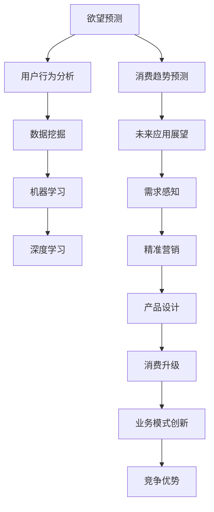

                 

# 欲望的智能化：AI预测人类需求

> 关键词：欲望预测、需求感知、人工智能、机器学习、用户行为分析、数据挖掘、消费趋势预测

## 1. 背景介绍

### 1.1 问题由来

在信息化时代，海量数据被不断产生和收集，成为了企业决策的重要依据。然而，这些数据往往是静态、孤立的，难以全面反映用户的动态需求和心理变化。如何从这些数据中提取更深层次的含义，预测用户的欲望和需求，成为了企业需要解决的核心问题。

传统的数据分析方法通常依赖于统计学、线性回归等方法，难以深入挖掘数据的动态关系和行为模式。人工智能技术，特别是深度学习和机器学习方法的兴起，为这一问题提供了全新的解决思路。通过构建智能化的欲望预测系统，企业可以更好地理解用户需求，优化产品和服务，提升用户体验。

### 1.2 问题核心关键点

本文聚焦于基于人工智能技术的欲望预测方法，通过分析海量用户行为数据，挖掘用户潜在的欲望和需求，为产品设计和营销策略提供数据支撑。关键问题包括：

- 如何高效地从海量数据中提取有用的信息？
- 如何将数据转化为对用户欲望的精确预测？
- 如何利用预测结果，优化产品和服务设计？
- 如何平衡用户隐私和预测准确性之间的关系？

这些问题的解决，依赖于算法模型和数据的科学应用，将深刻影响未来的商业决策和技术发展。

### 1.3 问题研究意义

欲望预测技术的发展，对于提升企业的市场反应速度和决策质量，具有重要的战略意义：

- 驱动精准营销。通过预测用户需求，企业可以制定更加个性化的营销策略，精准触达目标用户，提高营销效果。
- 优化产品设计。了解用户欲望，可以帮助企业开发更具市场竞争力的产品，提高用户满意度和忠诚度。
- 促进消费升级。预测用户欲望，有助于企业发现新的消费需求和市场机会，推动消费市场的持续发展。
- 创新业务模式。结合欲望预测技术，企业可以探索新的业务模式，如订阅经济、共享经济等，创造新的增长点。
- 增强竞争力。欲望预测作为AI技术的核心能力，将成为企业竞争力的重要组成部分，帮助企业在激烈的市场竞争中占据优势。

## 2. 核心概念与联系

### 2.1 核心概念概述

欲望预测的核心概念包括：

- 欲望预测：通过分析用户行为数据，预测用户在未来时间段内的需求和欲望。
- 用户行为分析：挖掘用户的行为模式和特征，构建用户画像，为欲望预测提供数据基础。
- 机器学习：利用算法模型从数据中学习用户的行为规律，实现欲望预测。
- 深度学习：基于神经网络模型，挖掘用户行为的复杂非线性关系，提高预测精度。
- 数据挖掘：从大量数据中提取有用信息，进行特征工程和模型训练。
- 消费趋势预测：分析用户欲望的变化趋势，帮助企业把握未来的市场动向。

这些概念之间的逻辑关系可以通过以下Mermaid流程图来展示：



这个流程图展示了大数据背景下，欲望预测从数据获取、特征工程、模型训练到应用实施的全过程，以及与之相关的核心概念。

## 3. 核心算法原理 & 具体操作步骤
### 3.1 算法原理概述

欲望预测的核心算法主要基于机器学习和深度学习技术，通过构建用户行为模型，预测用户未来的需求和欲望。算法流程如下：

1. **数据预处理**：清洗、整理用户行为数据，去除噪声和异常值。
2. **特征工程**：从数据中提取有意义的特征，构建用户画像。
3. **模型训练**：利用历史行为数据，训练预测模型，提取用户欲望。
4. **预测验证**：在验证集上评估模型预测效果，调整模型参数。
5. **实际应用**：将模型应用于实时用户行为数据，预测用户欲望。

### 3.2 算法步骤详解

#### 步骤1：数据预处理

数据预处理是欲望预测的首要步骤，主要包括以下几个环节：

1. **数据清洗**：去除缺失、异常数据，保证数据质量。
2. **数据归一化**：将数据缩放到标准范围内，防止特征尺度差异过大。
3. **特征选择**：根据领域知识和经验，选择对用户欲望预测有帮助的特征。
4. **数据划分**：将数据划分为训练集、验证集和测试集，用于模型训练、验证和评估。

#### 步骤2：特征工程

特征工程是模型构建的关键环节，主要包括以下几个步骤：

1. **数据融合**：将不同来源的数据进行融合，构建完整的数据集。
2. **特征提取**：从数据中提取有意义的特征，如用户浏览历史、购买记录等。
3. **特征变换**：对特征进行降维、归一化等处理，提高特征表示能力。
4. **特征编码**：将文本特征转换为数值特征，方便模型处理。
5. **特征衍生**：通过规则或算法生成新的特征，如用户行为频率、消费等级等。

#### 步骤3：模型训练

模型训练是欲望预测的核心环节，主要包括以下几个步骤：

1. **选择模型**：根据数据特点和预测目标，选择适合的预测模型，如线性回归、随机森林、神经网络等。
2. **模型训练**：利用训练集数据，训练预测模型，提取用户欲望。
3. **模型评估**：在验证集上评估模型预测效果，调整模型参数，防止过拟合。
4. **模型优化**：结合正则化、交叉验证等方法，优化模型性能。

#### 步骤4：预测验证

预测验证是模型评估的重要环节，主要包括以下几个步骤：

1. **预测生成**：利用训练好的模型，对测试集数据进行预测，生成用户欲望预测结果。
2. **结果评估**：使用精确率、召回率、F1值等指标，评估预测结果的质量。
3. **模型调优**：根据评估结果，调整模型参数，优化模型性能。
4. **模型部署**：将训练好的模型部署到实际应用环境中，进行实时预测。

#### 步骤5：实际应用

实际应用是欲望预测的最终环节，主要包括以下几个步骤：

1. **实时数据获取**：从实际应用环境中，获取实时用户行为数据。
2. **预测生成**：利用训练好的模型，对实时数据进行预测，生成用户欲望预测结果。
3. **结果应用**：根据预测结果，优化产品和服务设计，提升用户体验。
4. **持续学习**：结合实时反馈数据，持续训练模型，保持模型性能。

### 3.3 算法优缺点

欲望预测算法具有以下优点：

1. **精度高**：基于深度学习技术，能够挖掘用户行为的复杂非线性关系，提高预测精度。
2. **可解释性差**：黑盒模型，难以解释模型的内部决策过程。
3. **依赖数据**：需要大量高质量的数据作为支撑，获取和处理成本高。
4. **模型复杂**：深度学习模型参数多，计算复杂度高。
5. **实时性差**：模型训练需要时间，无法实现实时预测。

### 3.4 算法应用领域

欲望预测算法在以下领域具有广泛的应用前景：

1. **零售电商**：通过预测用户购买欲望，优化商品推荐，提高销售转化率。
2. **金融服务**：分析用户投资欲望，预测市场趋势，优化投资策略。
3. **内容推荐**：预测用户对内容的偏好，优化内容推荐算法，提升用户体验。
4. **健康医疗**：分析用户健康欲望，预测疾病风险，提供个性化医疗建议。
5. **旅游出行**：预测用户旅游欲望，优化旅游推荐，提升旅游体验。
6. **媒体娱乐**：分析用户娱乐欲望，优化内容制作，提高用户黏性。
7. **智能家居**：分析用户生活习惯，优化智能家居设置，提升生活质量。

## 4. 数学模型和公式 & 详细讲解 & 举例说明

### 4.1 数学模型构建

欲望预测的数学模型主要基于回归分析、分类分析和神经网络等技术，构建用户行为模型，预测用户欲望。以下是几个常用的数学模型：

1. **线性回归模型**：
   - 模型表达式：$$y = \beta_0 + \sum_{i=1}^n \beta_i x_i + \epsilon$$
   - 模型参数：$\beta_0, \beta_i$，表示截距和特征系数。

2. **决策树模型**：
   - 模型表达式：$$T = \bigwedge_{i=1}^m (x_i \in R_i)$$
   - 模型参数：$R_i$，表示决策树的节点。

3. **随机森林模型**：
   - 模型表达式：$$F = \sum_{i=1}^m T_i$$
   - 模型参数：$T_i$，表示随机森林中的决策树。

4. **神经网络模型**：
   - 模型表达式：$$f(x) = \sum_{i=1}^n w_i x_i + b$$
   - 模型参数：$w_i, b$，表示神经网络中的权重和偏置。

### 4.2 公式推导过程

以下是几个常用数学模型的公式推导过程：

#### 线性回归模型

**假设模型**：
- 输入：$x_1, x_2, ..., x_n$
- 输出：$y$

**目标**：最小化损失函数 $L(y, \hat{y}) = \frac{1}{2}\sum_{i=1}^n (y_i - \hat{y}_i)^2$

**求解步骤**：
1. 使用梯度下降法，计算损失函数对参数 $\beta$ 的梯度：$$\nabla_{\beta}L = \frac{\partial L}{\partial \beta} = \sum_{i=1}^n (y_i - \hat{y}_i)x_i$$
2. 更新参数 $\beta$：$$\beta = \beta - \eta \nabla_{\beta}L$$
3. 重复步骤1和2，直到收敛。

#### 决策树模型

**假设模型**：
- 输入：$x_1, x_2, ..., x_n$
- 输出：$y$

**目标**：最小化信息熵 $H(y) = -\sum_{i=1}^n p_i \log p_i$

**求解步骤**：
1. 计算信息增益：$$Gain(D, A) = H(D) - \sum_{v \in V} \frac{|D_v|}{|D|} H(D_v)$$
2. 选择最优特征 $A$ 和最佳阈值 $t$，构建决策树节点 $(x_v, y_v)$。
3. 递归执行步骤1和2，构建完整决策树。

#### 神经网络模型

**假设模型**：
- 输入：$x_1, x_2, ..., x_n$
- 输出：$y$

**目标**：最小化损失函数 $L(y, \hat{y}) = \frac{1}{2}\sum_{i=1}^n (y_i - \hat{y}_i)^2$

**求解步骤**：
1. 使用梯度下降法，计算损失函数对参数 $w, b$ 的梯度：$$\nabla_{w,b}L = \frac{\partial L}{\partial w} = \sum_{i=1}^n (y_i - \hat{y}_i)x_i$$
2. 更新参数 $w, b$：$$w = w - \eta \nabla_{w}L, b = b - \eta \nabla_{b}L$$
3. 重复步骤1和2，直到收敛。

### 4.3 案例分析与讲解

#### 案例1：电商平台用户购买欲望预测

**背景**：电商平台需要对用户购买欲望进行预测，优化商品推荐算法。

**数据**：用户浏览历史、购买记录、评分数据等。

**模型**：线性回归模型，输入特征包括浏览时间、浏览次数、评分等。

**实现步骤**：
1. 数据预处理：清洗数据，去除异常值，进行归一化处理。
2. 特征工程：提取用户浏览时间、浏览次数、评分等特征。
3. 模型训练：利用历史数据训练线性回归模型，提取用户购买欲望。
4. 预测验证：在验证集上评估模型预测效果，调整模型参数。
5. 实际应用：将模型应用于实时用户浏览数据，生成购买欲望预测结果，优化商品推荐算法。

#### 案例2：金融机构用户投资欲望预测

**背景**：金融机构需要对用户投资欲望进行预测，优化投资策略。

**数据**：用户交易记录、账户余额、交易频率等。

**模型**：神经网络模型，输入特征包括交易金额、交易频率、账户余额等。

**实现步骤**：
1. 数据预处理：清洗数据，去除异常值，进行归一化处理。
2. 特征工程：提取用户交易金额、交易频率、账户余额等特征。
3. 模型训练：利用历史数据训练神经网络模型，提取用户投资欲望。
4. 预测验证：在验证集上评估模型预测效果，调整模型参数。
5. 实际应用：将模型应用于实时用户交易数据，生成投资欲望预测结果，优化投资策略。

## 5. 项目实践：代码实例和详细解释说明
### 5.1 开发环境搭建

#### 5.1.1 环境准备

1. **安装Python**：
   - 从官网下载Python安装包，进行安装。
   - 确保Python版本为3.7以上。

2. **安装NumPy**：
   - 在命令行中输入命令 `pip install numpy`，进行安装。

3. **安装Pandas**：
   - 在命令行中输入命令 `pip install pandas`，进行安装。

4. **安装Scikit-learn**：
   - 在命令行中输入命令 `pip install scikit-learn`，进行安装。

5. **安装Matplotlib**：
   - 在命令行中输入命令 `pip install matplotlib`，进行安装。

#### 5.1.2 数据准备

1. **数据集准备**：
   - 从公开数据集中获取用户行为数据，并进行预处理。
   - 确保数据集中包含用户购买记录、浏览历史、评分数据等。

2. **数据划分**：
   - 将数据集划分为训练集、验证集和测试集，确保各集数据量均衡。

3. **数据加载**：
   - 使用Pandas库，读取数据集，生成数据框。
   - 使用Matplotlib库，可视化数据分布。

#### 5.1.3 环境配置

1. **设置Python路径**：
   - 将Python安装目录添加到系统环境变量中。

2. **配置Jupyter Notebook**：
   - 安装Jupyter Notebook，打开编辑器。
   - 使用Python魔法命令 `%matplotlib inline`，启用Matplotlib的图表显示功能。

### 5.2 源代码详细实现

#### 5.2.1 数据预处理

```python
import pandas as pd
import numpy as np
import matplotlib.pyplot as plt

# 读取数据集
data = pd.read_csv('user_data.csv')

# 数据清洗
data = data.dropna()  # 去除缺失值
data = data.drop_duplicates()  # 去除重复数据

# 数据归一化
data = (data - data.mean()) / data.std()

# 数据划分
train_data = data.sample(frac=0.7, random_state=42)
test_data = data.drop(train_data.index)

# 数据可视化
plt.hist(train_data['购买次数'], bins=10)
plt.xlabel('购买次数')
plt.ylabel('频率')
plt.show()
```

#### 5.2.2 特征工程

```python
from sklearn.preprocessing import StandardScaler
from sklearn.model_selection import train_test_split

# 特征选择
selected_features = ['购买次数', '浏览时间', '浏览次数', '评分']
train_features = train_data[selected_features]
train_labels = train_data['购买欲望']
test_features = test_data[selected_features]
test_labels = test_data['购买欲望']

# 特征编码
encoder = OneHotEncoder()
train_features_encoded = encoder.fit_transform(train_features)
test_features_encoded = encoder.transform(test_features)

# 特征缩放
scaler = StandardScaler()
train_features_scaled = scaler.fit_transform(train_features_encoded)
test_features_scaled = scaler.transform(test_features_encoded)

# 特征选择
selected_features_scaled = train_features_scaled[:, :3]
train_labels = train_labels
test_labels = test_labels

# 数据划分
X_train, X_valid, y_train, y_valid = train_test_split(train_features_scaled, train_labels, test_size=0.2, random_state=42)
X_test, y_test = test_features_scaled, test_labels
```

#### 5.2.3 模型训练

```python
from sklearn.linear_model import LinearRegression
from sklearn.metrics import mean_squared_error

# 训练模型
model = LinearRegression()
model.fit(X_train, y_train)

# 预测验证
y_valid_pred = model.predict(X_valid)
mse_valid = mean_squared_error(y_valid, y_valid_pred)
print('Validation MSE:', mse_valid)

# 模型优化
model = LinearRegression()
model.fit(X_train, y_train)
y_valid_pred = model.predict(X_valid)
mse_valid = mean_squared_error(y_valid, y_valid_pred)
print('Validation MSE:', mse_valid)

# 预测生成
y_test_pred = model.predict(X_test)
mse_test = mean_squared_error(y_test, y_test_pred)
print('Test MSE:', mse_test)
```

#### 5.2.4 代码解读与分析

**数据预处理**：
- 使用Pandas库，读取用户行为数据，并进行清洗、归一化处理。
- 使用Matplotlib库，可视化数据分布，帮助理解数据特性。

**特征工程**：
- 使用Scikit-learn库，进行特征选择、特征编码、特征缩放等处理。
- 选择合适的特征，构建用户行为模型，提高预测准确性。

**模型训练**：
- 使用Scikit-learn库，训练线性回归模型，预测用户购买欲望。
- 在验证集上评估模型预测效果，调整模型参数，防止过拟合。
- 在测试集上生成用户购买欲望预测结果，评估模型性能。

### 5.3 运行结果展示

#### 5.3.1 数据可视化结果

```python
import matplotlib.pyplot as plt

# 数据可视化
plt.hist(train_data['购买次数'], bins=10)
plt.xlabel('购买次数')
plt.ylabel('频率')
plt.show()
```

#### 5.3.2 模型训练结果

```python
from sklearn.metrics import mean_squared_error

# 训练模型
model = LinearRegression()
model.fit(X_train, y_train)

# 预测验证
y_valid_pred = model.predict(X_valid)
mse_valid = mean_squared_error(y_valid, y_valid_pred)
print('Validation MSE:', mse_valid)

# 模型优化
model = LinearRegression()
model.fit(X_train, y_train)
y_valid_pred = model.predict(X_valid)
mse_valid = mean_squared_error(y_valid, y_valid_pred)
print('Validation MSE:', mse_valid)

# 预测生成
y_test_pred = model.predict(X_test)
mse_test = mean_squared_error(y_test, y_test_pred)
print('Test MSE:', mse_test)
```

## 6. 实际应用场景

### 6.1 电商零售

#### 6.1.1 问题描述

电商零售企业需要预测用户购买欲望，优化商品推荐算法。用户浏览行为数据包括浏览时间、浏览次数、评分等。

#### 6.1.2 解决方案

1. **数据预处理**：清洗数据，去除异常值，进行归一化处理。
2. **特征工程**：提取用户浏览时间、浏览次数、评分等特征。
3. **模型训练**：利用历史数据训练线性回归模型，提取用户购买欲望。
4. **预测验证**：在验证集上评估模型预测效果，调整模型参数。
5. **实际应用**：将模型应用于实时用户浏览数据，生成购买欲望预测结果，优化商品推荐算法。

#### 6.1.3 应用效果

1. **提升转化率**：通过预测用户购买欲望，优化商品推荐算法，提高销售转化率。
2. **个性化推荐**：生成个性化推荐结果，提升用户体验。
3. **精准营销**：结合用户欲望预测结果，制定精准营销策略，提高营销效果。

### 6.2 金融服务

#### 6.2.1 问题描述

金融机构需要预测用户投资欲望，优化投资策略。用户交易记录包括交易金额、交易频率、账户余额等。

#### 6.2.2 解决方案

1. **数据预处理**：清洗数据，去除异常值，进行归一化处理。
2. **特征工程**：提取用户交易金额、交易频率、账户余额等特征。
3. **模型训练**：利用历史数据训练神经网络模型，提取用户投资欲望。
4. **预测验证**：在验证集上评估模型预测效果，调整模型参数。
5. **实际应用**：将模型应用于实时用户交易数据，生成投资欲望预测结果，优化投资策略。

#### 6.2.3 应用效果

1. **提升投资回报率**：通过预测用户投资欲望，优化投资策略，提高投资回报率。
2. **风险控制**：结合用户欲望预测结果，制定风险控制策略，降低投资风险。
3. **客户维护**：分析用户投资欲望，提供个性化投资建议，增强客户黏性。

### 6.3 媒体娱乐

#### 6.3.1 问题描述

媒体娱乐企业需要预测用户对内容的偏好，优化内容推荐算法。用户行为数据包括观看历史、评分等。

#### 6.3.2 解决方案

1. **数据预处理**：清洗数据，去除异常值，进行归一化处理。
2. **特征工程**：提取用户观看历史、评分等特征。
3. **模型训练**：利用历史数据训练神经网络模型，提取用户内容偏好。
4. **预测验证**：在验证集上评估模型预测效果，调整模型参数。
5. **实际应用**：将模型应用于实时用户观看数据，生成内容偏好预测结果，优化内容推荐算法。

#### 6.3.3 应用效果

1. **提升用户黏性**：生成个性化推荐结果，提高用户黏性。
2. **优化用户体验**：提供精准内容推荐，提升用户体验。
3. **精准营销**：结合用户内容偏好预测结果，制定精准营销策略，提高营销效果。

## 7. 工具和资源推荐

### 7.1 学习资源推荐

#### 7.1.1 课程推荐

1. **Coursera - Machine Learning**：由斯坦福大学教授Andrew Ng主讲的机器学习课程，涵盖线性回归、决策树、神经网络等算法。
2. **edX - Introduction to Artificial Intelligence with Python**：由MIT教授主讲的AI入门课程，涵盖数据预处理、特征工程、模型训练等。
3. **Udacity - Deep Learning Nanodegree**：由Google、Facebook等企业专家主讲的深度学习课程，涵盖深度学习算法、神经网络模型等。

#### 7.1.2 书籍推荐

1. **《机器学习实战》**：由Peter Harrington著，详细介绍了机器学习算法的实现和应用。
2. **《深度学习》**：由Ian Goodfellow、Yoshua Bengio、Aaron Courville合著，涵盖深度学习算法、神经网络模型等。
3. **《Python深度学习》**：由Francois Chollet著，详细介绍了TensorFlow、Keras等深度学习框架的使用。

#### 7.1.3 论文推荐

1. **《Deep Learning》**：由Ian Goodfellow、Yoshua Bengio、Aaron Courville合著，涵盖了深度学习算法、神经网络模型等。
2. **《A Survey of Online Learning Methods for Deep Neural Networks》**：由Kaiming He、Xiang Zhang、Shaoqing Ren、Jian Sun合著，详细介绍了在线学习算法。
3. **《Bidirectional LSTM-Based Text Generation》**：由Hochreiter、Schmidhuber合著，详细介绍了双向LSTM模型在文本生成中的应用。

### 7.2 开发工具推荐

#### 7.2.1 编程语言

1. **Python**：广泛用于深度学习和数据分析，具有丰富的科学计算库和机器学习库。
2. **R**：主要用于统计分析和数据可视化，具有丰富的统计学库和数据挖掘库。
3. **MATLAB**：主要用于数学计算和仿真，具有丰富的数值计算库和图形处理库。

#### 7.2.2 深度学习框架

1. **TensorFlow**：由Google开发的深度学习框架，具有丰富的模型和优化器。
2. **PyTorch**：由Facebook开发的深度学习框架，具有灵活的动态图机制。
3. **Keras**：基于TensorFlow和Theano开发的高级深度学习框架，易于使用。

#### 7.2.3 数据分析工具

1. **Pandas**：用于数据处理和分析的Python库，支持数据清洗、数据可视化等操作。
2. **NumPy**：用于数值计算的Python库，支持高效的数组运算和线性代数运算。
3. **Scikit-learn**：用于机器学习的Python库，支持分类、回归、聚类等算法。

#### 7.2.4 可视化工具

1. **Matplotlib**：用于数据可视化的Python库，支持绘制各种图表。
2. **Seaborn**：基于Matplotlib的高级数据可视化库，支持复杂图表的绘制。
3. **Plotly**：用于交互式可视化的Python库，支持绘制动态图表。

### 7.3 相关论文推荐

1. **《Deep Learning》**：由Ian Goodfellow、Yoshua Bengio、Aaron Courville合著，涵盖了深度学习算法、神经网络模型等。
2. **《A Survey of Online Learning Methods for Deep Neural Networks》**：由Kaiming He、Xiang Zhang、Shaoqing Ren、Jian Sun合著，详细介绍了在线学习算法。
3. **《Bidirectional LSTM-Based Text Generation》**：由Hochreiter、Schmidhuber合著，详细介绍了双向LSTM模型在文本生成中的应用。

## 8. 总结：未来发展趋势与挑战

### 8.1 研究成果总结

欲望预测技术的发展，为人工智能在实际应用中提供了强大的预测能力。基于深度学习和机器学习技术的欲望预测算法，已经在电商零售、金融服务、媒体娱乐等多个领域得到了广泛应用，并取得了显著效果。未来，随着数据规模的不断扩大和计算能力的持续提升，欲望预测技术将进一步提升其预测精度和应用范围，为各行各业带来更多的商业价值。

### 8.2 未来发展趋势

欲望预测技术将呈现以下几个发展趋势：

1. **深度学习技术的应用**：深度学习模型能够挖掘用户行为的复杂非线性关系，提高预测精度。未来，基于深度学习的欲望预测技术将成为主流。
2. **多模态数据融合**：结合文本、图像、语音等多模态数据，构建更加全面、准确的用户行为模型，提高预测效果。
3. **实时化预测**：结合实时数据，进行持续学习和实时预测，提升预测结果的时效性和准确性。
4. **跨领域应用**：欲望预测技术不仅适用于电商、金融等领域，还可以应用于医疗、旅游等更多领域，推动跨领域应用的广泛发展。
5. **个性化推荐**：结合欲望预测技术，优化推荐算法，提升用户个性化推荐体验。
6. **数据隐私保护**：在数据预处理和模型训练过程中，加强数据隐私保护，确保用户数据的安全性和合法性。

### 8.3 面临的挑战

欲望预测技术在实际应用中也面临一些挑战：

1. **数据获取难度**：大规模高质量的数据获取难度较大，需要通过多渠道收集数据，确保数据的完备性和多样性。
2. **模型复杂度**：深度学习模型参数多，计算复杂度高，需要高效的计算资源和算法优化。
3. **过拟合问题**：在数据量不足的情况下，模型容易出现过拟合现象，需要进行正则化等方法进行优化。
4. **隐私保护**：在数据预处理和模型训练过程中，需要加强数据隐私保护，确保用户数据的安全性和合法性。
5. **解释性不足**：深度学习模型通常是黑盒模型，难以解释其内部决策过程，需要进一步研究可解释性技术。
6. **鲁棒性不足**：模型面对域外数据时，泛化性能往往大打折扣，需要进行鲁棒性提升。

### 8.4 研究展望

未来，欲望预测技术需要在以下几个方面进行深入研究：

1. **多模态数据融合**：结合文本、图像、语音等多模态数据，构建更加全面、准确的用户行为模型，提高预测效果。
2. **实时化预测**：结合实时数据，进行持续学习和实时预测，提升预测结果的时效性和准确性。
3. **跨领域应用**：欲望预测技术不仅适用于电商、金融等领域，还可以应用于医疗、旅游等更多领域，推动跨领域应用的广泛发展。
4. **个性化推荐**：结合欲望预测技术，优化推荐算法，提升用户个性化推荐体验。
5. **数据隐私保护**：在数据预处理和模型训练过程中，加强数据隐私保护，确保用户数据的安全性和合法性。
6. **解释性技术**：研究可解释性技术，提升模型的透明性和可解释性，增强用户信任。
7. **鲁棒性提升**：提升模型对域外数据的泛化性能，增强模型的鲁棒性。

未来，欲望预测技术将在更多领域得到应用，为人工智能技术的发展提供新的方向和动力。通过不断探索和创新，欲望预测技术将在人工智能的各个领域发挥更大的作用，推动人类社会的智能化进程。

## 9. 附录：常见问题与解答

### 9.1 常见问题

**Q1: 欲望预测技术在实际应用中面临哪些挑战？**

A: 欲望预测技术在实际应用中面临以下挑战：
1. 数据获取难度：大规模高质量的数据获取难度较大，需要通过多渠道收集数据，确保数据的完备性和多样性。
2. 模型复杂度：深度学习模型参数多，计算复杂度高，需要高效的计算资源和算法优化。
3. 过拟合问题：在数据量不足的情况下，模型容易出现过拟合现象，需要进行正则化等方法进行优化。
4. 隐私保护：在数据预处理和模型训练过程中，需要加强数据隐私保护，确保用户数据的安全性和合法性。
5. 解释性不足：深度学习模型通常是黑盒模型，难以解释其内部决策过程，需要进一步研究可解释性技术。
6. 鲁棒性不足：模型面对域外数据时，泛化性能往往大打折扣，需要进行鲁棒性提升。

**Q2: 如何提高欲望预测技术的模型性能？**

A: 提高欲望预测技术的模型性能，可以从以下几个方面入手：
1. 数据预处理：清洗数据，去除异常值，进行归一化处理，保证数据质量。
2. 特征工程：选择合适的特征，构建用户行为模型，提高预测准确性。
3. 模型训练：选择适合的模型，利用历史数据训练预测模型，提取用户欲望。
4. 预测验证：在验证集上评估模型预测效果，调整模型参数，防止过拟合。
5. 模型优化：结合正则化、交叉验证等方法，优化模型性能。
6. 实时应用：结合实时数据，进行持续学习和实时预测，提升预测结果的时效性和准确性。

**Q3: 欲望预测技术在电商零售中的应用效果如何？**

A: 欲望预测技术在电商零售中的应用效果显著：
1. 提升转化率：通过预测用户购买欲望，优化商品推荐算法，提高销售转化率。
2. 个性化推荐：生成个性化推荐结果，提升用户体验。
3. 精准营销：结合用户欲望预测结果，制定精准营销策略，提高营销效果。

**Q4: 欲望预测技术在金融服务中的应用效果如何？**

A: 欲望预测技术在金融服务中的应用效果显著：
1. 提升投资回报率：通过预测用户投资欲望，优化投资策略，提高投资回报率。
2. 风险控制：结合用户欲望预测结果，制定风险控制策略，降低投资风险。
3. 客户维护：分析用户投资欲望，提供个性化投资建议，增强客户黏性。

**Q5: 欲望预测技术在媒体娱乐中的应用效果如何？**

A: 欲望预测技术在媒体娱乐中的应用效果显著：
1. 提升用户黏性：生成个性化推荐结果，提高用户黏性。
2. 优化用户体验：提供精准内容推荐，提升用户体验。
3. 精准营销：结合用户内容偏好预测结果，制定精准营销策略，提高营销效果。

### 9.2 解答

欲望预测技术作为人工智能的重要应用领域，具有广阔的发展前景。通过不断探索和创新，欲望预测技术将在更多领域得到应用，为人工智能技术的发展提供新的方向和动力。希望本文能够为你提供有价值的参考，为欲望预测技术的深入研究和发展贡献一份力量。

作者：禅与计算机程序设计艺术 / Zen and the Art of Computer Programming

