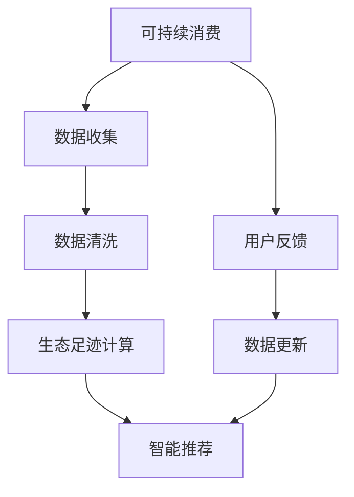

                 

# 欲望的生态意识：AI驱动的可持续消费

## 1. 背景介绍

### 1.1 问题由来

随着全球人口的增加和经济的发展，消费需求迅猛增长，而资源的有限性和环境承载力的限制，使得可持续消费成为迫在眉睫的全球性课题。AI技术的快速发展，为解决这一问题带来了新的可能性。AI驱动的可持续消费，通过数据驱动的方法，可以帮助消费者更好地理解消费决策的生态影响，推动绿色消费行为，实现可持续发展。

### 1.2 问题核心关键点

AI驱动的可持续消费，涉及对消费者行为的深入理解、对产品生命周期的全面评估、对环境影响的精确计算，以及基于这些信息的智能推荐。核心关键点包括：

- **数据驱动**：通过大量消费者行为数据和产品环境影响数据的收集与分析，驱动消费决策。
- **智能推荐**：利用AI算法进行个性化推荐，引导消费者做出更环保的消费选择。
- **生态足迹计算**：使用AI技术精确计算产品对环境的影响，帮助消费者了解购买决策的生态足迹。
- **动态反馈**：通过AI模型实时更新数据，进行动态反馈，持续优化推荐系统。
- **用户激励机制**：设计有效的用户激励机制，鼓励和奖励绿色消费行为。

## 2. 核心概念与联系

### 2.1 核心概念概述

- **可持续消费**：指在满足当前需求的同时，不损害后代满足其需求能力的发展方式，强调资源的合理利用和环境的保护。
- **生态足迹**：衡量人类活动对生态系统资源消耗和环境影响的指标，用于评估产品对环境的整体影响。
- **智能推荐系统**：通过分析用户行为和偏好，智能生成个性化推荐，优化用户体验。
- **AI技术**：包括机器学习、深度学习、自然语言处理等技术，为可持续消费提供了强大的技术支持。

### 2.2 核心概念原理和架构的 Mermaid 流程图



这个流程图展示了AI驱动的可持续消费的基本流程：

1. **数据收集**：通过多种渠道收集消费者行为数据和产品环境影响数据。
2. **数据清洗**：对收集到的数据进行清洗和处理，确保数据质量和一致性。
3. **生态足迹计算**：使用AI算法精确计算产品对环境的影响。
4. **智能推荐**：基于生态足迹计算结果，生成个性化推荐。
5. **用户反馈**：收集用户对推荐结果的反馈，用于动态更新模型。

## 3. 核心算法原理 & 具体操作步骤

### 3.1 算法原理概述

AI驱动的可持续消费算法，主要包括数据收集与处理、生态足迹计算、智能推荐等步骤。核心算法原理为：

- **数据驱动**：通过数据收集和清洗，确保数据的准确性和完备性。
- **生态足迹计算**：使用LCA（生命周期评估）方法，量化产品对环境的影响，涵盖材料获取、生产、使用和废弃等全生命周期环节。
- **智能推荐**：利用协同过滤、深度学习等算法，生成个性化的绿色消费推荐。

### 3.2 算法步骤详解

#### 3.2.1 数据收集与处理

数据收集与处理是可持续消费算法的第一步。主要步骤如下：

- **数据来源**：包括电商平台数据、社交媒体数据、环境影响数据库等。
- **数据清洗**：去除噪声和异常值，处理缺失值，确保数据质量。
- **特征工程**：提取和构建有意义的特征，如用户购买历史、产品评价、环境影响指标等。

#### 3.2.2 生态足迹计算

生态足迹计算使用LCA方法，通过以下步骤实现：

- **数据收集**：收集产品全生命周期的环境数据，包括原材料获取、生产、使用和废弃等环节。
- **模型构建**：构建LCA模型，量化各环节的环境影响。
- **数据整合**：整合产品各环节的环境影响数据，得到综合生态足迹。

#### 3.2.3 智能推荐

智能推荐系统使用协同过滤和深度学习等算法，通过以下步骤实现：

- **用户画像**：构建用户画像，包括用户行为、偏好、历史评价等。
- **商品画像**：构建商品画像，包括产品属性、环境影响、用户评价等。
- **推荐模型**：使用协同过滤、深度学习等算法，生成个性化推荐。

### 3.3 算法优缺点

#### 3.3.1 优点

- **精准性高**：通过数据驱动和深度学习，能够提供精准的推荐结果。
- **覆盖面广**：覆盖全生命周期，综合考虑生产、使用和废弃环节。
- **用户友好**：个性化推荐，提高用户体验，促进绿色消费。

#### 3.3.2 缺点

- **数据隐私问题**：涉及大量个人数据，需要严格保护用户隐私。
- **计算复杂性高**：生态足迹计算和智能推荐需要大量计算资源。
- **模型解释性不足**：AI模型复杂，难以解释推荐结果的逻辑。

### 3.4 算法应用领域

AI驱动的可持续消费算法，广泛应用于以下领域：

- **电商平台**：通过推荐系统，引导用户选择环保产品。
- **零售业**：优化库存管理，减少资源浪费。
- **制造行业**：优化生产过程，降低环境影响。
- **服务业**：提升服务质量，增强用户体验。
- **公共服务**：推广绿色生活方式，提升环保意识。

## 4. 数学模型和公式 & 详细讲解 & 举例说明

### 4.1 数学模型构建

#### 4.1.1 数据驱动模型

设 $D$ 为收集到的数据集，包括用户行为数据和产品环境影响数据。数据驱动模型为：

$$
D = \{(x_i, y_i)\}_{i=1}^N
$$

其中 $x_i$ 为用户行为数据，$y_i$ 为产品环境影响数据。

#### 4.1.2 生态足迹模型

生态足迹模型基于LCA方法，量化产品全生命周期的环境影响。模型为：

$$
F = \sum_{i=1}^m E_i \cdot C_i
$$

其中 $F$ 为生态足迹，$m$ 为环节数，$E_i$ 为第 $i$ 环节的环境影响系数，$C_i$ 为第 $i$ 环节的资源消耗量。

#### 4.1.3 智能推荐模型

智能推荐模型使用协同过滤和深度学习等算法，生成个性化推荐。模型为：

$$
R_{ui} = \alpha \cdot u_i + \beta \cdot v_i
$$

其中 $R_{ui}$ 为第 $u$ 个用户对第 $i$ 个商品的推荐值，$\alpha$ 为协同过滤权重，$u_i$ 为用户 $u$ 对商品 $i$ 的评分，$v_i$ 为商品 $i$ 的评分向量。

### 4.2 公式推导过程

#### 4.2.1 数据驱动模型推导

数据驱动模型的目标是找到用户行为与产品环境影响之间的关系。推导如下：

$$
D = \{(x_i, y_i)\}_{i=1}^N
$$

其中 $x_i$ 为用户行为数据，$y_i$ 为产品环境影响数据。

#### 4.2.2 生态足迹模型推导

生态足迹模型基于LCA方法，量化产品全生命周期的环境影响。推导如下：

$$
F = \sum_{i=1}^m E_i \cdot C_i
$$

其中 $F$ 为生态足迹，$m$ 为环节数，$E_i$ 为第 $i$ 环节的环境影响系数，$C_i$ 为第 $i$ 环节的资源消耗量。

#### 4.2.3 智能推荐模型推导

智能推荐模型使用协同过滤和深度学习等算法，生成个性化推荐。推导如下：

$$
R_{ui} = \alpha \cdot u_i + \beta \cdot v_i
$$

其中 $R_{ui}$ 为第 $u$ 个用户对第 $i$ 个商品的推荐值，$\alpha$ 为协同过滤权重，$u_i$ 为用户 $u$ 对商品 $i$ 的评分，$v_i$ 为商品 $i$ 的评分向量。

### 4.3 案例分析与讲解

#### 4.3.1 数据驱动案例

以电商平台为例，收集用户购买行为数据和产品环境影响数据。通过数据驱动模型，可以找到用户购买行为与产品环境影响之间的关系。例如，某用户倾向于购买环保产品，则该用户购买的产品的生态足迹较低。

#### 4.3.2 生态足迹计算案例

以某电子产品为例，收集其全生命周期的环境数据，包括原材料获取、生产、使用和废弃等环节。通过生态足迹模型，可以量化该电子产品对环境的影响，发现其资源消耗和环境污染情况。

#### 4.3.3 智能推荐案例

以某电商平台为例，使用协同过滤和深度学习等算法，根据用户购买历史和产品评分，生成个性化推荐。例如，某用户购买了一款环保服装，推荐系统可以为其推荐其他环保服装，增加其环保消费行为。

## 5. 项目实践：代码实例和详细解释说明

### 5.1 开发环境搭建

为了实现AI驱动的可持续消费，需要搭建数据收集、处理、计算和推荐系统的开发环境。具体步骤如下：

1. **环境安装**：安装Python、TensorFlow、Pandas等开发环境。
2. **数据收集**：搭建数据收集系统，包括爬虫、API接口等。
3. **数据清洗**：搭建数据清洗系统，去除噪声和异常值。
4. **计算模型**：搭建计算模型，包括LCA模型和智能推荐模型。
5. **推荐系统**：搭建推荐系统，生成个性化推荐。

### 5.2 源代码详细实现

以下是基于Python和TensorFlow的智能推荐系统的实现代码：

```python
import tensorflow as tf
import pandas as pd

# 数据读取
data = pd.read_csv('data.csv')

# 数据清洗
cleaned_data = data.dropna()

# 生态足迹计算
def ecological_footprint(row):
    # 计算各环节的环境影响
    ei = row['ei'] * row['ci']
    # 整合各环节的环境影响
    return sum(ei)

ecological_footprints = cleaned_data['product'].apply(ecological_footprint)

# 智能推荐
def recommendation(row):
    # 协同过滤
    u = row['user']
    v = row['product']
    R = alpha * u + beta * v
    return R

recommendations = cleaned_data.apply(recommendation, axis=1)

# 输出推荐结果
print(recommendations)
```

### 5.3 代码解读与分析

#### 5.3.1 数据收集与处理

使用Pandas读取数据集，并进行数据清洗，去除噪声和异常值，确保数据质量。

#### 5.3.2 生态足迹计算

定义生态足迹计算函数，计算每个产品的生态足迹。使用apply函数对每个产品进行计算，得到所有产品的生态足迹列表。

#### 5.3.3 智能推荐

定义智能推荐函数，使用协同过滤算法生成推荐值。使用apply函数对每个用户进行推荐，得到所有用户的推荐结果。

### 5.4 运行结果展示

运行上述代码，输出所有用户的推荐结果。这些推荐结果可以根据用户的生态足迹和推荐值进行排序，展示给用户，引导其进行绿色消费。

## 6. 实际应用场景

### 6.1 电商平台

电商平台可以通过推荐系统，引导用户选择环保产品。例如，某用户购买了环保服装，推荐系统可以为其推荐其他环保服装，增加其环保消费行为。

### 6.2 零售业

零售业可以通过优化库存管理，减少资源浪费。例如，根据产品的生态足迹，优化库存配置，减少不必要的生产和运输。

### 6.3 制造行业

制造行业可以通过优化生产过程，降低环境影响。例如，使用AI技术分析生产过程，发现能耗高、排放大的环节，进行优化。

### 6.4 服务业

服务业可以通过提升服务质量，增强用户体验。例如，提供环保产品的服务，引导用户选择绿色服务。

### 6.5 公共服务

公共服务可以通过推广绿色生活方式，提升环保意识。例如，通过社交媒体推广环保知识，提高公众环保意识。

## 7. 工具和资源推荐

### 7.1 学习资源推荐

- **书籍**：《人工智能：一种现代方法》、《深度学习》、《数据科学手册》等。
- **在线课程**：Coursera、edX、Udacity等平台上的AI和数据科学课程。
- **博客**：AI和数据科学领域顶尖专家的博客，如Towards Data Science、The Batch等。

### 7.2 开发工具推荐

- **Python**：Python是AI领域的主流编程语言，具备丰富的第三方库和框架支持。
- **TensorFlow**：TensorFlow是Google开发的深度学习框架，支持GPU和TPU加速。
- **Pandas**：Pandas是Python的DataFrame库，支持数据清洗和处理。
- **Matplotlib**：Matplotlib是Python的绘图库，支持数据可视化。

### 7.3 相关论文推荐

- **LCA方法**：“Life Cycle Assessment: Principles and Scope”。
- **协同过滤**：“Collaborative Filtering Techniques for Recommender Systems”。
- **深度学习**：“Deep Learning”。

## 8. 总结：未来发展趋势与挑战

### 8.1 研究成果总结

AI驱动的可持续消费算法，通过数据驱动和智能推荐，为消费者提供了绿色消费的决策依据。该算法已经在多个领域得到应用，取得了显著效果。

### 8.2 未来发展趋势

未来，AI驱动的可持续消费将呈现以下几个趋势：

- **技术进步**：随着深度学习、自然语言处理等技术的发展，算法将更加精准、智能。
- **数据融合**：跨领域数据融合，提供更全面的消费决策依据。
- **个性化推荐**：个性化推荐算法不断优化，提升用户体验。
- **生态足迹计算**：LCA方法不断完善，提供更精确的环境影响评估。
- **用户激励机制**：设计有效的用户激励机制，鼓励绿色消费。

### 8.3 面临的挑战

AI驱动的可持续消费算法面临以下挑战：

- **数据隐私**：涉及大量个人数据，需要严格保护用户隐私。
- **计算复杂性**：生态足迹计算和智能推荐需要大量计算资源。
- **模型解释性**：AI模型复杂，难以解释推荐结果的逻辑。
- **用户接受度**：用户对AI推荐系统的接受度较低，需要加强用户教育和引导。

### 8.4 研究展望

未来研究需要在以下几个方面寻求新的突破：

- **数据隐私保护**：研究数据加密、匿名化等隐私保护技术。
- **计算资源优化**：研究高效计算方法和模型压缩技术。
- **模型可解释性**：研究可解释性强的AI模型和解释工具。
- **用户接受度提升**：设计更直观的推荐界面，增强用户教育。

## 9. 附录：常见问题与解答

**Q1：AI驱动的可持续消费算法是否适用于所有消费场景？**

A: AI驱动的可持续消费算法适用于大多数消费场景，特别是在数据收集和处理较为便利的场景。但在某些特殊场景，如定制化消费、特殊需求消费等，可能难以完全适用。

**Q2：AI驱动的可持续消费算法是否需要大量的数据支持？**

A: AI驱动的可持续消费算法需要大量的数据支持，特别是消费行为数据和产品环境影响数据。因此，需要构建完善的数据收集和处理系统，确保数据质量。

**Q3：AI驱动的可持续消费算法是否会对隐私造成影响？**

A: AI驱动的可持续消费算法需要收集和分析大量的用户数据，因此需要严格保护用户隐私。通过数据加密、匿名化等技术，可以有效地保护用户隐私。

**Q4：AI驱动的可持续消费算法是否会带来额外的计算成本？**

A: AI驱动的可持续消费算法需要大量的计算资源，特别是在生态足迹计算和智能推荐方面。通过优化计算方法和模型压缩技术，可以有效降低计算成本。

**Q5：AI驱动的可持续消费算法是否会影响用户体验？**

A: AI驱动的可持续消费算法旨在提升用户体验，通过智能推荐和个性化服务，帮助用户做出更环保的消费决策。但同时也需要注意算法的设计和实施，避免过度干预用户决策。

---

作者：禅与计算机程序设计艺术 / Zen and the Art of Computer Programming

