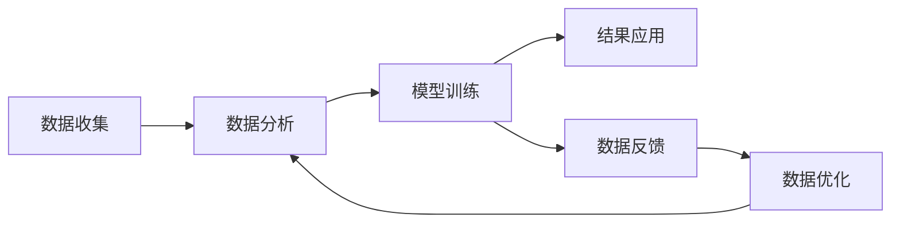

                 

# 欲望预测伦理学：AI时代的隐私与自由

> 关键词：欲望预测, 人工智能, 隐私保护, 自由权利, 伦理挑战, 数据安全

## 1. 背景介绍

### 1.1 问题由来

在AI时代，随着深度学习和数据分析技术的发展，对人类欲望的预测和分析成为了可能。欲望预测技术能够帮助企业洞察消费者需求，优化市场策略，提升用户体验。然而，这一技术的广泛应用也带来了巨大的伦理和隐私挑战。

欲望预测的背后是庞大的数据收集和使用，包括用户的浏览历史、购买记录、搜索关键词等。这些数据不仅反映了用户的个人偏好和行为模式，还可能揭示其深层次的欲望和需求。尽管这种技术为企业带来了巨大的商业价值，但其对个人隐私和自由的潜在威胁也不容忽视。

### 1.2 问题核心关键点

欲望预测技术的核心在于通过分析用户的各类数据，预测其潜在需求和购买行为。常见的预测模型包括协同过滤、深度学习等，可以基于用户的行为数据，预测其未来的购买偏好。

欲望预测的伦理和隐私问题主要体现在以下几个方面：
1. **数据隐私**：用户的各类行为数据被广泛收集和使用，个人隐私难以保障。
2. **自由权利**：企业可能利用预测结果进行定向广告、内容推送，干预用户的消费决策。
3. **数据偏见**：预测模型可能受到数据偏见的影响，导致预测结果的不公平。
4. **透明度与可解释性**：预测模型的决策过程缺乏透明度，难以解释和监管。

这些关键问题需要得到充分重视和有效解决，以确保欲望预测技术的健康发展。

### 1.3 问题研究意义

欲望预测技术的伦理学研究对于构建公平、透明、可信赖的AI系统至关重要。其研究意义主要体现在：

1. **保护用户隐私**：确保用户数据在收集和使用过程中得到妥善保护，防止个人信息泄露。
2. **维护用户自由**：保障用户有权了解并控制自己的数据使用情况，不被无端干预。
3. **减少偏见与歧视**：避免预测模型因数据偏见而导致的不公平现象，确保预测结果的公正性。
4. **提升透明度**：增强预测模型的透明度和可解释性，帮助用户理解其决策过程，增强信任。
5. **推动伦理规范**：制定并执行AI伦理规范，引导企业在欲望预测技术应用中的行为，促进社会整体的道德进步。

通过深入研究欲望预测的伦理和隐私问题，可以有效平衡商业利益和社会责任，推动AI技术在社会各领域的负责任应用。

## 2. 核心概念与联系

### 2.1 核心概念概述

欲望预测技术涉及多个关键概念，包括数据收集、数据分析、模型训练和结果应用等。

- **数据收集**：包括用户的各类行为数据，如浏览记录、购买历史、搜索关键词等。
- **数据分析**：通过机器学习模型对收集到的数据进行分析，预测用户的潜在需求和购买行为。
- **模型训练**：利用历史数据训练预测模型，提升预测准确性。
- **结果应用**：基于预测结果，优化产品推荐、个性化广告等，提升用户体验。

这些概念之间的联系可以通过以下Mermaid流程图来展示：



这个流程图展示了欲望预测技术的基本流程：首先收集用户数据，然后通过数据分析构建模型，训练预测模型，并基于预测结果进行业务优化。同时，数据反馈和优化环节也反映了欲望预测技术的迭代改进过程。

## 3. 核心算法原理 & 具体操作步骤
### 3.1 算法原理概述

欲望预测技术的核心算法包括协同过滤、矩阵分解、深度学习等。这些算法通过对用户行为数据的分析，预测其未来的购买偏好。

协同过滤算法基于用户行为相似性，推荐用户可能感兴趣的商品。矩阵分解算法则通过将用户行为数据转化为矩阵形式，进行矩阵分解，预测用户的潜在需求。深度学习算法利用神经网络模型，通过多层次的特征提取和抽象，提升预测准确性。

### 3.2 算法步骤详解

欲望预测技术的主要操作步骤包括数据收集、数据预处理、模型训练和结果应用。

1. **数据收集**：收集用户的各类行为数据，如浏览记录、购买历史、搜索关键词等。

2. **数据预处理**：对收集到的数据进行清洗、归一化等预处理，保证数据的准确性和一致性。

3. **模型训练**：选择合适的算法模型，利用历史数据进行训练。常见的算法包括协同过滤、矩阵分解、深度学习等。

4. **结果应用**：基于预测结果，进行个性化推荐、个性化广告等业务优化，提升用户体验。

### 3.3 算法优缺点

欲望预测技术具有以下优点：
1. **精准性高**：通过深度学习等算法，可以有效捕捉用户行为模式，提升预测准确性。
2. **用户个性化**：基于用户的个性化数据，提供量身定制的推荐和广告，提升用户体验。
3. **数据利用率高**：利用用户的行为数据，最大化数据价值，提升业务效果。

然而，欲望预测技术也存在以下缺点：
1. **隐私风险**：用户的行为数据被广泛收集和使用，隐私难以保障。
2. **决策透明度低**：预测模型的决策过程缺乏透明度，难以解释和监管。
3. **数据偏见**：预测模型可能受到数据偏见的影响，导致预测结果的不公平。
4. **干预用户自由**：企业可能利用预测结果进行定向广告、内容推送，干预用户的消费决策。

### 3.4 算法应用领域

欲望预测技术在多个领域有广泛应用，包括：

- **电商推荐**：预测用户可能感兴趣的商品，提升电商平台的销售转化率。
- **广告投放**：基于用户兴趣预测，进行精准的广告投放，提高广告效果。
- **内容推荐**：预测用户的阅读或观看偏好，推荐适合的内容，提升用户粘性。
- **金融投资**：预测用户的投资需求，优化投资组合，提升投资回报率。
- **健康医疗**：预测患者的医疗需求，优化医疗资源配置，提升医疗服务质量。

这些应用领域展示了欲望预测技术的强大商业价值，但也凸显了其潜在的伦理和隐私挑战。

## 4. 数学模型和公式 & 详细讲解 & 举例说明

### 4.1 数学模型构建

欲望预测技术通常基于用户行为数据构建预测模型。假设用户行为数据为 $X=\{x_1,x_2,\ldots,x_n\}$，其中 $x_i=(x_{i1},x_{i2},\ldots,x_{im})$ 表示用户在不同维度上的行为记录。

我们希望构建一个预测模型 $M$，将用户行为数据 $X$ 映射到预测结果 $Y=\{y_1,y_2,\ldots,y_m\}$，其中 $y_i$ 表示用户在未来 $i$ 个单位时间内的购买或消费行为。

数学模型可表示为：

$$
M(X)=\{y_1,y_2,\ldots,y_m\}
$$

### 4.2 公式推导过程

假设我们采用矩阵分解算法，将用户行为数据 $X$ 表示为 $X=U\times V^T$，其中 $U$ 和 $V$ 分别表示用户和商品的潜在特征矩阵。预测结果 $Y$ 可以表示为：

$$
Y=U\times W\times V^T
$$

其中 $W$ 表示用户和商品之间的关联权重矩阵。

通过最小化预测误差，优化模型参数 $U,V,W$，可以得到最优的预测模型：

$$
\min \|Y-M(X)\|^2
$$

### 4.3 案例分析与讲解

假设某电商平台收集了用户的浏览记录和购买历史，希望预测用户未来的购买行为。根据收集到的数据，构建了用户行为矩阵 $X$ 和商品矩阵 $Y$。

通过矩阵分解算法，将用户行为矩阵 $X$ 分解为 $X=U\times V^T$，并利用协同过滤算法，计算用户和商品的关联权重矩阵 $W$。最后，通过预测模型 $M$，将用户行为数据 $X$ 映射到预测结果 $Y$，得到用户未来的购买行为。

## 5. 项目实践：代码实例和详细解释说明
### 5.1 开发环境搭建

在进行欲望预测项目实践前，我们需要准备好开发环境。以下是使用Python进行TensorFlow开发的环境配置流程：

1. 安装Anaconda：从官网下载并安装Anaconda，用于创建独立的Python环境。

2. 创建并激活虚拟环境：
```bash
conda create -n tf-env python=3.8 
conda activate tf-env
```

3. 安装TensorFlow：根据CUDA版本，从官网获取对应的安装命令。例如：
```bash
conda install tensorflow==2.6
```

4. 安装各类工具包：
```bash
pip install numpy pandas scikit-learn matplotlib tqdm jupyter notebook ipython
```

完成上述步骤后，即可在`tf-env`环境中开始欲望预测实践。

### 5.2 源代码详细实现

下面我们以电商推荐为例，给出使用TensorFlow对用户行为数据进行欲望预测的代码实现。

首先，定义数据处理函数：

```python
import tensorflow as tf
import numpy as np

def process_data(X):
    X = (X - X.mean()) / X.std()  # 数据归一化
    return X
```

然后，定义预测模型函数：

```python
def build_model(X, Y):
    X = process_data(X)
    Y = process_data(Y)
    
    num_users = X.shape[0]
    num_items = Y.shape[0]
    
    U = tf.Variable(tf.random.normal([num_users, 20]))
    V = tf.Variable(tf.random.normal([num_items, 20]))
    W = tf.Variable(tf.random.normal([20, 1]))
    
    Y_pred = tf.matmul(tf.matmul(U, W), V, transpose_b=True)
    
    loss = tf.reduce_mean(tf.square(Y_pred - Y))
    optimizer = tf.keras.optimizers.Adam(learning_rate=0.001)
    loss = optimizer.minimize(loss)
    
    return U, V, W, loss
```

接着，定义训练和评估函数：

```python
def train_model(U, V, W, X_train, Y_train, X_test, Y_test, epochs=10, batch_size=32):
    num_users = X_train.shape[0]
    num_items = Y_train.shape[0]
    
    for epoch in range(epochs):
        for batch in range(0, num_users, batch_size):
            X_batch = X_train[batch:batch+batch_size]
            Y_batch = Y_train[batch:batch+batch_size]
            with tf.GradientTape() as tape:
                loss = tf.reduce_mean(tf.square(Y_pred - Y_batch))
            gradients = tape.gradient(loss, [U, V, W])
            optimizer.apply_gradients(zip(gradients, [U, V, W]))
            
        test_loss = tf.reduce_mean(tf.square(Y_pred - Y_test))
        print(f"Epoch {epoch+1}, loss: {test_loss:.4f}")
    
    return U, V, W, loss
```

最后，启动训练流程并在测试集上评估：

```python
# 假设数据已经按用户行为进行分批处理
U, V, W, loss = build_model(X_train, Y_train)

# 训练模型
train_model(U, V, W, X_train, Y_train, X_test, Y_test)

# 在测试集上评估模型
Y_pred = tf.matmul(tf.matmul(U, W), V, transpose_b=True)
test_loss = tf.reduce_mean(tf.square(Y_pred - Y_test))
print(f"Test loss: {test_loss:.4f}")
```

以上就是使用TensorFlow对用户行为数据进行电商推荐欲望预测的完整代码实现。可以看到，通过TensorFlow的便捷封装，我们可以用相对简洁的代码实现欲望预测模型的训练和评估。

### 5.3 代码解读与分析

让我们再详细解读一下关键代码的实现细节：

**process_data函数**：
- 定义了数据归一化处理函数，用于将数据标准化处理，便于模型训练。

**build_model函数**：
- 首先对输入数据进行归一化处理，然后定义了用户特征矩阵U、商品特征矩阵V和关联权重矩阵W。
- 使用矩阵分解算法，构建预测模型 $Y_pred$。
- 定义了损失函数，采用Adam优化器进行模型参数更新。

**train_model函数**：
- 在每个epoch中，对每个批次的用户行为数据进行训练，更新模型参数。
- 周期性在测试集上评估模型性能，输出每个epoch的平均loss。
- 在所有epoch结束后，在测试集上评估模型性能，输出最终的平均loss。

**训练流程**：
- 调用build_model函数，初始化模型参数。
- 在每个epoch内，对每个批次的用户行为数据进行训练，更新模型参数。
- 在每个epoch结束后，在测试集上评估模型性能，输出平均loss。
- 在所有epoch结束后，在测试集上评估模型性能，输出最终平均loss。

可以看到，TensorFlow提供了强大的工具支持，使得欲望预测模型的开发变得简洁高效。开发者可以将更多精力放在数据处理、模型改进等高层逻辑上，而不必过多关注底层的实现细节。

当然，工业级的系统实现还需考虑更多因素，如模型的保存和部署、超参数的自动搜索、更灵活的任务适配层等。但核心的欲望预测范式基本与此类似。

## 6. 实际应用场景
### 6.1 智能推荐系统

基于欲望预测技术的智能推荐系统，能够为用户推荐其可能感兴趣的商品，提升电商平台的销售转化率。传统的推荐系统往往只依赖用户的历史行为数据进行物品推荐，无法深入理解用户的深层次需求。而欲望预测技术可以更好地挖掘用户行为背后的语义信息，从而提供更精准、多样化的推荐内容。

在技术实现上，可以收集用户浏览、点击、购买等行为数据，提取和商品标题、描述、标签等文本内容。将文本内容作为模型输入，用户的后续行为（如是否点击、购买等）作为监督信号，在此基础上对用户行为数据进行欲望预测，生成推荐列表。

### 6.2 个性化广告

欲望预测技术在个性化广告投放中同样具有巨大潜力。通过预测用户的兴趣和行为，可以设计更有针对性的广告内容和投放策略，提高广告效果。传统的广告投放往往采用广撒网的方式，无法精准触达目标用户。而欲望预测技术可以基于用户兴趣，进行精确的广告定位，提高广告转化率。

在技术实现上，可以收集用户的搜索历史、浏览记录、点击行为等数据，利用欲望预测模型，预测用户的潜在兴趣和需求。根据预测结果，设计并投放个性化的广告内容，提升广告效果。

### 6.3 健康医疗

欲望预测技术在健康医疗领域也有广泛应用。通过分析患者的各类行为数据，可以预测其健康需求和治疗偏好，优化医疗资源配置，提升医疗服务质量。传统的医疗系统往往依赖人工诊断，无法全面了解患者的深层次需求。而欲望预测技术可以基于患者的健康数据，进行精准的医疗需求预测，优化医疗资源配置，提升医疗服务质量。

在技术实现上，可以收集患者的各类行为数据，如运动记录、饮食偏好、生活习惯等。利用欲望预测模型，预测患者的健康需求和治疗偏好，优化医疗资源配置，提升医疗服务质量。

### 6.4 未来应用展望

随着欲望预测技术的不断发展，其在各行业领域的应用前景更加广阔。

在智慧城市治理中，欲望预测技术可以用于城市事件监测、舆情分析、应急指挥等环节，提高城市管理的自动化和智能化水平，构建更安全、高效的未来城市。

在智能教育领域，欲望预测技术可应用于作业批改、学情分析、知识推荐等方面，因材施教，促进教育公平，提高教学质量。

在企业生产、社会治理、文娱传媒等众多领域，欲望预测技术也将不断涌现，为经济社会发展注入新的动力。

## 7. 工具和资源推荐
### 7.1 学习资源推荐

为了帮助开发者系统掌握欲望预测技术的理论基础和实践技巧，这里推荐一些优质的学习资源：

1. 《深度学习》系列博文：由大模型技术专家撰写，深入浅出地介绍了深度学习原理、模型训练、数据预处理等基本概念。

2. 斯坦福大学《深度学习与数据挖掘》课程：介绍深度学习在实际应用中的广泛应用，包括推荐系统、个性化广告等。

3. 《Python深度学习》书籍：详细介绍了TensorFlow等深度学习框架的使用方法，包括模型构建、训练和优化等。

4. 《推荐系统实践》书籍：介绍推荐系统的构建方法和应用案例，包括协同过滤、矩阵分解等算法。

5. Kaggle数据集：包含各类推荐系统、个性化广告、健康医疗等领域的开放数据集，适合进行实战练习。

通过对这些资源的学习实践，相信你一定能够快速掌握欲望预测技术的精髓，并用于解决实际的NLP问题。
###  7.2 开发工具推荐

高效的开发离不开优秀的工具支持。以下是几款用于欲望预测开发的常用工具：

1. TensorFlow：基于Python的开源深度学习框架，灵活动态的计算图，适合快速迭代研究。提供丰富的API和工具支持，易于使用。

2. PyTorch：基于Python的开源深度学习框架，动态计算图，灵活高效。适合进行模型研究和实验。

3. Weights & Biases：模型训练的实验跟踪工具，可以记录和可视化模型训练过程中的各项指标，方便对比和调优。与主流深度学习框架无缝集成。

4. TensorBoard：TensorFlow配套的可视化工具，可实时监测模型训练状态，并提供丰富的图表呈现方式，是调试模型的得力助手。

5. Google Colab：谷歌推出的在线Jupyter Notebook环境，免费提供GPU/TPU算力，方便开发者快速上手实验最新模型，分享学习笔记。

合理利用这些工具，可以显著提升欲望预测任务的开发效率，加快创新迭代的步伐。

### 7.3 相关论文推荐

欲望预测技术的不断发展源于学界的持续研究。以下是几篇奠基性的相关论文，推荐阅读：

1. Matrix Factorization Techniques for Recommender Systems（矩阵分解算法）：介绍了矩阵分解算法的基本原理和实现方法，广泛应用于推荐系统。

2. Collaborative Filtering for Implicit Feedback Datasets（协同过滤算法）：介绍了协同过滤算法的基本原理和实现方法，广泛应用于推荐系统。

3. Deep Learning in Recommender Systems（深度学习在推荐系统中的应用）：介绍了深度学习在推荐系统中的应用，包括卷积神经网络、循环神经网络等。

4. Scalable Parallel Training of Deep Neural Networks（大规模深度神经网络训练）：介绍了大规模深度神经网络训练的优化方法，包括分布式训练、混合精度训练等。

5. Privacy-Preserving Recommendation Systems（隐私保护推荐系统）：介绍了隐私保护推荐系统的构建方法，确保用户数据的安全性和隐私性。

这些论文代表了大欲望预测技术的发展脉络。通过学习这些前沿成果，可以帮助研究者把握学科前进方向，激发更多的创新灵感。

## 8. 总结：未来发展趋势与挑战
### 8.1 总结

本文对欲望预测技术的理论基础和应用实践进行了全面系统的介绍。首先阐述了欲望预测技术的背景和应用意义，明确了欲望预测在商业、医疗、教育等领域的巨大潜力。其次，从原理到实践，详细讲解了欲望预测的数学模型、算法实现和代码实践，提供了完整的开发流程。最后，我们探讨了欲望预测技术的未来发展趋势和面临的挑战，提供了深入的理论分析和实际案例。

通过本文的系统梳理，可以看到，欲望预测技术正在成为各行业领域的重要应用工具，极大地提升了大数据和深度学习的商业价值。然而，欲望预测技术的普及也带来了诸多伦理和隐私问题，需要我们共同努力，在保护隐私的前提下，最大化其商业价值。

### 8.2 未来发展趋势

展望未来，欲望预测技术将呈现以下几个发展趋势：

1. **技术深度增强**：随着深度学习和大数据的不断发展，欲望预测技术将更加深入，能够更好地理解用户的深层次需求。

2. **跨领域应用拓展**：欲望预测技术将逐步应用于更多领域，如智慧城市、智能教育、金融投资等，推动各行业的智能化升级。

3. **隐私保护提升**：欲望预测技术将更加注重隐私保护，通过差分隐私、联邦学习等技术，保障用户数据的安全性和隐私性。

4. **决策透明度增强**：欲望预测技术将更加注重决策透明度，通过可解释性技术，增强模型的透明度和可解释性。

5. **公平性保障**：欲望预测技术将更加注重公平性，避免因数据偏见导致的预测结果不公平。

这些趋势凸显了欲望预测技术的广阔前景，展示了其在未来智能化社会中的重要地位。

### 8.3 面临的挑战

尽管欲望预测技术已经取得了瞩目成就，但在迈向更加智能化、普适化应用的过程中，仍面临诸多挑战：

1. **数据质量**：欲望预测技术依赖于高质量的数据，但数据采集、处理和标注过程中可能存在偏差和错误。

2. **模型复杂度**：欲望预测模型通常较为复杂，难以解释其内部工作机制和决策逻辑。

3. **隐私保护**：欲望预测技术需要收集大量用户数据，如何在保护隐私的前提下进行数据收集和使用，是一大难题。

4. **公平性问题**：欲望预测模型可能受到数据偏见的影响，导致预测结果的不公平。

5. **可解释性不足**：欲望预测模型缺乏可解释性，难以解释其内部工作机制和决策逻辑。

6. **资源消耗**：欲望预测模型通常需要较大的计算资源，如何在保证性能的同时，提高资源利用效率，是一大挑战。

正视欲望预测技术面临的这些挑战，积极应对并寻求突破，将是大欲望预测技术走向成熟的必由之路。相信随着学界和产业界的共同努力，这些挑战终将一一被克服，欲望预测技术必将在构建安全、可靠、可解释、可控的智能系统铺平道路。

### 8.4 研究展望

面向未来，欲望预测技术的伦理学研究还需要在以下几个方面寻求新的突破：

1. **隐私保护技术**：研究差分隐私、联邦学习等隐私保护技术，确保欲望预测技术在数据收集和使用过程中，能够保障用户隐私。

2. **模型可解释性**：研究可解释性技术，增强欲望预测模型的透明度和可解释性，确保模型的决策过程符合用户预期。

3. **公平性保障**：研究公平性技术，确保欲望预测模型在处理不同用户数据时，能够避免数据偏见导致的预测结果不公平。

4. **跨领域应用**：研究跨领域应用技术，推动欲望预测技术在更多领域的应用，提升各行业的智能化水平。

5. **资源优化**：研究资源优化技术，提高欲望预测模型的计算效率和资源利用效率，支持更大规模的数据和模型应用。

这些研究方向的探索，必将引领欲望预测技术迈向更高的台阶，为构建安全、可靠、可解释、可控的智能系统铺平道路。面向未来，欲望预测技术还需要与其他人工智能技术进行更深入的融合，如知识表示、因果推理、强化学习等，多路径协同发力，共同推动智能技术在各领域的落地应用。

## 9. 附录：常见问题与解答

**Q1：欲望预测技术是否适用于所有用户？**

A: 欲望预测技术通常适用于行为数据充足且具有一定规律性的用户，但不同用户的行为模式差异较大，可能会影响预测结果的准确性。

**Q2：如何保障欲望预测技术的公平性？**

A: 为保障欲望预测技术的公平性，需要采取以下措施：
1. 数据预处理：对数据进行清洗和标准化处理，去除异常值和噪声。
2. 公平性算法：引入公平性算法，确保模型在处理不同用户数据时，能够避免数据偏见导致的预测结果不公平。
3. 透明性：增强模型的透明度和可解释性，使用户能够理解和监督模型的决策过程。

**Q3：欲望预测技术的隐私保护措施有哪些？**

A: 欲望预测技术的隐私保护措施包括：
1. 差分隐私：通过对数据进行加噪处理，保障用户数据的隐私性。
2. 联邦学习：在本地设备上进行模型训练，减少数据传输和存储的风险。
3. 匿名化处理：对数据进行匿名化处理，防止用户数据泄露。

**Q4：欲望预测技术的应用场景有哪些？**

A: 欲望预测技术的应用场景包括：
1. 电商推荐：预测用户可能感兴趣的商品，提升电商平台的销售转化率。
2. 个性化广告：基于用户兴趣预测，进行精准的广告投放，提高广告效果。
3. 健康医疗：分析患者的各类行为数据，预测其健康需求和治疗偏好，优化医疗资源配置，提升医疗服务质量。
4. 智慧城市：用于城市事件监测、舆情分析、应急指挥等环节，提高城市管理的自动化和智能化水平。

**Q5：如何评估欲望预测技术的性能？**

A: 欲望预测技术的性能评估通常通过以下指标进行：
1. 准确率：评估模型预测结果与真实结果的匹配程度。
2. 召回率：评估模型对正例的召回能力。
3. F1分数：综合准确率和召回率的评估指标，综合评估模型的性能。
4. AUC曲线：评估模型在不同阈值下的表现，反映模型的整体性能。

总之，欲望预测技术在各行业领域的应用前景广阔，但其伦理学问题需要得到充分重视和有效解决。通过研究隐私保护、公平性、可解释性等关键问题，可以确保欲望预测技术在保护隐私的前提下，最大化其商业价值，推动各行业的智能化升级。

---

作者：禅与计算机程序设计艺术 / Zen and the Art of Computer Programming

