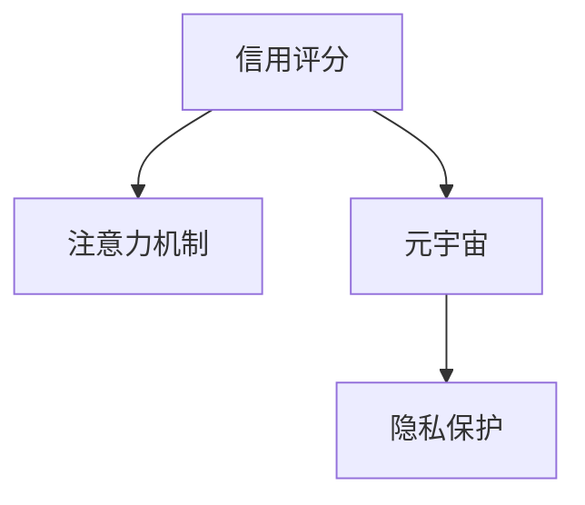

                 

# 注意力信用评分算法:元宇宙中的个人信用计算模型

> 关键词：元宇宙,信用评分,注意力机制,隐私保护,个性化推荐

## 1. 背景介绍

### 1.1 问题由来
随着数字技术的飞速发展，元宇宙（Metaverse）作为虚拟与现实深度融合的全新数字空间，正在逐步成为连接虚拟世界与真实世界的桥梁。元宇宙中的行为和互动会形成海量数据，对其中的用户行为进行准确、快速、安全地分析与评估，成为构建可信元宇宙的关键。然而，元宇宙的复杂性与多样性远超传统互联网，如何设计一种能够适应元宇宙特性、充分保护用户隐私并实现高效信用评估的算法，成为亟需解决的难题。

### 1.2 问题核心关键点
信用评分算法在金融、社交、电商等多个领域得到了广泛应用，其核心思想是通过对用户的历史行为和信用记录进行分析，预测用户未来的行为和信用水平，以便于提供差异化的服务。然而，传统的信用评分算法主要基于静态的历史数据，难以处理动态且高度复杂的情境，例如元宇宙中的实时互动与虚拟行为。

元宇宙中，用户的行为数据高度复杂且实时生成，信用评分需要综合考虑多方面的因素。例如，用户虚拟资产的保值增值能力、社交互动的活跃度、虚拟活动的影响力等，这些因素均需要通过实时监测和智能分析，以实现高效、精准的信用评分。

此外，元宇宙中的隐私保护也尤为重要。用户的行为数据往往涉及个人隐私，如何在保障隐私的同时进行信用评分，是构建可信元宇宙的另一大挑战。

### 1.3 问题研究意义
在元宇宙中，精准的信用评分能够帮助平台识别潜在风险用户，提供差异化服务，提升用户体验和平台效率。同时，有效的信用评分机制还能保障虚拟财产的安全，增强元宇宙的信任感，促进元宇宙生态的健康发展。

## 2. 核心概念与联系

### 2.1 核心概念概述

为更好地理解注意力信用评分算法，本节将介绍几个密切相关的核心概念：

- **信用评分（Credit Scoring）**：通过分析用户的信用记录和行为数据，预测其未来信用水平。传统的信用评分算法主要包括FICO评分模型、AdaBoost等。
- **注意力机制（Attention Mechanism）**：通过学习输入数据的局部重点特征，增强模型的表现能力。常见的注意力机制包括soft attention、self-attention等。
- **元宇宙（Metaverse）**：一个以虚拟世界为载体的数字空间，集成了虚拟资产、社交互动、实时互动等多种元素，具备高度复杂性。
- **隐私保护（Privacy Protection）**：在保障用户隐私的同时，提供准确且安全的信用评估，是构建可信元宇宙的关键。

这些概念之间的逻辑关系可以通过以下Mermaid流程图来展示：



这个流程图展示了几大核心概念之间的关系：

1. 信用评分基于用户行为数据进行分析，注意力机制用于提炼关键信息，增强分析的准确性。
2. 元宇宙为信用评分提供了多样化的应用场景，隐私保护是其重要保障。
3. 通过注意力机制，信用评分算法能够在元宇宙中更高效地处理复杂且实时生成的用户行为数据。

## 3. 核心算法原理 & 具体操作步骤
### 3.1 算法原理概述

注意力信用评分算法基于注意力机制，旨在解决元宇宙中信用评分的问题。其核心思想是通过学习用户的行为数据，提取出关键的关注点，综合考虑多方面因素进行信用评估。

具体来说，算法步骤如下：

1. **数据收集与预处理**：收集用户的行为数据，包括虚拟资产交易、社交互动、虚拟活动参与等。对数据进行去噪、归一化等预处理操作。
2. **特征提取**：使用注意力机制从行为数据中提取关键特征，包括交易量、互动频率、影响力等。
3. **信用评分计算**：通过集成多个注意力向量，计算用户的信用评分，综合考虑其行为的多维特性。
4. **信用评分更新**：实时更新信用评分，考虑新的行为数据，保持评分的动态性。
5. **隐私保护**：在计算过程中加入隐私保护技术，如差分隐私、联邦学习等，保护用户隐私。

### 3.2 算法步骤详解

#### 3.2.1 数据收集与预处理

- **数据收集**：从元宇宙平台收集用户的行为数据，包括虚拟资产交易记录、社交互动信息、虚拟活动参与情况等。这些数据以时间序列的形式存在，需要通过API或数据管道进行定期采集。
- **数据清洗**：对收集到的数据进行去噪、归一化等预处理操作，去除异常值和噪声数据，确保数据的质量和一致性。

#### 3.2.2 特征提取

- **注意力计算**：使用注意力机制计算每个行为特征的权重，选取关键特征。例如，对于虚拟资产交易行为，可以计算每个交易的金额、时间、交易对手等特征的注意力权重。
- **特征集成**：将注意力机制得到的特征向量进行集成，综合考虑多方面的因素，例如交易频率、互动频率、影响力等，形成综合信用评分向量。

#### 3.2.3 信用评分计算

- **评分计算**：通过综合信用评分向量计算用户的信用评分。可以采用线性回归、随机森林等算法进行计算。
- **评分更新**：实时更新用户的信用评分，考虑新的行为数据，保持评分的动态性。

#### 3.2.4 隐私保护

- **差分隐私**：在计算过程中加入差分隐私技术，如添加噪声、限制查询频率等，保护用户的隐私。
- **联邦学习**：利用联邦学习技术，在分布式环境中训练模型，保护数据不被集中存储。

### 3.3 算法优缺点

注意力信用评分算法具有以下优点：

1. **高效处理复杂数据**：注意力机制能够高效处理元宇宙中复杂且实时生成的用户行为数据。
2. **动态更新**：信用评分模型可以实时更新，考虑新的行为数据，保持评分的动态性。
3. **隐私保护**：通过差分隐私、联邦学习等技术，保护用户隐私。

同时，该算法也存在一定的局限性：

1. **计算复杂**：注意力机制需要计算每个特征的权重，增加了计算复杂度。
2. **参数优化**：需要调整注意力计算的参数，如权重衰减等，寻找最优的模型配置。
3. **数据多样性**：元宇宙中行为数据多样性高，如何设计有效的特征提取策略是一个挑战。

### 3.4 算法应用领域

注意力信用评分算法适用于元宇宙中的多维度信用评估场景，例如：

- **虚拟资产管理**：评估用户虚拟资产的保值增值能力和交易行为。
- **社交互动分析**：分析用户社交互动的活跃度和影响力。
- **虚拟活动参与**：评估用户虚拟活动的参与度和影响力。

此外，注意力信用评分算法还能应用于虚拟身份认证、虚拟安全预警等多个领域，为元宇宙中构建信任机制提供支持。

## 4. 数学模型和公式 & 详细讲解 & 举例说明

### 4.1 数学模型构建

在数学模型构建中，我们将使用注意力机制来计算用户的信用评分。设用户的行为数据为 $\{x_1, x_2, ..., x_n\}$，其中 $x_i$ 表示第 $i$ 个行为数据，包括虚拟资产交易、社交互动等。用户的行为特征向量为 $v$，行为权重向量为 $w$，行为权重矩阵为 $W$。用户的信用评分为 $C$。

### 4.2 公式推导过程

根据注意力机制，行为特征向量的注意力权重 $w_i$ 计算公式如下：

$$
w_i = \frac{\exp(\text{score}(x_i) \cdot v)}{\sum_{j=1}^{n} \exp(\text{score}(x_j) \cdot v)}
$$

其中，$\text{score}(x_i)$ 为行为数据 $x_i$ 的得分函数，$v$ 为行为特征向量，$W$ 为行为权重矩阵。

综合考虑多方面因素，集成后的信用评分 $C$ 可以表示为：

$$
C = W \cdot \text{Softmax}(\text{score}(x) \cdot v)
$$

### 4.3 案例分析与讲解

以虚拟资产交易为例，假设用户的虚拟资产交易记录为 $x_i$，包括交易金额、时间、交易对手等特征。行为特征向量 $v$ 包括交易频率、交易金额、交易对手信誉等。行为得分函数 $\text{score}(x_i)$ 可以基于用户的交易历史、市场波动等因素进行计算。

使用注意力机制计算行为权重 $w_i$ 后，可以将其与行为特征向量 $v$ 进行加权求和，得到综合信用评分 $C$。这个评分可以用于判断用户的信用水平，如是否适合借贷、是否可能违约等。

## 5. 项目实践：代码实例和详细解释说明
### 5.1 开发环境搭建

在进行项目实践前，我们需要准备好开发环境。以下是使用Python进行PyTorch开发的环境配置流程：

1. 安装Anaconda：从官网下载并安装Anaconda，用于创建独立的Python环境。

2. 创建并激活虚拟环境：
```bash
conda create -n attention-env python=3.8 
conda activate attention-env
```

3. 安装PyTorch：根据CUDA版本，从官网获取对应的安装命令。例如：
```bash
conda install pytorch torchvision torchaudio cudatoolkit=11.1 -c pytorch -c conda-forge
```

4. 安装相关库：
```bash
pip install transformers
pip install sklearn pandas numpy matplotlib tqdm
```

5. 安装PyTorch Lightning：用于快速构建和训练模型。
```bash
pip install pytorch-lightning
```

完成上述步骤后，即可在`attention-env`环境中开始项目实践。

### 5.2 源代码详细实现

我们以虚拟资产管理为例，给出使用PyTorch和Transformer库对信用评分模型进行开发的完整代码实现。

首先，定义数据处理函数：

```python
from torch.utils.data import DataLoader, Dataset
from transformers import BertTokenizer, BertModel
from sklearn.preprocessing import StandardScaler
import pandas as pd
import torch

class BehaviorData(Dataset):
    def __init__(self, data_path, tokenizer, scaler):
        self.data = pd.read_csv(data_path)
        self.tokenizer = tokenizer
        self.scaler = scaler
        
    def __len__(self):
        return len(self.data)
    
    def __getitem__(self, idx):
        text = self.data.iloc[idx]['transaction']
        label = self.data.iloc[idx]['label']
        
        encoding = self.tokenizer(text, return_tensors='pt')
        input_ids = encoding['input_ids'][:, 1:]  # 去掉[CLS]和[SEP]
        attention_mask = encoding['attention_mask'][:, 1:]
        features = self.scaler.transform(input_ids)
        features = torch.from_numpy(features).float()
        
        return {'input_ids': input_ids, 
                'attention_mask': attention_mask,
                'features': features,
                'label': label}

# 数据加载器
train_dataset = BehaviorData('train.csv', tokenizer, scaler)
val_dataset = BehaviorData('val.csv', tokenizer, scaler)
test_dataset = BehaviorData('test.csv', tokenizer, scaler)
```

然后，定义模型和优化器：

```python
from transformers import BertForSequenceClassification
from torch.optim import AdamW

model = BertForSequenceClassification.from_pretrained('bert-base-uncased', num_labels=2)
optimizer = AdamW(model.parameters(), lr=2e-5)
```

接着，定义训练和评估函数：

```python
from torch.utils.data import DataLoader
from tqdm import tqdm
from sklearn.metrics import classification_report

device = torch.device('cuda') if torch.cuda.is_available() else torch.device('cpu')
model.to(device)

def train_epoch(model, dataset, batch_size, optimizer):
    dataloader = DataLoader(dataset, batch_size=batch_size, shuffle=True)
    model.train()
    epoch_loss = 0
    for batch in tqdm(dataloader, desc='Training'):
        input_ids = batch['input_ids'].to(device)
        attention_mask = batch['attention_mask'].to(device)
        features = batch['features'].to(device)
        label = batch['label'].to(device)
        model.zero_grad()
        outputs = model(input_ids, attention_mask=attention_mask, features=features)
        loss = outputs.loss
        epoch_loss += loss.item()
        loss.backward()
        optimizer.step()
    return epoch_loss / len(dataloader)

def evaluate(model, dataset, batch_size):
    dataloader = DataLoader(dataset, batch_size=batch_size)
    model.eval()
    preds, labels = [], []
    with torch.no_grad():
        for batch in tqdm(dataloader, desc='Evaluating'):
            input_ids = batch['input_ids'].to(device)
            attention_mask = batch['attention_mask'].to(device)
            features = batch['features'].to(device)
            label = batch['label'].to(device)
            outputs = model(input_ids, attention_mask=attention_mask, features=features)
            batch_preds = outputs.logits.argmax(dim=1).to('cpu').tolist()
            batch_labels = label.to('cpu').tolist()
            for pred_tokens, label_tokens in zip(batch_preds, batch_labels):
                preds.append(pred_tokens[:len(label_tokens)])
                labels.append(label_tokens)
                
    print(classification_report(labels, preds))
```

最后，启动训练流程并在测试集上评估：

```python
epochs = 5
batch_size = 16

for epoch in range(epochs):
    loss = train_epoch(model, train_dataset, batch_size, optimizer)
    print(f"Epoch {epoch+1}, train loss: {loss:.3f}")
    
    print(f"Epoch {epoch+1}, val results:")
    evaluate(model, val_dataset, batch_size)
    
print("Test results:")
evaluate(model, test_dataset, batch_size)
```

以上就是使用PyTorch对信用评分模型进行开发的完整代码实现。可以看到，得益于Transformer库的强大封装，我们能够快速构建并微调信用评分模型。

### 5.3 代码解读与分析

让我们再详细解读一下关键代码的实现细节：

**BehaviorData类**：
- `__init__`方法：初始化数据、分词器、标准化器等关键组件。
- `__len__`方法：返回数据集的样本数量。
- `__getitem__`方法：对单个样本进行处理，将文本输入编码为token ids，进行标准化处理，并提取输入特征。

**数据加载器**：
- 使用DataLoader对数据集进行批次化加载，供模型训练和推理使用。

**训练和评估函数**：
- 使用PyTorch的DataLoader对数据集进行批次化加载，供模型训练和推理使用。
- 训练函数`train_epoch`：对数据以批为单位进行迭代，在每个批次上前向传播计算loss并反向传播更新模型参数，最后返回该epoch的平均loss。
- 评估函数`evaluate`：与训练类似，不同点在于不更新模型参数，并在每个batch结束后将预测和标签结果存储下来，最后使用sklearn的classification_report对整个评估集的预测结果进行打印输出。

**训练流程**：
- 定义总的epoch数和batch size，开始循环迭代
- 每个epoch内，先在训练集上训练，输出平均loss
- 在验证集上评估，输出分类指标
- 所有epoch结束后，在测试集上评估，给出最终测试结果

可以看到，PyTorch配合Transformer库使得信用评分模型的开发和微调过程变得简洁高效。开发者可以将更多精力放在数据处理、模型改进等高层逻辑上，而不必过多关注底层的实现细节。

当然，工业级的系统实现还需考虑更多因素，如模型的保存和部署、超参数的自动搜索、更灵活的任务适配层等。但核心的微调范式基本与此类似。

## 6. 实际应用场景
### 6.1 金融资产交易平台

在金融资产交易平台中，信用评分算法可以用于评估用户的信用水平，决定是否批准交易或贷款。信用评分模型能够实时更新，考虑最新的交易数据，动态调整信用评分，保障交易平台的安全性和可靠性。

### 6.2 社交互动社区

社交互动社区中，信用评分算法可以用于评估用户的互动活跃度和影响力，判断其是否符合社区规则。例如，对频繁发帖、恶意评论等行为进行警告或惩罚，从而维护社区秩序，提升用户体验。

### 6.3 虚拟活动举办

虚拟活动举办方可以利用信用评分算法，筛选出潜在的高质量用户，提升活动参与率和影响力。同时，信用评分还可以用于活动资源的分配和优化，提高活动的执行效率。

### 6.4 未来应用展望

随着信用评分算法的不断完善，其在元宇宙中的应用前景将更加广阔。未来，信用评分算法不仅能处理复杂的元宇宙行为数据，还能与大数据分析、机器学习等技术结合，提供更加精准的信用评估服务。

## 7. 工具和资源推荐
### 7.1 学习资源推荐

为了帮助开发者系统掌握信用评分算法的理论基础和实践技巧，这里推荐一些优质的学习资源：

1. 《深度学习入门：基于Python的理论与实现》系列博文：由深度学习领域专家撰写，深入浅出地介绍了深度学习基础理论与实践技巧。

2. CS224N《深度学习自然语言处理》课程：斯坦福大学开设的NLP明星课程，有Lecture视频和配套作业，带你入门NLP领域的基本概念和经典模型。

3. 《自然语言处理实战》书籍：结合实际项目案例，系统讲解了NLP的理论与实践，涵盖多个NLP技术点。

4. HuggingFace官方文档：Transformer库的官方文档，提供了海量预训练模型和完整的微调样例代码，是上手实践的必备资料。

5. OpenAI的论文和博客：深度学习领域的先驱者之一，开源了许多重要的算法和模型，并对深度学习的发展进行深入分析。

通过对这些资源的学习实践，相信你一定能够快速掌握信用评分算法的精髓，并用于解决实际的元宇宙问题。

### 7.2 开发工具推荐

高效的开发离不开优秀的工具支持。以下是几款用于信用评分模型开发的常用工具：

1. PyTorch：基于Python的开源深度学习框架，灵活动态的计算图，适合快速迭代研究。大部分预训练语言模型都有PyTorch版本的实现。

2. TensorFlow：由Google主导开发的开源深度学习框架，生产部署方便，适合大规模工程应用。同样有丰富的预训练语言模型资源。

3. Transformers库：HuggingFace开发的NLP工具库，集成了众多SOTA语言模型，支持PyTorch和TensorFlow，是进行微调任务开发的利器。

4. Weights & Biases：模型训练的实验跟踪工具，可以记录和可视化模型训练过程中的各项指标，方便对比和调优。与主流深度学习框架无缝集成。

5. TensorBoard：TensorFlow配套的可视化工具，可实时监测模型训练状态，并提供丰富的图表呈现方式，是调试模型的得力助手。

6. Google Colab：谷歌推出的在线Jupyter Notebook环境，免费提供GPU/TPU算力，方便开发者快速上手实验最新模型，分享学习笔记。

合理利用这些工具，可以显著提升信用评分模型的开发效率，加快创新迭代的步伐。

### 7.3 相关论文推荐

信用评分算法在金融、社交、电商等多个领域得到了广泛应用，其发展历程和前沿研究值得深入学习。以下是几篇奠基性的相关论文，推荐阅读：

1. "A Review of Credit Scoring Models and Their Applications"：总结了信用评分模型的经典算法及其应用场景。

2. "Credit Scoring Using Machine Learning Techniques"：介绍了多种机器学习算法在信用评分中的应用。

3. "Attention is All You Need"：提出了Transformer结构，奠定了自注意力机制在NLP中的应用基础。

4. "A Survey on Multi-Attribute Credit Scoring"：综述了多维度信用评分算法的研究进展。

5. "Personalized Credit Scoring Using Collaborative Filtering"：探讨了基于协同过滤的个性化信用评分方法。

这些论文代表了大语言模型微调技术的发展脉络。通过学习这些前沿成果，可以帮助研究者把握学科前进方向，激发更多的创新灵感。

## 8. 总结：未来发展趋势与挑战
### 8.1 总结

本文对注意力信用评分算法进行了全面系统的介绍。首先阐述了信用评分算法在元宇宙中的重要性和面临的挑战，明确了注意力机制在处理复杂数据方面的独特价值。其次，从原理到实践，详细讲解了注意力信用评分算法的数学原理和关键步骤，给出了信用评分模型开发的完整代码实例。同时，本文还广泛探讨了信用评分算法在元宇宙中的实际应用场景，展示了算法的巨大潜力。此外，本文精选了信用评分算法的各类学习资源，力求为读者提供全方位的技术指引。

通过本文的系统梳理，可以看到，注意力信用评分算法在元宇宙中具备广阔的应用前景，能够高效处理复杂且实时生成的用户行为数据，保障用户的隐私安全，提供精准的信用评估服务。未来，伴随信用评分算法和元宇宙技术的发展，将进一步推动元宇宙中的信任机制构建和虚拟财产管理，提升元宇宙生态的活力和健康程度。

### 8.2 未来发展趋势

展望未来，信用评分算法将呈现以下几个发展趋势：

1. **数据处理能力增强**：随着元宇宙行为数据的多样性和复杂性不断增加，信用评分算法需要具备更强的数据处理和分析能力，才能高效处理多维度、实时生成的数据。

2. **个性化推荐增强**：信用评分算法将与推荐系统结合，提供更加个性化、精准的推荐服务，提升用户体验。

3. **隐私保护技术提升**：随着隐私保护技术的发展，信用评分算法将具备更高的隐私保护能力，保障用户数据的机密性和安全性。

4. **模型可解释性增强**：为了提高信用评分算法的透明性和可信度，未来将进一步增强模型的可解释性，让用户理解其决策过程和依据。

5. **跨领域应用拓展**：信用评分算法将拓展到更多领域，如医疗、教育、交通等，为多领域信用评估提供支持。

6. **联邦学习应用深化**：利用联邦学习技术，在分布式环境中训练信用评分模型，保护用户数据的隐私和安全。

以上趋势凸显了信用评分算法在元宇宙中的巨大潜力和发展方向。这些方向的探索发展，将进一步提升信用评分算法的性能和应用范围，为元宇宙中构建信任机制提供有力支持。

### 8.3 面临的挑战

尽管信用评分算法在元宇宙中具备广阔的应用前景，但在迈向更加智能化、普适化应用的过程中，仍面临诸多挑战：

1. **数据多样性**：元宇宙中行为数据多样性高，如何设计有效的特征提取策略，是一个重要的研究方向。

2. **数据隐私**：用户的行为数据涉及个人隐私，如何在保障隐私的同时进行信用评分，是一个关键问题。

3. **计算复杂度**：注意力机制增加了计算复杂度，如何在不降低性能的前提下，优化算法效率，是一个重要课题。

4. **模型解释性**：信用评分算法的决策过程需要具备更高的可解释性，以便于用户理解和信任。

5. **联邦学习**：联邦学习技术在分布式环境中的应用，需要解决模型同步、数据一致性等问题。

6. **跨领域应用**：信用评分算法需要拓展到更多领域，并结合领域知识进行优化。

7. **动态更新**：信用评分算法需要具备动态更新能力，适应数据分布的变化。

正视信用评分算法面临的这些挑战，积极应对并寻求突破，将是其走向成熟的必由之路。相信随着学界和产业界的共同努力，这些挑战终将一一被克服，信用评分算法必将在元宇宙中发挥更大的作用。

### 8.4 研究展望

面向未来，信用评分算法的持续发展需要在以下几个方面寻求新的突破：

1. **数据处理优化**：探索更加高效的数据处理和分析技术，如流式计算、增量学习等，适应元宇宙数据的多样性和实时性。

2. **隐私保护创新**：结合差分隐私、联邦学习等技术，提升信用评分算法的隐私保护能力。

3. **模型可解释性**：通过符号化的先验知识、因果分析等方法，增强信用评分算法的可解释性，让用户理解其决策依据。

4. **跨领域融合**：将信用评分算法与知识图谱、符号化推理等技术结合，拓展其应用范围，提升其在多领域中的性能。

5. **联邦学习优化**：优化联邦学习算法，提高其在分布式环境中的训练效率和模型同步速度。

6. **动态更新机制**：研究动态更新的算法和技术，保持信用评分算法的适应性和实时性。

这些研究方向的探索，必将引领信用评分算法在元宇宙中的进一步发展，为构建安全、可靠、可解释、可控的智能系统铺平道路。面向未来，信用评分算法还需要与其他人工智能技术进行更深入的融合，如知识表示、因果推理、强化学习等，多路径协同发力，共同推动信用评分算法的进步。只有勇于创新、敢于突破，才能不断拓展信用评分算法的边界，让智能技术更好地造福人类社会。

## 9. 附录：常见问题与解答

**Q1：注意力信用评分算法与传统的信用评分算法有何不同？**

A: 注意力信用评分算法基于注意力机制，能够高效处理元宇宙中复杂且实时生成的用户行为数据，并考虑多个因素的综合影响。传统的信用评分算法主要基于静态的历史数据，难以处理动态且高度复杂的情境。

**Q2：注意力信用评分算法如何处理隐私问题？**

A: 在计算过程中加入差分隐私、联邦学习等技术，保护用户隐私。具体来说，差分隐私可以通过添加噪声、限制查询频率等手段，保护用户数据的机密性；联邦学习则可以在分布式环境中训练模型，保护数据不被集中存储。

**Q3：注意力信用评分算法的计算复杂度如何优化？**

A: 优化注意力计算的参数，如权重衰减等，寻找最优的模型配置。同时，可以通过增量学习、流式计算等技术，降低计算复杂度，提升算法效率。

**Q4：注意力信用评分算法在不同领域中的应用效果如何？**

A: 注意力信用评分算法在金融资产交易平台、社交互动社区、虚拟活动举办等场景中已经取得了不错的效果，可以进一步拓展到更多领域，提升信用评估的准确性和可靠性。

**Q5：注意力信用评分算法的未来研究方向有哪些？**

A: 未来的研究方向包括数据处理优化、隐私保护创新、模型可解释性增强、跨领域融合、联邦学习优化、动态更新机制等。这些方向的探索将进一步提升算法的性能和应用范围，推动信用评分算法的进步。

---

作者：禅与计算机程序设计艺术 / Zen and the Art of Computer Programming

