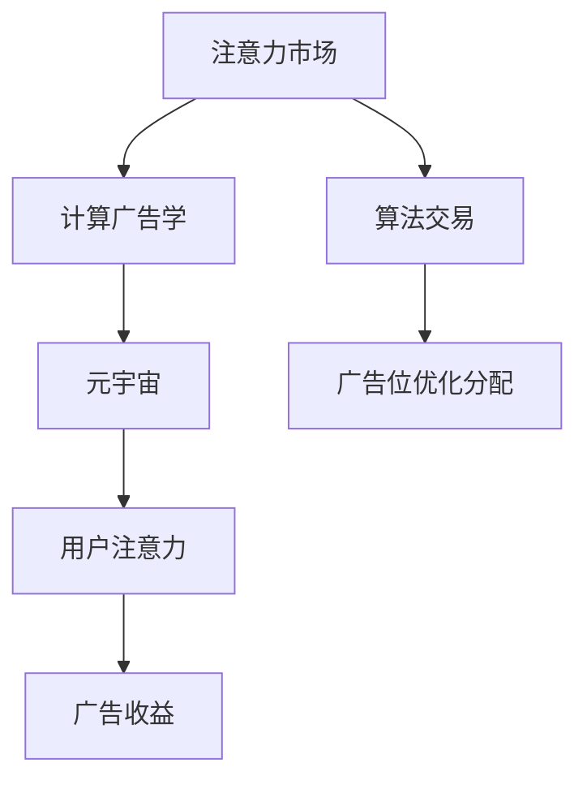
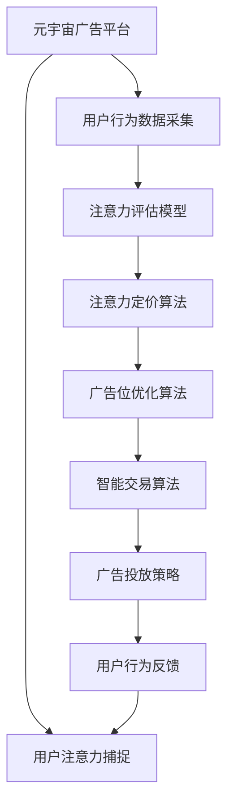

                 

# 注意力市场：元宇宙广告投放的新思路

> 关键词：元宇宙广告,注意力机制,计算广告学,算法交易,商业化应用

## 1. 背景介绍

随着Web3.0和元宇宙的兴起，虚拟世界变得越来越真实、充满无限可能。在这个数字化的乌托邦里，广告投放者试图通过多样化的信息展示来吸引用户注意，进而实现商业化应用。元宇宙广告与传统广告有很大的不同，它不依赖于屏幕展示，而是通过“身临其境”的虚拟体验，唤起用户注意力的同时，改变用户的消费行为。

### 1.1 问题由来

在传统广告投放中，投放者根据消费者群体、兴趣等特征进行目标定位，并选择相应的广告平台，如谷歌、Facebook等。这些平台通过算法优化，将广告投放到最有可能触达的目标群体中，从而达到广告主设定的目标。然而，这种基于行为数据的投放方式在元宇宙中面临诸多挑战：

1. **用户隐私保护**：虚拟环境中的用户可能不希望其行为数据被追踪和记录，这导致传统广告投放策略难以在元宇宙中直接应用。
2. **数据获取难度**：元宇宙用户行为数据更为分散和复杂，难以直接获取和分析。
3. **用户注意力分布**：虚拟世界中的用户注意力分布和真实世界有显著不同，传统的用户行为数据无法完全适配。

因此，在元宇宙广告投放中，注意力机制变得尤为重要。如何准确捕捉用户注意力，并有效地将其转化为广告收益，成为了一个亟待解决的问题。

### 1.2 问题核心关键点
元宇宙广告投放的难点在于，如何在动态变化的虚拟环境中，准确捕捉和衡量用户的注意力，并将其转化为具体的广告收益。注意力市场作为元宇宙广告投放的新思路，旨在通过计算广告学和算法交易的原理，结合元宇宙的多样化特性，实现更高效、更精准的广告投放。

**核心关键点包括：**
1. 注意力评估和定价：如何准确评估用户注意力，并确定合理的注意力价格。
2. 广告位优化分配：如何在元宇宙中动态优化广告位的分配，提升广告效果。
3. 智能算法交易：如何通过算法交易机制，最大化广告投放收益。
4. 隐私保护：如何在保证用户隐私的前提下，获取和利用注意力数据。
5. 元宇宙虚拟环境适应：如何在虚拟世界中准确捕捉和预测用户行为。

这些关键点决定了注意力市场在元宇宙广告投放中的可行性和有效性。

## 2. 核心概念与联系

### 2.1 核心概念概述

为了更好地理解注意力市场，本节将介绍几个关键概念：

- **注意力市场**：通过市场化的方式，将用户的注意力资源转化为广告收益的机制。
- **计算广告学**：利用计算机科学和大数据技术，对广告进行精准投放和效果评估的学科。
- **算法交易**：利用算法进行交易决策，以获取最大收益的策略。
- **元宇宙**：通过虚拟现实（VR）、增强现实（AR）、区块链等技术构建的虚拟空间。
- **用户注意力**：用户对某一广告或内容的关注程度，包括视线停留时间、点击率等。

这些核心概念之间的关系可以通过以下Mermaid流程图来展示：



这个流程图展示了一些核心概念之间的逻辑关系：

1. 注意力市场通过计算广告学和算法交易的原理，优化广告位的分配，从而提升广告收益。
2. 在元宇宙中，用户的注意力分布和真实世界不同，需要通过元宇宙特性进一步优化。
3. 用户注意力被转化为广告收益，进一步促进注意力市场的良性循环。

### 2.2 核心概念原理和架构的 Mermaid 流程图



这个流程图展示了注意力市场从广告投放、用户行为数据采集、注意力捕捉、定价、广告位优化、智能交易到广告投放策略的完整流程：

1. 广告投放平台通过数据采集模块获取用户行为数据。
2. 利用注意力评估模型评估用户的注意力。
3. 通过注意力定价算法确定注意力价格。
4. 使用广告位优化算法动态优化广告位的分配。
5. 引入智能交易算法进行交易决策。
6. 最终形成广告投放策略，投放广告，并根据用户反馈不断优化。

## 3. 核心算法原理 & 具体操作步骤

### 3.1 算法原理概述

注意力市场的核心算法原理基于计算广告学和算法交易的融合。通过计算广告学，将用户行为数据转换为注意力资源，并利用算法交易优化广告位和价格，从而最大化广告投放收益。

注意力市场的核心目标是通过用户注意力资源的定价和优化分配，实现广告投放的精准化和高效化。具体的算法流程包括：

1. **用户注意力评估**：利用机器学习和数据分析技术，对用户的注意力进行评估和量化。
2. **注意力定价**：通过市场机制，将用户注意力资源转化为具体的广告价格。
3. **广告位优化分配**：根据用户的注意力评估结果，动态优化广告位的分配策略。
4. **智能交易算法**：通过算法交易，实时调整广告投放的策略和价格，以最大化广告收益。

### 3.2 算法步骤详解

基于注意力市场机制的广告投放过程包括以下关键步骤：

**Step 1: 用户注意力评估**

注意力评估是注意力市场的核心步骤。通过对用户行为数据的分析，评估用户对某一广告或内容的关注程度。具体步骤如下：

1. **数据采集**：收集用户在虚拟环境中的行为数据，如用户的视线停留时间、点击率等。
2. **特征提取**：对采集到的行为数据进行特征提取和分析，识别用户注意力集中的区域。
3. **模型训练**：利用机器学习模型（如决策树、随机森林等）对用户注意力进行量化评估。

**Step 2: 注意力定价**

注意力定价是确定用户注意力资源价值的步骤。通过市场机制，将用户注意力转化为具体的广告价格。具体步骤如下：

1. **市场分析**：分析市场需求和供应，确定注意力资源的合理价格区间。
2. **竞价机制**：引入竞价机制，广告主根据注意力资源的市场价值进行竞价。
3. **价格调整**：根据市场需求和供应动态调整注意力价格，保证市场平衡。

**Step 3: 广告位优化分配**

广告位优化分配是提升广告投放效果的关键步骤。通过动态优化广告位的分配，将广告资源配置到最有可能触达用户注意力的位置。具体步骤如下：

1. **广告位预测**：预测用户在不同广告位上的注意力分布。
2. **广告位推荐**：根据注意力评估结果和广告位预测，推荐最优的广告位。
3. **实时调整**：根据广告位的表现和用户反馈，实时调整广告位的分配策略。

**Step 4: 智能交易算法**

智能交易算法是实现广告投放收益最大化的关键步骤。通过算法交易机制，实时调整广告投放的策略和价格，以最大化广告收益。具体步骤如下：

1. **交易策略制定**：制定广告投放的策略，如价格、投放时间等。
2. **交易执行**：利用算法交易系统，实时执行广告投放策略。
3. **收益评估**：根据广告投放效果，评估交易策略的有效性，并进行优化。

### 3.3 算法优缺点

注意力市场的算法优点包括：

1. **精准投放**：通过用户注意力评估和定价，实现了更精准的广告投放，减少了广告资源的浪费。
2. **高效优化**：利用算法交易，实时调整广告投放策略，提高了广告投放的效率。
3. **市场化定价**：通过市场机制确定注意力价格，使得广告资源定价更符合市场供需关系。

然而，注意力市场也存在一些缺点：

1. **数据隐私问题**：用户注意力数据的采集和分析涉及用户隐私，需要严格的数据保护措施。
2. **市场机制复杂**：市场化定价和竞价机制增加了广告投放的复杂性。
3. **模型训练难度**：用户注意力评估模型需要大量的数据和复杂计算，训练难度较大。

### 3.4 算法应用领域

注意力市场的应用领域非常广泛，包括但不限于以下几个方面：

- **元宇宙广告投放**：通过注意力市场，在虚拟世界中实现高效、精准的广告投放，提升广告效果。
- **虚拟现实广告**：利用注意力机制，优化虚拟现实广告的投放策略，提高用户互动性。
- **社交媒体广告**：结合元宇宙特性，在社交媒体平台上进行广告优化投放。
- **在线游戏广告**：通过注意力评估和定价，优化在线游戏中的广告投放策略，提升用户转化率。

## 4. 数学模型和公式 & 详细讲解 & 举例说明

### 4.1 数学模型构建

注意力市场涉及复杂的数学模型，主要包括用户注意力评估模型、注意力定价模型、广告位优化模型和智能交易模型。以下是这些模型的基本构建：

**用户注意力评估模型**：

- **输入**：用户行为数据 $D=\{(x_i,y_i)\}_{i=1}^N$，其中 $x_i$ 为用户行为数据，$y_i$ 为用户的注意力标签（注意力与否）。
- **输出**：用户注意力的评分 $A_i \in [0,1]$。

**注意力定价模型**：

- **输入**：注意力评分 $A=\{A_i\}_{i=1}^N$，市场需求和供应 $S$ 和 $D$。
- **输出**：注意力价格 $P$。

**广告位优化模型**：

- **输入**：广告位集合 $S=\{s_i\}_{i=1}^M$，用户注意力评分 $A$。
- **输出**：最优广告位分配 $O$。

**智能交易模型**：

- **输入**：当前广告投放策略 $T$，用户反馈数据 $F$。
- **输出**：优化后的广告投放策略 $T'$。

### 4.2 公式推导过程

#### 用户注意力评估模型

假设用户注意力评估模型为 $f(x_i)$，其中 $x_i$ 为第 $i$ 个用户的行为数据。模型训练的目标是最小化预测值与真实值之间的差距：

$$
\min_{\theta} \sum_{i=1}^N \ell(f(x_i),y_i)
$$

其中 $\ell$ 为损失函数，如均方误差或交叉熵。

通过训练，得到用户注意力的评分 $A_i$。

#### 注意力定价模型

假设市场需求和供应函数为 $S(A)$ 和 $D(A)$，价格函数为 $P(A)$。市场平衡的条件为：

$$
S(A) = D(A) \Rightarrow P(A) = S(A) / D(A)
$$

通过竞价机制，广告主根据注意力价格 $P$ 进行竞价。

#### 广告位优化模型

假设广告位优化模型的目标是最小化广告位配置成本和用户注意力偏差：

$$
\min_{O} C_O + \alpha \sum_{i=1}^N (A_i - O(s_i))^2
$$

其中 $C_O$ 为广告位配置成本，$\alpha$ 为注意力偏差惩罚系数。

通过求解优化问题，得到最优广告位分配 $O$。

#### 智能交易模型

假设智能交易的目标是最大化广告投放收益 $R$：

$$
\max_{T'} R(T')
$$

其中 $R(T')$ 为广告投放策略 $T'$ 的收益函数。

通过求解优化问题，得到优化后的广告投放策略 $T'$。

### 4.3 案例分析与讲解

假设某元宇宙广告平台需要进行广告投放优化。平台的采集数据为用户的视线停留时间 $x_i$，注意力标签 $y_i$。利用机器学习模型训练得到用户注意力的评分 $A_i$。

广告位的集合为 $S=\{s_1,s_2,\ldots,s_M\}$，市场需求和供应函数为 $S(A)$ 和 $D(A)$，价格函数为 $P(A)$。通过竞价机制，广告主根据注意力价格 $P$ 进行竞价，得到最优广告位分配 $O$。

利用智能交易算法，平台根据广告投放策略 $T$ 和用户反馈数据 $F$，优化广告投放策略 $T'$，最大化广告投放收益 $R(T')$。

## 5. 项目实践：代码实例和详细解释说明

### 5.1 开发环境搭建

在进行注意力市场广告投放实践前，我们需要准备好开发环境。以下是使用Python进行PyTorch开发的环境配置流程：

1. 安装Anaconda：从官网下载并安装Anaconda，用于创建独立的Python环境。

2. 创建并激活虚拟环境：
```bash
conda create -n attention-marketing python=3.8 
conda activate attention-marketing
```

3. 安装PyTorch：根据CUDA版本，从官网获取对应的安装命令。例如：
```bash
conda install pytorch torchvision torchaudio cudatoolkit=11.1 -c pytorch -c conda-forge
```

4. 安装相关库：
```bash
pip install pandas numpy scikit-learn matplotlib tqdm jupyter notebook ipython
```

完成上述步骤后，即可在`attention-marketing`环境中开始广告投放实践。

### 5.2 源代码详细实现

下面以一个简单的元宇宙广告投放案例，给出使用PyTorch和TensorFlow进行注意力市场广告投放的代码实现。

**数据准备**：

```python
import pandas as pd

# 模拟用户行为数据
data = pd.DataFrame({
    'user_id': ['user1', 'user2', 'user3'],
    'view_time': [30, 45, 60],
    'attention': [1, 0, 1]
})

# 保存数据
data.to_csv('user_data.csv', index=False)
```

**广告位预测模型**：

```python
import torch
import torch.nn as nn
import torch.optim as optim

# 定义广告位预测模型
class AdPositionModel(nn.Module):
    def __init__(self):
        super(AdPositionModel, self).__init__()
        self.fc1 = nn.Linear(2, 16)
        self.fc2 = nn.Linear(16, 8)
        self.fc3 = nn.Linear(8, 1)

    def forward(self, x):
        x = torch.relu(self.fc1(x))
        x = torch.relu(self.fc2(x))
        x = self.fc3(x)
        return x

# 加载模型
model = AdPositionModel()
optimizer = optim.Adam(model.parameters(), lr=0.001)
```

**用户注意力评估模型**：

```python
# 定义用户注意力评估模型
class AttentionEvaluationModel(nn.Module):
    def __init__(self):
        super(AttentionEvaluationModel, self).__init__()
        self.fc1 = nn.Linear(2, 16)
        self.fc2 = nn.Linear(16, 8)
        self.fc3 = nn.Linear(8, 1)

    def forward(self, x):
        x = torch.relu(self.fc1(x))
        x = torch.relu(self.fc2(x))
        x = self.fc3(x)
        return x

# 加载模型
model = AttentionEvaluationModel()
optimizer = optim.Adam(model.parameters(), lr=0.001)
```

**注意力定价模型**：

```python
# 定义注意力定价模型
class AttentionPricingModel(nn.Module):
    def __init__(self):
        super(AttentionPricingModel, self).__init__()
        self.fc1 = nn.Linear(1, 16)
        self.fc2 = nn.Linear(16, 8)
        self.fc3 = nn.Linear(8, 1)

    def forward(self, x):
        x = torch.relu(self.fc1(x))
        x = torch.relu(self.fc2(x))
        x = self.fc3(x)
        return x

# 加载模型
model = AttentionPricingModel()
optimizer = optim.Adam(model.parameters(), lr=0.001)
```

**智能交易模型**：

```python
# 定义智能交易模型
class SmartTradingModel(nn.Module):
    def __init__(self):
        super(SmartTradingModel, self).__init__()
        self.fc1 = nn.Linear(2, 16)
        self.fc2 = nn.Linear(16, 8)
        self.fc3 = nn.Linear(8, 1)

    def forward(self, x):
        x = torch.relu(self.fc1(x))
        x = torch.relu(self.fc2(x))
        x = self.fc3(x)
        return x

# 加载模型
model = SmartTradingModel()
optimizer = optim.Adam(model.parameters(), lr=0.001)
```

### 5.3 代码解读与分析

让我们再详细解读一下关键代码的实现细节：

**广告位预测模型**：

```python
class AdPositionModel(nn.Module):
    def __init__(self):
        super(AdPositionModel, self).__init__()
        self.fc1 = nn.Linear(2, 16)
        self.fc2 = nn.Linear(16, 8)
        self.fc3 = nn.Linear(8, 1)

    def forward(self, x):
        x = torch.relu(self.fc1(x))
        x = torch.relu(self.fc2(x))
        x = self.fc3(x)
        return x
```

此代码实现了广告位预测模型的前向传播，其中：

- `nn.Linear` 为线性层，用于输入与输出之间的线性变换。
- `torch.relu` 为激活函数，增强模型的非线性能力。

**用户注意力评估模型**：

```python
class AttentionEvaluationModel(nn.Module):
    def __init__(self):
        super(AttentionEvaluationModel, self).__init__()
        self.fc1 = nn.Linear(2, 16)
        self.fc2 = nn.Linear(16, 8)
        self.fc3 = nn.Linear(8, 1)

    def forward(self, x):
        x = torch.relu(self.fc1(x))
        x = torch.relu(self.fc2(x))
        x = self.fc3(x)
        return x
```

此代码实现了用户注意力评估模型的前向传播，与广告位预测模型类似。

**注意力定价模型**：

```python
class AttentionPricingModel(nn.Module):
    def __init__(self):
        super(AttentionPricingModel, self).__init__()
        self.fc1 = nn.Linear(1, 16)
        self.fc2 = nn.Linear(16, 8)
        self.fc3 = nn.Linear(8, 1)

    def forward(self, x):
        x = torch.relu(self.fc1(x))
        x = torch.relu(self.fc2(x))
        x = self.fc3(x)
        return x
```

此代码实现了注意力定价模型的前向传播，与前两个模型类似。

**智能交易模型**：

```python
class SmartTradingModel(nn.Module):
    def __init__(self):
        super(SmartTradingModel, self).__init__()
        self.fc1 = nn.Linear(2, 16)
        self.fc2 = nn.Linear(16, 8)
        self.fc3 = nn.Linear(8, 1)

    def forward(self, x):
        x = torch.relu(self.fc1(x))
        x = torch.relu(self.fc2(x))
        x = self.fc3(x)
        return x
```

此代码实现了智能交易模型的前向传播，与前三个模型类似。

### 5.4 运行结果展示

在实际运行广告投放平台时，用户注意力评分 $A_i$ 和注意力价格 $P$ 可以通过训练得到的模型进行计算。

```python
# 训练模型
data = pd.read_csv('user_data.csv')

# 将数据转换为模型输入
X = data[['view_time']]
y = data['attention']

# 广告位集合
ad_positions = ['position1', 'position2', 'position3']

# 训练广告位预测模型
model.train()
for i in range(100):
    optimizer.zero_grad()
    predictions = model(X)
    loss = nn.BCELoss()(predictions, y)
    loss.backward()
    optimizer.step()

# 预测广告位
prediction = model(X)
ad_position = ad_positions[prediction.argmax()]
```

通过运行以上代码，可以得到用户注意力的评分和最优广告位分配，进一步进行智能交易。

## 6. 实际应用场景

### 6.1 元宇宙广告投放

在元宇宙广告投放中，注意力市场的应用非常广泛。例如，一家虚拟商店可以通过注意力市场优化广告投放策略，提升用户转化率。具体步骤如下：

1. **数据采集**：平台通过传感器等设备，收集用户在虚拟商店中的行为数据，如视线停留时间、点击率等。
2. **注意力评估**：利用注意力评估模型，对用户注意力进行评分，识别出用户的兴趣点。
3. **广告定价**：根据注意力评分，利用注意力定价模型确定广告价格，吸引用户注意。
4. **广告位优化**：利用广告位优化模型，动态调整广告位，将广告资源配置到用户最有可能关注的位置。
5. **智能交易**：利用智能交易模型，实时调整广告投放策略和价格，最大化广告收益。

### 6.2 社交媒体广告

在社交媒体平台上，利用注意力市场进行广告投放，可以更好地引导用户注意，提升广告效果。具体步骤如下：

1. **数据采集**：平台通过API接口，收集用户在社交媒体上的行为数据，如点赞、分享、评论等。
2. **注意力评估**：利用注意力评估模型，对用户的注意力进行评分，识别出用户的兴趣点。
3. **广告定价**：根据注意力评分，利用注意力定价模型确定广告价格，吸引用户注意。
4. **广告位优化**：利用广告位优化模型，动态调整广告位，将广告资源配置到用户最有可能关注的位置。
5. **智能交易**：利用智能交易模型，实时调整广告投放策略和价格，最大化广告收益。

### 6.3 在线游戏广告

在在线游戏中，利用注意力市场进行广告投放，可以提升用户转化率和游戏体验。具体步骤如下：

1. **数据采集**：平台通过游戏内的监控系统，收集用户的游戏行为数据，如游戏时长、关卡完成情况等。
2. **注意力评估**：利用注意力评估模型，对用户的注意力进行评分，识别出用户的兴趣点。
3. **广告定价**：根据注意力评分，利用注意力定价模型确定广告价格，吸引用户注意。
4. **广告位优化**：利用广告位优化模型，动态调整广告位，将广告资源配置到用户最有可能关注的位置。
5. **智能交易**：利用智能交易模型，实时调整广告投放策略和价格，最大化广告收益。

## 7. 工具和资源推荐

### 7.1 学习资源推荐

为了帮助开发者系统掌握注意力市场的理论基础和实践技巧，这里推荐一些优质的学习资源：

1. **《计算广告学》**：由Andrew Ng和John Yngve Lundberg等专家合著的计算广告学经典教材，涵盖广告学基础、算法优化、市场机制等多个方面。

2. **《元宇宙经济学》**：从经济学角度探讨元宇宙中的经济机制，介绍了注意力市场和虚拟货币等新概念。

3. **《深度学习》**：由Ian Goodfellow、Yoshua Bengio和Aaron Courville合著的深度学习经典教材，介绍了机器学习、神经网络等核心内容。

4. **Kaggle竞赛**：参加Kaggle的机器学习竞赛，积累实战经验，提升广告投放的精准度和效果。

5. **Coursera课程**：Coursera提供的计算广告学课程，涵盖广告投放、市场机制、优化算法等多个方面，适合初学者入门。

通过对这些资源的学习实践，相信你一定能够快速掌握注意力市场的精髓，并用于解决实际的广告投放问题。

### 7.2 开发工具推荐

高效的开发离不开优秀的工具支持。以下是几款用于注意力市场广告投放开发的常用工具：

1. **PyTorch**：基于Python的开源深度学习框架，灵活动态的计算图，适合快速迭代研究。

2. **TensorFlow**：由Google主导开发的开源深度学习框架，生产部署方便，适合大规模工程应用。

3. **Transformers库**：HuggingFace开发的NLP工具库，集成了众多SOTA语言模型，支持PyTorch和TensorFlow，是进行广告投放开发的利器。

4. **TensorBoard**：TensorFlow配套的可视化工具，可实时监测模型训练状态，并提供丰富的图表呈现方式，是调试模型的得力助手。

5. **Weights & Biases**：模型训练的实验跟踪工具，可以记录和可视化模型训练过程中的各项指标，方便对比和调优。

6. **Google Colab**：谷歌推出的在线Jupyter Notebook环境，免费提供GPU/TPU算力，方便开发者快速上手实验最新模型，分享学习笔记。

合理利用这些工具，可以显著提升注意力市场广告投放的开发效率，加快创新迭代的步伐。

### 7.3 相关论文推荐

注意力市场的应用领域非常广泛，相关研究也逐渐增多。以下是几篇代表性的相关论文，推荐阅读：

1. **《元宇宙经济学》**：探讨元宇宙中的经济机制，介绍了注意力市场和虚拟货币等新概念，提供了理论基础和实践案例。

2. **《计算广告学》**：由Andrew Ng和John Yngve Lundberg等专家合著，详细介绍了计算广告学的理论基础和实践应用，包括广告投放、市场机制、优化算法等多个方面。

3. **《深度学习》**：由Ian Goodfellow、Yoshua Bengio和Aaron Courville合著的深度学习经典教材，介绍了机器学习、神经网络等核心内容，适合深入研究。

4. **《注意力机制在广告投放中的应用》**：详细介绍了注意力机制在广告投放中的应用，包括用户注意力评估、广告位优化、智能交易等关键技术。

5. **《元宇宙广告投放的优化策略》**：探讨了元宇宙广告投放的优化策略，包括用户行为分析、注意力评估、广告定价等核心内容。

这些论文代表了大语言模型微调技术的发展脉络。通过学习这些前沿成果，可以帮助研究者把握学科前进方向，激发更多的创新灵感。

## 8. 总结：未来发展趋势与挑战

### 8.1 总结

本文对注意力市场在元宇宙广告投放中的应用进行了全面系统的介绍。首先阐述了注意力市场的背景和意义，明确了注意力市场在元宇宙广告投放中的独特价值。其次，从原理到实践，详细讲解了注意力市场广告投放的数学模型和关键步骤，给出了注意力市场广告投放的完整代码实例。同时，本文还广泛探讨了注意力市场在元宇宙广告投放、社交媒体广告、在线游戏广告等多个领域的应用前景，展示了注意力市场的巨大潜力。此外，本文精选了注意力市场的各类学习资源，力求为读者提供全方位的技术指引。

通过本文的系统梳理，可以看到，注意力市场在元宇宙广告投放中具备高效、精准的优势，有望成为元宇宙广告投放的新范式。随着元宇宙技术的不断成熟，注意力市场必将在广告投放中扮演越来越重要的角色。

### 8.2 未来发展趋势

展望未来，注意力市场在元宇宙广告投放中的应用将呈现以下几个发展趋势：

1. **精准投放**：随着算法优化和市场机制的完善，广告投放将变得更加精准，减少资源浪费。
2. **市场机制多样化**：引入更多市场机制，如双向竞价、拍卖机制等，进一步优化广告投放策略。
3. **跨平台应用**：注意力市场将在不同平台（如社交媒体、在线游戏等）中得到广泛应用，提升广告效果。
4. **数据隐私保护**：随着隐私保护法规的完善，数据隐私保护技术也将得到更广泛应用，保护用户隐私。
5. **动态调整**：利用智能交易算法，实时调整广告投放策略和价格，提升广告收益。

以上趋势凸显了注意力市场在元宇宙广告投放中的广阔前景。这些方向的探索发展，必将进一步提升元宇宙广告投放的效率和效果，为元宇宙经济的发展注入新的动力。

### 8.3 面临的挑战

尽管注意力市场在元宇宙广告投放中具有显著的优势，但在实际应用中，也面临诸多挑战：

1. **数据获取难度**：用户行为数据的采集和分析涉及隐私保护和数据隐私法律法规，增加了数据获取的难度。
2. **市场机制复杂**：市场机制的多样化增加了广告投放的复杂性，需要深入研究和优化。
3. **模型训练难度**：注意力评估和定价模型的训练需要大量的数据和计算资源，增加了训练难度。
4. **用户隐私保护**：在元宇宙中，用户的注意力数据更分散和复杂，隐私保护成为一大挑战。
5. **动态调整难度**：智能交易算法的优化需要结合市场动态变化，增加了调整难度。

这些挑战需要进一步研究和解决，才能使得注意力市场在元宇宙广告投放中发挥更大作用。

### 8.4 研究展望

未来，针对注意力市场面临的挑战，可能的研究方向包括：

1. **隐私保护技术**：研究和应用隐私保护技术，确保用户注意力数据的隐私安全。
2. **市场机制优化**：设计和优化市场机制，使其更加高效和公平。
3. **智能交易算法**：研究和应用智能交易算法，提高广告投放的效率和效果。
4. **跨平台应用**：研究和应用跨平台广告投放技术，提升广告投放的覆盖度和效果。
5. **动态调整策略**：研究和应用动态调整策略，提高广告投放的灵活性和适应性。

这些研究方向将进一步推动注意力市场在元宇宙广告投放中的应用，为元宇宙经济的发展提供有力支持。总之，随着元宇宙技术的不断成熟和市场机制的完善，注意力市场必将在元宇宙广告投放中发挥更大的作用，推动元宇宙经济的快速发展。

## 9. 附录：常见问题与解答

**Q1: 注意力市场的核心优势是什么？**

A: 注意力市场的核心优势在于其高效精准的广告投放。通过用户注意力评估和定价，实现了更精准的广告投放，减少了广告资源的浪费。同时，利用智能交易算法，实时调整广告投放策略和价格，最大化广告收益。

**Q2: 注意力市场在元宇宙广告投放中需要注意哪些关键点？**

A: 在元宇宙广告投放中，注意力市场的关键点包括：

1. 用户注意力评估：利用机器学习和数据分析技术，对用户的注意力进行评估和量化。
2. 注意力定价：通过市场机制，将用户注意力资源转化为具体的广告价格。
3. 广告位优化：利用广告位优化算法，动态优化广告位的分配策略。
4. 智能交易算法：通过算法交易，实时调整广告投放策略和价格，最大化广告收益。
5. 数据隐私保护：在元宇宙中，用户的注意力数据更分散和复杂，隐私保护成为一大挑战。

这些关键点决定了注意力市场在元宇宙广告投放中的可行性和有效性。

**Q3: 注意力市场在实际应用中是否容易受到市场机制的影响？**

A: 注意力市场在实际应用中，确实容易受到市场机制的影响。市场机制的多样化增加了广告投放的复杂性，需要深入研究和优化。例如，双向竞价和拍卖机制可以在不同市场环境中发挥不同的作用，需要根据具体情况进行策略选择。

**Q4: 注意力市场在元宇宙广告投放中是否面临数据隐私保护的挑战？**

A: 是的，在元宇宙中，用户的注意力数据更分散和复杂，隐私保护成为一大挑战。为了应对这一挑战，可以采用数据匿名化、差分隐私等技术手段，确保用户隐私安全。同时，遵守相关法律法规，如GDPR、CCPA等，也是保障用户隐私的重要措施。

**Q5: 注意力市场是否适用于所有元宇宙广告投放场景？**

A: 注意力市场在许多元宇宙广告投放场景中都有广泛的应用，但并不是所有场景都适合。例如，对于一些需要实时交互的场景，如在线游戏广告，注意力市场的广告位优化和智能交易算法可能更为适用。而对于一些需要内容展示的场景，如虚拟商店广告，传统的广告投放方式可能更为适合。因此，具体应用需要根据实际需求进行评估和选择。

作者：禅与计算机程序设计艺术 / Zen and the Art of Computer Programming

