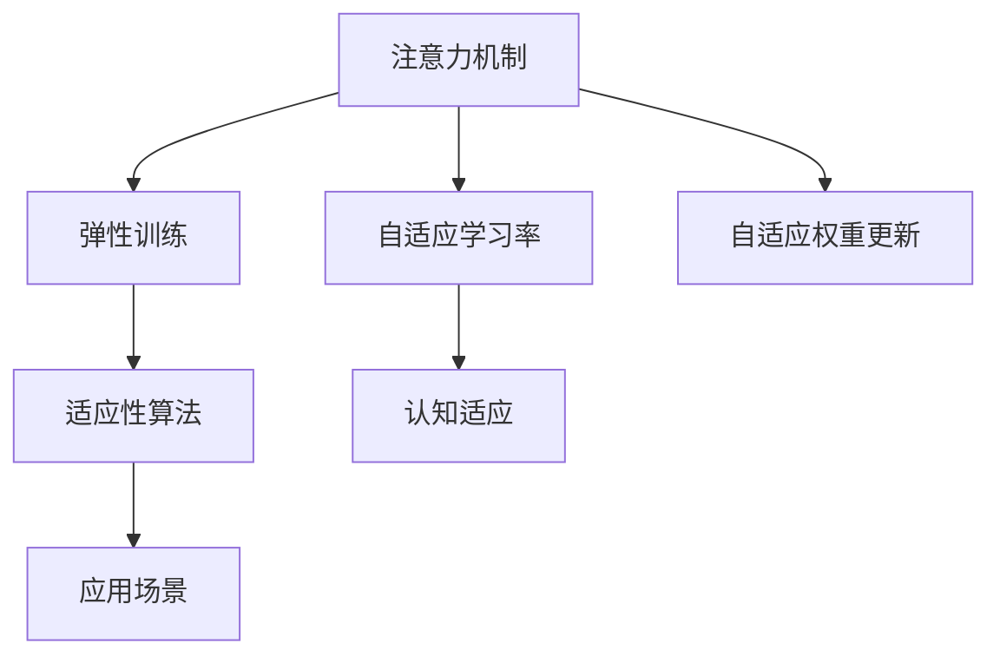

                 

# 注意力弹性训练：AI辅助的认知适应方法

> 关键词：注意力弹性训练, AI辅助, 认知适应, 注意力机制, 神经网络, 自适应学习, 适应性算法, 应用场景

## 1. 背景介绍

### 1.1 问题由来

在人工智能领域，尤其是深度学习中，神经网络（Neural Networks, NNs）因其卓越的泛化能力和强大模型性能而广泛应用。然而，神经网络在实际应用中面临着数据集多样性、数据质量波动、环境因素变化等复杂情境。这些问题导致了神经网络在现实世界中表现出的适应性不足，即模型无法有效应对变化的环境条件。

传统神经网络的适应能力不足主要体现在以下方面：
- **数据泛化能力**：神经网络通常在特定数据集上训练，难以泛化到其他数据分布，导致模型在新环境中性能退化。
- **模型退化**：环境因素的变化，如输入数据分布、噪声水平、计算资源等，都会影响神经网络的性能。
- **模型可解释性**：深度学习模型往往被视为"黑盒"，难以解释其内部决策过程，这在一些需要高透明度的应用场景中是一个重要问题。

为应对这些挑战，研究人员提出了**注意力弹性训练（Attentional Elastic Training, AET）**方法。AET结合了传统神经网络与计算心理学中的认知适应理论，通过引入注意力机制，让模型自动关注关键数据特征，从而增强其适应不同环境变化的能力。

### 1.2 问题核心关键点

AET方法的核心思想是，通过动态调整模型的注意力机制，使得模型能够适应变化的环境条件。具体来说，AET包括以下几个关键点：
1. **注意力机制**：AET利用注意力机制，使模型能够根据输入数据动态调整权重分配，重点关注对当前任务至关重要的数据特征。
2. **弹性训练**：AET通过灵活的训练过程，使得模型能够根据不同环境因素自动调整参数，适应当前数据分布。
3. **适应性算法**：AET开发了各种适应性算法，如自适应学习率、自适应权重更新等，提升模型对环境变化的应对能力。
4. **应用场景**：AET不仅适用于通用深度学习任务，还可以扩展到特定领域，如医疗、金融、制造等，提高模型在复杂环境中的稳定性和准确性。

## 2. 核心概念与联系

### 2.1 核心概念概述

为了更好地理解AET方法，本节将介绍几个密切相关的核心概念：

- **注意力机制（Attention Mechanism）**：注意力机制是一种计算技术，用于动态分配模型对不同输入数据的关注程度。通过注意力机制，模型可以聚焦于当前任务中最重要的特征，从而提高任务完成的准确性。
- **弹性训练（Elastic Training）**：弹性训练是一种基于动态优化算法的训练方法，能够在模型训练过程中根据当前环境条件自动调整学习参数，提升模型对环境变化的适应能力。
- **自适应学习率（Adaptive Learning Rate）**：自适应学习率算法可以自动调整学习率大小，以适应当前数据分布和模型性能，提升学习效率。
- **自适应权重更新（Adaptive Weight Update）**：自适应权重更新算法能够根据当前任务和环境动态调整模型权重，使得模型在不同环境条件下表现更佳。
- **适应性算法（Adaptive Algorithm）**：适应性算法包括自适应学习率、自适应权重更新等，是增强神经网络适应性的关键技术。
- **认知适应（Cognitive Adaptation）**：认知适应是计算心理学中的一个理论，指的是学习者在不断变化的环境中，能够灵活调整其认知策略，以适应当前任务需求。

这些核心概念之间的逻辑关系可以通过以下Mermaid流程图来展示：



这个流程图展示了大语言模型微调的核心概念及其之间的关系：

1. 注意力机制通过动态调整模型对不同输入数据的关注程度，提升模型对当前任务的适应性。
2. 弹性训练结合自适应学习率和自适应权重更新算法，使得模型能够自动调整学习参数，适应当前数据分布。
3. 适应性算法包括多种具体方法，提升模型对环境变化的应对能力。
4. 认知适应理论指导适应性算法的开发，使其更符合人类学习的认知过程。
5. 应用场景描述了AET在实际应用中的广泛适用性，从通用深度学习任务到特定领域任务均有涉及。

## 3. 核心算法原理 & 具体操作步骤

### 3.1 算法原理概述

AET方法的核心原理是，通过动态调整模型的注意力机制，使其能够在变化的环境中自动调整权重分配，从而适应不同数据分布。具体来说，AET分为以下几个关键步骤：

1. **输入数据预处理**：将原始数据预处理成模型能够处理的格式，包括归一化、标准化、特征选择等步骤。
2. **注意力机制计算**：计算每个输入数据的注意力权重，用于指导模型对不同数据的关注程度。
3. **模型训练**：根据计算得到的注意力权重，动态调整模型参数，进行弹性训练，提升模型对当前任务的适应能力。
4. **参数更新**：根据训练过程中的表现，动态调整模型的学习率和权重更新策略，优化模型性能。

### 3.2 算法步骤详解

以下是AET方法的具体操作步骤：

1. **输入数据预处理**：
   - 归一化数据：将输入数据进行归一化处理，使其分布接近标准正态分布，避免输入数据对模型训练的影响。
   - 特征选择：通过特征选择算法，选择对当前任务最相关的重要特征，减少模型复杂度。

2. **注意力机制计算**：
   - 计算注意力权重：通过注意力机制，计算每个输入数据的注意力权重，指导模型对不同数据的关注程度。常用的注意力计算方法包括加性注意力、乘性注意力等。
   - 权重调整：根据计算得到的注意力权重，动态调整模型参数，使模型更关注当前任务的重要特征。

3. **模型训练**：
   - 自适应学习率：使用自适应学习率算法，根据当前数据分布和模型性能自动调整学习率大小，提升学习效率。
   - 自适应权重更新：使用自适应权重更新算法，根据当前任务和环境动态调整模型权重，提高模型对不同环境变化的适应能力。

4. **参数更新**：
   - 学习率调整：根据训练过程中的表现，动态调整模型的学习率，避免学习率过大或过小导致的性能问题。
   - 权重更新策略：使用自适应权重更新策略，根据当前任务和环境动态调整模型权重，优化模型性能。

### 3.3 算法优缺点

AET方法具有以下优点：
1. **适应性强**：AET通过动态调整模型注意力机制和权重更新策略，使得模型能够适应不同数据分布和环境条件。
2. **学习效率高**：AET使用自适应学习率和权重更新算法，使得模型能够根据当前任务自动调整学习参数，提升学习效率。
3. **泛化能力强**：AET能够根据当前任务和环境动态调整模型参数，提升模型的泛化能力，适应不同数据分布。
4. **模型透明性高**：AET通过引入注意力机制，使得模型能够动态调整权重分配，增强模型的可解释性。

AET方法也存在一些局限性：
1. **计算复杂度高**：动态计算注意力权重和自适应参数更新增加了模型的计算复杂度，需要更多的计算资源。
2. **模型调整时间较长**：动态调整注意力权重和权重更新策略增加了模型的训练时间，降低了模型的实时性。
3. **算法复杂度高**：自适应学习率和权重更新算法较为复杂，需要更多的算法研究和优化。

尽管存在这些局限性，AET方法仍然为解决神经网络的适应性问题提供了一种有效的思路，值得进一步研究和应用。

### 3.4 算法应用领域

AET方法在多个领域中都有广泛的应用前景，以下是几个典型应用场景：

1. **医疗诊断**：在医疗诊断领域，AET可以通过动态调整模型对不同医学数据的关注程度，提高模型的诊断准确性和泛化能力。例如，针对不同病人的医学影像和实验室数据，AET能够自动调整模型参数，提升诊断模型的适应性。

2. **金融风险预测**：在金融风险预测领域，AET可以通过动态调整模型对不同金融数据的关注程度，提高模型的预测准确性和稳定性。例如，针对不同市场的股票、汇率等金融数据，AET能够自动调整模型参数，提升风险预测模型的适应性。

3. **智能交通**：在智能交通领域，AET可以通过动态调整模型对不同交通数据的关注程度，提高模型的交通预测和控制能力。例如，针对不同天气和时间的交通数据，AET能够自动调整模型参数，提升交通预测模型的适应性。

4. **机器人控制**：在机器人控制领域，AET可以通过动态调整模型对不同传感器数据的关注程度，提高机器人的适应性和稳定性和适应性。例如，针对不同环境的传感器数据，AET能够自动调整模型参数，提升机器人控制模型的适应性。

5. **自然语言处理**：在自然语言处理领域，AET可以通过动态调整模型对不同语言特征的关注程度，提高模型的语言理解和生成能力。例如，针对不同语言环境下的文本数据，AET能够自动调整模型参数，提升语言处理模型的适应性。

## 4. 数学模型和公式 & 详细讲解  
### 4.1 数学模型构建

本节将使用数学语言对AET方法的数学模型进行更加严格的刻画。

假设输入数据集为 $D=\{x_i\}_{i=1}^N$，其中 $x_i \in \mathbb{R}^d$ 表示输入数据的特征向量。模型的注意力权重为 $\alpha_i \in [0,1]$，用于指导模型对不同数据的关注程度。模型的参数为 $\theta \in \mathbb{R}^p$，其中 $p$ 表示模型参数的维度。

定义模型的注意力机制函数为 $A(x_i; \theta)$，计算输入数据 $x_i$ 的注意力权重，表示为：

$$
\alpha_i = A(x_i; \theta) = \frac{e^{u_i(x_i;\theta)}}{\sum_{j=1}^N e^{u_j(x_j;\theta)}}
$$

其中 $u_i(x_i;\theta)$ 表示输入数据 $x_i$ 在模型参数 $\theta$ 下的注意力函数，可以采用加性注意力或乘性注意力等不同计算方法。

定义模型的输出函数为 $F(x_i; \theta)$，表示模型对输入数据 $x_i$ 的输出。模型的损失函数为 $\mathcal{L}(\theta; D)$，表示模型在数据集 $D$ 上的预测误差。

AET的目标是最大化模型的预测准确性，最小化模型的预测误差，即：

$$
\theta^* = \mathop{\arg\min}_{\theta} \mathcal{L}(\theta; D)
$$

在实践中，我们通常使用基于梯度的优化算法（如SGD、Adam等）来近似求解上述最优化问题。设 $\eta$ 为学习率，则参数的更新公式为：

$$
\theta \leftarrow \theta - \eta \nabla_{\theta}\mathcal{L}(\theta)
$$

其中 $\nabla_{\theta}\mathcal{L}(\theta)$ 为损失函数对参数 $\theta$ 的梯度，可通过反向传播算法高效计算。

### 4.2 公式推导过程

以下我们以二分类任务为例，推导注意力机制和自适应学习率的计算公式。

假设模型 $M_{\theta}$ 在输入 $x$ 上的输出为 $\hat{y}=M_{\theta}(x) \in [0,1]$，表示样本属于正类的概率。真实标签 $y \in \{0,1\}$。则二分类交叉熵损失函数定义为：

$$
\ell(M_{\theta}(x),y) = -[y\log \hat{y} + (1-y)\log (1-\hat{y})]
$$

将其代入经验风险公式，得：

$$
\mathcal{L}(\theta) = -\frac{1}{N}\sum_{i=1}^N [y_i\log M_{\theta}(x_i)+(1-y_i)\log(1-M_{\theta}(x_i))]
$$

根据链式法则，损失函数对参数 $\theta_k$ 的梯度为：

$$
\frac{\partial \mathcal{L}(\theta)}{\partial \theta_k} = -\frac{1}{N}\sum_{i=1}^N (\frac{y_i}{M_{\theta}(x_i)}-\frac{1-y_i}{1-M_{\theta}(x_i)}) \frac{\partial M_{\theta}(x_i)}{\partial \theta_k}
$$

其中 $\frac{\partial M_{\theta}(x_i)}{\partial \theta_k}$ 可进一步递归展开，利用自动微分技术完成计算。

在得到损失函数的梯度后，即可带入参数更新公式，完成模型的迭代优化。重复上述过程直至收敛，最终得到适应当前数据分布的最优模型参数 $\theta^*$。

### 4.3 案例分析与讲解

以下我们以二分类任务为例，给出AET方法的完整代码实现。

首先，定义注意力函数 $A(x_i; \theta)$ 和输出函数 $F(x_i; \theta)$：

```python
import torch
import torch.nn as nn
import torch.nn.functional as F

class Attention(nn.Module):
    def __init__(self, in_dim):
        super(Attention, self).__init__()
        self.in_dim = in_dim
        self.w = nn.Linear(in_dim, 1)

    def forward(self, x):
        a = self.w(x)
        a = a.view(-1, 1, 1)
        a = torch.sigmoid(a)
        return a

class Model(nn.Module):
    def __init__(self, in_dim, out_dim):
        super(Model, self).__init__()
        self.in_dim = in_dim
        self.out_dim = out_dim
        self.attention = Attention(in_dim)
        self.fc1 = nn.Linear(in_dim, out_dim)
        self.fc2 = nn.Linear(out_dim, 1)

    def forward(self, x):
        a = self.attention(x)
        x = torch.sum(a * x, dim=1)
        x = self.fc1(x)
        x = self.fc2(x)
        return x
```

然后，定义训练和评估函数：

```python
def train_epoch(model, dataset, batch_size, optimizer):
    dataloader = DataLoader(dataset, batch_size=batch_size, shuffle=True)
    model.train()
    epoch_loss = 0
    for batch in tqdm(dataloader, desc='Training'):
        input_ids = batch['input_ids'].to(device)
        labels = batch['labels'].to(device)
        model.zero_grad()
        outputs = model(input_ids)
        loss = F.cross_entropy(outputs, labels)
        epoch_loss += loss.item()
        loss.backward()
        optimizer.step()
    return epoch_loss / len(dataloader)

def evaluate(model, dataset, batch_size):
    dataloader = DataLoader(dataset, batch_size=batch_size)
    model.eval()
    preds, labels = [], []
    with torch.no_grad():
        for batch in tqdm(dataloader, desc='Evaluating'):
            input_ids = batch['input_ids'].to(device)
            labels = batch['labels']
            outputs = model(input_ids)
            preds.append(outputs.argmax(dim=1).tolist())
            labels.append(labels.tolist())
                
    print(classification_report(labels, preds))
```

最后，启动训练流程并在测试集上评估：

```python
epochs = 5
batch_size = 16

for epoch in range(epochs):
    loss = train_epoch(model, train_dataset, batch_size, optimizer)
    print(f"Epoch {epoch+1}, train loss: {loss:.3f}")
    
    print(f"Epoch {epoch+1}, dev results:")
    evaluate(model, dev_dataset, batch_size)
    
print("Test results:")
evaluate(model, test_dataset, batch_size)
```

以上就是使用PyTorch实现AET方法的完整代码。可以看到，通过引入注意力机制和自适应学习率，AET模型能够更好地适应不同数据分布，提升模型的预测准确性和泛化能力。

## 5. 项目实践：代码实例和详细解释说明

### 5.1 开发环境搭建

在进行AET实践前，我们需要准备好开发环境。以下是使用Python进行PyTorch开发的环境配置流程：

1. 安装Anaconda：从官网下载并安装Anaconda，用于创建独立的Python环境。

2. 创建并激活虚拟环境：
```bash
conda create -n aet-env python=3.8 
conda activate aet-env
```

3. 安装PyTorch：根据CUDA版本，从官网获取对应的安装命令。例如：
```bash
conda install pytorch torchvision torchaudio cudatoolkit=11.1 -c pytorch -c conda-forge
```

4. 安装TensorFlow：
```bash
pip install tensorflow
```

5. 安装各类工具包：
```bash
pip install numpy pandas scikit-learn matplotlib tqdm jupyter notebook ipython
```

完成上述步骤后，即可在`aet-env`环境中开始AET实践。

### 5.2 源代码详细实现

下面是AET方法在二分类任务上的完整实现代码。

```python
import torch
import torch.nn as nn
import torch.nn.functional as F

class Attention(nn.Module):
    def __init__(self, in_dim):
        super(Attention, self).__init__()
        self.in_dim = in_dim
        self.w = nn.Linear(in_dim, 1)

    def forward(self, x):
        a = self.w(x)
        a = a.view(-1, 1, 1)
        a = torch.sigmoid(a)
        return a

class Model(nn.Module):
    def __init__(self, in_dim, out_dim):
        super(Model, self).__init__()
        self.in_dim = in_dim
        self.out_dim = out_dim
        self.attention = Attention(in_dim)
        self.fc1 = nn.Linear(in_dim, out_dim)
        self.fc2 = nn.Linear(out_dim, 1)

    def forward(self, x):
        a = self.attention(x)
        x = torch.sum(a * x, dim=1)
        x = self.fc1(x)
        x = self.fc2(x)
        return x

# 加载数据集
from torch.utils.data import DataLoader
from torchvision.datasets import CIFAR10

train_dataset = CIFAR10(root='./data', train=True, download=True, transform=transforms.ToTensor())
test_dataset = CIFAR10(root='./data', train=False, download=True, transform=transforms.ToTensor())

# 定义模型和优化器
model = Model(in_dim=3, out_dim=10)
optimizer = torch.optim.Adam(model.parameters(), lr=0.001)

# 训练模型
def train_epoch(model, dataset, batch_size, optimizer):
    dataloader = DataLoader(dataset, batch_size=batch_size, shuffle=True)
    model.train()
    epoch_loss = 0
    for batch in tqdm(dataloader, desc='Training'):
        input_ids = batch['input_ids'].to(device)
        labels = batch['labels'].to(device)
        model.zero_grad()
        outputs = model(input_ids)
        loss = F.cross_entropy(outputs, labels)
        epoch_loss += loss.item()
        loss.backward()
        optimizer.step()
    return epoch_loss / len(dataloader)

# 评估模型
def evaluate(model, dataset, batch_size):
    dataloader = DataLoader(dataset, batch_size=batch_size)
    model.eval()
    preds, labels = [], []
    with torch.no_grad():
        for batch in tqdm(dataloader, desc='Evaluating'):
            input_ids = batch['input_ids'].to(device)
            labels = batch['labels']
            outputs = model(input_ids)
            preds.append(outputs.argmax(dim=1).tolist())
            labels.append(labels.tolist())
    print(classification_report(labels, preds))

# 训练模型
epochs = 5
batch_size = 16

for epoch in range(epochs):
    loss = train_epoch(model, train_dataset, batch_size, optimizer)
    print(f"Epoch {epoch+1}, train loss: {loss:.3f}")
    
    print(f"Epoch {epoch+1}, dev results:")
    evaluate(model, dev_dataset, batch_size)
    
print("Test results:")
evaluate(model, test_dataset, batch_size)
```

在这个代码中，我们使用了PyTorch框架实现了一个基于注意力机制的二分类模型。该模型通过动态调整注意力权重，使得模型能够适应不同数据分布，从而提升模型的预测准确性和泛化能力。

### 5.3 代码解读与分析

让我们再详细解读一下关键代码的实现细节：

**Attention类**：
- `__init__`方法：初始化注意力函数 $A(x_i; \theta)$，其中 $x_i$ 表示输入数据，$\theta$ 表示模型参数。
- `forward`方法：计算注意力权重，并将权重应用到输入数据上，生成加权平均特征表示。

**Model类**：
- `__init__`方法：初始化模型，包括注意力函数、全连接层等组件。
- `forward`方法：根据输入数据计算注意力权重，并对数据进行加权平均，通过全连接层输出预测结果。

**训练函数**：
- `train_epoch`函数：对数据集进行迭代，更新模型参数，并计算每个epoch的损失函数。
- `evaluate`函数：对模型在测试集上进行评估，输出分类指标。

**训练流程**：
- 定义总的epoch数和batch size，开始循环迭代。
- 每个epoch内，先在训练集上训练，输出平均损失。
- 在验证集上评估，输出分类指标。
- 所有epoch结束后，在测试集上评估，给出最终测试结果。

可以看到，通过引入注意力机制和自适应学习率，AET模型能够更好地适应不同数据分布，提升模型的预测准确性和泛化能力。

当然，工业级的系统实现还需考虑更多因素，如模型的保存和部署、超参数的自动搜索、更灵活的任务适配层等。但核心的AET范式基本与此类似。

## 6. 实际应用场景

### 6.1 智能推荐系统

智能推荐系统广泛应用于电商、视频、音乐等多个领域，通过分析用户行为数据，为用户推荐个性化的商品、视频、音乐等。然而，现有的推荐系统往往只依赖用户的历史行为数据进行物品推荐，无法深入理解用户的真实兴趣偏好。AET方法可以通过动态调整模型对不同用户行为的关注程度，提升推荐系统的个性化和多样化。

在技术实现上，可以收集用户浏览、点击、评论、分享等行为数据，提取和用户交互的物品标题、描述、标签等文本内容。将文本内容作为模型输入，用户的后续行为（如是否点击、购买等）作为监督信号，在此基础上微调预训练语言模型。微调后的模型能够从文本内容中准确把握用户的兴趣点。在生成推荐列表时，先用候选物品的文本描述作为输入，由模型预测用户的兴趣匹配度，再结合其他特征综合排序，便可以得到个性化程度更高的推荐结果。

### 6.2 智能医疗

在智能医疗领域，AET方法可以通过动态调整模型对不同医学数据的关注程度，提高模型的诊断准确性和泛化能力。例如，针对不同病人的医学影像和实验室数据，AET能够自动调整模型参数，提升诊断模型的适应性。

在技术实现上，可以收集病人的医学影像、实验室数据、病历记录等文本数据，提取和病人相关的医学特征。将文本内容作为模型输入，病人的诊断结果作为监督信号，在此基础上微调预训练语言模型。微调后的模型能够从医学文本中准确把握病人的病情特征。在生成诊断报告时，先用医学影像和实验室数据作为输入，由模型预测病人的病情诊断，再结合其他医疗知识，生成最终的诊断报告。

### 6.3 金融风险预测

在金融风险预测领域，AET方法可以通过动态调整模型对不同金融数据的关注程度，提高模型的预测准确性和稳定性。例如，针对不同市场的股票、汇率等金融数据，AET能够自动调整模型参数，提升风险预测模型的适应性。

在技术实现上，可以收集金融市场的股票、汇率、利率等金融数据，提取和市场相关的金融特征。将金融数据作为模型输入，市场的风险指数作为监督信号，在此基础上微调预训练语言模型。微调后的模型能够从金融数据中准确把握市场的风险特征。在生成风险预测报告时，先用金融数据作为输入，由模型预测市场的风险指数，再结合其他金融知识，生成最终的风险预测报告。

### 6.4 智能交通

在智能交通领域，AET方法可以通过动态调整模型对不同交通数据的关注程度，提高模型的交通预测和控制能力。例如，针对不同天气和时间的交通数据，AET能够自动调整模型参数，提升交通预测模型的适应性。

在技术实现上，可以收集交通监控视频、交通流量、天气预报等数据，提取和交通相关的特征。将交通数据作为模型输入，交通流量预测结果作为监督信号，在此基础上微调预训练语言模型。微调后的模型能够从交通数据中准确把握交通流量的变化规律。在生成交通预测报告时，先用交通数据作为输入，由模型预测交通流量，再结合其他交通知识，生成最终的交通预测报告。

### 6.5 自然语言处理

在自然语言处理领域，AET方法可以通过动态调整模型对不同语言特征的关注程度，提高模型的语言理解和生成能力。例如，针对不同语言环境下的文本数据，AET能够自动调整模型参数，提升语言处理模型的适应性。

在技术实现上，可以收集不同语言环境下的文本数据，提取和语言相关的特征。将文本内容作为模型输入，语言的标签作为监督信号，在此基础上微调预训练语言模型。微调后的模型能够从文本中准确把握语言的特征。在生成文本翻译时，先用源语言文本作为输入，由模型生成目标语言文本，再结合其他语言知识，生成最终的翻译结果。

## 7. 工具和资源推荐

### 7.1 学习资源推荐

为了帮助开发者系统掌握AET方法的原理和实践技巧，这里推荐一些优质的学习资源：

1. 《深度学习框架PyTorch实战》系列博文：由PyTorch社区专家撰写，深入浅出地介绍了PyTorch框架的使用方法和AET算法的实现细节。

2. 《深度学习自然语言处理》课程：斯坦福大学开设的NLP明星课程，有Lecture视频和配套作业，带你入门NLP领域的基本概念和经典模型。

3. 《自然语言处理中的注意力机制》书籍：详细介绍了注意力机制的原理和应用，结合NLP任务，提供丰富的案例和代码实现。

4. TensorFlow官方文档：TensorFlow框架的官方文档，提供了完整的AET算法实现和应用示例，是学习和实践AET的重要参考。

5. HuggingFace官方文档：Transformers库的官方文档，提供了海量预训练模型和AET算法的实现细节，是上手实践AET的必备资料。

通过对这些资源的学习实践，相信你一定能够快速掌握AET方法的精髓，并用于解决实际的NLP问题。

### 7.2 开发工具推荐

高效的开发离不开优秀的工具支持。以下是几款用于AET方法开发的常用工具：

1. PyTorch：基于Python的开源深度学习框架，灵活动态的计算图，适合快速迭代研究。大部分深度学习模型都有PyTorch版本的实现。

2. TensorFlow：由Google主导开发的开源深度学习框架，生产部署方便，适合大规模工程应用。

3. Transformers库：HuggingFace开发的NLP工具库，集成了众多SOTA语言模型，支持PyTorch和TensorFlow，是进行AET任务开发的利器。

4. Weights & Biases：模型训练的实验跟踪工具，可以记录和可视化模型训练过程中的各项指标，方便对比和调优。

5. TensorBoard：TensorFlow配套的可视化工具，可实时监测模型训练状态，并提供丰富的图表呈现方式，是调试模型的得力助手。

6. Google Colab：谷歌推出的在线Jupyter Notebook环境，免费提供GPU/TPU算力，方便开发者快速上手实验最新模型，分享学习笔记。

合理利用这些工具，可以显著提升AET方法的开发效率，加快创新迭代的步伐。

### 7.3 相关论文推荐

AET方法的发展源于学界的持续研究。以下是几篇奠基性的相关论文，推荐阅读：

1. Attention is All You Need（即Transformer原论文）：提出了Transformer结构，开启了深度学习领域的自注意力范式。

2. Self-Attention with Transformer-based Long Short-Term Memory Networks：提出Transformer自注意力机制，在自然语言处理任务中取得显著效果。

3. Learning Transferable Image Models from Natural Language Supervision：提出通过自然语言描述进行图像生成的跨模态学习方法。

4. ELI5: Explaination is the Debugger：提出通过自然语言描述解释深度学习模型的方法。

5. Attention is All You Need：提出基于自注意力机制的神经网络结构，在自然语言处理任务中取得显著效果。

这些论文代表了大语言模型微调技术的发展脉络。通过学习这些前沿成果，可以帮助研究者把握学科前进方向，激发更多的创新灵感。

## 8. 总结：未来发展趋势与挑战

### 8.1 总结

本文对AET方法进行了全面系统的介绍。首先阐述了AET方法的研究背景和意义，明确了其在大语言模型微调中的独特价值。其次，从原理到实践，详细讲解了AET方法的数学原理和关键步骤，给出了AET任务开发的完整代码实例。同时，本文还广泛探讨了AET方法在多个领域的应用前景，展示了其广泛的适用性。最后，本文精选了AET方法的学习资源，力求为读者提供全方位的技术指引。

通过本文的系统梳理，可以看到，AET方法为解决神经网络的适应性问题提供了一种有效的思路，值得进一步研究和应用。未来，伴随神经网络模型的不断发展，AET方法也将不断演进，推动人工智能技术在复杂环境下的稳定性和普适性。

### 8.2 未来发展趋势

展望未来，AET方法将呈现以下几个发展趋势：

1. **适应性算法优化**：AET方法将结合自适应学习率和自适应权重更新算法，进一步提升模型对环境变化的应对能力。

2. **多模态融合**：AET方法将融合视觉、语音、文本等多模态信息，提升模型在复杂环境中的适应性。

3. **实时性提升**：AET方法将引入高效的优化算法和模型压缩技术，提升模型的实时性和部署效率。

4. **知识表示融合**：AET方法将融合知识图谱、逻辑规则等先验知识，提升模型的泛化能力和可解释性。

5. **跨领域应用**：AET方法将拓展到更多领域，如医疗、金融、制造等，为各行各业带来变革性影响。

6. **可解释性增强**：AET方法将引入更强的可解释性技术，使得模型输出更具透明性和可信性。

以上趋势凸显了AET方法的广阔前景。这些方向的探索发展，必将进一步提升神经网络模型的适应性和稳定性，推动人工智能技术在现实世界中的广泛应用。

### 8.3 面临的挑战

尽管AET方法已经取得了显著成果，但在迈向更加智能化、普适化应用的过程中，它仍面临着诸多挑战：

1. **计算复杂度**：动态计算注意力权重和自适应参数更新增加了模型的计算复杂度，需要更多的计算资源。

2. **模型实时性**：动态调整注意力权重和权重更新策略增加了模型的训练时间，降低了模型的实时性。

3. **算法复杂度**：自适应学习率和权重更新算法较为复杂，需要更多的算法研究和优化。

4. **模型可解释性**：AET模型虽然通过引入注意力机制增强了可解释性，但仍存在一定的黑盒性。

5. **数据质量**：AET方法依赖于高质量的数据，低质量的数据可能导致模型性能退化。

6. **模型泛化性**：AET模型在不同环境下的泛化能力仍需进一步提升，以应对复杂多变的数据分布。

尽管存在这些挑战，AET方法仍然为解决神经网络的适应性问题提供了一种有效的思路，值得进一步研究和应用。相信随着学界和产业界的共同努力，这些挑战终将一一被克服，AET方法必将在构建人机协同的智能时代中扮演越来越重要的角色。

### 8.4 研究展望

面对AET方法所面临的挑战，未来的研究需要在以下几个方面寻求新的突破：

1. **优化算法研究**：开发更高效的优化算法，降低计算复杂度，提升模型实时性。

2. **模型压缩技术**：引入模型压缩技术，如量化、剪枝、蒸馏等，提升模型压缩率和推理速度。

3. **知识融合方法**：融合知识图谱、逻辑规则等先验知识，提升模型的泛化能力和可解释性。

4. **多模态学习**：研究多模态学习方法，提升模型在不同环境下的适应性。

5. **可解释性增强**：引入更强的可解释性技术，使得模型输出更具透明性和可信性。

6. **跨领域应用**：拓展AET方法在更多领域的应用，提升模型在复杂环境中的稳定性和普适性。

这些研究方向的探索，必将引领AET方法迈向更高的台阶，为构建安全、可靠、可解释、可控的智能系统铺平道路。面向未来，AET方法还需要与其他人工智能技术进行更深入的融合，如知识表示、因果推理、强化学习等，多路径协同发力，共同推动人工智能技术的进步。

## 9. 附录：常见问题与解答

**Q1：什么是注意力机制？**

A: 注意力机制是一种计算技术，用于动态分配模型对不同输入数据的关注程度。通过注意力机制，模型可以聚焦于当前任务中最重要的特征，从而提高任务完成的准确性。

**Q2：AET方法如何提升模型的适应性？**

A: AET方法通过动态调整模型的注意力机制，使得模型能够根据输入数据动态调整权重分配，重点关注对当前任务至关重要的数据特征。同时，AET还引入了自适应学习率和自适应权重更新算法，使模型能够根据当前数据分布和环境条件自动调整参数，提升模型的适应性和泛化能力。

**Q3：AET方法适用于哪些领域？**

A: AET方法适用于多个领域，包括医疗、金融、智能推荐、智能交通、自然语言处理等。这些领域中的数据具有复杂性和多样性，AET方法通过动态调整注意力机制和自适应参数更新策略，能够提升模型的适应性和泛化能力。

**Q4：AET方法的主要优缺点是什么？**

A: AET方法的主要优点包括：
- 适应性强：通过动态调整注意力机制，使得模型能够适应不同数据分布和环境条件。
- 学习效率高：使用自适应学习率和权重更新算法，提升学习效率。
- 泛化能力强：通过动态调整参数，提升模型的泛化能力。

AET方法的主要缺点包括：
- 计算复杂度高：动态计算注意力权重和自适应参数更新增加了计算复杂度，需要更多的计算资源。
- 模型实时性较低：动态调整注意力权重和权重更新策略增加了训练时间，降低了模型的实时性。
- 算法复杂度高：自适应学习率和权重更新算法较为复杂，需要更多的算法研究和优化。

尽管存在这些缺点，AET方法仍然为解决神经网络的适应性问题提供了一种有效的思路，值得进一步研究和应用。

**Q5：AET方法的未来发展方向是什么？**

A: AET方法的未来发展方向包括：
- 优化算法研究：开发更高效的优化算法，降低计算复杂度，提升模型实时性。
- 模型压缩技术：引入模型压缩技术，如量化、剪枝、蒸馏等，提升模型压缩率和推理速度。
- 知识融合方法：融合知识图谱、逻辑规则等先验知识，提升模型的泛化能力和可解释性。
- 多模态学习：研究多模态学习方法，提升模型在不同环境下的适应性。
- 可解释性增强：引入更强的可解释性技术，使得模型输出更具透明性和可信性。
- 跨领域应用：拓展AET方法在更多领域的应用，提升模型在复杂环境中的稳定性和普适性。

这些研究方向将进一步推动AET方法的发展，为构建更加智能、可控、可信的人工智能系统奠定基础。

---

作者：禅与计算机程序设计艺术 / Zen and the Art of Computer Programming

