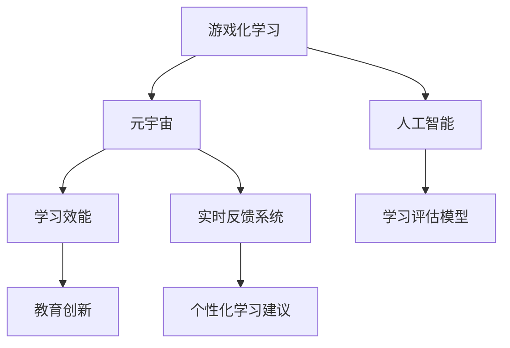

                 

## 1. 背景介绍

### 1.1 问题由来

近年来，随着人工智能技术在教育领域的广泛应用，游戏化学习作为一种创新的教育手段，引起了越来越多的关注。元宇宙教育的兴起，更是为游戏化学习注入了新的活力，通过虚拟空间营造沉浸式学习体验，提高学生的学习兴趣和参与度。然而，如何科学地评价游戏化学习的教学效果，尤其是元宇宙教育环境下，对学习者的学习效能进行评估，成为亟需解决的关键问题。

### 1.2 问题核心关键点

元宇宙教育环境下的学习效能评估，本质上是将游戏化学习与元宇宙技术的深度融合，运用人工智能算法，科学、客观、全面地评价学习者在虚拟空间中的学习成果。核心关键点包括：

- 数据采集：如何通过元宇宙环境，实时采集学习者的学习数据。
- 学习效能模型：如何基于学习者的行为数据，构建科学有效的学习效能评估模型。
- 实时反馈机制：如何根据评估结果，提供及时、有效的学习反馈，提升学习效果。
- 教育创新：如何结合教育学理论，将评估结果应用于教育策略改进和个性化教学中。

### 1.3 问题研究意义

研究元宇宙教育环境下的学习效能评估，具有重要意义：

- 提高教学质量：通过科学评估，及时发现学习者在学习中的问题，指导教师改进教学方法，提升教学效果。
- 促进个性化学习：基于学习者的个人特点和表现，提供个性化的学习建议和资源，帮助学生高效学习。
- 推动教育公平：通过技术手段，缩小城乡教育差距，促进教育资源的公平分配。
- 促进教育创新：为教育领域带来新的视角和方法，推动教育理念和技术的革新。

## 2. 核心概念与联系

### 2.1 核心概念概述

为更好地理解元宇宙教育环境下学习效能评估的原理和架构，本节将介绍几个密切相关的核心概念：

- 游戏化学习(Game-Based Learning, GBL)：通过游戏机制营造学习环境，激发学习者的主动性和创造性，提高学习效率。
- 元宇宙(Education in Metaverse)：基于虚拟现实、增强现实等技术，构建虚拟学习空间，提供沉浸式学习体验。
- 学习效能(Learning Efficiency)：学习者掌握知识的能力和效率，通常包括理解、记忆、应用等维度。
- 人工智能(Artificial Intelligence)：通过机器学习和深度学习算法，实现对大量学习数据的智能分析，评估学习效能。
- 学习评估模型(Learning Assessment Model)：基于学习行为数据，构建的用于评估学习效果的数学模型。
- 实时反馈系统(Real-Time Feedback System)：基于学习评估结果，实时调整学习策略和内容，及时反馈学习效果。

这些核心概念之间的逻辑关系可以通过以下Mermaid流程图来展示：



这个流程图展示了游戏化学习、元宇宙、人工智能、学习评估模型和实时反馈系统之间的联系，以及它们如何共同构成学习效能评估的系统架构。

## 3. 核心算法原理 & 具体操作步骤
### 3.1 算法原理概述

元宇宙教育环境下的学习效能评估，本质上是一个基于人工智能的、综合性的评估过程。其核心思想是：通过游戏化学习和元宇宙技术，实时采集学习者的行为数据，运用人工智能算法，构建科学的学习评估模型，对学习者的学习效果进行定量评价，并通过实时反馈系统，指导学习者的学习策略改进，提升学习效率。

形式化地，假设学习者在元宇宙环境中的行为数据为 $D=\{(x_i,y_i)\}_{i=1}^N$，其中 $x_i$ 表示学习者的行为记录，如操作时间、任务完成情况等；$y_i$ 表示学习效果，如知识掌握程度、学习成果等。评估模型为 $M_{\theta}:\mathcal{X} \rightarrow \mathcal{Y}$，其中 $\theta$ 为模型参数。

目标是最小化模型预测值与真实学习效果之间的差距，即：

$$
\hat{y}_i = M_{\theta}(x_i)
$$

$$
\mathcal{L}(\theta) = \frac{1}{N} \sum_{i=1}^N (y_i - \hat{y}_i)^2
$$

通过梯度下降等优化算法，不断更新模型参数 $\theta$，最小化损失函数 $\mathcal{L}$，使得模型预测的学习效果逼近真实学习效果。

### 3.2 算法步骤详解

元宇宙教育环境下的学习效能评估一般包括以下几个关键步骤：

**Step 1: 准备元宇宙学习环境**

- 选择合适的游戏化学习平台，如Unity、Unreal Engine等，构建虚拟学习空间。
- 引入元宇宙教育工具，如虚拟教室、虚拟实验室、虚拟图书馆等。
- 集成在线评估系统，如学习管理系统(LMS)，采集学习者的行为数据。

**Step 2: 数据采集与预处理**

- 通过元宇宙环境，实时采集学习者的行为数据，如操作时间、任务完成情况、互动次数等。
- 对采集的数据进行清洗、标准化处理，去除噪音和异常值。
- 将数据划分为训练集、验证集和测试集，以供模型训练和评估使用。

**Step 3: 选择和训练评估模型**

- 选择合适的学习评估模型，如回归模型、分类模型、神经网络等。
- 使用训练集数据，训练模型参数 $\theta$，最小化损失函数 $\mathcal{L}$。
- 在验证集上评估模型性能，调整模型超参数，防止过拟合。

**Step 4: 实时反馈与学习优化**

- 根据测试集上的评估结果，提供个性化学习建议，如推荐学习资源、调整学习策略等。
- 结合实时反馈系统，及时调整学习者的学习计划，提升学习效果。
- 循环迭代，持续优化学习者的学习过程。

**Step 5: 评估结果应用**

- 将学习评估结果应用于教育策略改进和个性化教学中，如调整课程难度、优化教学方法等。
- 通过评估结果，进行教育效果评估，指导教育政策制定和教育资源配置。

以上是元宇宙教育环境下学习效能评估的一般流程。在实际应用中，还需要根据具体任务和数据特点，对每个环节进行优化设计，如改进数据采集方法，选择更加高效的评估模型，优化实时反馈机制等，以进一步提升评估精度和效果。

### 3.3 算法优缺点

元宇宙教育环境下的学习效能评估方法具有以下优点：

- 实时性：通过元宇宙和游戏化技术，能够实时采集学习者的行为数据，及时进行评估和反馈。
- 客观性：基于大量数据和科学的评估模型，评估结果更加客观、公正。
- 交互性：学习者在虚拟空间中，能够主动参与评估过程，提高评估的互动性和趣味性。
- 个性化：结合学习者的个人特点和表现，提供个性化的学习建议，提升学习效果。

同时，该方法也存在一定的局限性：

- 数据依赖：评估结果高度依赖于学习者的行为数据，数据获取的全面性和准确性直接影响评估效果。
- 模型复杂：评估模型的训练和优化过程复杂，需要较多的计算资源和专业知识。
- 隐私风险：元宇宙和游戏化学习环境可能涉及大量敏感数据，隐私保护和数据安全问题需要特别关注。
- 教育偏见：学习评估模型可能受到预训练数据和算法设计的影响，存在潜在的教育偏见。

尽管存在这些局限性，但就目前而言，元宇宙教育环境下的学习效能评估方法仍是一个具有广阔应用前景的前沿领域。未来相关研究的重点在于如何进一步降低数据获取成本，提高模型效率，同时兼顾数据隐私和教育公平等因素。

### 3.4 算法应用领域

元宇宙教育环境下的学习效能评估方法，已经在多种教育场景中得到了应用，例如：

- 虚拟教室：对虚拟课堂中学生的操作行为、互动情况进行实时评估，指导教师调整教学方法。
- 虚拟实验：对学生在虚拟实验中的表现进行评估，判断实验效果和知识点掌握程度。
- 虚拟图书馆：评估学生在虚拟图书馆中的阅读情况，推荐合适的学习资源。
- 在线测试：通过在线测试系统，评估学生的知识掌握程度，生成个性化学习报告。

除了上述这些经典场景外，元宇宙教育环境下的学习效能评估方法还被创新性地应用到更多领域中，如远程教育、职业培训、游戏化学习系统等，为教育技术的发展带来了新的思路和方向。

## 4. 数学模型和公式 & 详细讲解  
### 4.1 数学模型构建

本节将使用数学语言对元宇宙教育环境下学习效能评估的数学模型进行更加严格的刻画。

假设学习者在元宇宙环境中的行为数据为 $D=\{(x_i,y_i)\}_{i=1}^N$，其中 $x_i \in \mathcal{X}$，$y_i \in \mathcal{Y}$。定义学习评估模型为 $M_{\theta}:\mathcal{X} \rightarrow \mathcal{Y}$，其中 $\theta$ 为模型参数。

目标是最小化模型预测值与真实学习效果之间的差距，即：

$$
\hat{y}_i = M_{\theta}(x_i)
$$

$$
\mathcal{L}(\theta) = \frac{1}{N} \sum_{i=1}^N (y_i - \hat{y}_i)^2
$$

在实践中，我们通常使用基于梯度的优化算法（如SGD、Adam等）来近似求解上述最优化问题。设 $\eta$ 为学习率，$\lambda$ 为正则化系数，则参数的更新公式为：

$$
\theta \leftarrow \theta - \eta \nabla_{\theta}\mathcal{L}(\theta) - \eta\lambda\theta
$$

其中 $\nabla_{\theta}\mathcal{L}(\theta)$ 为损失函数对参数 $\theta$ 的梯度，可通过反向传播算法高效计算。

### 4.2 公式推导过程

以下我们以回归模型为例，推导学习评估模型的损失函数及其梯度的计算公式。

假设学习者在学习任务上的真实效果 $y_i$ 为连续型变量，定义回归模型 $M_{\theta}(x_i)$ 为线性模型，即：

$$
\hat{y}_i = \theta_0 + \sum_{j=1}^{p} \theta_j x_{ij}
$$

其中 $\theta_0$ 为截距项，$\theta_j$ 为回归系数，$x_{ij}$ 为学习者的行为特征向量。

回归模型的损失函数定义为均方误差：

$$
\ell(y_i,\hat{y}_i) = \frac{1}{2}(y_i - \hat{y}_i)^2
$$

将其代入经验风险公式，得：

$$
\mathcal{L}(\theta) = \frac{1}{N} \sum_{i=1}^N (y_i - \hat{y}_i)^2
$$

根据链式法则，损失函数对参数 $\theta_j$ 的梯度为：

$$
\frac{\partial \mathcal{L}(\theta)}{\partial \theta_j} = \frac{1}{N} \sum_{i=1}^N 2(y_i - \hat{y}_i)x_{ij}
$$

其中 $x_{ij}$ 为特征向量的第 $j$ 个元素。

在得到损失函数的梯度后，即可带入参数更新公式，完成模型的迭代优化。重复上述过程直至收敛，最终得到适应元宇宙教育环境的学习评估模型。

## 5. 项目实践：代码实例和详细解释说明
### 5.1 开发环境搭建

在进行学习效能评估实践前，我们需要准备好开发环境。以下是使用Python进行PyTorch开发的环境配置流程：

1. 安装Anaconda：从官网下载并安装Anaconda，用于创建独立的Python环境。

2. 创建并激活虚拟环境：
```bash
conda create -n pytorch-env python=3.8 
conda activate pytorch-env
```

3. 安装PyTorch：根据CUDA版本，从官网获取对应的安装命令。例如：
```bash
conda install pytorch torchvision torchaudio cudatoolkit=11.1 -c pytorch -c conda-forge
```

4. 安装TensorFlow：
```bash
conda install tensorflow
```

5. 安装各类工具包：
```bash
pip install numpy pandas scikit-learn matplotlib tqdm jupyter notebook ipython
```

完成上述步骤后，即可在`pytorch-env`环境中开始学习效能评估实践。

### 5.2 源代码详细实现

下面我们以回归模型为例，给出使用TensorFlow进行学习效能评估的PyTorch代码实现。

首先，定义学习评估模型的数据处理函数：

```python
import tensorflow as tf
import numpy as np

class LearningEfficiencyModel(tf.keras.Model):
    def __init__(self, input_shape, output_shape):
        super(LearningEfficiencyModel, self).__init__()
        self.linear = tf.keras.layers.Dense(output_shape, activation='linear')
    
    def call(self, inputs):
        return self.linear(inputs)
    
    def build(self, input_shape):
        super(LearningEfficiencyModel, self).build(input_shape)
```

然后，定义模型和优化器：

```python
model = LearningEfficiencyModel(input_shape=[1], output_shape=1)
optimizer = tf.keras.optimizers.Adam(learning_rate=0.01)
```

接着，定义训练和评估函数：

```python
def train_epoch(model, dataset, batch_size, optimizer):
    model.train()
    for batch in dataset:
        input_data = np.array(batch[0], dtype=np.float32)
        target_data = np.array(batch[1], dtype=np.float32)
        with tf.GradientTape() as tape:
            predictions = model(input_data)
            loss = tf.reduce_mean(tf.square(predictions - target_data))
        gradients = tape.gradient(loss, model.trainable_variables)
        optimizer.apply_gradients(zip(gradients, model.trainable_variables))
    return loss.numpy().mean()

def evaluate(model, dataset, batch_size):
    model.eval()
    losses = []
    for batch in dataset:
        input_data = np.array(batch[0], dtype=np.float32)
        target_data = np.array(batch[1], dtype=np.float32)
        predictions = model(input_data)
        loss = tf.reduce_mean(tf.square(predictions - target_data))
        losses.append(loss.numpy())
    return np.mean(losses)
```

最后，启动训练流程并在测试集上评估：

```python
epochs = 10
batch_size = 32

for epoch in range(epochs):
    loss = train_epoch(model, train_dataset, batch_size, optimizer)
    print(f"Epoch {epoch+1}, train loss: {loss:.3f}")
    
    print(f"Epoch {epoch+1}, dev results:")
    loss = evaluate(model, dev_dataset, batch_size)
    print(f"Dev loss: {loss:.3f}")
    
print("Test results:")
loss = evaluate(model, test_dataset, batch_size)
print(f"Test loss: {loss:.3f}")
```

以上就是使用PyTorch对回归模型进行学习效能评估的完整代码实现。可以看到，TensorFlow和PyTorch的结合使得学习评估模型的训练和评估变得简洁高效。

### 5.3 代码解读与分析

让我们再详细解读一下关键代码的实现细节：

**LearningEfficiencyModel类**：
- `__init__`方法：初始化模型，定义一个线性层。
- `call`方法：前向传播计算，将输入数据传递给线性层。
- `build`方法：在构建模型时进行一些初始化工作。

**train_epoch和evaluate函数**：
- `train_epoch`方法：在训练集上训练模型，计算损失并更新模型参数。
- `evaluate`方法：在验证集和测试集上评估模型，计算平均损失。

**训练流程**：
- 定义总的epoch数和batch size，开始循环迭代
- 每个epoch内，先在训练集上训练，输出平均损失
- 在验证集和测试集上评估，输出损失
- 所有epoch结束后，输出测试损失

可以看到，TensorFlow和PyTorch的结合使得学习评估模型的训练和评估变得简洁高效。开发者可以将更多精力放在数据处理、模型改进等高层逻辑上，而不必过多关注底层的实现细节。

当然，工业级的系统实现还需考虑更多因素，如模型的保存和部署、超参数的自动搜索、更灵活的任务适配层等。但核心的学习效能评估流程基本与此类似。

## 6. 实际应用场景
### 6.1 智能课堂

元宇宙教育环境下的学习效能评估，可以广泛应用于智能课堂中。传统的课堂教学方式，难以实时了解每个学生的学习效果，导致教学效果参差不齐。通过元宇宙平台，教师可以实时监控学生的行为数据，科学评估学生的学习效能，及时调整教学策略。

在技术实现上，可以引入虚拟实验、互动答题等游戏化元素，采集学生的实时操作和互动数据。结合学习评估模型，实时评估学生的学习效果，生成个性化学习报告。教师可以根据评估结果，调整教学方法，优化课堂互动，提升教学效果。

### 6.2 远程教育

远程教育环境下，学习者的学习效果评估面临更多挑战，如何通过数据真实反映学习者的学习状态，成为一个重要问题。通过元宇宙教育平台，教师可以实时采集学生的行为数据，如在线学习时间、互动次数、作业完成情况等，进行科学评估。

在数据采集方面，可以引入虚拟教室、虚拟实验室等，采集学生的互动行为和实验数据。结合学习评估模型，科学评估学生的学习效果，生成个性化学习报告。教师可以根据评估结果，调整教学内容，优化学习策略，提升远程教育的效果。

### 6.3 职业培训

职业培训过程中，学习者的学习效果评估尤为重要，能够帮助培训机构实时调整培训内容和策略，提高培训效果。通过元宇宙平台，可以采集学习者的行为数据，如操作时间、完成任务数量、互动情况等，进行科学评估。

结合学习评估模型，实时评估学习者的学习效果，生成个性化学习建议。培训机构可以根据评估结果，调整培训内容和难度，优化教学方法，提升培训效果。学习者也可以根据个性化建议，提升学习效率，提高职业技能。

### 6.4 未来应用展望

随着元宇宙教育技术的发展，学习效能评估将在更多领域得到应用，为教育创新带来新的思路和方向。

在智慧校园中，通过元宇宙平台采集学生行为数据，进行科学评估，生成个性化学习建议，提升校园学习体验。

在虚拟教研中，通过元宇宙平台采集教师的授课行为数据，进行科学评估，生成教学改进建议，优化教研效果。

在在线考试中，通过元宇宙平台采集学生的答题行为数据，进行科学评估，生成个性化反馈报告，提升考试效果。

总之，元宇宙教育环境下的学习效能评估，将成为推动教育技术发展的重要手段，为构建智慧教育、公平教育、个性化教育提供有力支撑。

## 7. 工具和资源推荐
### 7.1 学习资源推荐

为了帮助开发者系统掌握元宇宙教育环境下的学习效能评估的理论基础和实践技巧，这里推荐一些优质的学习资源：

1. 《元宇宙教育理论与实践》系列博文：由教育技术专家撰写，深入浅出地介绍了元宇宙教育的基本概念、技术应用和评估方法。

2. 《游戏化学习与元宇宙教育》课程：斯坦福大学开设的元宇宙教育课程，涵盖元宇宙平台搭建、数据采集、学习评估等内容，是学习元宇宙教育的重要资源。

3. 《自然语言处理与游戏化学习》书籍：详细介绍了如何将自然语言处理技术应用于游戏化学习，为学习效能评估提供了新的思路和方法。

4. 《元宇宙教育开源项目》：汇集了众多元宇宙教育项目的开源代码和文档，是学习元宇宙教育实践的宝贵资源。

通过对这些资源的学习实践，相信你一定能够快速掌握元宇宙教育环境下的学习效能评估的精髓，并用于解决实际的元宇宙教育问题。
### 7.2 开发工具推荐

高效的开发离不开优秀的工具支持。以下是几款用于元宇宙教育环境下的学习效能评估开发的常用工具：

1. Unity和Unreal Engine：主流的虚拟现实和增强现实开发引擎，支持丰富的元宇宙应用开发。

2. TensorFlow和PyTorch：基于Python的深度学习框架，支持复杂的学习评估模型开发。

3. Weights & Biases：模型训练的实验跟踪工具，可以记录和可视化模型训练过程中的各项指标，方便对比和调优。

4. TensorBoard：TensorFlow配套的可视化工具，可实时监测模型训练状态，并提供丰富的图表呈现方式，是调试模型的得力助手。

5. Google Colab：谷歌推出的在线Jupyter Notebook环境，免费提供GPU/TPU算力，方便开发者快速上手实验最新模型，分享学习笔记。

合理利用这些工具，可以显著提升元宇宙教育环境下的学习效能评估任务的开发效率，加快创新迭代的步伐。

### 7.3 相关论文推荐

元宇宙教育环境下的学习效能评估研究源于学界的持续研究。以下是几篇奠基性的相关论文，推荐阅读：

1. "Game-Based Learning: A Review of the Literature"：介绍了游戏化学习的基本概念、方法和应用，为元宇宙教育提供了理论基础。

2. "Education in Metaverse: Opportunities and Challenges"：探讨了元宇宙教育的发展前景和应用方向，为学习效能评估提供了新的思路。

3. "A Survey on Learning Efficiency Assessment in Online Learning"：综述了在线学习评估的研究现状和方法，为元宇宙教育中的学习评估提供了科学依据。

4. "Natural Language Processing and Game-Based Learning"：介绍了自然语言处理技术在游戏化学习中的应用，为学习评估提供了新的工具和方法。

5. "A Deep Learning Approach for Learning Efficiency Assessment"：通过深度学习模型，对学生行为数据进行科学评估，为元宇宙教育提供了新的技术手段。

这些论文代表了大语言模型微调技术的发展脉络。通过学习这些前沿成果，可以帮助研究者把握学科前进方向，激发更多的创新灵感。

## 8. 总结：未来发展趋势与挑战

### 8.1 总结

本文对元宇宙教育环境下的学习效能评估方法进行了全面系统的介绍。首先阐述了元宇宙教育环境下的学习效能评估问题的背景和意义，明确了学习效能评估在元宇宙教育中的独特价值。其次，从原理到实践，详细讲解了元宇宙教育环境下的学习效能评估的数学模型和关键步骤，给出了元宇宙教育平台开发和评估模型的代码实现。同时，本文还广泛探讨了学习效能评估方法在智能课堂、远程教育、职业培训等多个教育场景中的应用前景，展示了元宇宙教育技术的多样性。

通过本文的系统梳理，可以看到，元宇宙教育环境下的学习效能评估技术正在成为教育技术领域的一个重要范式，极大地拓展了元宇宙教育的应用边界，推动了教育技术的创新发展。未来，伴随元宇宙技术的持续演进，元宇宙教育环境下的学习效能评估必将在构建智慧教育、公平教育、个性化教育中扮演越来越重要的角色。

### 8.2 未来发展趋势

展望未来，元宇宙教育环境下的学习效能评估技术将呈现以下几个发展趋势：

1. 数据采集方法的多样化：随着元宇宙技术的发展，将会有更多元宇宙平台和游戏化学习工具，采集更为全面和多样化的学习数据。
2. 学习评估模型的创新：随着深度学习和人工智能技术的发展，学习评估模型将更加科学和高效，能够适应更多复杂的学习场景。
3. 实时反馈机制的智能化：结合自然语言处理和计算机视觉技术，实时反馈机制将更加智能和个性化，能够根据学习者的行为和表现，动态调整学习内容和策略。
4. 学习评估的个性化：基于元宇宙技术，学习评估将更加个性化，能够根据学习者的兴趣和特点，提供定制化的学习建议和资源。
5. 学习评估的跨平台应用：随着元宇宙教育的普及，学习评估将能够在更多平台和环境中应用，提升教育技术的普及率和应用效果。

以上趋势凸显了元宇宙教育环境下的学习效能评估技术的广阔前景。这些方向的探索发展，必将进一步提升元宇宙教育的教学质量和学习效果，为教育领域的智能化和个性化发展提供重要支撑。

### 8.3 面临的挑战

尽管元宇宙教育环境下的学习效能评估技术已经取得了一定的成果，但在迈向更加智能化、个性化应用的过程中，仍面临诸多挑战：

1. 数据质量和隐私问题：元宇宙教育环境下的数据采集，需要保障数据质量和隐私安全，防止数据泄露和滥用。
2. 技术标准化问题：不同元宇宙平台和游戏化学习工具的数据格式和标准不一，如何实现跨平台的数据融合和共享，是一个亟需解决的问题。
3. 模型训练成本问题：深度学习和人工智能模型的训练和优化，需要大量的计算资源和时间成本，如何降低模型训练成本，提高模型训练效率，是一个重要的研究方向。
4. 教育偏见问题：学习评估模型可能受到预训练数据和算法设计的影响，存在潜在的教育偏见，如何消除教育偏见，实现公平评估，是一个重要的研究方向。
5. 教育技术应用问题：如何将学习评估技术应用于教育策略改进和个性化教学中，是一个需要深入研究和实践的问题。

正视元宇宙教育环境下的学习效能评估面临的这些挑战，积极应对并寻求突破，将是大语言模型微调走向成熟的必由之路。相信随着学界和产业界的共同努力，这些挑战终将一一被克服，元宇宙教育环境下的学习效能评估必将在构建安全、可靠、可解释、可控的智能教育系统中发挥重要作用。

### 8.4 研究展望

面向未来，元宇宙教育环境下的学习效能评估技术需要在以下几个方面寻求新的突破：

1. 探索多模态学习数据融合技术：结合视觉、听觉、触觉等多种模态的数据，构建更为全面和多样化的学习数据，提高学习评估的准确性和鲁棒性。
2. 研究跨模态学习评估模型：结合自然语言处理和计算机视觉技术，构建跨模态的学习评估模型，实现更为科学和高效的学习效果评估。
3. 引入因果推断和博弈论思想：通过因果分析和博弈论工具，识别出学习评估模型决策的关键特征，增强输出解释的因果性和逻辑性。
4. 纳入伦理道德约束：在模型训练目标中引入伦理导向的评估指标，过滤和惩罚有偏见、有害的输出倾向，确保评估结果的公正和公平。

这些研究方向将引领元宇宙教育环境下的学习效能评估技术迈向更高的台阶，为构建安全、可靠、可解释、可控的智能教育系统提供新的思路和方法。

## 9. 附录：常见问题与解答

**Q1：元宇宙教育环境下的学习效能评估是否适用于所有教育场景？**

A: 元宇宙教育环境下的学习效能评估方法在多种教育场景中都能取得一定的效果，如智能课堂、远程教育、职业培训等。但对于一些特定领域的教育场景，如艺术教育、手工技能培训等，可能需要结合特定领域的游戏化学习工具和评估指标，进行适应性改进。

**Q2：如何选择合适的学习评估模型？**

A: 选择合适的学习评估模型需要考虑多个因素，如数据类型、任务复杂度、评估需求等。对于回归任务，如学习效果评估，可以选择回归模型；对于分类任务，如学习行为评估，可以选择分类模型；对于复杂的任务，如跨模态学习，可以选择深度学习模型。

**Q3：学习评估模型是否需要经常重新训练？**

A: 学习评估模型需要根据实际情况进行更新和优化，但不需要频繁重新训练。可以通过在线学习、增量学习等方法，不断更新模型的参数，以适应新的数据和任务需求。

**Q4：学习评估模型的精度如何保证？**

A: 学习评估模型的精度主要取决于数据质量和模型设计。在数据采集过程中，需要保障数据的全面性和多样性，防止数据噪音和偏差。在模型设计过程中，需要选择合适的评估指标和方法，并进行充分的实验验证。

**Q5：学习评估结果如何应用于教育策略改进？**

A: 学习评估结果可以应用于教育策略改进的多个方面，如课程设计、教学方法、资源推荐等。教师可以根据评估结果，调整教学内容和方法，优化课程设计和资源配置，提升教学效果。

总之，元宇宙教育环境下的学习效能评估技术正在成为教育技术领域的一个重要范式，极大地拓展了元宇宙教育的应用边界，推动了教育技术的创新发展。未来，伴随元宇宙技术的持续演进，元宇宙教育环境下的学习效能评估必将在构建智慧教育、公平教育、个性化教育中扮演越来越重要的角色。

---

作者：禅与计算机程序设计艺术 / Zen and the Art of Computer Programming

