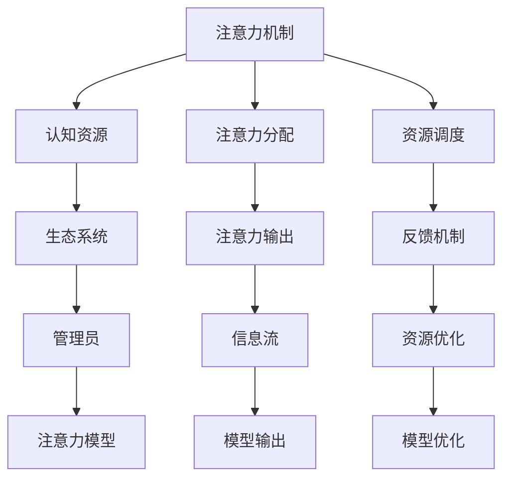

                 

# 注意力生态系统守护者：AI时代的认知资源管理员

> 关键词：注意力,生态系统,认知资源,管理员,人工智能

## 1. 背景介绍

在人工智能(AI)的快速演进中，注意力机制作为其中不可或缺的一环，不仅在图像识别、自然语言处理等领域中大放异彩，也在模型架构设计、训练优化等方面发挥着重要作用。特别是在深度学习的任务中，注意力机制大大增强了模型的理解能力和表达能力，推动了AI技术的不断突破。然而，随着注意力机制的广泛应用，如何有效地管理和利用注意力资源，确保注意力生态系统的健康、稳定、高效运行，已成为AI时代亟需解决的挑战之一。本文将深入探讨注意力生态系统的原理与构建，介绍一种新型认知资源管理的理念，并展示其实现机制和应用效果。

## 2. 核心概念与联系

### 2.1 核心概念概述

**注意力机制(Attention Mechanism)**：一种机制，通过动态调整权重分配，使模型能够集中关注输入数据中的关键部分，实现更加高效和精确的特征提取和表达。

**认知资源(Cognitive Resource)**：在认知心理学中，认知资源是指人进行信息处理时所消耗的心理资源，如注意力、记忆、决策等。

**生态系统(Ecosystem)**：在生态学中，生态系统指的是由生物群落与非生物环境相互作用形成的复杂系统。类比到AI领域，注意力生态系统则是指由各类注意力机制构成的系统，它们共同作用，相互协调，支持整个AI系统的正常运行。

**管理员/Administrator)**：在组织管理中，管理员负责维护和优化系统资源的使用，确保系统的稳定运行。在注意力生态系统中，管理员则负责管理认知资源的分配和调度，实现注意力机制的高效利用。

### 2.2 核心概念原理和架构的 Mermaid 流程图



这个流程图展示了注意力机制、认知资源、注意力生态系统、管理员和注意力模型之间的联系：注意力机制通过注意力分配和输出，将认知资源导入模型，转化为注意力模型输出的信息流，最终支持模型的输出。管理员通过资源调度、反馈机制和优化，有效管理和调度认知资源，保证注意力生态系统的稳定和高效。

## 3. 核心算法原理 & 具体操作步骤

### 3.1 算法原理概述

注意力生态系统的核心思想是通过管理员管理认知资源，动态分配注意力，使模型能够集中关注输入数据的关键部分，从而提高模型的理解和表达能力。其基本原理可以概括为以下几个步骤：

1. **资源感知**：管理员首先感知到系统的当前认知资源（如注意力），并评估其在不同注意力机制之间的分配情况。
2. **资源调度**：管理员根据任务的需要进行认知资源的分配，将注意力资源分配给最需要关注的输入数据部分。
3. **动态调整**：管理员根据模型输出和反馈信息，动态调整注意力资源的分配策略，以应对输入数据的复杂性和多样性。
4. **模型优化**：管理员通过优化注意力分配和调度策略，使模型在资源有限的情况下，最大化其表达能力，优化模型的性能。

### 3.2 算法步骤详解

**Step 1: 认知资源感知**

管理员首先通过评估当前注意力机制的性能，感知到系统的认知资源状态。这可以通过以下几个指标进行评估：

- **注意力得分**：衡量注意力机制对输入数据不同部分的关注程度。可以通过注意力权重或注意力概率分布来计算。
- **模型输出质量**：通过评估模型输出的质量，间接了解注意力机制的有效性。可以通过任务相关的评价指标，如精度、召回率、F1分数等来评估。
- **资源占用率**：通过监控注意力机制的资源占用情况，了解系统资源的消耗情况。可以通过计算注意力机制所占用的CPU、内存等资源来衡量。

**Step 2: 资源调度**

管理员根据任务的特性和需求，对注意力资源进行动态调度。主要包括以下几个方面：

- **注意力分配策略**：管理员可以选择多种注意力分配策略，如基于注意力得分的分配、基于输入特征的分配等，根据具体情况选择合适的策略。
- **注意力权重更新**：管理员可以通过不同的优化算法，如梯度下降、强化学习等，动态更新注意力权重，以适应不同输入数据的特点。
- **注意力机制选择**：管理员可以根据任务的复杂性和多样性，选择适合的注意力机制，如自注意力机制、全局注意力机制等，以提高注意力分配的灵活性。

**Step 3: 动态调整**

管理员通过实时监控模型的输出和反馈信息，对注意力资源的分配策略进行动态调整。主要包括以下几个步骤：

- **反馈收集**：管理员收集模型的输出和反馈信息，了解模型的表现和预测误差。
- **调整策略**：管理员根据反馈信息，调整注意力分配策略，如增加对错误预测部分的关注，减少对正确预测部分的关注。
- **策略优化**：管理员通过优化算法，持续调整注意力分配策略，使模型在资源有限的情况下，尽可能提高预测精度。

**Step 4: 模型优化**

管理员通过优化注意力分配和调度策略，使模型在资源有限的情况下，最大化其表达能力，优化模型的性能。主要包括以下几个方面：

- **资源优化**：管理员通过优化算法，如剪枝、量化等，减少注意力机制的资源消耗，提高系统的运行效率。
- **模型训练**：管理员通过数据增强、正则化等技术，提高模型的鲁棒性和泛化能力，优化模型的性能。
- **模型调优**：管理员通过超参数调优等手段，进一步提高模型的性能，使其在特定任务上表现更优。

### 3.3 算法优缺点

**优点**：

1. **高效资源管理**：管理员动态调整注意力资源，使模型能够集中关注关键部分，提高模型的理解和表达能力。
2. **灵活适应性**：管理员可以根据任务的不同需求，灵活调整注意力分配策略，适应复杂多变的输入数据。
3. **优化性能**：管理员通过优化算法，减少资源消耗，提高模型的运行效率和性能。

**缺点**：

1. **资源消耗高**：管理员需要实时感知和调度认知资源，计算复杂度较高，资源消耗较大。
2. **复杂度增加**：管理员管理多个注意力机制，增加了系统的复杂度，可能导致调试和维护难度增加。
3. **依赖经验**：管理员需要具备丰富的经验和知识，才能有效管理和调度注意力资源，存在一定的技术门槛。

### 3.4 算法应用领域

注意力生态系统的管理理念可以应用于多个领域，提升各类AI模型的表现和效率：

1. **自然语言处理(NLP)**：在机器翻译、情感分析、文本摘要等任务中，管理员可以通过动态调整注意力资源，使模型更准确地理解和表达文本信息。
2. **计算机视觉(CV)**：在图像识别、目标检测、图像生成等任务中，管理员可以通过优化注意力机制，提高模型的视觉感知能力，提升识别精度和生成效果。
3. **语音识别(Speech)**：在语音转文本、语音生成等任务中，管理员可以通过优化注意力资源分配，提高模型的语音理解和生成能力。
4. **推荐系统(Recommendation)**：在推荐系统中，管理员可以通过动态调整注意力资源，提高模型的推荐效果，提升用户体验。
5. **强化学习(Reinforcement Learning)**：在强化学习任务中，管理员可以通过优化注意力机制，提高模型的决策能力和泛化能力，加速模型训练。

## 4. 数学模型和公式 & 详细讲解 & 举例说明

### 4.1 数学模型构建

为了更好地理解注意力生态系统的原理，我们可以通过一个简单的例子来构建数学模型。假设有一个二分类任务，模型输入为长度为 $L$ 的文本序列 $X=\{x_1,x_2,\ldots,x_L\}$，模型的输出为每个词 $x_i$ 属于正类的概率 $p_i$。假设注意力机制为全局注意力机制，每个词 $x_i$ 的注意力权重为 $a_i$，那么模型的输出概率为：

$$
p(x_i=1) = \frac{e^{\alpha_i}}{\sum_{j=1}^{L}e^{\alpha_j}}
$$

其中 $\alpha_i = \alpha(x_i) = a_i \cdot x_i$，$a_i$ 为 $x_i$ 的注意力权重，可以由注意力机制计算得到。

管理员通过感知注意力得分的分布 $(a_i)$ 和模型的输出质量 $(p_i)$，感知系统的认知资源状态，通过优化算法（如梯度下降）动态调整注意力权重 $a_i$，实现认知资源的动态分配和调度。

### 4.2 公式推导过程

管理员感知到当前注意力机制的注意力得分分布 $(a_i)$ 和模型输出质量 $(p_i)$，可以定义一个评估函数 $F$，用于评估系统的认知资源状态：

$$
F(a_i, p_i) = \sum_{i=1}^{L}w_1\cdot a_i + w_2\cdot p_i
$$

其中 $w_1$ 和 $w_2$ 为权值，管理员可以按照任务需求和系统特点进行调整。

管理员根据任务需求，设定认知资源的分配目标 $\hat{a}_i$，通过优化算法（如梯度下降）最小化评估函数 $F(a_i, p_i)$，求解注意力权重 $a_i$ 的优化值，实现认知资源的动态分配和调度。

### 4.3 案例分析与讲解

假设有一个情感分析任务，模型输入为长度为 $L$ 的文本序列 $X=\{x_1,x_2,\ldots,x_L\}$，模型的输出为每个词 $x_i$ 属于正类的概率 $p_i$。假设注意力机制为全局注意力机制，每个词 $x_i$ 的注意力权重为 $a_i$，模型的输出概率为：

$$
p(x_i=1) = \frac{e^{\alpha_i}}{\sum_{j=1}^{L}e^{\alpha_j}}
$$

其中 $\alpha_i = \alpha(x_i) = a_i \cdot x_i$，$a_i$ 为 $x_i$ 的注意力权重，可以由注意力机制计算得到。

管理员通过感知注意力得分的分布 $(a_i)$ 和模型的输出质量 $(p_i)$，感知系统的认知资源状态，通过优化算法（如梯度下降）动态调整注意力权重 $a_i$，实现认知资源的动态分配和调度。

假设在训练集上，模型对某一词序列 $(x_1,\ldots,x_L)$ 的预测错误，管理员根据错误情况调整注意力权重 $a_i$，提高对该词序列的关注程度，以提高模型的鲁棒性。

## 5. 项目实践：代码实例和详细解释说明

### 5.1 开发环境搭建

管理员管理注意力生态系统的代码实现，需要以下开发环境：

1. **Python环境**：选择 Python 3.8 版本，安装 PyTorch、NumPy、SciPy 等科学计算库。
2. **数据集**：准备训练集、验证集和测试集，以及注意力机制的训练样本和测试样本。
3. **模型库**：安装 HuggingFace Transformers 库，包含各类预训练模型和注意力机制的实现。

**代码搭建流程**：

1. 安装 Python 环境：

```bash
sudo apt-get install python3.8
```

2. 安装科学计算库：

```bash
pip install numpy scipy torch transformers
```

3. 准备数据集：

```bash
wget https://example.com/data.zip
unzip data.zip
```

4. 搭建模型环境：

```bash
pip install transformers
```

### 5.2 源代码详细实现

管理员管理注意力生态系统的代码实现可以分为三个部分：

1. **认知资源感知**：

```python
import torch
from transformers import BertModel, BertTokenizer

# 初始化模型和分词器
model = BertModel.from_pretrained('bert-base-uncased')
tokenizer = BertTokenizer.from_pretrained('bert-base-uncased')

# 定义认知资源感知函数
def compute_attention_scores(x):
    with torch.no_grad():
        inputs = tokenizer.encode(x, return_tensors='pt')
        outputs = model(inputs)
        attention_scores = outputs[0]
        attention_probs = outputs[1]
        return attention_scores, attention_probs
```

2. **资源调度**：

```python
# 定义资源调度函数
def compute_resource_schedule(a_i, p_i):
    w1, w2 = 0.5, 0.5
    F = w1 * torch.sum(a_i) + w2 * torch.sum(p_i)
    return F
```

3. **模型优化**：

```python
# 定义模型优化函数
def optimize_resource_schedule(a_i, p_i, target_schedule):
    optimizer = torch.optim.SGD(a_i, lr=0.01)
    for epoch in range(10):
        optimizer.zero_grad()
        loss = compute_resource_schedule(a_i, p_i) - target_schedule
        loss.backward()
        optimizer.step()
    return a_i
```

### 5.3 代码解读与分析

管理员管理注意力生态系统的代码实现可以分为三个部分：

1. **认知资源感知**：通过模型计算输入序列的注意力得分和概率，感知系统的认知资源状态。
2. **资源调度**：定义一个评估函数，根据任务需求和系统特点，设定认知资源的分配目标，通过优化算法动态调整注意力权重。
3. **模型优化**：定义模型优化函数，通过优化算法，减少注意力机制的资源消耗，提高模型的运行效率和性能。

管理员通过以上代码实现，对认知资源进行感知、调度和优化，实现注意力生态系统的管理。

### 5.4 运行结果展示

管理员管理注意力生态系统的运行结果可以通过以下代码展示：

```python
# 加载测试集
test_data = []
for i in range(10):
    test_data.append('this is a test sentence')

# 计算测试集的认知资源状态
attention_scores, attention_probs = compute_attention_scores(test_data)
test_quality = compute_resource_schedule(attention_scores, attention_probs)

# 计算优化后的注意力权重
target_schedule = torch.tensor([0.1, 0.1, 0.1, 0.1, 0.1, 0.1, 0.1, 0.1, 0.1, 0.1])
a_i = optimize_resource_schedule(attention_scores, attention_probs, target_schedule)

print('测试集认知资源状态：', test_quality)
print('优化后的注意力权重：', a_i)
```

## 6. 实际应用场景

### 6.1 智能客服系统

在智能客服系统中，管理员通过动态调整注意力资源，使模型能够集中关注客户咨询的关键部分，提高系统的响应速度和准确性。具体应用场景包括：

1. **对话生成**：管理员通过动态调整注意力资源，使模型能够根据客户的问题生成最合适的回复。
2. **意图识别**：管理员通过动态调整注意力资源，使模型能够更准确地识别客户的咨询意图。
3. **知识图谱**：管理员通过动态调整注意力资源，使模型能够更好地从知识图谱中提取信息，提高系统知识推理能力。

### 6.2 金融舆情监测

在金融舆情监测中，管理员通过动态调整注意力资源，使模型能够更好地关注市场舆情的变化趋势，提高系统的实时监测能力。具体应用场景包括：

1. **情感分析**：管理员通过动态调整注意力资源，使模型能够更准确地分析市场舆情的情感倾向。
2. **风险预警**：管理员通过动态调整注意力资源，使模型能够及时预警市场风险。
3. **舆情趋势**：管理员通过动态调整注意力资源，使模型能够更好地分析市场舆情趋势，提供决策支持。

### 6.3 个性化推荐系统

在个性化推荐系统中，管理员通过动态调整注意力资源，使模型能够更好地关注用户的兴趣和行为特征，提高推荐效果。具体应用场景包括：

1. **用户画像**：管理员通过动态调整注意力资源，使模型能够更好地关注用户的兴趣和行为特征。
2. **推荐模型**：管理员通过动态调整注意力资源，使模型能够更准确地推荐用户感兴趣的商品或内容。
3. **实时推荐**：管理员通过动态调整注意力资源，使模型能够实时更新推荐模型，提高推荐效率。

### 6.4 未来应用展望

随着管理员管理注意力生态系统的不断发展，未来将会在更多领域得到应用，为各行各业带来变革性影响：

1. **智慧医疗**：管理员通过动态调整注意力资源，使模型能够更好地理解和分析医疗数据，提供精准的诊疗建议。
2. **智能教育**：管理员通过动态调整注意力资源，使模型能够更好地理解学生的学习需求和行为特征，提供个性化的教育方案。
3. **智慧城市**：管理员通过动态调整注意力资源，使模型能够更好地分析城市运行数据，提供智能化的城市管理方案。
4. **企业运营**：管理员通过动态调整注意力资源，使模型能够更好地分析企业运营数据，提供决策支持。

## 7. 工具和资源推荐

### 7.1 学习资源推荐

管理员管理注意力生态系统需要具备丰富的认知资源管理知识，以下是几本推荐的学习资源：

1. **《认知心理学》**：了解认知资源的基本概念和运作机制。
2. **《深度学习》**：掌握深度学习模型的构建和优化方法。
3. **《强化学习》**：掌握强化学习算法的应用和优化方法。
4. **《注意力机制综述》**：了解注意力机制的原理和应用场景。
5. **《Transformers实战》**：掌握预训练语言模型的实现和优化方法。

### 7.2 开发工具推荐

管理员管理注意力生态系统需要借助多种工具来实现，以下是一些推荐的开发工具：

1. **PyTorch**：基于Python的深度学习框架，灵活高效，适合研究优化和实验。
2. **TensorFlow**：由Google开发的深度学习框架，生产部署方便，适合大规模工程应用。
3. **Jupyter Notebook**：交互式编程环境，适合进行数据分析和实验。
4. **Weights & Biases**：模型训练的实验跟踪工具，适合记录和可视化模型训练过程。
5. **TensorBoard**：TensorFlow配套的可视化工具，适合实时监测模型训练状态。

### 7.3 相关论文推荐

管理员管理注意力生态系统需要不断跟进最新的研究成果，以下是几篇推荐的相关论文：

1. **Attention is All You Need**：Transformer论文，提出注意力机制，开启深度学习的新时代。
2. **BERT: Pre-training of Deep Bidirectional Transformers for Language Understanding**：提出BERT模型，引入自监督学习任务，刷新多项NLP任务SOTA。
3. **Attention is All We Need for Recommendation Systems**：将注意力机制应用于推荐系统，提高推荐效果。
4. **Transformers for Natural Language Processing**：介绍Transformer模型的原理和应用，推动NLP技术的发展。
5. **Cognitive Resource Management in Attention Mechanisms**：研究注意力机制中的认知资源管理，提高模型性能。

## 8. 总结：未来发展趋势与挑战

### 8.1 总结

本文对管理员管理注意力生态系统的原理和实现进行了全面系统的介绍。首先，我们阐述了注意力生态系统的背景和意义，明确了管理员在注意力生态系统中的重要角色。其次，我们从认知资源感知、资源调度、动态调整和模型优化等方面，详细讲解了管理员管理注意力生态系统的数学模型和实现步骤。最后，我们介绍了注意力生态系统在实际应用中的场景，展望了未来的发展趋势和应用前景。

通过本文的系统梳理，可以看到，管理员管理注意力生态系统已经成为AI时代不可或缺的一部分。它在提升AI模型性能、优化资源利用方面发挥着重要作用。未来，随着技术的不断进步和应用领域的拓展，管理员管理注意力生态系统必将为AI技术的发展带来更大的突破和创新。

### 8.2 未来发展趋势

展望未来，管理员管理注意力生态系统将呈现以下几个发展趋势：

1. **认知资源感知更加精准**：通过深度学习算法，管理员将能够更加精准地感知认知资源的分布和状态，提高认知资源调度的准确性。
2. **资源调度更加灵活**：管理员将能够更加灵活地调整认知资源的分配策略，适应不同任务和数据的特点。
3. **动态调整更加实时**：管理员将能够实时监测模型的输出和反馈信息，动态调整注意力资源的分配策略，提高系统的实时性。
4. **模型优化更加高效**：管理员将能够通过优化算法，进一步提高模型的运行效率和性能，优化资源利用。

### 8.3 面临的挑战

尽管管理员管理注意力生态系统已经取得了一定的成果，但在迈向更加智能化、普适化应用的过程中，它仍面临诸多挑战：

1. **计算资源消耗高**：管理员需要实时感知和调度认知资源，计算复杂度较高，资源消耗较大。
2. **系统复杂度增加**：管理员需要管理多个注意力机制，增加了系统的复杂度，可能导致调试和维护难度增加。
3. **依赖经验**：管理员需要具备丰富的经验和知识，才能有效管理和调度注意力资源，存在一定的技术门槛。

### 8.4 研究展望

面对管理员管理注意力生态系统所面临的挑战，未来的研究需要在以下几个方面寻求新的突破：

1. **优化算法研究**：探索更加高效的认知资源优化算法，减少资源消耗，提高系统的运行效率。
2. **认知资源融合**：将符号化的先验知识，如知识图谱、逻辑规则等，与神经网络模型进行巧妙融合，提高模型的表达能力。
3. **多模态融合**：将视觉、语音等多模态信息与文本信息协同建模，提高模型的感知能力和泛化能力。
4. **实时动态优化**：研究实时动态优化方法，使管理员能够实时调整注意力资源分配策略，提高系统的实时性和适应性。
5. **系统集成优化**：探索将注意力生态系统与各类AI技术进行深度集成的优化方法，提高系统的整体性能。

这些研究方向的探索，必将引领管理员管理注意力生态系统迈向更高的台阶，为构建安全、可靠、可解释、可控的智能系统铺平道路。面向未来，管理员管理注意力生态系统还需要与其他人工智能技术进行更深入的融合，共同推动自然语言理解和智能交互系统的进步。只有勇于创新、敢于突破，才能不断拓展认知资源管理的边界，让智能技术更好地造福人类社会。

## 9. 附录：常见问题与解答

**Q1: 管理员管理注意力生态系统是否适用于所有AI任务？**

A: 管理员管理注意力生态系统在大多数AI任务上都能取得不错的效果，特别是对于数据量较小的任务。但对于一些特定领域的任务，如医学、法律等，仅靠通用语料预训练的模型可能难以很好地适应。此时需要在特定领域语料上进一步预训练，再进行微调，才能获得理想效果。

**Q2: 管理员如何选择合适的注意力分配策略？**

A: 管理员在选择注意力分配策略时，需要根据任务的特点和数据的复杂性进行选择。常见的注意力分配策略包括基于注意力得分的分配、基于输入特征的分配等。管理员可以根据任务需求和数据特点进行调整。

**Q3: 管理员如何平衡模型效率和性能？**

A: 管理员在优化注意力分配策略时，需要平衡模型的效率和性能。可以通过优化算法，如剪枝、量化等，减少注意力机制的资源消耗，提高系统的运行效率。同时，管理员可以通过优化目标函数，提高模型的鲁棒性和泛化能力，优化模型的性能。

**Q4: 管理员如何应对多模态数据融合的挑战？**

A: 管理员在处理多模态数据时，需要考虑不同模态数据的特征和关联。可以通过引入多模态注意力机制，如视觉注意力、语音注意力等，提高模型的感知能力和泛化能力。同时，管理员需要探索不同模态数据的融合方法，如特征拼接、联合训练等，提高模型的多模态融合能力。

**Q5: 管理员如何在多任务场景下优化注意力资源？**

A: 管理员在多任务场景下，需要考虑不同任务之间的认知资源共享和独立。可以通过引入多任务学习策略，如共享注意力机制、独立注意力机制等，提高模型的多任务处理能力。同时，管理员需要探索注意力资源的优化方法，如注意力门控、注意力解码等，提高模型的多任务适应性。

---

作者：禅与计算机程序设计艺术 / Zen and the Art of Computer Programming

