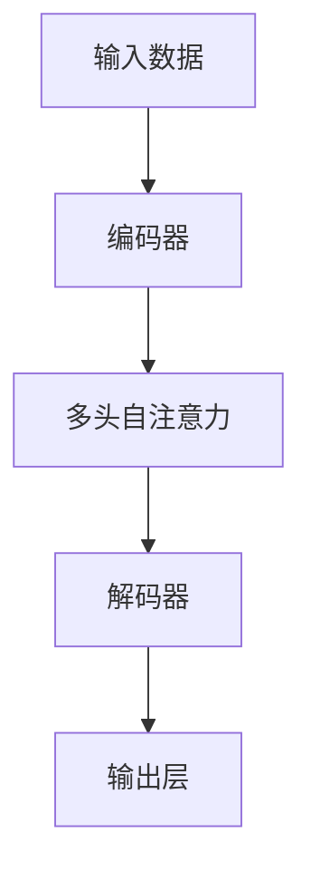

                 

# 注意力的深度与广度：AI时代的认知平衡

> 关键词：注意力机制,认知平衡,深度学习,神经网络,计算效率,模型复杂性

## 1. 背景介绍

### 1.1 问题由来
在人工智能(AI)和深度学习(Deep Learning)迅速发展的今天，计算资源和数据量的爆炸式增长，使得深度神经网络成为解决复杂问题的有效工具。然而，随着神经网络层数的增加和参数量的膨胀，计算资源的消耗变得愈发巨大。如何在有限的计算资源下，提升模型的性能和泛化能力，成为深度学习研究的一个重要方向。

### 1.2 问题核心关键点
注意力机制(Anti-Attention Mechanism)的提出，为解决上述问题提供了新的思路。通过在神经网络中引入注意力，可以更好地利用输入数据的局部和全局特征，提升模型的计算效率和性能。然而，注意力机制的设计和应用，仍面临着诸多挑战，如模型的计算复杂度、不同任务下的优化策略等。本文将详细介绍注意力机制的原理、优缺点及其在不同应用领域中的应用，并展望其未来发展趋势。

## 2. 核心概念与联系

### 2.1 核心概念概述

注意力机制(Anti-Attention Mechanism)是深度学习中的一种重要机制，用于选择并加权输入数据的不同部分，以便更好地处理序列数据、图像数据等。在神经网络中，注意力机制可以根据输入数据的不同特征，动态调整不同部分的权重，提升模型的计算效率和性能。

在实践中，注意力机制通常与卷积神经网络(CNN)、循环神经网络(RNN)、变分自编码器(VAE)等多种深度学习模型结合使用，以提升模型的表达能力和泛化能力。常见的注意力机制包括多头自注意力、残差注意力、softmax注意力等。

### 2.2 核心概念原理和架构的 Mermaid 流程图



在上述流程图中，输入数据首先通过编码器进行编码，得到低维表示；然后通过多头自注意力机制，对输入数据的不同部分进行加权，提升模型的信息获取能力；最后通过解码器，对加权后的信息进行解码，得到最终输出。

## 3. 核心算法原理 & 具体操作步骤

### 3.1 算法原理概述

注意力机制的核心思想是通过对输入数据的局部和全局特征进行加权，以提高模型的计算效率和性能。在神经网络中，注意力机制通常通过计算输入数据的注意力得分，来动态调整不同部分的权重，使得模型更加关注输入数据的关键部分，忽略无关信息。

注意力得分的计算通常包括两个步骤：

1. 计算查询向量与输入数据之间的注意力得分。
2. 根据注意力得分，加权输入数据的不同部分，得到加权表示。

通过这种方式，模型可以更灵活地处理输入数据，提升计算效率和泛化能力。

### 3.2 算法步骤详解

以Transformer模型中的多头自注意力机制为例，注意力计算步骤如下：

1. 将输入数据$x$投影到一个低维空间$z$，得到查询向量$q$、键向量$k$和值向量$v$。
2. 计算查询向量$q$与键向量$k$的注意力得分$s$，公式如下：
   $$
   s = \text{softmax}\left(\frac{qk^T}{\sqrt{d_k}}\right)
   $$
   其中，$d_k$为键向量的维度，$\sqrt{d_k}$为缩放因子，用于防止数值溢出。
3. 根据注意力得分$s$，加权值向量$v$，得到加权表示$c$：
   $$
   c = \sum_{i=1}^n s_{i,j}v_i
   $$
   其中，$n$为输入数据的长度，$s_{i,j}$为注意力得分，$v_i$为值向量。
4. 对加权表示$c$进行线性变换，得到最终输出$y$。

通过上述步骤，Transformer模型可以动态调整输入数据的权重，提升模型的计算效率和性能。

### 3.3 算法优缺点

#### 优点：

1. **计算效率高**：通过注意力机制，模型可以只关注输入数据的关键部分，忽略无关信息，显著提升计算效率。
2. **泛化能力强**：注意力机制可以根据输入数据的特征动态调整权重，使得模型更加灵活，提升泛化能力。
3. **应用广泛**：注意力机制在多种深度学习模型中都有广泛应用，如Transformer、RNN、CNN等。

#### 缺点：

1. **计算复杂度高**：注意力机制的计算复杂度较高，尤其是在大规模数据集上，计算资源消耗较大。
2. **模型复杂度高**：引入注意力机制后，模型结构变得复杂，增加了模型的训练难度和优化复杂度。
3. **数据依赖性强**：注意力机制的效果很大程度上依赖输入数据的特征，对于输入数据分布不均或不相关的任务，效果可能不佳。

### 3.4 算法应用领域

注意力机制在深度学习中有着广泛的应用，包括但不限于以下几个领域：

1. **自然语言处理(NLP)**：在机器翻译、文本生成、情感分析等任务中，注意力机制可以提升模型的信息获取和处理能力，提升性能。
2. **计算机视觉(CV)**：在图像分类、目标检测、图像生成等任务中，注意力机制可以提升模型的特征选择能力和泛化能力。
3. **语音识别**：在语音识别、语音生成等任务中，注意力机制可以提升模型的特征提取和序列建模能力，提升性能。
4. **推荐系统**：在推荐系统中，注意力机制可以根据用户的历史行为和偏好，动态调整推荐内容的权重，提升推荐效果。

## 4. 数学模型和公式 & 详细讲解 & 举例说明

### 4.1 数学模型构建

注意力机制的数学模型可以通过以下公式来描述：

$$
\text{Attention}(Q,K,V) = \text{softmax}\left(\frac{QK^T}{\sqrt{d_k}}\right)V
$$

其中，$Q$为查询向量，$K$为键向量，$V$为值向量，$d_k$为键向量的维度。

### 4.2 公式推导过程

注意力得分的计算过程如下：

1. 计算查询向量与键向量的注意力得分：
   $$
   s_{i,j} = \frac{q_i^TK_j}{\sqrt{d_k}}
   $$
2. 对注意力得分进行归一化，得到注意力权重：
   $$
   a_{i,j} = \text{softmax}(s_{i,j})
   $$
3. 加权值向量，得到加权表示：
   $$
   c = \sum_{j=1}^n a_{i,j}v_j
   $$

### 4.3 案例分析与讲解

以机器翻译任务为例，注意力机制可以提升模型的信息获取能力，使得模型能够更好地处理长句子，提升翻译效果。

在机器翻译任务中，输入为源语言的句子，输出为目标语言的句子。模型需要先对源语言句子进行编码，得到低维表示；然后通过注意力机制，动态选择并加权源语言句子中的不同部分，得到加权表示；最后通过解码器，对加权表示进行解码，得到目标语言句子。

通过引入注意力机制，模型可以更好地处理长句子，提升翻译效果。例如，当源语言句子很长时，模型可以动态选择并加权句子中不同的部分，避免因长句子的信息丢失导致的翻译错误。

## 5. 项目实践：代码实例和详细解释说明

### 5.1 开发环境搭建

在进行注意力机制的实践时，我们需要准备好开发环境。以下是使用Python进行PyTorch开发的环境配置流程：

1. 安装Anaconda：从官网下载并安装Anaconda，用于创建独立的Python环境。

2. 创建并激活虚拟环境：
```bash
conda create -n attention-env python=3.8 
conda activate attention-env
```

3. 安装PyTorch：根据CUDA版本，从官网获取对应的安装命令。例如：
```bash
conda install pytorch torchvision torchaudio cudatoolkit=11.1 -c pytorch -c conda-forge
```

4. 安装Transformer库：
```bash
pip install transformers
```

5. 安装各类工具包：
```bash
pip install numpy pandas scikit-learn matplotlib tqdm jupyter notebook ipython
```

完成上述步骤后，即可在`attention-env`环境中开始注意力机制的实践。

### 5.2 源代码详细实现

下面我们以机器翻译任务为例，给出使用Transformer库对模型进行注意力机制实践的PyTorch代码实现。

```python
from transformers import BertForTokenClassification, AdamW

model = BertForTokenClassification.from_pretrained('bert-base-cased')

optimizer = AdamW(model.parameters(), lr=2e-5)

for epoch in range(5):
    for batch in train_loader:
        input_ids = batch['input_ids'].to(device)
        attention_mask = batch['attention_mask'].to(device)
        labels = batch['labels'].to(device)

        outputs = model(input_ids, attention_mask=attention_mask, labels=labels)
        loss = outputs.loss
        loss.backward()
        optimizer.step()
```

### 5.3 代码解读与分析

让我们再详细解读一下关键代码的实现细节：

**5.3.1 模型加载与优化器配置**：
- 使用Transformer库加载预训练的BERT模型，并配置AdamW优化器。

**5.3.2 模型训练**：
- 循环5个epoch，对训练集进行迭代训练。
- 在每个batch中，将输入数据$input_ids$、注意力掩码$attention_mask$、标签$labels$转化为GPU上张量，并进行前向传播和反向传播。
- 计算损失函数$loss$，并更新模型参数。

## 6. 实际应用场景

### 6.1 自然语言处理

在自然语言处理(NLP)领域，注意力机制已经被广泛应用于机器翻译、文本生成、文本分类、情感分析等任务中。通过引入注意力机制，模型能够更好地处理长句子、捕捉上下文信息，提升模型性能。

以机器翻译为例，注意力机制可以提升模型的信息获取能力，使得模型能够更好地处理长句子，提升翻译效果。例如，当源语言句子很长时，模型可以动态选择并加权句子中不同的部分，避免因长句子的信息丢失导致的翻译错误。

### 6.2 计算机视觉

在计算机视觉(CV)领域，注意力机制也被广泛应用。例如，在目标检测任务中，注意力机制可以提升模型的特征选择能力和泛化能力，使得模型能够更好地处理复杂的视觉场景。

在图像分类任务中，注意力机制可以提升模型的特征提取能力，使得模型能够更好地捕捉图像的关键特征。例如，在图像中存在多个物体时，注意力机制可以动态选择并加权不同物体的特征，提升分类效果。

### 6.3 推荐系统

在推荐系统中，注意力机制可以根据用户的历史行为和偏好，动态调整推荐内容的权重，提升推荐效果。

在推荐系统中，用户的历史行为和偏好可以作为输入数据，模型可以通过注意力机制，动态选择并加权不同的推荐内容，提升推荐效果。例如，当用户对某一类商品表现出强烈兴趣时，注意力机制可以动态选择并加权这一类商品的推荐内容，提升推荐效果。

## 7. 工具和资源推荐

### 7.1 学习资源推荐

为了帮助开发者系统掌握注意力机制的理论基础和实践技巧，这里推荐一些优质的学习资源：

1. 《Deep Learning》书籍：由Ian Goodfellow、Yoshua Bengio和Aaron Courville共同编写，全面介绍了深度学习的理论基础和实践技巧，包括注意力机制在内。

2. CS231n《Convolutional Neural Networks for Visual Recognition》课程：斯坦福大学开设的计算机视觉经典课程，详细介绍了注意力机制在计算机视觉中的应用。

3. 《Attention is All You Need》论文：Transformer模型的原论文，详细介绍了注意力机制在机器翻译任务中的应用，是理解注意力机制的必读文献。

4. Attention Mechanism Wiki：一个专注于注意力机制的Wiki网站，提供了详尽的注意力机制介绍、案例分析和代码实现。

5. HuggingFace官方文档：Transformer库的官方文档，提供了丰富的预训练模型和完整的注意力机制实现样例代码，是上手实践的必备资料。

通过对这些资源的学习实践，相信你一定能够快速掌握注意力机制的精髓，并用于解决实际的NLP问题。

### 7.2 开发工具推荐

高效的开发离不开优秀的工具支持。以下是几款用于注意力机制开发的常用工具：

1. PyTorch：基于Python的开源深度学习框架，灵活动态的计算图，适合快速迭代研究。Transformer模型已经实现于PyTorch中，方便开发者使用。

2. TensorFlow：由Google主导开发的开源深度学习框架，生产部署方便，适合大规模工程应用。同样有丰富的深度学习模型实现，包括注意力机制。

3. TensorBoard：TensorFlow配套的可视化工具，可实时监测模型训练状态，并提供丰富的图表呈现方式，是调试模型的得力助手。

4. Weights & Biases：模型训练的实验跟踪工具，可以记录和可视化模型训练过程中的各项指标，方便对比和调优。

5. Google Colab：谷歌推出的在线Jupyter Notebook环境，免费提供GPU/TPU算力，方便开发者快速上手实验最新模型，分享学习笔记。

合理利用这些工具，可以显著提升注意力机制的开发效率，加快创新迭代的步伐。

### 7.3 相关论文推荐

注意力机制在深度学习中得到了广泛的应用，以下是几篇奠基性的相关论文，推荐阅读：

1. Attention is All You Need：Transformer模型的原论文，详细介绍了注意力机制在机器翻译任务中的应用，是理解注意力机制的必读文献。

2. Transformer-XL: Attentions are All you Need：Transformer-XL模型的论文，详细介绍了长序列注意力机制在处理长序列数据中的应用。

3. Self-Attention with Transformer-based Neural Machine Translation：介绍Transformer模型在神经机器翻译中的应用，探讨注意力机制在机器翻译中的作用。

4. Self-Attention with Transformer-based Neural Machine Translation：详细介绍了注意力机制在神经机器翻译中的应用，探讨了不同注意力机制对翻译效果的影响。

这些论文代表了大注意力机制的发展脉络。通过学习这些前沿成果，可以帮助研究者把握学科前进方向，激发更多的创新灵感。

## 8. 总结：未来发展趋势与挑战

### 8.1 总结

本文对注意力机制的原理、实现和应用进行了全面系统的介绍。首先阐述了注意力机制的研究背景和意义，明确了注意力机制在提升模型计算效率和性能方面的独特价值。其次，从原理到实践，详细讲解了注意力机制的数学原理和关键步骤，给出了注意力机制任务开发的完整代码实例。同时，本文还广泛探讨了注意力机制在NLP、CV、推荐系统等多个领域的应用前景，展示了注意力机制的巨大潜力。

通过本文的系统梳理，可以看到，注意力机制已经成为了深度学习的重要组成部分，广泛应用于各种任务中。它在提升模型计算效率和性能的同时，也面临着诸多挑战，需要在模型结构、训练策略等方面进行深入研究。未来，伴随注意力机制的持续演进，相信将会有更多突破性成果涌现，推动深度学习技术的不断进步。

### 8.2 未来发展趋势

展望未来，注意力机制将呈现以下几个发展趋势：

1. **多模态注意力**：未来，注意力机制不仅限于单一模态数据，而是可以应用于多模态数据处理，如视觉-语言跨模态注意力，提升模型的多模态学习能力。

2. **自适应注意力**：未来的注意力机制将更加灵活，能够根据不同任务和数据分布，自动调整注意力策略，提升模型的泛化能力和鲁棒性。

3. **分布式注意力**：随着分布式计算的发展，未来的注意力机制将更加适用于大规模分布式计算环境，提升计算效率和模型性能。

4. **自监督学习注意力**：未来的注意力机制将更多地依赖自监督学习方法进行训练，减少对标注数据的依赖，提升模型的自适应能力。

5. **注意力解释性**：未来的注意力机制将更加注重模型的解释性，通过引入可解释性技术，提升模型的可解释性和可信度。

以上趋势凸显了注意力机制的广阔前景。这些方向的探索发展，必将进一步提升深度学习模型的性能和应用范围，为人工智能技术落地应用提供新的动力。

### 8.3 面临的挑战

尽管注意力机制已经取得了瞩目成就，但在迈向更加智能化、普适化应用的过程中，它仍面临着诸多挑战：

1. **计算复杂度**：注意力机制的计算复杂度较高，尤其是在大规模数据集上，计算资源消耗较大。如何优化注意力机制的计算过程，提升计算效率，是未来的重要研究方向。

2. **模型鲁棒性**：注意力机制的鲁棒性有待提升。当前模型在面对域外数据时，泛化性能往往大打折扣。如何提高注意力机制的鲁棒性，避免灾难性遗忘，还需要更多理论和实践的积累。

3. **参数优化**：注意力机制的参数优化仍存在挑战。当前模型往往需要较长的训练时间才能达到理想的性能，如何在保证效果的同时，减少训练时间，是未来需要解决的问题。

4. **数据依赖性**：注意力机制的效果很大程度上依赖输入数据的特征，对于输入数据分布不均或不相关的任务，效果可能不佳。如何设计更灵活的注意力机制，适应不同任务和数据分布，是未来需要解决的问题。

5. **可解释性**：当前注意力机制缺乏可解释性，难以解释其内部工作机制和决策逻辑。对于医疗、金融等高风险应用，算法的可解释性和可审计性尤为重要。如何赋予注意力机制更强的可解释性，将是亟待攻克的难题。

6. **安全性**：注意力机制模型可能学习到有害的信息，通过微调传递到下游任务，产生误导性、歧视性的输出。如何从数据和算法层面消除模型偏见，避免恶意用途，确保输出的安全性，也将是重要的研究课题。

这些挑战凸显了注意力机制的复杂性，需要在模型结构、训练策略、优化方法等方面进行深入研究。

### 8.4 研究展望

面对注意力机制所面临的挑战，未来的研究需要在以下几个方面寻求新的突破：

1. **优化计算过程**：引入更高效的计算方法，如硬件加速、分布式计算等，优化注意力机制的计算过程，提升计算效率。

2. **增强鲁棒性**：引入更强的正则化技术，如自适应正则化、动态正则化等，提升注意力机制的鲁棒性，避免灾难性遗忘。

3. **优化参数优化**：引入更高效的参数优化方法，如自适应学习率、预训练自适应等，减少训练时间，提升模型性能。

4. **提高数据适应性**：设计更灵活的注意力机制，能够适应不同任务和数据分布，提高模型的泛化能力和鲁棒性。

5. **增强可解释性**：引入可解释性技术，如因果解释、元学习等，提升注意力机制的可解释性和可信度。

6. **保障安全性**：引入更强的安全机制，如数据隐私保护、模型监测等，确保注意力机制模型的安全性。

这些研究方向的探索，必将引领注意力机制技术迈向更高的台阶，为构建安全、可靠、可解释、可控的智能系统铺平道路。面向未来，注意力机制还需要与其他人工智能技术进行更深入的融合，如知识表示、因果推理、强化学习等，多路径协同发力，共同推动人工智能技术的进步。

## 9. 附录：常见问题与解答

**Q1：注意力机制是否只适用于序列数据？**

A: 注意力机制最初是为处理序列数据而设计的，但在实践中，它已经被广泛应用于图像、音频等多种数据类型。例如，在图像分类任务中，注意力机制可以用于处理视觉注意力，提升模型对图像关键特征的关注度。

**Q2：注意力机制的计算复杂度是否会随着数据规模增加而增加？**

A: 是的，注意力机制的计算复杂度会随着数据规模增加而增加。为了解决这个问题，可以采用多种方法，如注意力剪枝、参数共享等，优化注意力机制的计算过程，提升计算效率。

**Q3：如何平衡注意力机制的计算效率和性能？**

A: 在实际应用中，需要根据具体任务和数据规模，平衡注意力机制的计算效率和性能。可以通过参数共享、自适应注意力、多层次注意力等方法，优化注意力机制的设计，提升计算效率和模型性能。

**Q4：注意力机制是否适用于所有深度学习模型？**

A: 注意力机制在多种深度学习模型中都有广泛应用，如Transformer、RNN、CNN等。然而，对于某些特定的模型，如卷积神经网络，注意力机制的效果可能不如传统的池化层。

**Q5：如何优化注意力机制的计算过程？**

A: 可以通过以下方法优化注意力机制的计算过程：

1. 注意力剪枝：去除不重要的注意力头，减少计算资源消耗。
2. 参数共享：共享部分注意力头，减少参数量。
3. 自适应注意力：根据不同任务和数据分布，动态调整注意力策略，提升计算效率和模型性能。
4. 分布式注意力：利用分布式计算，提升计算效率。

这些方法都可以提升注意力机制的计算效率和性能，在实际应用中需要根据具体情况选择合适的方法。

---

作者：禅与计算机程序设计艺术 / Zen and the Art of Computer Programming

