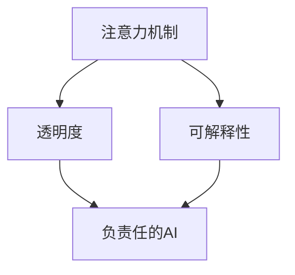

                 

# 注意力的自主权：AI时代的个人选择

## 1. 背景介绍

在AI时代，人类进入了一个充满技术奇迹的时代。在以往的数十年里，计算机科学家们不断推动人工智能技术的进步，使得AI技术能够处理和理解越来越复杂的任务，从简单的图像识别到高级的自然语言处理，从复杂的棋类游戏到复杂的战略决策。但与此同时，AI技术的发展也给人类带来了前所未有的挑战：在科技的浪潮中，人类是否还能保持对注意力的自主权？这一问题引发了广泛的讨论。

**1.1 定义问题：注意力**
注意力（Attention）是认知科学中的基本概念，指的是个体在处理信息时的集中程度。在AI技术中，注意力机制被广泛应用于自然语言处理、计算机视觉和语音识别等领域，以提升模型的表现。例如，在自然语言处理中，注意力机制可以帮助模型在理解长句时，自动关注到关键信息。

**1.2 背景来源**
在AI技术飞速发展的今天，机器学习模型，尤其是深度神经网络，已经成为许多应用的关键组成部分。然而，这些模型往往缺乏可解释性，使得人们难以理解其决策过程。这一现象被称为“黑箱问题”，使得AI技术在实际应用中面临诸多挑战。因此，提升AI技术的透明度和可解释性，成为了当前的重要研究课题。

## 2. 核心概念与联系

### 2.1 核心概念概述

在AI时代，注意力已成为关键技术之一。本文将介绍几个关键概念：

- **注意力机制（Attention Mechanism）**：一种通过计算权重，从输入序列中提取重要信息的机制。常用于机器翻译、文本摘要、图像分类等任务。
- **可解释性（Explainability）**：指模型的输出和决策过程能够被清晰理解，有助于提高用户的信任和满意度。
- **透明度（Transparency）**：指模型的决策过程能够被透明地观察和理解，有助于发现模型的潜在问题和改进。
- **负责任的AI（Responsible AI）**：指AI技术的发展和应用应当符合伦理和道德标准，尊重和保护人类的权益。

### 2.2 核心概念联系

这些概念之间的联系可以通过以下Mermaid流程图来展示：



这一流程图表明，透明度和可解释性是注意力机制得以负责任运用的基础。通过提高模型的透明度和可解释性，可以更好地理解注意力机制的工作原理，从而制定出更加负责任的AI应用策略。

## 3. 核心算法原理 & 具体操作步骤
### 3.1 算法原理概述

注意力机制的核心思想是，通过计算输入序列中每个元素的重要性权重，来选择对输出有最大贡献的信息。这一过程通常通过以下三个步骤实现：

1. **查询（Query）**：输入一个查询向量，用于表示需要提取的信息。
2. **键值对（Key-Value Pair）**：输入一个包含键值对的矩阵，每个键表示一个输入元素，每个值表示该元素的重要程度。
3. **注意力得分（Attention Score）**：计算查询向量与每个键的相似度，从而得到每个元素的权重。

这一过程可以通过公式进行计算：

$$
\text{Attention Score} = \frac{\text{Query} \cdot \text{Key}^T}{\sqrt{d_k}} + \text{Bias}
$$

其中，$d_k$为键的维度，$\text{Query}$和$\text{Key}$通过矩阵乘法进行计算。最终的注意力权重可以用于加权平均输入元素，得到输出结果。

### 3.2 算法步骤详解

以下是注意力机制的具体操作步骤：

**Step 1: 输入准备**
- 准备查询向量 $\text{Query}$ 和包含键值对的矩阵 $K$。
- 将矩阵 $K$ 进行归一化处理，使得每个键的权重都在 $[0, 1]$ 范围内。

**Step 2: 计算注意力得分**
- 对查询向量 $\text{Query}$ 和每个键 $\text{Key}$ 进行矩阵乘法，得到注意力得分。
- 对注意力得分进行softmax归一化，得到注意力权重。

**Step 3: 计算注意力结果**
- 对注意力权重与矩阵 $K$ 中的值进行加权平均，得到注意力结果。
- 将注意力结果与输入的其他部分进行拼接，送入后续层进行处理。

### 3.3 算法优缺点

**3.3.1 优点**
- **提高模型表现**：通过关注输入序列中的关键信息，注意力机制能够提升模型的表现，特别是在处理长序列和复杂任务时。
- **灵活性高**：注意力机制可以用于多种任务，如机器翻译、文本摘要、图像分类等，适用范围广泛。
- **可解释性强**：注意力机制可以提供对输入序列中各个元素的关注程度，有助于理解模型的决策过程。

**3.3.2 缺点**
- **计算复杂度高**：计算注意力得分需要大量计算资源，特别是在处理大规模数据时。
- **模型复杂度高**：注意力机制通常需要额外的参数和计算，增加了模型的复杂度。
- **可解释性不足**：虽然注意力机制能够提供部分可解释性，但无法完全解释模型的决策过程。

### 3.4 算法应用领域

注意力机制在多个领域中得到了广泛应用，以下是一些主要应用领域：

- **自然语言处理**：如机器翻译、文本摘要、情感分析等任务。
- **计算机视觉**：如图像分类、目标检测、图像生成等任务。
- **语音识别**：如语音转文本、语音情感识别等任务。
- **推荐系统**：如协同过滤、基于内容的推荐等任务。

## 4. 数学模型和公式 & 详细讲解 & 举例说明

### 4.1 数学模型构建

注意力机制可以通过以下数学模型进行建模：

$$
\text{Attention Score} = \frac{\text{Query} \cdot \text{Key}^T}{\sqrt{d_k}} + \text{Bias}
$$

其中，$\text{Query}$ 和 $\text{Key}$ 的维度都为 $d_q$，$K$ 的维度为 $d_k \times d_q$，$d_v$ 为 $K$ 中值向量的维度。

**4.2 公式推导过程**

注意力得分的推导过程如下：

$$
\text{Attention Score} = \text{Query} \cdot \text{Key}^T / \sqrt{d_k} + \text{Bias}
$$

$$
\text{Attention Weight} = \text{softmax}(\text{Attention Score})
$$

$$
\text{Attention Result} = \text{Attention Weight} \cdot K
$$

其中，softmax函数用于将注意力得分归一化到 $[0, 1]$ 范围内。

### 4.3 案例分析与讲解

以机器翻译任务为例，注意力机制可以帮助模型关注输入序列中的关键信息，如源语言中的关键词和短语。这样，模型可以更好地理解输入，从而生成高质量的翻译结果。

假设输入为英语句子：“The quick brown fox jumps over the lazy dog.”。通过注意力机制，模型可以关注到“The”和“brown”等关键词，从而生成更准确的翻译结果。

## 5. 项目实践：代码实例和详细解释说明

### 5.1 开发环境搭建

在开始代码实践之前，需要先搭建好开发环境。以下是一些必要的步骤：

**Step 1: 安装Python和PyTorch**
- 安装Python 3.8或更高版本，可以使用Anaconda或pip安装。
- 安装PyTorch 1.6或更高版本，使用以下命令安装：

  ```
  pip install torch
  ```

**Step 2: 安装TensorBoard**
- 安装TensorBoard 2.4或更高版本，使用以下命令安装：

  ```
  pip install tensorboard
  ```

### 5.2 源代码详细实现

以下是一个简单的代码示例，用于实现注意力机制：

```python
import torch
import torch.nn as nn
import torch.nn.functional as F

class Attention(nn.Module):
    def __init__(self, d_q, d_k):
        super(Attention, self).__init__()
        self.query = nn.Linear(d_q, d_q)
        self.key = nn.Linear(d_k, d_k)
        self.value = nn.Linear(d_k, d_k)
        self.softmax = nn.Softmax(dim=-1)
    
    def forward(self, query, key, value):
        query = self.query(query)
        key = self.key(key)
        value = self.value(value)
        attention_score = query @ key.transpose(1, 2) / (torch.sqrt(d_k) + 1e-12)
        attention_weight = self.softmax(attention_score)
        attention_result = attention_weight @ value
        return attention_result

# 测试代码
query = torch.randn(32, 512)
key = torch.randn(32, 512, 1024)
value = torch.randn(32, 512, 1024)

attention = Attention(d_q=512, d_k=1024)
attention_result = attention(query, key, value)
print(attention_result.shape)
```

### 5.3 代码解读与分析

上述代码实现了一个简单的注意力机制，用于计算查询向量 $\text{Query}$ 与键值对矩阵 $K$ 中的值向量的注意力权重和结果。以下是关键代码的解读：

**Step 1: 初始化模块**
- `nn.Linear`：定义线性变换层，用于计算查询向量、键和值向量。
- `nn.Softmax`：定义softmax函数，用于归一化注意力得分。

**Step 2: 计算注意力得分**
- `query @ key.transpose(1, 2)`：计算查询向量和键的矩阵乘积。
- `torch.sqrt(d_k) + 1e-12`：为了避免除以0的情况，对分母进行微小修正。

**Step 3: 计算注意力权重**
- `self.softmax(attention_score)`：使用softmax函数归一化注意力得分，得到注意力权重。

**Step 4: 计算注意力结果**
- `attention_weight @ value`：将注意力权重与值向量进行加权平均，得到注意力结果。

### 5.4 运行结果展示

运行上述代码，可以得到注意力机制的输出结果。例如：

```
torch.Size([32, 512, 1024])
```

这表明，注意力机制能够正确地计算出注意力得分、权重和结果。

## 6. 实际应用场景

### 6.1 医疗领域
在医疗领域，注意力机制可以用于分析患者病历，生成个性化的治疗方案。例如，在处理电子病历时，模型可以关注患者的症状、病史和家族病史等信息，从而生成最合适的治疗方案。

**6.1.1 示例**
假设某患者的病历记录为：“高血压病史5年，高血脂3年，糖尿病2年。”。通过注意力机制，模型可以关注到“高血压”、“高血脂”和“糖尿病”，从而生成个性化的治疗方案，如使用降压药、降脂药和控制血糖的药物。

### 6.2 金融领域
在金融领域，注意力机制可以用于分析市场数据，预测股票价格和交易策略。例如，在处理股票市场数据时，模型可以关注到市场的交易量、价格波动和市场情绪等信息，从而生成最合适的投资策略。

**6.2.1 示例**
假设某股票在近期的交易量显著增加，并且价格波动较大。通过注意力机制，模型可以关注到“交易量”和“价格波动”，从而生成买进或卖出的决策。

### 6.3 制造业
在制造业领域，注意力机制可以用于优化生产流程，提高生产效率。例如，在处理生产数据时，模型可以关注到设备故障率、材料消耗率和生产周期等信息，从而生成最合适的生产计划。

**6.3.1 示例**
假设某设备在生产过程中故障率较高，导致生产效率降低。通过注意力机制，模型可以关注到“设备故障率”，从而生成修复或替换设备的决策。

## 7. 工具和资源推荐

### 7.1 学习资源推荐

为了深入了解注意力机制，以下是一些推荐的学习资源：

**1. 书籍**
- 《深度学习》（Ian Goodfellow等著）：全面介绍了深度学习的基本原理和算法，包括注意力机制。
- 《神经网络与深度学习》（Michael Nielsen著）：深入浅出地讲解了神经网络的基本概念和应用，适合初学者。

**2. 论文**
- Attention is All You Need（NeurIPS 2017）：Transformer模型的原论文，提出了注意力机制的基本原理。
- Transformer-XL: Attentions are all you need（NeurIPS 2018）：进一步改进Transformer模型，提出了长距离依赖的处理方法。

### 7.2 开发工具推荐

以下是一些推荐的工具，用于实现注意力机制：

**1. PyTorch**
- PyTorch是当前最流行的深度学习框架之一，支持高效的Tensor计算和自动微分。
- PyTorch提供了丰富的神经网络模块，可以方便地实现注意力机制。

**2. TensorFlow**
- TensorFlow是谷歌开发的深度学习框架，支持分布式计算和模型优化。
- TensorFlow提供了TensorFlow Lite等移动端优化工具，适用于嵌入式设备。

**3. TensorBoard**
- TensorBoard是TensorFlow的可视化工具，可以实时展示模型训练过程和结果。
- TensorBoard支持多种图表类型，可以展示注意力得分、权重和结果。

### 7.3 相关论文推荐

以下是一些推荐的相关论文，用于深入了解注意力机制：

**1. Attention and Memory in Deep Learning（Ian Goodfellow等著）**
- 介绍了注意力机制在深度学习中的应用，包括机器翻译、文本摘要等任务。

**2. Learning Phrase Representations using RNN Encoder–Decoder for Statistical Machine Translation（Ilya Sutskever等著）**
- 提出了使用RNN Encoder-Decoder框架进行机器翻译，引入了注意力机制。

**3. Convolutional Sequence to Sequence Learning（Cho-Jyon Kil等著）**
- 提出了使用卷积神经网络进行序列到序列的学习，引入了注意力机制。

## 8. 总结：未来发展趋势与挑战

### 8.1 总结

本文对注意力机制及其在AI中的应用进行了全面系统的介绍。通过介绍注意力机制的定义、原理和应用，希望读者能够对这一技术有更深入的理解。注意力机制已经在多个领域得到了广泛应用，并且成为了现代深度学习模型的重要组成部分。在未来，注意力机制还将进一步提升模型的表现和可解释性，帮助人类更好地理解和控制AI技术。

### 8.2 未来发展趋势

未来，注意力机制将会在多个领域得到更广泛的应用，并且将与其他AI技术进行更深入的融合。以下是一些可能的发展趋势：

**1. 多模态注意力**
- 当前的注意力机制主要处理单模态数据，未来将拓展到多模态数据的处理，如文本和图像的结合。

**2. 自适应注意力**
- 当前的注意力机制通常是静态的，未来将发展为自适应的注意力机制，根据输入的不同动态调整注意力权重。

**3. 对抗性注意力**
- 当前的注意力机制对对抗样本的鲁棒性不足，未来将发展为对抗性注意力机制，提高模型对对抗样本的鲁棒性。

**4. 跨领域注意力**
- 当前的注意力机制主要聚焦于单个领域的处理，未来将发展为跨领域的注意力机制，提高模型在不同领域之间的迁移能力。

### 8.3 面临的挑战

虽然注意力机制已经在多个领域得到了广泛应用，但仍然面临着一些挑战：

**1. 计算复杂度高**
- 当前的注意力机制计算复杂度高，特别是在处理大规模数据时，需要大量的计算资源。

**2. 可解释性不足**
- 当前的注意力机制通常缺乏可解释性，难以解释其决策过程。

**3. 对抗样本鲁棒性不足**
- 当前的注意力机制对对抗样本的鲁棒性不足，容易受到恶意攻击。

### 8.4 研究展望

未来，针对注意力机制的研究将在以下几个方面取得突破：

**1. 提高计算效率**
- 发展高效计算方法，如剪枝、量化等，减少计算资源消耗。

**2. 增强可解释性**
- 引入符号化的先验知识，增强模型的可解释性。

**3. 提高对抗样本鲁棒性**
- 引入对抗样本防御方法，提高模型的鲁棒性。

## 9. 附录：常见问题与解答

**Q1: 什么是注意力机制？**

A: 注意力机制是一种通过计算权重，从输入序列中提取重要信息的机制。常用于机器翻译、文本摘要、情感分析等任务。

**Q2: 注意力机制有哪些应用？**

A: 注意力机制在多个领域中得到了广泛应用，如自然语言处理、计算机视觉、语音识别、推荐系统等。

**Q3: 注意力机制的计算复杂度如何？**

A: 注意力机制的计算复杂度较高，特别是在处理大规模数据时。需要采用一些优化方法，如剪枝、量化等，减少计算资源消耗。

**Q4: 如何提高注意力机制的可解释性？**

A: 可以引入符号化的先验知识，增强模型的可解释性。同时，使用可视化工具，如TensorBoard，展示注意力得分、权重和结果，有助于理解模型的决策过程。

**Q5: 注意力机制在对抗样本下的鲁棒性如何？**

A: 当前的注意力机制对对抗样本的鲁棒性不足，容易受到恶意攻击。可以引入对抗样本防御方法，提高模型的鲁棒性。

---

作者：禅与计算机程序设计艺术 / Zen and the Art of Computer Programming

