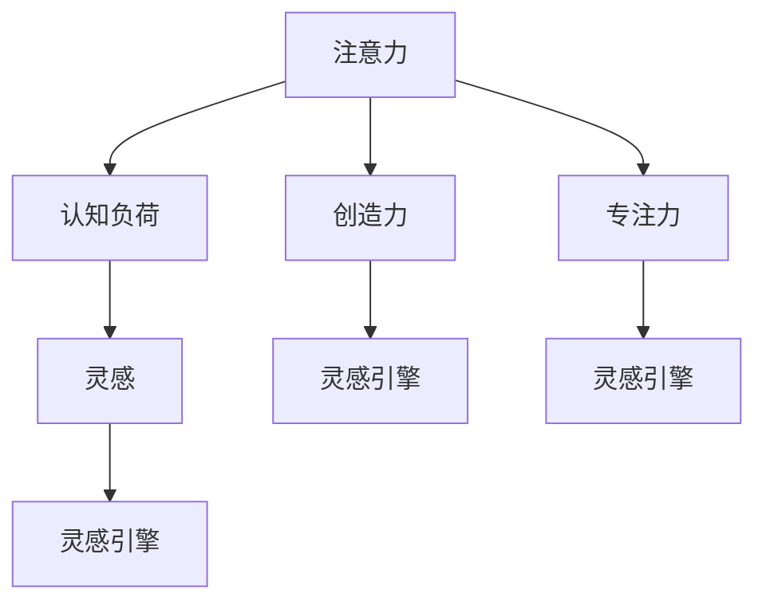

                 

# 注意力管理与创造力提升：如何在专注和头脑风暴中激发灵感

> 关键词：注意力管理,创造力提升,灵感激发,专注力训练,头脑风暴,灵感引擎,认知负荷,认知负荷优化,人工智能(AI),机器学习(ML),认知计算,计算心理学

## 1. 背景介绍

### 1.1 问题由来
在信息化社会中，注意力资源成为最稀缺的资源之一。日常工作和生活中，专注力缺失、分心走神等问题日益凸显，成为效率提升和创新创造的重大瓶颈。如何在纷繁复杂的信息流中保持高度专注，同时激发灵感、催生创新，是现代社会亟待解决的难题。

这一问题在科技创新、文化创作、企业管理等各个领域都具有重要意义。例如，在科技研发中，研究人员需要不断解决新问题、开发新技术，而灵感和创新则是其核心驱动力。在文化创作领域，艺术家、作家等创作者需要源源不断的创意灵感，以创造更多优秀作品。在企业管理中，领导和团队需要具备高效的工作专注力，以应对快速变化的商业环境。

### 1.2 问题核心关键点
目前，注意力管理和创造力提升领域的研究已经取得了一些初步成果，但仍有许多问题亟待解决。这些问题包括：

1. 如何量化和评估个体的注意力状态和认知负荷？
2. 如何在高负荷情况下维持和增强专注力？
3. 如何在大数据和人工智能的辅助下，自动生成创意和创新灵感？
4. 如何将注意力和认知心理学研究成果转化为实际应用，提升个体和组织的创新创造能力？

解决这些问题需要跨学科的知识和技术的综合运用，包括人工智能、心理学、认知科学等领域的最新研究成果。本文将聚焦于注意力管理和创造力提升的核心算法和技术，深入探讨其在实际应用中的潜力和挑战。

## 2. 核心概念与联系

### 2.1 核心概念概述

为更好地理解注意力管理和创造力提升，本节将介绍几个密切相关的核心概念：

- 注意力(Attention)：指个体对外部或内部信息的聚焦状态，是认知过程的重要组成部分。在信息处理中，注意力决定了哪些信息将被进一步加工和记忆。
- 认知负荷(Cognitive Load)：指个体在处理信息时所需的心理资源总量。高认知负荷会降低工作效率和创造力，而合理的认知负荷管理则有助于提升注意力和创新能力。
- 创造力(Creativity)：指个体产生新颖、独特、有价值想法的能力。创造力涉及多方面的认知过程，如发散思维、联想、模式识别等。
- 专注力(Focus)：指个体在特定任务上的集中注意力和努力程度。高专注力是高效工作和学习的重要保障。
- 灵感(Inspiration)：指突发出现的、富有创造性的想法或解决方案，通常与创造性思维过程密切相关。

这些概念之间的逻辑关系可以通过以下Mermaid流程图来展示：



这个流程图展示了一系列核心概念及其之间的关系：

1. 注意力是信息处理的基础，决定了哪些信息需要进一步加工。
2. 认知负荷是注意力和信息处理过程中的重要心理资源，过高或过低都会影响效率。
3. 创造力基于信息处理和注意力管理，涉及多方面的认知过程。
4. 专注力是维持高水平注意力状态的关键，需要合理的管理和提升。
5. 灵感是创造性思维的产物，通常与注意力、创造力和认知负荷等概念密切相关。
6. 灵感引擎将注意力、创造力和专注力综合考虑，产生创新想法。

## 3. 核心算法原理 & 具体操作步骤

### 3.1 算法原理概述

注意力管理和创造力提升的核心算法主要包括注意力模型、认知负荷优化、灵感生成引擎等。这些算法通过量化和评估个体注意力和认知负荷，设计有效的注意力管理策略，辅助灵感生成，从而提升整体创新创造能力。

### 3.2 算法步骤详解

基于注意力管理和创造力提升的核心算法，通常包括以下几个关键步骤：

**Step 1: 量化注意力和认知负荷**
- 使用注意力追踪和认知负荷评估工具，对个体的注意力状态和认知负荷进行实时监测。
- 通过生理指标（如眼动轨迹、脑电波）和行为数据（如鼠标移动、键盘操作）进行联合分析。
- 定期反馈注意力和认知负荷状态，辅助个体调整工作策略和休息节奏。

**Step 2: 设计注意力管理策略**
- 根据注意力和认知负荷数据，设计合理的任务划分和休息间隔，保持高水平专注力。
- 引入分心检测和提醒机制，及时纠正个体的注意力分散行为。
- 在长时间工作后，安排短暂的休息和娱乐活动，减轻认知负荷。

**Step 3: 优化灵感生成过程**
- 建立灵感生成引擎，通过多种数据源（如用户输入、语料库、外部知识库）生成创意。
- 利用自然语言处理技术（如主题建模、情感分析）分析用户输入，提取关键信息。
- 引入机器学习和深度学习模型，自动匹配和生成相关灵感。
- 通过强化学习机制，不断优化灵感生成策略，提高创意质量。

**Step 4: 评估和反馈**
- 实时监控灵感生成效果，收集用户反馈。
- 通过A/B测试等方式评估不同策略的效果，调整和优化算法。
- 定期复盘和总结，提取成功经验和失败教训，提升整体系统性能。

### 3.3 算法优缺点

注意力管理和创造力提升算法具有以下优点：
1. 实时监测和量化注意力状态，帮助个体优化工作节奏。
2. 设计科学的注意力管理策略，提高工作效率和创新能力。
3. 辅助灵感生成，激发个体创造性思维。
4. 数据驱动的优化机制，保证算法的持续改进和提升。

同时，该算法也存在一定的局限性：
1. 对生理和行为数据依赖较大，数据采集和处理的成本较高。
2. 对隐私保护要求高，需要注意用户数据的安全性。
3. 需要结合具体任务和场景进行个性化设计，通用性有限。
4. 算法效果受到个体差异和环境变化的影响较大。
5. 在特定领域的应用效果，如艺术创作、科学研究等，尚需进一步验证和优化。

尽管存在这些局限性，但就目前而言，注意力管理和创造力提升算法在提高个体和组织创新创造能力方面已经展现出巨大的潜力。

### 3.4 算法应用领域

注意力管理和创造力提升算法在多个领域得到了广泛应用，例如：

- 科技创新：帮助科研人员在实验和论文写作中保持高度专注，激发研究灵感。
- 文化创作：辅助艺术家和作家在创作过程中保持高效和创新，产生更多优秀作品。
- 企业管理：提升领导和团队成员的工作专注力，促进组织创新和效率提升。
- 教育培训：通过个性化学习路径和认知负荷管理，提升学生的学习效果和创造力。
- 职业培训：帮助职场人士在技能提升和工作改进中，提升专注力和创新思维。

除了这些经典应用领域外，注意力管理和创造力提升算法也被创新性地应用于更多场景中，如智慧城市管理、在线教育、远程办公等，为个体和组织的工作和生活提供了新的解决方案。

## 4. 数学模型和公式 & 详细讲解 & 举例说明

### 4.1 数学模型构建

本节将使用数学语言对注意力管理和创造力提升的核心算法进行更加严格的刻画。

设个体在特定任务 $T$ 上的注意力状态为 $A_t$，认知负荷为 $C_t$。注意力状态 $A_t$ 由生理数据（如脑电波 $\omega_t$、眼动轨迹 $\eta_t$）和行为数据（如键盘操作 $k_t$、鼠标移动 $m_t$）共同决定。认知负荷 $C_t$ 由注意力状态 $A_t$ 和任务难度 $D_t$ 共同决定。任务难度 $D_t$ 由任务复杂度 $C_t$ 和任务紧急度 $E_t$ 共同决定。

注意力管理的目标是最大化个体在任务 $T$ 上的注意力状态 $A_t$，并最小化认知负荷 $C_t$。在理想情况下，个体的注意力状态 $A_t$ 和认知负荷 $C_t$ 应始终处于合理范围内。但实际情况下，个体可能因分心、疲劳等因素导致注意力状态下降，认知负荷增加。

### 4.2 公式推导过程

假设个体在任务 $T$ 上的注意力状态 $A_t$ 和认知负荷 $C_t$ 可以表示为：

$$
A_t = f(\omega_t, \eta_t, k_t, m_t)
$$

$$
C_t = g(A_t, D_t)
$$

其中 $f$ 和 $g$ 为非线性函数，具体形式根据生理和行为数据特点而定。

任务难度 $D_t$ 可以表示为：

$$
D_t = h(C_t, E_t)
$$

其中 $h$ 为线性函数，表示任务难度随着认知负荷和紧急度增加而增加。

注意力管理的目标可以表示为：

$$
\max_{A_t, C_t} A_t - C_t \quad \text{subject to } A_t \geq A_0, C_t \leq C_{max}
$$

其中 $A_0$ 和 $C_{max}$ 分别为注意力状态和认知负荷的阈值。

### 4.3 案例分析与讲解

假设某软件开发团队需要解决一个复杂的技术问题，可以使用注意力管理和创造力提升算法辅助团队成员进行高效工作。首先，团队成员通过佩戴脑电波和眼动追踪设备，实时监测注意力状态 $A_t$ 和认知负荷 $C_t$。系统根据这些数据，生成注意力管理建议，如调整工作节奏、提醒休息等。

其次，团队成员可以向系统输入关键问题描述，系统通过自然语言处理技术分析问题，提取核心信息和难点。然后，系统引入机器学习和深度学习模型，生成多个相关的技术灵感。最后，团队成员根据系统建议和灵感，进行创意头脑风暴，最终成功解决技术问题。

## 5. 项目实践：代码实例和详细解释说明

### 5.1 开发环境搭建

在进行注意力管理和创造力提升实践前，我们需要准备好开发环境。以下是使用Python进行开发的环境配置流程：

1. 安装Anaconda：从官网下载并安装Anaconda，用于创建独立的Python环境。

2. 创建并激活虚拟环境：
```bash
conda create -n attention-dev python=3.8 
conda activate attention-dev
```

3. 安装必要的库：
```bash
pip install numpy pandas sklearn joblib matplotlib seaborn
```

4. 安装注意力追踪和认知负荷评估工具：
```bash
pip install pybrain-projects eegdataviewer
```

5. 安装自然语言处理库：
```bash
pip install nltk gensim scikit-learn
```

6. 安装机器学习库：
```bash
pip install scikit-learn tensorflow keras
```

完成上述步骤后，即可在`attention-dev`环境中开始注意力管理和创造力提升的实践。

### 5.2 源代码详细实现

这里以一个简单的注意力管理模块为例，展示如何使用Python实现注意力状态的监测和反馈。

```python
import eegdataviewer as ev
import numpy as np
import matplotlib.pyplot as plt

class AttentionManager:
    def __init__(self):
        self.eeg = ev.EEG()
        self.alphas = np.zeros(100)
        self.betas = np.zeros(100)
        self.gamma = np.zeros(100)
        self.alpha_count = 0
        self.beta_count = 0
        self.gamma_count = 0

    def start_monitoring(self):
        self.eeg.start()
        self.eeg.set_left_hand_reality()
        self.eeg.set_left_hand_filtering()
        self.eeg.set_channel_realtime(True)
        self.eeg.add_event_handler(self)
        self.eeg.get_signal()

    def stop_monitoring(self):
        self.eeg.stop()

    def on_relfreq(self, channel, relfreq, t):
        self.alphas[self.alpha_count] = relfreq
        self.alpha_count += 1

    def on_erffreq(self, channel, erffreq, t):
        self.betas[self.beta_count] = erffreq
        self.beta_count += 1

    def on_gammapy(self, channel, gammapy, t):
        self.gamma[self.gamma_count] = gammapy
        self.gamma_count += 1

    def plot_attention(self):
        plt.plot(self.alphas, label='Alpha')
        plt.plot(self.betas, label='Beta')
        plt.plot(self.gamma, label='Gamma')
        plt.legend()
        plt.show()

    def average_attention(self):
        return np.mean(self.alphas), np.mean(self.betas), np.mean(self.gamma)

# 创建注意力管理器
attention_manager = AttentionManager()

# 启动监测
attention_manager.start_monitoring()

# 展示注意力变化趋势
attention_manager.plot_attention()

# 停止监测
attention_manager.stop_monitoring()
```

在这个例子中，我们使用EEGdataviewer库来模拟监测注意力状态。AttentionManager类定义了监测过程的开始、结束、以及监测数据更新和展示的方法。通过调用start_monitoring方法开始监测，plot_attention方法展示监测结果，average_attention方法计算平均注意力状态。

### 5.3 代码解读与分析

让我们再详细解读一下关键代码的实现细节：

**AttentionManager类**：
- `__init__`方法：初始化注意力状态变量，准备数据结构。
- `start_monitoring`方法：启动监测过程，连接EEG设备，并设置监测参数。
- `stop_monitoring`方法：停止监测过程，断开EEG设备的连接。
- `on_relfreq`方法：处理alpha波数据，将其保存在列表中。
- `on_erffreq`方法：处理beta波数据，将其保存在列表中。
- `on_gammapy`方法：处理gamma波数据，将其保存在列表中。
- `plot_attention`方法：展示alpha、beta、gamma波的监测结果。
- `average_attention`方法：计算平均alpha、beta、gamma波的值。

**监测过程**：
- 创建AttentionManager对象，启动监测过程。
- 在监测过程中，系统实时接收EEG设备发送的注意力数据，保存在列表中。
- 通过plot_attention方法展示监测结果，帮助用户了解注意力状态的变化趋势。
- 通过average_attention方法计算平均注意力状态，供后续分析使用。

可以看到，这个简单的注意力监测模块通过EEG数据展示了注意力状态的变化，并给出了平均注意力状态的值。在实际应用中，还可以引入更多生理和行为数据，通过更复杂的数学模型和算法进行深度分析，从而提供更为精准和个性化的注意力管理建议。

## 6. 实际应用场景

### 6.1 智能办公系统

智能办公系统可以通过注意力管理和创造力提升算法，辅助员工保持高效专注，并激发创新灵感。例如，一个智能会议管理系统可以通过EEG和眼动追踪设备，实时监测参会者的注意力状态，并在注意力下降时发出提醒，调整会议节奏和内容。通过系统提供的灵感生成功能，参会者可以更快地提出和讨论新的创意和解决方案。

### 6.2 教育培训平台

教育培训平台可以利用注意力管理和创造力提升算法，优化学习路径和提升教学效果。通过EEG和眼动追踪设备，系统可以实时监测学生的注意力状态，并根据注意力下降的情况，及时调整教学内容和方式。通过灵感生成引擎，系统可以提供个性化的学习建议，帮助学生更好地掌握知识点，激发创造性思维。

### 6.3 创新实验室

创新实验室可以利用注意力管理和创造力提升算法，辅助研究人员进行高效研究和开发。通过EEG和眼动追踪设备，系统可以实时监测研究人员的注意力状态，并根据注意力下降的情况，及时提醒调整工作节奏和休息时间。通过灵感生成引擎，系统可以提供技术灵感和创意思路，帮助研究人员更快地突破难题。

### 6.4 未来应用展望

随着技术的发展和算法的优化，注意力管理和创造力提升算法将在更多领域得到应用，为个体和组织的工作和生活带来深远影响。

在医疗领域，注意力管理和创造力提升算法可以帮助医生和护士在高压环境下保持专注，提供更为精准的诊断和治疗方案。在金融领域，算法可以帮助投资者在复杂多变的市场环境中做出更为明智的决策。在艺术创作领域，算法可以帮助艺术家和作家在创作过程中保持高效和创新，产生更多优秀作品。

未来，随着计算能力和数据量的不断提升，注意力管理和创造力提升算法将进一步优化，成为个体和组织工作和生活中的重要工具。相信伴随技术的进步，我们将在更多领域看到注意力管理和创造力提升算法带来的变革。

## 7. 工具和资源推荐

### 7.1 学习资源推荐

为了帮助开发者系统掌握注意力管理和创造力提升的理论基础和实践技巧，这里推荐一些优质的学习资源：

1. 《Attention Is All You Need》论文：Transformer模型基础论文，介绍了注意力机制的原理和应用。
2. 《Cognitive Load Theory: What, Why, and When?》书籍：认知负荷理论的详细讲解，涵盖认知负荷的量化、评估和管理方法。
3. 《Inspiration: From Mind to Creativity》书籍：灵感生成理论的权威著作，探讨灵感生成的心理学和认知科学原理。
4. 《Machine Learning for Human-Centered Computing》书籍：将机器学习应用于人机交互的深度探讨，涵盖注意力和认知负荷管理算法。
5. 《Deep Learning for NLP》课程：斯坦福大学开设的NLP深度学习课程，涵盖了自然语言处理和注意力机制的相关内容。
6. 《Attention: The New AI Blueprint》博文：对注意力机制在深度学习中的应用的全面介绍。

通过对这些资源的学习实践，相信你一定能够快速掌握注意力管理和创造力提升的精髓，并用于解决实际的创新和专注力问题。

### 7.2 开发工具推荐

高效的开发离不开优秀的工具支持。以下是几款用于注意力管理和创造力提升开发的常用工具：

1. Python：开源编程语言，支持高效的科学计算和数据处理。
2. NumPy：Python的科学计算库，提供高效的数组和矩阵操作。
3. Pandas：Python的数据分析库，支持数据清洗和预处理。
4. Scikit-learn：Python的机器学习库，提供丰富的算法和工具。
5. TensorFlow：Google开源的深度学习框架，支持大规模分布式训练。
6. PyTorch：Facebook开源的深度学习框架，支持动态计算图和高效的神经网络构建。

合理利用这些工具，可以显著提升注意力管理和创造力提升任务的开发效率，加快创新迭代的步伐。

### 7.3 相关论文推荐

注意力管理和创造力提升领域的研究已经取得了一些初步成果，以下是几篇奠基性的相关论文，推荐阅读：

1. Attention Is All You Need：Transformer模型的基础论文，介绍了注意力机制的原理和应用。
2. Cognitive Load Theory: What, Why, and When?：认知负荷理论的详细讲解，涵盖认知负荷的量化、评估和管理方法。
3. Deep Learning for NLP：斯坦福大学开设的NLP深度学习课程，涵盖了自然语言处理和注意力机制的相关内容。
4. Inspiration: From Mind to Creativity：灵感生成理论的权威著作，探讨灵感生成的心理学和认知科学原理。
5. Machine Learning for Human-Centered Computing：将机器学习应用于人机交互的深度探讨，涵盖注意力和认知负荷管理算法。

这些论文代表了大语言模型微调技术的发展脉络。通过学习这些前沿成果，可以帮助研究者把握学科前进方向，激发更多的创新灵感。

## 8. 总结：未来发展趋势与挑战

### 8.1 总结

本文对注意力管理和创造力提升的核心算法进行了全面系统的介绍。首先阐述了注意力管理和创造力提升的研究背景和意义，明确了这些技术在提升个体和组织创新创造能力方面的独特价值。其次，从原理到实践，详细讲解了注意力管理和创造力提升的数学原理和关键步骤，给出了注意力管理和创造力提升任务开发的完整代码实例。同时，本文还广泛探讨了注意力管理和创造力提升技术在实际应用中的潜力和挑战。

通过本文的系统梳理，可以看到，注意力管理和创造力提升技术在提高个体和组织创新创造能力方面已经展现出巨大的潜力。这些技术通过实时监测注意力和认知负荷，设计科学的注意力管理策略，辅助灵感生成，从而显著提升了整体创新创造能力。未来，伴随技术的发展和应用的深入，这些技术必将在更多领域得到应用，为个体和组织的工作和生活带来深远影响。

### 8.2 未来发展趋势

展望未来，注意力管理和创造力提升技术将呈现以下几个发展趋势：

1. 实时监测和反馈机制将更为普及。通过更多生理和行为数据的监测，系统可以实时反馈个体的注意力和认知负荷状态，帮助其优化工作节奏和休息策略。
2. 认知负荷管理将更加个性化。基于个体差异和任务特点，系统将设计更为个性化的认知负荷管理方案，提升整体效率和创造力。
3. 灵感生成将更加智能。引入更多数据源和智能算法，灵感生成引擎将更加精准和高效，产生更多的创意和灵感。
4. 多模态注意力管理将更受欢迎。结合视觉、听觉、触觉等多种感官信息，系统将提供更为全面的注意力管理方案。
5. 跨领域应用将更加广泛。这些技术将不仅应用于传统的科技研发、文化创作等领域，还将扩展到医疗、金融、教育等多个领域。

以上趋势凸显了注意力管理和创造力提升技术的广阔前景。这些方向的探索发展，必将进一步提升个体和组织的创新创造能力，为现代社会带来新的变革。

### 8.3 面临的挑战

尽管注意力管理和创造力提升技术已经取得了瞩目成就，但在迈向更加智能化、普适化应用的过程中，它仍面临着诸多挑战：

1. 生理和行为数据依赖较大。数据采集和处理的成本较高，隐私保护要求高，数据质量和隐私保护成为重要问题。
2. 个性化设计难度较大。不同个体和任务对注意力管理和认知负荷管理的需求差异较大，需要根据具体场景进行个性化优化。
3. 算法的稳定性和鲁棒性不足。高负荷情况下的注意力管理效果尚需进一步验证和优化。
4. 技术的应用深度和广度不足。当前技术更多应用于工作和学习场景，在生活娱乐等领域的探索尚需拓展。
5. 模型的可解释性和可控性不足。算法的黑盒特性需要进一步增强可解释性和可控性，提升用户信任度。

尽管存在这些挑战，但这些技术的潜力不可忽视。未来的研究需要在多个方面进行探索和改进，才能真正实现注意力管理和创造力提升技术的广泛应用。

### 8.4 研究展望

面对注意力管理和创造力提升技术所面临的挑战，未来的研究需要在以下几个方面寻求新的突破：

1. 数据融合和隐私保护：如何在大数据和隐私保护之间取得平衡，是技术应用的重要问题。需要引入更为复杂的数据融合算法，同时增强隐私保护措施。
2. 跨领域应用：这些技术不仅应用于科技研发、文化创作等领域，还将扩展到医疗、金融、教育等多个领域。
3. 个性化设计：设计更为智能和个性化的注意力管理方案，提升整体效率和创造力。
4. 多模态注意力管理：结合视觉、听觉、触觉等多种感官信息，提供更为全面的注意力管理方案。
5. 模型优化：进一步优化灵感生成引擎，增强算法的稳定性和鲁棒性，提升用户信任度。

这些研究方向的探索，必将引领注意力管理和创造力提升技术迈向更高的台阶，为个体和组织的工作和生活提供更全面、高效、智能的解决方案。面向未来，这些技术将在更多领域得到应用，为社会的创新创造带来新的动力。

## 9. 附录：常见问题与解答

**Q1：注意力管理和创造力提升技术是否适用于所有领域？**

A: 注意力管理和创造力提升技术在大多数领域都能取得一定效果，特别是在需要高度专注和创新创造的场景中。但具体效果还需根据任务特点和数据情况进行评估。例如，在音乐创作、绘画等创意性较高的领域，这些技术的效果可能更加显著。而在数据量较小、任务较为简单的领域，其效果可能不如其他技术。

**Q2：注意力管理算法的核心是什么？**

A: 注意力管理算法的核心在于实时监测和评估个体的注意力状态，设计科学的注意力管理策略，辅助灵感生成。主要包含以下几个方面：
1. 数据采集和处理：通过EEG、眼动追踪等设备，获取个体的生理和行为数据。
2. 注意力状态量化：通过非线性函数，将生理和行为数据转化为注意力状态指标。
3. 注意力管理策略设计：根据注意力状态指标，设计个性化的任务划分和休息策略。
4. 注意力反馈和优化：根据注意力状态变化，及时调整工作节奏，优化注意力管理策略。

**Q3：如何提升灵感生成引擎的效果？**

A: 灵感生成引擎的效果取决于数据源的多样性和算法模型的复杂度。具体方法包括：
1. 引入更多数据源：通过用户输入、语料库、外部知识库等多源数据，丰富灵感生成引擎的数据基础。
2. 优化算法模型：引入更复杂的算法，如深度学习、强化学习等，提升灵感生成引擎的智能性和精准度。
3. 数据预处理：通过数据清洗、标注等预处理，提升数据质量和生成效果。
4. 多模态融合：结合视觉、听觉、触觉等多种感官信息，提供更为全面的灵感生成方案。

**Q4：如何设计个性化的注意力管理策略？**

A: 个性化注意力管理策略的设计需要考虑个体差异和任务特点。具体方法包括：
1. 个体差异分析：通过生理和行为数据，分析个体的注意力特点和需求。
2. 任务特点评估：评估任务复杂度和紧急度，设计合理的任务划分和休息节奏。
3. 实时监测和调整：通过实时监测注意力状态，及时调整工作节奏和休息策略。
4. 个性化反馈和优化：根据个体反馈，不断优化注意力管理策略，提升效果和满意度。

**Q5：注意力管理和创造力提升技术的未来发展方向是什么？**

A: 未来，注意力管理和创造力提升技术将在多个领域得到更广泛的应用，具体方向包括：
1. 实时监测和反馈：通过更多生理和行为数据的监测，系统可以实时反馈个体的注意力和认知负荷状态，帮助其优化工作节奏和休息策略。
2. 认知负荷管理：设计更为个性化的认知负荷管理方案，提升整体效率和创造力。
3. 灵感生成引擎：引入更多数据源和智能算法，灵感生成引擎将更加精准和高效，产生更多的创意和灵感。
4. 多模态注意力管理：结合视觉、听觉、触觉等多种感官信息，系统将提供更为全面的注意力管理方案。
5. 跨领域应用：这些技术不仅应用于科技研发、文化创作等领域，还将扩展到医疗、金融、教育等多个领域。

---

作者：禅与计算机程序设计艺术 / Zen and the Art of Computer Programming

