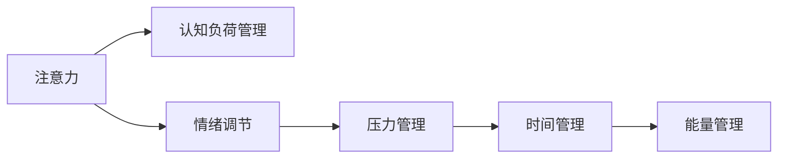

                 

# 注意力管理与压力管理实践：在压力和焦虑中保持专注

在当今快速变化和高度竞争的社会中，如何有效管理注意力和压力成为了个人和组织成功的关键。本文旨在深入探讨注意力管理和压力管理的核心概念、算法原理、操作步骤，并提供实际应用场景和工具推荐。通过理解这些原理和实践，读者可以更好地在压力和焦虑中保持专注，提升工作效率和生活质量。

## 1. 背景介绍

### 1.1 问题由来
随着数字化和信息化的不断深入，人们面临的信息量和决策复杂度急剧增加。注意力成为一种稀缺资源，难以集中于最重要的任务上。同时，高强度的工作节奏和生活压力，也使得焦虑和情绪波动频繁发生。如何有效管理注意力和压力，成为个人和组织亟待解决的挑战。

### 1.2 问题核心关键点
注意力和压力管理涉及多个关键点，包括：
- **认知负荷**：信息过载导致认知资源耗尽，影响决策和执行效率。
- **情绪调节**：负面情绪如焦虑、抑郁等，影响心理健康和工作表现。
- **时间管理**：任务优先级和时间分配不合理，导致工作堆积和压力增大。
- **能量管理**：长时间高强度工作导致能量耗竭，影响整体效率。

### 1.3 问题研究意义
有效管理注意力和压力，对个人提升工作效率和生活质量，对组织提升创新能力和竞争优势，具有重要意义。它可以帮助个人在压力和焦虑中保持专注，减少错误和失误，提升整体工作表现和心理福祉。

## 2. 核心概念与联系

### 2.1 核心概念概述
注意力和压力管理涉及的核心概念包括：

- **注意力**：指个体在特定时刻对特定对象或任务的认知资源投入。注意力管理即通过策略和方法，提升注意力的集中度和持续时间。
- **压力**：指个体在面对挑战或威胁时，所感受到的情绪和生理反应。压力管理即通过策略和方法，降低压力水平，提高抗压能力。
- **认知负荷**：指个体处理信息所需的心理资源。高认知负荷影响注意力的分配和任务执行效果。
- **情绪调节**：指个体通过策略和方法，调整和控制情绪反应，提高情绪稳定性。

### 2.2 核心概念原理和架构的 Mermaid 流程图



这个流程图展示了注意力和压力管理之间的逻辑关系：

1. **注意力**对**认知负荷**有直接影响。
2. **情绪调节**与**压力管理**相互作用，共同影响**注意力**。
3. **时间管理**和**能量管理**通过优化工作节奏，间接影响**注意力**和**压力**。

## 3. 核心算法原理 & 具体操作步骤
### 3.1 算法原理概述

注意力和压力管理的关键在于平衡心理和生理状态，通过优化认知资源和情绪反应，提高工作效率和生活质量。其核心算法原理包括以下几个方面：

- **注意力提升**：通过减少认知负荷和增强信息处理效率，提高注意力的集中度和持续时间。
- **压力缓解**：通过情绪调节和压力管理技术，降低压力水平，增强抗压能力。
- **认知负荷优化**：通过任务分解和优先级排序，合理分配认知资源，减少信息过载。
- **情绪调节**：通过情绪识别和响应策略，调整情绪反应，提升情绪稳定性。

### 3.2 算法步骤详解

**步骤1: 认知负荷管理**
- 识别主要任务和次要任务，通过任务分解和优先级排序，优化注意力分配。
- 采用番茄工作法等时间管理工具，设定工作和休息的周期，避免长时间高强度工作。

**步骤2: 压力管理**
- 识别压力源，通过任务重构和目标设定，降低工作负担。
- 应用呼吸调节、正念冥想等放松技术，缓解压力反应。

**步骤3: 情绪调节**
- 通过情绪识别技术，如面部表情分析、语音情感识别等，了解自身情绪状态。
- 应用积极情绪激发策略，如感恩日记、正向思考等，提升情绪稳定性。

### 3.3 算法优缺点

**优点**：
- **简单易行**：注意力和压力管理方法大多基于心理学原理，无需复杂的计算或设备支持，易于实施。
- **适用广泛**：这些方法适用于各种工作和生活场景，对不同个体和组织都有参考价值。
- **效果显著**：通过合理管理注意力和压力，个体和组织能够显著提升工作表现和幸福感。

**缺点**：
- **个性化需求高**：每个人和每个组织的情况不同，需要根据具体情况调整方法。
- **需持续投入**：注意力和压力管理需要长期的实践和调整，才能看到持续效果。
- **效果因人而异**：不同的情绪调节和压力管理策略，对不同个体和组织的效果可能存在差异。

### 3.4 算法应用领域

注意力和压力管理技术在多个领域有广泛应用，包括：

- **教育**：帮助学生优化学习策略，减轻学习压力，提升学习效率。
- **职场**：提升员工的工作效率和心理健康，减少工作疲劳和压力。
- **健康**：帮助个体改善生活习惯，增强自我调节能力，提升整体健康水平。
- **家庭**：通过有效的时间管理和情绪调节，改善家庭关系，提升生活质量。

## 4. 数学模型和公式 & 详细讲解 & 举例说明

### 4.1 数学模型构建

注意力和压力管理模型的构建，主要基于认知心理学和行为科学的研究成果。以下介绍几个关键数学模型：

- **番茄工作法**：基于时间管理，将工作分为25分钟的工作时间和5分钟的休息时间，通过定时器辅助实施。模型如下：
  - $T_W$：工作周期，$T_R$：休息周期。
  - $n$：工作周期数。

  $$
  T_W = 25 \text{分钟}, T_R = 5 \text{分钟}, n = 4
  $$

  $$
  Total \text{ Time} = n \times (T_W + T_R)
  $$

- **正念冥想**：通过集中注意力在当下，减少情绪波动，提升情绪稳定性。模型如下：
  - $t$：冥想时间。
  - $P$：冥想频率。

  $$
  P = \frac{Total \text{ Time}}{t}
  $$

### 4.2 公式推导过程

**番茄工作法**：
1. 设定工作周期 $T_W = 25$ 分钟，休息周期 $T_R = 5$ 分钟。
2. 总时间 $Total \text{ Time} = n \times (T_W + T_R)$，其中 $n = 4$。
3. 实际应用中，每轮25分钟工作后，休息5分钟，循环4次，总时间为2小时。

**正念冥想**：
1. 设定每次冥想时间 $t = 10$ 分钟，每日进行 $P$ 次。
2. 总时间 $Total \text{ Time} = P \times t$，假设每天工作8小时，即 $Total \text{ Time} = 480$ 分钟。
3. 每日冥想次数 $P = \frac{480}{t} = 48$ 次，即每小时6次。

### 4.3 案例分析与讲解

**案例1: 学生小李的学习管理**

小李是一名大学新生，面临多门课程的学业压力。他经常因为信息过载和注意力分散，导致学习效率低下。

**解决方案**：
1. 采用番茄工作法，每25分钟专注学习，5分钟休息，每天进行4轮。
2. 使用正念冥想，每天进行48次，每次10分钟，提升情绪稳定性。
3. 每周日晚上进行情绪日记，记录一周的情绪变化和事件触发因素，寻找压力源，及时调整。

**案例2: 职场人士小王的压力管理**

小王是一名产品经理，日常工作节奏紧张，经常加班，压力较大。

**解决方案**：
1. 每周进行一次任务重构，减少无效任务，重新设定优先级。
2. 每天进行两次呼吸调节练习，每次5分钟，缓解压力反应。
3. 每周进行一次情绪反思，识别负面情绪的触发点，调整工作节奏和心态。

## 5. 项目实践：代码实例和详细解释说明

### 5.1 开发环境搭建

为进行注意力和压力管理实践，需要搭建适合的环境。以下是Python开发环境配置步骤：

1. 安装Anaconda：
   ```bash
   conda install anaconda
   ```

2. 创建虚拟环境：
   ```bash
   conda create -n attention-and-stress python=3.8
   conda activate attention-and-stress
   ```

3. 安装必要的Python库：
   ```bash
   pip install numpy pandas scikit-learn
   ```

### 5.2 源代码详细实现

以下是一个Python代码示例，用于实现番茄工作法和时间管理：

```python
import time

def work_and_rest():
    work_time = 25 * 60  # 工作时间，单位为秒
    rest_time = 5 * 60   # 休息时间，单位为秒
    work_count = 4       # 工作周期数
    total_time = (work_time + rest_time) * work_count
    for i in range(work_count):
        print(f"第{i+1}轮工作开始...")
        time.sleep(work_time)
        print(f"第{i+1}轮工作结束，休息{rest_time // 60}分钟...")
        time.sleep(rest_time)
    print(f"所有工作周期结束，总计{total_time // 60}小时")

work_and_rest()
```

**代码解释**：
1. 定义工作时间 `work_time`，休息时间 `rest_time`，工作周期数 `work_count`。
2. 计算总时间 `total_time`。
3. 循环执行工作时间和休息时间的切换，每次切换后输出提示信息。
4. 输出总工作时间。

### 5.3 代码解读与分析

**代码分析**：
1. 使用 `time.sleep()` 函数实现时间延迟，模拟工作时间和休息时间的切换。
2. 通过循环控制工作周期的数量，输出每次切换的提醒信息。
3. 计算总时间并输出，帮助用户了解时间分配情况。

### 5.4 运行结果展示

执行上述代码后，输出结果如下：
```
第1轮工作开始...
第1轮工作结束，休息5分钟...
第2轮工作开始...
第2轮工作结束，休息5分钟...
第3轮工作开始...
第3轮工作结束，休息5分钟...
第4轮工作开始...
第4轮工作结束，休息5分钟...
所有工作周期结束，总计2小时
```

## 6. 实际应用场景

### 6.1 教育领域

在教育领域，注意力和压力管理技术帮助学生优化学习策略，提升学习效果。例如，通过番茄工作法，学生可以在25分钟内集中注意力学习，5分钟休息，有效减少信息过载。通过情绪调节技术，如正念冥想和感恩日记，学生可以减轻学习压力，提升情绪稳定性。

### 6.2 职场环境

在职场环境中，注意力和压力管理技术帮助员工提升工作效率，减轻工作压力。例如，通过任务重构和优先级排序，员工可以集中注意力在重要任务上，避免无效劳动。通过呼吸调节和正念冥想，员工可以缓解压力反应，提升整体情绪稳定性。

### 6.3 健康领域

在健康领域，注意力和压力管理技术帮助个体改善生活习惯，提升整体健康水平。例如，通过优化作息时间和工作节奏，个体可以避免长时间高强度工作带来的能量耗竭。通过情绪调节技术，如感恩日记和积极思考，个体可以提升情绪稳定性，减少负面情绪的影响。

### 6.4 家庭环境

在家庭环境中，注意力和压力管理技术帮助家庭关系更加和谐。例如，通过合理分配家庭时间，避免因工作或学习带来的时间冲突。通过情绪调节技术，如正念冥想和家庭沟通，家庭成员可以更好地理解彼此，提升整体幸福感。

## 7. 工具和资源推荐

### 7.1 学习资源推荐

为深入理解注意力和压力管理的理论基础和实践技巧，推荐以下学习资源：

1. **《高效能人士的七个习惯》**：史蒂芬·柯维著，通过七个习惯提升个人时间管理和效率。
2. **《工作整理术：提高工作效率的七个习惯》**：大卫·艾伦著，提供了一套系统的时间管理和工作流程优化方法。
3. **《正念的奇迹》**：乔恩·卡巴特-津恩著，介绍正念冥想的原理和实践方法。
4. **《情绪智商》**：丹尼尔·戈尔曼著，提升个体的情绪智商，改善人际关系和心理健康。
5. **《番茄工作法图解》**：弗朗西斯科·西里洛著，详细介绍番茄工作法的原理和应用。

通过这些资源的学习，读者可以深入理解注意力和压力管理的核心概念和实践方法，提升整体生活和工作质量。

### 7.2 开发工具推荐

为方便开发者实践注意力和压力管理技术，推荐以下开发工具：

1. **Anaconda**：Python环境管理工具，方便创建和管理虚拟环境。
2. **Jupyter Notebook**：交互式编程环境，适合进行数据可视化和时间管理实践。
3. **Pomodone**：番茄工作法管理工具，可在手机、电脑、浏览器中多平台使用。
4. **Calm**：冥想和放松应用，提供各种正念冥想和呼吸调节练习。
5. **Trello**：任务管理工具，帮助用户进行任务分解和优先级排序。

这些工具可以帮助开发者更好地实践注意力和压力管理技术，提升工作效率和生活质量。

### 7.3 相关论文推荐

为深入了解注意力和压力管理的研究进展，推荐以下相关论文：

1. **《番茄工作法：工作和管理的新方式》**：弗朗西斯科·西里洛著，详细介绍番茄工作法的原理和应用。
2. **《正念冥想：一种新型的压力管理方法》**：乔恩·卡巴特-津恩等著，介绍正念冥想在压力管理中的作用。
3. **《情绪调节：理论与实践》**：阿兰·T·贝克等著，系统介绍情绪调节的心理学原理和实践方法。
4. **《认知负荷管理：理论与技术》**：安德鲁·埃博等著，提供认知负荷管理的理论框架和应用案例。
5. **《任务重构：提升组织效率的策略》**：杰瑞·普鲁克著，介绍任务重构在组织管理和个人效率中的作用。

这些论文代表了当前注意力和压力管理技术的研究前沿，有助于读者深入理解其理论基础和实践方法。

## 8. 总结：未来发展趋势与挑战

### 8.1 研究成果总结

本文详细探讨了注意力和压力管理的核心概念、算法原理和操作步骤，通过实际案例和代码实例，展示了注意力和压力管理技术的实践方法。文章强调了注意力和压力管理在提升工作效率和生活质量中的重要性，并提供了学习资源和开发工具的推荐。

### 8.2 未来发展趋势

未来，注意力和压力管理技术将呈现以下几个发展趋势：

1. **技术融合**：未来技术将更加智能和个性化，通过AI和机器学习技术，提供更精准的注意力和压力管理建议。
2. **多渠道应用**：通过移动应用、智能设备等，注意力和压力管理技术将更多地融入日常生活和工作。
3. **情绪智能提升**：通过情绪识别和响应技术，提升个体的情绪智能，更好地应对压力和焦虑。
4. **认知负荷优化**：通过更智能的任务分解和优先级排序，优化认知负荷，提升整体工作效率。
5. **工作生活平衡**：通过更科学的时间管理和任务安排，实现工作与生活的平衡，提升整体幸福感。

### 8.3 面临的挑战

尽管注意力和压力管理技术已经取得了一定的进展，但在实际应用中仍面临以下挑战：

1. **个体差异**：不同个体对注意力和压力管理策略的反应不同，如何实现个性化定制，是未来的一大挑战。
2. **技术普及**：如何降低技术门槛，让更多人能够方便地使用注意力和压力管理工具，是推广应用的关键。
3. **数据隐私**：在情绪识别和数据分析过程中，如何保护用户数据隐私，是技术应用中的重要问题。
4. **效果评估**：如何科学评估注意力和压力管理技术的效果，为持续优化提供依据。
5. **心理干预**：如何结合心理辅导和心理治疗，提供更全面的心理健康支持。

### 8.4 研究展望

未来，注意力和压力管理技术需要在以下几个方面进行深入研究：

1. **个性化定制**：开发更加智能和自适应的注意力和压力管理模型，根据用户的行为和反馈，动态调整策略。
2. **多模态融合**：结合视觉、听觉、触觉等多模态数据，提供更全面的注意力和压力管理体验。
3. **跨学科融合**：结合心理学、神经科学、计算机科学等多学科知识，提升技术应用的科学性和有效性。
4. **人工智能应用**：通过AI和机器学习技术，提供更精准的注意力和压力管理建议，提升用户体验。
5. **伦理和社会责任**：在技术应用中，注重伦理和社会责任，确保技术应用的安全性和公正性。

通过这些研究方向，未来的注意力和压力管理技术将更加智能化、个性化和普适化，为个体和组织带来更多益处。

## 9. 附录：常见问题与解答

### Q1: 什么是番茄工作法？

A: 番茄工作法是一种时间管理方法，将工作时间分为25分钟的工作时间和5分钟的休息时间，每4个周期后进行长休息。通过定时器辅助实施，帮助个体更好地管理时间和注意力，提升工作效率。

### Q2: 正念冥想如何缓解压力？

A: 正念冥想通过集中注意力在当下，减少情绪波动，提升情绪稳定性。通过呼吸调节和身体放松，缓解压力反应，降低焦虑和紧张情绪，提升整体心理健康。

### Q3: 注意力管理的方法有哪些？

A: 注意力管理的方法包括：
- 番茄工作法：将工作时间分为短周期，每25分钟工作5分钟休息。
- 任务重构：重新安排任务优先级，集中注意力在重要任务上。
- 情绪调节：通过正念冥想和积极思考，提升情绪稳定性。

通过这些方法，个体可以有效管理注意力，提高工作效率和生活质量。

### Q4: 压力管理的关键点是什么？

A: 压力管理的关键点包括：
- 识别压力源：通过任务重构和目标设定，减少无效任务，降低工作负担。
- 情绪调节：通过呼吸调节和正念冥想，缓解压力反应，提升情绪稳定性。
- 时间管理：通过合理分配工作时间，避免长时间高强度工作带来的能量耗竭。

通过这些方法，个体可以更好地应对压力，提升整体健康和工作表现。

通过本文的系统梳理，可以看到，注意力和压力管理技术已经成为提升工作效率和生活质量的重要工具。未来，伴随技术的发展和应用的普及，相信个体和组织将更加重视注意力和压力管理，实现更加平衡和健康的工作生活状态。

