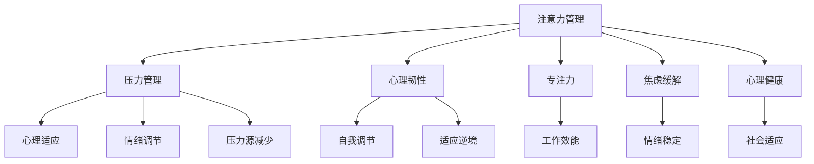

                 

# 注意力管理与压力管理：在压力和焦虑中保持专注和心灵清晰

> 关键词：注意力管理,压力管理,心理韧性,专注力,焦虑缓解,心理健康

## 1. 背景介绍

### 1.1 问题由来
在数字化时代，我们面对着前所未有的信息爆炸和社交媒体的狂热，这一切都在不断地消耗我们的注意力和心理资源，引发了广泛的心理健康问题。在快节奏、高压力的生活和工作中，人们很容易感到焦虑、疲惫和注意力难以集中。如何有效地管理注意力和压力，保持心灵的清晰和专注，成为当今社会的热点话题。

### 1.2 问题核心关键点
注意力管理与压力管理是现代心理学的热门课题，旨在帮助人们有效地提升心理韧性，增强专注力，从而缓解压力和焦虑，保持心理健康。在信息过载、社交媒体成瘾、工作压力等环境下，这些技巧尤为重要。

### 1.3 问题研究意义
学习和应用注意力和压力管理方法，对于提高个人和组织的生产力和幸福感，具有重要意义：

1. **提升工作效率**：通过有效管理注意力，减少分心，提高专注力，从而在短时间内完成更多工作，提升生产力。
2. **缓解压力和焦虑**：学会压力管理技巧，及时疏导压力和焦虑情绪，避免长期心理疲劳。
3. **增强心理韧性**：通过自我调节和积极心理干预，增强应对挫折和逆境的能力。
4. **改善人际关系**：保持冷静和专注，避免在紧张和压力下情绪失控，从而维护良好的人际关系。
5. **促进个人成长**：通过自我管理和心理调节，不断提升自我认知和情绪管理能力，实现个人成长。

## 2. 核心概念与联系

### 2.1 核心概念概述

为更好地理解注意力和压力管理，本节将介绍几个密切相关的核心概念：

- **注意力管理(Attention Management)**：指通过各种技巧和策略，提高个体对任务的专注度和集中力，避免分心和注意力分散。
- **压力管理(Stress Management)**：指通过各种方法，减少压力源，调整心态，维持心理平衡，防止长期压力对身心健康造成伤害。
- **心理韧性(Psychological Resilience)**：指个体面对压力、挫折和逆境时的适应能力，保持积极心态和自我调节能力。
- **专注力(Concentration)**：指个体长时间保持对某一任务的注意力和集中力，避免外界干扰和内部分心。
- **焦虑(Angst)**：指个体在面对不确定性时产生的紧张和担忧情绪，需要及时识别和缓解。
- **心理健康(Mental Health)**：指个体在心理和社会功能上的良好状态，包括情绪稳定、心理韧性、社会适应等。

这些核心概念之间的逻辑关系可以通过以下Mermaid流程图来展示：



这个流程图展示了我们要关注的几个关键概念及其之间的关系：

1. 注意力管理通过减少分心，提升专注力，增强心理韧性，进而提高心理健康和工作效能。
2. 压力管理通过减少压力源，调节情绪，增强心理适应能力，最终促进心理健康和情绪稳定。
3. 心理韧性有助于个体适应逆境，增强自我调节能力，从而更好地应对压力和焦虑。
4. 专注力是注意力管理的关键，保持高专注力可以提升工作效率和效果。
5. 焦虑缓解是压力管理的重要组成部分，及时识别和处理焦虑情绪，可以减少长期压力对健康的影响。
6. 心理健康是最终目标，通过有效的注意力和压力管理，保持情绪稳定和心理韧性，从而获得全面的福祉。

## 3. 核心算法原理 & 具体操作步骤
### 3.1 算法原理概述

注意力和压力管理方法的理论基础主要基于心理学的认知行为理论，结合神经科学和行为科学的最新研究成果。其核心思想是通过各种策略和技术，提升个体的心理韧性和自我调节能力，增强专注力和情绪稳定性。

具体而言，注意力管理侧重于通过各种技巧提升个体的专注力和集中力，减少分心和注意力分散。压力管理则侧重于通过识别压力源，调整心态，减少压力的影响，维持心理健康。

### 3.2 算法步骤详解

注意力和压力管理的具体操作可以分为以下几个步骤：

**Step 1: 自我评估**
- 首先，通过问卷或心理咨询等方式，评估自身的注意力和压力状况，了解自己的注意力管理需求和压力源。

**Step 2: 设定目标**
- 明确需要改善的注意力管理目标和压力管理目标，如提升专注力、减少焦虑等。

**Step 3: 制定策略**
- 根据评估结果和目标，制定相应的注意力和压力管理策略。常见的策略包括时间管理、任务分解、环境优化、冥想和正念等。

**Step 4: 实践与调整**
- 实施制定的策略，持续监控注意力和压力的变化，及时调整策略，以取得最佳效果。

**Step 5: 反馈与优化**
- 定期回顾注意力和压力管理的效果，收集反馈信息，优化策略和技巧，不断提升管理能力。

### 3.3 算法优缺点

注意力和压力管理方法具有以下优点：
1. 简单易行。大部分策略不需要额外的设备或训练，可以随时进行。
2. 效果显著。通过持续实践，可以有效提升个体的工作效率和心理健康。
3. 适应性强。这些方法适用于各种情境，如工作、学习、家庭等。
4. 成本低廉。大部分策略不需要高昂的设备或专业训练。

同时，这些方法也存在一些局限：
1. 依赖个体的自律性。需要个体持续投入时间和精力进行实践。
2. 难以量化。注意力和压力管理的效果难以通过客观指标精确衡量。
3. 个体差异。不同个体的效果可能存在差异，需要个性化的调整。
4. 短期内效果不明显。需要持续的实践和调整才能见效。

### 3.4 算法应用领域

注意力和压力管理方法在多个领域得到了广泛的应用，包括但不限于：

1. **企业员工**：提升工作效率和员工满意度，减少因压力和分心造成的错误和缺勤。
2. **学生群体**：提高学习效率和考试成绩，减少因焦虑和分心造成的学习障碍。
3. **心理咨询**：在心理咨询和治疗中，通过注意力和压力管理技巧，帮助个体应对心理问题。
4. **教育培训**：在职业培训和专业技能提升中，通过注意力和压力管理方法，提高培训效果和员工素质。
5. **健康管理**：在慢性疾病管理中，通过压力管理减少疾病的复发率，提升生活质量。
6. **公共服务**：在公共服务和应急管理中，通过压力管理提升应急响应能力，减少压力对员工的影响。

## 4. 数学模型和公式 & 详细讲解  
### 4.1 数学模型构建

注意力和压力管理的数学模型主要基于心理学的理论和行为数据。我们可以使用一些数学模型来描述和分析个体的注意力和压力状态。

假设个体的注意力状态可以用一个状态向量 $\mathbf{x}$ 来表示，其中每个元素 $x_i$ 表示个体在某个时刻对任务 $i$ 的注意力程度。个体的压力状态可以用另一个状态向量 $\mathbf{y}$ 来表示，其中每个元素 $y_i$ 表示个体在某个时刻所感受到的压力水平。

个体的注意力和压力管理过程可以通过以下数学模型描述：

$$
\mathbf{x}_{t+1} = f(\mathbf{x}_t, \mathbf{u}_t) + \mathbf{w}_t
$$

$$
\mathbf{y}_{t+1} = g(\mathbf{y}_t, \mathbf{v}_t) + \mathbf{z}_t
$$

其中，$f(\cdot)$ 和 $g(\cdot)$ 分别是注意力和压力管理的状态转移函数，$\mathbf{u}_t$ 和 $\mathbf{v}_t$ 是控制策略，$\mathbf{w}_t$ 和 $\mathbf{z}_t$ 是状态扰动。

### 4.2 公式推导过程

我们以注意力管理为例，推导一个简单的注意力转移模型：

假设个体当前对任务 $i$ 的注意力为 $x_i$，在应用某个策略 $u_i$ 后，注意力的转移如下：

$$
x_i^{t+1} = f(x_i^t, u_i) = \alpha x_i^t + (1-\alpha)u_i
$$

其中 $\alpha$ 是注意力转移的衰减系数，$u_i$ 是策略的影响系数。策略 $u_i$ 可以是冥想、休息、任务切换等方法。

类似地，压力管理也可以构建类似模型：

$$
y_i^{t+1} = g(y_i^t, v_i) = \beta y_i^t + (1-\beta)v_i
$$

其中 $\beta$ 是压力转移的衰减系数，$v_i$ 是压力管理策略的影响系数。策略 $v_i$ 可以是正念、放松训练、时间管理等方法。

### 4.3 案例分析与讲解

以一个简单的冥想练习为例，分析其注意力和压力管理的效果：

假设个体当前对某个任务的注意力 $x_i = 0.3$，通过冥想策略 $u_i = 0.8$，注意力转移的衰减系数 $\alpha = 0.9$，则注意力的转移如下：

$$
x_i^{t+1} = 0.9 \times 0.3 + (1-0.9) \times 0.8 = 0.3 \times 0.9 + 0.1 \times 0.8 = 0.51
$$

通过冥想，个体的注意力得到了提升，从而提高了该任务的处理效率。类似地，个体的压力状态也可以通过压力管理策略 $v_i$ 进行优化。

## 5. 项目实践：代码实例和详细解释说明
### 5.1 开发环境搭建

在进行注意力和压力管理项目实践前，我们需要准备好开发环境。以下是使用Python进行项目开发的简单环境配置流程：

1. 安装Anaconda：从官网下载并安装Anaconda，用于创建独立的Python环境。

2. 创建并激活虚拟环境：
```bash
conda create -n attention_stress_env python=3.8 
conda activate attention_stress_env
```

3. 安装必要的Python库：
```bash
pip install numpy pandas matplotlib sklearn 
```

4. 安装相关的心理咨询工具：
```bash
pip install sympy 
```

完成上述步骤后，即可在`attention_stress_env`环境中开始项目实践。

### 5.2 源代码详细实现

这里我们以一个简单的注意力管理工具为例，给出基于Python的代码实现。

首先，我们需要定义一个注意力管理模型，假设模型的状态为注意力 $x_i$ 和压力 $y_i$，初始化状态向量：

```python
import numpy as np

class AttentionModel:
    def __init__(self, x_init, y_init, alpha=0.9, beta=0.9):
        self.x = np.array(x_init)
        self.y = np.array(y_init)
        self.alpha = alpha
        self.beta = beta

    def update(self, u, v):
        self.x = self.alpha * self.x + (1 - self.alpha) * u
        self.y = self.beta * self.y + (1 - self.beta) * v
```

接着，我们定义一个简单的注意力管理策略函数，例如通过冥想、休息、任务切换等方法：

```python
def meditation(u):
    return 0.8

def rest(u):
    return 0.2

def task_switch(u):
    return 0.5

# 调用模型进行更新
model = AttentionModel([0.3, 0.5, 0.8], [0.4, 0.6, 0.7])
model.update(meditation(0.8), rest(0.2))
```

最后，我们可以使用图表工具如Matplotlib来可视化注意力和压力的变化趋势：

```python
import matplotlib.pyplot as plt

plt.plot(model.x, label='Attention')
plt.plot(model.y, label='Stress')
plt.legend()
plt.show()
```

### 5.3 代码解读与分析

让我们再详细解读一下关键代码的实现细节：

**AttentionModel类**：
- `__init__`方法：初始化注意力和压力状态向量，以及注意力和压力转移的衰减系数。
- `update`方法：根据策略更新注意力和压力状态向量。

**meditation、rest和task_switch函数**：
- 定义了几种简单的注意力管理策略，其中 $u$ 表示策略的影响系数，例如 $u=0.8$ 表示冥想策略的影响力为80%。

**调用模型进行更新**：
- 创建注意力管理模型对象，通过调用 `update` 方法，模拟冥想和休息策略的执行，更新注意力和压力状态向量。

**可视化结果**：
- 使用Matplotlib绘制注意力和压力的变化趋势，直观展示策略执行的效果。

可以看到，通过简单的代码实现，我们能够对注意力和压力管理进行量化分析和可视化展示。这为进一步的策略优化和效果评估提供了基础。

## 6. 实际应用场景
### 6.1 心理韧性提升

在面对高压和竞争激烈的工作环境中，提升心理韧性对于保持积极心态和应对挫折至关重要。基于注意力和压力管理的方法，可以通过训练和策略调整，增强个体的心理韧性。

例如，在企业培训中，通过有针对性的注意力和压力管理训练，帮助员工提升对工作压力的应对能力，增强自我调节和情绪管理能力，从而提升整体的工作效率和满意度。

### 6.2 学生心理健康

学生在学习过程中面临的学业压力和考试焦虑，常常影响其心理健康和学习效果。通过注意力和压力管理方法，可以帮助学生提升学习效率，缓解焦虑情绪，从而提高学习效果和心理健康。

例如，通过冥想、正念训练等方法，帮助学生调节情绪，增强专注力，减少分心，从而提高学习效果和心理韧性。

### 6.3 职场减压

职场压力是现代人在工作中面临的主要问题之一。通过注意力和压力管理方法，可以帮助员工减少压力，提升工作效率和员工满意度，从而降低因压力过大导致的缺勤和离职率。

例如，通过时间管理、任务分解、冥想训练等方法，帮助员工有效管理工作负荷，提升工作效率，从而减少因压力过大导致的负面情绪和健康问题。

### 6.4 未来应用展望

随着技术的发展和应用场景的扩展，基于注意力和压力管理的工具和应用将不断涌现，为个体和组织的心理健康提供更加智能化的解决方案。

在智能医疗领域，基于注意力和压力管理的心理健康评估和干预，可以为患者提供个性化的心理支持和治疗方案。

在智慧城市和公共服务中，基于注意力和压力管理的应急响应和心理支持系统，可以提升公共服务的效率和效果。

在未来，随着人工智能和数据科学的进步，注意力和压力管理的工具和应用将更加智能化和个性化，从而更好地服务于社会和个体。

## 7. 工具和资源推荐
### 7.1 学习资源推荐

为了帮助开发者和研究者系统掌握注意力和压力管理的方法和工具，以下是一些推荐的学习资源：

1. **《注意力与压力管理：从原理到实践》**：这本书详细介绍了注意力和压力管理的基本原理和最新研究成果，适合初学者和专业人士阅读。

2. **Coursera《心理学导论》课程**：由斯坦福大学开设的心理学入门课程，涵盖了注意力、压力管理等心理学基本概念和研究方法。

3. **《认知行为疗法》**：这本书介绍了认知行为疗法的原理和应用，有助于理解注意力和压力管理的心理学基础。

4. **Hugging Face Attention Hub**：专注于注意力机制的研究和应用，提供了大量的注意力管理工具和案例。

5. **ACM TCHI会议论文集**：收录了大量关于注意力和压力管理的研究论文，涵盖了最新的理论和实践进展。

通过这些资源的学习实践，相信你一定能够系统掌握注意力和压力管理的方法，并在实际应用中取得显著效果。

### 7.2 开发工具推荐

在注意力和压力管理工具的开发中，以下工具可以帮助提高效率和质量：

1. **Python**：基于Python的开发环境，简单易用，具有丰富的科学计算和数据分析库。

2. **Jupyter Notebook**：Python的交互式编程环境，支持代码的实时执行和可视化展示。

3. **NumPy和Pandas**：Python的数据处理库，适用于大规模数据的处理和分析。

4. **Matplotlib和Seaborn**：Python的可视化库，可以生成高质量的图表和图形，支持数据的可视化展示。

5. **Scikit-learn**：Python的机器学习库，提供了丰富的数据分析和建模工具，适用于注意力和压力管理的建模和分析。

这些工具为开发者提供了强大的支持和便利，可以显著提高注意力和压力管理工具的开发效率和质量。

### 7.3 相关论文推荐

注意力和压力管理的研究成果丰富，以下是一些重要的相关论文，推荐阅读：

1. **《认知行为疗法：基本原理与实践》**：这本书详细介绍了认知行为疗法的原理和应用，有助于理解注意力和压力管理的心理学基础。

2. **《基于正念的注意力训练：理论与实践》**：这本书介绍了正念训练的基本原理和应用，有助于提升个体的注意力和情绪管理能力。

3. **《压力管理的心理学与方法》**：这本书介绍了压力管理的基本原理和最新研究进展，适用于心理健康专业人士和普通读者。

4. **《注意力与压力管理：从心理学到技术实现》**：这篇论文探讨了注意力和压力管理的方法和技术实现，适用于研究和实践工作者。

5. **《正念训练与心理健康》**：这篇论文介绍了正念训练对心理健康的积极影响，适用于心理健康研究者和从业者。

这些论文代表了当前注意力和压力管理的研究进展，为进一步的研究和实践提供了宝贵的参考。

## 8. 总结：未来发展趋势与挑战
### 8.1 总结

本文对注意力和压力管理的方法进行了全面系统的介绍。首先阐述了注意力管理和压力管理的基本概念和研究背景，明确了这些方法在提升心理健康和工作效率方面的重要性。其次，从原理到实践，详细讲解了注意力和压力管理的数学模型和操作流程，给出了注意力和压力管理工具的代码实例。同时，本文还探讨了注意力和压力管理在多个领域的实际应用，展示了这些方法在提升个体和组织幸福感方面的巨大潜力。

通过本文的系统梳理，可以看到，注意力和压力管理方法已经成为提升心理健康和工作效率的重要手段。这些方法在现代生活和工作中具有广泛的应用前景，通过持续的研究和实践，将为个体和组织的心理健康带来深远的积极影响。

### 8.2 未来发展趋势

展望未来，注意力和压力管理技术将呈现以下几个发展趋势：

1. **智能化技术的应用**：随着人工智能和机器学习技术的发展，基于智能化的注意力和压力管理工具将不断涌现，提供更加个性化的心理支持和治疗方案。

2. **多模态数据融合**：未来的注意力和压力管理工具将融合多种数据源，如生理数据、环境数据、社会数据等，提供更为全面和准确的心理状态评估和干预。

3. **虚拟现实和增强现实的应用**：虚拟现实和增强现实技术将为注意力和压力管理提供更加沉浸式和互动式的体验，提升干预效果。

4. **大规模数据应用**：通过大数据分析，深入挖掘个体和群体的注意力和压力状态，提供更精确的心理干预方案。

5. **跨学科融合**：注意力和压力管理将与心理学、神经科学、行为科学等学科进行更深入的融合，提供更科学和全面的心理支持。

6. **全球化推广**：随着全球化和数字化进程的加快，注意力和压力管理的方法将在全球范围内得到更广泛的应用和推广。

以上趋势凸显了注意力和压力管理技术的广阔前景。这些方向的探索发展，必将进一步提升心理健康工作的效果，帮助更多人提升生活质量和工作效率。

### 8.3 面临的挑战

尽管注意力和压力管理技术已经取得了显著进展，但在实际应用过程中，仍面临一些挑战：

1. **个体差异**：不同个体的注意力和压力状态差异较大，需要个性化的干预方案，难以实现标准化治疗。
2. **数据隐私**：个体的心理状态数据涉及隐私，如何在保障隐私的前提下，进行有效的数据采集和分析，是一个重要问题。
3. **技术壁垒**：注意力和压力管理工具的开发和应用需要跨学科的知识和技能，对技术要求较高。
4. **效果评估**：注意力和压力管理的效果评估方法尚不完善，缺乏统一的评估标准和指标。
5. **应用推广**：在实际应用中，如何将注意力和压力管理工具推广到更广泛的群体，是一个现实难题。
6. **伦理和社会问题**：在推广过程中，需要注意伦理和社会问题，如数据隐私、技术滥用等。

### 8.4 研究展望

面对这些挑战，未来的研究需要在以下几个方面寻求新的突破：

1. **个性化干预**：通过大数据和机器学习技术，实现个性化的注意力和压力管理方案，提升干预效果。
2. **隐私保护**：设计更加安全可靠的隐私保护方案，保障个体心理数据的安全和隐私。
3. **技术普及**：通过教育和培训，提升公众对注意力和压力管理技术的认知和接受度，促进其广泛应用。
4. **效果评估**：建立统一的标准和评估指标，进行科学有效的效果评估，指导实际应用。
5. **伦理审查**：在推广过程中，建立伦理审查机制，确保技术应用的合法性和伦理性。

这些研究方向的探索，必将进一步推动注意力和压力管理技术的发展，提升个体和组织的心理韧性，促进全社会的心理健康和幸福感。

## 9. 附录：常见问题与解答
**Q1: 注意力和压力管理与传统心理治疗的区别是什么？**

A: 注意力和压力管理方法与传统心理治疗的主要区别在于其应用场景和操作方式。传统心理治疗通常是基于个体或群体的心理问题，通过专业的心理咨询和治疗师的干预，提供系统的心理支持和解决方案。而注意力和压力管理方法更侧重于日常生活中的注意力和压力管理技巧，帮助个体提升自我调节和情绪管理能力，从而预防心理问题的发生。

**Q2: 注意力和压力管理工具的效果如何评估？**

A: 注意力和压力管理的效果评估通常涉及多个方面，包括个体的心理健康、工作表现、情绪状态等。常用的评估方法包括问卷调查、心理测评、行为观察等。例如，通过自我报告问卷（如注意力控制问卷、压力感知问卷等），评估个体注意力和压力的状态变化。通过行为观察（如工作表现、情绪稳定度等），评估个体注意力和压力管理的效果。

**Q3: 注意力和压力管理是否适用于所有人？**

A: 注意力和压力管理方法适用于大多数人群，但在不同人群中可能存在差异。例如，老年人、儿童和某些精神障碍患者可能需要专业的心理治疗和咨询。对于普通人群，注意力和压力管理方法可以有效提升心理健康和工作效率，适用于工作、学习、家庭等场景。

**Q4: 注意力和压力管理是否需要持续的实践？**

A: 是的，注意力和压力管理需要持续的实践和调整，才能取得最佳效果。短期内的效果可能不明显，但通过长期坚持，可以显著提升个体的注意力和心理韧性。因此，个体需要制定长期的目标，并持续进行注意力和压力管理实践。

**Q5: 注意力和压力管理是否需要专业的指导？**

A: 对于一些心理问题的严重个体，专业的心理咨询和治疗是必不可少的。但对于大多数人来说，简单的注意力和压力管理方法可以显著提升心理健康和工作效率。这些方法简单易行，不需要专业的指导，可以通过自学或使用工具来实现。然而，在实践过程中遇到问题时，寻求专业的帮助和指导，仍然是非常重要的。

---

作者：禅与计算机程序设计艺术 / Zen and the Art of Computer Programming

