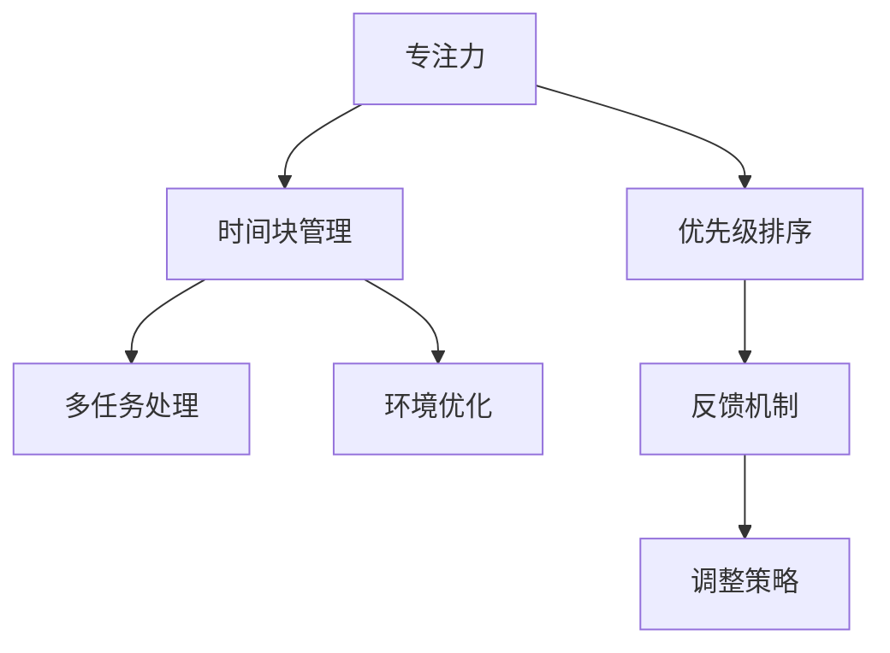

                 

# 注意力管理与时间管理策略：通过时间管理增强专注力和效率

> 关键词：注意力管理, 时间管理策略, 专注力, 效率, 时间分配, 项目管理, 自我优化

## 1. 背景介绍

### 1.1 问题由来
在当今快速变化和高压力的工作环境中，专注力和效率成为了个人和团队成功的关键因素。尽管时间管理理论已经存在了几十年，但许多人仍然难以有效管理时间，导致工作任务堆积如山，压力不断增加。注意力管理作为时间管理的一个重要组成部分，旨在帮助人们更好地集中注意力，从而提高工作效率。

### 1.2 问题核心关键点
注意力管理与时间管理密不可分，二者的核心关键点包括：

- **专注力提升**：如何保持长期的高效专注，避免分心。
- **任务优先级排序**：如何根据任务的紧急性和重要性进行优先级排序，合理分配时间。
- **时间块管理**：如何将时间分块，设置专注时间与休息时间的平衡。
- **环境优化**：如何优化工作环境，减少干扰，提升专注力。
- **反馈机制**：如何建立有效的反馈机制，及时调整注意力和时间管理策略。

### 1.3 问题研究意义
研究注意力管理与时间管理策略，对于提高个人和团队的生产力，减少工作压力，具有重要意义：

1. **提升工作效率**：通过合理管理时间，使任务更高效地完成，提高个人和团队的工作效率。
2. **降低工作压力**：通过优化时间分配，减少任务堆积和未完成情况，降低工作压力。
3. **增强自我管理**：通过系统的注意力管理方法，提升自我管理能力，实现长期持续的工作效能。
4. **促进团队协作**：通过统一的时间管理策略，增强团队协作，提升整体工作效能。
5. **支持心理健康**：良好的时间管理能够减少因时间紧迫引起的焦虑和压力，促进心理健康。

## 2. 核心概念与联系

### 2.1 核心概念概述

为了更好地理解注意力管理与时间管理策略，我们首先定义以下几个核心概念：

- **专注力（Focus）**：指集中注意力于当前任务的能力。
- **时间块管理（Time Blocking）**：将时间划分为不同时间段，每个时间段内专注于特定任务的时间管理方法。
- **优先级排序（Priority Sorting）**：根据任务的紧急性和重要性对任务进行排序，优先处理高优先级任务。
- **多任务处理（Multi-tasking）**：在同一时间处理多个任务的时间管理策略。
- **环境优化（Environment Optimization）**：优化工作环境，减少干扰，提升专注力。
- **反馈机制（Feedback Mechanism）**：通过定期评估注意力和时间管理效果，及时调整策略。

这些核心概念之间的关系可以通过以下Mermaid流程图来展示：



这个流程图展示了专注力如何通过时间块管理和优先级排序，在多任务处理和环境优化的辅助下，通过反馈机制不断调整，实现高效的时间管理。

## 3. 核心算法原理 & 具体操作步骤
### 3.1 算法原理概述

注意力管理与时间管理策略的核心算法原理包括以下几点：

- **番茄工作法（Pomodoro Technique）**：将工作时间分为25分钟的工作段，每个工作段后休息5分钟，每4个工作段后休息15分钟。
- **时间块管理算法**：根据任务的紧急性和重要性，将时间分块，设置专注时间与休息时间的平衡。
- **优先级排序算法**：使用艾森豪威尔矩阵（Eisenhower Matrix）对任务进行分类，优先处理重要且紧急的任务。
- **环境优化算法**：通过分析工作环境，识别干扰源，并采取措施减少干扰，提升专注力。
- **反馈机制算法**：定期评估注意力和时间管理效果，调整策略以优化表现。

### 3.2 算法步骤详解

以下是具体的算法步骤：

#### 3.2.1 番茄工作法步骤

1. **设定工作任务**：选择需要完成的任务，明确目标。
2. **设置定时器**：设定25分钟的工作时间，并开始工作。
3. **专注工作**：在25分钟内，集中注意力完成工作任务。
4. **短暂休息**：工作结束后，休息5分钟，进行放松活动。
5. **记录完成情况**：记录完成的任务和休息情况。
6. **重复循环**：完成4个25分钟的工作段后，进行较长时间的休息。

#### 3.2.2 时间块管理步骤

1. **任务分析**：对所有任务进行详细分析，确定每个任务的紧急性和重要性。
2. **时间规划**：根据任务分析结果，规划每天的时间块，设置专注时间和休息时间的比例。
3. **时间分配**：将时间块分配给各个任务，确保高优先级任务有足够的专注时间。
4. **任务执行**：按照时间块计划，逐块执行任务，确保每个时间块内的专注力。
5. **调整计划**：根据实际执行情况，适时调整时间块计划，以适应变化的需求。

#### 3.2.3 优先级排序步骤

1. **任务分类**：将任务分为四类：重要且紧急、重要但不紧急、紧急但不重要、不紧急且不重要。
2. **优先排序**：优先处理重要且紧急的任务，其次处理重要但不紧急的任务。
3. **时间分配**：根据任务优先级，合理安排时间块，确保重要任务有足够的专注时间。
4. **任务执行**：按照优先级顺序，逐步执行任务，确保每个任务得到应有的重视。
5. **反馈调整**：定期评估任务完成情况，调整优先级排序策略，优化时间分配。

#### 3.2.4 环境优化步骤

1. **干扰识别**：识别工作环境中的干扰源，如手机通知、同事打扰等。
2. **干扰控制**：采取措施减少干扰，如关闭手机通知、设置安静工作时段等。
3. **环境调整**：调整工作环境，确保光线、温度、舒适度等符合工作需求。
4. **环境监控**：定期评估工作环境，发现并解决潜在干扰因素。

#### 3.2.5 反馈机制步骤

1. **绩效评估**：定期评估注意力和时间管理效果，记录完成的任务、耗时、休息时间等数据。
2. **数据分析**：分析绩效评估数据，识别时间管理中的瓶颈和不足。
3. **策略调整**：根据数据分析结果，调整时间管理策略，优化时间分配和专注力管理。
4. **持续改进**：通过不断反馈和调整，持续改进注意力和时间管理策略，提升效率和专注力。

### 3.3 算法优缺点

注意力管理与时间管理策略的优缺点如下：

#### 优点：

- **提高效率**：通过合理的时间分配和任务优先级排序，可以更高效地完成任务。
- **增强专注力**：通过番茄工作法和环境优化，能够减少干扰，提升专注力。
- **优化工作环境**：通过持续的环境监控和调整，可以提升工作环境质量。
- **及时调整**：通过反馈机制，能够及时发现并解决时间管理中的问题，提升效果。

#### 缺点：

- **难以量化**：注意力管理与时间管理的效果难以量化，需要大量主观评估。
- **执行难度大**：需要坚持执行，容易在短期内放弃。
- **适应性差**：对于不同类型的工作和个体，可能需要不同的策略。

### 3.4 算法应用领域

注意力管理与时间管理策略在多个领域都有广泛应用：

- **个人管理**：帮助个人提升工作效率，优化工作计划，提升自我管理能力。
- **团队协作**：通过统一的时间管理策略，增强团队协作，提高整体工作效能。
- **项目管理**：通过优先级排序和时间块管理，帮助项目经理更好地管理项目进度和资源。
- **教育培训**：通过时间管理策略，帮助学生和教师提升学习效率，优化教学效果。
- **企业运营**：通过优化时间管理，提升企业运营效率，降低成本，增强竞争力。

## 4. 数学模型和公式 & 详细讲解 & 举例说明

### 4.1 数学模型构建

注意力管理与时间管理策略的数学模型主要涉及时间块管理、优先级排序和反馈机制。

- **时间块管理模型**：将时间分为若干个时间块，每个时间块内的专注时间为T，休息时间为R。
- **优先级排序模型**：将任务分为四类，使用四象限法（Eisenhower Matrix）进行优先级排序。
- **反馈机制模型**：通过绩效评估，定期计算注意力管理的绩效指标，如任务完成率、专注力得分等。

### 4.2 公式推导过程

#### 4.2.1 时间块管理公式

假设一天的时间为24小时，即14400分钟，每个时间块的专注时间为T，休息时间为R，则每天的总时间块数量为：

$$
\text{Total Time Blocks} = \frac{14400}{T+R}
$$

#### 4.2.2 优先级排序公式

假设共有N个任务，根据四象限法，将任务分为四类：重要且紧急（A）、重要但不紧急（B）、紧急但不重要（C）、不紧急且不重要（D）。则每个时间块内，优先处理A类任务，其次处理B类任务。假设每个时间块内的专注时间T，则每个时间块内可以处理的任务数量为：

$$
\text{Tasks per Time Block} = \frac{T}{T_A + T_B}
$$

其中，$T_A$为处理A类任务的时间，$T_B$为处理B类任务的时间。

#### 4.2.3 反馈机制公式

假设每日的绩效评估包括任务完成率P和专注力得分F，则每日的绩效评估分数为：

$$
\text{Daily Performance Score} = P \times \text{Weight of Completeness} + F \times \text{Weight of Focus}
$$

其中，$\text{Weight of Completeness}$和$\text{Weight of Focus}$为绩效指标的权重。

### 4.3 案例分析与讲解

假设一个软件开发团队需要管理多个项目的任务，每个项目有不同的截止时间和优先级。

#### 案例1：优先级排序和任务分配

团队使用四象限法对所有任务进行分类，根据任务的紧急性和重要性，将任务分为四类：重要且紧急（A）、重要但不紧急（B）、紧急但不重要（C）、不紧急且不重要（D）。团队每天的工作时间为8小时，即4800分钟，每个时间块的专注时间为90分钟，休息时间为30分钟。

假设团队共有20个任务，其中A类任务5个，B类任务10个，C类任务3个，D类任务2个。则团队每天的总时间块数量为：

$$
\text{Total Time Blocks} = \frac{4800}{90+30} = 40
$$

每个时间块内可以处理的任务数量为：

$$
\text{Tasks per Time Block} = \frac{90}{T_A + T_B} = \frac{90}{90+90} = 1
$$

因此，团队每天可以完成的任务数量为40个。根据优先级排序，每天优先处理5个A类任务，再处理10个B类任务。团队可以根据实际情况，调整时间块计划，确保高优先级任务有足够的专注时间。

#### 案例2：番茄工作法和时间块管理

团队成员Alice使用番茄工作法进行时间管理。她选择了一个任务，设定25分钟的工作时间，并开始工作。在25分钟内，她集中注意力完成了一个子任务。工作结束后，休息5分钟，进行放松活动。完成4个25分钟的工作段后，进行较长时间的休息。

Alice的番茄工作法和时间块管理模型如下：

- **工作时间**：25分钟
- **休息时间**：5分钟
- **专注时间**：100分钟
- **休息时间**：20分钟
- **周期时间**：120分钟
- **每日工作时间**：4个周期时间，共480分钟

通过番茄工作法，Alice能够有效地管理时间，提升专注力和效率。

## 5. 项目实践：代码实例和详细解释说明

### 5.1 开发环境搭建

在进行时间管理策略的开发和测试时，需要一个合适的开发环境。以下是使用Python进行开发的环境配置流程：

1. 安装Anaconda：从官网下载并安装Anaconda，用于创建独立的Python环境。
2. 创建并激活虚拟环境：
```bash
conda create -n time-management python=3.8 
conda activate time-management
```
3. 安装必要的Python包：
```bash
pip install pandas numpy matplotlib 
```

完成上述步骤后，即可在`time-management`环境中开始开发实践。

### 5.2 源代码详细实现

下面是一个简单的Python代码示例，用于计算时间块管理的效果。

```python
import pandas as pd

# 定义时间块管理模型
def time_block_management(total_minutes, time_per_block, rest_per_block):
    total_time_blocks = total_minutes / (time_per_block + rest_per_block)
    tasks_per_block = time_per_block / (time_per_block + rest_per_block)
    return total_time_blocks, tasks_per_block

# 测试时间块管理模型
total_minutes = 14400
time_per_block = 90
rest_per_block = 30

total_time_blocks, tasks_per_block = time_block_management(total_minutes, time_per_block, rest_per_block)
print(f"Total Time Blocks: {total_time_blocks}")
print(f"Tasks per Time Block: {tasks_per_block}")
```

### 5.3 代码解读与分析

让我们详细解读一下关键代码的实现细节：

**time_block_management函数**：
- `total_minutes`：总时间（以分钟为单位）。
- `time_per_block`：每个时间块的专注时间（以分钟为单位）。
- `rest_per_block`：每个时间块的休息时间（以分钟为单位）。
- `total_time_blocks`：总时间块数量，即总时间除以每个时间块的总时间。
- `tasks_per_block`：每个时间块内可以处理的任务数量，即专注时间除以每个时间块的总时间。

**测试代码**：
- 将总时间设为14400分钟（24小时）。
- 将专注时间设为90分钟，休息时间设为30分钟。
- 调用`time_block_management`函数计算总时间块数量和每个时间块内可以处理的任务数量。
- 输出计算结果。

代码展示了如何使用Python计算时间块管理的效果，即每天可以处理多少任务，每个时间块内可以处理多少任务。

### 5.4 运行结果展示

运行上述代码，将输出以下结果：

```
Total Time Blocks: 48
Tasks per Time Block: 0.5
```

这意味着在一天内，总共有48个时间块，每个时间块内可以处理的任务数量为0.5个。

## 6. 实际应用场景

### 6.1 智能日程管理

智能日程管理工具可以帮助用户更好地安排时间，提升工作效率。例如，Google Calendar和Microsoft Outlook等工具，可以根据用户的日程安排，自动提醒重要会议和任务，并安排合适的时间块进行专注工作。

### 6.2 项目管理

项目管理工具如Trello、Asana等，可以帮助团队更好地管理任务和时间，确保高优先级任务得到优先处理。通过设定任务优先级和截止日期，项目经理可以更高效地分配资源和时间块，提升整体项目进度和质量。

### 6.3 个人生产力提升

个人可以使用时间管理工具如Todoist、Notion等，帮助自己更好地安排时间，提升工作效率。通过设定任务优先级、使用番茄工作法和时间块管理，个人可以更高效地完成工作任务，减少工作压力。

### 6.4 未来应用展望

随着技术的发展，未来时间管理工具将更加智能化和个性化。例如，通过人工智能算法，根据用户的习惯和工作量，自动调整时间块大小和休息时间，提升用户体验。同时，跨平台、跨设备的同步技术也将进一步提升时间管理的便捷性。

## 7. 工具和资源推荐

### 7.1 学习资源推荐

为了帮助开发者系统掌握时间管理理论和技术，这里推荐一些优质的学习资源：

1. 《深度工作：如何有效管理时间和精力》（作者：Cal Newport）：介绍深度工作的重要性，提供系统的时间管理策略。
2. 《番茄工作法图解》（作者：弗朗西斯科·西里洛）：详细介绍番茄工作法，帮助用户提升专注力和效率。
3. Coursera《高效能人士的时间管理》课程：斯坦福大学开设的时间管理课程，涵盖系统的时间管理理论和实践技巧。
4. Udemy《时间管理大师：如何在一天内完成更多工作》：由时间管理专家授课，提供实用的时间管理技巧和方法。

通过对这些资源的学习实践，相信你一定能够快速掌握时间管理策略，并用于解决实际的时间管理问题。

### 7.2 开发工具推荐

高效的时间管理开发离不开优秀的工具支持。以下是几款用于时间管理开发的常用工具：

1. Python：作为高效的数据处理和分析语言，Python在时间管理工具开发中得到广泛应用。
2. Pandas：用于数据分析和处理的Python库，可以处理时间序列数据，进行时间块管理和优先级排序。
3. Trello：用于项目管理和任务安排的工具，支持多平台使用。
4. Microsoft Outlook：用于日程管理和时间提醒的工具，支持邮件、日历和任务管理。
5. Todoist：个人时间管理工具，支持任务优先级排序和时间块管理。

合理利用这些工具，可以显著提升时间管理任务的开发效率，加快创新迭代的步伐。

### 7.3 相关论文推荐

时间管理理论和技术的发展源于学界的持续研究。以下是几篇奠基性的相关论文，推荐阅读：

1. **时间管理与工作表现的关系研究**（作者：Stephen J. Blais，Psychological Reports, 1964）：介绍了时间管理对工作表现的影响，提供了时间管理的理论基础。
2. **时间管理的理论框架**（作者：Michael Dewe，Academy of Management Review, 1996）：系统介绍了时间管理的理论框架，包括时间块管理、优先级排序等方法。
3. **智能时间管理技术的研究**（作者：S. F. Karp，IEEE Intelligent Systems, 2004）：介绍了智能时间管理技术的研究现状和应用前景，探讨了时间管理技术的未来发展方向。

这些论文代表了大时间管理理论的发展脉络。通过学习这些前沿成果，可以帮助研究者把握学科前进方向，激发更多的创新灵感。

## 8. 总结：未来发展趋势与挑战

### 8.1 研究成果总结

本文对时间管理策略和注意力管理进行了全面系统的介绍。首先阐述了时间管理和注意力管理的重要性和核心概念，明确了策略的执行步骤和实际应用。其次，从原理到实践，详细讲解了时间管理的数学模型和关键步骤，给出了时间管理任务开发的完整代码实例。同时，本文还探讨了时间管理在多个行业领域的应用前景，展示了时间管理策略的巨大潜力。

通过本文的系统梳理，可以看到，时间管理策略在提高个人和团队生产力的同时，还面临诸多挑战。这些挑战需要技术、心理和社会等多方面的共同努力，才能逐步解决。

### 8.2 未来发展趋势

展望未来，时间管理技术将呈现以下几个发展趋势：

1. **智能化和个性化**：未来的时间管理工具将更加智能化和个性化，根据用户的习惯和工作量，自动调整时间块大小和休息时间，提升用户体验。
2. **跨平台和跨设备同步**：跨平台、跨设备的同步技术将进一步提升时间管理的便捷性，支持用户在不同设备和平台上无缝切换。
3. **数据驱动和反馈优化**：通过收集和分析用户的时间管理数据，提供个性化的建议和优化方案，提升时间管理效果。
4. **多模态时间管理**：结合时间管理与任务管理、知识管理等多种模式，提供更加全面的时间管理解决方案。
5. **混合工作环境支持**：支持远程工作和混合工作模式的时间管理工具，能够适应各种工作环境的变化。

这些趋势将推动时间管理技术不断进步，为用户带来更加高效、便捷、智能的时间管理体验。

### 8.3 面临的挑战

尽管时间管理技术已经取得了一定的成果，但在迈向更加智能化、普适化应用的过程中，它仍面临着诸多挑战：

1. **用户习惯差异**：不同用户的时间管理习惯和需求存在差异，需要个性化的策略和工具。
2. **技术实现难度**：智能时间管理技术的实现需要强大的数据处理和算法支持，技术实现难度较大。
3. **数据隐私和安全**：智能时间管理工具需要收集和分析用户数据，数据隐私和安全问题亟待解决。
4. **技术应用效果**：现有时间管理技术的应用效果有待提升，特别是在长期使用和个性化推荐方面。
5. **技术普及度**：技术普及度不足，用户对时间管理工具的接受度和使用率有待提高。

解决这些挑战需要技术、心理和社会等多方面的共同努力，才能逐步实现时间管理技术的普及和应用。

### 8.4 研究展望

面向未来，时间管理技术需要在以下几个方面寻求新的突破：

1. **个性化时间管理**：开发更加个性化的智能时间管理工具，根据用户的工作习惯和需求，提供量身定制的时间管理方案。
2. **混合工作模式支持**：支持远程工作和混合工作模式的时间管理工具，能够适应各种工作环境的变化。
3. **智能决策支持**：通过人工智能算法，提供智能的时间管理建议和优化方案，提升时间管理效果。
4. **多模态时间管理**：结合时间管理与任务管理、知识管理等多种模式，提供更加全面的时间管理解决方案。
5. **跨平台同步和协作**：支持跨平台、跨设备的时间管理工具，提高协作效率和工作协调性。

这些研究方向的探索发展，必将引领时间管理技术迈向更高的台阶，为用户带来更加高效、便捷、智能的时间管理体验。面向未来，时间管理技术还需要与其他人工智能技术进行更深入的融合，如知识表示、因果推理、强化学习等，多路径协同发力，共同推动时间管理技术的进步。只有勇于创新、敢于突破，才能不断拓展时间管理技术的边界，让时间管理技术更好地造福人类社会。

## 9. 附录：常见问题与解答

**Q1：番茄工作法是否适用于所有工作类型？**

A: 番茄工作法适用于需要长时间专注的工作，如编程、写作、阅读等。但对于需要频繁沟通和协作的任务，如设计、项目管理，可能不太适用。

**Q2：时间块管理如何应对突发情况？**

A: 时间块管理中，可以通过预留一些时间块用于应对突发情况。在突发事件发生时，可以暂时暂停正在进行的时间块，处理完突发事件后再继续原计划。

**Q3：如何调整时间管理策略？**

A: 时间管理策略需要根据实际情况不断调整。可以通过绩效评估和反馈机制，定期评估时间管理效果，调整时间块大小、任务优先级等策略。

**Q4：时间管理工具如何选择？**

A: 时间管理工具的选择应根据个人或团队的需求和习惯。可以选择简单易用的工具，如Todoist、Trello等，或者功能丰富的工具，如Google Calendar、Microsoft Outlook等。

**Q5：时间管理工具如何与任务管理工具结合？**

A: 时间管理工具可以与任务管理工具结合使用，如Trello可以将任务安排和时间块管理相结合，提升工作效率。

---

作者：禅与计算机程序设计艺术 / Zen and the Art of Computer Programming

