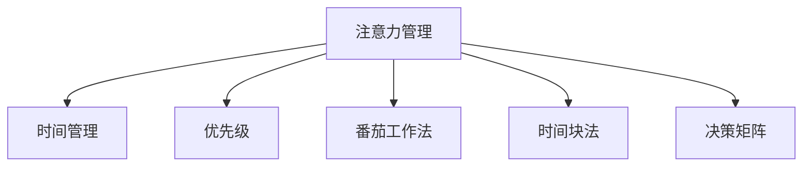

                 

# 注意力管理与时间管理：如何最大化利用你的一天

> 关键词：注意力管理, 时间管理, 优先级, 番茄工作法, 时间块法, 决策矩阵

## 1. 背景介绍

### 1.1 问题由来
在快节奏的现代生活中，时间管理已成为许多人面临的重大挑战。有效的时间管理不仅能够提高生产效率，还能带来更健康、更平衡的生活状态。然而，尽管时间管理工具和方法层出不穷，许多人仍然感到时间不够用，工作效率低下。这一现象背后的原因之一是，人们往往缺乏系统的注意力管理策略。注意力作为认知资源，是进行有效时间管理的基础。缺乏注意力管理，无法集中精力处理重要任务，必然会导致时间浪费和效率低下。

### 1.2 问题核心关键点
在现代社会，有效的时间管理必须建立在科学的注意力管理之上。注意力管理的核心在于理解注意力分布的规律，并据此制定合理的计划和策略。本博客聚焦于基于注意力管理的时间管理策略，探讨如何通过优先级设置、时间块划分、番茄工作法等工具，帮助人们最大化利用每一天的时间。

### 1.3 问题研究意义
了解和运用科学的注意力管理与时间管理策略，对于提高个体和组织的工作效率、促进个人和职业发展具有重要意义。在技术高度发达的今天，高效的时间管理能够带来生产力的显著提升，让人们在有限的时间内完成更多有意义的工作。同时，良好的时间管理也能带来身心健康和平衡的生活状态。因此，本博客旨在为读者提供实用的时间管理建议，帮助其提升效率，实现更高质量的生活。

## 2. 核心概念与联系

### 2.1 核心概念概述

为更好地理解注意力管理与时间管理的关系，本节将介绍几个密切相关的核心概念：

- 注意力管理(Attention Management)：指对注意力资源的分配和利用进行计划和控制的过程。通过合理分配注意力，可以更好地完成任务，减少不必要的干扰。
- 时间管理(Time Management)：指对时间的分配和利用进行计划和控制的过程。通过合理安排时间，可以更高效地完成任务，实现目标。
- 优先级(Priority)：指根据任务的紧急性和重要性，进行任务排序的过程。优先处理重要且紧急的任务，可以提高工作效率。
- 番茄工作法(Pomodoro Technique)：一种时间管理方法，通过设定25分钟的专注时间（即一个“番茄”），每4个“番茄”后休息5分钟，来提高专注力和效率。
- 时间块法(Time Blocking)：一种时间管理方法，将一天分成若干块时间，每块时间集中处理特定任务，以提高效率。
- 决策矩阵(Decision Matrix)：一种工具，通过权衡任务的紧急性和重要性，帮助决策者快速做出最优选择。

这些核心概念之间的逻辑关系可以通过以下Mermaid流程图来展示：



这个流程图展示了一些核心概念的相互联系：

1. 注意力管理通过合理分配注意力资源，为时间管理提供基础。
2. 优先级设置帮助识别重要任务，指导时间安排。
3. 番茄工作法和时间块法提供了具体的时间管理方法。
4. 决策矩阵帮助评估和选择任务，辅助时间管理决策。

这些概念共同构成了时间管理的基础框架，通过理解和应用这些方法，可以更好地控制时间和注意力资源，实现高效的工作和生活。

## 3. 核心算法原理 & 具体操作步骤

### 3.1 算法原理概述

注意力管理与时间管理之间存在着密切的联系。有效的注意力管理策略能够帮助人们更好地利用时间资源，提高生产效率。因此，本节将重点介绍注意力管理与时间管理的关系，并探讨其核心算法原理。

基于注意力管理的时间管理方法，其核心思想是：通过识别和分配注意力资源，合理安排时间，使工作任务与注意力的匹配程度最大化。具体来说，需要根据任务的紧急性和重要性，设置优先级，并采用番茄工作法或时间块法等方法，合理划分工作时间，确保每个时间段内专注于特定任务，从而提高整体工作效率。

### 3.2 算法步骤详解

本节将详细讲解基于注意力管理的时间管理算法步骤，包括优先级设置、番茄工作法应用、时间块法实施等具体操作。

**Step 1: 识别任务**
- 列出需要完成的任务清单，并简要描述每个任务的重要性和紧急程度。

**Step 2: 设置优先级**
- 根据任务的重要性和紧急程度，使用决策矩阵进行任务排序，确定每个任务的优先级。

**Step 3: 应用番茄工作法**
- 将每天的工作时间划分为若干个25分钟的“番茄”，每个“番茄”后休息5分钟。
- 在每个“番茄”内专注于一个特定任务，避免多任务切换，提高专注力。

**Step 4: 实施时间块法**
- 将一天的工作时间划分为若干个时间块，每个时间块处理特定任务。
- 每个时间块内不进行任务切换，直到时间块结束。
- 时间块之间设置固定的休息时间，以避免疲劳。

**Step 5: 调整和优化**
- 根据实际工作情况，调整优先级和时间块划分，以优化效率。
- 定期回顾和总结时间管理效果，持续改进。

### 3.3 算法优缺点

基于注意力管理的时间管理方法具有以下优点：

1. 提高专注力：通过番茄工作法和集中时间块，减少了多任务切换，提高了专注力和工作效率。
2. 避免疲劳：合理安排工作和休息时间，避免了长时间工作的疲劳。
3. 提升计划性：优先级设置和时间块划分，使工作安排更加有序，提高了计划性和执行效率。

同时，这些方法也存在一些局限性：

1. 时间灵活性不足：番茄工作法和时间块法需要严格遵守时间安排，对于不可预测的任务和突发事件，灵活性较低。
2. 复杂任务处理困难：对于复杂的长期任务，短期时间块可能难以完成，需要调整时间安排。
3. 初始调整成本高：初始阶段需要花时间进行任务识别和优先级设置，对于缺乏经验的用户，可能较为困难。

### 3.4 算法应用领域

基于注意力管理的时间管理方法在各个领域都有广泛的应用，例如：

- 个人工作与学习：通过合理分配时间和注意力，提高学习和工作效率。
- 项目管理：在项目中合理分配时间块和任务优先级，确保项目进度和质量。
- 团队协作：在团队中统一时间管理策略，提高团队协作效率。
- 自我管理：通过时间管理方法实现自我约束和自我激励，提升生活质量。

这些方法不仅适用于个人工作和学习，还适用于团队和组织的项目管理，具有广泛的适用性。

## 4. 数学模型和公式 & 详细讲解 & 举例说明

### 4.1 数学模型构建

在基于注意力管理的时间管理中，可以使用决策矩阵来量化任务的紧急性和重要性。决策矩阵是一个二维表格，用于评估和比较不同任务的优先级。矩阵中的每个单元格表示一个任务的重要性和紧急程度，通过打分的方式进行量化，最后根据得分进行排序。

假设有一个包含3个任务的决策矩阵，如下所示：

| 任务 | 重要性 | 紧急程度 |
| --- | --- | --- |
| 任务A | 5 | 3 |
| 任务B | 4 | 2 |
| 任务C | 3 | 4 |

其中，重要性得分和紧急程度得分分别表示任务的重要性和紧急程度，得分范围为1到10。通过对每个任务进行打分，可以得到一个优先级排序，用于指导时间的分配。

### 4.2 公式推导过程

对于决策矩阵，可以使用加权求和的方式计算每个任务的综合得分，从而确定优先级。设任务的重要性得分为 $I_i$，紧急程度得分为 $J_i$，权值分别为 $\alpha$ 和 $\beta$，则任务 $i$ 的综合得分 $S_i$ 可以表示为：

$$
S_i = \alpha \cdot I_i + \beta \cdot J_i
$$

其中 $\alpha + \beta = 1$，表示权值之和为1，用于归一化处理。

### 4.3 案例分析与讲解

假设某个人有3个任务需要完成，分别需要2小时、3小时和5小时，重要性和紧急程度如下：

| 任务 | 重要性 | 紧急程度 |
| --- | --- | --- |
| 任务A | 5 | 3 |
| 任务B | 4 | 2 |
| 任务C | 3 | 4 |

使用决策矩阵进行任务排序，设定重要性权值 $\alpha = 0.7$，紧急程度权值 $\beta = 0.3$，计算每个任务的综合得分：

- 任务A：$S_A = 0.7 \cdot 5 + 0.3 \cdot 3 = 5.5$
- 任务B：$S_B = 0.7 \cdot 4 + 0.3 \cdot 2 = 4.2$
- 任务C：$S_C = 0.7 \cdot 3 + 0.3 \cdot 4 = 4.1$

根据得分排序，任务的优先级为：任务A > 任务B > 任务C。根据优先级，可以将一天的时间划分为不同的时间块，优先完成重要且紧急的任务。例如，将一天分为8个时间块，每个时间块2小时，分别为：

- 时间块1：任务A，需要2小时
- 时间块2：任务B，需要3小时
- 时间块3：任务C，需要5小时
- 时间块4：休息，30分钟
- 时间块5：休息，30分钟
- 时间块6：继续任务C，2小时
- 时间块7：休息，30分钟
- 时间块8：休息，30分钟

在每个时间块内，只专注于特定任务，避免多任务切换，提高效率和专注力。

## 5. 项目实践：代码实例和详细解释说明

### 5.1 开发环境搭建

在进行时间管理实践前，我们需要准备好开发环境。以下是使用Python进行项目开发的准备工作：

1. 安装Python：从官网下载并安装最新版本的Python。
2. 安装必要的第三方库：安装Pandas、numpy等数据处理库，以及Jupyter Notebook等可视化工具。
3. 安装决策矩阵计算库：安装scipy库，用于计算决策矩阵。
4. 安装任务管理库：安装pomodoro-technique库，用于应用番茄工作法。

### 5.2 源代码详细实现

下面是一个使用Python实现决策矩阵计算和时间管理实践的代码示例：

```python
import pandas as pd
from scipy import stats

# 创建决策矩阵
matrix = pd.DataFrame({
    '任务': ['任务A', '任务B', '任务C'],
    '重要性': [5, 4, 3],
    '紧急程度': [3, 2, 4]
})

# 计算综合得分
alpha = 0.7
beta = 0.3
matrix['得分'] = matrix['重要性'] * alpha + matrix['紧急程度'] * beta

# 排序和显示优先级
matrix = matrix.sort_values(by='得分', ascending=False)
print(matrix)
```

这段代码创建了一个包含3个任务的决策矩阵，并根据重要性和紧急程度计算了每个任务的综合得分。最终按照得分排序，输出任务的优先级。

### 5.3 代码解读与分析

这段代码实现了决策矩阵的创建和综合得分的计算。其中，使用了Pandas库进行数据处理，Scipy库进行数学计算。代码简洁高效，易于理解。

在实际应用中，可以根据任务数量和复杂度，灵活调整决策矩阵的维度，并使用更复杂的模型进行计算。此外，还可以结合其他工具和技术，如时间块划分、番茄工作法等，进一步优化时间管理实践。

## 6. 实际应用场景

### 6.1 个人工作与学习

在个人工作和学习中，基于决策矩阵的时间管理方法非常实用。通过明确任务的优先级，将时间划分为不同的时间块，可以在有限的时间内完成更多重要任务，提高生产效率。例如，某个人需要准备考试，可以使用决策矩阵来评估不同复习内容的优先级，将时间块法应用于复习任务，避免多任务切换，提高学习效率。

### 6.2 项目管理

在项目管理中，基于注意力管理的时间管理方法同样重要。项目经理可以使用决策矩阵来评估不同任务的优先级，合理分配时间块，确保项目进度和质量。例如，一个软件开发团队可以使用决策矩阵来评估不同功能模块的优先级，将时间块法应用于任务分配，提高开发效率和软件质量。

### 6.3 团队协作

在团队协作中，基于注意力管理的时间管理方法可以帮助团队成员更好地协调工作。通过共同使用决策矩阵和时间块法，团队成员可以在同一时间块内专注于特定任务，避免冲突和干扰，提高团队协作效率。例如，一个产品开发团队可以使用决策矩阵来评估不同任务的重要性和紧急程度，将时间块法应用于任务分配，确保团队成员的工作有序协调。

### 6.4 自我管理

在自我管理中，基于注意力管理的时间管理方法可以帮助个人实现自我约束和自我激励。通过明确任务的优先级和时间块划分，可以在有限的时间内完成更多有意义的工作，提高生活质量。例如，一个人可以使用决策矩阵来评估不同活动的优先级，将番茄工作法应用于日常活动，提升工作和生活的平衡性。

## 7. 工具和资源推荐

### 7.1 学习资源推荐

为了帮助读者系统掌握时间管理与注意力管理的方法，本节推荐一些优质的学习资源：

1. 《时间管理与注意力管理：心理学视角》书籍：系统介绍了时间管理和注意力管理的心理学原理，提供了实用的时间管理策略和方法。
2. 《番茄工作法：简化时间管理》书籍：详细介绍了番茄工作法的原理和实践技巧，提供了丰富的案例和应用实例。
3. 《时间块法：提升个人效率》博客：分享了时间块法的时间管理实践经验，提供了简单易行的实践指南。
4. Coursera《时间管理与生产力》课程：由斯坦福大学教授授课，涵盖了时间管理和注意力管理的基本概念和应用策略。
5. Udemy《高效时间管理》课程：提供了系统的时间管理技巧和实践指导，适合初学者和进阶用户。

通过对这些资源的学习实践，相信读者能够更好地理解时间管理和注意力管理的内在逻辑，并应用于实际工作和生活。

### 7.2 开发工具推荐

高效的开发离不开优秀的工具支持。以下是几款用于时间管理开发的常用工具：

1. Microsoft To Do：一款功能强大的任务管理工具，支持任务清单、日历、提醒等多种功能，适用于个人和工作环境。
2. Trello：一款团队协作工具，通过看板视图展示任务进度，支持任务分配、进度跟踪等多种功能，适用于团队协作。
3. Asana：一款项目管理工具，支持任务分配、进度跟踪、团队协作等多种功能，适用于项目经理和团队成员。
4. Pomodoro Timer：一款番茄工作法计时工具，帮助用户实现番茄工作法的实践。
5. Toggl Plan：一款任务管理工具，支持时间块划分、任务优先级设置等多种功能，适用于个人和时间管理。

合理利用这些工具，可以显著提升时间管理和注意力管理的效率，优化工作和生活的质量。

### 7.3 相关论文推荐

时间管理与注意力管理的研究领域已经积累了大量的文献，以下是几篇经典的相关论文，推荐阅读：

1. "Time Management and Productivity: A Psychological Perspective" 文章：探讨了时间管理和生产力的心理学原理，提供了科学的时间管理策略和方法。
2. "The Pomodoro Technique: A New Way to Work" 文章：详细介绍了番茄工作法的原理和实践技巧，提供了丰富的案例和应用实例。
3. "Time Blocking: A New Way to Manage Your Time" 文章：分享了时间块法的时间管理实践经验，提供了简单易行的实践指南。
4. "Decision Matrix: A Tool for Prioritization" 文章：介绍了决策矩阵的基本原理和应用方法，提供了实用的时间管理工具。

这些论文代表了时间管理与注意力管理的研究进展，通过学习这些前沿成果，可以帮助读者把握学科前进方向，激发更多的创新灵感。

## 8. 总结：未来发展趋势与挑战

### 8.1 总结

本文对基于注意力管理的时间管理方法进行了全面系统的介绍。首先阐述了时间管理与注意力管理的关系，明确了时间管理的基础在于注意力资源的合理分配。其次，从原理到实践，详细讲解了时间管理与注意力管理的内在逻辑，提供了决策矩阵、番茄工作法、时间块法等实用的管理工具和方法。同时，本文还广泛探讨了时间管理在个人工作、项目管理、团队协作等各个领域的应用场景，展示了时间管理范式的广泛适用性。

通过本文的系统梳理，可以看到，基于注意力管理的时间管理方法对于提升个体和组织的生产效率具有重要意义。科学地识别和分配注意力资源，合理安排时间，可以提高工作效率和生活质量。未来，伴随时间管理技术的不断演进，相信这些方法将在更多领域得到应用，为提高社会生产力和生活水平做出更大贡献。

### 8.2 未来发展趋势

展望未来，时间管理与注意力管理技术将呈现以下几个发展趋势：

1. 智能化时间管理：随着人工智能技术的进步，未来的时间管理工具将更加智能化，能够根据用户的习惯和需求自动调整时间安排，提供个性化的建议。
2. 集成化时间管理：未来的时间管理工具将更加集成化，能够与任务管理、项目管理、协作工具等进行无缝集成，实现高效的工作和协作。
3. 多样化时间管理方法：未来的时间管理方法将更加多样化，除了番茄工作法、时间块法等传统方法，还会出现更多创新的时间管理策略。
4. 跨平台时间管理：未来的时间管理工具将支持多种平台和设备，用户可以在不同环境中无缝切换，实现时间管理的无缝衔接。
5. 数据驱动的时间管理：未来的时间管理将更加数据驱动，通过大数据分析和用户行为预测，提供更加科学的时间管理建议。

以上趋势凸显了时间管理与注意力管理技术的广阔前景。这些方向的探索发展，必将进一步提升时间管理工具的智能化和集成化水平，为提高生产效率和生活质量提供更大的助力。

### 8.3 面临的挑战

尽管时间管理与注意力管理技术已经取得了不少进展，但在迈向更加智能化、集成化应用的过程中，仍面临诸多挑战：

1. 用户习惯的改变：新的时间管理工具和方法需要用户改变传统的习惯，可能会遇到一定的阻力。
2. 技术实现的复杂性：时间管理工具的智能化和集成化需要高度复杂的技术支持，可能存在实现难度大的问题。
3. 数据隐私和安全：时间管理工具涉及用户的隐私数据，如何保护数据安全，避免数据泄露，是必须解决的挑战。
4. 跨平台兼容性：时间管理工具需要在多种设备和平台上无缝衔接，可能存在兼容性问题。
5. 用户适应性：用户需要适应新的时间管理工具和方法，可能存在一定的学习成本。

这些挑战需要时间和技术的不断进步，才能逐步克服。只有通过持续的研究和优化，才能确保时间管理工具的实用性、可靠性和安全性。

### 8.4 研究展望

未来的时间管理研究需要从以下几个方向寻求新的突破：

1. 结合心理学研究：将时间管理与心理学研究相结合，深入理解人类行为和认知规律，提供更加科学的时间管理建议。
2. 探索新的时间管理方法：结合最新的科研成果和技术进展，探索更加高效的时间管理方法。
3. 开发智能时间管理工具：利用人工智能技术，开发智能化的时间管理工具，提高时间管理的灵活性和效率。
4. 研究时间管理的跨文化适用性：探索时间管理在不同文化背景下的适用性，提供全球化的时间管理解决方案。
5. 开发跨平台时间管理平台：开发跨平台、跨设备的时间管理平台，实现时间管理的无缝衔接和无缝使用。

这些研究方向将有助于推动时间管理与注意力管理技术的进步，为提高生产效率和生活质量提供更大的支持。

## 9. 附录：常见问题与解答

**Q1: 时间管理与注意力管理有什么区别？**

A: 时间管理主要关注如何合理安排时间，确保任务按时完成。而注意力管理则关注如何合理分配注意力资源，确保在有效的时间内集中精力完成任务。注意力管理是时间管理的基础，只有注意力管理得当，才能更好地实现时间管理。

**Q2: 决策矩阵中的权值如何设置？**

A: 决策矩阵中的权值可以根据任务的实际重要性和紧急程度进行设定。一般来说，重要性和紧急程度的重要性相近，因此可以将权值设为0.5和0.5。但具体的权值设置需要根据实际情况进行调整。

**Q3: 番茄工作法的时间块大小如何设定？**

A: 番茄工作法的时间块大小一般为25分钟，但具体大小可以根据任务类型和个人喜好进行调整。例如，对于需要高度专注的任务，时间块可以设置为45分钟；对于需要频繁切换的任务，时间块可以设置为15分钟。

**Q4: 时间块法的时间块大小如何设定？**

A: 时间块法的时间块大小一般为2小时，但具体大小可以根据任务类型和个人喜好进行调整。例如，对于需要高度专注的任务，时间块可以设置为3小时；对于需要频繁切换的任务，时间块可以设置为1小时。

**Q5: 时间管理和注意力管理如何结合？**

A: 时间管理和注意力管理可以结合使用，通过识别和分配注意力资源，合理安排时间，使工作任务与注意力的匹配程度最大化。例如，使用决策矩阵确定任务优先级，将时间块法应用于任务分配，确保每个时间段内专注于特定任务，提高整体工作效率和专注力。

通过这些常见问题的解答，相信读者能够更好地理解时间管理与注意力管理的内在逻辑，并应用于实际工作和生活。

