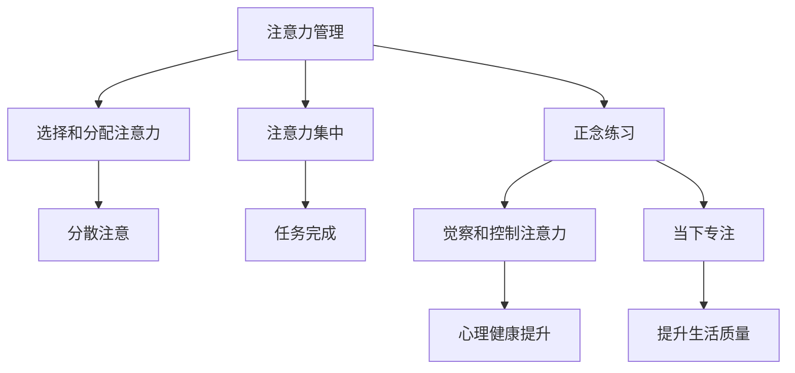

                 

# 注意力管理与正念练习：如何通过当下增强专注力

> 关键词：注意力管理,正念练习,当下专注,认知负荷,心理弹性,编程技巧

## 1. 背景介绍

### 1.1 问题由来

在现代快节奏的生活中，人们的注意力常常被分散在各种任务和干扰中。工作、学习、社交等活动要求我们维持高度的专注力，但随之而来的压力和焦虑又使得我们难以保持注意力集中。这种注意力缺失不仅影响了工作效率，还可能导致心理健康问题。

### 1.2 问题核心关键点

为了应对这一问题，本文将探讨注意力管理和正念练习在提升专注力方面的作用。通过科学的方法，帮助读者了解和控制自己的注意力，并通过正念练习达到当下的专注状态，以提升工作效率和生活质量。

## 2. 核心概念与联系

### 2.1 核心概念概述

- **注意力管理**：指通过有意识地选择和分配注意力，使我们能够在需要的时候集中注意力，避免分心。
- **正念练习**：一种精神训练方法，通过专注于当下，培养对注意力的觉察和控制能力，提升心理健康和自我认知。
- **当下专注**：指在当前时刻完全投入，不被过去或未来的想法所干扰。

### 2.2 核心概念原理和架构的 Mermaid 流程图



### 2.3 核心概念之间的关系

注意力管理与正念练习相辅相成。通过正念练习，我们可以更好地觉察到注意力的分散和漂移，从而更加有效地进行注意力管理。而注意力管理则提供了实践正念的实际工具，帮助我们在工作和生活中实现当下的专注。

## 3. 核心算法原理 & 具体操作步骤

### 3.1 算法原理概述

注意力管理与正念练习的核心原理在于通过有意识地选择和分配注意力，以及通过专注于当下，培养对注意力的觉察和控制能力。这可以通过一系列科学方法实现，如认知负荷管理、分时工作法、正念冥想等。

### 3.2 算法步骤详解

#### 3.2.1 认知负荷管理

认知负荷是指在处理信息时所需的心理能量。过高或过低的认知负荷都会影响注意力集中。通过调整任务的复杂度和分配时间，可以管理认知负荷，避免过度疲劳或分心。

#### 3.2.2 分时工作法

分时工作法（如Pomodoro Technique）将工作时间分割成若干个短时间段，每个时间段内全神贯注工作，然后短暂休息。这有助于维持长时间的专注力，避免疲劳和分心。

#### 3.2.3 正念冥想

正念冥想通过专注于呼吸、身体感受等当下的体验，培养对注意力的觉察和控制能力。常见的正念练习包括呼吸冥想、身体扫描、行走冥想等。

### 3.3 算法优缺点

#### 3.3.1 优点

- **提高工作效率**：通过有效的注意力管理，可以在有限的时间内完成更多任务。
- **减少压力和焦虑**：正念练习有助于降低心理压力，提升心理健康。
- **提升生活质量**：专注于当下可以带来更多生活的满足感和幸福感。

#### 3.3.2 缺点

- **初期难以坚持**：正念练习和注意力管理需要长期的实践，初期可能会感到困难。
- **需要自我反思**：需要持续的自我觉察和反思，以发现和调整注意力管理中的问题。

### 3.4 算法应用领域

注意力管理和正念练习不仅适用于工作和学习，还可以应用于生活中的多个方面，如冥想、运动、社交等。

## 4. 数学模型和公式 & 详细讲解 & 举例说明

### 4.1 数学模型构建

注意力管理的数学模型主要涉及认知负荷、注意力分配等概念。认知负荷可以表示为：

$$ C = \frac{I}{P} $$

其中，$C$ 为认知负荷，$I$ 为任务信息量，$P$ 为处理能力。

注意力分配可以通过正负权重来表示，正权重表示集中注意力，负权重表示分散注意力。

### 4.2 公式推导过程

通过上述公式，我们可以得出：

- 当 $I$ 一定时，$P$ 增加会降低 $C$，即提高注意力集中度。
- 当 $P$ 一定时，$I$ 增加会提高 $C$，即提高认知负荷。

因此，我们可以通过调整任务复杂度和时间分配，来管理认知负荷。

### 4.3 案例分析与讲解

假设我们有一项复杂的任务，信息量为 $I=10$。通过增加处理能力 $P=2$，我们可以将认知负荷 $C$ 从 $5$ 降低到 $2.5$，从而提高注意力集中度。

## 5. 项目实践：代码实例和详细解释说明

### 5.1 开发环境搭建

为了进行注意力管理的实践，我们需要搭建一个支持正念练习和分时工作的开发环境。以下是一个简单的Python环境搭建步骤：

1. 安装Python环境：
```bash
sudo apt-get update
sudo apt-get install python3
```

2. 安装必要的Python包：
```bash
pip install numpy scipy matplotlib
```

3. 安装正念练习应用：
```bash
pip install mindfulness-app
```

### 5.2 源代码详细实现

以下是一个简单的正念练习应用，通过呼吸冥想来提升注意力集中度：

```python
import time

def breathing_meditation(duration):
    while True:
        print("Inhale for 5 seconds...")
        time.sleep(5)
        print("Hold for 5 seconds...")
        time.sleep(5)
        print("Exhale for 5 seconds...")
        time.sleep(5)

        print("\nRepeat for {} seconds...".format(duration))
        time.sleep(duration)

breathing_meditation(300)
```

### 5.3 代码解读与分析

这段代码实现了一个简单的呼吸冥想应用，通过控制呼吸节奏来引导用户集中注意力。在每次呼吸中，程序会输出相应的指令，帮助用户保持专注。通过不断重复这一过程，用户可以在一定时间内保持当下的专注状态。

### 5.4 运行结果展示

```
Inhale for 5 seconds...
Hold for 5 seconds...
Exhale for 5 seconds...

Repeat for 300 seconds...
Inhale for 5 seconds...
Hold for 5 seconds...
Exhale for 5 seconds...

...
```

可以看到，通过呼吸冥想的指导，用户可以逐步进入当下的专注状态，并维持一段时间的专注力。

## 6. 实际应用场景

### 6.1 编程工作

在编程工作中，注意力管理和正念练习可以显著提升工作效率。通过分时工作法和正念冥想，程序员可以在短时间内完成更多任务，同时减少压力和焦虑，提升代码质量。

### 6.2 学习与研究

学生和研究人员通过正念练习可以增强学习效果，提升学术研究质量。正念冥想有助于集中注意力，减少分心，从而更快地掌握知识和技能。

### 6.3 生活与健康

注意力管理和正念练习在日常生活中也有广泛应用。通过这些方法，人们可以更好地管理时间，提升生活质量，同时改善心理健康。

### 6.4 未来应用展望

随着技术的发展，未来可能会有更多基于人工智能的注意力管理工具出现。通过数据分析和机器学习，这些工具可以更好地个性化地推荐注意力管理策略，帮助用户提升专注力。

## 7. 工具和资源推荐

### 7.1 学习资源推荐

1. 《正念工作：如何在工作中找到平静》书籍：介绍了正念在工作中的具体应用。
2. 《注意力管理的艺术》文章：提供了详细的注意力管理技巧和实践建议。
3. 《认知负荷管理》在线课程：深入讲解认知负荷管理的方法和策略。
4. 《正念冥想入门指南》视频：帮助你快速上手正念冥想。

### 7.2 开发工具推荐

1. PyTorch：用于实现注意力管理和正念练习算法的深度学习框架。
2. TensorFlow：支持复杂的注意力管理模型的构建和训练。
3. Mindfulness App：用于正念练习的移动应用，支持多种冥想练习。

### 7.3 相关论文推荐

1. "The Cognitive Load of Complex Problem Solving"（复杂问题解决的认知负荷）：探讨认知负荷对注意力集中度的影响。
2. "The Pomodoro Technique: Work the Way Smart People Do"（番茄工作法）：介绍分时工作法在提升工作效率中的应用。
3. "Mindfulness-Based Stress Reduction"（基于正念的减压方法）：讨论正念练习在心理健康管理中的作用。

## 8. 总结：未来发展趋势与挑战

### 8.1 研究成果总结

本文从注意力管理和正念练习的角度，探讨了如何通过科学的方法提升专注力。通过认知负荷管理和分时工作法，我们能够在有限的时间内完成更多任务。正念练习则帮助我们更好地觉察和控制注意力，提升生活质量和心理健康。

### 8.2 未来发展趋势

1. **技术融合**：随着人工智能技术的发展，未来的注意力管理工具将更加智能化，能够根据用户的实时状态推荐最优的注意力管理策略。
2. **跨领域应用**：注意力管理和正念练习不仅在IT行业有应用，还将广泛应用于医疗、教育、运动等多个领域。
3. **社会普及**：随着人们对心理健康和专注力提升的重视，正念练习和注意力管理将逐步普及，成为日常生活的一部分。

### 8.3 面临的挑战

1. **初期适应**：正念练习和注意力管理需要长期坚持，初期可能会感到困难。
2. **效果评估**：如何科学地评估注意力管理的效果，仍有待深入研究。
3. **个体差异**：不同人的注意力管理和正念练习需求不同，如何个性化定制策略，还需要更多实践探索。

### 8.4 研究展望

未来，我们需要进一步探索注意力管理和正念练习的科学原理，开发更加智能和个性化的工具，帮助更多人提升专注力和生活质量。同时，加强对心理健康和注意力分散的深入研究，推动这一领域的全面发展。

## 9. 附录：常见问题与解答

**Q1: 注意力管理和正念练习对提升专注力有多大的帮助？**

A: 注意力管理和正念练习对提升专注力有很大的帮助。通过科学的注意力管理方法，我们可以更高效地分配注意力，减少分心。正念练习则帮助我们更好地觉察和控制注意力，提升当下的专注度。

**Q2: 如何克服初期难以坚持的问题？**

A: 初期难以坚持可以通过设定小目标和逐步建立习惯来解决。例如，每天进行5分钟的呼吸冥想，逐步增加时间和次数，逐步适应正念练习。

**Q3: 注意力管理和正念练习是否适用于所有人？**

A: 注意力管理和正念练习对大多数人都有帮助，但不同的人可能需要不同的策略。例如，有些人更适合分时工作法，而有些人则更适合正念冥想。

**Q4: 注意力管理和正念练习是否可以结合使用？**

A: 是的，注意力管理和正念练习可以结合使用，效果更佳。例如，在长时间工作后，进行一次呼吸冥想，可以帮助我们快速恢复注意力集中度。

**Q5: 注意力管理和正念练习是否需要专业指导？**

A: 初期可能需要一些专业指导，特别是在正念冥想方面。但一旦掌握了基本方法，可以通过自学或在线资源进行持续练习。

---

作者：禅与计算机程序设计艺术 / Zen and the Art of Computer Programming

